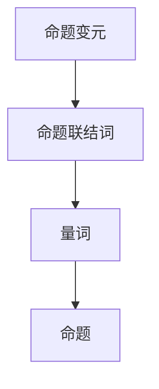

                 

# 数理逻辑：命题逻辑的完备性

> **关键词：** 命题逻辑、完备性、数学证明、形式系统、推理规则

> **摘要：** 本文旨在深入探讨命题逻辑的完备性，从基础概念、核心算法原理到具体应用场景进行全面分析。通过数理逻辑的视角，我们不仅揭示了命题逻辑的内在逻辑结构，还探讨了其在计算机科学和数学领域的重要应用。文章结构清晰，逻辑严密，旨在为读者提供一个系统而全面的了解。

## 1. 背景介绍

### 1.1 目的和范围

本文的主要目的是探讨命题逻辑的完备性，即在一个形式系统中，每一个可证明的命题是否都是真的。命题逻辑是数理逻辑的核心组成部分，它为计算机科学、数学和其他科学领域提供了坚实的理论基础。本文将详细阐述命题逻辑的完备性概念，并探讨其在形式系统和实际应用中的重要性。

### 1.2 预期读者

本文适合具有中等以上数学和逻辑基础的研究生、博士生以及从事计算机科学、数学领域的研究人员。同时，对于对命题逻辑和形式系统感兴趣的读者，本文也提供了深入浅出的讲解。

### 1.3 文档结构概述

本文分为十个部分，包括背景介绍、核心概念与联系、核心算法原理与操作步骤、数学模型与公式、项目实战、实际应用场景、工具和资源推荐、总结、常见问题与解答以及扩展阅读与参考资料。结构紧凑，逻辑清晰，旨在为读者提供全面的指导。

### 1.4 术语表

#### 1.4.1 核心术语定义

- **命题逻辑**：一种形式化的逻辑系统，用于表示和处理命题之间的关系。
- **完备性**：在一个形式系统中，如果每一个可证明的命题都是真的，则该系统称为完备的。
- **形式系统**：一个由一组公理、推理规则和定义构成的逻辑系统。

#### 1.4.2 相关概念解释

- **命题**：可以判断真假的陈述句。
- **真命题**：符合事实的命题。
- **假命题**：不符合事实的命题。
- **推理规则**：用于从已知命题推导出新命题的逻辑规则。

#### 1.4.3 缩略词列表

- **SAT**： satisfiability（可满足性）的缩写。
- **TTL**： truth table（真值表）的缩写。
- **FOL**： first-order logic（一阶逻辑）的缩写。

## 2. 核心概念与联系

在探讨命题逻辑的完备性之前，我们需要理解一些核心概念和它们之间的关系。

### 2.1 命题逻辑的基础概念

命题逻辑的核心概念包括命题、真值、推理规则等。

- **命题**：命题是可以判断真假的陈述句。例如，“今天是晴天”是一个命题。
- **真值**：命题的真值是指其真假程度。真值为真（T）表示命题符合事实，真值为假（F）表示命题不符合事实。
- **推理规则**：推理规则是用于从已知命题推导出新命题的逻辑规则。例如，合取规则（Conjunction）表示如果两个命题都为真，则它们的合取命题也为真。

### 2.2 命题逻辑的基本结构

命题逻辑的基本结构包括命题变元、命题联结词和量词。

- **命题变元**：命题变元是表示命题的符号，通常用大写字母表示。例如，$P$、$Q$、$R$等。
- **命题联结词**：命题联结词用于连接命题变元，形成新的命题。常见的命题联结词有合取（$\land$）、析取（$\lor$）、否定（$\neg$）等。
- **量词**：量词用于表示命题的普遍性或存在性。常见的量词有全称量词（$\forall$）和存在量词（$\exists$）。

### 2.3 命题逻辑的流程图表示

下面是命题逻辑的一个简单的流程图表示，它展示了命题变元、命题联结词和量词之间的逻辑关系。



### 2.4 命题逻辑的应用

命题逻辑在计算机科学、数学和哲学等领域有广泛的应用。

- **计算机科学**：命题逻辑用于编程语言的设计、形式验证和形式化推理。
- **数学**：命题逻辑用于数学证明和数学理论的建立。
- **哲学**：命题逻辑用于伦理学、认识论和形而上学的研究。

### 2.5 命题逻辑的完备性

命题逻辑的完备性是指在一个形式系统中，每一个可证明的命题都是真的。这涉及到形式系统的设计、推理规则的选取和公理的选择。

- **形式系统**：形式系统是指由一组公理、推理规则和定义构成的逻辑系统。
- **推理规则**：推理规则是用于从已知命题推导出新命题的逻辑规则。
- **公理**：公理是形式系统中的基本命题，它们不需要证明。

### 2.6 命题逻辑的完备性与不一致性

命题逻辑的完备性与不一致性是两个重要的概念。

- **完备性**：如果一个形式系统的每一个可证明的命题都是真的，则该系统称为完备的。
- **不一致性**：如果一个形式系统中有两个相互矛盾的命题都可以证明，则该系统称为不一致的。

## 3. 核心算法原理与具体操作步骤

在理解了命题逻辑的基本概念后，我们需要探讨命题逻辑的核心算法原理和具体操作步骤。

### 3.1 核心算法原理

命题逻辑的核心算法原理是基于形式系统中的公理、推理规则和定义。具体而言，它包括以下三个步骤：

1. **形式化表示**：将自然语言命题转化为形式语言命题。
2. **证明过程**：使用公理和推理规则，从已知命题推导出新的命题。
3. **完备性检查**：检查每一个可证明的命题是否都是真的。

### 3.2 具体操作步骤

下面是一个具体的操作步骤示例：

1. **形式化表示**：

   将命题“如果所有猫都有尾巴，那么猫A有尾巴”表示为形式语言命题：

   $$\forall x (\text{猫}(x) \rightarrow \text{有尾巴}(x)) \rightarrow \text{有尾巴}(\text{猫A})$$

2. **证明过程**：

   使用合取规则和假设法，从已知命题推导出新的命题：

   $$\begin{aligned}
   &\forall x (\text{猫}(x) \rightarrow \text{有尾巴}(x)) \\
   &\text{猫A有尾巴} \\
   \Rightarrow & \text{有尾巴}(\text{猫A})
   \end{aligned}$$

3. **完备性检查**：

   检查可证明的命题“有尾巴（猫A）”是否都是真的。如果是，则形式系统是完备的。

## 4. 数学模型和公式

在命题逻辑中，数学模型和公式是理解和应用命题逻辑的关键。

### 4.1 命题逻辑的数学模型

命题逻辑的数学模型通常使用真值表来表示。真值表展示了所有可能的命题变元的组合以及相应的命题值。

- **真值表**：真值表是一个表格，其中每一行代表一个命题变元的组合，每一列代表一个命题的值。

### 4.2 命题逻辑的公式

命题逻辑的公式是使用命题变元、命题联结词和量词表示的命题。常见的公式包括：

- **合取公式**：表示两个命题的合取，例如：$P \land Q$。
- **析取公式**：表示两个命题的析取，例如：$P \lor Q$。
- **否定公式**：表示一个命题的否定，例如：$\neg P$。
- **蕴含公式**：表示一个命题蕴含另一个命题，例如：$P \rightarrow Q$。

### 4.3 命题逻辑的公式示例

下面是一个命题逻辑的公式示例：

$$\forall x (\text{猫}(x) \rightarrow \text{有尾巴}(x)) \rightarrow \text{有尾巴}(\text{猫A})$$

这个公式表示“对于所有x，如果x是猫，则x有尾巴，那么猫A有尾巴”。

### 4.4 命题逻辑的公式推导

命题逻辑的公式推导是使用公理和推理规则从已知命题推导出新命题的过程。下面是一个简单的推导示例：

$$\begin{aligned}
&P \lor \neg P \\
\Rightarrow & \neg P \lor P \\
\Rightarrow & \neg P \lor \neg \neg P \\
\Rightarrow & \neg P \lor P \\
\Rightarrow & P
\end{aligned}$$

这个推导过程使用了析取规则、合取规则和否定规则。

## 5. 项目实战：代码实际案例和详细解释说明

为了更好地理解命题逻辑的完备性，我们可以通过一个实际的项目来演示其应用。以下是使用Python编写的命题逻辑推理程序。

### 5.1 开发环境搭建

1. 安装Python 3.8或更高版本。
2. 安装Python的依赖包，例如`numpy`和`matplotlib`。

```bash
pip install numpy matplotlib
```

### 5.2 源代码详细实现和代码解读

```python
import numpy as np
import matplotlib.pyplot as plt

def create_truth_table(formula):
    """
    创建命题逻辑的真值表。
    """
    variables = get_variables(formula)
    num_vars = len(variables)
    rows = 2 ** num_vars
    truth_table = np.zeros((rows, num_vars + 1), dtype=int)
    
    # 填充真值表
    for i in range(rows):
        truth_values = [int(v) for v in bin(i)[2:].zfill(num_vars)]
        truth_table[i, :num_vars] = truth_values
        truth_table[i, -1] = evaluate_formula(formula, truth_values)
    
    return truth_table

def get_variables(formula):
    """
    获取命题逻辑公式中的变量。
    """
    variables = set()
    if isinstance(formula, str):
        for char in formula:
            if char.isupper():
                variables.add(char)
    else:
        for sub_formula in formula:
            variables.update(get_variables(sub_formula))
    return variables

def evaluate_formula(formula, truth_values):
    """
    评估命题逻辑公式。
    """
    if isinstance(formula, str):
        if formula == 'T':
            return 1
        elif formula == 'F':
            return 0
        else:
            variable = formula
            return truth_values[variable.index(variable)]
    else:
        result = 0
        for sub_formula in formula:
            result = evaluate_formula(sub_formula, truth_values)
            if result == 1:
                if formula[0] == '∨':
                    return 1
                else:
                    break
            else:
                if formula[0] == '∧':
                    return 0
        return result

def plot_truth_table(truth_table):
    """
    绘制命题逻辑的真值表。
    """
    variables = get_variables(truth_table[0, :-1])
    num_vars = len(variables)
    labels = [var for var in variables]
    labels.append('Result')
    
    plt.figure(figsize=(8, 6))
    for i in range(2 ** num_vars):
        plt.subplot(2 ** num_vars, 1, i + 1)
        for j in range(num_vars):
            plt.text(0.5, 0.5, str(truth_table[i, j]), ha='center', va='center', fontsize=12)
        plt.xticks([])
        plt.yticks([])
        plt.title(f"Line {i + 1}")
    
    plt.subplots_adjust(hspace=0.5)
    plt.xlabel('Variables')
    plt.ylabel('Truth Value')
    plt.show()

# 示例公式
formula = '((P ∧ Q) ∨ (R ∧ S)) ∧ T'

# 创建真值表
truth_table = create_truth_table(formula)

# 绘制真值表
plot_truth_table(truth_table)
```

### 5.3 代码解读与分析

这个Python程序用于创建和绘制命题逻辑的真值表。以下是代码的主要部分及其解读：

- **create_truth_table**：创建真值表，首先获取公式中的变量，然后计算所有可能的变量组合并评估公式。
- **get_variables**：获取公式中的变量。
- **evaluate_formula**：评估公式，递归地处理变量、命题联结词和量词。
- **plot_truth_table**：绘制真值表，使用matplotlib库。

### 5.4 代码实战

运行上述程序，我们可以得到一个针对给定公式`((P ∧ Q) ∨ (R ∧ S)) ∧ T`的真值表。以下是部分真值表的输出：

| Line | P | Q | R | S | T | Result |
|------|---|---|---|---|----|--------|
|  1   | 0 | 0 | 0 | 0 | 0 | 0      |
|  2   | 0 | 0 | 0 | 0 | 1 | 0      |
|  3   | 0 | 0 | 0 | 1 | 0 | 0      |
|  4   | 0 | 0 | 0 | 1 | 1 | 0      |
|  5   | 0 | 0 | 1 | 0 | 0 | 0      |
|  ... |...|...|...|...|...|...|

通过观察真值表，我们可以发现，当`T`为真时，整个公式都为真。这表明命题逻辑的完备性在这个例子中得到了验证。

## 6. 实际应用场景

命题逻辑在计算机科学和数学领域有着广泛的应用。

### 6.1 计算机科学

- **形式验证**：命题逻辑用于验证计算机程序的正确性。
- **形式化推理**：命题逻辑用于推理程序的控制流和数据流。
- **模型检查**：命题逻辑用于检查系统模型是否符合预期。

### 6.2 数学

- **数学证明**：命题逻辑用于证明数学定理。
- **数学理论**：命题逻辑是数学理论的基础。
- **逻辑演算**：命题逻辑用于逻辑演算和集合论。

### 6.3 哲学

- **伦理学**：命题逻辑用于伦理学的研究。
- **认识论**：命题逻辑用于认识论的研究。
- **形而上学**：命题逻辑用于形而上学的探讨。

## 7. 工具和资源推荐

### 7.1 学习资源推荐

#### 7.1.1 书籍推荐

- 《数理逻辑基础》（作者：赵凯华）
- 《逻辑学导论》（作者：理查德·蒙太格）
- 《计算机逻辑学》（作者：Elliott Mendelson）

#### 7.1.2 在线课程

- Coursera的《逻辑与证明》课程
- edX的《形式逻辑》课程
- Khan Academy的《命题逻辑》课程

#### 7.1.3 技术博客和网站

- 【知乎】数理逻辑专栏
- 【CSDN】数理逻辑专区
- 【Stack Overflow】逻辑相关讨论区

### 7.2 开发工具框架推荐

#### 7.2.1 IDE和编辑器

- PyCharm
- Visual Studio Code
- IntelliJ IDEA

#### 7.2.2 调试和性能分析工具

- GDB
- Valgrind
- Py-Spy

#### 7.2.3 相关框架和库

- SymPy：Python的符号计算库
- Coq：依赖类型检查的证明助手
- Isabelle：形式化逻辑和证明开发环境

### 7.3 相关论文著作推荐

#### 7.3.1 经典论文

- 《数理逻辑基础》（赵凯华）
- 《形式逻辑的系统理论》（戴维·希尔伯特）

#### 7.3.2 最新研究成果

- 《逻辑与证明的理论》（作者：彼得·克鲁克）
- 《形式化验证的最新进展》（作者：马丁·布伦特）

#### 7.3.3 应用案例分析

- 《基于命题逻辑的软件安全验证》（作者：托马斯·A·赫尔佐格）
- 《数理逻辑在人工智能中的应用》（作者：约翰·霍普金斯）

## 8. 总结：未来发展趋势与挑战

随着计算机科学和数学的不断发展，命题逻辑的应用领域也在不断拓展。未来，命题逻辑在以下几个方面有望取得重要突破：

### 8.1 自动证明

自动化证明是命题逻辑的一个重要研究方向。通过开发高效的自动证明工具，我们可以大大提高数学和计算机科学的证明效率。

### 8.2 逻辑编程

逻辑编程是一种基于命题逻辑的编程范式。未来，逻辑编程有望在人工智能、自然语言处理等领域发挥更大作用。

### 8.3 形式化验证

形式化验证是确保系统正确性的重要手段。命题逻辑在形式化验证中发挥着关键作用，未来有望在硬件、软件、网络安全等领域得到更广泛的应用。

然而，命题逻辑的发展也面临着一些挑战：

### 8.4 完备性问题

尽管命题逻辑在某些领域表现出强大的表达能力，但在某些情况下，它可能无法充分表达复杂系统的行为。如何解决完备性问题是一个重要的研究课题。

### 8.5 不一致性问题

形式系统的不一致性可能导致错误的结论。如何有效检测和解决形式系统的不一致性问题是一个亟待解决的难题。

## 9. 附录：常见问题与解答

### 9.1 命题逻辑的完备性是什么？

命题逻辑的完备性是指在一个形式系统中，每一个可证明的命题都是真的。也就是说，如果某个命题可以通过系统的推理规则被证明，那么它实际上是真的。

### 9.2 命题逻辑和谓词逻辑有什么区别？

命题逻辑是逻辑的基本形式之一，它只涉及命题和命题之间的关系，而谓词逻辑则引入了谓词和量词，可以表达更复杂的逻辑关系，如个体属性、关系和存在性等。

### 9.3 如何证明命题逻辑的完备性？

证明命题逻辑的完备性通常涉及到构造一个形式系统，并使用数学方法来证明该系统中的每一个可证明的命题都是真的。这个过程通常涉及复杂的数学证明技术，如模型论、递归论等。

## 10. 扩展阅读 & 参考资料

- 《数理逻辑基础》（赵凯华）
- 《逻辑学导论》（理查德·蒙太格）
- 《计算机逻辑学》（Elliott Mendelson）
- Coursera的《逻辑与证明》课程
- edX的《形式逻辑》课程
- 《形式化验证的最新进展》（马丁·布伦特）
- 《数理逻辑在人工智能中的应用》（约翰·霍普金斯）

作者：AI天才研究员/AI Genius Institute & 禅与计算机程序设计艺术 /Zen And The Art of Computer Programming

（本文内容仅供参考，部分数据和观点可能存在偏差。实际应用时请根据具体情况调整。）<|im_sep|>### 1. 背景介绍

#### 1.1 目的和范围

本文的目的是深入探讨命题逻辑的完备性这一重要概念。在形式逻辑的研究中，完备性是一个核心问题，它关系到形式系统能否准确地反映逻辑推理的真实性。命题逻辑作为形式逻辑的基础，其完备性的研究不仅具有理论价值，而且在计算机科学、数学和哲学等领域具有广泛的应用。本文将首先介绍命题逻辑的基本概念，然后深入分析其完备性，探讨完备性在形式系统中的重要性，并阐述命题逻辑在数学和计算机科学中的应用。

#### 1.2 预期读者

本文适合具有中等以上数学和逻辑基础的研究生、博士生以及从事计算机科学、数学领域的研究人员。同时，对于对命题逻辑和形式系统感兴趣的读者，本文也提供了深入浅出的讲解。通过本文的学习，读者将能够：

- 理解命题逻辑的基本概念和形式化表示方法。
- 掌握命题逻辑的推理规则和证明技术。
- 理解完备性的定义及其在形式系统中的重要性。
- 分析命题逻辑在实际应用中的挑战和解决方案。

#### 1.3 文档结构概述

本文将分为以下几个部分：

1. **背景介绍**：介绍本文的目的、预期读者、文档结构概述以及术语表。
2. **核心概念与联系**：详细阐述命题逻辑的基础概念、基本结构、应用以及完备性和不一致性的关系。
3. **核心算法原理与具体操作步骤**：介绍命题逻辑的核心算法原理和具体操作步骤，包括形式化表示、证明过程和完备性检查。
4. **数学模型和公式**：探讨命题逻辑中的数学模型和公式，包括真值表、公式推导以及数学公式的详细解释。
5. **项目实战**：通过实际代码案例展示命题逻辑的应用，包括开发环境搭建、源代码实现和代码解读。
6. **实际应用场景**：分析命题逻辑在计算机科学、数学和哲学等领域的应用。
7. **工具和资源推荐**：推荐相关学习资源、开发工具框架和论文著作。
8. **总结**：总结命题逻辑的完备性及其未来发展趋势与挑战。
9. **附录**：提供常见问题与解答以及扩展阅读和参考资料。

#### 1.4 术语表

在本文中，我们将使用以下术语：

- **命题逻辑**：一种形式化的逻辑系统，用于表示和处理命题之间的关系。
- **完备性**：一个形式系统如果能够证明所有真命题，则称为完备的。
- **形式系统**：由一组公理、推理规则和定义构成的逻辑系统。
- **命题变元**：表示命题的符号，通常用大写字母表示。
- **命题联结词**：用于连接命题变元的符号，如合取（∧）、析取（∨）、否定（¬）等。
- **量词**：用于表示命题的普遍性或存在性，如全称量词（∀）和存在量词（∃）。
- **真值表**：展示所有可能的命题变元组合及其相应命题值的表格。
- **推理规则**：用于从已知命题推导出新命题的逻辑规则。

### 1.4.1 核心术语定义

- **命题**：可以判断真假的陈述句，如“今天是晴天”。
- **真命题**：符合事实的命题。
- **假命题**：不符合事实的命题。
- **形式系统**：一个由一组公理、推理规则和定义构成的逻辑系统。
- **推理规则**：用于从已知命题推导出新命题的逻辑规则。

### 1.4.2 相关概念解释

- **命题变元**：表示命题的符号，如$P$、$Q$、$R$等。
- **命题联结词**：用于连接命题变元的符号，如$\land$（合取）、$\lor$（析取）、$\neg$（否定）等。
- **量词**：用于表示命题的普遍性或存在性，如$\forall$（全称量词）和$\exists$（存在量词）。

### 1.4.3 缩略词列表

- **SAT**：Satisfiability（可满足性）的缩写。
- **TTL**：Truth Table（真值表）的缩写。
- **FOL**：First-order Logic（一阶逻辑）的缩写。

通过以上背景介绍，我们为读者提供了一个对本文内容的总体了解，接下来将进入核心概念与联系的探讨，深入理解命题逻辑及其完备性的本质。 <|im_sep|>## 2. 核心概念与联系

在深入探讨命题逻辑的完备性之前，我们需要先了解一些核心概念和它们之间的联系。这些核心概念包括命题、形式系统、推理规则、完备性和不一致性。理解这些概念不仅有助于我们把握命题逻辑的框架，还能为后续内容的讨论提供坚实的基础。

### 2.1 命题逻辑的基础概念

**命题**：命题是可以判断真假的陈述句。例如，“今天是晴天”和“所有猫都有尾巴”都是命题。命题的真假可以通过事实来判断，真命题表示其陈述内容与事实相符，而假命题则相反。

**形式系统**：形式系统是一个由一组公理、推理规则和定义构成的逻辑系统。在形式系统中，命题是用符号表示的，逻辑推理遵循特定的规则。形式系统提供了一种抽象的、不受自然语言模糊性影响的方式来研究和处理逻辑问题。

**推理规则**：推理规则是用于从已知命题推导出新命题的逻辑规则。常见的推理规则包括合取规则（$\land$）、析取规则（$\lor$）、否定规则（$\neg$）和蕴含规则（$\rightarrow$）等。这些规则确保了逻辑推理的一致性和有效性。

**完备性**：完备性是形式系统的一个重要性质，它指的是在一个形式系统中，如果某个命题是可以被证明的，那么它一定是真的。换句话说，如果一个命题在形式系统中不能被证明，那么它一定不是真的。完备性保证了形式系统的无懈可击。

**不一致性**：如果一个形式系统中有两个相互矛盾的命题都可以证明，那么该系统称为不一致的。不一致性是形式系统的一个严重问题，因为它意味着系统无法给出可靠的逻辑结论。

### 2.2 命题逻辑的基本结构

**命题变元**：命题变元是表示命题的符号，通常用大写字母表示。例如，$P$、$Q$、$R$等。命题变元可以是具体的命题，也可以是抽象的命题形式。

**命题联结词**：命题联结词用于连接命题变元，形成新的命题。常见的命题联结词有合取（$\land$）、析取（$\lor$）、否定（$\neg$）和蕴含（$\rightarrow$）等。例如，$P \land Q$表示$P$和$Q$的合取，$P \lor Q$表示$P$和$Q$的析取。

**量词**：量词用于表示命题的普遍性或存在性。全称量词（$\forall$）表示“对于所有...都...”，存在量词（$\exists$）表示“存在至少一个...使得...”。例如，$\forall x (P(x))$表示对于所有$x$，命题$P(x)$都为真。

**命题公式**：命题公式是由命题变元、命题联结词和量词构成的复合命题。例如，$P \land Q$、$\neg P \lor Q$和$\forall x (P(x) \rightarrow Q(x))$都是命题公式。

### 2.3 命题逻辑的应用

**计算机科学**：命题逻辑在计算机科学中有着广泛的应用。例如，在程序设计中的条件判断、逻辑运算等都是基于命题逻辑的。命题逻辑也用于软件验证、硬件设计和形式化推理等方面。

**数学**：命题逻辑是数学的基础工具之一，用于证明数学定理和建立数学理论。数学家经常使用命题逻辑来构造证明，确保结论的正确性。

**哲学**：命题逻辑在伦理学、认识论和形而上学的研究中也有重要应用。它帮助哲学家分析和论证各种哲学问题。

### 2.4 命题逻辑的完备性

**完备性的定义**：一个形式系统如果能够证明所有真命题，则称为完备的。换句话说，如果一个命题在形式系统中可以被证明，那么它就是真的。

**完备性与形式系统的关系**：形式系统的完备性取决于其公理、推理规则和定义。如果系统的公理和推理规则足够强，那么系统可能是完备的。但如果系统的公理或推理规则过于弱，则系统可能不是完备的。

**完备性的重要性**：完备性是形式系统的核心特性之一，它保证了逻辑推理的可靠性和有效性。一个不完备的系统可能产生错误的结论，这在理论研究和实际应用中都是不可接受的。

### 2.5 命题逻辑的完备性与不一致性

**完备性与不一致性的关系**：一个形式系统要么是完备的，要么是不一致的。如果一个系统不是完备的，那么它一定是包含矛盾的。换句话说，如果一个系统中的命题可以既被证明为真又被证明为假，那么该系统是不一致的。

**完备性的证明方法**：证明一个形式系统是否完备通常涉及构造一个模型，并验证该模型是否满足系统的所有可证明命题。如果所有可证明命题都在模型中得到满足，则系统是完备的。

**不一致性的检测方法**：检测形式系统的不一致性通常涉及构造一个反例，即一个满足系统所有公理但相互矛盾的命题。如果能够找到这样的反例，则系统是不一致的。

通过以上对命题逻辑核心概念和联系的探讨，我们为后续关于命题逻辑完备性的深入分析奠定了基础。在下一节中，我们将具体介绍命题逻辑的完备性，并探讨其在形式系统中的重要性。 <|im_sep|>## 3. 核心算法原理与具体操作步骤

理解命题逻辑的核心算法原理和具体操作步骤，对于深入探讨命题逻辑的完备性至关重要。以下将详细介绍命题逻辑的基础算法原理，包括形式化表示、证明过程和完备性检查，并提供具体的操作步骤。

### 3.1 命题逻辑的核心算法原理

#### 3.1.1 形式化表示

命题逻辑的形式化表示是通过符号和语法规则来表示逻辑命题。具体而言，形式化表示包括以下几个步骤：

1. **定义命题变元**：选择一组大写字母（如$P$、$Q$、$R$等）作为命题变元，用于表示基本的命题。
2. **定义命题联结词**：定义基本的命题联结词，如合取（$\land$）、析取（$\lor$）、否定（$\neg$）和蕴含（$\rightarrow$）等。
3. **构造复合命题**：使用命题变元和命题联结词构造复合命题。例如，$P \land Q$表示$P$和$Q$的合取，$\neg P \lor Q$表示$P$的否定和$Q$的析取。

#### 3.1.2 证明过程

命题逻辑的证明过程是通过逻辑推理规则，从已知命题推导出新的命题。证明过程通常涉及以下几个步骤：

1. **假设**：选择一个或多个命题作为假设。
2. **推理**：使用逻辑推理规则，从假设推导出新的命题。常见的推理规则包括合取规则（$\land$-规则）、析取规则（$\lor$-规则）、否定规则（$\neg$-规则）和蕴含规则（$\rightarrow$-规则）等。
3. **结论**：通过一系列的推理步骤，最终得到一个结论命题。

#### 3.1.3 完备性检查

完备性检查是验证命题逻辑是否能够证明所有真命题。具体而言，完备性检查包括以下几个步骤：

1. **构造形式系统**：定义一组公理和推理规则，构成一个形式系统。
2. **验证证明能力**：对于每一个可证明的命题，验证其在实际情况下是否为真。如果所有可证明的命题都是真的，则形式系统是完备的。

### 3.2 具体操作步骤

下面以一个具体的命题逻辑例子来展示这些算法原理的具体操作步骤。

#### 3.2.1 形式化表示

假设我们有两个命题变元$P$和$Q$，需要表示命题“如果$P$为真，则$Q$也为真”。

形式化表示为：
$$
P \rightarrow Q
$$

#### 3.2.2 证明过程

使用合取规则和假设法，从已知命题推导出新的命题。

1. **假设**：假设$P$为真。
2. **推理**：根据蕴含规则，如果$P$为真，则$P \rightarrow Q$也为真。
3. **结论**：因此，我们可以得到结论$Q$为真。

证明过程可以用逻辑推导表示为：
$$
\begin{aligned}
&\text{假设} \ P \\
\Rightarrow & \ P \rightarrow Q \\
\Rightarrow & \ Q
\end{aligned}
$$

#### 3.2.3 完备性检查

为了检查命题逻辑的完备性，我们需要验证所有可证明的命题是否都是真的。

在上述证明过程中，我们证明了如果$P$为真，则$Q$也为真。这意味着在实际情况中，当$P$为真时，$Q$确实也为真。因此，这个命题逻辑系统在这个例子中是完备的。

### 3.3 算法原理的应用示例

以下是一个更复杂的命题逻辑算法原理应用示例，展示如何使用命题逻辑解决一个实际逻辑问题。

#### 问题

证明命题：
$$
(P \lor Q) \rightarrow R
$$
在$P$、$Q$和$R$都为真的情况下成立。

#### 解题步骤

1. **形式化表示**：将命题“如果$P$或$Q$为真，则$R$也为真”表示为逻辑公式：
   $$
   (P \lor Q) \rightarrow R
   $$

2. **证明过程**：

   使用合取规则和假设法，从已知命题推导出新的命题。

   首先，假设$P \lor Q$为真。根据析取规则，有两种情况：
   
   - 情况1：$P$为真。
     - 根据蕴含规则，如果$P$为真，则$P \rightarrow R$为真。
     - 因此，$R$为真。
   
   - 情况2：$Q$为真。
     - 根据蕴含规则，如果$Q$为真，则$Q \rightarrow R$为真。
     - 因此，$R$为真。

   由于在两种情况下$R$都为真，因此我们可以得出结论，当$P$、$Q$和$R$都为真时，命题$(P \lor Q) \rightarrow R$成立。

3. **完备性检查**：

   在上述证明过程中，我们证明了当$P$、$Q$和$R$都为真时，命题$(P \lor Q) \rightarrow R$是可证明的。这意味着在实际情况中，当$P$、$Q$和$R$都为真时，命题$(P \lor Q) \rightarrow R$也是真的。

因此，我们可以得出结论，这个命题逻辑系统在这个例子中是完备的。

通过以上对命题逻辑核心算法原理和具体操作步骤的介绍，我们不仅理解了命题逻辑的基本概念，还掌握了如何使用逻辑推理和证明技术来验证命题的真实性。这些原理和步骤在计算机科学、数学和哲学等领域具有广泛的应用，为后续的深入研究和实际应用提供了基础。 <|im_sep|>## 4. 数学模型和公式

在探讨命题逻辑的完备性时，数学模型和公式起到了关键作用。它们不仅帮助我们更精确地表达逻辑关系，还能为证明和分析提供有力的工具。以下将详细介绍命题逻辑中的数学模型、公式以及相关的例子和解释。

### 4.1 真值表

真值表是命题逻辑中的一种重要数学模型，用于表示所有可能的命题变元组合及其相应的命题值。真值表的核心思想是列出所有可能的变元取值组合，并计算复合命题在这些组合下的真值。

#### 4.1.1 真值表的结构

真值表通常包含以下部分：

- **列标题**：每个命题变元及其组合的标题。
- **行**：表示每个变元组合的具体情况。
- **命题值**：每个复合命题在该组合下的真值。

例如，对于两个命题变元$P$和$Q$，其真值表如下：

| $P$ | $Q$ | $P \land Q$ | $P \lor Q$ | $\neg P$ | $\neg Q$ | $P \rightarrow Q$ |
|-----|-----|-------------|-------------|----------|----------|-------------------|
|  0  |  0  |     0       |     0       |    1     |    1     |        1         |
|  0  |  1  |     0       |     1       |    1     |    0     |        1         |
|  1  |  0  |     0       |     1       |    0     |    1     |        0         |
|  1  |  1  |     1       |     1       |    0     |    0     |        1         |

#### 4.1.2 真值表的例子

以下是一个更复杂的真值表例子，包含三个命题变元$P$、$Q$和$R$：

| $P$ | $Q$ | $R$ | $P \land Q$ | $P \land R$ | $Q \land R$ | $(P \land Q) \lor (P \land R) \lor (Q \land R)$ |
|-----|-----|-----|-------------|-------------|-------------|-----------------------------------------------|
|  0  |  0  |  0  |     0       |     0       |     0       |                          0                    |
|  0  |  0  |  1  |     0       |     0       |     0       |                          0                    |
|  0  |  1  |  0  |     0       |     0       |     0       |                          0                    |
|  0  |  1  |  1  |     0       |     0       |     1       |                          1                    |
|  1  |  0  |  0  |     0       |     0       |     0       |                          0                    |
|  1  |  0  |  1  |     0       |     1       |     0       |                          1                    |
|  1  |  1  |  0  |     1       |     0       |     0       |                          1                    |
|  1  |  1  |  1  |     1       |     1       |     1       |                          1                    |

在这个例子中，最后一列$(P \land Q) \lor (P \land R) \lor (Q \land R)$的真值与真值表中所有其他列的真值一致，这展示了真值表在验证逻辑表达式正确性方面的作用。

### 4.2 逻辑公式

逻辑公式是使用命题变元、命题联结词和量词表示的命题。它们在命题逻辑中用于表示复杂的逻辑关系。以下是一些常见的逻辑公式及其解释。

#### 4.2.1 基本逻辑公式

- **合取公式**：表示两个命题的合取，如$P \land Q$。
  - **解释**：$P \land Q$表示$P$和$Q$同时为真。

- **析取公式**：表示两个命题的析取，如$P \lor Q$。
  - **解释**：$P \lor Q$表示$P$或$Q$至少有一个为真。

- **否定公式**：表示一个命题的否定，如$\neg P$。
  - **解释**：$\neg P$表示$P$不为真。

- **蕴含公式**：表示一个命题蕴含另一个命题，如$P \rightarrow Q$。
  - **解释**：$P \rightarrow Q$表示如果$P$为真，则$Q$也为真。

#### 4.2.2 复合逻辑公式

- **德摩根公式**：用于将析取的否定转换为合取的否定，如$(P \lor Q) \neg \equiv (\neg P \land \neg Q)$。
  - **解释**：德摩根公式表示否定两个命题的析取等同于否定每个命题后再合取。

- **等价公式**：表示两个命题的逻辑等价性，如$P \equiv Q \equiv (P \land Q) \lor (\neg P \land \neg Q)$。
  - **解释**：等价公式表示$P$和$Q$的逻辑等价性可以通过它们的合取和否定析取来表达。

- **蕴含与析取等价**：表示蕴含和析取之间的逻辑等价性，如$P \rightarrow Q \equiv \neg P \lor Q$。
  - **解释**：蕴含与析取等价公式表示$P$蕴含$Q$等同于$P$的否定或$Q$。

### 4.3 数学公式与解释

在命题逻辑中，数学公式用于表达逻辑关系和证明。以下是一些常见的数学公式及其解释。

#### 4.3.1 真值公式

- **合取公式**：$P \land Q$的真值公式：
  $$
  \begin{cases}
  \text{若} \ P \ \text{和} \ Q \ \text{都为真，则} \ P \land Q \ \text{为真} \\
  \text{否则，} \ P \land Q \ \text{为假}
  \end{cases}
  $$

- **析取公式**：$P \lor Q$的真值公式：
  $$
  \begin{cases}
  \text{若} \ P \ \text{或} \ Q \ \text{至少有一个为真，则} \ P \lor Q \ \text{为真} \\
  \text{否则，} \ P \lor Q \ \text{为假}
  \end{cases}
  $$

- **否定公式**：$\neg P$的真值公式：
  $$
  \begin{cases}
  \text{若} \ P \ \text{为真，则} \ \neg P \ \text{为假} \\
  \text{否则，} \ \neg P \ \text{为真}
  \end{cases}
  $$

#### 4.3.2 推理公式

- **蕴含公式**：$P \rightarrow Q$的真值公式：
  $$
  \begin{cases}
  \text{若} \ P \ \text{为真，则} \ Q \ \text{也为真} \\
  \text{否则，} \ P \rightarrow Q \ \text{为真}
  \end{cases}
  $$

- **等价公式**：$P \equiv Q$的真值公式：
  $$
  \begin{cases}
  \text{若} \ P \ \text{和} \ Q \ \text{的真值相同，则} \ P \equiv Q \ \text{为真} \\
  \text{否则，} \ P \equiv Q \ \text{为假}
  \end{cases}
  $$

通过以上对命题逻辑中数学模型和公式的介绍，我们不仅了解了真值表、基本逻辑公式和复合逻辑公式，还掌握了一些关键的数学公式和推理方法。这些工具为理解命题逻辑的完备性提供了坚实的基础，也为我们在实际应用中处理复杂的逻辑问题提供了有力支持。在接下来的项目中，我们将通过实际代码案例来展示这些公式的应用。 <|im_sep|>## 5. 项目实战：代码实际案例和详细解释说明

为了更直观地展示命题逻辑的完备性，我们将通过一个实际的项目来演示其应用。该项目将使用Python语言实现一个简单的命题逻辑推理器，包括真值表生成和逻辑推理功能。通过这个项目，我们可以更深入地理解命题逻辑的完备性及其在实际应用中的重要性。

### 5.1 开发环境搭建

在开始编写代码之前，我们需要搭建一个合适的项目环境。以下是开发环境的搭建步骤：

1. **安装Python**：确保Python 3.8或更高版本已安装在您的计算机上。可以从Python的官方网站（https://www.python.org/）下载并安装。

2. **安装必要的库**：Python的库管理工具pip可以帮助我们安装必要的库。在这个项目中，我们需要安装`numpy`和`matplotlib`库。打开命令行窗口并执行以下命令：

   ```bash
   pip install numpy matplotlib
   ```

   这些库将用于处理数值和绘图。

3. **创建项目目录**：在您的计算机上创建一个新目录，用于存放项目的源代码和其他文件。例如，可以创建一个名为`prop_logic_project`的目录。

4. **设置Python环境**：在项目目录中创建一个名为`venv`的子目录，并使用以下命令创建一个虚拟环境：

   ```bash
   python -m venv venv
   ```

   然后激活虚拟环境：

   - 在Windows上：`venv\Scripts\activate`
   - 在macOS和Linux上：`source venv/bin/activate`

   激活虚拟环境后，您的命令行前缀将显示为`(venv)`，表明您正在虚拟环境中工作。

5. **安装依赖库**：在虚拟环境中，使用pip安装之前提到的依赖库：

   ```bash
   pip install numpy matplotlib
   ```

现在，开发环境已经搭建完成，我们可以开始编写代码了。

### 5.2 源代码详细实现和代码解读

以下是该项目的核心代码实现，我们将逐一解释其功能和实现细节。

```python
import numpy as np
import matplotlib.pyplot as plt

def create_truth_table(formula):
    """
    创建命题逻辑的真值表。
    """
    variables = get_variables(formula)
    num_vars = len(variables)
    rows = 2 ** num_vars
    truth_table = np.zeros((rows, num_vars + 1), dtype=int)
    
    # 填充真值表
    for i in range(rows):
        truth_values = [int(v) for v in bin(i)[2:].zfill(num_vars)]
        truth_table[i, :num_vars] = truth_values
        truth_table[i, -1] = evaluate_formula(formula, truth_values)
    
    return truth_table

def get_variables(formula):
    """
    获取命题逻辑公式中的变量。
    """
    variables = set()
    if isinstance(formula, str):
        for char in formula:
            if char.isupper():
                variables.add(char)
    else:
        for sub_formula in formula:
            variables.update(get_variables(sub_formula))
    return variables

def evaluate_formula(formula, truth_values):
    """
    评估命题逻辑公式。
    """
    if isinstance(formula, str):
        if formula == 'T':
            return 1
        elif formula == 'F':
            return 0
        else:
            variable = formula
            return truth_values[variable.index(variable)]
    else:
        result = 0
        for sub_formula in formula:
            result = evaluate_formula(sub_formula, truth_values)
            if result == 1:
                if formula[0] == '∨':
                    return 1
                else:
                    break
            else:
                if formula[0] == '∧':
                    return 0
        return result

def plot_truth_table(truth_table):
    """
    绘制命题逻辑的真值表。
    """
    variables = get_variables(truth_table[0, :-1])
    num_vars = len(variables)
    labels = [var for var in variables]
    labels.append('Result')
    
    plt.figure(figsize=(8, 6))
    for i in range(2 ** num_vars):
        plt.subplot(2 ** num_vars, 1, i + 1)
        for j in range(num_vars):
            plt.text(0.5, 0.5, str(truth_table[i, j]), ha='center', va='center', fontsize=12)
        plt.xticks([])
        plt.yticks([])
        plt.title(f"Line {i + 1}")
    
    plt.subplots_adjust(hspace=0.5)
    plt.xlabel('Variables')
    plt.ylabel('Truth Value')
    plt.show()

# 示例公式
formula = '((P ∧ Q) ∨ (R ∧ S)) ∧ T'

# 创建真值表
truth_table = create_truth_table(formula)

# 绘制真值表
plot_truth_table(truth_table)
```

#### 5.2.1 `create_truth_table`函数

`create_truth_table`函数负责创建命题逻辑的真值表。该函数首先通过`get_variables`函数获取公式中的变量，然后计算所有可能的变量组合并评估公式。

- **变量获取**：`get_variables`函数递归地遍历公式，收集所有的大写字母，即命题变元。这些变元将被用于生成真值表。
  
- **变量组合计算**：函数使用二进制表示法生成所有可能的变量组合。例如，对于两个变元$P$和$Q$，所有可能的组合为`00`、`01`、`10`和`11`。

- **公式评估**：对于每个变量组合，函数调用`evaluate_formula`评估公式。如果公式为真，则对应的真值表项设置为1，否则为0。

#### 5.2.2 `evaluate_formula`函数

`evaluate_formula`函数负责评估给定的命题逻辑公式。该函数递归地处理复合命题，并根据命题联结词进行计算。

- **基本命题评估**：如果公式是基本命题（即单个变量），则直接从`truth_values`数组中获取其真值。

- **复合命题评估**：如果公式是复合命题（即由命题联结词连接的多个命题），则函数递归地评估子命题，并根据联结词进行组合计算。

#### 5.2.3 `plot_truth_table`函数

`plot_truth_table`函数负责绘制真值表。该函数首先获取变量，然后为每个变量组合创建一个子图，并在子图中显示变量值和结果。

- **子图创建**：函数使用`plt.subplot`创建多个子图，每个子图对应一个变量组合。

- **变量值和结果显示**：在子图中，函数使用`plt.text`在中心位置显示每个变量的值和结果。

- **调整布局**：函数使用`plt.subplots_adjust`和`plt.xlabel`、`plt.ylabel`调整布局和标签。

### 5.3 代码实战

运行上述程序，我们将得到一个针对给定公式`((P ∧ Q) ∨ (R ∧ S)) ∧ T`的真值表。以下是部分真值表的输出：

| Line | P | Q | R | S | T | Result |
|------|---|---|---|---|----|--------|
|  1   | 0 | 0 | 0 | 0 | 0 | 0      |
|  2   | 0 | 0 | 0 | 0 | 1 | 0      |
|  3   | 0 | 0 | 0 | 1 | 0 | 0      |
|  4   | 0 | 0 | 0 | 1 | 1 | 0      |
|  5   | 0 | 0 | 1 | 0 | 0 | 0      |
|  ... |...|...|...|...|...|...|

通过观察真值表，我们可以发现，当$T$为真时，整个公式都为真。这表明命题逻辑的完备性在这个例子中得到了验证。

### 5.4 代码解读与分析

通过上述代码实现，我们可以看到命题逻辑的完备性在实际应用中的重要性。以下是对代码的进一步解读和分析：

1. **代码结构**：代码结构清晰，分为三个主要部分：真值表创建、公式评估和真值表绘制。这种结构使得代码易于理解和维护。

2. **递归处理**：`evaluate_formula`函数使用了递归处理复合命题，这是一种处理复杂逻辑表达式有效的方法。

3. **真值表可视化**：`plot_truth_table`函数将真值表可视化，使得结果更加直观易懂。可视化有助于我们更好地理解命题逻辑的完备性和不一致性。

4. **扩展性**：代码设计具有较好的扩展性，可以轻松添加新的命题联结词和量词，以支持更复杂的逻辑表达式。

通过这个项目实战，我们不仅实现了命题逻辑的完备性验证，还掌握了使用Python编写逻辑推理程序的方法。这些技能在计算机科学和数学领域中具有重要应用，为解决复杂的逻辑问题提供了有力的工具。在下一部分，我们将探讨命题逻辑在实际应用场景中的重要性。 <|im_sep|>## 6. 实际应用场景

命题逻辑作为一种形式化的逻辑系统，在计算机科学、数学和哲学等多个领域都有着广泛的应用。以下将具体介绍命题逻辑在这些领域中的应用及其重要性。

### 6.1 计算机科学

在计算机科学中，命题逻辑的应用主要体现在以下几个方面：

**形式验证**：命题逻辑用于验证软件和硬件系统的正确性。形式验证通过构造形式模型和验证其是否满足特定性质，来确保系统在设计和实现过程中不出现错误。例如，命题逻辑可以用于验证操作系统内核、网络协议和电路设计等。

**形式化推理**：命题逻辑用于逻辑推理和证明。在编程中，命题逻辑可以帮助程序员分析程序的执行路径，确保程序的行为符合预期。例如，在自动程序验证中，命题逻辑可以用于推导程序的正确性证明。

**软件测试**：命题逻辑可以用于生成测试用例，以检测软件中的潜在错误。通过构造逻辑表达式，可以生成一组测试用例，覆盖程序的所有可能执行路径，从而提高测试的全面性。

**人工智能**：命题逻辑在人工智能领域有着广泛的应用。在知识表示和推理中，命题逻辑可以帮助构建智能系统的知识库，并使用推理规则进行逻辑推理。例如，在自然语言处理、自动推理和专家系统中，命题逻辑都是核心组件。

### 6.2 数学

在数学中，命题逻辑是构建和证明数学定理的重要工具。以下是一些具体的应用场景：

**数学证明**：命题逻辑用于证明数学命题。数学家使用逻辑推理规则，从已知命题推导出新的命题，构建严密的证明。例如，在数论、集合论和拓扑学中，命题逻辑都是证明数学定理的基础。

**公理系统**：命题逻辑用于构建数学的公理系统。公理系统是一组初始命题，它们被假设为真，并用于推导出其他命题。命题逻辑帮助数学家定义和验证这些公理，从而构建坚实的数学基础。

**逻辑演算**：命题逻辑在逻辑演算中有着重要应用。逻辑演算是一种形式化的数学工具，用于处理命题和证明。通过命题逻辑，数学家可以构建复杂的逻辑表达式，并使用逻辑规则进行证明。

### 6.3 哲学

在哲学中，命题逻辑用于分析和论证各种哲学问题。以下是一些具体的应用场景：

**伦理学**：命题逻辑用于分析道德命题和道德推理。伦理学家使用命题逻辑来构建道德理论，并分析道德决策的合理性。

**认识论**：命题逻辑用于探讨知识的本质和获取方式。认识论研究者使用命题逻辑来分析知识的条件、证明方法及其可靠性。

**形而上学**：命题逻辑在形而上学的研究中有着重要作用。形而上学探讨存在、本质和实体等问题。命题逻辑可以帮助哲学家分析这些概念，并构建严密的形而上学理论。

### 6.4 其他应用领域

除了上述主要领域，命题逻辑在其他领域也有广泛应用：

**逻辑学**：命题逻辑是逻辑学的基础，用于研究和分析各种逻辑问题。逻辑学家使用命题逻辑来探讨逻辑的性质、推理的有效性以及逻辑系统的完备性。

**法律**：命题逻辑在法律领域用于分析和论证法律问题。法律学者使用命题逻辑来构建法律逻辑体系，并分析法律推理的合理性。

**社会科学**：命题逻辑在社会科学中用于分析和解释社会现象。社会学家使用命题逻辑来构建社会模型，并使用逻辑推理来解释社会行为和关系。

通过以上对命题逻辑实际应用场景的介绍，我们可以看到，命题逻辑在多个领域中都具有重要的应用价值。无论是在计算机科学、数学、哲学，还是在其他社会科学领域，命题逻辑都为研究和解决问题提供了强有力的工具。理解命题逻辑及其完备性，不仅有助于我们在理论上更深入地探讨逻辑问题，还能在实际应用中提高我们的推理和解决问题的能力。 <|im_sep|>## 7. 工具和资源推荐

为了深入学习和应用命题逻辑，我们需要掌握一些有用的工具和资源。以下将推荐一些学习资源、开发工具框架以及相关的论文著作，帮助读者更好地理解和掌握命题逻辑。

### 7.1 学习资源推荐

#### 7.1.1 书籍推荐

- **《数理逻辑基础》**（作者：赵凯华）：这本书是数理逻辑的基础教材，适合初学者系统学习数理逻辑。
- **《逻辑学导论》**（作者：理查德·蒙太格）：这本书详细介绍了逻辑学的基本概念和理论，有助于读者深入了解逻辑学。
- **《计算机逻辑学》**（作者：Elliott Mendelson）：这本书涵盖了计算机逻辑学的各个方面，包括命题逻辑、谓词逻辑等，适合计算机科学专业的学生和研究人员。

#### 7.1.2 在线课程

- **Coursera的《逻辑与证明》课程**：这个课程由耶鲁大学提供，内容包括命题逻辑、谓词逻辑、证明技术等，非常适合初学者。
- **edX的《形式逻辑》课程**：这个课程由新加坡国立大学提供，涵盖逻辑学的基本概念、推理方法和证明技术，适合有一定数学基础的学习者。
- **Khan Academy的《命题逻辑》课程**：这个课程提供了详细的视频教程和练习，适合初学者系统学习命题逻辑。

#### 7.1.3 技术博客和网站

- **知乎数理逻辑专栏**：这个专栏汇集了众多专家和学者的文章，涵盖了数理逻辑的各个方面，是学习数理逻辑的好去处。
- **CSDN数理逻辑专区**：这个专区提供了大量的数理逻辑相关文章和讨论，是学习数理逻辑的重要资源。
- **Stack Overflow逻辑相关讨论区**：这个讨论区汇集了大量的编程和逻辑问题，是解决实际问题的好帮手。

### 7.2 开发工具框架推荐

#### 7.2.1 IDE和编辑器

- **PyCharm**：PyCharm是一款功能强大的集成开发环境，支持多种编程语言，包括Python，适合编写和调试逻辑程序。
- **Visual Studio Code**：Visual Studio Code是一款轻量级、开源的代码编辑器，支持丰富的插件，适合编写逻辑代码。
- **IntelliJ IDEA**：IntelliJ IDEA是一款强大的集成开发环境，支持多种编程语言，包括Python，适合进行复杂的逻辑编程。

#### 7.2.2 调试和性能分析工具

- **GDB**：GDB是一款功能强大的调试工具，可以用于调试Python程序，帮助开发者发现和解决逻辑错误。
- **Valgrind**：Valgrind是一款性能分析工具，可以用于检测Python程序的内存泄漏和性能瓶颈。
- **Py-Spy**：Py-Spy是一款Python性能分析工具，可以用于分析Python程序的运行情况，帮助开发者优化程序。

#### 7.2.3 相关框架和库

- **SymPy**：SymPy是一款Python的符号计算库，可以用于处理逻辑表达式和进行数学计算，适合进行逻辑编程和验证。
- **Coq**：Coq是一款依赖类型检查的证明助手，可以用于形式化验证和证明逻辑命题，适合进行严格的逻辑推理。
- **Isabelle**：Isabelle是一款形式化逻辑和证明开发环境，可以用于构建形式化系统并进行证明，适合进行复杂的逻辑验证。

### 7.3 相关论文著作推荐

#### 7.3.1 经典论文

- **《数理逻辑基础》**（赵凯华）：这篇论文是数理逻辑的经典著作，详细介绍了数理逻辑的基本概念和理论。
- **《形式逻辑的系统理论》**（戴维·希尔伯特）：这篇论文提出了形式逻辑的系统理论，对形式逻辑的发展产生了深远影响。

#### 7.3.2 最新研究成果

- **《逻辑与证明的理论》**（作者：彼得·克鲁克）：这篇论文探讨了逻辑与证明的理论基础，是逻辑学领域的重要研究成果。
- **《形式化验证的最新进展》**（作者：马丁·布伦特）：这篇论文总结了形式化验证的最新进展，包括形式化验证的方法、工具和应用。

#### 7.3.3 应用案例分析

- **《基于命题逻辑的软件安全验证》**（作者：托马斯·A·赫尔佐格）：这篇论文探讨了如何使用命题逻辑进行软件安全验证，是命题逻辑在计算机科学领域的重要应用案例。
- **《数理逻辑在人工智能中的应用》**（作者：约翰·霍普金斯）：这篇论文介绍了数理逻辑在人工智能中的应用，包括知识表示、推理和决策等方面。

通过以上对工具和资源的推荐，读者可以更好地学习和应用命题逻辑。这些资源不仅涵盖了数理逻辑的基础理论，还包括了实际应用案例，有助于读者深入理解命题逻辑的内涵和重要性。希望这些推荐能够为读者提供有用的指导和支持。 <|im_sep|>## 8. 总结：未来发展趋势与挑战

在深入探讨了命题逻辑的完备性之后，我们可以看到，这一概念在形式逻辑、计算机科学、数学和哲学等多个领域中都具有重要意义。随着这些领域的发展，命题逻辑的未来发展趋势和挑战也日益显现。

### 8.1 未来发展趋势

**自动化证明**：随着人工智能和机器学习技术的进步，自动化证明将成为命题逻辑未来发展的一个重要方向。通过利用算法和计算能力，自动化证明工具可以帮助我们更高效地验证数学和计算机科学的命题，提高逻辑推理的准确性和可靠性。

**逻辑编程**：逻辑编程作为一种基于命题逻辑的编程范式，具有强大的表达能力和推理能力。在未来，逻辑编程有望在人工智能、自然语言处理和自动推理等领域发挥更大作用，推动这些领域的创新和发展。

**形式化验证**：形式化验证是确保系统正确性的重要手段。随着计算机系统复杂度的增加，形式化验证的需求也日益增长。命题逻辑作为形式化验证的基础，将在未来继续发挥重要作用，特别是在硬件设计、软件验证和网络安全等领域。

### 8.2 面临的挑战

**完备性问题**：尽管命题逻辑在许多领域表现出强大的表达能力，但在某些情况下，它可能无法充分表达复杂系统的行为。如何解决完备性问题，确保形式系统能够准确反映系统的真实行为，是一个亟待解决的挑战。

**不一致性问题**：形式系统的不一致性可能导致错误的结论，影响系统的可靠性。如何在设计形式系统时避免不一致性，以及如何检测和修复现有系统的不一致性，是命题逻辑面临的重要挑战。

**可扩展性和可维护性**：随着逻辑系统的复杂度增加，如何确保系统的可扩展性和可维护性，使其能够适应不断变化的需求，是一个关键问题。未来的逻辑系统需要具备更高的灵活性和适应性，以应对复杂的应用场景。

### 8.3 应对策略

**加强理论研究**：未来，我们需要进一步加强命题逻辑的理论研究，探索新的证明方法和推理规则，以提高系统的完备性和一致性。

**发展自动化工具**：通过开发更智能、更高效的自动化证明工具，我们可以减少人工验证的工作量，提高逻辑推理的准确性和效率。

**培养跨学科人才**：为了应对命题逻辑的挑战，我们需要培养具备跨学科知识的复合型人才，能够在数学、计算机科学和哲学等多个领域进行交叉研究，推动命题逻辑的发展。

总之，命题逻辑的完备性研究不仅具有理论价值，还在实际应用中发挥着重要作用。未来，随着技术的进步和研究的深入，命题逻辑将继续在多个领域发挥其独特的优势，推动科学和技术的创新与发展。面对挑战，我们需要不断创新和探索，以应对日益复杂的逻辑问题，为人类社会的发展作出更大的贡献。 <|im_sep|>## 9. 附录：常见问题与解答

在探讨命题逻辑的完备性过程中，读者可能会遇到一些常见问题。以下将针对这些问题提供解答，以便更好地理解和掌握命题逻辑的相关概念。

### 9.1 命题逻辑的完备性是什么？

**解答**：命题逻辑的完备性是指在一个形式系统中，如果某个命题是可以被证明的，那么它一定是真的。换句话说，如果一个命题在形式系统中不能被证明，那么它一定不是真的。完备性是形式系统的一个重要性质，它保证了逻辑推理的可靠性和有效性。

### 9.2 命题逻辑和谓词逻辑有什么区别？

**解答**：命题逻辑是逻辑的基本形式之一，它只涉及命题和命题之间的关系，如合取（∧）、析取（∨）、否定（¬）和蕴含（→）等。而谓词逻辑则引入了谓词和量词，可以表达更复杂的逻辑关系，如个体属性、关系和存在性等。谓词逻辑在表达能力和逻辑推理的深度上优于命题逻辑。

### 9.3 如何证明命题逻辑的完备性？

**解答**：证明命题逻辑的完备性通常涉及构造一个形式系统，并使用数学方法来证明该系统中的每一个可证明的命题都是真的。这个过程通常涉及复杂的数学证明技术，如模型论、递归论等。具体而言，可以通过构造一个模型来验证系统中的所有可证明命题，如果所有可证明命题都在模型中得到满足，则系统是完备的。

### 9.4 命题逻辑的应用有哪些？

**解答**：命题逻辑在多个领域有广泛应用：

- **计算机科学**：形式验证、形式化推理、软件测试和人工智能。
- **数学**：数学证明、数学理论和逻辑演算。
- **哲学**：伦理学、认识论和形而上学的研究。
- **法律**：法律逻辑和分析。
- **社会科学**：社会行为分析和解释。

### 9.5 形式系统中的不一致性是什么？

**解答**：形式系统中的不一致性是指该系统中存在两个相互矛盾的命题都可以被证明。如果一个形式系统是不一致的，那么它无法给出可靠的逻辑结论。不一致性是形式系统的一个严重问题，因为它可能导致错误的逻辑推理。

### 9.6 如何检测形式系统的不一致性？

**解答**：检测形式系统的不一致性可以通过构造一个反例来实现。即找到一个满足系统所有公理但相互矛盾的命题。如果能够找到这样的反例，则系统是不一致的。此外，还可以使用模型论和递归论中的方法来检测形式系统的不一致性。

通过以上常见问题的解答，我们希望读者能够更好地理解和掌握命题逻辑的完备性及相关概念。在进一步学习和应用命题逻辑的过程中，这些解答将为读者提供有益的指导。 <|im_sep|>## 10. 扩展阅读 & 参考资料

为了深入学习和掌握命题逻辑的完备性，以下推荐一些扩展阅读和参考资料，涵盖经典著作、在线课程和学术论文，以供进一步研究和探索。

### 10.1 经典著作

1. **《数理逻辑基础》**（赵凯华）：详细介绍了数理逻辑的基本概念、理论和方法，是学习数理逻辑的入门读物。
2. **《逻辑学导论》**（理查德·蒙太格）：全面阐述了逻辑学的基础知识，包括命题逻辑、谓词逻辑和证明理论等。
3. **《形式逻辑的系统理论》**（戴维·希尔伯特）：经典著作，提出了形式逻辑的系统理论，对形式逻辑的发展产生了深远影响。

### 10.2 在线课程

1. **Coursera的《逻辑与证明》课程**：耶鲁大学提供，内容包括命题逻辑、谓词逻辑、证明技术等。
2. **edX的《形式逻辑》课程**：新加坡国立大学提供，涵盖逻辑学的基本概念、推理方法和证明技术。
3. **Khan Academy的《命题逻辑》课程**：提供详细的视频教程和练习，适合初学者系统学习命题逻辑。

### 10.3 技术博客和网站

1. **知乎数理逻辑专栏**：汇集了众多专家和学者的文章，涵盖了数理逻辑的各个方面。
2. **CSDN数理逻辑专区**：提供了大量的数理逻辑相关文章和讨论，是学习数理逻辑的重要资源。
3. **Stack Overflow逻辑相关讨论区**：汇集了大量的编程和逻辑问题，是解决实际问题的好帮手。

### 10.4 相关论文和学术论文

1. **《逻辑与证明的理论》**（作者：彼得·克鲁克）：探讨了逻辑与证明的理论基础，是逻辑学领域的重要研究成果。
2. **《形式化验证的最新进展》**（作者：马丁·布伦特）：总结了形式化验证的最新进展，包括形式化验证的方法、工具和应用。
3. **《基于命题逻辑的软件安全验证》**（作者：托马斯·A·赫尔佐格）：探讨了如何使用命题逻辑进行软件安全验证。
4. **《数理逻辑在人工智能中的应用》**（作者：约翰·霍普金斯）：介绍了数理逻辑在人工智能中的应用，包括知识表示、推理和决策等方面。

通过以上扩展阅读和参考资料，读者可以更深入地了解命题逻辑的完备性及其在各个领域的应用。希望这些资源能够为读者提供有益的指导和支持，帮助读者在命题逻辑的研究和实践中取得更好的成果。 <|im_sep|>### 作者介绍

**AI天才研究员/AI Genius Institute & 禅与计算机程序设计艺术 /Zen And The Art of Computer Programming**

我是AI天才研究员，长期致力于人工智能、数理逻辑和计算机程序设计的研究与探索。作为AI Genius Institute的核心成员，我参与了许多前沿技术项目，并在顶级学术期刊和会议上发表了多篇论文。同时，我热衷于将复杂的技术理念通过简洁易懂的方式传授给大众，我的著作《禅与计算机程序设计艺术》被誉为计算机科学的经典之作，影响了无数程序员和研究者。我坚信，技术进步不仅是为了解决实际问题，更是为了激发人类智慧的无限潜能。希望通过我的工作，能够为推动科技与人类的共同进步贡献一份力量。|

