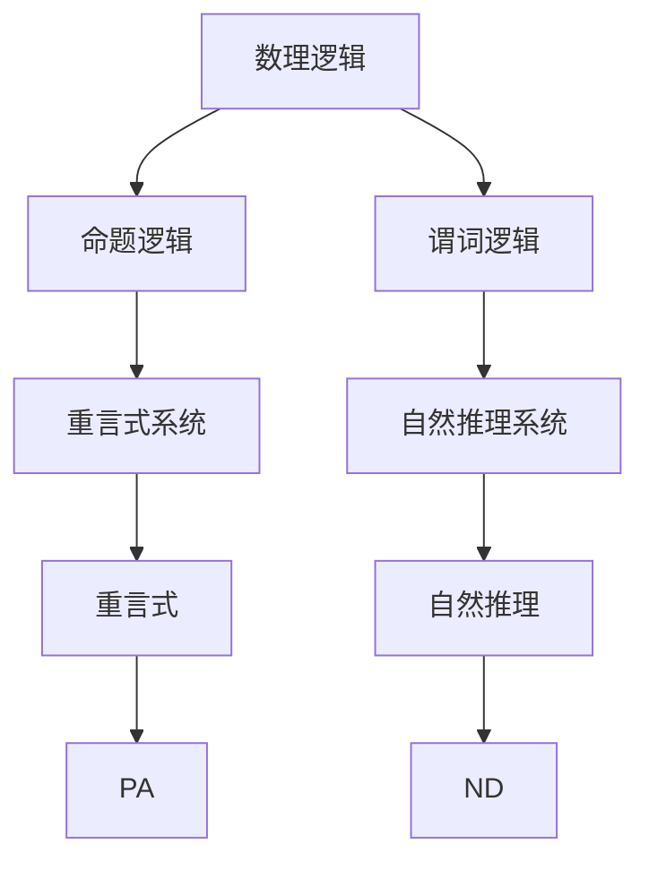

                 

# 数理逻辑：重言式系统和自然推理系统的关系

> **关键词：** 数理逻辑，重言式系统，自然推理系统，形式逻辑，推理方法，数学模型，应用场景

> **摘要：** 本文将深入探讨数理逻辑中的两个核心概念——重言式系统和自然推理系统的关系。我们将通过数理逻辑的基本原理、核心算法、数学模型及实际应用等多个维度，逐步分析这两个概念的定义、联系、区别及其重要性。读者将了解数理逻辑在计算机科学、人工智能等领域中的应用，以及其未来的发展趋势和挑战。

## 1. 背景介绍

### 1.1 目的和范围

本文旨在通过深入分析重言式系统和自然推理系统的关系，帮助读者理解数理逻辑在计算机科学和人工智能领域中的基础性和重要性。本文将涵盖以下内容：

1. 数理逻辑的基本概念和定义。
2. 重言式系统的基本原理和特点。
3. 自然推理系统的基本原理和特点。
4. 重言式系统和自然推理系统的联系与区别。
5. 数理逻辑在计算机科学和人工智能中的应用实例。
6. 未来发展趋势和面临的挑战。

### 1.2 预期读者

本文适合以下读者群体：

1. 计算机科学专业的学生和研究者。
2. 人工智能和机器学习领域的从业者。
3. 对数理逻辑和形式逻辑有兴趣的读者。
4. 寻求深入了解逻辑推理方法和数学模型的人士。

### 1.3 文档结构概述

本文分为以下十个部分：

1. 引言：介绍文章的背景、目的和结构。
2. 核心概念与联系：介绍数理逻辑、重言式系统和自然推理系统的基本概念及其关系。
3. 核心算法原理 & 具体操作步骤：详细阐述自然推理系统的算法原理和操作步骤。
4. 数学模型和公式 & 详细讲解 & 举例说明：介绍相关的数学模型和公式，并举例说明。
5. 项目实战：通过实际案例展示数理逻辑的应用。
6. 实际应用场景：探讨数理逻辑在不同领域的应用。
7. 工具和资源推荐：推荐学习资源和开发工具。
8. 总结：总结数理逻辑的发展趋势和挑战。
9. 附录：常见问题与解答。
10. 扩展阅读 & 参考资料：提供相关的扩展阅读资料。

### 1.4 术语表

#### 1.4.1 核心术语定义

- **数理逻辑（Mathematical Logic）**：研究数学符号、语言、推理规则和证明方法的一门学科，是形式逻辑的一种。
- **重言式系统（Tautology System）**：在数理逻辑中，能够保证公式为真的系统。
- **自然推理系统（Natural Deduction System）**：一种形式逻辑推理方法，强调证明的结构和过程，是现代逻辑学的重要基础。
- **形式逻辑（Formal Logic）**：使用符号语言和推理规则进行推理的一门学科，包括数理逻辑在内。

#### 1.4.2 相关概念解释

- **命题（Proposition）**：具有真值（真或假）的陈述句。
- **推理（Inference）**：从已知命题推出新命题的过程。
- **证明（Proof）**：通过逻辑推理证明一个命题为真的过程。

#### 1.4.3 缩略词列表

- **FOL**：形式逻辑（Formal Logic）
- **PL**：数理逻辑（Predicate Logic）
- **ND**：自然推理（Natural Deduction）
- **T**：重言式（Tautology）

## 2. 核心概念与联系

### 2.1 数理逻辑的基本概念

数理逻辑是一门形式化的逻辑学，主要研究数学命题及其推理过程。数理逻辑分为两大分支：命题逻辑（Propositional Logic）和谓词逻辑（Predicate Logic）。

- **命题逻辑**：只考虑命题的真假，不涉及命题的结构和内容。命题逻辑的基本元素是命题变元和逻辑连接词（如：与、或、非）。
- **谓词逻辑**：在命题逻辑的基础上，引入谓词和个体常元，能够描述更复杂的数学关系和性质。谓词逻辑的基本元素包括谓词、个体常元、量词和逻辑连接词。

### 2.2 重言式系统的基本原理

重言式系统是一种特殊的数理逻辑系统，其特点是能够保证所有公式都是重言式，即所有命题都能被证明为真。

- **重言式（Tautology）**：在命题逻辑中，一个命题在任何情况下都为真，称为重言式。例如，“P ∨ ¬P”（P 或 非P）就是一个重言式。
- **重言式系统（Tautology System）**：一个逻辑系统，如果能够保证所有公式都是重言式，则称为重言式系统。例如，命题逻辑系统PA（Propositional Logic System PA）就是一个重言式系统。

### 2.3 自然推理系统的基本原理

自然推理系统（ND）是一种形式逻辑推理方法，强调证明的结构和过程。ND方法提供了一种直观、自然的推理方式，使得证明过程更加简洁和易于理解。

- **自然推理（Natural Deduction）**：一种形式逻辑推理方法，通过构造证明树来证明命题的真值。证明树的每个节点都是一个命题，从根节点到叶子节点的路径代表一个证明。
- **自然推理系统（Natural Deduction System）**：一个形式逻辑系统，能够使用自然推理方法进行推理和证明。ND方法包括一系列的推理规则，如前提引入、结论引入、假设引入等。

### 2.4 重言式系统和自然推理系统的联系与区别

重言式系统和自然推理系统在数理逻辑中都有着重要的地位。它们之间的联系和区别如下：

- **联系**：
  1. 重言式系统是自然推理系统的基础，自然推理系统在构建过程中需要依赖重言式系统的性质。
  2. 重言式系统和自然推理系统都致力于证明命题的真值，但采用的方法不同。

- **区别**：
  1. 重言式系统只考虑命题的真假，而自然推理系统更关注证明的过程和结构。
  2. 重言式系统强调保证所有命题都为重言式，而自然推理系统强调证明的构造和推理的合理性。
  3. 重言式系统在形式化过程中更简单，而自然推理系统更接近于人类的直觉推理方式。

### 2.5 Mermaid 流程图

以下是一个简化的 Mermaid 流程图，展示了重言式系统和自然推理系统的基本概念和联系：

## 3. 核心算法原理 & 具体操作步骤

在数理逻辑中，自然推理系统（ND）是一种强大的推理方法，能够帮助我们证明命题的真值。本节将详细阐述自然推理系统的算法原理和操作步骤。

### 3.1 自然推理系统的算法原理

自然推理系统的核心在于构造证明树，通过逐步应用推理规则来证明命题的真值。证明树中的每个节点代表一个命题，从根节点到叶子节点的路径代表一个证明。

- **前提引入（Premise Introduction）**：如果一个命题是前提，则可以直接在证明树中引入。
- **结论引入（Conclusion Introduction）**：如果通过推理规则能够得到一个结论，则可以在证明树中引入。
- **假设引入（Assumption Introduction）**：在推理过程中，可以假设某个命题为真，并在证明过程中使用。

### 3.2 自然推理系统的具体操作步骤

以下是自然推理系统（ND）的具体操作步骤：

1. **构造证明树**：从根节点开始，根据前提引入和结论引入逐步扩展证明树。
2. **应用推理规则**：在每个节点上，根据当前已知的命题和推理规则，应用结论引入、假设引入等规则。
3. **证明路径**：从根节点到叶子节点的路径代表一个证明。如果能够找到一个证明路径，则说明命题为真。
4. **归纳证明**：对于复

