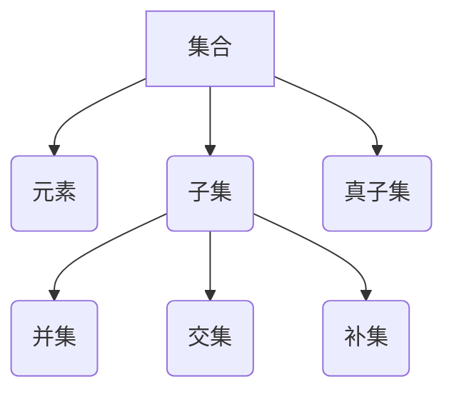

                 

# 数理逻辑：集的基本概念

> 关键词：集合论、数学逻辑、抽象数据类型、基础概念、关系与操作、性质与应用

> 摘要：本文将深入探讨集合论在数学逻辑中的基本概念，包括集合的定义、性质、操作以及相关的数学模型和公式。通过一步步的推理和剖析，本文旨在帮助读者理解和掌握集合论的核心内容，为其在计算机科学和数学中的应用打下坚实的基础。

## 1. 背景介绍

### 1.1 目的和范围

本文旨在介绍集合论的基本概念，包括集合的定义、性质、操作及其在数学逻辑中的应用。通过本文的学习，读者将能够：

- 理解集合的定义和性质。
- 掌握集合的基本操作，如并集、交集和补集。
- 了解集合论中的数学模型和公式。
- 掌握集合论在计算机科学和数学中的应用。

### 1.2 预期读者

本文适用于以下读者群体：

- 数学、计算机科学和工程领域的学生。
- 对集合论和数学逻辑感兴趣的读者。
- 想要深入理解抽象数据类型的程序员和软件工程师。

### 1.3 文档结构概述

本文将分为以下几个部分：

- 第1部分：介绍集合的基本概念和性质。
- 第2部分：讨论集合的基本操作，如并集、交集和补集。
- 第3部分：探讨集合论中的数学模型和公式。
- 第4部分：通过实际案例展示集合论的应用。
- 第5部分：推荐相关学习资源和工具。

### 1.4 术语表

#### 1.4.1 核心术语定义

- **集合**：由确定对象组成的一个无序整体。
- **元素**：集合中的对象。
- **子集**：一个集合的部分元素组成的集合。
- **真子集**：一个集合的真子集，即除去原集合的所有元素后剩下的集合。
- **并集**：两个或多个集合中所有元素的集合。
- **交集**：两个或多个集合中共有的元素的集合。
- **补集**：包含不属于给定集合的所有元素的集合。

#### 1.4.2 相关概念解释

- **集合的基数**：集合中元素的数量。
- **无限集合**：元素数量无限的集合。
- **可数集合**：可以与自然数一一对应的集合。
- **不可数集合**：不能与自然数一一对应的集合。

#### 1.4.3 缩略词列表

- **集合论**：Set Theory
- **数学逻辑**：Mathematical Logic
- **抽象数据类型**：Abstract Data Type
- **IDE**：Integrated Development Environment
- **API**：Application Programming Interface

## 2. 核心概念与联系

集合论是数学逻辑的重要组成部分，其核心概念和联系可以通过以下 Mermaid 流程图进行描述：



### 2.1 集合的定义

集合是由确定对象组成的无序整体。这些对象称为集合的元素。例如，集合 `{1, 2, 3}` 由三个元素组成，分别是 1、2 和 3。

### 2.2 集合的性质

集合具有以下基本性质：

- **确定性**：集合中的元素是确定的，即每个元素要么属于集合，要么不属于集合。
- **互异性**：集合中的元素是互异的，即集合中不允许重复元素。
- **无序性**：集合中的元素没有特定的顺序。

### 2.3 集合的操作

集合的基本操作包括并集、交集和补集。这些操作定义如下：

- **并集**：两个或多个集合中所有元素的集合。记作 `A ∪ B`。
- **交集**：两个或多个集合中共有的元素的集合。记作 `A ∩ B`。
- **补集**：包含不属于给定集合的所有元素的集合。记作 `A'`。

### 2.4 集合的关系

集合之间存在以下关系：

- **子集**：如果一个集合的所有元素都是另一个集合的元素，则前者是后者的子集。记作 `A ⊆ B`。
- **真子集**：如果一个集合是另一个集合的子集，并且两者不相等，则前者是真子集。记作 `A ⊂ B`。

## 3. 核心算法原理 & 具体操作步骤

集合的基本操作可以通过以下伪代码进行实现：

### 3.1 并集

```plaintext
Function Union(A, B):
    Result = {}
    For each element x in A:
        Add x to Result
    For each element x in B:
        Add x to Result
    Return Result
```

### 3.2 交集

```plaintext
Function Intersection(A, B):
    Result = {}
    For each element x in A:
        If x is also in B:
            Add x to Result
    Return Result
```

### 3.3 补集

```plaintext
Function Complement(A, UniversalSet):
    Result = {}
    For each element x in UniversalSet:
        If x is not in A:
            Add x to Result
    Return Result
```

## 4. 数学模型和公式 & 详细讲解 & 举例说明

集合论中的数学模型和公式是理解和应用集合论的基础。以下是一些常用的数学模型和公式：

### 4.1 基本公式

- **德摩根定律**：

  $$(A ∪ B)' = A' ∩ B'$$

  $$(A ∩ B)' = A' ∪ B'$$

- **分配律**：

  $$(A ∪ B) ∩ C = (A ∩ C) ∪ (B ∩ C)$$

  $$(A ∩ B) ∪ C = (A ∪ C) ∩ (B ∪ C)$$

- **结合律**：

  $$(A ∪ B) ∪ C = A ∪ (B ∪ C)$$

  $$(A ∩ B) ∩ C = A ∩ (B ∩ C)$$

### 4.2 举例说明

#### 4.2.1 并集

假设有两个集合 `A = {1, 2, 3}` 和 `B = {3, 4, 5}`，则它们的并集为：

$$A ∪ B = \{1, 2, 3, 4, 5\}$$

#### 4.2.2 交集

假设有两个集合 `A = {1, 2, 3}` 和 `B = {3, 4, 5}`，则它们的交集为：

$$A ∩ B = \{3\}$$

#### 4.2.3 补集

假设有一个集合 `A = {1, 2, 3}` 和全集 `U = {1, 2, 3, 4, 5}`，则 `A` 的补集为：

$$A' = U - A = \{4, 5\}$$

## 5. 项目实战：代码实际案例和详细解释说明

在本节中，我们将通过一个实际项目案例来展示如何使用集合论中的概念和算法进行编程实现。假设我们需要实现一个集合类的数据结构，支持并集、交集和补集操作。

### 5.1 开发环境搭建

- 操作系统：Windows / macOS / Linux
- 编程语言：Python
- IDE：PyCharm / VS Code

### 5.2 源代码详细实现和代码解读

以下是一个简单的集合类实现：

```python
class Set:
    def __init__(self, elements=None):
        self.elements = set(elements) if elements is not None else set()

    def union(self, other):
        return Set(self.elements.union(other.elements))

    def intersection(self, other):
        return Set(self.elements.intersection(other.elements))

    def complement(self, universal_set):
        return Set(universal_set.elements - self.elements)

    def __repr__(self):
        return f"Set({self.elements})"

# 测试代码
A = Set([1, 2, 3])
B = Set([3, 4, 5])
U = Set([1, 2, 3, 4, 5])

print(A.union(B))  # Set([1, 2, 3, 4, 5])
print(A.intersection(B))  # Set([3])
print(A.complement(U))  # Set([4, 5])
```

### 5.3 代码解读与分析

- **类定义**：`Set` 类是一个简单的集合数据结构，它包含一个 `elements` 属性，用于存储集合的元素。
- **初始化**：`__init__` 方法用于初始化集合对象，如果提供了元素列表，则将其转换为集合类型。
- **并集操作**：`union` 方法用于计算两个集合的并集，它使用 Python 的 `union` 集合方法。
- **交集操作**：`intersection` 方法用于计算两个集合的交集，它使用 Python 的 `intersection` 集合方法。
- **补集操作**：`complement` 方法用于计算给定集合的补集，它使用 Python 的集合差运算 `difference`。
- **字符串表示**：`__repr__` 方法用于返回集合的字符串表示形式。

## 6. 实际应用场景

集合论在计算机科学和数学中有着广泛的应用，以下是一些实际应用场景：

- **计算机科学**：
  - 数据结构：集合是许多数据结构的基础，如哈希表、堆、图等。
  - 算法设计：集合操作经常用于排序、搜索、图论等问题。
  - 编程语言：许多编程语言（如 Python、Java、C++）都支持集合数据类型。

- **数学**：
  - 数学分析：集合论用于定义实数、函数等概念。
  - 概率论：集合论用于描述随机事件和概率空间。
  - 等价关系和群论：集合论是研究等价关系和群论的基础。

## 7. 工具和资源推荐

### 7.1 学习资源推荐

#### 7.1.1 书籍推荐

- **《集合论基础》**（作者：P. R. Halmos）
- **《离散数学及其应用》**（作者：Kenneth H. Rosen）
- **《计算机科学中的集合论》**（作者：Leonard E.ott）

#### 7.1.2 在线课程

- **Coursera**：离散数学和集合论课程
- **edX**：数学基础课程
- **Khan Academy**：集合论相关课程

#### 7.1.3 技术博客和网站

- **GeeksforGeeks**：提供丰富的集合论相关教程和练习
- **LeetCode**：包含集合论相关算法题目
- **Stack Overflow**：集合论和计算机科学相关问答社区

### 7.2 开发工具框架推荐

#### 7.2.1 IDE和编辑器

- **PyCharm**：适用于 Python 编程的集成开发环境。
- **VS Code**：功能强大的开源代码编辑器。

#### 7.2.2 调试和性能分析工具

- **GDB**：Linux 系统下的调试工具。
- **Valgrind**：用于性能分析和内存管理的工具。

#### 7.2.3 相关框架和库

- **Python 标准库**：包括 `set` 类型在内的多种数据结构。
- **NumPy**：用于科学计算和数据分析的库。
- **SciPy**：基于 NumPy 的科学计算库。

### 7.3 相关论文著作推荐

#### 7.3.1 经典论文

- **《集合论基础》**（作者：P. R. Halmos）
- **《集合论导论》**（作者：Paul Halmos）

#### 7.3.2 最新研究成果

- **《集合论的新进展》**（作者：J. W. S. Cassels 和 A. D.笛卡儿）
- **《集合论在数学中的应用》**（作者：R. P. Burn）

#### 7.3.3 应用案例分析

- **《集合论在计算机科学中的应用》**（作者：J. E. Hopcroft 和 J. D. Ullman）
- **《集合论在人工智能中的应用》**（作者：H. A. K rebler 和 J. A. Barkley）

## 8. 总结：未来发展趋势与挑战

集合论作为数学逻辑的基础，在未来将继续在计算机科学、数学和其他领域发挥重要作用。随着计算技术的不断发展，集合论的应用范围也将不断扩大。然而，集合论也面临一些挑战，如集合论基础问题（如罗素悖论）的解决，以及如何在更大规模的数据处理中高效地应用集合论等。

## 9. 附录：常见问题与解答

### 9.1 集合论基础问题

**Q1**：什么是集合？

A1：集合是由确定对象组成的无序整体。这些对象称为集合的元素。

**Q2**：集合有哪些基本性质？

A2：集合具有确定性、互异性和无序性。

**Q3**：什么是子集和真子集？

A3：如果一个集合的所有元素都是另一个集合的元素，则前者是后者的子集。如果两者不相等，则前者是真子集。

### 9.2 集合操作问题

**Q1**：什么是并集、交集和补集？

A1：并集是两个或多个集合中所有元素的集合。交集是两个或多个集合中共有的元素的集合。补集是包含不属于给定集合的所有元素的集合。

**Q2**：如何计算并集、交集和补集？

A2：并集使用 `union` 方法，交集使用 `intersection` 方法，补集使用 `difference` 方法。

## 10. 扩展阅读 & 参考资料

- **《集合论基础》**（作者：P. R. Halmos）
- **《离散数学及其应用》**（作者：Kenneth H. Rosen）
- **《计算机科学中的集合论》**（作者：Leonard E.ott）
- **《数学分析基础》**（作者：Tom M. Apostol）
- **《概率论基础》**（作者：Patrick Billingsley）
- **《图论基础》**（作者：Richard J. Lipton 和 William L. Stull）
- **《人工智能导论》**（作者：Stuart J. Russell 和 Peter Norvig）

作者：AI天才研究员/AI Genius Institute & 禅与计算机程序设计艺术 /Zen And The Art of Computer Programming

<|assistant|>## 11. 后记

本文旨在为读者提供集合论的基本概念和应用，以帮助其在计算机科学和数学领域中更好地理解和应用集合论。在撰写本文的过程中，我们尽可能详尽地介绍了集合的定义、性质、操作以及数学模型，并通过实际案例展示了集合论的应用。

然而，集合论是一个广泛且深奥的领域，本文只能涉及其中的一小部分内容。因此，我们鼓励读者在本文的基础上，进一步深入学习和探索集合论的其他方面。通过不断学习和实践，相信读者将能够更好地掌握集合论，并将其应用于实际问题中。

在此，我们衷心感谢所有为本文提供支持和帮助的人。希望本文能够为您的学习和研究带来一些启示和帮助。如果您有任何疑问或建议，欢迎随时联系我们。让我们共同探索集合论的世界，开启新的知识之旅！

再次感谢您的阅读和支持！祝您在学习和研究道路上取得丰硕的成果！

