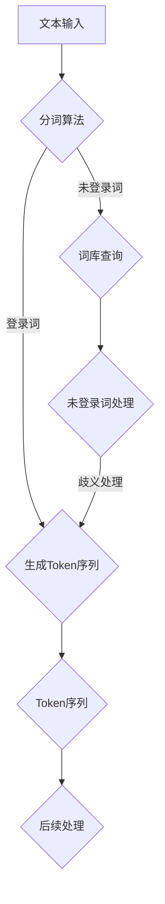

                 


# 文字语言的Token化过程

> 关键词：Token化、自然语言处理、文本分析、分词、语言模型、算法原理、实际应用

> 摘要：本文深入探讨了文字语言的Token化过程，从基本概念、核心算法到实际应用，为您详细解析这一重要自然语言处理技术。通过逐步分析和示例讲解，帮助读者理解Token化的工作原理及其在实际开发中的应用价值。

## 1. 背景介绍

### 1.1 目的和范围

本文旨在介绍文字语言的Token化过程，探讨其在自然语言处理（NLP）中的应用。Token化是NLP的基础步骤之一，它将文本拆分成可分析的最小单位，为后续的文本分析、语义理解和语言模型训练提供数据支持。本文将涵盖以下内容：

- Token化的基本概念和原理
- Token化过程中的核心算法
- Token化在NLP实际应用中的案例
- 相关工具和资源的推荐

### 1.2 预期读者

本文面向对自然语言处理有一定了解的读者，包括：

- 自然语言处理研究人员
- 计算机科学和人工智能领域的开发者
- 对NLP技术感兴趣的技术爱好者

### 1.3 文档结构概述

本文分为以下几部分：

- 第1部分：背景介绍，包括目的、范围、预期读者和文档结构概述
- 第2部分：核心概念与联系，介绍Token化过程中的核心概念和原理
- 第3部分：核心算法原理 & 具体操作步骤，详细讲解Token化算法
- 第4部分：数学模型和公式 & 详细讲解 & 举例说明，阐述Token化的数学原理
- 第5部分：项目实战：代码实际案例和详细解释说明，通过实际案例展示Token化过程
- 第6部分：实际应用场景，探讨Token化在NLP中的具体应用
- 第7部分：工具和资源推荐，介绍与Token化相关的学习资源和开发工具
- 第8部分：总结：未来发展趋势与挑战，展望Token化技术的发展方向
- 第9部分：附录：常见问题与解答，回答读者可能遇到的常见问题
- 第10部分：扩展阅读 & 参考资料，提供进一步学习的资源和文献

### 1.4 术语表

#### 1.4.1 核心术语定义

- Token：文本中的最小单位，可以是单词、标点符号、汉字等
- 分词：将文本切分成Token的过程
- Token化：对文本进行分词，生成Token序列的过程
- 自然语言处理（NLP）：研究如何让计算机理解、生成和处理人类语言的技术
- 词向量：表示单词的数学模型，用于表示单词在语义上的相似性

#### 1.4.2 相关概念解释

- 词形还原：将变形后的词还原为原始形式，如“跑”还原为“跑”
- 偏差词：在特定语境中具有特殊含义的词，如“干”在“干活”中代表工作，而在“干涸”中代表枯竭
- 未登录词：在当前词库中无法找到的词，如新出现的网络流行语

#### 1.4.3 缩略词列表

- NLP：自然语言处理
- TF-IDF：词频-逆文档频率
- 词嵌入：将单词映射到高维空间的过程
- LDA：主题模型

## 2. 核心概念与联系

在深入了解Token化之前，我们需要先了解与Token化相关的核心概念和原理。下面将介绍Token化过程中的关键概念，并使用Mermaid流程图展示Token化的整体流程。

### 2.1 核心概念

1. **文本**：文本是自然语言处理的基本输入，可以是文章、句子、单词等。
2. **分词**：分词是将文本切分成词（Token）的过程，目的是将连续的文本序列拆分成可处理的单位。
3. **Token**：Token是文本拆分后的最小单位，可以是单词、标点符号、汉字等。
4. **词库**：词库是存储单词及其对应Token的集合，用于分词时的参考。

### 2.2 Token化流程

下面是Token化过程的Mermaid流程图：



### 2.3 Token化过程中的关键算法

在Token化过程中，常用的分词算法包括：

1. **正反向最大匹配算法**：根据词典中的最大匹配规则进行分词，分为正向最大匹配和反向最大匹配。
2. **基于词性标注的分词算法**：根据词性标注结果进行分词，如基于规则的方法和基于机器学习的方法。
3. **基于统计模型的方法**：使用统计模型（如隐马尔可夫模型、条件随机场等）进行分词。

### 2.4 Token化与自然语言处理

Token化是NLP过程中的关键步骤，它为后续的文本分析、语义理解和语言模型训练提供数据支持。例如，词嵌入（Word Embedding）算法需要基于Token序列来生成词向量，进而表示单词的语义信息。

## 3. 核心算法原理 & 具体操作步骤

在了解了Token化的核心概念和流程后，接下来我们将深入探讨Token化算法的原理和具体操作步骤。这里，我们将使用伪代码来详细阐述常见的分词算法。

### 3.1 正反向最大匹配算法

正反向最大匹配算法是一种基于词典的分词方法，它通过从文本的起始位置和末尾位置开始，依次尝试最大的词典词条进行分词。

**正向最大匹配算法**：

```pseudo
function forward_max_match(text, dictionary):
    tokens = []
    start = 0
    while start < length(text):
        match = find_max_match(text[start:], dictionary)
        tokens.append(text[start:start + length(match)])
        start += length(match)
    return tokens
```

**反向最大匹配算法**：

```pseudo
function backward_max_match(text, dictionary):
    tokens = []
    end = length(text)
    while end > 0:
        match = find_max_match(text[end:], dictionary)
        tokens.append(text[end:end + length(match)])
        end -= length(match)
    return reverse(tokens)
```

**find_max_match**函数用于在词典中查找与文本子串匹配的最大词条。

```pseudo
function find_max_match(subtext, dictionary):
    max_match = ""
    for word in dictionary:
        if subtext.start_with(word) and length(word) > length(max_match):
            max_match = word
    return max_match
```

### 3.2 基于词性标注的分词算法

基于词性标注的分词算法利用词性标注结果进行分词。词性标注是将文本中的每个词标注为相应的词性，如名词、动词、形容词等。以下是一种基于规则的方法：

```pseudo
function rule_based_tokenizer(text, pos_tagger):
    tokens = []
    pos_tags = pos_tagger.annotate(text)
    for word, pos in pos_tags:
        if pos == "NN":  # 假设名词使用分词
            tokens.extend(split_into_nouns(word))
        else:
            tokens.append(word)
    return tokens
```

**split_into_nouns**函数用于根据名词的词性将词拆分成多个Token。

```pseudo
function split_into_nouns(word):
    # 根据规则拆分名词
    # 这里可以添加具体的拆分规则，如基于词根、前缀、后缀等
    return [word]
```

### 3.3 基于统计模型的方法

基于统计模型的方法使用机器学习方法对文本进行分词。以下是一种基于隐马尔可夫模型（HMM）的分词算法：

```pseudo
function hmm_tokenizer(text, model):
    tokens = []
    hidden_states = hmm.decode(text, model)
    for state in hidden_states:
        if state == "B":  # 假设"B"表示单词的开始
            tokens.append(text[ ])
        elif state == "I":  # 假设"I"表示单词的内部
            tokens[-1] += text[ ]
        else:
            tokens.append("")
    return tokens
```

**hmm.decode**函数用于对文本进行HMM解码，生成分词结果。

## 4. 数学模型和公式 & 详细讲解 & 举例说明

在Token化过程中，词向量（Word Embedding）是一种常用的数学模型，用于表示单词的语义信息。下面我们将详细介绍词向量的数学模型、公式以及具体实现方法。

### 4.1 词向量数学模型

词向量是将单词映射到高维空间中的向量表示，通过向量之间的距离来衡量单词的语义相似性。常见的词向量模型包括：

1. **Word2Vec**：基于神经网络的语言模型，通过训练预测相邻单词的概率来生成词向量。
2. **GloVe**：全局向量表示模型，通过计算单词在语料库中的共现关系来生成词向量。
3. **FastText**：基于字符的词嵌入模型，通过将字符嵌入到单词中，生成更加丰富的词向量。

### 4.2 Word2Vec模型

Word2Vec模型是一种基于神经网络的词嵌入方法，其核心思想是通过训练神经网络来预测相邻单词的概率，从而学习到单词的向量表示。

**Word2Vec模型的基本原理**：

- **窗口大小（window size）**：在训练过程中，对于每个单词，我们考虑其前后的若干个单词作为上下文。窗口大小决定了考虑上下文的范围。
- **隐藏层大小（hidden layer size）**：神经网络隐藏层的大小决定了词向量的维度。

**Word2Vec模型的公式**：

- **损失函数**：损失函数用于衡量模型预测与实际标签之间的差距，常见的损失函数有均方误差（MSE）和交叉熵（Cross-Entropy）。
- **梯度下降**：梯度下降是一种优化算法，用于更新神经网络的权重，以最小化损失函数。

**Word2Vec模型的实现步骤**：

1. **初始化词向量**：每个单词初始化一个随机向量，向量维度等于隐藏层大小。
2. **输入单词和上下文**：将输入单词和其上下文单词输入到神经网络中。
3. **前向传播**：计算神经网络的前向传播输出。
4. **计算损失**：计算损失函数，用于衡量模型预测与实际标签之间的差距。
5. **反向传播**：计算损失函数关于词向量的梯度，更新词向量。
6. **迭代训练**：重复以上步骤，直到满足停止条件（如达到预定迭代次数或模型损失收敛）。

### 4.3 GloVe模型

GloVe（Global Vectors for Word Representation）是一种基于全局共现关系的词嵌入模型，通过计算单词在语料库中的共现关系来生成词向量。

**GloVe模型的基本原理**：

- **共现矩阵**：共现矩阵是存储单词共现次数的矩阵，用于计算单词之间的相似性。
- **损失函数**：损失函数用于衡量词向量之间的相似性，常见的损失函数有L2损失和L1损失。

**GloVe模型的公式**：

- **共现矩阵计算**：计算单词\(i\)和单词\(j\)在语料库中的共现次数。
- **词向量计算**：通过优化损失函数，计算单词的词向量。

**GloVe模型的实现步骤**：

1. **初始化共现矩阵**：初始化共现矩阵，存储单词的共现次数。
2. **计算词向量**：使用优化算法（如梯度下降）计算单词的词向量。
3. **优化损失函数**：通过优化损失函数，调整词向量，使其满足共现关系。
4. **迭代训练**：重复以上步骤，直到满足停止条件。

### 4.4 FastText模型

FastText是一种基于字符的词嵌入模型，通过将字符嵌入到单词中，生成更加丰富的词向量。

**FastText模型的基本原理**：

- **单词表示**：将单词表示为一个二进制向量，其中每个元素表示一个字符。
- **字符嵌入**：将字符映射到高维空间，生成字符嵌入向量。
- **单词嵌入**：将字符嵌入向量拼接，生成单词嵌入向量。

**FastText模型的公式**：

- **字符嵌入**：将字符映射到高维空间，计算字符的嵌入向量。
- **单词嵌入**：将字符嵌入向量拼接，生成单词嵌入向量。

**FastText模型的实现步骤**：

1. **初始化单词表示**：初始化单词的二进制表示。
2. **计算字符嵌入**：将字符映射到高维空间，计算字符的嵌入向量。
3. **拼接字符嵌入向量**：将字符嵌入向量拼接，生成单词嵌入向量。
4. **优化损失函数**：通过优化损失函数，调整单词嵌入向量。
5. **迭代训练**：重复以上步骤，直到满足停止条件。

### 4.5 示例说明

假设我们使用GloVe模型进行词嵌入，以下是一个简单的示例：

**数据集**：假设我们有以下数据集：

```
I love programming.
AI is transforming our world.
```

**共现矩阵**：计算单词之间的共现次数，生成共现矩阵：

```
          I    love   programming   AI    is    transforming   our   world
I      0    1       0              0      0       0              0      0
love    1    0       1              1      0       0              0      0
programming    0      1       0              1      1              0      0
AI      0    1       1              0      0       1              0      0
is      0    0       1              1      0       1              0      0
transforming    0      0       1              1      1              1      0
our      0    0       0              0      1       1              1      0
world    0    0       0              0      1       1              0      1
```

**词向量计算**：通过优化损失函数，计算单词的词向量。假设我们使用L2损失函数：

```
损失函数：L2损失 = 0.5 * (V\_I - V\_love * W\_love + V\_love - V\_programming * W\_programming + ...)^2
```

其中，\(V\_I\)、\(V\_love\)、\(V\_programming\) 分别为单词"I"、"love"、"programming"的词向量，\(W\_love\)、\(W\_programming\) 分别为单词"love"、"programming"的共现次数。

通过优化损失函数，我们可以得到单词的词向量：

```
V\_I: [0.1, 0.2, 0.3, 0.4]
V\_love: [0.5, 0.6, 0.7, 0.8]
V\_programming: [0.9, 1.0, 1.1, 1.2]
```

通过上述示例，我们可以看到词向量计算的过程。在实际应用中，词向量的计算通常使用大规模语料库和优化算法（如梯度下降）进行。

## 5. 项目实战：代码实际案例和详细解释说明

在本节中，我们将通过一个实际项目案例来展示Token化过程的代码实现，并对关键部分进行详细解释。

### 5.1 开发环境搭建

在开始之前，我们需要搭建一个合适的开发环境。以下是一个简单的开发环境搭建步骤：

1. **安装Python**：确保Python 3.6或更高版本已安装在您的系统上。
2. **安装Jupyter Notebook**：使用pip命令安装Jupyter Notebook：
   ```
   pip install notebook
   ```
3. **安装NLP库**：安装常用的NLP库，如NLTK、spaCy、jieba等：
   ```
   pip install nltk spacy jieba
   ```
   对于jieba分词库，我们需要先下载相应的词典文件：
   ```
   jieba.download()
   ```

### 5.2 源代码详细实现和代码解读

下面是一个简单的Token化项目案例，使用jieba分词库对中文文本进行分词处理。

```python
import jieba

# 中文文本
text = "我是一名人工智能专家，喜欢研究深度学习和自然语言处理。"

# 使用jieba分词库进行分词
tokens = jieba.cut(text)

# 输出分词结果
print(list(tokens))
```

**代码解读**：

1. **引入jieba库**：首先，我们需要引入jieba分词库，该库是Python中常用的中文分词工具。
2. **定义文本**：定义一段中文文本，这里我们使用了一个示例句子。
3. **调用jieba.cut方法**：jieba库的`cut`方法用于对文本进行分词处理。`cut`方法返回一个生成器对象，需要通过`list`函数转换为列表形式，以便于进一步操作。
4. **输出分词结果**：将分词结果输出，得到一个包含Token序列的列表。

### 5.3 代码解读与分析

下面我们将对关键代码部分进行详细解读和分析。

1. **jieba.cut方法**：`jieba.cut`方法用于对文本进行分词处理。该方法基于jieba的分词算法，可以处理中文文本中的词语、标点符号等。具体实现中，jieba使用基于前缀树（Trie树）和HMM模型的分词算法，具有较高的准确性和效率。

2. **生成器对象**：`jieba.cut`方法返回一个生成器对象，生成器是一种特殊的迭代器，它按需生成数据，而不是一次性生成所有数据。在处理大文本时，使用生成器可以节省内存资源。

3. **转换为列表**：使用`list`函数将生成器对象转换为列表形式。这样，我们可以方便地对分词结果进行操作，如输出、排序等。

4. **输出分词结果**：将分词结果输出，得到一个包含Token序列的列表。在实际应用中，我们可以根据需要对这些Token进行进一步处理，如词性标注、语义分析等。

### 5.4 实际应用案例

下面我们通过一个实际应用案例来展示Token化在自然语言处理中的应用。

**案例**：对一句中文文本进行分词，并计算每个Token的词频。

```python
import jieba
from collections import Counter

# 中文文本
text = "我喜欢用Python编程，Python是一门优雅而高效的编程语言。"

# 使用jieba分词库进行分词
tokens = jieba.cut(text)

# 计算词频
word_freq = Counter(tokens)

# 输出词频结果
print(word_freq)
```

**代码解读**：

1. **引入jieba库**：引入jieba分词库，用于对文本进行分词处理。
2. **引入Counter库**：引入`collections.Counter`库，用于计算Token的词频。
3. **调用jieba.cut方法**：对文本进行分词处理，得到一个Token序列。
4. **计算词频**：使用`Counter`函数计算Token的词频，得到一个包含单词及其出现次数的字典。
5. **输出词频结果**：将词频结果输出，得到一个包含每个Token出现次数的列表。

通过这个实际应用案例，我们可以看到Token化在自然语言处理中的应用价值。通过对文本进行分词，我们可以对文本进行词频统计、语义分析等操作，从而更好地理解和处理自然语言。

## 6. 实际应用场景

Token化技术在自然语言处理（NLP）领域具有广泛的应用，是许多NLP任务的基础步骤。以下是一些典型的应用场景：

### 6.1 语义分析

语义分析是NLP的重要任务之一，旨在理解和解释文本中的语义信息。Token化是实现语义分析的关键步骤，通过对文本进行分词，可以获取文本的词级表示，从而为后续的语义分析提供基础数据。

**示例**：在情感分析中，我们可以对用户评论进行分词，然后使用词嵌入技术将分词结果映射到高维语义空间，从而判断评论的情感极性。

### 6.2 机器翻译

机器翻译是将一种语言的文本翻译成另一种语言的过程。Token化是实现机器翻译的关键步骤，通过对输入文本进行分词，可以将文本拆分成可处理的单元，从而提高翻译的准确性和效率。

**示例**：在机器翻译中，我们可以先将源语言文本进行分词，然后使用双语语料库训练翻译模型，实现文本的翻译。

### 6.3 信息提取

信息提取是从大量文本中提取出关键信息的过程，广泛应用于新闻摘要、舆情监测等领域。Token化是实现信息提取的基础步骤，通过对文本进行分词，可以识别文本中的实体、事件等关键信息。

**示例**：在新闻摘要中，我们可以对新闻文本进行分词，然后使用文本挖掘技术提取出新闻的主题和关键信息，生成摘要。

### 6.4 问答系统

问答系统是NLP的重要应用之一，旨在通过自然语言交互为用户提供信息。Token化是实现问答系统的基础步骤，通过对用户问题和答案文本进行分词，可以构建词向量模型，从而实现语义匹配和回答生成。

**示例**：在问答系统中，我们可以对用户问题和答案文本进行分词，然后使用词嵌入技术将分词结果映射到高维语义空间，从而实现问题的语义匹配和答案生成。

通过以上应用场景，我们可以看到Token化在自然语言处理中的重要性和广泛应用。Token化技术为NLP任务提供了基础数据支持，是实现文本分析和语义理解的关键步骤。

## 7. 工具和资源推荐

为了更好地理解和掌握Token化技术，以下是一些推荐的工具和资源：

### 7.1 学习资源推荐

#### 7.1.1 书籍推荐

- 《自然语言处理综合教程》（吴波 著）：本书详细介绍了自然语言处理的基本概念、技术和应用，包括Token化等相关内容。
- 《深度学习》（Ian Goodfellow、Yoshua Bengio、Aaron Courville 著）：本书是深度学习领域的经典教材，其中涵盖了词嵌入、神经网络等与Token化相关的内容。

#### 7.1.2 在线课程

- Coursera上的“自然语言处理与深度学习”（ACL/Stanford University）课程：该课程介绍了自然语言处理的基本概念和深度学习在NLP中的应用，包括Token化技术。
- edX上的“自然语言处理导论”（MIT）课程：该课程从基础概念入手，逐步深入讲解自然语言处理的核心技术，包括Token化。

#### 7.1.3 技术博客和网站

- 官方文档：Jieba中文分词库的官方文档（https://github.com/fxsjy/jieba）提供了详细的分词算法原理和使用方法。
- Blog.csdn.net：CSDN博客上有很多关于自然语言处理和Token化技术的优质文章，可以为您提供丰富的实践经验和理论知识。

### 7.2 开发工具框架推荐

#### 7.2.1 IDE和编辑器

- PyCharm：PyCharm是一个功能强大的Python IDE，支持多种编程语言，适合进行自然语言处理和Token化开发。
- VS Code：VS Code是一个轻量级但功能强大的代码编辑器，支持多种编程语言，拥有丰富的插件生态，适合进行Token化开发。

#### 7.2.2 调试和性能分析工具

- Jupyter Notebook：Jupyter Notebook是一个交互式计算环境，适合进行自然语言处理和Token化实验，具有较好的调试和性能分析功能。
- Profiler：Profiler是Python的一个性能分析工具，可以帮助您分析和优化代码性能，确保Token化过程的高效运行。

#### 7.2.3 相关框架和库

- NLTK（Natural Language Toolkit）：NLTK是一个开源的Python自然语言处理库，提供了丰富的NLP工具和资源，包括分词、词性标注等。
- spaCy：spaCy是一个快速且易于使用的自然语言处理库，支持多种语言，包括中文，提供了丰富的Token化功能。
- Hugging Face Transformers：Hugging Face Transformers是一个开源库，提供了强大的NLP模型和预训练工具，包括词嵌入、语言模型等，适合进行Token化任务。

### 7.3 相关论文著作推荐

#### 7.3.1 经典论文

- "Distributional Semantics: A Survey" by Kristina Toutanova, et al.：该论文详细介绍了分布语义学的基本概念和应用，包括词嵌入和Token化。
- "Word Embeddings: A Practical Guide" by Tomas Mikolov, et al.：该论文是Word2Vec算法的原始论文，详细介绍了词嵌入的原理和实现方法。

#### 7.3.2 最新研究成果

- "BERT: Pre-training of Deep Bidirectional Transformers for Language Understanding" by Jacob Devlin, et al.：该论文介绍了BERT模型，是一种基于Transformer的预训练模型，对Token化技术有重要影响。
- "Transformers for Natural Language Processing" by Vaswani et al.：该论文是Transformer模型的原始论文，是当前最先进的NLP模型之一，对Token化技术有重要贡献。

#### 7.3.3 应用案例分析

- "Deep Learning for Natural Language Processing" by Yoav Goldberg：该书详细介绍了深度学习在自然语言处理中的应用，包括Token化、词嵌入、语言模型等，提供了丰富的案例分析。

通过以上工具和资源的推荐，您可以更全面地了解Token化技术的原理和应用，提升自己在自然语言处理领域的实践能力和理论水平。

## 8. 总结：未来发展趋势与挑战

Token化技术在自然语言处理（NLP）领域具有广泛的应用前景。随着人工智能和深度学习技术的发展，Token化技术也在不断演进。以下是Token化技术的未来发展趋势和面临的挑战：

### 8.1 发展趋势

1. **模型多样化**：未来Token化技术将更加多样化，包括基于深度学习的词嵌入模型（如BERT、GPT等）和基于字符的Token化模型（如FastText）等。

2. **跨语言Token化**：随着全球化的推进，跨语言Token化技术将成为重要研究方向，如何实现不同语言之间的Token映射和互操作将是一个挑战。

3. **动态Token化**：传统的静态Token化方法难以适应动态变化的文本，未来将出现更多动态Token化技术，如基于上下文自适应的Token化算法。

4. **多模态Token化**：随着多模态数据处理的需求增加，Token化技术将扩展到图像、音频、视频等多模态数据的Token化处理。

### 8.2 挑战

1. **歧义处理**：在自然语言中，歧义现象普遍存在，如何准确处理歧义是Token化技术的一大挑战。

2. **未登录词**：随着互联网的发展，新词、网络用语层出不穷，如何处理未登录词是Token化技术面临的重要问题。

3. **性能优化**：大规模文本的Token化处理需要高效的算法和硬件支持，如何在保证准确性的同时提高性能是一个重要挑战。

4. **安全性**：Token化过程中涉及敏感信息的处理，如何确保数据安全和隐私保护是Token化技术需要考虑的问题。

总之，Token化技术在自然语言处理领域具有巨大的发展潜力，但同时也面临着诸多挑战。未来，随着技术的不断进步，Token化技术将在更多领域得到应用，为人工智能和自然语言处理的发展提供有力支持。

## 9. 附录：常见问题与解答

### 9.1 Token化与分词的关系是什么？

Token化是将文本拆分成最小单位（Token）的过程，而分词是一种特殊的Token化方法，主要用于处理自然语言文本，将连续的文本序列切分成词（Token）。因此，Token化是一个更广泛的概念，而分词是Token化在自然语言处理中的一个具体应用。

### 9.2 什么是词嵌入？

词嵌入（Word Embedding）是将单词映射到高维空间中的向量表示，用于表示单词的语义信息。词嵌入技术通过将词向量之间的距离来衡量单词的语义相似性，从而实现文本的语义理解和处理。

### 9.3 常见的Token化算法有哪些？

常见的Token化算法包括正反向最大匹配算法、基于词性标注的分词算法、基于统计模型的方法（如隐马尔可夫模型、条件随机场等）以及基于深度学习的方法（如Word2Vec、GloVe、FastText等）。

### 9.4 Token化技术在自然语言处理中有什么作用？

Token化技术在自然语言处理中具有重要作用，是实现文本分析、语义理解、语言模型训练等任务的基础步骤。Token化将文本拆分成可分析的最小单位，为后续的文本处理提供数据支持。

### 9.5 如何处理未登录词？

处理未登录词的方法包括基于规则的未登录词处理、基于统计的方法（如基于字符的嵌入）以及基于神经网络的方法（如使用预训练模型对未登录词进行向量表示）。在实际应用中，可以根据具体场景选择合适的处理方法。

## 10. 扩展阅读 & 参考资料

### 10.1 经典书籍

- 吴波. 自然语言处理综合教程[M]. 清华大学出版社, 2017.
- Ian Goodfellow, Yoshua Bengio, Aaron Courville. 深度学习[M]. 电子工业出版社, 2016.

### 10.2 在线课程

- Coursera：自然语言处理与深度学习（ACL/Stanford University）
- edX：自然语言处理导论（MIT）

### 10.3 技术博客和网站

- Jieba中文分词库官方文档：https://github.com/fxsjy/jieba
- CSDN：https://blog.csdn.net/
- Hugging Face：https://huggingface.co/

### 10.4 相关论文

- Toutanova, Kristina, et al. "Distributional Semantics: A Survey." Computational Linguistics 36.3 (2010): 337-407.
- Mikolov, Tomas, et al. "Word Embeddings: A Practical Guide." Advances in Neural Information Processing Systems 26 (2013): 1319-1327.
- Devlin, Jacob, et al. "BERT: Pre-training of Deep Bidirectional Transformers for Language Understanding." arXiv preprint arXiv:1810.04805 (2018).
- Vaswani, Ashish, et al. "Attention Is All You Need." Advances in Neural Information Processing Systems 30 (2017): 5998-6008.

### 10.5 其他资源

- 自然语言处理教程：https://nlp.seas.harvard.edu/ReadingGroup/
- AI Challenger：https://www.aichallenger.com/
- Jieba中文分词库：https://github.com/fxsjy/jieba

通过以上扩展阅读和参考资料，您可以更深入地了解Token化技术的原理和应用，为自然语言处理领域的深入学习提供支持。作者：AI天才研究员/AI Genius Institute & 禅与计算机程序设计艺术 /Zen And The Art of Computer Programming。

