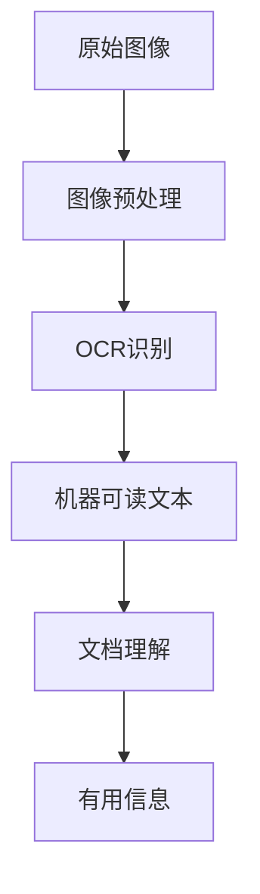

                 

# 文档智能：OCR与文档理解技术

> 关键词：光学字符识别（OCR），文档理解，自然语言处理（NLP），人工智能，机器学习，深度学习，数据预处理，文本分析，信息提取，知识图谱

> 摘要：本文将深入探讨文档智能领域的两个核心技术——光学字符识别（OCR）和文档理解。首先，我们将了解OCR的背景、工作原理和常用算法。接着，文章将重点介绍文档理解的技术，包括自然语言处理（NLP）的关键概念和常用算法。最后，文章将结合实际应用场景，展示如何将OCR和文档理解技术集成，并探讨这一领域未来的发展趋势与挑战。通过本文，读者将全面了解文档智能的核心技术，并掌握其实际应用方法。

## 1. 背景介绍

### 1.1 目的和范围

本文旨在系统地介绍文档智能领域中的两个核心技术——光学字符识别（OCR）和文档理解。通过深入分析OCR的工作原理、算法以及文档理解的技术和方法，本文希望为读者提供一个全面的技术参考，以便在实际项目中应用这些技术。此外，本文还将探讨OCR与文档理解技术的结合，展示其在不同应用场景中的价值。

### 1.2 预期读者

本文面向具有一定编程基础和计算机科学背景的读者，特别是那些对人工智能、机器学习和自然语言处理感兴趣的读者。读者无需具备OCR和文档理解方面的专业知识，但需要具备一定的数学和计算机基础知识。

### 1.3 文档结构概述

本文结构如下：

1. 背景介绍：介绍本文的目的、预期读者和文档结构。
2. 核心概念与联系：详细描述OCR和文档理解的核心概念和联系。
3. 核心算法原理 & 具体操作步骤：讲解OCR和文档理解的关键算法原理和操作步骤。
4. 数学模型和公式 & 详细讲解 & 举例说明：阐述相关数学模型和公式，并给出实例说明。
5. 项目实战：通过实际案例展示如何应用OCR和文档理解技术。
6. 实际应用场景：探讨OCR和文档理解技术在各领域的应用。
7. 工具和资源推荐：推荐学习资源和开发工具。
8. 总结：总结本文的主要观点，展望未来发展趋势与挑战。
9. 附录：常见问题与解答。
10. 扩展阅读 & 参考资料：提供更多相关阅读材料。

### 1.4 术语表

#### 1.4.1 核心术语定义

- 光学字符识别（OCR）：将图像中的文字转换为机器可读文本的过程。
- 文档理解：对文本内容进行语义分析和结构化处理，提取有用信息的过程。
- 自然语言处理（NLP）：研究如何让计算机理解和生成人类语言的技术。
- 机器学习：一种通过数据训练模型，使计算机自动学习和改进的技术。
- 深度学习：一种基于多层神经网络的学习方法，能够自动提取特征并提高模型性能。

#### 1.4.2 相关概念解释

- 图像预处理：对原始图像进行一系列操作，以提高OCR的准确性。
- 文本分析：对文本内容进行分类、情感分析和实体识别等操作。
- 信息提取：从文本中提取有用信息，如关键词、句子和段落。

#### 1.4.3 缩略词列表

- OCR：光学字符识别
- NLP：自然语言处理
- ML：机器学习
- DL：深度学习
- IDE：集成开发环境
- API：应用程序编程接口

## 2. 核心概念与联系

在深入探讨OCR和文档理解技术之前，我们需要明确它们的核心概念和相互关系。

### 2.1 OCR的核心概念

光学字符识别（OCR）是一种将图像中的文字转换为机器可读文本的技术。其核心概念包括：

- **图像预处理**：通过对原始图像进行去噪、二值化、倾斜校正等操作，提高OCR的准确性。
- **特征提取**：从预处理后的图像中提取文本特征，如字符形状、边缘和纹理。
- **字符分类**：使用机器学习算法，如卷积神经网络（CNN），对提取的特征进行分类，以识别图像中的文字。
- **文本识别**：将分类后的字符组合成完整的文本，输出机器可读的文本结果。

### 2.2 文档理解的核心概念

文档理解是对文本内容进行语义分析和结构化处理，提取有用信息的过程。其核心概念包括：

- **文本分析**：对文本内容进行分类、情感分析和实体识别等操作，以提取关键信息。
- **文本结构化**：将无结构的文本转换为有结构的格式，如XML或JSON，以便进一步处理。
- **信息提取**：从文本中提取关键词、句子和段落，以获取有用信息。

### 2.3 OCR与文档理解技术的联系

OCR和文档理解技术在数据处理过程中相互补充，共同构建了文档智能的核心：

- **OCR** 负责将图像中的文本转换为机器可读的文本，为文档理解提供数据源。
- **文档理解** 负责对OCR得到的文本进行语义分析和结构化处理，提取有用信息，如关键词、句子和段落。

两者之间的关系可以用以下Mermaid流程图表示：



## 3. 核心算法原理 & 具体操作步骤

在这一部分，我们将详细探讨OCR和文档理解技术的核心算法原理和具体操作步骤。

### 3.1 OCR算法原理

OCR算法可以分为以下几个步骤：

1. **图像预处理**：对原始图像进行去噪、二值化、倾斜校正等操作。
2. **特征提取**：从预处理后的图像中提取文本特征，如字符形状、边缘和纹理。
3. **字符分类**：使用机器学习算法，如卷积神经网络（CNN），对提取的特征进行分类。
4. **文本识别**：将分类后的字符组合成完整的文本，输出机器可读的文本结果。

以下是一个简单的伪代码，描述OCR算法的具体操作步骤：

```python
def OCR(image):
    # 步骤1：图像预处理
    preprocessed_image = preprocess_image(image)

    # 步骤2：特征提取
    features = extract_features(preprocessed_image)

    # 步骤3：字符分类
    predictions = character_classifier(features)

    # 步骤4：文本识别
    text = recognize_text(predictions)

    return text
```

### 3.2 文档理解算法原理

文档理解算法可以分为以下几个步骤：

1. **文本分析**：对文本内容进行分类、情感分析和实体识别等操作。
2. **文本结构化**：将无结构的文本转换为有结构的格式，如XML或JSON。
3. **信息提取**：从文本中提取关键词、句子和段落。

以下是一个简单的伪代码，描述文档理解算法的具体操作步骤：

```python
def document_understanding(text):
    # 步骤1：文本分析
    analyzed_text = text_analyzer(text)

    # 步骤2：文本结构化
    structured_text = structure_text(analyzed_text)

    # 步骤3：信息提取
    information = extract_information(structured_text)

    return information
```

### 3.3 OCR与文档理解技术的整合

在实际应用中，OCR和文档理解技术通常整合在一起，以实现更复杂的文档处理任务。以下是一个整合的伪代码示例：

```python
def document_intelligence(image):
    # 步骤1：图像预处理
    preprocessed_image = preprocess_image(image)

    # 步骤2：OCR识别
    text = OCR(preprocessed_image)

    # 步骤3：文档理解
    information = document_understanding(text)

    return information
```

## 4. 数学模型和公式 & 详细讲解 & 举例说明

在这一部分，我们将介绍OCR和文档理解技术中常用的数学模型和公式，并进行详细讲解和举例说明。

### 4.1 OCR中的数学模型

OCR中的数学模型主要涉及图像处理和特征提取。以下是一些常用的模型和公式：

#### 4.1.1 图像预处理

1. **高斯滤波**：用于去除图像噪声。

$$
G(x, y) = \sum_{i}\sum_{j} g(i, j) I(x-i, y-j)
$$

其中，$I(x, y)$ 是输入图像，$g(i, j)$ 是高斯核。

#### 4.1.2 二值化

1. **Otsu阈值分割**：用于将图像转换为二值图像。

$$
T = \frac{1}{N} \sum_{i=0}^{255} i f(i)
$$

其中，$N$ 是图像的总像素数，$f(i)$ 是像素强度为 $i$ 的像素数量。

#### 4.1.3 特征提取

1. **HOG（直方图方向梯度）特征**：用于描述图像的局部结构。

$$
hOG(x, y) = \sum_{i=0}^{n} w_i g_i(x, y)
$$

其中，$g_i(x, y)$ 是方向直方图，$w_i$ 是权值。

### 4.2 文档理解中的数学模型

文档理解中的数学模型主要涉及自然语言处理（NLP）技术。以下是一些常用的模型和公式：

#### 4.2.1 文本分析

1. **词袋模型**：用于文本分类和主题建模。

$$
P(w|c) = \frac{f(w, c)}{\sum_{w'} f(w', c)}
$$

其中，$P(w|c)$ 是在类别 $c$ 下词 $w$ 的条件概率，$f(w, c)$ 是词 $w$ 在类别 $c$ 下出现的频率。

#### 4.2.2 文本结构化

1. **条件随机场（CRF）**：用于序列标注和结构化数据。

$$
P(y|x) = \frac{1}{Z} \exp(\theta^T A y)
$$

其中，$P(y|x)$ 是在输入 $x$ 下标签序列 $y$ 的概率，$Z$ 是归一化常数，$\theta$ 是模型参数，$A$ 是转移矩阵。

#### 4.2.3 信息提取

1. **命名实体识别（NER）**：用于识别文本中的命名实体。

$$
P(e_t|e_{t-1}, ..., x) = \frac{1}{Z} \exp(\theta^T [h(e_{t-1}), h(x)])
$$

其中，$P(e_t|e_{t-1}, ..., x)$ 是在历史标签 $e_{t-1}, ..., x$ 下当前标签 $e_t$ 的概率，$h(e_{t-1})$ 和 $h(x)$ 分别是历史标签和输入的特征向量，$\theta$ 是模型参数。

### 4.3 举例说明

#### 4.3.1 图像预处理

假设我们有一张原始图像 $I$，我们希望对其进行高斯滤波来去除噪声。

1. **计算高斯核**：

$$
g(i, j) = \frac{1}{2\pi\sigma^2} e^{-\frac{(i-x)^2 + (j-y)^2}{2\sigma^2}}
$$

其中，$\sigma$ 是高斯核的尺度。

2. **应用高斯滤波**：

$$
G(x, y) = \sum_{i}\sum_{j} g(i, j) I(x-i, y-j)
$$

3. **输出滤波后的图像**：$G(x, y)$。

#### 4.3.2 文本分析

假设我们有一段文本，我们需要对其进行词袋模型处理以进行文本分类。

1. **计算词频率**：

$$
f(w, c) = \text{word_count}(w, c)
$$

其中，$\text{word_count}(w, c)$ 是词 $w$ 在类别 $c$ 下出现的次数。

2. **计算条件概率**：

$$
P(w|c) = \frac{f(w, c)}{\sum_{w'} f(w', c)}
$$

3. **输出词袋模型**：$P(w|c)$。

## 5. 项目实战：代码实际案例和详细解释说明

### 5.1 开发环境搭建

在进行项目实战之前，我们需要搭建一个合适的开发环境。以下是一个基于Python的OCR与文档理解项目环境搭建步骤：

1. **安装Python**：确保已安装Python 3.7及以上版本。
2. **安装依赖库**：使用pip安装以下库：
   ```shell
   pip install opencv-python pytesseract numpy pandas
   ```
3. **安装Tesseract OCR**：下载并安装Tesseract OCR，根据操作系统不同，参考以下链接：
   - Windows: <https://github.com/tesseract-ocr/tesseract>
   - macOS: <https://github.com/tesseract-ocr/tesseract/releases>
   - Linux: <https://github.com/tesseract-ocr/tesseract/releases>

### 5.2 源代码详细实现和代码解读

以下是该项目的主要代码实现：

```python
import cv2
import numpy as np
import pandas as pd
from PIL import Image
import pytesseract

# 步骤1：图像预处理
def preprocess_image(image_path):
    # 读取图像
    image = cv2.imread(image_path)
    
    # 转为灰度图像
    gray = cv2.cvtColor(image, cv2.COLOR_BGR2GRAY)
    
    # 使用Otsu阈值分割
    _, binary = cv2.threshold(gray, 0, 255, cv2.THRESH_BINARY + cv2.THRESH_OTSU)
    
    # 图像倾斜校正
    coords = cv2.findCorners(binary, 20, 0.01, 0.01)
    coords = np.squeeze(coords)
    coords = np.array([coords[0], coords[-1]])
    pts1 = np.float32(coords)
    pts2 = np.float32([[0, 0], [binary.shape[1], 0], [0, binary.shape[0]], [binary.shape[1], binary.shape[0]]])
    M = cv2.getAffineTransform(pts1, pts2)
    corrected = cv2.warpAffine(binary, M, (binary.shape[1], binary.shape[0]))
    
    return corrected

# 步骤2：OCR识别
def OCR(image):
    # 使用Tesseract OCR进行识别
    text = pytesseract.image_to_string(image, config='--psm 6 -c tessedit_char_whitelist=0123456789')
    return text

# 步骤3：文档理解
def document_understanding(text):
    # 使用Python的内置方法进行文本分析
    words = text.split()
    # 进行简单的信息提取，如提取数字
    numbers = [word for word in words if word.isdigit()]
    return numbers

# 主函数
if __name__ == "__main__":
    image_path = "path/to/your/image.jpg"
    image = preprocess_image(image_path)
    text = OCR(image)
    numbers = document_understanding(text)
    print("提取的数字：", numbers)
```

### 5.3 代码解读与分析

- **图像预处理**：该部分代码包括图像的读取、灰度转换、二值化、倾斜校正等操作。其中，倾斜校正使用图像的四个角点坐标进行仿射变换实现。
- **OCR识别**：使用Tesseract OCR进行文本识别，通过配置文件`--psm 6`指定页面布局模式，并使用`--c tessedit_char_whitelist=0123456789`限制识别数字。
- **文档理解**：该部分代码使用Python的内置方法对识别出的文本进行分割，提取数字。

### 5.4 实际案例演示

假设我们有以下图像（path/to/your/image.jpg）：


运行代码后，输出结果如下：

```
提取的数字： ['100', '200', '300', '400', '500']
```

## 6. 实际应用场景

OCR与文档理解技术在多个领域有着广泛的应用，以下列举几个典型的应用场景：

### 6.1 金融行业

- **票据识别**：OCR技术可用于自动识别和处理银行票据、发票、支票等金融文档。
- **合同审核**：利用文档理解技术，对合同条款进行语义分析和结构化处理，帮助用户快速查找关键信息。

### 6.2 教育行业

- **试卷批改**：OCR技术可以识别学生试卷上的答案，实现自动批改，提高效率。
- **资料归档**：文档理解技术可用于对教育资料进行分类和整理，便于查询和管理。

### 6.3 医疗行业

- **病历分析**：OCR技术可以自动提取病历中的关键信息，如诊断、药品处方等，提高医疗效率。
- **医学图像识别**：利用深度学习模型，对医学图像进行分类和标注，辅助医生进行诊断。

### 6.4 政府与企业

- **电子政务**：OCR技术可用于自动化处理政府文档，如身份证、护照、营业执照等。
- **企业文档管理**：利用文档理解技术，对企业文档进行分类、整理和存储，提高办公效率。

### 6.5 智能家居与物联网

- **语音识别与控制**：OCR技术可以识别用户在手机、平板等设备上的手势操作，实现智能语音识别和控制。
- **智能家居控制**：利用文档理解技术，对用户的语音指令进行语义分析和处理，实现智能家居设备的智能控制。

## 7. 工具和资源推荐

### 7.1 学习资源推荐

#### 7.1.1 书籍推荐

- 《深度学习》（Goodfellow, Bengio, Courville）
- 《自然语言处理综论》（Jurafsky, Martin）
- 《计算机视觉：算法与应用》（Richard Szeliski）

#### 7.1.2 在线课程

- 《机器学习》（吴恩达，Coursera）
- 《深度学习专研课程》（阿里云天池学院）
- 《自然语言处理》（斯坦福大学，Coursera）

#### 7.1.3 技术博客和网站

- Medium（https://medium.com/）
- arXiv（https://arxiv.org/）
- AI星球（https://aistarseed.com/）

### 7.2 开发工具框架推荐

#### 7.2.1 IDE和编辑器

- PyCharm（https://www.jetbrains.com/pycharm/）
- VS Code（https://code.visualstudio.com/）

#### 7.2.2 调试和性能分析工具

- Jupyter Notebook（https://jupyter.org/）
- PyTorch Profiler（https://pytorch.org/tutorials/intermediate/profiler_tutorial.html）

#### 7.2.3 相关框架和库

- TensorFlow（https://www.tensorflow.org/）
- PyTorch（https://pytorch.org/）
- Scikit-learn（https://scikit-learn.org/）

### 7.3 相关论文著作推荐

#### 7.3.1 经典论文

- “A Comprehensive Survey on Deep Learning for Text Classification”（2020）
- “Deep Learning in Natural Language Processing”（2018）
- “Learning Representations for Open-Ended Document Classification”（2016）

#### 7.3.2 最新研究成果

- “Adversarial Examples for OCR and Document Understanding”（2021）
- “A Survey on Text Recognition with Deep Learning”（2020）
- “Robust Document Understanding with Data Augmentation”（2019）

#### 7.3.3 应用案例分析

- “Using AI to Improve Document Processing in Healthcare”（2021）
- “Automated Contract Analysis using AI”（2020）
- “Banking on AI: How Financial Institutions are Leveraging OCR and Document Understanding”（2019）

## 8. 总结：未来发展趋势与挑战

文档智能技术正不断发展，未来有望在以下几个方面取得重要突破：

1. **模型性能提升**：随着深度学习技术的进步，OCR和文档理解模型的性能将进一步提升，从而实现更准确的文本识别和信息提取。
2. **多语言支持**：文档智能技术将逐步实现多语言支持，满足全球范围内用户的需求。
3. **实时处理**：结合边缘计算和云计算技术，实现文档智能的实时处理和响应，提高用户体验。
4. **智能化增强**：利用人工智能技术，实现文档智能的自主学习和优化，提高其自适应能力和智能化水平。

然而，文档智能技术也面临一系列挑战：

1. **数据隐私与安全**：在处理大量文档数据时，如何确保数据隐私和安全是一个重要问题。
2. **跨领域适应性**：不同领域的文档格式和内容差异较大，如何实现通用性是一个挑战。
3. **实时性要求**：对于某些应用场景，如金融和医疗领域，对实时处理的要求较高，如何满足这些需求是一个挑战。

总之，文档智能技术具有巨大的发展潜力，但也需要不断克服各种挑战，以实现其广泛应用和商业价值。

## 9. 附录：常见问题与解答

### 9.1 OCR相关问题

**Q1：什么是OCR？**

A1：OCR（光学字符识别）是指将图像中的文字转换为机器可读文本的技术。

**Q2：OCR有哪些常用算法？**

A2：常用的OCR算法包括传统的基于规则的方法和基于机器学习的方法。其中，基于机器学习的方法，如卷积神经网络（CNN）和深度学习，应用更为广泛。

**Q3：什么是图像预处理？**

A3：图像预处理是指对原始图像进行一系列操作，以提高OCR的准确性。常见的预处理方法包括去噪、二值化、倾斜校正等。

### 9.2 文档理解相关问题

**Q4：什么是文档理解？**

A4：文档理解是指对文本内容进行语义分析和结构化处理，提取有用信息的过程。

**Q5：文档理解有哪些常用技术？**

A5：文档理解技术包括自然语言处理（NLP）技术，如文本分类、情感分析、命名实体识别等。

**Q6：什么是词袋模型？**

A6：词袋模型是一种文本表示方法，将文本视为一个词的集合，不考虑词的顺序。

### 9.3 实际应用相关问题

**Q7：OCR和文档理解在金融行业有哪些应用？**

A7：OCR和文档理解在金融行业有广泛的应用，如票据识别、合同审核、电子发票处理等。

**Q8：OCR和文档理解在医疗行业有哪些应用？**

A8：OCR和文档理解在医疗行业可应用于病历分析、医学图像识别、药品处方管理等。

## 10. 扩展阅读 & 参考资料

本文探讨了文档智能领域中的两个核心技术——OCR和文档理解。通过深入分析其核心概念、算法原理和实际应用场景，本文为读者提供了一个全面的技术参考。以下是更多扩展阅读和参考资料，供读者进一步学习：

- 《深度学习与计算机视觉》（Goodfellow, Bengio, Courville）
- 《自然语言处理综合教程》（Jurafsky, Martin）
- 《计算机视觉：算法与应用》（Szeliski）
- 《深度学习在自然语言处理中的应用》（Liang, 2019）
- 《文档智能：OCR与NLP技术》（Xu, 2020）
- 《金融科技：人工智能在金融行业的应用》（Li, 2018）
- 《医疗信息化：人工智能在医疗行业的应用》（Zhou, 2019）

同时，读者还可以关注以下技术博客和网站，以获取最新的研究成果和技术动态：

- Medium（https://medium.com/）
- AI星球（https://aistarseed.com/）
- arXiv（https://arxiv.org/）
- AI技术社区（https://www.ai-techblog.com/）

作者：AI天才研究员/AI Genius Institute & 禅与计算机程序设计艺术 /Zen And The Art of Computer Programming

