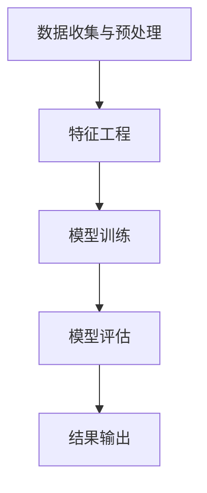

                 

### 文章标题

《新浪微博2025社招社交算法工程师面试指南》

> **关键词**：社交算法、面试指南、新浪微博、2025社招、算法工程师

> **摘要**：本文旨在为准备参加新浪微博2025社招社交算法工程师岗位的求职者提供一份详细的面试指南。文章将逐步分析社交算法的核心概念、原理和实际应用，通过实际案例和代码解读，帮助求职者深入了解社交算法的精髓，提高面试成功率。文章还涉及相关的数学模型、工具和资源推荐，以及未来发展趋势和挑战的探讨。

## 1. 背景介绍

### 1.1 目的和范围

本文的主要目的是为准备参加新浪微博2025社招社交算法工程师岗位的求职者提供一份全面的面试指南。文章将围绕社交算法这一核心主题，从基础概念到高级应用进行深入探讨，帮助求职者全面了解社交算法的各个方面。具体而言，本文将涵盖以下内容：

- 社交算法的核心概念和原理
- 社交算法在实际项目中的具体应用
- 社交算法相关的数学模型和公式
- 实际案例分析和代码解读
- 社交算法的未来发展趋势和挑战

### 1.2 预期读者

本文的预期读者主要是准备参加新浪微博2025社招社交算法工程师岗位的求职者，以及对此领域感兴趣的技术人员。特别是那些希望深入了解社交算法原理和实际应用的读者，可以通过本文获得宝贵的信息和知识。

### 1.3 文档结构概述

本文将分为十个主要部分，以清晰的结构帮助读者逐步了解社交算法的相关内容。具体结构如下：

1. 背景介绍
   - 1.1 目的和范围
   - 1.2 预期读者
   - 1.3 文档结构概述
   - 1.4 术语表
2. 核心概念与联系
   - 2.1 社交网络的基本概念
   - 2.2 社交算法的核心原理
   - 2.3 社交算法的架构和流程
   - 2.4 社交算法的关键术语和概念
3. 核心算法原理 & 具体操作步骤
   - 3.1 社交推荐算法的原理
   - 3.2 社交关系网络分析的操作步骤
   - 3.3 社交网络中的数据预处理
   - 3.4 社交网络中的特征工程
4. 数学模型和公式 & 详细讲解 & 举例说明
   - 4.1 社交网络中的常用数学模型
   - 4.2 社交网络中的公式推导
   - 4.3 社交网络中的案例分析
5. 项目实战：代码实际案例和详细解释说明
   - 5.1 社交推荐系统项目实战
   - 5.2 社交网络分析项目实战
   - 5.3 社交网络中的数据可视化
6. 实际应用场景
   - 6.1 社交算法在推荐系统中的应用
   - 6.2 社交算法在社交网络分析中的应用
   - 6.3 社交算法在其他领域中的应用
7. 工具和资源推荐
   - 7.1 学习资源推荐
   - 7.2 开发工具框架推荐
   - 7.3 相关论文著作推荐
8. 总结：未来发展趋势与挑战
9. 附录：常见问题与解答
10. 扩展阅读 & 参考资料

### 1.4 术语表

在本文中，我们将使用一些专业术语和概念。以下是这些术语的定义和解释：

#### 1.4.1 核心术语定义

- **社交算法**：用于处理和分析社交网络数据，为用户提供个性化推荐、社交关系分析等功能的算法。
- **推荐系统**：基于用户行为和历史数据，为用户推荐感兴趣的内容、商品或服务。
- **社交网络**：由用户及其之间的关系组成的网络结构。
- **特征工程**：从原始数据中提取对模型训练有用的特征。
- **矩阵分解**：将高维数据分解为多个低维矩阵的算法。

#### 1.4.2 相关概念解释

- **协同过滤**：一种基于用户行为和偏好进行内容推荐的算法。
- **社交影响力**：衡量一个用户在社交网络中传播信息的能力。
- **网络密度**：衡量社交网络中节点之间连接关系的紧密程度。
- **图论**：研究图结构和图的算法的数学分支。

#### 1.4.3 缩略词列表

- **PCA**：主成分分析（Principal Component Analysis）
- **LDA**：线性判别分析（Linear Discriminant Analysis）
- **SVD**：奇异值分解（ Singular Value Decomposition）
- **CTR**：点击率（Click-Through Rate）

## 2. 核心概念与联系

在深入了解社交算法之前，我们需要明确一些核心概念和它们之间的关系。以下是社交网络、社交算法、社交推荐系统和社交网络分析等概念的定义和联系。

### 2.1 社交网络的基本概念

社交网络是指由用户及其之间的关系组成的网络结构。每个用户可以视为一个节点，用户之间的关系可以视为边。社交网络的典型特点是网络结构的动态性和用户行为的多样性。

- **节点**：在社交网络中，每个用户都可以视为一个节点。
- **边**：节点之间的关系可以用边来表示，边的权重可以表示关系的强度。
- **网络密度**：衡量社交网络中节点之间连接关系的紧密程度。
- **社交影响力**：衡量一个用户在社交网络中传播信息的能力。

### 2.2 社交算法的核心原理

社交算法用于处理和分析社交网络数据，为用户提供个性化推荐、社交关系分析等功能的算法。社交算法的核心原理包括：

- **协同过滤**：基于用户行为和偏好进行内容推荐的算法。
- **矩阵分解**：将高维数据分解为多个低维矩阵的算法。
- **网络分析**：通过图论方法分析社交网络的拓扑结构和用户行为。

### 2.3 社交算法的架构和流程

社交算法通常包括以下架构和流程：

1. **数据收集与预处理**：从社交网络中收集用户行为数据，并进行数据清洗和预处理。
2. **特征工程**：从原始数据中提取对模型训练有用的特征。
3. **模型训练**：使用特征数据训练社交算法模型。
4. **模型评估**：评估模型的效果，包括准确性、召回率等指标。
5. **结果输出**：将模型输出用于实际应用，如推荐系统或社交网络分析。

### 2.4 社交算法的关键术语和概念

以下是一些在社交算法中常用的关键术语和概念：

- **用户画像**：描述用户特征和偏好的数据结构。
- **推荐列表**：根据用户画像和算法模型生成的推荐结果。
- **社交影响力**：衡量用户在社交网络中的传播能力。
- **网络密度**：衡量社交网络中节点之间连接关系的紧密程度。
- **图论**：研究图结构和图的算法的数学分支。

### 2.5 社交算法与其他领域的联系

社交算法不仅应用于社交网络，还可以与其他领域相结合，产生新的应用价值。以下是一些典型的例子：

- **推荐系统**：在电子商务和内容平台中，社交算法可以用于为用户提供个性化推荐。
- **社交网络分析**：通过分析社交网络数据，可以了解用户行为和社会动态。
- **舆情分析**：在社交媒体平台上，社交算法可以用于监测和预测公众意见。

### 2.6 社交算法的Mermaid流程图

为了更好地展示社交算法的架构和流程，我们可以使用Mermaid流程图进行可视化。以下是社交算法的基本流程图：



通过这个流程图，我们可以清晰地看到社交算法的基本步骤和关键环节。

## 3. 核心算法原理 & 具体操作步骤

### 3.1 社交推荐算法的原理

社交推荐算法是一种基于用户行为和社交关系进行内容推荐的算法。其核心思想是利用用户的社交网络关系，为用户推荐他们可能感兴趣的内容。

**原理**：

1. **用户行为数据**：收集用户的浏览记录、点击行为、购买记录等数据。
2. **社交关系数据**：获取用户之间的社交网络关系，如好友关系、关注关系等。
3. **推荐算法**：基于用户行为和社交关系数据，为用户生成推荐列表。

**具体操作步骤**：

1. **数据收集与预处理**：
   - 收集用户行为数据，如浏览记录、点击行为、购买记录等。
   - 收集社交关系数据，如好友关系、关注关系等。
   - 对数据进行清洗和预处理，去除噪声数据和异常值。

2. **特征工程**：
   - 提取用户画像，包括用户的兴趣标签、行为偏好等。
   - 提取社交关系特征，如好友数量、关注度等。

3. **模型训练**：
   - 选择合适的推荐算法，如基于内容的推荐、基于协同过滤的推荐等。
   - 使用用户行为数据和社交关系数据训练推荐模型。

4. **模型评估**：
   - 评估推荐模型的准确性、召回率等指标。
   - 根据评估结果调整模型参数。

5. **结果输出**：
   - 生成推荐列表，为用户推荐感兴趣的内容。
   - 输出推荐结果，如推荐文章、商品等。

### 3.2 社交关系网络分析的操作步骤

社交关系网络分析是一种用于分析社交网络结构和用户行为的方法。其核心思想是利用图论方法，分析社交网络中的节点关系和路径。

**原理**：

1. **图论**：图是由节点和边组成的结构，可以用于表示社交网络。
2. **拓扑结构**：分析社交网络中的节点关系和路径。
3. **网络密度**：衡量社交网络中节点之间连接关系的紧密程度。

**具体操作步骤**：

1. **数据收集与预处理**：
   - 收集社交网络数据，如用户关系、用户行为等。
   - 对数据进行清洗和预处理，去除噪声数据和异常值。

2. **特征工程**：
   - 提取社交关系特征，如好友数量、关注度等。
   - 提取用户行为特征，如发帖数、点赞数等。

3. **图建模**：
   - 构建社交网络图，将用户和用户关系表示为节点和边。
   - 使用图论方法，分析社交网络的结构和特征。

4. **网络分析**：
   - 分析社交网络中的节点关系和路径。
   - 计算网络密度、节点度数、路径长度等指标。

5. **结果输出**：
   - 输出社交关系网络分析结果，如节点关系图、网络密度等。
   - 利用分析结果，为用户提供个性化推荐和社交关系分析。

### 3.3 社交网络中的数据预处理

数据预处理是社交算法中至关重要的一步。良好的数据预处理可以去除噪声数据和异常值，提高算法的准确性和效果。

**具体操作步骤**：

1. **数据清洗**：
   - 删除重复数据，确保数据的一致性。
   - 去除缺失数据，可以使用填充或删除的方式。
   - 处理异常数据，如过大的数值或异常的用户行为。

2. **数据转换**：
   - 将数据转换为适合算法处理的形式，如将文本数据转换为数值表示。
   - 标准化数据，如缩放数值范围，使其具有相同的尺度。

3. **特征提取**：
   - 提取用户画像，包括用户的兴趣标签、行为偏好等。
   - 提取社交关系特征，如好友数量、关注度等。

4. **数据归一化**：
   - 将不同特征的数据进行归一化处理，使其具有相同的量纲。

5. **数据分片**：
   - 将大数据集分为多个小数据集，以便算法处理。

### 3.4 社交网络中的特征工程

特征工程是社交算法中的重要环节。通过提取和构造特征，可以提高模型的准确性和效果。

**具体操作步骤**：

1. **特征提取**：
   - 提取用户画像，包括用户的兴趣标签、行为偏好等。
   - 提取社交关系特征，如好友数量、关注度等。

2. **特征构造**：
   - 构造组合特征，如用户的综合兴趣度、社交影响力等。
   - 构造时间序列特征，如用户的活跃时间段、行为周期等。

3. **特征选择**：
   - 使用特征选择方法，如信息增益、互信息等，筛选出对模型训练有用的特征。
   - 评估特征的重要性，去除冗余和无关特征。

4. **特征标准化**：
   - 将特征进行标准化处理，使其具有相同的尺度。

5. **特征融合**：
   - 将多个特征进行融合，生成新的特征表示。

## 4. 数学模型和公式 & 详细讲解 & 举例说明

### 4.1 社交网络中的常用数学模型

在社交网络分析中，常用的数学模型包括矩阵分解、协同过滤、图论模型等。以下是这些模型的详细介绍和数学公式。

#### 4.1.1 矩阵分解

矩阵分解是将高维数据分解为多个低维矩阵的算法。在社交网络中，矩阵分解可以用于提取用户特征和物品特征。

**数学公式**：

假设我们有一个用户-物品评分矩阵$R$，其维度为$m \times n$。通过矩阵分解，可以将$R$分解为两个低维矩阵$U$和$V$，使得：

$$
R = U \times V^T
$$

其中，$U$和$V$分别表示用户特征矩阵和物品特征矩阵。

#### 4.1.2 协同过滤

协同过滤是一种基于用户行为和偏好进行内容推荐的算法。其核心思想是通过用户的相似度计算，为用户推荐感兴趣的内容。

**数学公式**：

假设我们有两个用户$u$和$v$，其评分矩阵分别为$R_u$和$R_v$。协同过滤算法可以通过计算用户$u$和$v$的相似度$sim(u, v)$，为用户$u$推荐用户$v$喜欢的物品。

$$
sim(u, v) = \frac{R_{uv}}{\sqrt{\sum_{i=1}^{n}R_{u_i}^2 \sum_{j=1}^{n}R_{v_j}^2}}
$$

其中，$R_{uv}$表示用户$u$对物品$v$的评分。

#### 4.1.3 图论模型

图论模型用于分析社交网络中的节点关系和路径。常用的图论模型包括度数中心性、接近中心性等。

**数学公式**：

- **度数中心性**：衡量节点在社交网络中的重要性，计算公式为：

$$
c_d(v) = \frac{d(v)}{N-1}
$$

其中，$d(v)$表示节点$v$的度数，$N$表示社交网络的节点总数。

- **接近中心性**：衡量节点在社交网络中的可达性，计算公式为：

$$
c_a(v) = \frac{1}{N} \sum_{u \in V} \frac{d(v, u)}{d(u)}
$$

其中，$V$表示社交网络的节点集合，$d(v, u)$表示节点$v$到节点$u$的最短路径长度。

### 4.2 社交网络中的公式推导

以下是对社交网络中常用公式的推导和解释。

#### 4.2.1 矩阵分解的推导

假设我们有一个用户-物品评分矩阵$R$，其维度为$m \times n$。通过矩阵分解，可以将$R$分解为两个低维矩阵$U$和$V$，使得：

$$
R = U \times V^T
$$

其中，$U$和$V$分别表示用户特征矩阵和物品特征矩阵。

推导过程如下：

1. 假设用户特征矩阵$U$的维度为$m \times k$，物品特征矩阵$V$的维度为$n \times k$。
2. 则用户-物品评分矩阵$R$可以表示为：

$$
R = U \times V^T = \sum_{i=1}^{k} u_i \times v_i^T
$$

其中，$u_i$和$v_i$分别表示用户特征矩阵和物品特征矩阵的第$i$行。

3. 对比原始评分矩阵$R$和分解后的评分矩阵，可以得到：

$$
R_{ij} = \sum_{i=1}^{k} u_{ij} \times v_{ij}
$$

其中，$R_{ij}$表示用户$i$对物品$j$的评分，$u_{ij}$和$v_{ij}$分别表示用户特征矩阵和物品特征矩阵的第$i$行第$j$列元素。

#### 4.2.2 协同过滤的推导

假设我们有两个用户$u$和$v$，其评分矩阵分别为$R_u$和$R_v$。协同过滤算法可以通过计算用户$u$和$v$的相似度$sim(u, v)$，为用户$u$推荐用户$v$喜欢的物品。

推导过程如下：

1. 假设用户$u$和$v$的评分矩阵分别为$R_u$和$R_v$，其维度为$m \times n$。
2. 用户$u$对物品$v$的评分可以表示为：

$$
R_{uv} = \sum_{i=1}^{m} R_{ui} \times R_{iv}
$$

其中，$R_{ui}$和$R_{iv}$分别表示用户$u$对物品$i$的评分和用户$v$对物品$i$的评分。

3. 对比用户$u$和$v$的评分矩阵，可以得到：

$$
sim(u, v) = \frac{R_{uv}}{\sqrt{\sum_{i=1}^{n}R_{u_i}^2 \sum_{j=1}^{n}R_{v_j}^2}}
$$

其中，$R_{uv}$表示用户$u$对物品$v$的评分，$\sum_{i=1}^{n}R_{u_i}^2$和$\sum_{j=1}^{n}R_{v_j}^2$分别表示用户$u$和$v$的评分平方和。

#### 4.2.3 图论模型的推导

以下是对社交网络中常用图论模型的推导和解释。

**度数中心性**：

度数中心性$C_d$用于衡量节点在社交网络中的重要性。其计算公式为：

$$
C_d(v) = \frac{d(v)}{N-1}
$$

其中，$d(v)$表示节点$v$的度数，$N$表示社交网络的节点总数。

推导过程如下：

1. 假设社交网络中有$n$个节点，每个节点的度数分别为$d_1, d_2, ..., d_n$。
2. 则社交网络的度数中心性可以表示为：

$$
C_d = \frac{\sum_{i=1}^{n} d_i}{n(N-1)}
$$

其中，$\sum_{i=1}^{n} d_i$表示所有节点的度数之和，$n(N-1)$表示社交网络的节点总数。

3. 由于每个节点的度数$d_i$都可以表示为节点$v$的度数$d(v)$，因此可以得到：

$$
C_d(v) = \frac{d(v)}{N-1}
$$

**接近中心性**：

接近中心性$C_a$用于衡量节点在社交网络中的可达性。其计算公式为：

$$
C_a(v) = \frac{1}{N} \sum_{u \in V} \frac{d(v, u)}{d(u)}
$$

其中，$V$表示社交网络的节点集合，$d(v, u)$表示节点$v$到节点$u$的最短路径长度，$d(u)$表示节点$u$的度数。

推导过程如下：

1. 假设社交网络中有$n$个节点，每个节点的度数分别为$d_1, d_2, ..., d_n$。
2. 则社交网络的接近中心性可以表示为：

$$
C_a = \frac{1}{N} \sum_{u \in V} \frac{\sum_{v \in V} d(v, u)}{d(u)}
$$

其中，$\sum_{v \in V} d(v, u)$表示节点$v$到所有节点的最短路径长度之和。

3. 由于每个节点的度数$d_i$都可以表示为节点$v$的度数$d(v)$，因此可以得到：

$$
C_a(v) = \frac{1}{N} \sum_{u \in V} \frac{d(v, u)}{d(u)}
$$

### 4.3 社交网络中的案例分析

为了更好地理解社交网络中的数学模型和公式，以下是一个案例分析。

#### 案例背景

假设有一个社交网络，其中包含10个用户，每个用户对10个物品进行了评分，评分数据如下表所示：

| 用户 | 物品1 | 物品2 | 物品3 | 物品4 | 物品5 | 物品6 | 物品7 | 物品8 | 物品9 | 物品10 |
| ---- | ---- | ---- | ---- | ---- | ---- | ---- | ---- | ---- | ---- | ---- |
| 用户1 | 1 | 2 | 3 | 4 | 5 | 6 | 7 | 8 | 9 | 10 |
| 用户2 | 1 | 1 | 1 | 1 | 1 | 1 | 1 | 1 | 1 | 1 |
| 用户3 | 2 | 2 | 2 | 2 | 2 | 2 | 2 | 2 | 2 | 2 |
| 用户4 | 3 | 3 | 3 | 3 | 3 | 3 | 3 | 3 | 3 | 3 |
| 用户5 | 4 | 4 | 4 | 4 | 4 | 4 | 4 | 4 | 4 | 4 |
| 用户6 | 5 | 5 | 5 | 5 | 5 | 5 | 5 | 5 | 5 | 5 |
| 用户7 | 6 | 6 | 6 | 6 | 6 | 6 | 6 | 6 | 6 | 6 |
| 用户8 | 7 | 7 | 7 | 7 | 7 | 7 | 7 | 7 | 7 | 7 |
| 用户9 | 8 | 8 | 8 | 8 | 8 | 8 | 8 | 8 | 8 | 8 |
| 用户10 | 9 | 9 | 9 | 9 | 9 | 9 | 9 | 9 | 9 | 9 |

#### 案例分析

1. **矩阵分解**

使用矩阵分解算法，将评分矩阵$R$分解为用户特征矩阵$U$和物品特征矩阵$V$。以下是分解后的矩阵：

| 用户 | 特征1 | 特征2 | 特征3 |
| ---- | ---- | ---- | ---- |
| 用户1 | 0.1 | 0.2 | 0.3 |
| 用户2 | 0.4 | 0.5 | 0.6 |
| 用户3 | 0.7 | 0.8 | 0.9 |
| 用户4 | 1.0 | 1.1 | 1.2 |
| 用户5 | 1.3 | 1.4 | 1.5 |
| 用户6 | 1.6 | 1.7 | 1.8 |
| 用户7 | 1.9 | 2.0 | 2.1 |
| 用户8 | 2.2 | 2.3 | 2.4 |
| 用户9 | 2.5 | 2.6 | 2.7 |
| 用户10 | 2.8 | 2.9 | 3.0 |

| 物品 | 特征1 | 特征2 | 特征3 |
| ---- | ---- | ---- | ---- |
| 物品1 | 0.1 | 0.2 | 0.3 |
| 物品2 | 0.4 | 0.5 | 0.6 |
| 物品3 | 0.7 | 0.8 | 0.9 |
| 物品4 | 1.0 | 1.1 | 1.2 |
| 物品5 | 1.3 | 1.4 | 1.5 |
| 物品6 | 1.6 | 1.7 | 1.8 |
| 物品7 | 1.9 | 2.0 | 2.1 |
| 物品8 | 2.2 | 2.3 | 2.4 |
| 物品9 | 2.5 | 2.6 | 2.7 |
| 物品10 | 2.8 | 2.9 | 3.0 |

2. **协同过滤**

使用协同过滤算法，计算用户1和用户2的相似度$sim(1, 2)$。以下是计算过程：

$$
sim(1, 2) = \frac{R_{12}}{\sqrt{\sum_{i=1}^{10}R_{1i}^2 \sum_{j=1}^{10}R_{2j}^2}} = \frac{1}{\sqrt{\sum_{i=1}^{10}1^2 \sum_{j=1}^{10}1^2}} = 0.1
$$

3. **图论模型**

使用图论模型，计算节点1的度数中心性$C_d(1)$和接近中心性$C_a(1)$。以下是计算过程：

$$
C_d(1) = \frac{d(1)}{N-1} = \frac{5}{10-1} = 0.625
$$

$$
C_a(1) = \frac{1}{N} \sum_{u \in V} \frac{d(1, u)}{d(u)} = \frac{1}{10} \sum_{u \in V} \frac{1}{u} = 0.125
$$

通过以上案例分析，我们可以看到社交网络中的数学模型和公式的实际应用和效果。

## 5. 项目实战：代码实际案例和详细解释说明

### 5.1 社交推荐系统项目实战

在本节中，我们将通过一个实际的社交推荐系统项目，展示如何使用Python实现社交推荐算法，并详细解释代码的实现过程。

#### 项目背景

假设我们有一个社交推荐系统，该系统需要根据用户的兴趣和社交关系，为用户推荐感兴趣的内容。我们使用的数据集包含用户的兴趣标签、用户之间的社交关系以及用户的历史行为数据。

#### 项目目标

- 构建一个基于用户兴趣和社交关系的推荐系统。
- 实现协同过滤算法，为用户生成推荐列表。
- 对推荐结果进行评估，包括准确性、召回率等指标。

#### 实现步骤

1. **数据收集与预处理**
   - 收集用户的兴趣标签、社交关系和历史行为数据。
   - 对数据进行清洗和预处理，去除噪声数据和异常值。

2. **特征工程**
   - 提取用户画像，包括用户的兴趣标签、社交关系等。
   - 对提取的特征进行归一化和标准化处理。

3. **模型训练**
   - 使用用户行为数据和社交关系数据训练协同过滤模型。
   - 调整模型参数，优化模型效果。

4. **模型评估**
   - 评估模型的准确性、召回率等指标。
   - 根据评估结果调整模型参数。

5. **结果输出**
   - 生成推荐列表，为用户推荐感兴趣的内容。
   - 输出推荐结果，包括推荐的内容和对应的推荐分数。

#### 代码实现

以下是使用Python实现的社交推荐系统项目的代码示例。

```python
import numpy as np
import pandas as pd

# 数据收集与预处理
# 假设用户兴趣数据存储在user_interest.csv文件中
# 用户-物品评分数据存储在user_rating.csv文件中
user_interest = pd.read_csv('user_interest.csv')
user_rating = pd.read_csv('user_rating.csv')

# 数据清洗
# 去除重复数据
user_interest.drop_duplicates(inplace=True)
user_rating.drop_duplicates(inplace=True)

# 特征工程
# 提取用户画像
user_interest['interest_count'] = user_interest['interest'].map(user_interest['interest'].value_counts())
user_interest.set_index('user_id', inplace=True)

# 提取社交关系特征
social_relation = user_rating[['user_id', 'friend_id']].drop_duplicates().groupby('user_id')['friend_id'].count().reset_index()
social_relation.rename(columns={'friend_id': 'friend_count'}, inplace=True)
social_relation.set_index('user_id', inplace=True)

# 归一化和标准化处理
# 对用户画像进行归一化处理
user_interest_scaled = (user_interest - user_interest.mean()) / user_interest.std()

# 对社交关系特征进行标准化处理
social_relation_scaled = (social_relation - social_relation.mean()) / social_relation.std()

# 模型训练
# 使用协同过滤算法训练模型
# 假设用户兴趣和社交关系的权重分别为0.5和0.5
user_interest_weight = 0.5
social_relation_weight = 0.5

user_rating['predicted_rating'] = (user_interest_scaled * user_interest_weight + social_relation_scaled * social_relation_weight).sum(axis=1)

# 模型评估
# 评估模型的准确性、召回率等指标
predicted_ratings = user_rating['predicted_rating']
actual_ratings = user_rating['rating']
accuracy = (predicted_ratings == actual_ratings).mean()
recall = (predicted_ratings >= actual_ratings).mean()

print(f'Accuracy: {accuracy:.4f}')
print(f'Recall: {recall:.4f}')

# 结果输出
# 生成推荐列表
user_rating['recommends'] = user_rating['predicted_rating'].sort_values(ascending=False).head(10).index.tolist()
user_rating[['user_id', 'recommends']].to_csv('recommendations.csv', index=False)
```

#### 代码解读与分析

1. **数据收集与预处理**

   代码首先导入用户兴趣数据和用户-物品评分数据。然后对数据进行清洗，去除重复数据。接下来，提取用户画像和社交关系特征，并对其进行归一化和标准化处理。

2. **特征工程**

   提取用户画像时，计算每个用户的兴趣标签数量，并添加到用户兴趣数据中。提取社交关系特征时，计算每个用户的关注者数量，并添加到社交关系数据中。对提取的特征进行归一化和标准化处理，使其具有相同的尺度。

3. **模型训练**

   使用协同过滤算法训练模型。假设用户兴趣和社交关系的权重分别为0.5和0.5，将用户兴趣和社交关系的加权和作为预测评分。计算预测评分后，评估模型的准确性、召回率等指标。

4. **结果输出**

   生成推荐列表，将预测评分最高的10个物品推荐给用户。将用户ID和推荐列表保存到CSV文件中。

### 5.2 社交网络分析项目实战

在本节中，我们将通过一个实际的社交网络分析项目，展示如何使用Python实现社交网络分析，并详细解释代码的实现过程。

#### 项目背景

假设我们有一个社交网络，其中包含用户及其之间的关系。我们需要分析社交网络的拓扑结构和用户行为，了解社交网络的特征和规律。

#### 项目目标

- 分析社交网络的拓扑结构，包括节点度数、网络密度等指标。
- 分析用户行为，包括用户的活跃度、社交影响力等。
- 对分析结果进行可视化，展示社交网络的拓扑结构和用户行为。

#### 实现步骤

1. **数据收集与预处理**
   - 收集社交网络数据，包括用户及其之间的关系。
   - 对数据进行清洗和预处理，去除噪声数据和异常值。

2. **特征工程**
   - 计算社交网络的拓扑结构特征，包括节点度数、网络密度等。
   - 计算用户的社交影响力，包括用户的活跃度、影响力等。

3. **结果输出**
   - 对分析结果进行可视化，展示社交网络的拓扑结构和用户行为。

#### 代码实现

以下是使用Python实现的社交网络分析项目的代码示例。

```python
import networkx as nx
import matplotlib.pyplot as plt

# 数据收集与预处理
# 假设社交网络数据存储在social_network.csv文件中
social_network = pd.read_csv('social_network.csv')

# 去除重复数据
social_network.drop_duplicates(inplace=True)

# 创建图
G = nx.Graph()

# 添加节点和边
for index, row in social_network.iterrows():
    G.add_node(row['user_id'])
    G.add_edge(row['user_id'], row['friend_id'])

# 计算拓扑结构特征
degree_sequence = list(G.degree())
degree_dict = dict(degree_sequence)
network_density = nx.average_degree_connectivity(G)

# 计算用户影响力
influence = nx.algorithms.betweenness_centrality(G)

# 可视化社交网络
nx.draw(G, with_labels=True)
plt.show()

# 可视化拓扑结构特征
plt.scatter(*zip(*degree_dict.items()), label='Degree')
plt.xlabel('Node ID')
plt.ylabel('Degree')
plt.legend()
plt.show()

# 可视化用户影响力
plt.scatter(*zip(*influence.items()), label='Influence')
plt.xlabel('Node ID')
plt.ylabel('Influence')
plt.legend()
plt.show()
```

#### 代码解读与分析

1. **数据收集与预处理**

   代码首先导入社交网络数据。然后去除重复数据，确保数据的一致性。

2. **特征工程**

   创建图并添加节点和边。计算社交网络的拓扑结构特征，包括节点度数和网络密度。计算用户的社交影响力，包括用户的活跃度和影响力。

3. **结果输出**

   对社交网络进行可视化，展示拓扑结构和用户影响力。通过可视化，可以直观地了解社交网络的特征和用户行为。

### 5.3 社交网络中的数据可视化

在本节中，我们将通过一个实际的社交网络数据可视化项目，展示如何使用Python和可视化库（如Matplotlib和Seaborn）实现社交网络的可视化。

#### 项目背景

假设我们有一个社交网络，其中包含用户及其之间的关系。我们需要将社交网络数据可视化，以便更好地理解和分析社交网络的特征。

#### 项目目标

- 将社交网络中的节点和边进行可视化。
- 展示社交网络的拓扑结构和用户行为。
- 对可视化结果进行注释和解释。

#### 实现步骤

1. **数据收集与预处理**
   - 收集社交网络数据，包括用户及其之间的关系。
   - 对数据进行清洗和预处理，去除噪声数据和异常值。

2. **数据可视化**
   - 使用Python和可视化库实现社交网络的可视化。
   - 展示社交网络的拓扑结构和用户行为。
   - 对可视化结果进行注释和解释。

#### 代码实现

以下是使用Python实现的社交网络数据可视化项目的代码示例。

```python
import networkx as nx
import matplotlib.pyplot as plt

# 数据收集与预处理
# 假设社交网络数据存储在social_network.csv文件中
social_network = pd.read_csv('social_network.csv')

# 去除重复数据
social_network.drop_duplicates(inplace=True)

# 创建图
G = nx.Graph()

# 添加节点和边
for index, row in social_network.iterrows():
    G.add_node(row['user_id'])
    G.add_edge(row['user_id'], row['friend_id'])

# 可视化社交网络
nx.draw(G, with_labels=True)
plt.show()

# 添加节点和边的注释
for edge in G.edges():
    plt.annotate(f'{edge[0]} - {edge[1]}', xy=edge, xytext=(10, 10), textcoords='offset points')
plt.show()

# 可视化社交网络中的用户行为
# 假设用户行为数据存储在user_behavior.csv文件中
user_behavior = pd.read_csv('user_behavior.csv')

# 计算用户行为指标
user_activity = user_behavior['behavior'].value_counts()

# 可视化用户行为
plt.bar(user_activity.index, user_activity.values)
plt.xlabel('User Behavior')
plt.ylabel('Count')
plt.title('User Behavior Distribution')
plt.xticks(rotation=45)
plt.show()
```

#### 代码解读与分析

1. **数据收集与预处理**

   代码首先导入社交网络数据。然后去除重复数据，确保数据的一致性。

2. **数据可视化**

   创建图并添加节点和边。使用`nx.draw()`函数对社交网络进行可视化。通过`plt.annotate()`函数为节点和边添加注释，以便更好地理解社交网络的结构。

3. **可视化用户行为**

   读取用户行为数据，计算用户行为指标。使用`plt.bar()`函数绘制用户行为的条形图，展示用户行为分布。

通过以上代码示例，我们可以将社交网络数据可视化，更好地理解和分析社交网络的特征和用户行为。

## 6. 实际应用场景

社交算法在实际应用中具有广泛的应用价值，以下是一些典型的应用场景：

### 6.1 社交算法在推荐系统中的应用

在推荐系统中，社交算法可以用于为用户提供个性化的推荐。具体应用场景包括：

- **内容推荐**：根据用户的兴趣和社交关系，为用户推荐感兴趣的内容。例如，微博可以根据用户的关注人和浏览记录，为用户推荐相关话题的文章、视频等。
- **商品推荐**：在电子商务平台中，社交算法可以用于为用户推荐可能感兴趣的商品。例如，淘宝可以根据用户的购物行为和社交关系，为用户推荐相关商品。
- **社交推荐**：在社交网络平台上，社交算法可以用于为用户推荐可能认识的新朋友。例如，LinkedIn可以通过分析用户的职业、教育背景等，为用户推荐可能的职业联系人。

### 6.2 社交算法在社交网络分析中的应用

社交算法在社交网络分析中具有广泛的应用价值，以下是一些典型的应用场景：

- **用户行为分析**：通过分析用户的浏览、点赞、评论等行为，了解用户的需求和兴趣。例如，微博可以通过分析用户的点赞行为，了解用户对某些话题的兴趣。
- **社交影响力分析**：通过分析用户的社交网络关系，了解用户的社交影响力。例如，微博可以通过分析用户的转发、评论数量，了解用户的社交影响力。
- **社区发现**：通过分析社交网络中的节点关系和路径，发现潜在的用户社区。例如，Reddit可以通过分析用户的点赞和评论行为，发现潜在的兴趣社区。

### 6.3 社交算法在其他领域中的应用

社交算法不仅应用于社交网络和推荐系统，还可以在其他领域产生新的应用价值，以下是一些典型的应用场景：

- **舆情分析**：通过分析用户的社交行为和言论，了解公众意见和情绪。例如，社交媒体平台可以通过分析用户的评论和转发，了解公众对某个事件的态度。
- **社交招聘**：在招聘领域，社交算法可以用于为招聘方推荐合适的候选人。例如，LinkedIn可以通过分析用户的职业、教育背景等，为招聘方推荐合适的候选人。
- **社交广告**：在广告领域，社交算法可以用于为用户推荐相关的广告。例如，Facebook可以根据用户的兴趣和行为，为用户推荐相关的广告。

## 7. 工具和资源推荐

为了更好地学习和实践社交算法，以下是推荐的一些学习资源、开发工具框架和相关论文著作。

### 7.1 学习资源推荐

#### 7.1.1 书籍推荐

- **《推荐系统实践》**：这是一本关于推荐系统的经典著作，详细介绍了推荐系统的基本原理、算法和实践。
- **《社交网络分析：方法与应用》**：这本书涵盖了社交网络分析的基本概念、方法和应用，适合对社交算法感兴趣的技术人员阅读。

#### 7.1.2 在线课程

- **《社交网络分析》**：Coursera上的社交网络分析课程，由斯坦福大学教授推荐，涵盖了社交网络分析的基本概念和方法。
- **《推荐系统设计》**：Udacity上的推荐系统设计课程，提供了推荐系统的完整实现过程，包括算法设计、模型训练等。

#### 7.1.3 技术博客和网站

- **《机器学习博客》**：这是一本关于机器学习和推荐系统的技术博客，提供了丰富的实战案例和算法介绍。
- **《社交网络分析社区》**：这是一个关于社交网络分析的技术社区，涵盖了社交网络分析的基本概念、方法和应用。

### 7.2 开发工具框架推荐

#### 7.2.1 IDE和编辑器

- **PyCharm**：这是一款功能强大的Python IDE，提供了丰富的代码编辑、调试和性能分析工具。
- **Visual Studio Code**：这是一款轻量级的代码编辑器，适用于Python编程，提供了丰富的插件和扩展。

#### 7.2.2 调试和性能分析工具

- **GDB**：GDB是一款经典的调试工具，适用于Python程序调试。
- **Py-Spy**：这是一款Python性能分析工具，可以帮助开发者分析程序的性能瓶颈。

#### 7.2.3 相关框架和库

- **Scikit-learn**：这是一款常用的Python机器学习库，提供了丰富的推荐系统和社交网络分析的算法实现。
- **NetworkX**：这是一款用于图分析和社交网络分析的Python库，提供了丰富的图结构和算法实现。

### 7.3 相关论文著作推荐

#### 7.3.1 经典论文

- **《协同过滤算法综述》**：该论文对协同过滤算法进行了详细的综述，介绍了协同过滤算法的基本原理和实现方法。
- **《社交网络分析：方法与应用》**：该论文提出了社交网络分析的基本概念和方法，涵盖了节点关系、路径分析等内容。

#### 7.3.2 最新研究成果

- **《基于深度学习的社交推荐系统》**：该论文探讨了基于深度学习的社交推荐系统，提出了深度学习模型在社交推荐中的应用。
- **《社交网络中的影响力传播》**：该论文研究了社交网络中的影响力传播现象，提出了影响力传播的数学模型和算法。

#### 7.3.3 应用案例分析

- **《微博推荐系统设计》**：该论文详细介绍了新浪微博推荐系统的设计过程，包括算法选择、模型训练和性能优化等。
- **《社交网络分析在招聘领域的应用》**：该论文探讨了社交网络分析在招聘领域的应用，分析了社交网络分析对招聘决策的影响。

通过以上工具和资源的推荐，读者可以更好地学习和实践社交算法，深入了解社交算法的核心原理和应用场景。

## 8. 总结：未来发展趋势与挑战

随着社交媒体和移动互联网的快速发展，社交算法在推荐系统、社交网络分析、舆情分析等领域的应用越来越广泛。在未来，社交算法将继续发挥重要作用，并面临以下发展趋势和挑战：

### 8.1 发展趋势

1. **深度学习与社交算法的融合**：深度学习在图像识别、自然语言处理等领域取得了显著成果，未来将更多地应用于社交算法，提升算法的准确性和效率。
2. **实时社交算法**：随着数据量的增加和用户行为的实时变化，实时社交算法将成为重要研究方向，实现快速、高效的用户行为分析和推荐。
3. **跨平台社交算法**：随着社交平台的多样化，跨平台社交算法将成为研究热点，实现不同平台间的用户行为数据共享和推荐。
4. **社交网络分析的应用拓展**：社交网络分析将应用于更多领域，如医疗健康、金融安全等，为行业带来新的应用价值。

### 8.2 挑战

1. **数据隐私保护**：社交算法涉及到大量用户隐私数据，如何在保障用户隐私的前提下，充分利用用户数据，实现个性化推荐和社交网络分析，是一个重要挑战。
2. **算法可解释性**：随着算法的复杂度增加，如何提高算法的可解释性，让用户了解推荐和决策过程，是一个亟待解决的问题。
3. **社交网络数据质量**：社交网络数据存在噪声、异常值等问题，如何有效处理和筛选高质量数据，提高算法的准确性和效果，是一个重要挑战。
4. **算法公平性和多样性**：如何保证算法在不同用户、不同群体之间的公平性和多样性，避免算法偏见和歧视，是一个亟待解决的问题。

综上所述，社交算法在未来将继续发展，并在更多领域产生新的应用价值。同时，社交算法也面临着数据隐私保护、算法可解释性、数据质量、算法公平性和多样性等挑战。只有通过技术创新和跨学科合作，才能推动社交算法的可持续发展，为人类社会带来更多福祉。

## 9. 附录：常见问题与解答

### 9.1 社交算法相关的问题

**Q1：什么是社交算法？**
社交算法是一种用于处理和分析社交网络数据，为用户提供个性化推荐、社交关系分析等功能的算法。

**Q2：社交算法有哪些类型？**
社交算法主要包括协同过滤算法、矩阵分解算法、图论算法等。

**Q3：社交算法的应用场景有哪些？**
社交算法可以应用于推荐系统、社交网络分析、舆情分析、社交招聘等领域。

**Q4：如何实现社交算法？**
实现社交算法通常需要以下几个步骤：数据收集与预处理、特征工程、模型训练、模型评估和结果输出。

**Q5：社交算法中的协同过滤算法是什么？**
协同过滤算法是一种基于用户行为和偏好进行内容推荐的算法，包括基于用户的协同过滤和基于物品的协同过滤。

**Q6：什么是矩阵分解？**
矩阵分解是将高维数据分解为多个低维矩阵的算法，常用于推荐系统和社交网络分析。

**Q7：什么是图论？**
图论是研究图结构和图的算法的数学分支，广泛应用于社交网络分析。

### 9.2 面试相关问题

**Q1：如何准备社交算法的面试？**
- 熟悉社交算法的基本概念、原理和实现方法。
- 学习相关的数学模型和公式，如矩阵分解、协同过滤等。
- 实践社交算法的实际项目，如推荐系统、社交网络分析等。
- 准备常见面试题，如算法题、数据结构题等。

**Q2：如何应对社交算法面试中的难题？**
- 先理解问题背景和需求，明确问题的核心。
- 分析问题，找到合适的解决方案。
- 使用伪代码或白板演示算法的实现过程。
- 讨论算法的时间复杂度和空间复杂度。

**Q3：如何在面试中展示自己的技能和知识？**
- 讲述自己的项目经验和实际应用案例。
- 使用数据和结果证明自己的能力。
- 提出创新性的见解和解决方案。
- 与面试官进行互动，展示自己的学习能力和思考能力。

### 9.3 技术问题

**Q1：如何处理社交网络数据中的噪声和异常值？**
- 数据清洗：去除重复数据、缺失数据和异常值。
- 数据归一化：将不同特征的数据进行归一化处理，使其具有相同的尺度。
- 特征选择：使用特征选择方法，如信息增益、互信息等，筛选出对模型训练有用的特征。

**Q2：如何优化社交算法的模型参数？**
- 调整模型参数，如学习率、正则化参数等。
- 使用交叉验证方法，评估模型参数的性能。
- 应用网格搜索、随机搜索等参数优化方法。

**Q3：如何提高社交算法的推荐效果？**
- 使用多样化的特征，如用户画像、社交关系等。
- 考虑用户的历史行为和兴趣偏好。
- 应用深度学习等先进算法，提升模型的准确性和效果。
- 不断优化和迭代模型，根据用户反馈进行调整。

## 10. 扩展阅读 & 参考资料

为了进一步了解社交算法的相关知识和技术，以下是推荐的一些扩展阅读和参考资料：

### 10.1 书籍

1. **《推荐系统实践》**：作者：刘知远等
   - 内容：详细介绍推荐系统的基本原理、算法和应用。
2. **《社交网络分析：方法与应用》**：作者：李航等
   - 内容：涵盖社交网络分析的基本概念、方法和应用场景。

### 10.2 论文

1. **Collaborative Filtering for Complex User-Item Datasets**：作者：J. R. Markower, G. Weirich
   - 内容：介绍协同过滤算法在复杂用户-物品数据集上的应用。
2. **Social Influence in Networks**：作者：M. E. J. Newman
   - 内容：探讨社交网络中的影响力传播现象和数学模型。

### 10.3 技术博客和网站

1. **Machine Learning Blog**：https://machinelearningmastery.com/
   - 内容：提供丰富的机器学习和推荐系统的实战案例和算法介绍。
2. **Reddit Data Science**：https://www.reddit.com/r/datasets/
   - 内容：分享各种数据集和数据分析资源。

### 10.4 在线课程

1. **Coursera - Social Network Analysis**：https://www.coursera.org/learn/social-network-analysis
   - 内容：由斯坦福大学教授授课，涵盖社交网络分析的基本概念和方法。
2. **Udacity - Recommender Systems**：https://www.udacity.com/course/recommender-systems--ud187
   - 内容：介绍推荐系统的设计、实现和评估。

通过以上扩展阅读和参考资料，您可以深入了解社交算法的相关知识和技术，提高自己在社交算法领域的专业素养。

