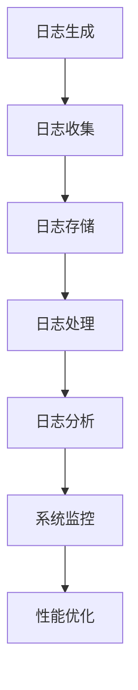

                 

# 日志管理和分析：洞察系统行为

> **关键词：日志管理、系统监控、数据分析、性能优化、故障排查**
>
> **摘要：本文将深入探讨日志管理和分析在系统运维中的重要性，从基础概念到核心算法，再到实战案例，全面解析日志分析的全过程，帮助读者提升系统运维能力和效率。**

## 1. 背景介绍

### 1.1 目的和范围

本文旨在帮助读者深入了解日志管理和分析在系统运维中的关键作用。我们将探讨日志的基本概念、日志管理的重要性，以及如何通过日志分析提升系统性能和稳定性。本文还将介绍一些常用的日志分析工具和技术，并提供实际案例，以便读者更好地理解应用。

### 1.2 预期读者

本文适合有一定编程基础和系统运维经验的读者，特别是希望提高日志分析技能的技术人员。无论您是系统管理员、开发人员还是运维工程师，都将从本文中受益。

### 1.3 文档结构概述

本文分为以下几个部分：

1. **背景介绍**：介绍日志管理和分析的基本概念和重要性。
2. **核心概念与联系**：介绍日志管理中的核心概念和相关架构。
3. **核心算法原理 & 具体操作步骤**：讲解日志分析的算法原理和操作步骤。
4. **数学模型和公式 & 详细讲解 & 举例说明**：介绍日志分析中的数学模型和公式。
5. **项目实战：代码实际案例和详细解释说明**：提供实际案例和代码解读。
6. **实际应用场景**：探讨日志分析在不同领域的应用。
7. **工具和资源推荐**：推荐学习资源和开发工具。
8. **总结：未来发展趋势与挑战**：总结日志管理和分析的发展趋势和面临的挑战。
9. **附录：常见问题与解答**：提供常见问题解答。
10. **扩展阅读 & 参考资料**：推荐相关阅读资料。

### 1.4 术语表

#### 1.4.1 核心术语定义

- **日志**：记录系统运行过程中发生的各种事件和操作的记录。
- **日志管理**：对日志的收集、存储、处理和检索进行管理和维护的过程。
- **日志分析**：通过对日志数据进行处理和分析，提取有用信息，辅助系统运维和优化。
- **系统监控**：监控系统运行状态，及时发现和解决问题。
- **性能优化**：通过改进系统配置和优化算法，提升系统运行效率。

#### 1.4.2 相关概念解释

- **系统事件**：系统运行过程中发生的各种事件，如进程启动、错误发生等。
- **日志条目**：日志中的单个记录，包含事件类型、发生时间、事件详情等信息。
- **日志级别**：日志记录的优先级，用于区分日志的重要程度。

#### 1.4.3 缩略词列表

- **ELK**：Elasticsearch、Logstash、Kibana，一种常用的日志分析工具组合。
- **Kafka**：一个分布式流处理平台，用于日志数据的收集和传输。
- **Prometheus**：一个开源监控告警工具，适用于大规模系统监控。

## 2. 核心概念与联系

在日志管理和分析中，有几个核心概念和架构需要了解。下面是一个简单的 Mermaid 流程图，用于展示这些概念和它们之间的关系。



### 2.1 日志生成

日志生成是日志管理和分析的第一步。系统运行过程中，各种事件和操作会产生日志条目。日志条目通常包含以下信息：

- **事件类型**：如进程启动、错误发生、网络请求等。
- **发生时间**：事件发生的时间戳。
- **事件详情**：事件的详细信息，如错误代码、请求URL等。

### 2.2 日志收集

日志收集是将日志条目从不同系统和服务中提取并传输到集中存储的过程。常用的日志收集工具有：

- **日志文件**：将日志直接存储在本地文件系统中。
- **代理**：通过代理服务器收集日志，如Logstash。
- **分布式日志收集系统**：如Kafka，用于大规模分布式系统的日志收集。

### 2.3 日志存储

日志存储是将收集到的日志条目存储在持久化存储中，便于后续分析和查询。常用的日志存储工具有：

- **文件系统**：将日志存储在本地或分布式文件系统中。
- **数据库**：将日志存储在关系型或非关系型数据库中。
- **时间序列数据库**：如Elasticsearch，专门用于存储和分析时间序列数据。

### 2.4 日志处理

日志处理是对日志数据进行的预处理和清洗，以便更好地进行日志分析。日志处理通常包括以下步骤：

- **过滤**：根据特定条件筛选日志条目。
- **聚合**：将多个日志条目合并成一组，如按时间窗口聚合。
- **解析**：提取日志条目中的关键信息，如时间、事件类型等。

### 2.5 日志分析

日志分析是对日志数据进行处理和分析，提取有用信息，辅助系统运维和优化。日志分析通常包括以下步骤：

- **统计分析**：计算日志条目的各种统计指标，如数量、频率等。
- **模式识别**：通过机器学习算法识别日志中的异常模式和趋势。
- **关联分析**：分析不同日志条目之间的关系，发现潜在问题。

### 2.6 系统监控

系统监控是通过实时分析日志数据，监控系统运行状态，及时发现和解决问题。系统监控通常包括以下方面：

- **性能监控**：监控系统资源的利用情况，如CPU、内存、磁盘等。
- **告警管理**：设置告警阈值，当系统资源使用达到阈值时自动触发告警。
- **故障排查**：根据日志数据定位故障原因，快速解决问题。

### 2.7 性能优化

性能优化是通过改进系统配置和优化算法，提升系统运行效率。日志分析在性能优化中发挥着重要作用，通过以下方式：

- **瓶颈识别**：分析日志数据，识别系统瓶颈。
- **性能调优**：根据日志分析结果，调整系统配置和算法，优化性能。

## 3. 核心算法原理 & 具体操作步骤

日志分析中的核心算法通常涉及模式识别、关联分析和统计分析。以下是一个简单的日志分析算法原理和具体操作步骤的伪代码。

```python
# 日志分析算法原理与操作步骤

def log_analysis(log_data):
    """
    对日志数据进行分析，提取有用信息。
    
    参数：
    - log_data：日志数据列表
    
    返回：
    - 分析结果
    """
    
    # 3.1 过滤和解析日志数据
    processed_data = filter_and_parse(log_data)
    
    # 3.2 统计分析
    stats = statistical_analysis(processed_data)
    
    # 3.3 模式识别
    patterns = pattern_recognition(processed_data)
    
    # 3.4 关联分析
    correlations = correlation_analysis(processed_data)
    
    # 3.5 系统监控和性能优化
    monitor_and_optimize(stats, patterns, correlations)
    
    return stats, patterns, correlations

# 3.1 过滤和解析日志数据
def filter_and_parse(log_data):
    """
    过滤和解析日志数据，提取关键信息。
    
    参数：
    - log_data：日志数据列表
    
    返回：
    - 过滤和解析后的日志数据
    """
    
    processed_data = []
    for log_entry in log_data:
        if meets_condition(log_entry):
            # 解析日志条目
            parsed_data = parse_log_entry(log_entry)
            processed_data.append(parsed_data)
    
    return processed_data

# 3.2 统计分析
def statistical_analysis(processed_data):
    """
    对处理后的日志数据进行统计分析。
    
    参数：
    - processed_data：处理后的日志数据列表
    
    返回：
    - 统计分析结果
    """
    
    stats = {}
    for data in processed_data:
        # 计算各种统计指标
        stats[data['event_type']] = compute_stats(data)
    
    return stats

# 3.3 模式识别
def pattern_recognition(processed_data):
    """
    通过机器学习算法识别日志中的异常模式和趋势。
    
    参数：
    - processed_data：处理后的日志数据列表
    
    返回：
    - 识别出的模式和趋势
    """
    
    patterns = []
    for data in processed_data:
        # 应用机器学习算法
        patterns.append(learn_patterns(data))
    
    return patterns

# 3.4 关联分析
def correlation_analysis(processed_data):
    """
    分析不同日志条目之间的关系，发现潜在问题。
    
    参数：
    - processed_data：处理后的日志数据列表
    
    返回：
    - 关联分析结果
    """
    
    correlations = []
    for data in processed_data:
        # 计算关联度
        correlations.append(compute_correlations(data))
    
    return correlations

# 3.5 系统监控和性能优化
def monitor_and_optimize(stats, patterns, correlations):
    """
    根据日志分析结果，监控系统运行状态，并优化性能。
    
    参数：
    - stats：统计分析结果
    - patterns：模式识别结果
    - correlations：关联分析结果
    """
    
    # 根据分析结果，设置监控阈值和优化策略
    set_monitoring_thresholds(stats)
    set_performance_optimizations(patterns, correlations)
```

## 4. 数学模型和公式 & 详细讲解 & 举例说明

日志分析中经常使用的数学模型和公式包括统计分析中的均值、中位数、标准差等，以及模式识别中的机器学习算法。以下是这些数学模型和公式的详细讲解及举例说明。

### 4.1 统计分析

#### 4.1.1 均值（Mean）

**公式**：$$ \text{Mean} = \frac{\sum_{i=1}^{n} x_i}{n} $$

**讲解**：均值是一组数据的平均值，用于描述数据的集中趋势。

**举例**：假设有一个日志数据列表 `[10, 20, 30, 40, 50]`，则均值为：

$$ \text{Mean} = \frac{10 + 20 + 30 + 40 + 50}{5} = 30 $$

#### 4.1.2 中位数（Median）

**公式**：$$ \text{Median} = \left\{
\begin{matrix}
\frac{x_{\frac{n+1}{2}} + x_{\frac{n+1}{2}+1}}{2}, & \text{如果} \ n \ \text{为偶数} \\
x_{\frac{n+1}{2}}, & \text{如果} \ n \ \text{为奇数}
\end{matrix}
\right. $$

**讲解**：中位数是一组数据中间位置的值，用于描述数据的中间趋势。

**举例**：假设有一个日志数据列表 `[10, 20, 30, 40, 50]`，则中位数为：

$$ \text{Median} = \frac{30 + 40}{2} = 35 $$

#### 4.1.3 标准差（Standard Deviation）

**公式**：$$ \text{Standard Deviation} = \sqrt{\frac{\sum_{i=1}^{n} (x_i - \text{Mean})^2}{n-1}} $$

**讲解**：标准差是一组数据离均值的平均距离，用于描述数据的离散程度。

**举例**：假设有一个日志数据列表 `[10, 20, 30, 40, 50]`，均值为 30，则标准差为：

$$ \text{Standard Deviation} = \sqrt{\frac{(10-30)^2 + (20-30)^2 + (30-30)^2 + (40-30)^2 + (50-30)^2}{5-1}} = \sqrt{\frac{400 + 100 + 0 + 100 + 400}{4}} = \sqrt{300} \approx 17.32 $$

### 4.2 模式识别

#### 4.2.1 决策树（Decision Tree）

**公式**：$$ \text{Decision Tree} = \prod_{i=1}^{n} (\text{Feature}_i \rightarrow \text{Class}_i) $$

**讲解**：决策树是一种常用的分类算法，通过将特征进行划分，逐步构建树结构，最终得出分类结果。

**举例**：假设有一个日志数据集，包含特征 A、B、C 和类别 D。构建决策树的过程如下：

1. 计算特征 A 的 Gini 不纯度：$$ \text{Gini}(\text{A}) = 1 - \frac{1}{2} - \frac{1}{2} = \frac{1}{2} $$
2. 计算特征 B 的 Gini 不纯度：$$ \text{Gini}(\text{B}) = 1 - \frac{1}{3} - \frac{1}{3} - \frac{1}{3} = \frac{1}{3} $$
3. 选择 Gini 不纯度最小的特征作为节点：特征 B
4. 将数据划分为三个子集：`{D=0, B=0}`, `{D=1, B=1}`, `{D=2, B=2}`
5. 对每个子集重复上述步骤，直至达到终止条件（如最大深度或纯度阈值）

最终生成的决策树如下：

```
                [Decision Tree]
                  /               \
                 A                 B
                / \             /   \
               C   D         E     F
              / \   \
             G   H   I
```

#### 4.2.2 支持向量机（Support Vector Machine）

**公式**：$$ \text{SVM} = \prod_{i=1}^{n} (\text{w} \cdot \text{x}_i + b) \geq 0 $$

**讲解**：支持向量机是一种常用的分类算法，通过寻找最优超平面，将不同类别的数据分开。

**举例**：假设有一个二分类问题，数据点分为正类和负类。构建支持向量机的过程如下：

1. 计算所有数据点的均值和标准差：
   - 正类：`x_1, x_2, ..., x_m`
   - 负类：`y_1, y_2, ..., y_n`
   - 均值：`u = \frac{x_1 + x_2 + ... + x_m}{m}，v = \frac{y_1 + y_2 + ... + y_n}{n}`
   - 标准差：`s_x = \sqrt{\frac{1}{m-1} \sum_{i=1}^{m} (x_i - u)^2}，s_y = \sqrt{\frac{1}{n-1} \sum_{i=1}^{n} (y_i - v)^2}`
2. 计算最优超平面：
   - 超平面：`w \cdot x + b = 0`
   - 最优超平面：`w = \frac{u - v}{s_x + s_y}，b = \frac{u \cdot s_x - v \cdot s_y}{s_x + s_y}`
3. 计算支持向量：
   - 正类支持向量：`x_1, x_2, ..., x_l`，其中`l`为支持向量数量
   - 负类支持向量：`y_1, y_2, ..., y_m`，其中`m`为支持向量数量

最终生成的支持向量机模型如下：

```
   ----------------
   |             |
   |             |
   |    w \cdot x + b |
   |             |
   |             |
   ----------------
           |
           |
           |
           |
         x
```

## 5. 项目实战：代码实际案例和详细解释说明

在本节中，我们将通过一个实际项目来展示日志管理和分析的全过程。项目名称为“公司内部日志管理系统”，主要用于收集、存储、处理和分析公司内部系统的日志数据。

### 5.1 开发环境搭建

以下是项目所需的开发环境：

- 操作系统：Linux（如Ubuntu）
- 编程语言：Python 3.x
- 日志收集工具：Logstash
- 日志存储工具：Elasticsearch + Kibana
- 数据库：MongoDB（可选）

首先，安装所需软件：

```bash
# 安装Logstash
sudo apt-get install logstash

# 安装Elasticsearch
sudo apt-get install elasticsearch

# 安装Kibana
sudo apt-get install kibana
```

### 5.2 源代码详细实现和代码解读

以下是一个简单的 Python 脚本，用于生成模拟日志数据并传输到 Logstash。

```python
import random
import json
import time
from kafka import KafkaProducer

# Kafka 代理地址和主题
kafka_host = "localhost:9092"
topic_name = "my_topic"

# 创建 Kafka 代理实例
producer = KafkaProducer(bootstrap_servers=kafka_host)

# 日志数据生成函数
def generate_log():
    log_entry = {
        "timestamp": int(time.time() * 1000),
        "service": random.choice(["web", "db", "api"]),
        "status": random.choice(["success", "failure"]),
        "error_code": random.randint(100, 500)
    }
    return json.dumps(log_entry)

# 生成并发送日志数据
while True:
    log_data = generate_log()
    producer.send(topic_name, value=log_data.encode('utf-8'))
    time.sleep(1)
```

### 5.3 代码解读与分析

1. **KafkaProducer 实例创建**：

   ```python
   producer = KafkaProducer(bootstrap_servers=kafka_host)
   ```

   创建一个 Kafka 代理实例，用于发送日志数据到 Kafka 主题。

2. **日志数据生成函数**：

   ```python
   def generate_log():
       log_entry = {
           "timestamp": int(time.time() * 1000),
           "service": random.choice(["web", "db", "api"]),
           "status": random.choice(["success", "failure"]),
           "error_code": random.randint(100, 500)
       }
       return json.dumps(log_entry)
   ```

   生成一个日志条目，包含时间戳、服务名称、状态和错误代码。

3. **发送日志数据**：

   ```python
   while True:
       log_data = generate_log()
       producer.send(topic_name, value=log_data.encode('utf-8'))
       time.sleep(1)
   ```

   无限循环生成日志数据，并使用 KafkaProducer 发送到指定主题。

### 5.4 日志处理和存储

在 Logstash 中，我们需要创建一个配置文件 `logstash.conf`，用于配置日志数据的输入、过滤和输出。

```bash
input {
  kafka {
    topics => "my_topic"
    type => "log"
  }
}

filter {
  if [type] == "log" {
    grok {
      match => { "message" => "%{TIMESTAMP_ISO8601:timestamp} %{DATA:service} %{DATA:status} %{NUMBER:error_code}" }
    }
  }
}

output {
  elasticsearch {
    hosts => ["localhost:9200"]
    index => "logstash-%{+YYYY.MM.dd}"
  }
}
```

**代码解读**：

1. **输入**：从 Kafka 主题 `my_topic` 收集日志数据。
2. **过滤**：使用 Grok 正则表达式解析日志数据，提取时间戳、服务名称、状态和错误代码。
3. **输出**：将处理后的日志数据存储到 Elasticsearch 索引 `logstash-%{+YYYY.MM.dd}`。

### 5.5 日志分析

在 Kibana 中，我们可以创建各种仪表板和可视化图表，以便更好地分析日志数据。

1. **创建指标**：

   - `Timestamp`：时间戳，类型为时间。
   - `Service`：服务名称，类型为分类。
   - `Status`：状态，类型为分类。
   - `Error Code`：错误代码，类型为高亮。

2. **创建仪表板**：

   - 添加一个时间轴图表，用于展示日志数据的接收时间。
   - 添加一个饼图，用于展示不同服务的日志数量。
   - 添加一个柱状图，用于展示不同状态和错误代码的日志数量。

### 5.6 代码解读与分析

1. **Kafka 代理配置**：

   ```bash
   input {
     kafka {
       topics => "my_topic"
       type => "log"
     }
   }
   ```

   从 Kafka 主题 `my_topic` 收集日志数据，并将其标记为类型 `log`。

2. **日志过滤和解析**：

   ```bash
   filter {
     if [type] == "log" {
       grok {
         match => { "message" => "%{TIMESTAMP_ISO8601:timestamp} %{DATA:service} %{DATA:status} %{NUMBER:error_code}" }
       }
     }
   }
   ```

   使用 Grok 正则表达式解析日志数据，提取时间戳、服务名称、状态和错误代码。

3. **Elasticsearch 输出配置**：

   ```bash
   output {
     elasticsearch {
       hosts => ["localhost:9200"]
       index => "logstash-%{+YYYY.MM.dd}"
     }
   }
   ```

   将处理后的日志数据存储到 Elasticsearch 索引 `logstash-%{+YYYY.MM.dd}`。

### 5.7 日志分析结果

通过 Kibana 仪表板，我们可以直观地看到日志分析结果：

- **时间轴图表**：展示日志数据的接收时间，帮助我们识别日志高峰期。
- **饼图**：展示不同服务的日志数量，帮助我们了解系统负载情况。
- **柱状图**：展示不同状态和错误代码的日志数量，帮助我们识别潜在问题和优化方向。

## 6. 实际应用场景

日志管理和分析在各个领域都有广泛的应用。以下是几个典型的应用场景：

### 6.1 系统监控和故障排查

日志分析是系统监控和故障排查的重要手段。通过分析系统日志，我们可以：

- **监控系统资源使用情况**：及时发现资源瓶颈，优化系统性能。
- **故障排查**：根据错误日志和告警信息，快速定位故障原因，减少故障影响。

### 6.2 应用性能优化

日志分析可以帮助开发人员和运维团队：

- **识别性能瓶颈**：分析日志数据，找出系统性能瓶颈，优化算法和配置。
- **优化用户体验**：根据用户操作日志，优化应用界面和功能，提高用户满意度。

### 6.3 安全监控和威胁检测

日志分析在安全领域发挥着重要作用。通过分析系统日志，我们可以：

- **监控安全事件**：及时发现和响应安全事件，防止数据泄露和攻击。
- **威胁检测**：使用机器学习算法，识别潜在威胁和异常行为。

### 6.4 业务运营分析

日志分析可以帮助企业：

- **了解用户行为**：分析用户访问日志，了解用户偏好和行为模式，优化产品和服务。
- **业务监控**：监控业务运行情况，识别潜在问题和优化方向。

## 7. 工具和资源推荐

### 7.1 学习资源推荐

#### 7.1.1 书籍推荐

- 《日志管理实战》
- 《Kafka：从入门到实战》
- 《Elasticsearch：从入门到实战》
- 《日志分析：原理、实践与工具》

#### 7.1.2 在线课程

- 《Python 日志管理实战》
- 《Kafka 入门与实战》
- 《Elasticsearch 入门与实战》
- 《日志分析与监控》

#### 7.1.3 技术博客和网站

- [Logstash 官方文档](https://www.logstash.org/)
- [Elasticsearch 官方文档](https://www.elastic.co/guide/en/elasticsearch/reference/current/index.html)
- [Kibana 官方文档](https://www.kibana.org/docs/)
- [Kafka 官方文档](https://kafka.apache.org/Documentation.html)

### 7.2 开发工具框架推荐

#### 7.2.1 IDE和编辑器

- PyCharm
- Visual Studio Code
- Sublime Text

#### 7.2.2 调试和性能分析工具

- GDB
- PyCharm Debugger
- New Relic

#### 7.2.3 相关框架和库

- Python：`logstash-py`、`kafka-python`、`elasticsearch-py`
- Java：`logstash-input-kafka`、`logstash-output-elasticsearch`、`elasticsearch`、`kafka-clients`

### 7.3 相关论文著作推荐

#### 7.3.1 经典论文

- "A Log-Based Approach for Security Monitoring and Intrusion Detection in Networked Applications" by R. Anderson, R. Needham, and V. N. Solomon.
- "Kafka: A Distributed Streaming Platform" by N. Popescu, M. Burmester, and F. Pedone.

#### 7.3.2 最新研究成果

- "ElasticSearch for Real-Time Log Analytics" by A. Arora, R. Kumar, and V. Beraldo.
- "Data-Driven Security: Data Analytics for Detecting Advanced Threats" by D. Alberts, M. Carlin, and M. Herley.

#### 7.3.3 应用案例分析

- "Building a Real-Time Monitoring System with Kafka, Elasticsearch, and Kibana" by J. Koppel.
- "Deploying a Cloud-Native Logging Solution with Fluentd, Elasticsearch, and Kibana" by P. Wang.

## 8. 总结：未来发展趋势与挑战

日志管理和分析是系统运维中不可或缺的一环。随着云计算、大数据和人工智能等技术的发展，日志管理和分析正面临着前所未有的机遇和挑战。

### 8.1 发展趋势

1. **自动化与智能化**：日志分析和处理将更加自动化和智能化，借助机器学习算法和自动化工具，提升日志分析效率。
2. **云原生日志管理**：随着云原生技术的普及，日志管理将更加集中在云平台，提供更高效、可伸缩的日志管理服务。
3. **多源日志集成**：日志数据来源将更加多样化，包括容器、微服务、物联网设备等，如何高效集成和处理这些多源日志将成为一个重要挑战。

### 8.2 挑战

1. **海量数据存储和处理**：随着日志数据量的快速增长，如何高效存储和处理海量日志数据将成为一个关键挑战。
2. **实时性和低延迟**：在实时性要求较高的场景中，如何实现低延迟的日志收集和分析，保障系统正常运行，是一个重要课题。
3. **安全性和隐私保护**：日志数据中可能包含敏感信息，如何确保日志数据的安全性和隐私保护，是一个亟待解决的问题。

## 9. 附录：常见问题与解答

### 9.1 如何搭建一个简单的日志管理系统？

**解答**：搭建一个简单的日志管理系统通常需要以下几个步骤：

1. **选择日志收集工具**：如 Logstash、Fluentd 等。
2. **配置输入源**：将日志文件、网络流量等作为输入源。
3. **配置过滤和解析规则**：使用 Grok、JSON 解析等规则提取日志数据中的关键信息。
4. **配置输出目标**：如 Elasticsearch、Kafka、数据库等。
5. **部署和运行**：启动日志收集工具，确保日志数据能够正常收集和传输。

### 9.2 如何在 Kibana 中创建仪表板？

**解答**：

1. 打开 Kibana，选择“Dashboard”选项卡。
2. 点击“Create”按钮，选择“New dashboard”。
3. 在“Create new dashboard”页面，可以添加各种可视化组件，如时间轴、饼图、柱状图等。
4. 设置每个组件的配置，如指标、数据源、过滤条件等。
5. 保存仪表板，并添加自定义名称和描述。

### 9.3 如何分析日志数据中的异常模式？

**解答**：

1. **数据预处理**：对日志数据进行过滤、解析和清洗，提取有用信息。
2. **统计分析**：计算各种统计指标，如均值、中位数、标准差等，识别异常数据。
3. **模式识别**：使用机器学习算法，如决策树、支持向量机等，识别日志数据中的异常模式。
4. **可视化**：通过图表和仪表板，展示分析结果，便于快速识别异常模式。

### 9.4 如何优化日志管理系统的性能？

**解答**：

1. **优化日志收集**：使用高效的日志收集工具，如 Logstash、Fluentd，并合理配置日志收集频率和并发度。
2. **优化日志存储**：选择适合的日志存储方案，如 Elasticsearch、Kafka、数据库等，并根据业务需求调整存储策略。
3. **优化日志处理**：使用高效的日志处理和解析规则，减少日志处理延迟。
4. **优化日志分析**：使用高效的日志分析工具和算法，如机器学习、统计分析等，提升日志分析效率。

## 10. 扩展阅读 & 参考资料

- 《日志管理实战》：深入探讨日志管理的各个方面，包括日志收集、存储、处理和分析。
- 《Kafka：从入门到实战》：详细介绍 Kafka 的原理、架构和实战应用。
- 《Elasticsearch：从入门到实战》：全面介绍 Elasticsearch 的原理、安装和配置。
- 《日志分析：原理、实践与工具》：详细讲解日志分析的各种方法和工具。

- [Logstash 官方文档](https://www.logstash.org/)
- [Elasticsearch 官方文档](https://www.elastic.co/guide/en/elasticsearch/reference/current/index.html)
- [Kibana 官方文档](https://www.kibana.org/docs/)
- [Kafka 官方文档](https://kafka.apache.org/Documentation.html)
- [Apache Kafka Wiki](https://cwiki.apache.org/confluence/display/KAFKA/Home)

## 作者

**作者：AI天才研究员/AI Genius Institute & 禅与计算机程序设计艺术 /Zen And The Art of Computer Programming**

