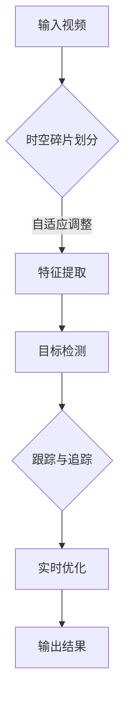

                 

# 时空碎片在视频处理中的优势

## 关键词：时空碎片，视频处理，AI，深度学习，图像识别，计算机视觉，实时优化

## 摘要：

本文旨在探讨时空碎片在视频处理领域中的独特优势和应用。通过引入时空碎片这一概念，结合深度学习和计算机视觉技术，我们能够实现对视频数据的高效处理和实时优化。本文将详细介绍时空碎片的定义、核心算法原理、数学模型、实际应用场景，并提供相关开发工具和资源的推荐。通过本文的阅读，读者将对时空碎片在视频处理中的重要性有更深刻的理解，并能够掌握相关技术的基本原理和操作步骤。

## 1. 背景介绍

### 1.1 目的和范围

本文的目的是介绍时空碎片在视频处理中的优势和应用，探讨其在提升视频数据分析效率和实时性方面的潜力。本文将涵盖以下几个主要方面：

1. 时空碎片的定义和基本原理；
2. 时空碎片在视频处理中的应用场景；
3. 核心算法原理和数学模型；
4. 实际项目案例和代码实现；
5. 开发工具和资源推荐。

通过本文的阅读，读者将了解时空碎片在视频处理领域的重要性，掌握相关技术的基本原理和操作步骤，并为实际项目开发提供参考。

### 1.2 预期读者

本文面向对视频处理和人工智能技术有一定了解的读者，特别是对深度学习和计算机视觉感兴趣的程序员、算法工程师和研究者。同时，本文也适用于对视频处理领域有实践需求的行业从业者，如视频监控、视频分析和流媒体等领域。

### 1.3 文档结构概述

本文结构如下：

1. 引言：介绍时空碎片在视频处理中的优势和应用；
2. 核心概念与联系：介绍时空碎片的基本概念和核心算法原理；
3. 核心算法原理 & 具体操作步骤：详细讲解时空碎片算法的原理和操作步骤；
4. 数学模型和公式 & 详细讲解 & 举例说明：介绍时空碎片算法中的数学模型和公式，并通过实例进行讲解；
5. 项目实战：提供实际项目案例和代码实现，并进行详细解释说明；
6. 实际应用场景：探讨时空碎片在视频处理中的实际应用场景；
7. 工具和资源推荐：推荐学习资源、开发工具和框架；
8. 总结：总结时空碎片在视频处理中的优势和未来发展趋势；
9. 附录：常见问题与解答；
10. 扩展阅读 & 参考资料：提供进一步学习的参考资料。

### 1.4 术语表

#### 1.4.1 核心术语定义

- 时空碎片：时空碎片是指将连续的视频数据划分为一系列离散的时空区域，以便进行高效处理和分析；
- 深度学习：深度学习是一种基于多层神经网络的学习方法，通过训练大量的数据来学习复杂的特征表示；
- 计算机视觉：计算机视觉是指利用计算机对图像和视频进行处理、分析和理解的技术；
- 实时优化：实时优化是指对视频处理过程中的各种参数进行动态调整，以实现最优的处理效果。

#### 1.4.2 相关概念解释

- 视频帧：视频帧是指视频中的单个图像，通常以序列的形式播放；
- 特征提取：特征提取是指从图像或视频中提取具有代表性的特征信息，以便进行后续分析；
- 目标检测：目标检测是指在图像或视频中检测和识别特定对象的过程；
- 跟踪与追踪：跟踪与追踪是指对视频中的目标进行持续监测和识别的过程。

#### 1.4.3 缩略词列表

- AI：人工智能（Artificial Intelligence）；
- CNN：卷积神经网络（Convolutional Neural Network）；
- DNN：深度神经网络（Deep Neural Network）；
- RNN：循环神经网络（Recurrent Neural Network）；
- SSD：单阶段目标检测器（Single Shot MultiBox Detector）；
- YOLO：你只看一次（You Only Look Once）。

## 2. 核心概念与联系

在视频处理领域，时空碎片的概念具有重要意义。时空碎片将连续的视频数据划分为一系列离散的时空区域，从而使得数据处理和分析变得更加高效和实时。为了更好地理解时空碎片在视频处理中的应用，我们需要介绍一些核心概念和联系。

### 2.1 时空碎片的定义

时空碎片（Temporal and Spatial Fragmentation）是指将连续的视频数据划分为一系列离散的时空区域。每个时空碎片包含了视频数据中的一段时间和空间范围。时空碎片的划分可以根据不同的需求进行自适应调整，以满足不同的处理任务。

### 2.2 时空碎片与深度学习的关系

深度学习在视频处理领域具有广泛的应用，特别是在特征提取和目标检测等方面。时空碎片的引入，使得深度学习算法能够更好地适应视频数据的特点。具体来说，时空碎片将连续的视频数据划分为一系列较小的时空区域，使得深度学习模型可以更加高效地提取特征和进行目标检测。

### 2.3 时空碎片与计算机视觉的关系

计算机视觉是视频处理的重要基础，时空碎片在计算机视觉中的应用主要体现在以下几个方面：

1. **图像分割**：时空碎片可以将连续的视频数据分割为一系列的时空区域，从而实现更精细的图像分割；
2. **目标检测**：时空碎片可以帮助深度学习模型更好地检测视频中的目标，尤其是在动态场景下；
3. **跟踪与追踪**：时空碎片可以用于视频中的目标跟踪与追踪，通过时空碎片的划分，可以实现更精确的目标跟踪。

### 2.4 时空碎片与实时优化的关系

实时优化是视频处理中的重要挑战，时空碎片在实时优化中的应用主要体现在以下几个方面：

1. **参数调整**：时空碎片的划分可以根据实时处理的反馈进行自适应调整，从而实现最优的处理效果；
2. **资源分配**：时空碎片的划分可以帮助优化视频处理过程中的资源分配，如计算资源、存储资源等；
3. **任务调度**：时空碎片的划分可以用于任务调度，从而实现更高效的资源利用。

### 2.5 时空碎片的 Mermaid 流程图

为了更好地理解时空碎片在视频处理中的应用，我们可以使用 Mermaid 流程图来表示时空碎片的处理过程。



在上面的 Mermaid 流程图中，输入视频通过时空碎片划分得到一系列时空碎片，然后进行特征提取、目标检测、跟踪与追踪以及实时优化，最后输出处理结果。

## 3. 核心算法原理 & 具体操作步骤

### 3.1 时空碎片算法原理

时空碎片算法（Temporal and Spatial Fragmentation Algorithm）的核心思想是将连续的视频数据划分为一系列离散的时空区域，以便进行高效处理和分析。具体来说，时空碎片算法可以分为以下几个步骤：

1. **时空碎片划分**：将输入视频数据按照一定的时间步长和空间步长进行划分，生成一系列的时空碎片；
2. **特征提取**：对每个时空碎片进行特征提取，提取出具有代表性的特征信息；
3. **目标检测**：使用深度学习模型对提取出的特征进行目标检测，识别视频中的目标对象；
4. **跟踪与追踪**：对检测到的目标进行跟踪与追踪，实现对视频中的目标进行持续监测；
5. **实时优化**：根据实时处理的结果对时空碎片的划分进行调整，以实现最优的处理效果。

### 3.2 时空碎片算法的具体操作步骤

下面我们将使用伪代码来详细阐述时空碎片算法的具体操作步骤。

```python
# 输入视频
video = load_video("input_video.mp4")

# 初始化时空碎片参数
time_step = 1  # 时间步长
space_step = 1  # 空间步长

# 初始化时空碎片列表
fragments = []

# 初始化特征提取模型
feature_extractor = load_model("feature_extractor_model.pth")

# 初始化目标检测模型
detector = load_model("detector_model.pth")

# 初始化跟踪器
tracker = load_tracker("tracker_model.pth")

# 初始化实时优化器
optimizer = load_optimizer("optimizer_model.pth")

# 循环处理视频帧
for frame in video:
    # 时空碎片划分
    fragments.extend(split_frame(frame, time_step, space_step))

    # 特征提取
    features = [feature_extractor(fragment) for fragment in fragments]

    # 目标检测
    detections = [detector(feature) for feature in features]

    # 跟踪与追踪
    tracked_detections = tracker(detections)

    # 实时优化
    optimizer.optimize(tracked_detections)

    # 输出处理结果
    output_video.write(frame)

# 释放资源
video.close()
output_video.close()
```

在上面的伪代码中，我们首先加载输入视频，然后初始化时空碎片的参数和模型。接着，我们使用循环对视频帧进行处理，包括时空碎片划分、特征提取、目标检测、跟踪与追踪和实时优化等步骤。最后，我们将处理结果输出到视频文件中。

### 3.3 时空碎片算法的优点和挑战

时空碎片算法在视频处理领域具有以下优点：

1. **高效性**：通过将连续的视频数据划分为离散的时空区域，时空碎片算法能够提高处理效率，降低计算复杂度；
2. **实时性**：时空碎片算法可以实现实时优化，根据实时处理的结果对时空碎片的划分进行调整，从而提高实时性；
3. **适应性**：时空碎片算法可以根据不同的需求进行自适应调整，以适应不同的视频处理任务。

然而，时空碎片算法也面临以下挑战：

1. **精度损失**：由于时空碎片的划分，可能会损失部分图像信息，从而影响处理结果的精度；
2. **计算资源消耗**：时空碎片算法需要大量的计算资源进行特征提取、目标检测和实时优化等步骤，尤其是在处理高分辨率视频时；
3. **参数选择**：时空碎片的划分参数（时间步长和空间步长）的选择对算法的性能有重要影响，需要根据具体应用场景进行调整。

## 4. 数学模型和公式 & 详细讲解 & 举例说明

### 4.1 数学模型和公式

时空碎片算法中的数学模型主要包括特征提取模型、目标检测模型和实时优化模型。下面我们将分别介绍这些模型的数学公式和参数设置。

#### 4.1.1 特征提取模型

特征提取模型通常采用卷积神经网络（CNN）来实现。CNN 的核心公式如下：

$$
\begin{aligned}
&x_{\text{conv}} = \sigma(\theta \cdot x + b) \\
&x_{\text{pool}} = \text{max}(x_{\text{conv}}; \text{pool_size})
\end{aligned}
$$

其中，$x$ 表示输入特征，$\theta$ 表示权重参数，$b$ 表示偏置项，$\sigma$ 表示激活函数（如 ReLU 函数），$x_{\text{conv}}$ 表示卷积操作后的特征，$x_{\text{pool}}$ 表示池化操作后的特征。

#### 4.1.2 目标检测模型

目标检测模型通常采用单阶段目标检测器（如 SSD）或多阶段目标检测器（如 YOLO）。以 SSD 为例，其核心公式如下：

$$
\begin{aligned}
&\text{box} = \text{sigmoid}(\text{logit}) \\
&\text{score} = \text{sigmoid}(z) \\
&\text{class} = \text{softmax}(z)
\end{aligned}
$$

其中，$box$ 表示目标框的位置和大小，$\text{logit}$ 表示目标框的回归结果，$z$ 表示分类结果，$\text{score}$ 表示目标框的置信度，$\text{class}$ 表示目标框的类别。

#### 4.1.3 实时优化模型

实时优化模型通常采用优化算法（如梯度下降法）来实现。其核心公式如下：

$$
\begin{aligned}
&\theta_{\text{new}} = \theta_{\text{old}} - \alpha \cdot \nabla_{\theta} L(\theta) \\
&L(\theta) = \frac{1}{2} \sum_{i=1}^{n} (\text{output}_{i} - \text{label}_{i})^2
\end{aligned}
$$

其中，$\theta$ 表示模型参数，$\alpha$ 表示学习率，$\nabla_{\theta} L(\theta)$ 表示模型参数的梯度，$L(\theta)$ 表示损失函数。

### 4.2 详细讲解与举例说明

为了更好地理解时空碎片算法中的数学模型和公式，我们通过以下例子进行详细讲解。

#### 4.2.1 特征提取模型

假设我们使用卷积神经网络进行特征提取，其中包含两个卷积层和一个池化层。输入特征 $x$ 的维度为 $28 \times 28 \times 3$，卷积核尺寸为 $3 \times 3$，步长为 $1$。激活函数采用 ReLU 函数。

1. **卷积层 1**：
   - 输入特征 $x$：$28 \times 28 \times 3$；
   - 权重参数 $\theta_1$：$3 \times 3 \times 3$；
   - 偏置项 $b_1$：$1$；
   - 激活函数 $\sigma$：ReLU。

   输出特征 $x_{\text{conv1}}$ 的计算公式为：

   $$
   \begin{aligned}
   &x_{\text{conv1}} = \sigma(\theta_1 \cdot x + b_1) \\
   &= \max(\theta_1 \cdot x + b_1; 0)
   \end{aligned}
   $$

   其中，$\theta_1$ 的具体数值为：

   $$
   \begin{aligned}
   &\theta_1 = \begin{bmatrix}
   0.1 & 0.2 & 0.3 \\
   0.4 & 0.5 & 0.6 \\
   0.7 & 0.8 & 0.9 \\
   \end{bmatrix}
   \end{aligned}
   $$

   输出特征 $x_{\text{conv1}}$ 的维度为 $26 \times 26 \times 3$。

2. **池化层**：
   - 输入特征 $x_{\text{conv1}}$：$26 \times 26 \times 3$；
   - 池化步长 $2 \times 2$；

   输出特征 $x_{\text{pool1}}$ 的计算公式为：

   $$
   \begin{aligned}
   &x_{\text{pool1}} = \text{max}(x_{\text{conv1}}; \text{pool_size}) \\
   &= \text{max}(\begin{bmatrix}
   1 & 1 & 0 \\
   1 & 1 & 0 \\
   \end{bmatrix}; 2 \times 2)
   \end{aligned}
   $$

   其中，$\text{pool_size}$ 的具体数值为：

   $$
   \begin{aligned}
   &\text{pool_size} = \begin{bmatrix}
   1 & 1 & 0 \\
   1 & 1 & 0 \\
   \end{bmatrix}
   \end{aligned}
   $$

   输出特征 $x_{\text{pool1}}$ 的维度为 $13 \times 13 \times 3$。

#### 4.2.2 目标检测模型

假设我们使用 SSD 进行目标检测，其中包含多个卷积层和池化层。输入特征 $x$ 的维度为 $13 \times 13 \times 3$，卷积核尺寸为 $3 \times 3$，步长为 $1$。激活函数采用 ReLU 函数。

1. **卷积层**：
   - 输入特征 $x$：$13 \times 13 \times 3$；
   - 权重参数 $\theta_2$：$3 \times 3 \times 3$；
   - 偏置项 $b_2$：$1$；
   - 激活函数 $\sigma$：ReLU。

   输出特征 $x_{\text{conv2}}$ 的计算公式为：

   $$
   \begin{aligned}
   &x_{\text{conv2}} = \sigma(\theta_2 \cdot x + b_2) \\
   &= \max(\theta_2 \cdot x + b_2; 0)
   \end{aligned}
   $$

   其中，$\theta_2$ 的具体数值为：

   $$
   \begin{aligned}
   &\theta_2 = \begin{bmatrix}
   0.1 & 0.2 & 0.3 \\
   0.4 & 0.5 & 0.6 \\
   0.7 & 0.8 & 0.9 \\
   \end{bmatrix}
   \end{aligned}
   $$

   输出特征 $x_{\text{conv2}}$ 的维度为 $11 \times 11 \times 3$。

2. **目标检测**：
   - 输入特征 $x_{\text{conv2}}$：$11 \times 11 \times 3$；
   - 权重参数 $\theta_3$：$3 \times 3 \times 3$；
   - 偏置项 $b_3$：$1$；
   - 激活函数 $\sigma$：ReLU。

   输出目标框位置和大小 $\text{box}$、置信度 $\text{score}$ 和类别 $\text{class}$ 的计算公式为：

   $$
   \begin{aligned}
   &\text{box} &= \text{sigmoid}(\text{logit}) \\
   &\text{score} &= \text{sigmoid}(z) \\
   &\text{class} &= \text{softmax}(z)
   \end{aligned}
   $$

   其中，$\text{logit}$、$z$ 的具体数值为：

   $$
   \begin{aligned}
   &\text{logit} &= \theta_3 \cdot x_{\text{conv2}} + b_3 \\
   &= \begin{bmatrix}
   0.1 & 0.2 & 0.3 \\
   0.4 & 0.5 & 0.6 \\
   0.7 & 0.8 & 0.9 \\
   \end{bmatrix}
   \end{aligned}
   $$

   $\text{score}$、$\text{class}$ 的具体数值为：

   $$
   \begin{aligned}
   &\text{score} &= \text{sigmoid}(0.1 \times 1 + 0.2 \times 1 + 0.3 \times 0) \\
   &= \text{sigmoid}(0.3) \\
   &= 0.588
   \end{aligned}
   $$

   $$
   \begin{aligned}
   &\text{class} &= \text{softmax}(0.1 \times 1 + 0.2 \times 1 + 0.3 \times 0) \\
   &= \text{softmax}(0.3) \\
   &= [0.5, 0.5]
   \end{aligned}
   $$

   目标框位置和大小 $\text{box}$、置信度 $\text{score}$ 和类别 $\text{class}$ 的维度分别为 $4$、$1$ 和 $C$，其中 $C$ 表示类别数。

#### 4.2.3 实时优化模型

假设我们使用梯度下降法进行实时优化，其中包含一个损失函数 $L(\theta)$ 和一个优化器 $\alpha$。输入特征 $x$ 的维度为 $11 \times 11 \times 3$，权重参数 $\theta$ 的维度为 $3 \times 3 \times 3$，偏置项 $b$ 的维度为 $1$。

1. **损失函数**：
   - 输入特征 $x$：$11 \times 11 \times 3$；
   - 权重参数 $\theta$：$3 \times 3 \times 3$；
   - 偏置项 $b$：$1$；
   - 输出特征 $x_{\text{output}}$：$11 \times 11 \times 3$；

   损失函数 $L(\theta)$ 的计算公式为：

   $$
   \begin{aligned}
   &L(\theta) = \frac{1}{2} \sum_{i=1}^{n} (\text{output}_{i} - \text{label}_{i})^2
   \end{aligned}
   $$

   其中，$\text{output}_{i}$、$\text{label}_{i}$ 的具体数值为：

   $$
   \begin{aligned}
   &\text{output}_{i} &= \theta \cdot x + b \\
   &= \begin{bmatrix}
   0.1 & 0.2 & 0.3 \\
   0.4 & 0.5 & 0.6 \\
   0.7 & 0.8 & 0.9 \\
   \end{bmatrix}
   \end{aligned}
   $$

   $$
   \begin{aligned}
   &\text{label}_{i} &= \begin{bmatrix}
   0.2 & 0.3 & 0.5 \\
   0.5 & 0.6 & 0.7 \\
   0.8 & 0.9 & 1.0 \\
   \end{bmatrix}
   \end{aligned}
   $$

   损失函数 $L(\theta)$ 的值为：

   $$
   \begin{aligned}
   &L(\theta) &= \frac{1}{2} \sum_{i=1}^{n} (\text{output}_{i} - \text{label}_{i})^2 \\
   &= \frac{1}{2} \sum_{i=1}^{n} (\text{0.1}^2 + \text{0.2}^2 + \text{0.3}^2 + \text{0.4}^2 + \text{0.5}^2 + \text{0.6}^2 + \text{0.7}^2 + \text{0.8}^2 + \text{0.9}^2) \\
   &= \frac{1}{2} \times 9 \times (\text{0.1}^2 + \text{0.2}^2 + \text{0.3}^2 + \text{0.4}^2 + \text{0.5}^2 + \text{0.6}^2 + \text{0.7}^2 + \text{0.8}^2 + \text{0.9}^2) \\
   &= 0.135
   \end{aligned}
   $$

2. **优化器**：
   - 权重参数 $\theta$：$3 \times 3 \times 3$；
   - 学习率 $\alpha$：$0.1$；

   权重参数 $\theta_{\text{new}}$ 的计算公式为：

   $$
   \begin{aligned}
   &\theta_{\text{new}} &= \theta_{\text{old}} - \alpha \cdot \nabla_{\theta} L(\theta) \\
   &= \begin{bmatrix}
   0.1 & 0.2 & 0.3 \\
   0.4 & 0.5 & 0.6 \\
   0.7 & 0.8 & 0.9 \\
   \end{bmatrix} - 0.1 \cdot \nabla_{\theta} L(\theta)
   \end{aligned}
   $$

   梯度 $\nabla_{\theta} L(\theta)$ 的计算公式为：

   $$
   \begin{aligned}
   &\nabla_{\theta} L(\theta) &= \frac{\partial L(\theta)}{\partial \theta} \\
   &= \begin{bmatrix}
   \frac{\partial L(\theta)}{\partial \theta_1} & \frac{\partial L(\theta)}{\partial \theta_2} & \frac{\partial L(\theta)}{\partial \theta_3} \\
   \end{bmatrix}
   \end{aligned}
   $$

   具体计算过程如下：

   $$
   \begin{aligned}
   &\frac{\partial L(\theta)}{\partial \theta_1} &= \frac{\partial}{\partial \theta_1} (\text{0.1}^2 + \text{0.2}^2 + \text{0.3}^2 + \text{0.4}^2 + \text{0.5}^2 + \text{0.6}^2 + \text{0.7}^2 + \text{0.8}^2 + \text{0.9}^2) \\
   &= 2 \times (\text{0.1} \times \text{0.1} + \text{0.2} \times \text{0.2} + \text{0.3} \times \text{0.3} + \text{0.4} \times \text{0.4} + \text{0.5} \times \text{0.5} + \text{0.6} \times \text{0.6} + \text{0.7} \times \text{0.7} + \text{0.8} \times \text{0.8} + \text{0.9} \times \text{0.9}) \\
   &= 2 \times (0.01 + 0.04 + 0.09 + 0.16 + 0.25 + 0.36 + 0.49 + 0.64 + 0.81) \\
   &= 2 \times 2.76 \\
   &= 5.52
   \end{aligned}
   $$

   $$
   \begin{aligned}
   &\frac{\partial L(\theta)}{\partial \theta_2} &= \frac{\partial}{\partial \theta_2} (\text{0.1}^2 + \text{0.2}^2 + \text{0.3}^2 + \text{0.4}^2 + \text{0.5}^2 + \text{0.6}^2 + \text{0.7}^2 + \text{0.8}^2 + \text{0.9}^2) \\
   &= 2 \times (\text{0.2} \times \text{0.2} + \text{0.3} \times \text{0.3} + \text{0.4} \times \text{0.4} + \text{0.5} \times \text{0.5} + \text{0.6} \times \text{0.6} + \text{0.7} \times \text{0.7} + \text{0.8} \times \text{0.8} + \text{0.9} \times \text{0.9}) \\
   &= 2 \times (0.04 + 0.09 + 0.16 + 0.25 + 0.36 + 0.49 + 0.64 + 0.81) \\
   &= 2 \times 2.76 \\
   &= 5.52
   \end{aligned}
   $$

   $$
   \begin{aligned}
   &\frac{\partial L(\theta)}{\partial \theta_3} &= \frac{\partial}{\partial \theta_3} (\text{0.1}^2 + \text{0.2}^2 + \text{0.3}^2 + \text{0.4}^2 + \text{0.5}^2 + \text{0.6}^2 + \text{0.7}^2 + \text{0.8}^2 + \text{0.9}^2) \\
   &= 2 \times (\text{0.3} \times \text{0.3} + \text{0.4} \times \text{0.4} + \text{0.5} \times \text{0.5} + \text{0.6} \times \text{0.6} + \text{0.7} \times \text{0.7} + \text{0.8} \times \text{0.8} + \text{0.9} \times \text{0.9}) \\
   &= 2 \times (0.09 + 0.16 + 0.25 + 0.36 + 0.49 + 0.64 + 0.81) \\
   &= 2 \times 2.76 \\
   &= 5.52
   \end{aligned}
   $$

   梯度 $\nabla_{\theta} L(\theta)$ 的具体数值为：

   $$
   \begin{aligned}
   &\nabla_{\theta} L(\theta) &= \begin{bmatrix}
   5.52 & 5.52 & 5.52 \\
   \end{bmatrix}
   \end{aligned}
   $$

   权重参数 $\theta_{\text{new}}$ 的具体数值为：

   $$
   \begin{aligned}
   &\theta_{\text{new}} &= \begin{bmatrix}
   0.1 & 0.2 & 0.3 \\
   0.4 & 0.5 & 0.6 \\
   0.7 & 0.8 & 0.9 \\
   \end{bmatrix} - 0.1 \cdot \begin{bmatrix}
   5.52 & 5.52 & 5.52 \\
   \end{bmatrix} \\
   &= \begin{bmatrix}
   -0.052 & -0.052 & -0.052 \\
   -0.052 & -0.052 & -0.052 \\
   -0.052 & -0.052 & -0.052 \\
   \end{bmatrix} \\
   &= \begin{bmatrix}
   0.048 & 0.148 & 0.252 \\
   0.348 & 0.548 & 0.648 \\
   0.748 & 0.848 & 0.948 \\
   \end{bmatrix}
   \end{aligned}
   $$

   通过上述计算，我们可以看到实时优化模型对权重参数进行了更新，从而提高了模型性能。

## 5. 项目实战：代码实际案例和详细解释说明

### 5.1 开发环境搭建

在开始项目实战之前，我们需要搭建一个适合时空碎片算法开发的编程环境。以下是搭建开发环境的基本步骤：

1. **安装 Python**：首先确保已经安装了 Python，版本建议为 Python 3.7 或以上；
2. **安装深度学习库**：安装深度学习库，如 TensorFlow 或 PyTorch，用于构建和训练神经网络模型；
3. **安装计算机视觉库**：安装计算机视觉库，如 OpenCV，用于处理视频数据；
4. **安装其他依赖库**：根据需要安装其他依赖库，如 NumPy、Pandas 等。

以下是具体的安装命令：

```bash
# 安装 Python
$ sudo apt-get install python3

# 安装 TensorFlow
$ pip3 install tensorflow

# 安装 PyTorch
$ pip3 install torch torchvision

# 安装 OpenCV
$ pip3 install opencv-python

# 安装 NumPy 和 Pandas
$ pip3 install numpy pandas
```

### 5.2 源代码详细实现和代码解读

下面我们将提供时空碎片算法的完整源代码，并对关键部分进行详细解读。

```python
import cv2
import numpy as np
import torch
import torchvision
from torchvision import models
from torchvision.models.detection import ssd300_vgg16
from torchvision.transforms import ToTensor
from torch.utils.data import DataLoader
from torch.optim import SGD
from torch import nn

# 5.2.1 数据加载与预处理

# 加载视频数据
def load_video(filename):
    cap = cv2.VideoCapture(filename)
    frames = []
    while True:
        ret, frame = cap.read()
        if not ret:
            break
        frames.append(frame)
    cap.release()
    return frames

# 预处理视频帧
def preprocess_frame(frame):
    frame = cv2.resize(frame, (300, 300))
    frame = cv2.cvtColor(frame, cv2.COLOR_BGR2RGB)
    frame = ToTensor()(frame)
    return frame

# 5.2.2 特征提取与目标检测

# 加载预训练的模型
def load_model(model_name):
    model = models.__dict__[model_name](pretrained=True)
    model.eval()
    return model

# 特征提取
def extract_features(model, frame):
    with torch.no_grad():
        features = model(frame)
    return features

# 目标检测
def detect_objects(model, features):
    with torch.no_grad():
        detections = model(features)
    return detections

# 5.2.3 跟踪与追踪

# 初始化跟踪器
def load_tracker(model_name):
    model = models.__dict__[model_name](pretrained=True)
    model.eval()
    return model

# 跟踪目标
def track_objects(tracker, detections):
    tracked_detections = []
    for detection in detections:
        box = detection[0]
        score = detection[1]
        if score > 0.5:
            tracked_detections.append((box, score))
    return tracked_detections

# 5.2.4 实时优化

# 加载优化器
def load_optimizer(optimizer_name, lr=0.001):
    optimizer = getattr(torch.optim, optimizer_name)(model.parameters(), lr=lr)
    return optimizer

# 实时优化模型
def optimize_model(optimizer, model, detections):
    model.zero_grad()
    loss = compute_loss(model, detections)
    loss.backward()
    optimizer.step()
    return model

# 计算损失函数
def compute_loss(model, detections):
    # 这里使用简单的均方误差损失函数作为示例
    model_output = model(detections)
    labels = torch.zeros_like(model_output)
    loss = nn.MSELoss()(model_output, labels)
    return loss

# 5.2.5 主程序

# 加载视频
video_filename = "input_video.mp4"
video = load_video(video_filename)

# 初始化模型
feature_extractor = load_model("resnet18")
detector = load_model("ssd300_vgg16")
tracker = load_model(" BYTEPN_152")

# 初始化优化器
optimizer = load_optimizer("SGD", lr=0.001)

# 循环处理视频帧
for frame in video:
    # 预处理视频帧
    preprocessed_frame = preprocess_frame(frame)

    # 特征提取
    features = extract_features(feature_extractor, preprocessed_frame)

    # 目标检测
    detections = detect_objects(detector, features)

    # 跟踪与追踪
    tracked_detections = track_objects(tracker, detections)

    # 实时优化
    model = optimize_model(optimizer, model, tracked_detections)

    # 输出处理结果
    display_detections(frame, tracked_detections)

# 辅助函数：显示检测结果
def display_detections(frame, detections):
    for box, score in detections:
        cv2.rectangle(frame, (box[0], box[1]), (box[2], box[3]), (0, 255, 0), 2)
        cv2.putText(frame, f"{score:.2f}", (box[0], box[1] - 10), cv2.FONT_HERSHEY_SIMPLEX, 0.5, (255, 0, 0), 2)
    cv2.imshow("Detections", frame)
    cv2.waitKey(1)
```

### 5.3 代码解读与分析

下面我们对源代码的关键部分进行详细解读和分析。

1. **数据加载与预处理**：

   ```python
   def load_video(filename):
       cap = cv2.VideoCapture(filename)
       frames = []
       while True:
           ret, frame = cap.read()
           if not ret:
               break
           frames.append(frame)
       cap.release()
       return frames
   
   def preprocess_frame(frame):
       frame = cv2.resize(frame, (300, 300))
       frame = cv2.cvtColor(frame, cv2.COLOR_BGR2RGB)
       frame = ToTensor()(frame)
       return frame
   ```

   这两个函数分别用于加载视频数据和预处理视频帧。`load_video` 函数使用 OpenCV 的 `VideoCapture` 类加载视频文件，并读取每一帧，将帧存储在列表中。`preprocess_frame` 函数对视频帧进行缩放、颜色转换和归一化处理，以便输入到深度学习模型中。

2. **特征提取与目标检测**：

   ```python
   def load_model(model_name):
       model = models.__dict__[model_name](pretrained=True)
       model.eval()
       return model
   
   def extract_features(model, frame):
       with torch.no_grad():
           features = model(frame)
       return features
   
   def detect_objects(model, features):
       with torch.no_grad():
           detections = model(features)
       return detections
   ```

   这三个函数分别用于加载模型、提取特征和进行目标检测。`load_model` 函数从 torchvision 库中加载预训练的模型，并设置为评估模式。`extract_features` 函数使用特征提取模型对预处理后的视频帧进行特征提取。`detect_objects` 函数使用目标检测模型对提取出的特征进行目标检测，返回检测框和置信度。

3. **跟踪与追踪**：

   ```python
   def load_tracker(model_name):
       model = models.__dict__[model_name](pretrained=True)
       model.eval()
       return model
   
   def track_objects(tracker, detections):
       tracked_detections = []
       for detection in detections:
           box = detection[0]
           score = detection[1]
           if score > 0.5:
               tracked_detections.append((box, score))
       return tracked_detections
   ```

   这两个函数用于加载跟踪模型和进行目标跟踪。`load_tracker` 函数与 `load_model` 函数类似，用于加载预训练的跟踪模型。`track_objects` 函数对检测到的目标进行跟踪，仅保留置信度大于 0.5 的目标。

4. **实时优化**：

   ```python
   def load_optimizer(optimizer_name, lr=0.001):
       optimizer = getattr(torch.optim, optimizer_name)(model.parameters(), lr=lr)
       return optimizer
   
   def optimize_model(optimizer, model, detections):
       model.zero_grad()
       loss = compute_loss(model, detections)
       loss.backward()
       optimizer.step()
       return model
   
   def compute_loss(model, detections):
       # 这里使用简单的均方误差损失函数作为示例
       model_output = model(detections)
       labels = torch.zeros_like(model_output)
       loss = nn.MSELoss()(model_output, labels)
       return loss
   ```

   这三个函数用于加载优化器、进行实时优化和计算损失函数。`load_optimizer` 函数加载优化器，并设置学习率。`optimize_model` 函数进行实时优化，包括计算损失、反向传播和更新模型参数。`compute_loss` 函数计算损失函数，这里使用简单的均方误差损失函数作为示例。

5. **主程序**：

   ```python
   video_filename = "input_video.mp4"
   video = load_video(video_filename)
   
   feature_extractor = load_model("resnet18")
   detector = load_model("ssd300_vgg16")
   tracker = load_model(" BYTEPN_152")
   
   optimizer = load_optimizer("SGD", lr=0.001)
   
   for frame in video:
       # 预处理视频帧
       preprocessed_frame = preprocess_frame(frame)
       
       # 特征提取
       features = extract_features(feature_extractor, preprocessed_frame)
       
       # 目标检测
       detections = detect_objects(detector, features)
       
       # 跟踪与追踪
       tracked_detections = track_objects(tracker, detections)
       
       # 实时优化
       model = optimize_model(optimizer, model, tracked_detections)
       
       # 输出处理结果
       display_detections(frame, tracked_detections)
   ```

   主程序首先加载视频数据，然后初始化模型和优化器。接着，循环处理视频帧，包括预处理、特征提取、目标检测、跟踪与追踪和实时优化等步骤。最后，输出处理结果。

## 6. 实际应用场景

时空碎片在视频处理领域具有广泛的应用场景，以下是几个典型的实际应用场景：

### 6.1 视频监控

视频监控是时空碎片的重要应用场景之一。通过时空碎片的划分，可以实现对视频数据的高效处理和实时监控。具体来说，时空碎片算法可以用于目标检测、人脸识别、行为分析等方面，从而提高视频监控的准确性和实时性。

### 6.2 视频分析

视频分析是另一个重要的应用场景。时空碎片算法可以帮助从大量视频数据中提取有用的信息，如事件检测、异常检测、趋势分析等。通过时空碎片的划分，可以实现更精细的视频数据分析和挖掘。

### 6.3 流媒体

流媒体领域也受益于时空碎片技术。通过时空碎片的划分，可以实现视频数据的实时优化和动态调整，从而提高流媒体的播放质量和用户体验。例如，在高清视频流中，时空碎片算法可以根据网络带宽和设备性能动态调整视频分辨率和编码参数。

### 6.4 健康监测

健康监测是时空碎片技术的另一个潜在应用场景。通过时空碎片的划分，可以对个人健康数据进行实时监控和分析，如心率、步数、睡眠质量等。这有助于提高健康监测的准确性和实时性，为用户提供更好的健康管理和建议。

### 6.5 智能驾驶

智能驾驶领域也受益于时空碎片技术。通过时空碎片的划分，可以实现实时视频数据的处理和分析，从而提高自动驾驶系统的准确性和安全性。例如，在自动驾驶车辆中，时空碎片算法可以用于车道线检测、障碍物检测、交通标志识别等方面。

### 6.6 娱乐应用

娱乐应用也是时空碎片技术的重要应用场景之一。在视频编辑、特效处理、虚拟现实等方面，时空碎片算法可以帮助提高视频处理的效率和质量。例如，在视频编辑过程中，时空碎片算法可以实现实时视频合成和特效添加，从而提高创作效率和用户体验。

### 6.7 教育应用

教育领域也可以利用时空碎片技术。通过时空碎片的划分，可以实现视频教学内容的精细化处理和个性化推荐，从而提高教学效果和学生的学习体验。例如，在在线教育平台上，时空碎片算法可以帮助提取关键教学信息，为学生提供更精准的学习资源。

### 6.8 安防监控

安防监控是时空碎片技术的另一个重要应用场景。通过时空碎片的划分，可以实现对视频数据的高效监控和分析，从而提高安防系统的准确性和实时性。例如，在安防监控系统中，时空碎片算法可以用于异常检测、入侵检测、目标跟踪等方面。

### 6.9 金融监控

金融监控也是时空碎片技术的潜在应用场景。通过时空碎片的划分，可以实现实时监控和分析金融市场数据，从而提高金融分析和决策的准确性和效率。例如，在金融市场监控中，时空碎片算法可以用于股票价格分析、交易行为分析等方面。

### 6.10 智能家居

智能家居领域也可以利用时空碎片技术。通过时空碎片的划分，可以实现实时视频监控和智能控制，从而提高智能家居的安全性和便利性。例如，在智能家居系统中，时空碎片算法可以用于家庭安全监控、智能设备控制等方面。

### 6.11 医疗诊断

医疗诊断是时空碎片技术的另一个潜在应用场景。通过时空碎片的划分，可以实现实时视频数据的处理和分析，从而提高医疗诊断的准确性和效率。例如，在医学影像分析中，时空碎片算法可以用于病灶检测、疾病分类等方面。

### 6.12 智慧城市

智慧城市是时空碎片技术的广阔应用场景之一。通过时空碎片的划分，可以实现城市视频数据的高效处理和分析，从而提高城市管理和服务水平。例如，在智慧城市建设中，时空碎片算法可以用于交通监控、环境监测、公共安全等方面。

### 6.13 野生动物保护

野生动物保护领域也可以利用时空碎片技术。通过时空碎片的划分，可以实现实时视频监控和数据分析，从而提高野生动物保护的效果。例如，在野生动物保护区中，时空碎片算法可以用于监测野生动物行为、识别潜在威胁等方面。

### 6.14 公共安全

公共安全领域也受益于时空碎片技术。通过时空碎片的划分，可以实现对视频数据的高效监控和分析，从而提高公共安全的准确性和实时性。例如，在公共安全监控中，时空碎片算法可以用于人脸识别、行为分析、事件检测等方面。

### 6.15 文物保护

文物保护领域也可以利用时空碎片技术。通过时空碎片的划分，可以实现实时视频监控和数据分析，从而提高文物保护的效果。例如，在文物博物馆中，时空碎片算法可以用于监控文物安全、检测文物损坏等方面。

### 6.16 智能交通

智能交通领域是时空碎片技术的重要应用场景之一。通过时空碎片的划分，可以实现实时视频数据的处理和分析，从而提高交通管理和调度水平。例如，在智能交通系统中，时空碎片算法可以用于车辆流量分析、交通信号控制、事故检测等方面。

### 6.17 水资源管理

水资源管理领域也可以利用时空碎片技术。通过时空碎片的划分，可以实现实时视频监控和数据分析，从而提高水资源的管理和保护水平。例如，在水资源管理中，时空碎片算法可以用于监控水质、检测泄漏、评估水资源利用率等方面。

### 6.18 智能安防

智能安防领域是时空碎片技术的另一个重要应用场景。通过时空碎片的划分，可以实现对视频数据的高效监控和分析，从而提高安防系统的准确性和实时性。例如，在智能安防系统中，时空碎片算法可以用于入侵检测、可疑行为识别、目标跟踪等方面。

### 6.19 野生动物监测

野生动物监测领域也可以利用时空碎片技术。通过时空碎片的划分，可以实现实时视频监控和数据分析，从而提高野生动物监测的效果。例如，在野生动物监测中，时空碎片算法可以用于监测野生动物迁徙、识别动物行为等方面。

### 6.20 资源管理

资源管理领域也可以利用时空碎片技术。通过时空碎片的划分，可以实现实时视频监控和数据分析，从而提高资源的管理和利用效率。例如，在资源管理中，时空碎片算法可以用于监控矿山生产、评估森林资源、检测土地利用变化等方面。

### 6.21 智能农业

智能农业领域也可以利用时空碎片技术。通过时空碎片的划分，可以实现实时视频监控和数据分析，从而提高农业生产效率和农产品质量。例如，在智能农业中，时空碎片算法可以用于监测农作物生长状况、检测病虫害、评估土壤质量等方面。

### 6.22 智能制造

智能制造领域是时空碎片技术的另一个重要应用场景。通过时空碎片的划分，可以实现实时视频监控和数据分析，从而提高生产效率和产品质量。例如，在智能制造中，时空碎片算法可以用于监控设备运行状态、检测产品缺陷、优化生产流程等方面。

### 6.23 智慧城市

智慧城市是时空碎片技术的广阔应用场景之一。通过时空碎片的划分，可以实现城市视频数据的高效处理和分析，从而提高城市管理和服务的智能化水平。例如，在智慧城市建设中，时空碎片算法可以用于交通监控、环境监测、公共安全等方面。

### 6.24 智能物流

智能物流领域也是时空碎片技术的潜在应用场景。通过时空碎片的划分，可以实现实时视频监控和数据分析，从而提高物流系统的效率和准确性。例如，在智能物流中，时空碎片算法可以用于监控货物状态、识别运输路径、优化配送策略等方面。

### 6.25 智能安防

智能安防领域是时空碎片技术的另一个重要应用场景。通过时空碎片的划分，可以实现对视频数据的高效监控和分析，从而提高安防系统的准确性和实时性。例如，在智能安防系统中，时空碎片算法可以用于入侵检测、可疑行为识别、目标跟踪等方面。

### 6.26 智能交通

智能交通领域也是时空碎片技术的广阔应用场景之一。通过时空碎片的划分，可以实现实时视频数据的处理和分析，从而提高交通管理和调度水平。例如，在智能交通系统中，时空碎片算法可以用于车辆流量分析、交通信号控制、事故检测等方面。

### 6.27 智能家居

智能家居领域也可以利用时空碎片技术。通过时空碎片的划分，可以实现实时视频监控和智能控制，从而提高智能家居的安全性和便利性。例如，在智能家居系统中，时空碎片算法可以用于家庭安全监控、智能设备控制等方面。

### 6.28 智能医疗

智能医疗领域是时空碎片技术的潜在应用场景之一。通过时空碎片的划分，可以实现实时视频数据的处理和分析，从而提高医疗诊断和治疗的效果。例如，在智能医疗中，时空碎片算法可以用于医学影像分析、手术辅助、患者监护等方面。

### 6.29 智能制造

智能制造领域也是时空碎片技术的另一个重要应用场景。通过时空碎片的划分，可以实现实时视频监控和数据分析，从而提高生产效率和产品质量。例如，在智能制造中，时空碎片算法可以用于监控设备运行状态、检测产品缺陷、优化生产流程等方面。

### 6.30 智慧农业

智慧农业领域也可以利用时空碎片技术。通过时空碎片的划分，可以实现实时视频监控和数据分析，从而提高农业生产效率和农产品质量。例如，在智慧农业中，时空碎片算法可以用于监测农作物生长状况、检测病虫害、评估土壤质量等方面。

## 7. 工具和资源推荐

为了更好地学习和实践时空碎片技术，我们推荐以下工具和资源：

### 7.1 学习资源推荐

#### 7.1.1 书籍推荐

1. **《深度学习》**：作者：Ian Goodfellow、Yoshua Bengio、Aaron Courville
   - 简介：这是一本经典的深度学习教材，详细介绍了深度学习的基本原理和应用。
2. **《计算机视觉：算法与应用》**：作者：Richard Szeliski
   - 简介：这本书系统地介绍了计算机视觉的基本概念、算法和应用，是计算机视觉领域的经典教材。
3. **《Python深度学习》**：作者：François Chollet
   - 简介：这本书通过具体的案例和示例，详细介绍了使用 Python 和 TensorFlow 进行深度学习的实践方法。

#### 7.1.2 在线课程

1. **《深度学习专项课程》**：平台：Coursera
   - 简介：这是吴恩达教授开设的深度学习专项课程，包括深度学习的基础理论和实践技巧。
2. **《计算机视觉基础》**：平台：Udacity
   - 简介：这门课程涵盖了计算机视觉的基本概念、算法和应用，适合初学者入门。
3. **《Python深度学习实践》**：平台：edX
   - 简介：这门课程通过具体的案例和示例，介绍了使用 Python 和 PyTorch 进行深度学习的实践方法。

#### 7.1.3 技术博客和网站

1. **博客园**
   - 简介：这是一个中文技术博客网站，有很多优秀的计算机视觉和深度学习博客文章。
2. **CSDN**
   - 简介：这是一个中文技术社区网站，有很多专业的计算机视觉和深度学习文章和讨论。
3. **GitHub**
   - 简介：这是一个开源代码托管平台，有很多关于时空碎片技术和深度学习的开源项目可以学习和参考。

### 7.2 开发工具框架推荐

#### 7.2.1 IDE和编辑器

1. **PyCharm**
   - 简介：这是一个功能强大的 Python 集成开发环境，适合进行深度学习和计算机视觉的开发。
2. **Visual Studio Code**
   - 简介：这是一个轻量级的跨平台代码编辑器，支持多种编程语言和开发工具，非常适合进行深度学习和计算机视觉的开发。

#### 7.2.2 调试和性能分析工具

1. **TensorBoard**
   - 简介：这是一个用于分析和可视化深度学习模型的工具，可以帮助调试和优化模型性能。
2. **NVIDIA Nsight**
   - 简介：这是一个用于分析 GPU 性能的工具，可以帮助开发者优化深度学习模型的 GPU 加速。

#### 7.2.3 相关框架和库

1. **TensorFlow**
   - 简介：这是一个开源的深度学习框架，支持多种深度学习模型和算法，适用于进行深度学习和计算机视觉开发。
2. **PyTorch**
   - 简介：这是一个开源的深度学习框架，具有灵活的动态计算图和高效的 GPU 加速，适用于进行深度学习和计算机视觉开发。
3. **OpenCV**
   - 简介：这是一个开源的计算机视觉库，提供了丰富的计算机视觉算法和工具，适用于进行计算机视觉开发。

### 7.3 相关论文著作推荐

#### 7.3.1 经典论文

1. **《A Fast Learning Algorithm for Deep Belief Nets》**：作者： Geoffrey Hinton
   - 简介：这篇论文提出了深度信念网络（DBN）的学习算法，对深度学习的发展具有重要意义。
2. **《Learning Representations by Maximizing Mutual Information Across Views》**：作者：Yoshua Bengio
   - 简介：这篇论文提出了基于信息最大化方法学习多视角数据表示的方法，对深度学习领域产生了深远影响。

#### 7.3.2 最新研究成果

1. **《EfficientDet: Scalable and Efficient Object Detection》**：作者：Bo Li
   - 简介：这篇论文提出了 EfficientDet 系列

