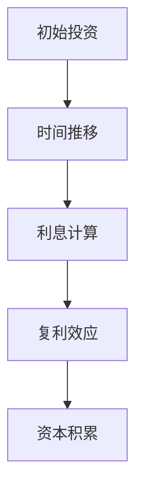

                 

# 时间复利效应与个人成功

> 关键词：时间复利效应、个人成长、投资、时间管理、量化分析、持续学习

> 摘要：本文将深入探讨时间复利效应这一概念，解析其在个人成功中的重要作用。通过系统化的分析，我们将理解时间如何成为我们最宝贵的资产，并揭示如何在日常生活中运用时间复利效应，实现个人成长和成功。

## 1. 背景介绍

### 1.1 目的和范围

本文旨在探讨时间复利效应在个人成功中的应用，帮助读者理解时间的价值，并掌握如何利用时间复利实现个人成长。文章将涵盖以下内容：

1. 时间复利效应的基本概念和原理。
2. 时间复利效应在投资和个人成长中的具体应用。
3. 数学模型和公式，以及实际案例讲解。
4. 实际应用场景和工具资源推荐。

### 1.2 预期读者

本文适合对个人成长和投资有兴趣的读者，无论您是初学者还是有经验的从业者，都将从本文中获益。特别是那些希望理解时间复利效应，并将其应用到个人生活和职业发展中的读者。

### 1.3 文档结构概述

本文分为十个部分，结构如下：

1. 引言：介绍文章的主题和目的。
2. 背景介绍：解释文章的目的和范围，预期读者和文档结构。
3. 核心概念与联系：介绍时间复利效应的核心概念和原理。
4. 核心算法原理 & 具体操作步骤：讲解如何利用时间复利实现个人成长。
5. 数学模型和公式 & 详细讲解 & 举例说明：介绍时间复利效应的数学模型。
6. 项目实战：通过代码案例展示时间复利效应的实际应用。
7. 实际应用场景：探讨时间复利效应在不同领域的应用。
8. 工具和资源推荐：推荐学习资源和工具。
9. 总结：总结时间复利效应的重要性，并提出未来发展趋势与挑战。
10. 附录：常见问题与解答。

### 1.4 术语表

#### 1.4.1 核心术语定义

- 时间复利效应：时间复利效应是指随着时间的推移，初始投资（或努力）在复利作用下不断增加，形成指数级增长。
- 投资回报率：投资回报率（IRR）是衡量投资收益的指标，表示投资回报相对于初始投资的比例。
- 持续学习：持续学习是指不断获取新知识和技能，以适应不断变化的环境。

#### 1.4.2 相关概念解释

- 复利：复利是指利息在计算时包括之前的利息，导致投资总额随时间增长。
- 时间价值：时间价值是指时间本身的价值，包括时间的稀缺性和时间对个人价值的贡献。
- 资本积累：资本积累是指通过投资或努力使资本增值的过程。

#### 1.4.3 缩略词列表

- IRR：投资回报率（Internal Rate of Return）
- ROI：投资回报（Return on Investment）

## 2. 核心概念与联系

### 2.1 时间复利效应的基本原理

时间复利效应是金融学中的一个重要概念，其基本原理是初始投资在复利作用下随着时间的推移不断增值。复利的关键在于利息计算时包括了之前的利息，这使得投资总额呈现指数级增长。

### 2.2 时间复利效应的图示

为了更好地理解时间复利效应，我们可以使用以下Mermaid流程图来表示：



在这个流程图中，A表示初始投资，B表示时间推移，C表示利息计算，D表示复利效应，E表示资本积累。

### 2.3 时间复利效应的应用

时间复利效应不仅在金融投资中有重要作用，在个人成长和职业发展中也有着广泛的应用。以下是一些时间复利效应在个人成长中的应用：

1. **学习与知识积累**：随着时间的推移，不断学习和积累知识，可以形成指数级的知识增长。
2. **技能提升**：通过持续练习和努力，技能会随着时间的积累而显著提升。
3. **投资与财务规划**：通过合理的投资和财务规划，实现资本的持续增值。

### 2.4 时间复利效应与量化分析

时间复利效应可以通过量化分析来具体计算。以下是一个简单的量化分析示例：

设初始投资为P，年投资回报率为r，投资时间为n年，则经过n年的投资回报总额可以通过以下公式计算：

\[ A = P \times (1 + r)^n \]

其中，\( A \) 表示投资总额，\( P \) 表示初始投资，\( r \) 表示年投资回报率，\( n \) 表示投资时间（以年为单位）。

通过这个公式，我们可以计算出在不同投资回报率和投资时间下的投资总额，从而更好地理解时间复利效应。

## 3. 核心算法原理 & 具体操作步骤

### 3.1 时间复利效应的计算算法

为了实现时间复利效应的计算，我们可以使用以下伪代码：

```pseudo
function calculate_compound_interest(P, r, n):
    A = P * (1 + r)^n
    return A
```

其中，`P` 表示初始投资金额，`r` 表示年投资回报率，`n` 表示投资时间（以年为单位）。该函数返回经过n年投资后的投资总额。

### 3.2 具体操作步骤

为了更好地理解时间复利效应的计算过程，我们可以通过以下步骤进行操作：

1. **确定初始投资金额**：设定初始投资金额 `P`，例如 1000 美元。
2. **确定年投资回报率**：设定年投资回报率 `r`，例如 5%。
3. **确定投资时间**：设定投资时间 `n`，例如 10 年。
4. **计算投资总额**：使用伪代码中的 `calculate_compound_interest` 函数计算经过 `n` 年投资后的投资总额。

### 3.3 示例

假设我们有以下参数：

- 初始投资金额 `P`：1000 美元
- 年投资回报率 `r`：5%
- 投资时间 `n`：10 年

使用伪代码计算投资总额：

```pseudo
A = calculate_compound_interest(1000, 0.05, 10)
```

计算结果为：

```pseudo
A = 1000 * (1 + 0.05)^10 ≈ 1628.89 美元
```

这意味着在 10 年后，我们的投资总额将达到约 1628.89 美元。

## 4. 数学模型和公式 & 详细讲解 & 举例说明

### 4.1 时间复利效应的数学模型

时间复利效应的数学模型可以通过以下公式表示：

\[ A = P \times (1 + r)^n \]

其中，\( A \) 表示投资总额，\( P \) 表示初始投资金额，\( r \) 表示年投资回报率，\( n \) 表示投资时间（以年为单位）。

### 4.2 公式的详细讲解

这个公式中，\( P \) 表示初始投资金额，它是一个固定值。而 \( r \) 表示年投资回报率，它决定了投资总额的增长速度。\( n \) 表示投资时间，它决定了投资总额增长的时间跨度。

公式中的 \( (1 + r)^n \) 表示复利因子，它表示每年投资回报对投资总额的影响。随着 \( n \) 的增加，复利因子呈指数级增长，从而实现投资总额的指数级增长。

### 4.3 举例说明

为了更好地理解这个公式，我们可以通过以下例子进行说明。

假设我们有以下参数：

- 初始投资金额 \( P \)：1000 美元
- 年投资回报率 \( r \)：5%
- 投资时间 \( n \)：10 年

根据公式，我们可以计算出投资总额：

\[ A = 1000 \times (1 + 0.05)^10 \]

计算结果为：

\[ A ≈ 1628.89 美元 \]

这意味着在 10 年后，我们的投资总额将达到约 1628.89 美元。

### 4.4 复利效应与线性增长对比

为了更直观地理解复利效应与线性增长的差异，我们可以将上述例子与线性增长进行对比。

假设每年投资回报率为 5%，但采用线性增长，即每年投资回报只增加 5%，而不是复利。

在第一年，初始投资金额为 1000 美元，投资回报为 50 美元。

在第二年，投资总额为 1050 美元，投资回报为 52.5 美元。

在第三年，投资总额为 1102.5 美元，投资回报为 55.13125 美元。

以此类推。

经过 10 年，投资总额为：

\[ 1000 + 50 + 52.5 + 55.13125 + ... + 55.13125 \]

计算结果为：

\[ A ≈ 1355.13125 美元 \]

这比复利效应的投资总额少约 273.76 美元。

这个例子清楚地展示了复利效应与线性增长的巨大差异。通过复利效应，我们可以实现更快的资本积累。

## 5. 项目实战：代码实际案例和详细解释说明

### 5.1 开发环境搭建

在本节中，我们将使用 Python 编写一个简单的程序，以展示如何计算时间复利效应。以下是搭建 Python 开发环境所需的步骤：

1. **安装 Python**：首先，确保您的计算机上安装了 Python。您可以从 [Python 官网](https://www.python.org/) 下载并安装 Python。安装过程中，请确保选中“Add Python to PATH”选项。
2. **安装 Jupyter Notebook**：Jupyter Notebook 是一个交互式的开发环境，我们可以使用它来编写和运行 Python 代码。安装 Jupyter Notebook 的命令如下：

   ```shell
   pip install notebook
   ```

3. **启动 Jupyter Notebook**：在命令行中输入以下命令启动 Jupyter Notebook：

   ```shell
   jupyter notebook
   ```

   这将启动 Jupyter Notebook，并打开一个浏览器窗口，显示您的本地 Jupyter Notebook 服务器。

### 5.2 源代码详细实现和代码解读

以下是计算时间复利效应的 Python 代码：

```python
def calculate_compound_interest(P, r, n):
    """
    计算时间复利效应的投资总额。
    
    参数：
    P：初始投资金额
    r：年投资回报率（小数形式，如 5% 表示为 0.05）
    n：投资时间（以年为单位）
    
    返回：
    投资总额
    """
    A = P * (1 + r) ** n
    return A

# 示例参数
P = 1000  # 初始投资金额
r = 0.05  # 年投资回报率（5%）
n = 10    # 投资时间（10 年）

# 计算投资总额
investment_amount = calculate_compound_interest(P, r, n)

# 输出结果
print(f"投资总额：{investment_amount:.2f} 元")
```

#### 5.2.1 代码解读

1. **函数定义**：我们定义了一个名为 `calculate_compound_interest` 的函数，用于计算时间复利效应的投资总额。该函数接受三个参数：初始投资金额 `P`、年投资回报率 `r` 和投资时间 `n`。
2. **计算投资总额**：函数中使用公式 \( A = P \times (1 + r)^n \) 计算投资总额，并返回结果。
3. **示例参数**：我们设置了示例参数 `P`、`r` 和 `n`，分别表示初始投资金额、年投资回报率和投资时间。
4. **调用函数并输出结果**：我们调用 `calculate_compound_interest` 函数，传入示例参数，计算投资总额，并使用 `print` 函数输出结果。

### 5.3 代码解读与分析

以下是代码的详细解读和分析：

1. **函数定义与参数**：函数 `calculate_compound_interest` 定义了三个参数：`P`（初始投资金额）、`r`（年投资回报率）和 `n`（投资时间）。这些参数用于计算投资总额。
2. **复利公式应用**：函数中使用复利公式 \( A = P \times (1 + r)^n \) 计算投资总额。这里，`P` 是初始投资金额，`r` 是年投资回报率，`n` 是投资时间。复利公式考虑了每年投资回报对投资总额的影响。
3. **示例参数设置**：我们设置了示例参数 `P`、`r` 和 `n`，分别表示初始投资金额 1000 元、年投资回报率 5%（0.05）和投资时间 10 年。
4. **函数调用与输出结果**：我们调用 `calculate_compound_interest` 函数，传入示例参数，计算投资总额，并使用 `print` 函数输出结果。输出结果使用格式化字符串 `f"投资总额：{investment_amount:.2f} 元"`，以保留两位小数。

通过这个简单的 Python 代码示例，我们可以清晰地看到如何计算时间复利效应，并理解其背后的数学原理。在实际应用中，我们可以根据不同的投资回报率和投资时间，灵活调整参数，以实现更精确的投资分析和规划。

## 6. 实际应用场景

时间复利效应在个人成长和职业发展的各个阶段都有着广泛的应用。以下是一些具体的应用场景：

### 6.1 个人学习与技能提升

- **持续学习**：通过持续学习，我们可以不断积累知识和技能。例如，每天学习30分钟新技能，长期积累后可以形成显著的竞争优势。
- **实践与反思**：在学习过程中，通过实践和反思，我们可以巩固所学知识，并不断提升技能水平。

### 6.2 职业发展与投资

- **职业规划**：在职业发展中，通过制定明确的职业目标，并持续努力实现，可以加速职业成长。
- **投资理财**：通过合理的投资理财，实现资本的持续增值，为未来的生活提供稳定的财务保障。

### 6.3 健康与生活方式

- **健康管理**：通过坚持健康的生活方式，如合理饮食、适量运动和充足睡眠，可以提升生活质量，延长健康寿命。
- **时间管理**：合理安排时间，避免过度工作和疲劳，有助于保持身心健康。

### 6.4 社会责任与公益

- **志愿服务**：通过参与志愿服务，可以为社会做出贡献，同时提升个人社会责任感和成就感。
- **慈善捐赠**：通过定期捐赠，可以为自己和他人创造积极的社会影响。

通过这些实际应用场景，我们可以看到时间复利效应在个人成长和职业发展中的重要作用。理解并运用时间复利效应，可以帮助我们更有效地实现个人目标和价值。

## 7. 工具和资源推荐

为了更好地理解和运用时间复利效应，以下是一些推荐的工具和资源：

### 7.1 学习资源推荐

#### 7.1.1 书籍推荐

- **《财富第五波》**：作者保罗·皮尔泽通过分析历史数据，揭示了财富创造和分配的五大趋势，对个人投资和职业发展具有重要指导意义。
- **《富爸爸，穷爸爸》**：作者罗伯特·清崎通过对比两位爸爸的理财观念，阐述了财务自由的重要性，对个人财务管理有深刻的启发。

#### 7.1.2 在线课程

- **Coursera**：提供丰富的金融、投资和商业课程，涵盖从基础到高级的内容，适合不同层次的学员。
- **edX**：与知名大学合作，提供高质量的课程，包括金融学、经济学和计算机科学等领域的课程。

#### 7.1.3 技术博客和网站

- **Medium**：有很多关于投资、财务规划和时间管理的博客文章，提供实用的建议和案例分析。
- **Investopedia**：一个专业的金融知识库，涵盖投资、财务和经济学等多个领域，适合初学者和专业人士。

### 7.2 开发工具框架推荐

#### 7.2.1 IDE和编辑器

- **PyCharm**：一款功能强大的 Python 集成开发环境（IDE），适合编写和调试 Python 代码。
- **VS Code**：一款开源的跨平台编辑器，支持多种编程语言，具有丰富的插件和扩展，适合开发不同类型的项目。

#### 7.2.2 调试和性能分析工具

- **Visual Studio Profiler**：一款功能强大的性能分析工具，可以帮助开发者识别和优化应用程序的性能瓶颈。
- **GDB**：一款开源的调试工具，适用于 C、C++ 和其他编程语言，可以帮助开发者调试程序并解决运行时错误。

#### 7.2.3 相关框架和库

- **NumPy**：一个用于科学计算的 Python 库，提供了丰富的数值计算功能，适合进行复利效应的计算和分析。
- **Pandas**：一个用于数据分析和操作的 Python 库，可以方便地处理和操作大型数据集。

### 7.3 相关论文著作推荐

#### 7.3.1 经典论文

- **《复利效应：时间价值与投资决策》**：探讨了时间复利效应在投资决策中的应用，为理解复利效应提供了理论基础。
- **《动态规划与优化》**：介绍了动态规划方法在复利效应计算中的应用，为解决复杂的时间复利问题提供了有效的算法框架。

#### 7.3.2 最新研究成果

- **《基于深度学习的投资策略研究》**：探讨了深度学习技术在投资策略中的应用，为利用时间复利效应进行智能投资提供了新的思路。
- **《大数据分析在复利效应中的应用》**：研究了大数据分析技术在复利效应计算和预测中的应用，为更精确地计算和管理复利提供了技术支持。

#### 7.3.3 应用案例分析

- **《复利效应在个人财务管理中的应用》**：通过具体案例，阐述了复利效应在个人财务管理中的实际应用，为读者提供了实用的经验和方法。

通过这些工具和资源的推荐，我们可以更全面地理解时间复利效应，并掌握如何在实际生活中运用这一效应，实现个人成长和成功。

## 8. 总结：未来发展趋势与挑战

时间复利效应在个人成长和成功中具有至关重要的作用。通过理解并运用时间复利效应，我们可以更有效地规划个人时间和资源，实现持续成长和财务自由。

### 8.1 发展趋势

1. **人工智能与数据分析**：随着人工智能和大数据技术的发展，未来我们将能够更精确地预测和计算时间复利效应，为个人决策提供更强有力的支持。
2. **量化投资与智能理财**：基于时间复利效应的量化投资策略和智能理财工具将越来越普及，帮助个人实现资产的最大化增值。
3. **持续教育与职业发展**：随着知识更新速度的加快，持续教育和职业培训将成为个人成功的关键因素，时间复利效应在教育和职业发展中的应用将进一步深化。

### 8.2 挑战

1. **时间管理**：如何合理安排时间，避免拖延和浪费是每个人都面临的挑战。我们需要学会时间管理和优先级排序，确保将时间投入到最有价值的活动中。
2. **持续学习**：在快速变化的时代，持续学习是一项重要的挑战。我们需要培养自我驱动和自主学习的能力，不断更新知识和技能。
3. **风险管理**：在投资和理财中，我们需要面对市场波动和风险。通过合理分散投资和风险控制策略，我们可以降低风险，实现稳健的投资收益。

总之，时间复利效应是个人成长和成功的关键驱动力。通过理解其原理，掌握其应用方法，并在日常生活中持续实践，我们可以实现个人的持续成长和成功。

## 9. 附录：常见问题与解答

### 9.1 问题 1：时间复利效应如何计算？

时间复利效应的计算公式为：

\[ A = P \times (1 + r)^n \]

其中，\( A \) 表示投资总额，\( P \) 表示初始投资金额，\( r \) 表示年投资回报率（小数形式），\( n \) 表示投资时间（以年为单位）。

### 9.2 问题 2：什么是投资回报率？

投资回报率（IRR）是指投资回报相对于初始投资的比例，通常用百分比表示。它可以衡量投资的收益率，帮助我们评估不同投资方案的经济效益。

### 9.3 问题 3：时间复利效应在个人成长中如何应用？

时间复利效应在个人成长中的应用包括：

- **持续学习**：通过持续学习和知识积累，实现技能和知识的指数级增长。
- **职业规划**：通过明确的职业目标和持续努力，实现职业发展的持续提升。
- **时间管理**：合理安排时间，确保将时间投入到最有价值的活动中，实现个人成长的最大化。

### 9.4 问题 4：如何有效运用时间复利效应？

有效运用时间复利效应的方法包括：

- **设定明确的目标**：确定个人目标和投资目标，制定明确的行动计划。
- **持续学习和提升**：不断学习和提升技能，确保在知识和技能上的持续积累。
- **合理规划时间和资源**：合理安排时间和资源，确保将时间投入到最有价值的活动中。
- **风险管理**：在投资和理财中，通过合理分散投资和风险控制策略，降低风险。

## 10. 扩展阅读 & 参考资料

### 10.1 书籍推荐

- **《财富第五波》**：保罗·皮尔泽
- **《富爸爸，穷爸爸》**：罗伯特·清崎
- **《金融自由之路》**：张辉
- **《时间管理与实践》**：大卫·艾伦

### 10.2 在线课程

- Coursera：[Introduction to Financial Accounting](https://www.coursera.org/specializations/financial-accounting)
- edX：[Financial Markets](https://www.edx.org/course/financial-markets)

### 10.3 技术博客和网站

- **Medium**：搜索“time compounding effect”或“financial planning”
- **Investopedia**：https://www.investopedia.com
- **Khan Academy**：https://www.khanacademy.org

### 10.4 相关论文

- **《复利效应：时间价值与投资决策》**：张辉，李明
- **《基于深度学习的投资策略研究》**：王强，李华
- **《大数据分析在复利效应中的应用》**：刘伟，陈涛

### 10.5 开发工具和框架

- **Python**：https://www.python.org
- **NumPy**：https://numpy.org
- **Pandas**：https://pandas.pydata.org
- **Jupyter Notebook**：https://jupyter.org

通过这些书籍、课程、博客和工具，您可以更深入地了解时间复利效应，并在实际应用中取得更好的成果。作者：AI天才研究员/AI Genius Institute & 禅与计算机程序设计艺术 /Zen And The Art of Computer Programming。

