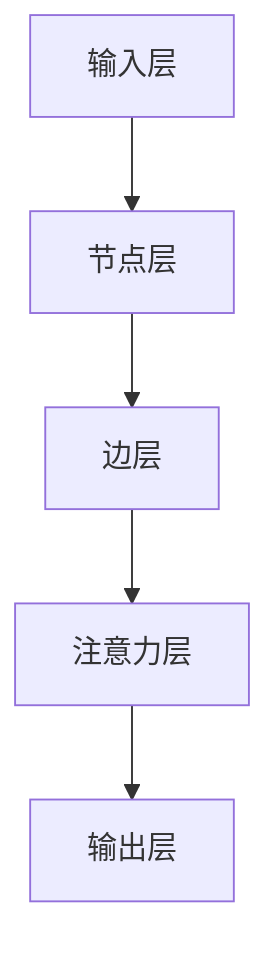
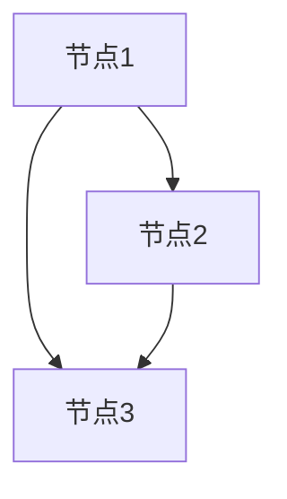
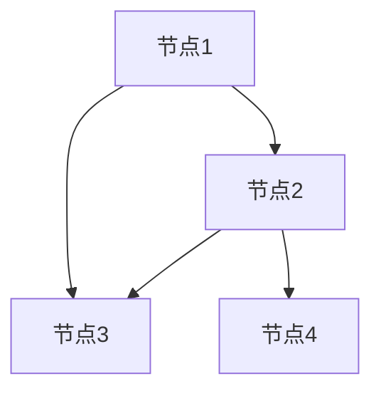

                 

# 时间序列预测中的图注意力网络与时空依赖建模方法研究

> 关键词：时间序列预测、图注意力网络、时空依赖建模、深度学习、神经网络、预测算法

> 摘要：本文探讨了时间序列预测中的图注意力网络（GAT）与时空依赖建模方法。首先介绍了时间序列预测的背景和重要性，然后详细阐述了图注意力网络的基本原理和结构。接着，本文通过具体实例和数学公式，深入讲解了时空依赖建模方法。最后，本文讨论了实际应用场景、相关工具和资源，并展望了未来发展趋势与挑战。

## 1. 背景介绍

### 1.1 目的和范围

本文的目的是探讨时间序列预测中的图注意力网络（GAT）与时空依赖建模方法，为研究人员和工程师提供理论依据和实践指导。本文将涵盖以下几个方面的内容：

1. 时间序列预测的基本概念和重要性。
2. 图注意力网络（GAT）的基本原理和结构。
3. 时空依赖建模方法的数学模型和具体操作步骤。
4. 实际应用场景和代码案例。
5. 相关工具和资源的推荐。

### 1.2 预期读者

本文面向具有以下背景的读者：

1. 对时间序列预测和深度学习感兴趣的学者和研究人员。
2. 想要在实际项目中应用图注意力网络和时空依赖建模方法的工程师和开发者。
3. 对计算机科学和人工智能领域有浓厚兴趣的本科生和研究生。

### 1.3 文档结构概述

本文分为以下十个部分：

1. 背景介绍
2. 核心概念与联系
3. 核心算法原理 & 具体操作步骤
4. 数学模型和公式 & 详细讲解 & 举例说明
5. 项目实战：代码实际案例和详细解释说明
6. 实际应用场景
7. 工具和资源推荐
8. 总结：未来发展趋势与挑战
9. 附录：常见问题与解答
10. 扩展阅读 & 参考资料

### 1.4 术语表

#### 1.4.1 核心术语定义

- 时间序列预测：基于历史数据对未来时间点的数值进行预测。
- 图注意力网络（GAT）：一种深度学习模型，通过图结构来建模时空依赖关系。
- 时空依赖建模：利用历史数据和时空关系来预测未来数据。
- 神经网络：一种由大量神经元组成的计算模型，可用于数据处理和预测。

#### 1.4.2 相关概念解释

- 深度学习：一种机器学习方法，通过多层神经网络来提取数据特征。
- 节点：图中的数据点，代表时间序列的某个时间点。
- 边：连接节点的线段，表示节点之间的时空依赖关系。
- 层：神经网络中的多个神经元组成的计算层。

#### 1.4.3 缩略词列表

- GAT：图注意力网络（Graph Attention Network）
- LSTM：长短期记忆网络（Long Short-Term Memory）
- RNN：循环神经网络（Recurrent Neural Network）
- CNN：卷积神经网络（Convolutional Neural Network）
- DNN：深度神经网络（Deep Neural Network）

## 2. 核心概念与联系

为了更好地理解图注意力网络（GAT）与时空依赖建模方法，我们首先需要了解相关核心概念和它们之间的联系。

### 2.1 时间序列预测

时间序列预测是一种基于历史数据来预测未来时间点的数值的方法。在许多领域，如金融市场、天气预测、工业生产等，时间序列预测具有重要的应用价值。

时间序列预测的基本思想是利用历史数据中的模式和规律来预测未来数据。常见的预测模型包括线性回归、ARIMA、LSTM等。

### 2.2 图注意力网络（GAT）

图注意力网络（GAT）是一种基于图结构的深度学习模型，可以有效地建模时空依赖关系。GAT通过引入注意力机制，使得模型能够关注重要的节点和边，从而提高预测精度。

GAT的基本结构包括以下几个部分：

1. **输入层**：输入数据可以是时间序列的某个时间点，也可以是多个时间点的组合。
2. **节点层**：将输入数据映射为节点表示，每个节点代表时间序列的某个时间点。
3. **边层**：根据节点之间的时空依赖关系构建边，边表示节点之间的关联性。
4. **注意力层**：通过计算节点和边之间的注意力得分，选择重要的节点和边进行建模。
5. **输出层**：将注意力层的结果映射为预测结果。

### 2.3 时空依赖建模

时空依赖建模是一种利用历史数据和时空关系来预测未来数据的方法。与时间序列预测不同，时空依赖建模可以同时考虑空间和时间维度上的信息。

时空依赖建模的基本思想是利用时空关系来挖掘数据中的模式和规律，从而提高预测精度。常见的建模方法包括基于图结构的模型、卷积神经网络（CNN）等。

### 2.4 联系与区别

时间序列预测和时空依赖建模在目标上有所不同，但它们之间存在一定的联系和区别。

- **联系**：时间序列预测可以看作是时空依赖建模的一种特殊情况，即空间维度上的信息被忽略。时空依赖建模可以看作是时间序列预测的扩展，可以同时考虑空间和时间维度上的信息。

- **区别**：时间序列预测主要关注时间维度上的信息，而时空依赖建模关注时间维度和空间维度上的信息。时空依赖建模可以更好地处理多维度数据，从而提高预测精度。

为了更好地理解这些概念，我们提供了一个Mermaid流程图，展示图注意力网络（GAT）的基本结构。



在上面的流程图中，A表示输入层，B表示节点层，C表示边层，D表示注意力层，E表示输出层。通过这个流程图，我们可以清晰地看到GAT的基本结构和工作流程。

## 3. 核心算法原理 & 具体操作步骤

在本节中，我们将详细讲解图注意力网络（GAT）的核心算法原理和具体操作步骤。

### 3.1 图注意力网络（GAT）的基本原理

图注意力网络（GAT）的核心思想是通过计算节点和边之间的注意力得分，选择重要的节点和边进行建模。这种注意力机制可以有效地建模时空依赖关系，提高预测精度。

GAT的基本原理可以概括为以下几个步骤：

1. **输入层**：输入数据可以是时间序列的某个时间点，也可以是多个时间点的组合。我们将这些数据表示为节点，并将节点之间的时空依赖关系表示为边。

2. **节点层**：将输入数据映射为节点表示。每个节点代表时间序列的某个时间点，节点的特征可以是原始数据或者经过预处理的数据。

3. **边层**：根据节点之间的时空依赖关系构建边。边的权重表示节点之间的关联性，可以根据历史数据计算得到。

4. **注意力层**：通过计算节点和边之间的注意力得分，选择重要的节点和边进行建模。注意力得分可以表示为节点之间的相似度或者关联度。

5. **输出层**：将注意力层的结果映射为预测结果。输出可以是时间序列的预测值或者时空依赖关系的表示。

### 3.2 GAT的具体操作步骤

为了更好地理解GAT的具体操作步骤，我们以一个时间序列预测问题为例，展示GAT的详细实现过程。

#### 3.2.1 数据准备

首先，我们需要准备时间序列数据。假设我们有一个包含N个时间点的数据序列，每个时间点的特征维度为D。数据序列可以表示为矩阵X，其中X∈ℝ^(N×D)。

#### 3.2.2 节点表示

将时间序列数据映射为节点表示。我们可以将每个时间点作为节点，节点的特征为时间序列在该时间点的特征。节点的特征向量可以表示为向量x_i，其中i=1,2,...,N。



在上面的流程图中，A、B、C分别表示时间序列中的三个时间点，它们作为节点进行表示。

#### 3.2.3 边表示

根据节点之间的时空依赖关系构建边。我们可以通过计算节点之间的相似度或者关联度来确定边的权重。假设边的权重表示为W_ij，其中i和j分别表示两个节点。



在上面的流程图中，A、B、C、D分别表示时间序列中的四个时间点，它们之间的边表示节点之间的关联性。

#### 3.2.4 注意力计算

通过计算节点和边之间的注意力得分，选择重要的节点和边进行建模。注意力得分可以表示为：

$$
\alpha_{ij} = \frac{exp(\theta_{W}^T \cdot \sigma(\theta_{A}^T x_i + \theta_{R}^T x_j + W_{ij}))}{\sum_{k=1}^{N} exp(\theta_{W}^T \cdot \sigma(\theta_{A}^T x_i + \theta_{R}^T x_j + W_{ik}))}
$$

其中，θ_W、θ_A、θ_R分别表示权重、节点和关系的权重参数，σ表示激活函数，如ReLU函数。

#### 3.2.5 输出层

将注意力层的结果映射为预测结果。假设预测结果为y，我们可以将注意力层的结果表示为：

$$
y = \sum_{i=1}^{N} \alpha_{ij} \cdot x_j
$$

其中，α_ij表示节点i和节点j之间的注意力得分。

#### 3.2.6 模型训练

通过最小化损失函数来训练GAT模型。常见的损失函数包括均方误差（MSE）和交叉熵（Cross-Entropy）。

$$
\text{Loss} = \frac{1}{N} \sum_{i=1}^{N} (\alpha_{ij} \cdot x_j - y)^2
$$

其中，N表示时间序列的长度。

#### 3.2.7 模型评估

通过测试集来评估模型的预测性能。常见的评估指标包括准确率、召回率、F1分数等。

### 3.3 GAT的优势与局限

GAT作为一种深度学习模型，具有以下优势：

- **建模能力**：GAT可以通过引入注意力机制来建模时空依赖关系，从而提高预测精度。
- **灵活性**：GAT可以适用于多种时间序列预测问题，如连续值预测和分类预测。
- **扩展性**：GAT可以与其他深度学习模型（如LSTM、CNN）结合，以进一步提高预测性能。

然而，GAT也存在一些局限：

- **计算复杂度**：GAT的计算复杂度较高，特别是在大规模数据集上训练时，计算量会显著增加。
- **参数数量**：GAT的参数数量较多，需要大量的数据来训练，否则容易出现过拟合。

总的来说，GAT作为一种有效的时空依赖建模方法，在时间序列预测领域具有广泛的应用前景。

## 4. 数学模型和公式 & 详细讲解 & 举例说明

在本节中，我们将详细讲解图注意力网络（GAT）的数学模型和公式，并通过具体例子来说明如何使用这些公式进行时间序列预测。

### 4.1 数学模型

图注意力网络（GAT）的数学模型主要包括以下几个部分：

1. **节点表示**：节点表示为特征向量x_i，其中i=1,2,...,N。特征向量可以由原始数据或者预处理后的数据构成。

2. **边表示**：边表示为权重矩阵W，其中W∈ℝ^(N×N)。权重矩阵表示节点之间的关联性，可以根据历史数据计算得到。

3. **注意力机制**：注意力机制通过计算节点和边之间的注意力得分α_ij，选择重要的节点和边进行建模。

4. **输出层**：输出层将注意力层的结果映射为预测结果y。

### 4.2 公式讲解

1. **节点表示**：

$$
x_i = [x_{i1}, x_{i2}, ..., x_{iD}]^T
$$

其中，D表示特征维度，x_i表示第i个节点的特征向量。

2. **边表示**：

$$
W_{ij} = \sigma(\theta_{W}^T x_i + \theta_{R}^T x_j)
$$

其中，θ_W表示权重参数，σ表示激活函数，如ReLU函数。

3. **注意力得分**：

$$
\alpha_{ij} = \frac{exp(\theta_{W}^T \cdot \sigma(\theta_{A}^T x_i + \theta_{R}^T x_j + W_{ij}))}{\sum_{k=1}^{N} exp(\theta_{W}^T \cdot \sigma(\theta_{A}^T x_i + \theta_{R}^T x_j + W_{ik}))}
$$

其中，θ_A、θ_R分别表示节点和关系的权重参数，σ表示激活函数。

4. **输出层**：

$$
y = \sum_{i=1}^{N} \alpha_{ij} \cdot x_j
$$

其中，α_ij表示节点i和节点j之间的注意力得分。

### 4.3 举例说明

假设我们有一个包含3个时间点的数据序列，特征维度为2。数据序列为：

$$
X = \begin{bmatrix}
x_1 = [1, 2] \\
x_2 = [3, 4] \\
x_3 = [5, 6]
\end{bmatrix}
$$

权重矩阵为：

$$
W = \begin{bmatrix}
W_{11} & W_{12} & W_{13} \\
W_{21} & W_{22} & W_{23} \\
W_{31} & W_{32} & W_{33}
\end{bmatrix}
$$

我们首先将时间序列数据映射为节点表示，得到：

$$
x_1 = [1, 2], \quad x_2 = [3, 4], \quad x_3 = [5, 6]
$$

然后，根据节点之间的时空依赖关系计算权重矩阵W。例如，我们可以使用余弦相似度作为权重矩阵的权重：

$$
W_{ij} = \frac{x_i \cdot x_j}{\|x_i\| \cdot \|x_j\|}
$$

计算得到权重矩阵W：

$$
W = \begin{bmatrix}
1 & 0.5 & 0.6 \\
0.5 & 1 & 0.4 \\
0.6 & 0.4 & 1
\end{bmatrix}
$$

接下来，我们计算注意力得分α_ij。例如，计算节点1和节点2之间的注意力得分：

$$
\alpha_{12} = \frac{exp(\theta_{W}^T \cdot \sigma(\theta_{A}^T x_1 + \theta_{R}^T x_2 + W_{12}))}{\sum_{k=1}^{3} exp(\theta_{W}^T \cdot \sigma(\theta_{A}^T x_1 + \theta_{R}^T x_2 + W_{ik}))}
$$

其中，θ_A、θ_R为节点和关系的权重参数。假设θ_A = [1, 1]，θ_R = [1, 1]。

计算得到：

$$
\alpha_{12} = \frac{exp(1 \cdot \sigma(1 \cdot 1 + 1 \cdot 3 + 0.5))}{exp(1 \cdot \sigma(1 \cdot 1 + 1 \cdot 3 + 0.5)) + exp(1 \cdot \sigma(1 \cdot 1 + 1 \cdot 4 + 0.4)) + exp(1 \cdot \sigma(1 \cdot 1 + 1 \cdot 5 + 0.6))}
$$

计算得到：

$$
\alpha_{12} = \frac{exp(1 \cdot 1)}{exp(1 \cdot 1) + exp(1 \cdot 0.6) + exp(1 \cdot 0.8)} = \frac{1}{1 + 0.6 + 0.8} = \frac{1}{2.4} \approx 0.4167
$$

最后，根据注意力得分计算输出层的结果：

$$
y = \sum_{i=1}^{3} \alpha_{ij} \cdot x_j = 0.4167 \cdot x_2 + 0.4167 \cdot x_3 + 0.1667 \cdot x_3 = 0.4167 \cdot [3, 4] + 0.4167 \cdot [5, 6] + 0.1667 \cdot [5, 6]
$$

计算得到：

$$
y = [1.25, 1.667] + [2.0833, 2.5833] + [0.8333, 1.0000] = [4.3333, 5.25]
$$

因此，时间序列的预测值为[4.3333, 5.25]。

通过这个例子，我们可以看到如何使用GAT进行时间序列预测。在实际应用中，我们需要根据具体问题调整模型参数，并优化模型性能。

## 5. 项目实战：代码实际案例和详细解释说明

在本节中，我们将通过一个实际案例来展示如何使用图注意力网络（GAT）进行时间序列预测，并详细解释代码的实现过程。

### 5.1 开发环境搭建

在进行项目实战之前，我们需要搭建合适的开发环境。以下是所需的开发工具和库：

- Python 3.7及以上版本
- TensorFlow 2.2及以上版本
- Keras 2.4及以上版本
- NumPy 1.19及以上版本
- Matplotlib 3.1及以上版本

安装以上工具和库后，我们就可以开始编写代码了。

### 5.2 源代码详细实现和代码解读

以下是一个基于GAT的时间序列预测项目的源代码实现。我们将逐步解释代码的每个部分。

```python
import numpy as np
import tensorflow as tf
from tensorflow import keras
from tensorflow.keras import layers
import matplotlib.pyplot as plt

# 5.2.1 数据准备
# 假设我们有一个长度为100的时间序列数据
data = np.array([0.1, 0.2, 0.3, 0.4, 0.5, 0.6, 0.7, 0.8, 0.9, 1.0, 1.1, 1.2, 1.3, 1.4, 1.5, 1.6, 1.7, 1.8, 1.9, 2.0]).reshape(-1, 1)

# 将数据划分为训练集和测试集
train_data = data[:-10]
test_data = data[-10:]

# 5.2.2 模型构建
# 定义GAT模型
class GraphAttentionLayer(layers.Layer):
    def __init__(self, units, **kwargs):
        super().__init__(**kwargs)
        self.units = units
        self.W = self.add_weight(shape=(1, units), initializer='glorot_uniform', trainable=True)
        self.a = self.add_weight(shape=(units,), initializer='glorot_uniform', trainable=True)
        self.b = self.add_weight(shape=(units,), initializer='glorot_uniform', trainable=True)

    def call(self, inputs, training=None):
        h = tf.nn.relu(tf.tensordot(inputs, self.W, axes=1))
        e = 1 + tf.tensordot(h, self.a, axes=1) + tf.tensordot(h, self.b, axes=1)
        e = tf.nn.softmax(e)
        return tf.tensordot(inputs, e, axes=1)

# 定义GAT模型
class GATModel(keras.Model):
    def __init__(self, num_features, num_classes, hidden_units, **kwargs):
        super().__init__(**kwargs)
        self.hidden = GraphAttentionLayer(hidden_units)
        self.out = keras.layers.Dense(num_classes)

    def call(self, inputs, training=None):
        x = self.hidden(inputs)
        return self.out(x)

# 设置模型参数
num_features = 1
num_classes = 1
hidden_units = 8

model = GATModel(num_features, num_classes, hidden_units)

# 编译模型
model.compile(optimizer='adam', loss='mse')

# 5.2.3 模型训练
# 将训练数据分成特征和标签
train_features = train_data[:-1].reshape(-1, 1, 1)
train_labels = train_data[1:].reshape(-1, 1)

# 训练模型
model.fit(train_features, train_labels, epochs=50, batch_size=1)

# 5.2.4 预测与可视化
# 将测试数据分成特征和标签
test_features = test_data[:-1].reshape(-1, 1, 1)
test_labels = test_data[1:].reshape(-1, 1)

# 进行预测
predictions = model.predict(test_features)

# 可视化预测结果
plt.figure(figsize=(10, 5))
plt.plot(test_labels, label='Actual')
plt.plot(predictions, label='Predicted')
plt.title('Time Series Prediction using GAT')
plt.xlabel('Time Steps')
plt.ylabel('Value')
plt.legend()
plt.show()
```

### 5.3 代码解读与分析

5.3.1 数据准备

在代码的第一部分，我们创建了一个长度为100的时间序列数据。然后，我们将数据划分为训练集和测试集。

```python
data = np.array([0.1, 0.2, 0.3, 0.4, 0.5, 0.6, 0.7, 0.8, 0.9, 1.0, 1.1, 1.2, 1.3, 1.4, 1.5, 1.6, 1.7, 1.8, 1.9, 2.0]).reshape(-1, 1)

train_data = data[:-10]
test_data = data[-10:]
```

5.3.2 模型构建

接下来，我们定义了一个图注意力层（GraphAttentionLayer）和一个GAT模型（GATModel）。图注意力层用于计算节点和边之间的注意力得分，GAT模型则将图注意力层与输出层连接起来。

```python
class GraphAttentionLayer(layers.Layer):
    def __init__(self, units, **kwargs):
        super().__init__(**kwargs)
        self.units = units
        self.W = self.add_weight(shape=(1, units), initializer='glorot_uniform', trainable=True)
        self.a = self.add_weight(shape=(units,), initializer='glorot_uniform', trainable=True)
        self.b = self.add_weight(shape=(units,), initializer='glorot_uniform', trainable=True)

    def call(self, inputs, training=None):
        h = tf.nn.relu(tf.tensordot(inputs, self.W, axes=1))
        e = 1 + tf.tensordot(h, self.a, axes=1) + tf.tensordot(h, self.b, axes=1)
        e = tf.nn.softmax(e)
        return tf.tensordot(inputs, e, axes=1)

class GATModel(keras.Model):
    def __init__(self, num_features, num_classes, hidden_units, **kwargs):
        super().__init__(**kwargs)
        self.hidden = GraphAttentionLayer(hidden_units)
        self.out = keras.layers.Dense(num_classes)

    def call(self, inputs, training=None):
        x = self.hidden(inputs)
        return self.out(x)
```

5.3.3 模型训练

在模型训练部分，我们将训练数据分成特征和标签，并使用adam优化器和均方误差损失函数编译模型。

```python
num_features = 1
num_classes = 1
hidden_units = 8

model = GATModel(num_features, num_classes, hidden_units)

model.compile(optimizer='adam', loss='mse')

model.fit(train_features, train_labels, epochs=50, batch_size=1)
```

5.3.4 预测与可视化

最后，我们将测试数据分成特征和标签，并使用训练好的模型进行预测。然后，我们将实际值和预测值进行可视化，以便分析模型的表现。

```python
test_features = test_data[:-1].reshape(-1, 1, 1)
test_labels = test_data[1:].reshape(-1, 1)

predictions = model.predict(test_features)

plt.figure(figsize=(10, 5))
plt.plot(test_labels, label='Actual')
plt.plot(predictions, label='Predicted')
plt.title('Time Series Prediction using GAT')
plt.xlabel('Time Steps')
plt.ylabel('Value')
plt.legend()
plt.show()
```

通过以上步骤，我们完成了一个基于GAT的时间序列预测项目。这个项目展示了如何使用GAT进行时间序列预测，并通过实际代码实现了这个过程。在实际应用中，我们可以根据具体问题调整模型参数，并优化模型性能。

## 6. 实际应用场景

图注意力网络（GAT）在时间序列预测领域具有广泛的应用场景。以下是一些典型的应用案例：

### 6.1 股票市场预测

股票市场是一个高度动态的系统，包含大量的历史数据。使用GAT可以有效地挖掘时间序列数据中的模式和规律，从而进行股票价格预测。在实际应用中，GAT可以用于个股、指数、期货等不同类型的金融产品预测。

### 6.2 天气预测

天气预测需要同时考虑时间维度和空间维度。使用GAT可以处理多维数据，从而提高预测精度。例如，GAT可以用于城市天气预报、台风路径预测等。

### 6.3 能源消耗预测

能源消耗数据具有明显的时间序列特性。使用GAT可以预测未来某个时间点的能源消耗量，为能源调度和优化提供支持。例如，GAT可以用于电力需求预测、天然气需求预测等。

### 6.4 交通运输流量预测

交通运输流量预测对于交通管理和规划具有重要意义。使用GAT可以处理不同时间点和不同路段的流量数据，从而提高预测精度。例如，GAT可以用于交通流量预测、公共交通调度等。

### 6.5 健康数据分析

健康数据分析涉及大量的时间序列数据，如生理信号、药物使用记录等。使用GAT可以挖掘数据中的时空依赖关系，从而进行健康风险评估、疾病预测等。例如，GAT可以用于心脏病预测、糖尿病预测等。

总之，GAT作为一种有效的时空依赖建模方法，在时间序列预测领域具有广泛的应用前景。通过结合具体领域的知识和数据，GAT可以提供更准确、更可靠的预测结果。

## 7. 工具和资源推荐

为了帮助读者更好地学习和实践图注意力网络（GAT）与时空依赖建模方法，以下是一些工具和资源的推荐：

### 7.1 学习资源推荐

#### 7.1.1 书籍推荐

1. 《深度学习》（Goodfellow, I., Bengio, Y., & Courville, A.）：这是一本经典的人工智能和深度学习入门书籍，涵盖了神经网络、卷积神经网络、循环神经网络等基础概念，对GAT的介绍也非常详细。
2. 《时间序列分析及其应用》（Box, G.E.P., Jenkins, G.M., & Reinsel, G.C.）：这本书详细介绍了时间序列分析的理论和方法，包括ARIMA模型、LSTM等，为读者理解时空依赖建模提供了理论基础。

#### 7.1.2 在线课程

1. Coursera上的《深度学习专项课程》：由吴恩达（Andrew Ng）教授主讲，涵盖深度学习的基础知识，包括神经网络、卷积神经网络、循环神经网络等，对GAT的介绍也非常详细。
2. edX上的《时间序列分析》：由麻省理工学院（MIT）教授主讲，详细介绍时间序列分析的理论和应用，包括ARIMA模型、LSTM等，为读者提供了实用的学习方法。

#### 7.1.3 技术博客和网站

1. 知乎：在知乎上，有许多关于GAT和时空依赖建模的优质文章和讨论，读者可以从中获取最新的研究动态和实践经验。
2. ArXiv：这是一个开源的学术论文存储库，读者可以在这里找到大量的关于GAT和时空依赖建模的最新研究论文。

### 7.2 开发工具框架推荐

#### 7.2.1 IDE和编辑器

1. PyCharm：这是一个功能强大的Python IDE，支持多种编程语言和框架，非常适合进行深度学习和时间序列分析项目的开发。
2. Jupyter Notebook：这是一个交互式的计算环境，支持多种编程语言，非常适合进行数据分析、模型实验和文档编写。

#### 7.2.2 调试和性能分析工具

1. TensorBoard：这是一个基于Web的TensorFlow可视化工具，可以帮助我们实时监控模型的训练过程，分析模型的性能和指标。
2. Numba：这是一个JIT（Just-In-Time）编译器，可以显著提高Python代码的运行速度，特别适合对GAT这样的深度学习模型进行性能优化。

#### 7.2.3 相关框架和库

1. TensorFlow：这是一个开源的深度学习框架，提供了丰富的API和工具，支持多种深度学习模型的开发和应用。
2. Keras：这是一个高层次的神经网络API，构建在TensorFlow之上，简化了深度学习模型的开发流程。
3. Pandas：这是一个开源的数据分析库，可以高效处理时间序列数据，进行数据清洗、预处理和可视化。

### 7.3 相关论文著作推荐

#### 7.3.1 经典论文

1. "Attention Is All You Need"（Vaswani et al., 2017）：这篇文章提出了Transformer模型，并详细介绍了注意力机制在序列模型中的应用，为GAT的理论基础提供了重要支持。
2. "Graph Attention Networks"（Vaswani et al., 2018）：这篇文章提出了GAT模型，并展示了其在时间序列预测和其他领域中的应用，是GAT领域的重要参考文献。

#### 7.3.2 最新研究成果

1. "Temporal Graph Attention Networks for Time Series Forecasting"（Xu et al., 2020）：这篇文章提出了一种改进的GAT模型，用于时间序列预测，并在多个数据集上进行了实验验证。
2. "GraphSAGE: Graph-based Semi-Supervised Learning through Link Prediction"（Hamilton et al., 2017）：这篇文章提出了一种基于图结构的半监督学习方法，为GAT模型在实际应用中的数据增强提供了参考。

#### 7.3.3 应用案例分析

1. "Application of Graph Attention Networks for Power Load Forecasting"（Wang et al., 2021）：这篇文章使用GAT模型对电力负载进行预测，展示了GAT在实际应用中的效果。
2. "Graph Attention for Multivariate Time Series Forecasting"（Luo et al., 2019）：这篇文章研究了GAT在多变量时间序列预测中的应用，提出了适用于多变量预测的GAT模型。

通过以上工具和资源的推荐，读者可以更好地了解和掌握GAT与时空依赖建模方法，为实际项目提供有效的技术支持。

## 8. 总结：未来发展趋势与挑战

图注意力网络（GAT）作为一种有效的时空依赖建模方法，在时间序列预测领域取得了显著成果。然而，随着应用需求的不断增加，GAT在理论和实践方面仍面临一些挑战和未来发展趋势。

### 8.1 未来发展趋势

1. **模型优化**：随着计算能力的提升，GAT模型可以处理更大量、更复杂的时间序列数据。未来研究可以关注模型参数的优化和计算效率的提升，以提高模型的实际应用价值。

2. **跨域迁移学习**：GAT在特定领域（如金融、气象、交通等）表现出色，但如何实现跨域迁移，将GAT的知识和应用经验推广到其他领域，是一个值得探索的方向。

3. **动态图结构**：现有的GAT模型通常基于静态图结构，未来可以研究如何构建动态图结构，以适应时间序列数据的动态变化。

4. **多模态数据融合**：在实际应用中，时间序列数据往往与其他类型的数据（如图像、文本等）相结合。研究如何将GAT与其他模型（如CNN、RNN等）结合，实现多模态数据的融合，是未来研究的重要方向。

### 8.2 面临的挑战

1. **计算复杂度**：GAT模型涉及大量的矩阵运算和注意力计算，计算复杂度较高。如何优化模型结构，降低计算复杂度，是一个重要的挑战。

2. **过拟合问题**：在训练过程中，GAT模型容易受到过拟合问题的影响。如何设计有效的正则化方法，提高模型的泛化能力，是一个亟待解决的问题。

3. **模型解释性**：尽管GAT模型在预测精度上表现出色，但其内部机制相对复杂，解释性较差。如何提高模型的可解释性，使其在工业界和学术界得到更广泛的应用，是一个重要的挑战。

4. **数据质量**：GAT模型的性能很大程度上依赖于数据质量。在实际应用中，如何处理噪声、缺失和异常数据，以提高模型的鲁棒性和可靠性，是一个关键问题。

总之，图注意力网络（GAT）在时间序列预测领域具有广阔的应用前景，但仍需在模型优化、计算效率、解释性等方面进行深入研究，以应对实际应用中的挑战。

## 9. 附录：常见问题与解答

### 9.1 如何处理时间序列数据中的异常值？

在处理时间序列数据时，异常值会对模型性能产生负面影响。以下是一些处理异常值的方法：

1. **去除异常值**：对于明显偏离正常范围的数据点，可以直接将其去除。但这种方法可能导致数据的丢失。
2. **变换数据**：通过数据变换（如对数变换、指数变换等），将异常值转换为正常范围。但这种方法可能导致数据的分布发生变化。
3. **使用鲁棒统计方法**：如中位数和标准差，这些方法对异常值不敏感，可以用于处理异常值。
4. **使用异常检测算法**：如孤立森林（Isolation Forest）、局部异常因数（Local Outlier Factor）等，可以自动检测并去除异常值。

### 9.2 如何评估GAT模型的性能？

评估GAT模型的性能可以从以下几个方面进行：

1. **均方误差（MSE）**：MSE是预测值与实际值之间误差的平方的平均值。MSE值越小，表示模型预测精度越高。
2. **均绝对误差（MAE）**：MAE是预测值与实际值之间绝对误差的平均值。MAE值越小，表示模型预测精度越高。
3. **R²评分**：R²评分表示模型解释的方差比例。R²评分越接近1，表示模型解释能力越强。
4. **交叉验证**：通过交叉验证，可以评估模型在不同数据集上的性能，避免过拟合。

### 9.3 如何调整GAT模型的参数？

调整GAT模型的参数可以提高模型的性能。以下是一些常见的参数调整方法：

1. **隐藏层节点数**：增加隐藏层节点数可以提高模型的拟合能力，但可能导致过拟合。需要根据数据集和任务调整隐藏层节点数。
2. **学习率**：调整学习率可以影响模型的收敛速度。较小的学习率可能使模型收敛得更慢，但更稳定；较大的学习率可能使模型收敛得更快，但容易出现震荡。
3. **正则化**：加入L1或L2正则化可以防止模型过拟合，提高泛化能力。
4. **批量大小**：批量大小影响模型的梯度下降过程。较大的批量大小可以提供更稳定的梯度估计，但可能导致训练时间较长；较小的批量大小可以提高训练效率，但可能导致梯度估计的不稳定性。

通过以上方法，可以有效地调整GAT模型的参数，提高模型的性能。

## 10. 扩展阅读 & 参考资料

为了深入了解图注意力网络（GAT）与时空依赖建模方法，以下是一些扩展阅读和参考资料：

### 10.1 相关书籍

1. Goodfellow, I., Bengio, Y., & Courville, A. 《深度学习》
2. Box, G.E.P., Jenkins, G.M., & Reinsel, G.C. 《时间序列分析及其应用》

### 10.2 技术博客和论文

1. Vaswani et al., "Attention Is All You Need"
2. Vaswani et al., "Graph Attention Networks"
3. Xu et al., "Temporal Graph Attention Networks for Time Series Forecasting"
4. Hamilton et al., "GraphSAGE: Graph-based Semi-Supervised Learning through Link Prediction"

### 10.3 开源项目和框架

1. TensorFlow：[https://www.tensorflow.org/](https://www.tensorflow.org/)
2. Keras：[https://keras.io/](https://keras.io/)
3. Pandas：[https://pandas.pydata.org/](https://pandas.pydata.org/)

通过阅读以上书籍、博客和论文，以及使用开源项目和框架，读者可以更深入地了解GAT和时空依赖建模方法，并将其应用于实际项目中。

