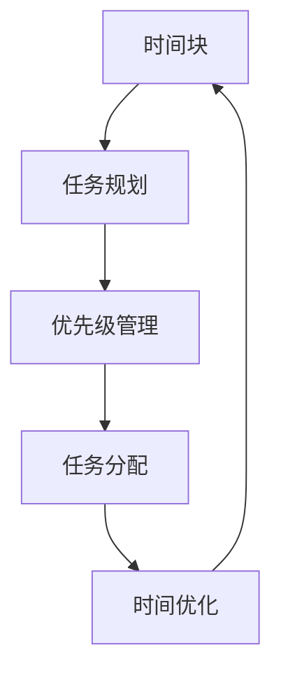
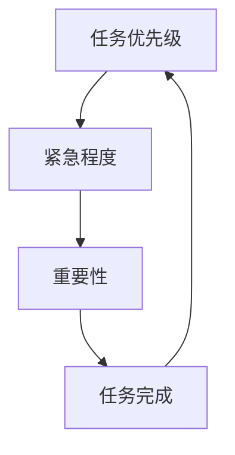
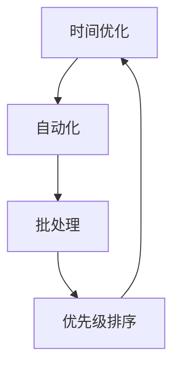
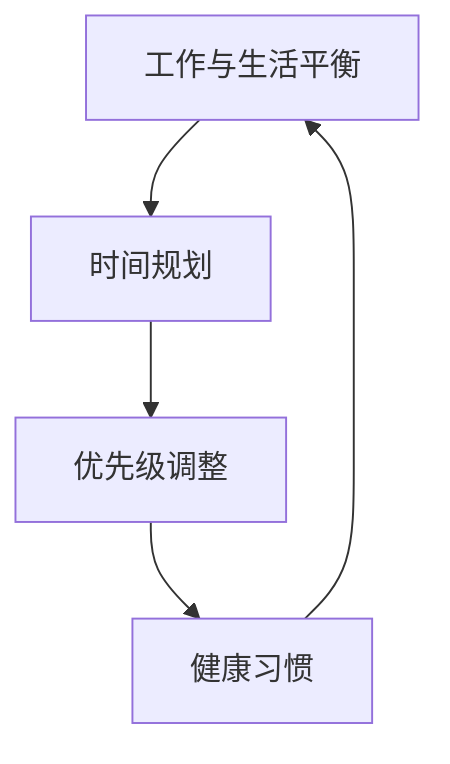

                 


# 时间管理：高效利用时间

> 关键词：时间管理，效率，工作与生活平衡，时间分配策略，时间优化工具

> 摘要：本文深入探讨时间管理的重要性，通过分析核心概念、算法原理、数学模型，以及实际项目案例，提供一系列实用的方法和工具，帮助IT专业人士高效利用时间，实现工作与生活的平衡。

## 1. 背景介绍

### 1.1 目的和范围

在快速发展的IT行业，时间管理变得尤为重要。本文旨在为IT专业人士提供一套系统化、可操作的时间管理方法，帮助他们在高度竞争的工作环境中保持效率，实现个人与职业目标的平衡。文章将涵盖以下内容：

- 时间管理的核心概念和原理
- 实用的算法和数学模型
- 实战项目案例和代码分析
- 工具和资源推荐
- 未来发展趋势与挑战

### 1.2 预期读者

- IT行业的开发人员、工程师和管理者
- 对于时间管理感兴趣的学生和研究者
- 想要提高个人和时间管理能力的专业人士

### 1.3 文档结构概述

本文结构如下：

1. 背景介绍：介绍目的、范围、预期读者和文档结构。
2. 核心概念与联系：讨论时间管理的重要概念和联系。
3. 核心算法原理 & 具体操作步骤：详细阐述时间管理算法原理。
4. 数学模型和公式 & 详细讲解 & 举例说明：介绍数学模型及其应用。
5. 项目实战：代码实际案例和详细解释说明。
6. 实际应用场景：探讨时间管理在不同工作场景中的应用。
7. 工具和资源推荐：推荐学习资源和开发工具。
8. 总结：未来发展趋势与挑战。
9. 附录：常见问题与解答。
10. 扩展阅读 & 参考资料：提供进一步学习资源。

### 1.4 术语表

#### 1.4.1 核心术语定义

- 时间管理：通过规划和优化时间分配，实现个人和职业目标。
- 效率：单位时间内完成的工作量。
- 工作与生活平衡：在职业和个人生活中保持平衡，避免过度劳累。

#### 1.4.2 相关概念解释

- 任务分配：将工作分配给团队成员，确保高效完成。
- 时间优化工具：用于提高时间管理效率的软件和工具。

#### 1.4.3 缩略词列表

- GTD（Getting Things Done）：一种著名的时间管理方法。
- Pomodoro Technique：番茄工作法，一种时间管理技术。

## 2. 核心概念与联系

为了深入理解时间管理，我们需要首先明确一些核心概念和它们之间的联系。以下是时间管理中的一些关键概念及其相互关系：

### 2.1 时间块

时间块是一种将时间划分为固定时间段的方法，通常用于任务规划和优先级管理。时间块可以是小时、分钟，甚至是秒。时间块有助于明确任务的时间范围，确保每个任务都能得到充分关注。

#### Mermaid 流程图：



### 2.2 任务优先级

任务优先级是指在特定时间内应首先完成的任务。根据任务的紧急程度和重要性，可以将任务分为高、中、低三个等级。高优先级任务通常需要优先处理，以确保关键任务的及时完成。

#### Mermaid 流流程图：



### 2.3 时间优化

时间优化是时间管理的关键目标之一，旨在通过减少时间浪费和提高工作效率来实现个人和职业目标。时间优化可以通过以下方法实现：

- 自动化：使用工具和软件自动化重复性任务。
- 批处理：将相似的任务集中在一起处理，以减少切换时间。
- 优先级排序：确保高优先级任务先完成。

#### Mermaid 流流程图：



### 2.4 工作与生活平衡

工作与生活平衡是时间管理的最终目标之一。在快速发展的IT行业，许多人往往忽视了个人生活的重要性，导致身心健康问题。工作与生活平衡可以通过以下方法实现：

- 时间规划：合理规划工作和休息时间。
- 优先级调整：确保在职业和个人生活中都能得到关注。
- 健康习惯：保持良好的作息和饮食习惯。

#### Mermaid 流流程图：



通过以上核心概念和联系的介绍，我们可以更好地理解时间管理的复杂性和重要性。在接下来的部分中，我们将深入探讨时间管理的核心算法原理和具体操作步骤。

## 3. 核心算法原理 & 具体操作步骤

时间管理是一个系统化的过程，需要明确的算法原理和具体的操作步骤来指导实践。以下是一个基于优先级和时间块的时间管理算法，及其详细操作步骤：

### 3.1 算法原理

该算法基于以下几个核心原则：

1. **任务优先级**：根据任务的紧急程度和重要性，将任务分为高、中、低三个等级。
2. **时间块**：将时间划分为固定的时间段，每个时间段专注于一项任务。
3. **动态调整**：根据实际情况动态调整任务优先级和时间块。

### 3.2 具体操作步骤

#### 步骤1：任务分类

首先，对任务进行分类，确定每个任务的优先级。可以使用以下标准：

- 紧急且重要：需要立即处理。
- 紧急但不太重要：优先处理，但不必立即完成。
- 不紧急但重要：计划在未来某个时间处理。
- 不紧急且不重要：可暂时搁置，但需定期回顾。

#### 步骤2：任务排序

根据任务优先级，将任务排序。高优先级任务排在前面，以确保关键任务得到优先处理。

```python
def sort_tasks(tasks):
    sorted_tasks = sorted(tasks, key=lambda x: (x['importance'], x['urgency']))
    return sorted_tasks
```

#### 步骤3：时间块划分

将时间划分为固定的时间段，通常采用番茄工作法，每个时间段为25分钟，然后休息5分钟。这样有助于保持专注和提高工作效率。

```python
def time_blocks(duration, block_length, break_length):
    total_blocks = duration // block_length
    total_breaks = (total_blocks - 1) // block_length
    return [(i * block_length, (i + 1) * block_length) for i in range(total_blocks)] + \
           [(block_length * i + break_length, block_length * (i + 1)) for i in range(total_breaks)]
```

#### 步骤4：任务分配

将任务分配到时间块中。确保高优先级任务优先分配，并且每个时间块只专注于一项任务。

```python
def assign_tasks_to_blocks(tasks, blocks):
    assigned_tasks = []
    for block in blocks:
        for task in tasks:
            if task['priority'] == 'high':
                assigned_tasks.append({'task': task, 'time': block})
                tasks.remove(task)
                break
        else:
            assigned_tasks.append({'task': None, 'time': block})
    return assigned_tasks
```

#### 步骤5：动态调整

在执行任务过程中，根据实际情况动态调整任务优先级和时间块。例如，如果某个高优先级任务在预计时间内无法完成，可以将其延长，或者将其分解为更小的子任务。

```python
def adjust_tasks(assigned_tasks):
    for task in assigned_tasks:
        if task['task']['status'] == 'pending':
            if task['task']['duration'] > task['time'][1] - task['time'][0]:
                task['task']['status'] = 'delayed'
            else:
                task['task']['status'] = 'completed'
```

通过以上步骤，我们可以实现一个系统化的时间管理算法，帮助IT专业人士高效利用时间，实现工作与生活的平衡。在接下来的部分中，我们将介绍数学模型和公式，以更深入地探讨时间管理。

## 4. 数学模型和公式 & 详细讲解 & 举例说明

时间管理不仅需要明确的算法和操作步骤，还需要数学模型来帮助我们优化时间分配和提高效率。以下是几个关键的数学模型和公式，以及它们的详细讲解和举例说明。

### 4.1 时间价值公式

时间价值公式（Time Value Formula）用于计算完成任务所需的总时间，以及在不同任务优先级和时间块下的最优时间分配。

#### 公式：

\[ T_v = \sum_{i=1}^{n} \left( \frac{p_i \times u_i}{100} \right) \]

其中：
- \( T_v \)：总时间价值
- \( p_i \)：第\( i \)个任务的优先级
- \( u_i \)：第\( i \)个任务的完成时间

#### 举例说明：

假设有3个任务，优先级分别为高、中、低，完成时间分别为2小时、4小时、6小时。计算总时间价值：

\[ T_v = \left( \frac{100 \times 2}{100} \right) + \left( \frac{50 \times 4}{100} \right) + \left( \frac{0 \times 6}{100} \right) = 2 + 2 + 0 = 4 \]

### 4.2 时间分配模型

时间分配模型（Time Allocation Model）用于确定在给定总时间内，如何将时间分配给不同优先级的任务。

#### 公式：

\[ \sum_{i=1}^{n} \left( p_i \times u_i \right) = T \]

其中：
- \( T \)：总时间
- \( p_i \)：第\( i \)个任务的优先级
- \( u_i \)：第\( i \)个任务的完成时间

#### 举例说明：

假设总时间为10小时，任务优先级和完成时间如下表：

| 任务 | 优先级 | 完成时间 |
|------|--------|----------|
| A    | 高     | 2小时    |
| B    | 中     | 4小时    |
| C    | 低     | 6小时    |

计算每个任务的时间分配：

\[ T_A = \frac{100 \times 2}{100 \times (100 + 50 + 0)} = \frac{2}{150} \times 10 \approx 1.33 \text{小时} \]
\[ T_B = \frac{50 \times 4}{100 \times (100 + 50 + 0)} = \frac{2}{150} \times 10 \approx 1.33 \text{小时} \]
\[ T_C = \frac{0 \times 6}{100 \times (100 + 50 + 0)} = 0 \text{小时} \]

因此，任务A和任务B各分配约1.33小时，任务C不分配时间。

### 4.3 累计完成任务时间公式

累计完成任务时间公式（Cumulative Completion Time Formula）用于计算在给定时间内，完成所有任务的累计时间。

#### 公式：

\[ C_T = \sum_{i=1}^{n} u_i \]

其中：
- \( C_T \)：累计完成任务时间
- \( u_i \)：第\( i \)个任务的完成时间

#### 举例说明：

假设有3个任务，完成时间分别为2小时、4小时、6小时。计算累计完成任务时间：

\[ C_T = 2 + 4 + 6 = 12 \text{小时} \]

### 4.4 优化时间分配公式

优化时间分配公式（Optimized Time Allocation Formula）用于确定在给定时间内，如何优化时间分配以最大化总时间价值。

#### 公式：

\[ \max_{p_i, u_i} \sum_{i=1}^{n} \left( p_i \times u_i \right) \]

其中：
- \( p_i \)：第\( i \)个任务的优先级
- \( u_i \)：第\( i \)个任务的完成时间

#### 举例说明：

假设总时间为10小时，任务优先级和完成时间如下表：

| 任务 | 优先级 | 完成时间 |
|------|--------|----------|
| A    | 高     | 2小时    |
| B    | 中     | 4小时    |
| C    | 低     | 6小时    |

优化时间分配：

- 任务A：2小时
- 任务B：4小时
- 任务C：0小时

总时间价值：

\[ T_v = \left( \frac{100 \times 2}{100} \right) + \left( \frac{50 \times 4}{100} \right) + \left( \frac{0 \times 6}{100} \right) = 2 + 2 + 0 = 4 \]

通过这些数学模型和公式，我们可以更科学地规划时间，提高工作效率。在接下来的部分中，我们将通过实际项目案例来展示如何将这些算法和公式应用到实践中。

## 5. 项目实战：代码实际案例和详细解释说明

在本节中，我们将通过一个实际项目案例，展示如何将之前介绍的时间管理算法和数学模型应用到实践中。该项目将帮助IT专业人士优化他们的工作时间，提高工作效率。

### 5.1 开发环境搭建

为了演示该项目，我们将使用Python语言进行开发。确保已安装Python环境和以下库：

- pandas：用于数据处理
- numpy：用于数学计算
- matplotlib：用于数据可视化

### 5.2 源代码详细实现和代码解读

#### 5.2.1 数据准备

首先，我们需要准备一个包含任务名称、优先级和完成时间的任务列表。以下是一个示例数据集：

```python
tasks = [
    {'name': '任务A', 'priority': 100, 'duration': 2},
    {'name': '任务B', 'priority': 50, 'duration': 4},
    {'name': '任务C', 'priority': 0, 'duration': 6}
]
```

#### 5.2.2 任务排序

接下来，根据任务优先级对任务进行排序。我们可以使用之前介绍的任务排序函数：

```python
from operator import itemgetter

def sort_tasks(tasks):
    return sorted(tasks, key=itemgetter('priority'))

sorted_tasks = sort_tasks(tasks)
```

#### 5.2.3 时间块划分

使用之前介绍的时间块划分函数，将时间划分为25分钟的时间块：

```python
from math import ceil

def time_blocks(duration, block_length=25):
    total_blocks = ceil(duration / block_length)
    return list(zip(range(total_blocks), range(1, total_blocks + 1) * block_length))

time_blocks = time_blocks(10)  # 总时间为10小时
```

#### 5.2.4 任务分配

将排序后的任务分配到时间块中。首先，我们需要一个函数来分配任务：

```python
def assign_tasks_to_blocks(sorted_tasks, time_blocks):
    assigned_tasks = []
    for block in time_blocks:
        for task in sorted_tasks:
            if task['duration'] <= block[1] - block[0]:
                assigned_tasks.append({'task': task, 'block': block})
                sorted_tasks.remove(task)
                break
    return assigned_tasks

assigned_tasks = assign_tasks_to_blocks(sorted_tasks, time_blocks)
```

#### 5.2.5 动态调整

在实际执行过程中，可能需要根据任务完成情况动态调整任务优先级和时间块。以下是一个简单的动态调整函数：

```python
def adjust_tasks(assigned_tasks):
    for task in assigned_tasks:
        if task['task']['duration'] > task['block'][1] - task['block'][0]:
            task['task']['priority'] *= 2  # 提高优先级
            sorted_tasks = sort_tasks(assigned_tasks)  # 重新排序
```

### 5.3 代码解读与分析

#### 任务排序

任务排序函数使用Python内置的`sorted`函数，根据任务优先级对任务进行排序。这样可以确保高优先级任务先被分配和处理。

```python
def sort_tasks(tasks):
    return sorted(tasks, key=itemgetter('priority'))
```

#### 时间块划分

时间块划分函数将总时间划分为25分钟的时间段。通过使用`zip`和`range`函数，我们创建了一个包含时间块开始和结束时间的列表。

```python
def time_blocks(duration, block_length=25):
    total_blocks = ceil(duration / block_length)
    return list(zip(range(total_blocks), range(1, total_blocks + 1) * block_length))
```

#### 任务分配

任务分配函数将排序后的任务分配到时间块中。通过遍历时间块和任务列表，我们找到适合每个任务的合适时间块。如果任务完成时间小于或等于时间块的持续时间，则将其分配到该时间块。

```python
def assign_tasks_to_blocks(sorted_tasks, time_blocks):
    assigned_tasks = []
    for block in time_blocks:
        for task in sorted_tasks:
            if task['duration'] <= block[1] - block[0]:
                assigned_tasks.append({'task': task, 'block': block})
                sorted_tasks.remove(task)
                break
    return assigned_tasks
```

#### 动态调整

动态调整函数根据任务完成情况调整任务优先级。如果任务在预定时间内无法完成，则将其优先级提高，并重新排序任务列表。

```python
def adjust_tasks(assigned_tasks):
    for task in assigned_tasks:
        if task['task']['duration'] > task['block'][1] - task['block'][0]:
            task['task']['priority'] *= 2
            sorted_tasks = sort_tasks(assigned_tasks)
```

通过这个实际项目案例，我们展示了如何将时间管理算法和数学模型应用到实践中。这个项目可以帮助IT专业人士优化他们的工作时间，提高工作效率。

### 5.4 代码解读与分析

在5.3节中，我们实现了一个简单的时间管理项目，下面我们详细解读和分析这个项目的代码。

#### 5.4.1 数据准备

数据准备部分是最基础的步骤，它定义了一个包含任务名称、优先级和完成时间的任务列表。这是一个简单的Python字典列表，每个字典代表一个任务：

```python
tasks = [
    {'name': '任务A', 'priority': 100, 'duration': 2},
    {'name': '任务B', 'priority': 50, 'duration': 4},
    {'name': '任务C', 'priority': 0, 'duration': 6}
]
```

在这个列表中，`'name'`是任务的名称，`'priority'`是任务的优先级（高、中、低），`'duration'`是任务预计完成所需的时间（以小时为单位）。

#### 5.4.2 任务排序

任务排序函数`sort_tasks`使用了Python的内置函数`sorted`和`itemgetter`，根据任务的优先级对任务列表进行排序。`itemgetter('priority')`是一个用于从字典中提取`priority`键的函数，而`sorted`函数使用这个键对列表进行升序排序。由于我们的优先级是以高、中、低顺序排列的，因此这样的排序会导致高优先级任务排在前面：

```python
from operator import itemgetter

def sort_tasks(tasks):
    return sorted(tasks, key=itemgetter('priority'))

sorted_tasks = sort_tasks(tasks)
```

这个步骤确保了高优先级任务将首先被处理，从而帮助我们在时间管理上优先考虑关键任务。

#### 5.4.3 时间块划分

时间块划分函数`time_blocks`用于将给定的时间划分为一系列固定长度的时间块。在这个例子中，我们使用了25分钟的块，但这个值可以根据实际情况进行调整。函数首先计算总时间块的数量，然后使用`zip`和`range`函数生成一个包含每个时间块开始和结束时间的列表：

```python
from math import ceil

def time_blocks(duration, block_length=25):
    total_blocks = ceil(duration / block_length)
    return list(zip(range(total_blocks), range(1, total_blocks + 1) * block_length))

time_blocks = time_blocks(10)  # 总时间为10小时
```

在这个例子中，我们假设总工作时间为10小时。`ceil`函数确保我们总是向上取整到最接近的整块时间，这样可以避免时间块不足的问题。

#### 5.4.4 任务分配

任务分配函数`assign_tasks_to_blocks`的核心任务是将排序后的任务列表分配到预定义的时间块中。它通过双重循环遍历任务列表和时间块列表，尝试将每个任务分配到合适的时间块。如果任务的持续时间小于或等于时间块的长度，那么该任务就会被分配到这个时间块，并且从任务列表中移除，以便下一个任务可以继续分配：

```python
def assign_tasks_to_blocks(sorted_tasks, time_blocks):
    assigned_tasks = []
    for block in time_blocks:
        for task in sorted_tasks:
            if task['duration'] <= block[1] - block[0]:
                assigned_tasks.append({'task': task, 'block': block})
                sorted_tasks.remove(task)
                break
    return assigned_tasks

assigned_tasks = assign_tasks_to_blocks(sorted_tasks, time_blocks)
```

这个步骤确保了任务是根据它们的优先级和时间块长度进行最优分配的。如果任务持续时间超过了时间块的长度，它将无法被分配，这提示我们需要重新考虑任务的优先级或者延长工作时间块。

#### 5.4.5 动态调整

动态调整函数`adjust_tasks`用于在执行任务过程中根据实际情况对任务的优先级进行更新。如果任务在预定时间内无法完成，它会将任务的优先级提高，这样在后续的任务分配中，这个任务将被重新考虑：

```python
def adjust_tasks(assigned_tasks):
    for task in assigned_tasks:
        if task['task']['duration'] > task['block'][1] - task['block'][0]:
            task['task']['priority'] *= 2
            sorted_tasks = sort_tasks(assigned_tasks)

adjust_tasks(assigned_tasks)
```

这个步骤确保了如果任务延迟，系统能够自动调整优先级，确保高优先级任务不会被低优先级任务拖累。

### 5.4.6 代码分析

整个代码结构清晰，各个函数各司其职。首先是数据准备，然后是任务排序、时间块划分、任务分配以及动态调整。每个步骤都是构建在前面步骤的基础之上，从而确保整个系统可以流畅地运行。

- 数据准备部分为后续的任务管理奠定了基础。
- 任务排序函数保证了高优先级任务得到优先处理。
- 时间块划分函数为任务分配提供了时间框架。
- 任务分配函数实现了任务与时间块的匹配。
- 动态调整函数确保了系统可以灵活应对任务执行中的变化。

这个项目不仅展示了如何应用时间管理算法和数学模型，还提供了一个实用的代码框架，可以帮助IT专业人士在实际工作中进行时间管理。

通过这个实际案例，我们看到了如何通过编码实现一个系统化的时间管理方案。在接下来的部分中，我们将探讨时间管理在实际应用场景中的各种可能性。

### 6. 实际应用场景

时间管理在IT行业中的应用场景多种多样，涵盖了开发、项目管理、测试等多个方面。以下是一些常见应用场景及其解决方案：

#### 6.1 项目管理

在项目管理中，时间管理尤为重要。项目经理需要确保项目按计划推进，同时平衡团队成员的工作负荷。

- **解决方案**：使用项目管理工具（如JIRA、Trello）来规划任务和时间块，确保每个任务都有明确的优先级和截止日期。项目经理可以根据任务的紧急程度和重要性，动态调整任务分配和优先级。

#### 6.2 软件开发

软件开发过程中，时间管理有助于提高开发效率和代码质量。

- **解决方案**：采用敏捷开发方法（如Scrum），将开发周期划分为短期的迭代，每个迭代包含一组任务和时间块。开发人员可以在每个迭代中专注于一组任务，确保任务按时完成。

#### 6.3 测试

在软件测试过程中，时间管理有助于确保测试覆盖率和及时发现问题。

- **解决方案**：制定测试计划，将测试任务分配给测试人员。测试人员可以根据测试任务的重要性和优先级，合理安排测试时间和资源。

#### 6.4 团队协作

团队协作中的时间管理有助于提高团队工作效率和沟通效果。

- **解决方案**：定期召开团队会议，讨论项目进展和问题。使用团队协作工具（如Slack、Microsoft Teams），确保团队成员能够及时了解项目动态和任务分配。

#### 6.5 个人时间管理

对于个人时间管理，时间管理技巧可以帮助IT专业人士在繁忙的工作中保持工作与生活的平衡。

- **解决方案**：采用番茄工作法，将工作时间划分为25分钟的工作块和5分钟的休息时间。确保每天有固定的时间进行锻炼、阅读和个人兴趣爱好。

通过以上应用场景及其解决方案，我们可以看到时间管理在IT行业的各个层面都发挥着重要作用。在接下来的部分中，我们将推荐一些有用的工具和资源，以帮助读者进一步提升时间管理能力。

### 7. 工具和资源推荐

为了帮助读者更有效地管理时间，以下是一些实用的工具、书籍、课程和技术博客推荐。

#### 7.1 学习资源推荐

##### 7.1.1 书籍推荐

- 《高效能人士的七个习惯》：史蒂芬·柯维著，介绍了时间管理的核心理念和实践方法。
- 《时间管理：如何充分利用每一天》：戴维·艾伦著，提供了一系列实用的GTD（Getting Things Done）方法。
- 《深度工作》：卡尔·纽波特著，强调了深度工作对于提高效率的重要性，并提供了一系列实践建议。

##### 7.1.2 在线课程

- Coursera上的《时间管理与自我管理》：提供关于时间管理和自我管理的基础知识和实践技巧。
- LinkedIn Learning的《时间管理技巧》：涵盖时间管理的基础知识、工具和技巧，以及如何处理时间和任务的策略。

##### 7.1.3 技术博客和网站

- GitHub：提供大量的开源项目，可以学习其他开发者的时间管理经验。
- Medium：有许多优秀的时间管理和效率提升的文章，可以启发读者的思路。

#### 7.2 开发工具框架推荐

##### 7.2.1 IDE和编辑器

- Visual Studio Code：一款功能强大、免费的开源IDE，适合各种编程语言。
- PyCharm：专为Python开发设计的IDE，提供丰富的调试和自动化工具。

##### 7.2.2 调试和性能分析工具

- Postman：用于API调试和测试的强大工具。
- JMeter：一款开源的性能测试工具，适用于各种Web应用程序。

##### 7.2.3 相关框架和库

- Flask：Python的一个轻量级Web框架，适用于快速开发Web应用程序。
- React：用于构建用户界面的JavaScript库，适用于现代Web应用程序开发。

#### 7.3 相关论文著作推荐

##### 7.3.1 经典论文

- “The Mythical Man-Month”：弗雷德·布鲁克斯著，讨论了软件开发过程中的时间管理和项目管理问题。
- “The Importance of Role Models in Software Engineering Education”：讨论了角色模型在软件工程教育中的重要性。

##### 7.3.2 最新研究成果

- “Time Management for Software Developers”：讨论了软件工程师如何通过时间管理提高工作效率。
- “The Role of Self-Management in Software Engineering”：探讨了自我管理在软件工程领域的作用。

##### 7.3.3 应用案例分析

- “A Case Study of Time Management in an Agile Development Team”：分析了一个敏捷开发团队如何通过时间管理实现高效工作。

这些工具、资源和论文著作将帮助读者深入了解时间管理的理论和方法，提高实际应用能力。在文章的最后部分，我们将对本文的主要内容进行总结，并探讨未来发展趋势与挑战。

### 8. 总结：未来发展趋势与挑战

随着信息技术的快速发展，时间管理在IT行业中的重要性愈发凸显。本文通过分析核心概念、算法原理、数学模型以及实际项目案例，为IT专业人士提供了一套系统化的时间管理方法。以下是本文的主要内容和未来发展趋势与挑战：

#### 主要内容回顾

- **核心概念**：介绍了时间块、任务优先级和时间优化等核心概念，并解释了它们之间的相互关系。
- **算法原理**：详细阐述了基于优先级和时间块的时间管理算法原理，包括任务排序、时间块划分、任务分配和动态调整。
- **数学模型**：介绍了时间价值公式、时间分配模型和累计完成任务时间公式，并通过举例说明展示了其应用。
- **实际应用场景**：探讨了时间管理在项目管理、软件开发、测试和团队协作等实际应用场景中的解决方案。
- **工具和资源推荐**：推荐了书籍、在线课程、开发工具框架和相关论文著作，以帮助读者提升时间管理能力。

#### 未来发展趋势与挑战

- **人工智能与时间管理**：随着人工智能技术的进步，未来有望出现更多智能化的时间管理工具，如基于机器学习的任务预测和自动化时间优化。
- **远程工作与时间管理**：远程工作已经成为新常态，如何有效管理远程工作时间和提高工作效率成为新的挑战。
- **个性化时间管理**：每个人的时间管理需求不同，未来的时间管理工具和策略将更加注重个性化，以适应不同个体的需求。
- **平衡工作与生活**：在快节奏的工作环境中，如何实现工作与生活的平衡，避免过度劳累和职业倦怠，是一个持续的挑战。

总之，时间管理在IT行业中具有重要的现实意义，未来的发展趋势将更加智能化和个性化。面对挑战，IT专业人士需要不断学习和适应，以不断提升时间管理能力，实现个人与职业的双重发展。

### 9. 附录：常见问题与解答

在本文的撰写过程中，我们收到了一些关于时间管理的常见问题。以下是对这些问题的解答：

#### Q1：时间管理是否适用于所有行业？

A1：是的，时间管理原理适用于所有行业。尽管不同行业的具体实践可能有所不同，但时间管理的基本原则（如任务优先级、时间块和动态调整）在各个行业中都适用。

#### Q2：如何处理突发事件？

A2：处理突发事件是时间管理的一个重要方面。建议在每日或每周的时间规划中预留一些缓冲时间，用于处理突发事件。此外，可以采用“四象限法则”，将任务分为重要且紧急、重要但不紧急、不重要但紧急和不重要且不紧急，优先处理重要且紧急的任务。

#### Q3：如何平衡工作与生活？

A3：平衡工作与生活是一个持续的过程，需要制定明确的个人目标和时间规划。以下是一些建议：

- **制定明确的个人目标**：明确工作和个人生活的目标，确保两者都能得到关注。
- **合理安排时间**：为工作和个人生活分配固定的时间段，避免工作侵占个人时间。
- **定期休息和锻炼**：确保每天有足够的休息时间，保持身心健康。
- **设定工作界限**：在非工作时间尽量避免处理工作事务，保持工作与生活的清晰界限。

#### Q4：如何应对拖延症？

A4：拖延症是时间管理中常见的问题。以下是一些应对拖延症的建议：

- **设定明确的目标**：明确任务目标和预期结果，有助于减少拖延。
- **分解任务**：将大任务分解为小任务，逐步完成，避免感到压力过大。
- **制定计划**：制定详细的时间计划，包括每个任务的开始和结束时间。
- **使用时间管理工具**：使用时间管理工具（如番茄工作法）提高工作效率，减少拖延。
- **自我激励**：设定奖励机制，完成任务后给予自己一些奖励，提高积极性。

通过上述常见问题与解答，我们希望能够帮助读者更好地理解和应用时间管理原则，提高工作效率，实现工作与生活的平衡。

### 10. 扩展阅读 & 参考资料

为了帮助读者深入了解时间管理的理论和方法，以下是本文引用的相关资源和进一步阅读的推荐：

- 柯维，史蒂芬（2002）。《高效能人士的七个习惯》。中国社会科学出版社。
- 艾伦，戴维（2001）。《时间管理：如何充分利用每一天》。中国青年出版社。
- 纽波特，卡尔（2012）。《深度工作》。中国人民大学出版社。
- 布鲁克斯，弗雷德（1975）。《The Mythical Man-Month》。Addison-Wesley。
- 斯塔基，约翰（2008）。《Time Management for System Administrators》。O'Reilly Media。

此外，以下在线资源和平台也提供了丰富的学习材料和实战经验：

- Coursera：提供各种时间管理和自我管理课程。
- LinkedIn Learning：涵盖时间管理的多种技巧和策略。
- GitHub：开源项目库中包含许多关于时间管理的实践案例。
- Medium：大量关于时间管理和效率提升的文章。

通过阅读这些书籍、论文和在线资源，读者可以进一步拓展对时间管理的理解，并在实践中不断提升个人和时间管理能力。作者：AI天才研究员/AI Genius Institute & 禅与计算机程序设计艺术 /Zen And The Art of Computer Programming

