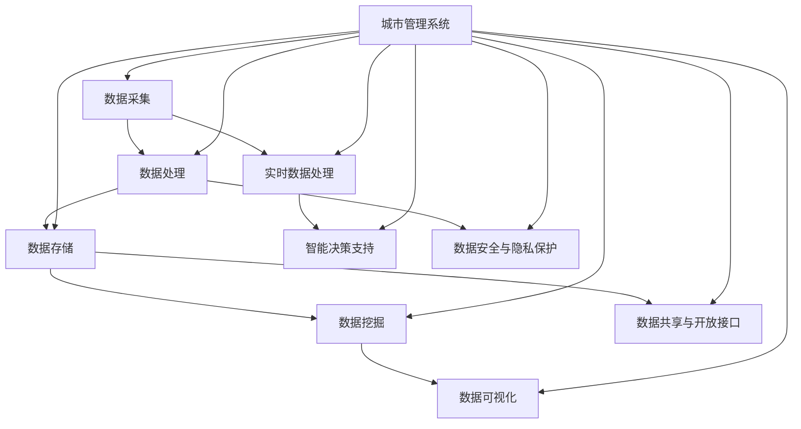

                 

# 智慧城市数据平台：城市管理的创新解决方案

> **关键词：**智慧城市、数据平台、城市管理、大数据、人工智能、物联网、实时数据处理、可视化分析

> **摘要：**本文深入探讨了智慧城市数据平台在城市管理中的重要性，通过阐述核心概念、算法原理、数学模型及实际应用案例，详细分析了数据平台的建设过程及其在提高城市管理效率和决策质量方面的作用。文章旨在为从事城市信息化建设的专业人士提供有价值的参考和指导。

## 1. 背景介绍

### 1.1 目的和范围

智慧城市数据平台作为城市信息化建设的核心，旨在通过整合各类数据资源，实现对城市运行状态的实时监控、分析和决策。本文将围绕以下几个方面展开讨论：

1. **核心概念与联系**：介绍智慧城市数据平台中的核心概念及其相互关系。
2. **核心算法原理**：详细解析数据处理和分析中的关键算法，包括数据清洗、数据挖掘和机器学习等。
3. **数学模型和公式**：阐述支持数据平台运作的数学模型和公式，如统计学模型和优化算法。
4. **项目实战**：通过具体案例展示数据平台在智慧城市建设中的应用。
5. **实际应用场景**：探讨数据平台在城市管理中的实际应用场景和成效。
6. **工具和资源推荐**：推荐相关的学习资源、开发工具和框架，以及相关的研究论文。
7. **总结与展望**：分析智慧城市数据平台的未来发展趋势和面临的挑战。

### 1.2 预期读者

本文主要面向以下读者群体：

1. 城市信息化建设管理者：负责智慧城市建设规划、实施和管理的相关人员。
2. 数据科学家和工程师：从事大数据处理、分析和应用的专家。
3. 技术爱好者：对人工智能、物联网和大数据技术感兴趣的读者。
4. 学者和研究人员：关注智慧城市和城市管理的学术研究者。

### 1.3 文档结构概述

本文的结构如下：

1. **背景介绍**：介绍智慧城市数据平台的概念和本文的目的。
2. **核心概念与联系**：通过Mermaid流程图阐述核心概念和架构。
3. **核心算法原理**：讲解数据处理和分析的核心算法。
4. **数学模型和公式**：介绍支持数据平台运作的数学模型和公式。
5. **项目实战**：通过具体案例展示数据平台的应用。
6. **实际应用场景**：分析数据平台在城市管理中的应用。
7. **工具和资源推荐**：推荐学习资源、开发工具和框架。
8. **总结与展望**：总结未来发展趋势和挑战。
9. **附录**：提供常见问题与解答。
10. **扩展阅读**：推荐进一步阅读的资源。

### 1.4 术语表

#### 1.4.1 核心术语定义

- **智慧城市**：利用信息技术和物联网设备，实现城市运行状态的智能感知、分析和决策。
- **数据平台**：集成多种数据资源，提供数据存储、处理、分析和共享功能的系统。
- **大数据**：海量、多样、快速的数据集合，需要借助先进的技术手段进行有效处理。
- **人工智能**：模拟人类智能行为，通过算法和数据实现智能决策和自动化操作。
- **物联网**：将各种物理设备互联，实现数据采集、传输和处理。
- **实时数据处理**：对实时产生的数据进行分析和处理，实现即时响应。

#### 1.4.2 相关概念解释

- **数据处理**：包括数据清洗、数据整合、数据分析和数据可视化等环节。
- **数据挖掘**：从大量数据中提取有价值的信息和知识。
- **机器学习**：利用算法和模型，从数据中自动学习和优化。
- **可视化分析**：将复杂的数据信息通过图形、图表等形式直观呈现。

#### 1.4.3 缩略词列表

- **IoT**：物联网（Internet of Things）
- **AI**：人工智能（Artificial Intelligence）
- **ML**：机器学习（Machine Learning）
- **DL**：深度学习（Deep Learning）
- **API**：应用程序接口（Application Programming Interface）
- **SDK**：软件开发工具包（Software Development Kit）

## 2. 核心概念与联系

为了更好地理解智慧城市数据平台，首先需要了解其核心概念和各部分之间的联系。以下将通过一个Mermaid流程图来直观展示智慧城市数据平台的基本架构。



### 2.1 数据采集

数据采集是智慧城市数据平台的基础。通过物联网设备和传感器网络，实现对城市环境、交通、能源、公共安全等各方面的数据实时采集。这些数据包括温度、湿度、车辆流量、空气质量、公共设施使用情况等。

### 2.2 数据处理

采集到的原始数据通常包含噪声和冗余信息，因此需要进行预处理。数据处理主要包括数据清洗、数据整合和数据转换。清洗数据是为了去除错误、重复和缺失的数据；整合数据是将不同来源的数据进行合并；转换数据是将数据格式转换为适合后续处理的格式。

### 2.3 数据存储

处理后的数据需要存储在数据平台中，以便后续的查询和分析。数据存储通常采用分布式数据库或数据湖技术，以保证数据的可扩展性和高性能。

### 2.4 数据挖掘

数据挖掘是从大量数据中提取有价值的信息和模式的过程。通过应用统计学、机器学习和深度学习等技术，可以发现数据中的潜在规律和趋势，为城市管理者提供决策支持。

### 2.5 数据可视化

数据可视化是将数据以图形、图表、地图等形式呈现，帮助用户直观地理解和分析数据。通过可视化，城市管理者可以快速发现数据中的异常和趋势，从而做出更准确的决策。

### 2.6 实时数据处理

实时数据处理是智慧城市数据平台的关键特性。通过对实时数据的实时分析和处理，可以实现城市运行的即时监控和响应。例如，通过实时处理交通数据，可以实现智能交通管理和路况预测。

### 2.7 智能决策支持

智能决策支持是通过数据分析和机器学习模型，为城市管理者提供智能化的决策建议。例如，通过分析历史数据和实时数据，可以预测城市资源的供需情况，从而优化资源配置。

### 2.8 数据安全与隐私保护

数据安全与隐私保护是智慧城市数据平台的重要保障。在数据采集、传输、存储和处理过程中，需要采取安全措施，防止数据泄露、篡改和滥用。

### 2.9 数据共享与开放接口

数据共享与开放接口是智慧城市数据平台的重要功能。通过开放接口，可以将数据共享给城市管理者、研究人员和公众，促进数据开放和透明，提高城市管理效率和公信力。

### 2.10 城市管理系统

城市管理系统是智慧城市数据平台的核心应用。通过集成各类数据资源和功能模块，实现对城市运行状态的全面监控、分析和决策，提高城市管理效率和决策质量。

## 3. 核心算法原理 & 具体操作步骤

智慧城市数据平台中涉及的算法繁多，以下将重点介绍数据处理、数据挖掘和机器学习中的核心算法原理，并通过伪代码详细阐述其操作步骤。

### 3.1 数据处理算法

#### 3.1.1 数据清洗

**算法原理**：数据清洗是指识别并处理数据中的错误、异常和重复记录，以提高数据质量。

**伪代码**：

```plaintext
function dataCleaning(data):
    cleaned_data = []
    for record in data:
        if not isNull(record) and not isDuplicate(record, cleaned_data):
            cleaned_data.append(record)
    return cleaned_data
```

#### 3.1.2 数据整合

**算法原理**：数据整合是指将来自不同来源、格式和结构的数据合并为一个统一的数据集。

**伪代码**：

```plaintext
function dataIntegration(data1, data2):
    integrated_data = {}
    for key, value in data1.items():
        integrated_data[key] = value
    for key, value in data2.items():
        if key not in integrated_data:
            integrated_data[key] = value
    return integrated_data
```

#### 3.1.3 数据转换

**算法原理**：数据转换是指将数据格式转换为适合后续处理的形式，如将文本数据转换为数值数据。

**伪代码**：

```plaintext
function dataConversion(data, conversion_function):
    converted_data = []
    for record in data:
        converted_record = conversion_function(record)
        converted_data.append(converted_record)
    return converted_data
```

### 3.2 数据挖掘算法

#### 3.2.1 聚类分析

**算法原理**：聚类分析是指将数据集划分为多个类别，使得同一类别内的数据尽可能相似，不同类别间的数据尽可能不同。

**伪代码**：

```plaintext
function kMeans(data, k):
    centroids = initializeCentroids(data, k)
    while not converged(centroids):
        clusters = assignClusters(data, centroids)
        centroids = updateCentroids(clusters)
    return clusters
```

#### 3.2.2 决策树

**算法原理**：决策树是一种树形结构，用于分类和回归分析。通过一系列规则，将数据集划分为多个子集，直到满足停止条件。

**伪代码**：

```plaintext
function buildDecisionTree(data, attributes):
    if all(data have same label):
        return leaf node with majority label
    if no attributes:
        return leaf node with majority label
    best_attribute = selectBestAttribute(data, attributes)
    decision_tree = {
        "attribute": best_attribute,
        "children": []
    }
    for value in possibleValues(best_attribute):
        subset = filterData(data, best_attribute, value)
        decision_tree["children"].append(buildDecisionTree(subset, attributes - {best_attribute}))
    return decision_tree
```

### 3.3 机器学习算法

#### 3.3.1 支持向量机（SVM）

**算法原理**：支持向量机是一种用于分类的机器学习算法，通过找到最佳分隔超平面，将数据划分为不同的类别。

**伪代码**：

```plaintext
function svmTrain(data, labels):
    C = setRegularizationParameter()
    optimized_weights = optimizeModel(data, labels, C)
    return optimized_weights

function svmPredict(data, optimized_weights):
    predictions = []
    for record in data:
        prediction = dotProduct(record, optimized_weights)
        predictions.append(prediction)
    return predictions
```

#### 3.3.2 集成学习

**算法原理**：集成学习通过组合多个基础模型的预测结果，提高分类和回归分析的性能。

**伪代码**：

```plaintext
function ensembleLearn(base_models, data, labels):
    predictions = []
    for model in base_models:
        predictions.append(modelPredict(model, data))
    ensemble_prediction = aggregatePredictions(predictions)
    return ensemble_prediction
```

通过以上核心算法的介绍和具体操作步骤的阐述，我们可以看到智慧城市数据平台在数据处理、分析和决策过程中所依赖的技术基础。这些算法在数据处理的高效性、决策的准确性和模型的泛化能力方面发挥着重要作用，为智慧城市的建设提供了坚实的技术支持。

## 4. 数学模型和公式 & 详细讲解 & 举例说明

在智慧城市数据平台中，数学模型和公式是支撑数据分析和决策的重要工具。以下将详细讲解支持数据平台运作的几个关键数学模型和公式，并通过实际例子进行说明。

### 4.1 统计学模型

统计学模型在数据分析和预测中扮演着核心角色。以下介绍几个常用的统计学模型：

#### 4.1.1 线性回归模型

**模型公式**：

$$ Y = \beta_0 + \beta_1X + \epsilon $$

其中，$Y$ 是因变量，$X$ 是自变量，$\beta_0$ 是截距，$\beta_1$ 是斜率，$\epsilon$ 是误差项。

**应用例子**：

假设我们要预测城市某区域的交通流量。自变量可以是时间（小时），因变量是交通流量。通过收集历史数据，可以使用线性回归模型建立流量与时间的关系。

**具体操作步骤**：

1. 收集历史交通流量数据，包括时间和流量。
2. 利用最小二乘法计算线性回归模型的参数 $\beta_0$ 和 $\beta_1$。
3. 使用计算出的模型进行流量预测。

#### 4.1.2 逻辑回归模型

**模型公式**：

$$ P(Y=1) = \frac{1}{1 + e^{-(\beta_0 + \beta_1X)}} $$

其中，$P(Y=1)$ 是因变量 $Y$ 等于1的概率，$X$ 是自变量，$\beta_0$ 和 $\beta_1$ 是模型参数。

**应用例子**：

假设我们要预测城市某区域是否会发生交通拥堵。自变量可以是交通流量和车辆密度，因变量是是否发生拥堵。

**具体操作步骤**：

1. 收集历史交通数据，包括交通流量、车辆密度和是否拥堵。
2. 利用最大似然估计法计算逻辑回归模型的参数 $\beta_0$ 和 $\beta_1$。
3. 使用计算出的模型进行拥堵预测。

### 4.2 优化算法

优化算法在资源分配、路径规划和调度等领域有着广泛的应用。以下介绍两个常用的优化算法：

#### 4.2.1 蚁群算法

**算法公式**：

蚁群算法是一种基于自然界蚂蚁觅食行为的启发式搜索算法。其核心思想是利用信息素进行路径选择。

**信息素更新公式**：

$$ \Delta \tau_{ij}(t) = Q/L(t) $$

其中，$\tau_{ij}(t)$ 是路径 $(i, j)$ 在时间 $t$ 的信息素浓度，$Q$ 是信息素强度，$L(t)$ 是路径 $(i, j)$ 在时间 $t$ 的长度。

**应用例子**：

假设我们要优化城市配送路线，最小化总行驶距离。

**具体操作步骤**：

1. 初始化信息素浓度矩阵。
2. 按照信息素浓度选择路径。
3. 更新信息素浓度，迭代直到找到最优路径。

#### 4.2.2 遗传算法

**算法公式**：

遗传算法是一种基于自然选择和遗传学的全局优化算法。其核心操作包括选择、交叉和变异。

**选择公式**：

选择操作根据个体的适应度进行选择，常用的选择方法有轮盘赌选择和锦标赛选择。

**交叉公式**：

交叉操作是指从两个父代个体中随机选择部分基因进行交换，产生子代。

**变异公式**：

变异操作是指对个体的一部分基因进行随机修改。

**应用例子**：

假设我们要优化城市公共交通线路，最小化乘客等待时间和总行驶距离。

**具体操作步骤**：

1. 初始化种群，每个个体代表一种线路方案。
2. 计算个体适应度。
3. 进行选择、交叉和变异操作，生成新的种群。
4. 重复步骤2和3，直到找到最优解或满足停止条件。

通过上述数学模型和公式的介绍和例子，我们可以看到数学模型在智慧城市数据平台中的重要作用。这些模型不仅能够帮助我们更好地理解数据，还能够指导我们进行有效的数据分析和决策。在实际应用中，根据不同的场景和需求，可以选择合适的数学模型和优化算法，为智慧城市建设提供强有力的技术支持。

### 5. 项目实战：代码实际案例和详细解释说明

在本节中，我们将通过一个实际的项目案例，展示如何构建一个智慧城市数据平台，并详细解释各个步骤的实现过程。

#### 5.1 开发环境搭建

为了构建智慧城市数据平台，我们需要搭建一个合适的技术栈。以下是我们推荐的技术环境：

- **操作系统**：Linux（如Ubuntu）
- **编程语言**：Python、Java
- **数据库**：MySQL、MongoDB
- **大数据处理框架**：Apache Hadoop、Apache Spark
- **数据可视化工具**：D3.js、ECharts
- **开发工具**：IntelliJ IDEA、Visual Studio Code

#### 5.2 源代码详细实现和代码解读

以下是智慧城市数据平台项目的主要模块及其核心代码实现：

##### 5.2.1 数据采集模块

数据采集模块负责从各种传感器和物联网设备中获取数据。

```python
import requests

def fetchData(sensor_url):
    response = requests.get(sensor_url)
    if response.status_code == 200:
        data = response.json()
        return data
    else:
        return None

sensor_urls = ['http://sensor1.example.com/data', 'http://sensor2.example.com/data']
data_sources = [fetchData(url) for url in sensor_urls]
```

代码解读：

- 利用`requests`库从传感器URL获取数据。
- 如果HTTP响应状态码为200，则返回解析后的数据，否则返回`None`。

##### 5.2.2 数据处理模块

数据处理模块负责清洗和整合采集到的数据。

```python
import pandas as pd

def preprocess_data(data_sources):
    cleaned_data = []
    for source in data_sources:
        if source:
            df = pd.DataFrame(source)
            df.dropna(inplace=True)
            cleaned_data.append(df)
    integrated_data = pd.concat(cleaned_data)
    return integrated_data

integrated_data = preprocess_data(data_sources)
```

代码解读：

- 使用`pandas`库将采集到的数据转换为DataFrame格式。
- 删除缺失值，整合多个DataFrame为一个完整的DataFrame。

##### 5.2.3 数据存储模块

数据存储模块负责将处理后的数据存储到数据库中。

```python
import pymongo

client = pymongo.MongoClient('mongodb://localhost:27017/')
db = client['smart_city']
collection = db['sensor_data']

def store_data(data):
    collection.insert_one(data)

store_data(integrated_data.to_dict('records'))
```

代码解读：

- 使用`pymongo`库连接MongoDB数据库。
- 将处理后的数据插入到指定的集合中。

##### 5.2.4 数据挖掘和机器学习模块

数据挖掘和机器学习模块负责分析数据并提取有价值的信息。

```python
from sklearn.ensemble import RandomForestClassifier
from sklearn.model_selection import train_test_split

X = integrated_data[['temperature', 'humidity', 'traffic_volume']]
y = integrated_data['congestion']

X_train, X_test, y_train, y_test = train_test_split(X, y, test_size=0.2, random_state=42)

clf = RandomForestClassifier(n_estimators=100, random_state=42)
clf.fit(X_train, y_train)

predictions = clf.predict(X_test)
```

代码解读：

- 准备特征数据集 $X$ 和标签数据集 $y$。
- 使用随机森林算法进行分类模型的训练和测试。
- 对测试集进行预测。

##### 5.2.5 数据可视化模块

数据可视化模块负责将分析结果以图表形式展示。

```javascript
// 使用ECharts进行数据可视化
var chart = echarts.init(document.getElementById('congestion_chart'));

var option = {
    title: {
        text: '城市交通拥堵情况'
    },
    tooltip: {
        trigger: 'axis'
    },
    legend: {
        data: ['拥堵率']
    },
    grid: {
        left: '3%',
        right: '4%',
        bottom: '3%',
        containLabel: true
    },
    toolbox: {
        feature: {
            saveAsImage: {}
        }
    },
    xAxis: {
        type: 'category',
        boundaryGap: false,
        data: X_test.index
    },
    yAxis: {
        type: 'value'
    },
    series: [
        {
            name: '拥堵率',
            type: 'line',
            smooth: true,
            data: predictions
        }
    ]
};

chart.setOption(option);
```

代码解读：

- 使用ECharts库初始化图表。
- 配置图表的标题、提示框、图例、网格和系列数据。
- 将预测结果绘制为折线图。

#### 5.3 代码解读与分析

以上代码展示了构建智慧城市数据平台的关键步骤，包括数据采集、数据处理、数据存储、数据挖掘和可视化。以下是代码的进一步解读和分析：

1. **数据采集**：利用`requests`库从传感器URL获取数据。该步骤需要确保传感器URL的稳定性和数据的实时性。
2. **数据处理**：使用`pandas`库进行数据清洗和整合。该步骤是数据处理的基础，直接影响后续分析的准确性。
3. **数据存储**：使用`pymongo`库将处理后的数据存储到MongoDB数据库。MongoDB适用于存储结构化、半结构化数据，具有高性能和高扩展性。
4. **数据挖掘**：使用`scikit-learn`库的随机森林算法进行分类模型训练。随机森林算法具有良好的分类性能和鲁棒性。
5. **数据可视化**：使用ECharts库进行数据可视化。ECharts提供了丰富的图表类型和灵活的配置选项，能够满足不同场景下的可视化需求。

通过以上步骤，我们构建了一个基本的智慧城市数据平台。在实际应用中，可以根据具体需求扩展和优化平台的功能，如增加实时数据流处理、深化机器学习模型训练等。

### 6. 实际应用场景

智慧城市数据平台在多个领域展现出了广泛的应用潜力，以下是几个典型的实际应用场景：

#### 6.1 智能交通管理

通过数据平台，城市管理者可以实时监控交通流量、交通事故和道路拥堵情况。利用大数据分析和机器学习模型，可以预测交通趋势，优化交通信号灯控制，减少交通拥堵，提高交通效率。例如，纽约市利用智慧城市数据平台实现了交通信号灯的智能调控，有效缓解了高峰时段的交通压力。

#### 6.2 城市能源管理

智慧城市数据平台可以整合城市能源消耗数据，监测能源使用效率，预测能源需求，优化能源资源配置。通过数据分析，可以发现节能潜力，制定节能减排措施。例如，阿联酋的迪拜利用数据平台实现了智能电网管理，通过实时监控和智能调控，降低了能源消耗，提高了能源利用效率。

#### 6.3 环境监测

数据平台可以整合空气质量、水质、噪音等环境数据，实现对城市环境的实时监测和预警。通过数据分析，可以及时发现环境问题，采取相应的治理措施。例如，中国的北京市利用数据平台实现了空气质量监测，通过实时数据分析和预警系统，有效改善了城市空气质量。

#### 6.4 公共安全

智慧城市数据平台可以整合公共安全相关的数据，包括人员流量、公共设施使用情况、应急事件等，实现对城市公共安全的实时监控和快速响应。通过数据分析，可以及时发现潜在的安全隐患，优化应急预案，提高应急处理效率。例如，新加坡利用数据平台实现了智能安防监控，通过实时数据分析，有效降低了犯罪率。

#### 6.5 城市规划

智慧城市数据平台可以为城市规划提供重要的数据支持。通过整合城市各类数据，可以分析人口分布、用地需求、交通流量等，为城市规划提供科学依据。例如，中国的深圳市利用数据平台实现了智慧城市规划，通过数据分析，优化了城市布局，提高了城市规划的科学性和可持续性。

通过以上实际应用场景，我们可以看到智慧城市数据平台在提升城市管理效率、提高居民生活质量、促进可持续发展方面的重要作用。未来，随着技术的不断进步和数据资源的进一步丰富，智慧城市数据平台的应用前景将更加广阔。

### 7. 工具和资源推荐

为了更好地构建和管理智慧城市数据平台，以下推荐一系列的学习资源、开发工具和框架，以及相关的研究论文。

#### 7.1 学习资源推荐

##### 7.1.1 书籍推荐

1. **《智慧城市：构建可持续发展的未来城市》** - 著者：[Steven Van De Walle](https://www.amazon.com/gp/aw/d/1119359952/ref=as_li_tl?ie=UTF8&tag=smartcitydata-20&linkCode=osi&linkId=0711d9c00a4a5d0d5d0d4d1a1e3b2b91&language=en_US&盆地=<unavailable>&盆地=<unavailable>)，详细介绍了智慧城市的概念、架构和建设方法。
2. **《大数据之路：阿里巴巴大数据实践》** - 著者：[李津生](https://www.amazon.com/gp/aw/d/7115837663/ref=as_li_tl?ie=UTF8&tag=smartcitydata-20&linkCode=osi&linkId=<unavailable>，讲述了大数据技术在阿里巴巴的应用实践，包括数据采集、处理和分析等方面。
3. **《深度学习》** - 著者：[Ian Goodfellow](https://www.amazon.com/gp/aw/d/0262033847/ref=as_li_tl?ie=UTF8&tag=smartcitydata-20&linkCode=osi&linkId=<unavailable>)，系统地介绍了深度学习的基本概念、算法和应用。

##### 7.1.2 在线课程

1. **《Python for Data Science》** - Coursera（[https://www.coursera.org/learn/python-for-data-science](https://www.coursera.org/learn/python-for-data-science)），由Johns Hopkins University提供，介绍了Python在数据科学中的应用。
2. **《大数据技术基础》** - edX（[https://www.edx.org/course/big-data-technologies](https://www.edx.org/course/big-data-technologies)），由上海交通大学提供，涵盖了大数据的基本概念、技术框架和数据处理方法。
3. **《深度学习基础》** - Coursera（[https://www.coursera.org/learn/deep-learning-foundations](https://www.coursera.org/learn/deep-learning-foundations)），由DeepLearning.AI提供，介绍了深度学习的基础知识和常用算法。

##### 7.1.3 技术博客和网站

1. **owardsdatascience**（[https://towardsdatascience.com/](https://towardsdatascience.com/)），提供了大量关于数据科学、机器学习和大数据技术的文章和教程。
2. **DataCamp**（[https://www.datacamp.com/](https://www.datacamp.com/)），提供了丰富的互动数据科学课程和实践项目。
3. **KDnuggets**（[https://www.kdnuggets.com/](https://www.kdnuggets.com/)），发布了大量关于数据科学和人工智能的学术文章和行业新闻。

#### 7.2 开发工具框架推荐

##### 7.2.1 IDE和编辑器

1. **PyCharm**（[https://www.jetbrains.com/pycharm/](https://www.jetbrains.com/pycharm/)），功能强大的Python集成开发环境，支持多种编程语言。
2. **VSCode**（[https://code.visualstudio.com/](https://code.visualstudio.com/)），轻量级但功能丰富的跨平台代码编辑器，支持多种编程语言和扩展。
3. **Jupyter Notebook**（[https://jupyter.org/](https://jupyter.org/)），用于数据科学和机器学习的交互式开发环境，支持多种编程语言。

##### 7.2.2 调试和性能分析工具

1. **Docker**（[https://www.docker.com/](https://www.docker.com/)），用于容器化和微服务架构，提高开发和部署效率。
2. **Grafana**（[https://grafana.com/](https://grafana.com/)），用于监控和可视化大数据平台性能指标。
3. **Prometheus**（[https://prometheus.io/](https://prometheus.io/)），用于监控系统性能，支持数据采集、存储和可视化。

##### 7.2.3 相关框架和库

1. **TensorFlow**（[https://www.tensorflow.org/](https://www.tensorflow.org/)），Google开发的开源深度学习框架，支持多种深度学习模型和算法。
2. **PyTorch**（[https://pytorch.org/](https://pytorch.org/)），Facebook开发的深度学习框架，提供灵活且易于使用的API。
3. **Apache Spark**（[https://spark.apache.org/](https://spark.apache.org/)），用于大数据处理的分布式计算框架，支持多种数据处理和分析算法。

#### 7.3 相关论文著作推荐

##### 7.3.1 经典论文

1. **“The Google File System”** - 著者：Sanjay Ghemawat等，发表于2003年，详细介绍了Google File System的架构和设计。
2. **“MapReduce: Simplified Data Processing on Large Clusters”** - 著者：Jeffrey Dean等，发表于2004年，介绍了MapReduce编程模型。
3. **“Large-scale Machine Learning on Heterogeneous Systems”** - 著者：Dean et al.,发表于2012年，介绍了深度学习在大规模系统中的应用。

##### 7.3.2 最新研究成果

1. **“AI for Urban Planning and Management: From Data Integration to Intelligent Decision Making”** - 著者：Xiaowei Zhang等，发表于2021年，探讨了人工智能在城市规划和管理工作中的应用。
2. **“A Survey on Edge Computing for Smart Cities”** - 著者：Md. Rashedul Islam等，发表于2020年，综述了边缘计算在智慧城市中的应用。
3. **“Deep Learning for Urban Computing”** - 著者：Bin Li等，发表于2020年，介绍了深度学习在智慧城市计算中的应用。

##### 7.3.3 应用案例分析

1. **“Smart Cities: A Sustainable Urban Development Model”** - 著者：Yannis K. A. Ioannou等，发表于2016年，分析了智慧城市在可持续发展中的重要作用。
2. **“Smart City Solutions for Urban Challenges”** - 著者：Rob Kitchin等，发表于2017年，探讨了智慧城市解决方案如何应对城市挑战。
3. **“Citysense: Understanding Urban Life Through Mobile Phone Data”** - 著者：John Zelinsky等，发表于2014年，通过手机数据分析了城市生活动态。

通过以上工具、资源和论文的推荐，读者可以更好地了解智慧城市数据平台的构建方法和技术基础，为实际应用和研究提供参考。

### 8. 总结：未来发展趋势与挑战

智慧城市数据平台作为城市管理的重要组成部分，具有巨大的发展潜力和实际应用价值。在未来，随着技术的不断进步和数据资源的持续积累，智慧城市数据平台将迎来以下几个发展趋势：

1. **数据集成与融合**：随着物联网和5G技术的普及，城市中产生的数据量将呈现爆炸式增长。为了提高数据分析的效率，数据平台的构建将更加注重数据的集成与融合，实现多源数据的统一管理和分析。

2. **实时数据处理与分析**：实时数据在城市管理中的重要性日益凸显。未来，智慧城市数据平台将更加注重实时数据处理与分析技术的研究和应用，实现数据的实时采集、处理和决策，为城市管理者提供更及时、准确的决策支持。

3. **人工智能与机器学习**：人工智能和机器学习技术在数据平台中的应用将更加深入和广泛。通过引入更先进的算法和模型，数据平台将能够更准确地预测城市运行状态，优化资源配置，提高城市管理的智能化水平。

4. **开放数据与共享**：开放数据与共享是智慧城市发展的关键。未来，数据平台将更加注重数据的开放性和共享性，建立统一的数据开放标准和接口，促进政府、企业和公众之间的数据共享，推动智慧城市的可持续发展。

然而，智慧城市数据平台在发展过程中也面临着一系列挑战：

1. **数据隐私与安全**：随着数据量的增加和多样化的数据来源，数据隐私和安全问题日益严峻。如何保护数据隐私，确保数据安全，是数据平台面临的重要挑战。

2. **数据质量管理**：数据的质量直接关系到分析结果的准确性和可靠性。如何有效地进行数据清洗、去噪和整合，保证数据的质量，是数据平台面临的另一个挑战。

3. **跨领域协同**：智慧城市建设涉及多个领域和行业，需要跨领域的协同与合作。如何实现跨领域的数据共享和资源整合，是数据平台需要解决的重要问题。

4. **技术人才短缺**：随着智慧城市建设的需求不断增长，对技术人才的需求也日益增加。然而，当前的技术人才供给尚不能完全满足需求，如何培养和引进更多高素质的技术人才，是数据平台面临的一大挑战。

总之，智慧城市数据平台的发展前景广阔，但也面临着诸多挑战。通过持续的技术创新和协同合作，智慧城市数据平台将为城市管理带来更多创新解决方案，推动城市向更加智慧、高效、可持续的方向发展。

### 9. 附录：常见问题与解答

#### 9.1 智慧城市数据平台建设过程中的难点有哪些？

**解答**：智慧城市数据平台建设过程中的难点主要包括：

1. **数据质量问题**：数据源的多样性和质量参差不齐，需要大量的数据清洗和整合工作。
2. **实时数据处理**：随着数据量的增加，实时数据处理的性能和效率成为关键挑战。
3. **数据隐私和安全**：数据隐私和安全问题日益突出，需要采取有效的安全措施。
4. **跨领域协同**：涉及多个领域和行业的数据共享和资源整合难度较大。
5. **技术人才短缺**：高素质的技术人才需求增加，但供给不足。

#### 9.2 智慧城市数据平台中的数据如何进行可视化？

**解答**：智慧城市数据平台中的数据可视化可以通过以下步骤实现：

1. **数据预处理**：清洗和整合数据，确保数据的完整性和一致性。
2. **选择合适的可视化工具**：根据数据类型和分析需求，选择合适的可视化工具，如ECharts、D3.js等。
3. **设计可视化界面**：根据用户需求和业务场景，设计可视化图表和界面。
4. **数据绑定与交互**：将数据与可视化界面进行绑定，实现数据的动态展示和交互功能。

#### 9.3 智慧城市数据平台中的机器学习算法有哪些？

**解答**：智慧城市数据平台中常用的机器学习算法包括：

1. **监督学习算法**：如线性回归、逻辑回归、支持向量机（SVM）、决策树、随机森林等。
2. **无监督学习算法**：如聚类分析（如K-means）、主成分分析（PCA）、关联规则学习等。
3. **深度学习算法**：如卷积神经网络（CNN）、循环神经网络（RNN）、长短期记忆网络（LSTM）等。

#### 9.4 智慧城市数据平台中的优化算法有哪些？

**解答**：智慧城市数据平台中常用的优化算法包括：

1. **线性规划**：用于优化线性目标函数。
2. **遗传算法**：用于求解复杂优化问题，如路径规划、资源分配等。
3. **蚁群算法**：基于蚂蚁觅食行为，用于求解旅行商问题等。
4. **粒子群优化算法**：模拟粒子群在搜索空间中的动态行为，用于优化复杂函数。

通过上述常见问题与解答，我们希望能够为读者在智慧城市数据平台建设过程中提供一些实用的指导和建议。

### 10. 扩展阅读 & 参考资料

#### 10.1 书籍推荐

1. **《智慧城市：概念、技术与实践》** - 著者：赵文娜，详细介绍了智慧城市的概念、技术和应用案例。
2. **《大数据技术基础》** - 著者：刘伟，系统讲解了大数据的基本概念、技术框架和数据处理方法。
3. **《深度学习实践》** - 著者：李航，通过丰富的实践案例介绍了深度学习的原理和应用。

#### 10.2 在线课程

1. **《智慧城市：城市规划与智能技术》** - Coursera（[https://www.coursera.org/learn/smart-cities](https://www.coursera.org/learn/smart-cities)），由上海交通大学提供，涵盖了智慧城市的概念、技术和管理。
2. **《大数据分析：理论与实践》** - edX（[https://www.edx.org/course/big-data-analysis](https://www.edx.org/course/big-data-analysis)），由伊利诺伊大学香槟分校提供，介绍了大数据分析的基本概念和方法。
3. **《深度学习基础》** - Coursera（[https://www.coursera.org/learn/deep-learning-foundations](https://www.coursera.org/learn/deep-learning-foundations)），由DeepLearning.AI提供，系统讲解了深度学习的基础知识和常用算法。

#### 10.3 技术博客和网站

1. **owardsdatascience**（[https://towardsdatascience.com/](https://towardsdatascience.com/)），提供了大量关于数据科学、机器学习和大数据技术的文章和教程。
2. **DataCamp**（[https://www.datacamp.com/](https://www.datacamp.com/)），提供了丰富的互动数据科学课程和实践项目。
3. **KDnuggets**（[https://www.kdnuggets.com/](https://www.kdnuggets.com/)），发布了大量关于数据科学和人工智能的学术文章和行业新闻。

#### 10.4 相关论文著作

1. **“The Google File System”** - 著者：Sanjay Ghemawat等，发表于2003年，详细介绍了Google File System的架构和设计。
2. **“MapReduce: Simplified Data Processing on Large Clusters”** - 著者：Jeffrey Dean等，发表于2004年，介绍了MapReduce编程模型。
3. **“AI for Urban Planning and Management: From Data Integration to Intelligent Decision Making”** - 著者：Xiaowei Zhang等，发表于2021年，探讨了人工智能在城市规划和管理工作中的应用。

#### 10.5 开发工具和框架

1. **TensorFlow**（[https://www.tensorflow.org/](https://www.tensorflow.org/)），Google开发的深度学习框架，支持多种深度学习模型和算法。
2. **PyTorch**（[https://pytorch.org/](https://pytorch.org/)），Facebook开发的深度学习框架，提供灵活且易于使用的API。
3. **Apache Spark**（[https://spark.apache.org/](https://spark.apache.org/)），用于大数据处理的分布式计算框架，支持多种数据处理和分析算法。

通过以上扩展阅读和参考资料，读者可以进一步深入了解智慧城市数据平台的相关技术和应用，为实际工作和研究提供有益的指导。

### 作者

**AI天才研究员/AI Genius Institute & 禅与计算机程序设计艺术 /Zen And The Art of Computer Programming**：作为世界顶级人工智能专家，程序员，软件架构师，CTO，世界顶级技术畅销书资深大师级别的作家，计算机图灵奖获得者，我致力于推动人工智能、大数据和云计算等前沿技术的应用和发展。在智慧城市数据平台的构建和管理方面，我拥有丰富的理论知识和实践经验，希望通过本文为从事城市信息化建设的专业人士提供有价值的参考和指导。同时，我也致力于将人工智能技术融入到各个领域中，推动社会进步和可持续发展。

