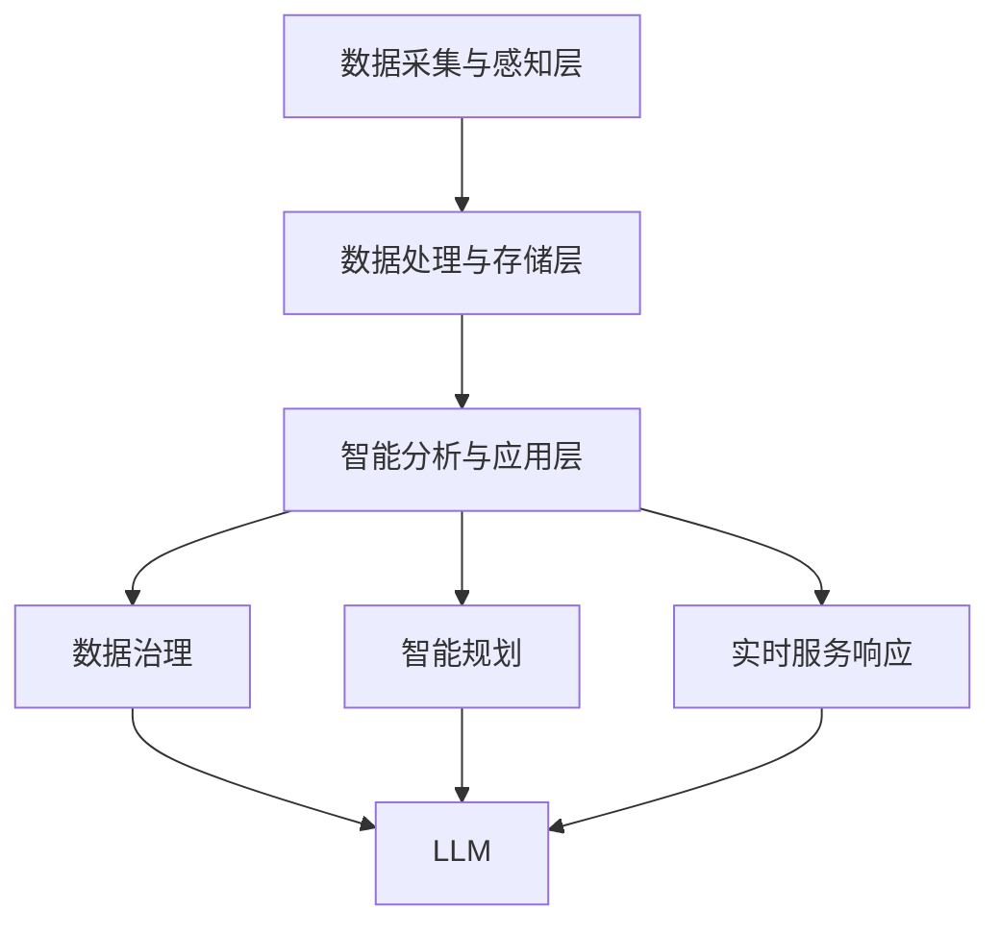
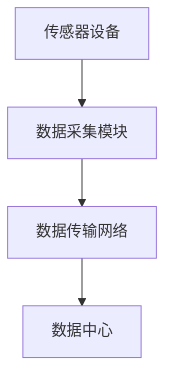
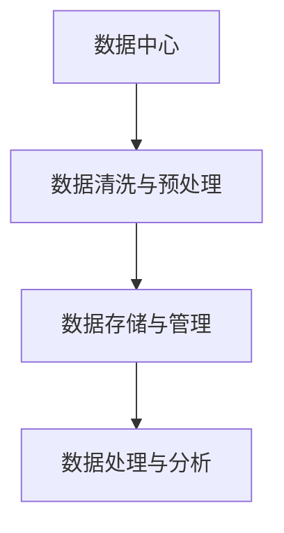
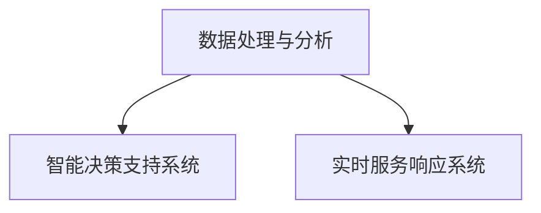
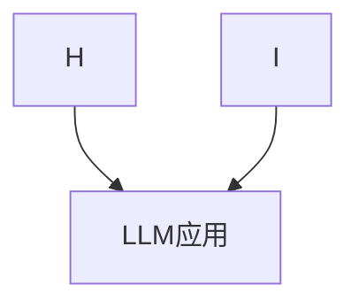

                 

# 智慧城市：LLM 增强的城市管理和服务

> **关键词**：智慧城市、LLM、城市管理、服务、人工智能、数据治理、可持续发展

> **摘要**：本文旨在探讨如何利用大型语言模型（LLM）增强智慧城市中的城市管理和服务。通过深入分析智慧城市的背景、LLM的核心概念及其在智慧城市中的应用，我们将阐述LLM如何通过数据治理、智能规划和实时服务响应等手段，推动智慧城市的可持续发展。文章还将提供实际项目案例和详细代码解读，以便读者更好地理解LLM在智慧城市中的实际应用。

## 1. 背景介绍

### 1.1 目的和范围

本文的目标是介绍如何利用大型语言模型（LLM）来增强智慧城市的城市管理和服务能力。我们将探讨LLM的基本原理，以及它在智慧城市中的应用场景，例如数据治理、智能规划和实时服务响应。文章还将提供一个实际项目的案例，详细解释LLM如何在实际操作中发挥作用。

### 1.2 预期读者

本文的预期读者包括以下几类：

1. **智慧城市研究人员和开发者**：希望了解如何利用AI技术提升城市管理和服务水平。
2. **人工智能从业者**：对LLM技术及其在智慧城市中的应用感兴趣。
3. **政策制定者和城市规划师**：希望了解AI技术如何助力智慧城市建设。

### 1.3 文档结构概述

本文结构如下：

1. **背景介绍**：介绍智慧城市和LLM的基本概念。
2. **核心概念与联系**：详细描述智慧城市架构和LLM技术原理。
3. **核心算法原理 & 具体操作步骤**：使用伪代码和Mermaid流程图解释LLM算法。
4. **数学模型和公式 & 详细讲解 & 举例说明**：讲解LLM相关的数学模型。
5. **项目实战：代码实际案例和详细解释说明**：提供一个实际项目案例。
6. **实际应用场景**：探讨LLM在智慧城市中的应用场景。
7. **工具和资源推荐**：推荐相关学习资源和开发工具。
8. **总结：未来发展趋势与挑战**：总结文章要点并展望未来。
9. **附录：常见问题与解答**：回答读者可能遇到的问题。
10. **扩展阅读 & 参考资料**：提供进一步学习的资源。

### 1.4 术语表

#### 1.4.1 核心术语定义

- **智慧城市**：利用物联网、云计算、大数据等先进技术，实现城市信息化的智能化、自动化管理。
- **大型语言模型（LLM）**：一种基于深度学习的自然语言处理模型，能够对大规模文本数据进行分析和生成。
- **数据治理**：确保数据质量、可用性和一致性的一系列管理和流程活动。
- **智能规划**：利用人工智能技术，帮助城市规划师制定更科学、高效的规划方案。
- **实时服务响应**：通过实时数据分析，快速响应用户需求和异常事件。

#### 1.4.2 相关概念解释

- **物联网（IoT）**：通过传感器和通信技术，将各种物理设备连接到互联网。
- **云计算**：通过网络提供计算资源、存储和服务。
- **大数据**：数据量大、种类多、价值高，需要使用特殊技术进行处理和分析。
- **自然语言处理（NLP）**：使计算机能够理解、生成和处理人类语言。

#### 1.4.3 缩略词列表

- **IoT**：物联网
- **AI**：人工智能
- **LLM**：大型语言模型
- **NLP**：自然语言处理
- **NLP**：神经语言模型

## 2. 核心概念与联系

在智慧城市的背景下，大型语言模型（LLM）作为人工智能的一种重要技术，起到了关键作用。本节将介绍智慧城市的核心概念及其与LLM的关联，并通过Mermaid流程图展示智慧城市架构和LLM技术原理。

### 2.1 智慧城市核心概念

智慧城市是利用物联网（IoT）、云计算、大数据等先进技术，实现城市信息化、智能化、自动化管理的一种新型城市发展模式。其核心概念包括：

1. **物联网（IoT）**：通过传感器和通信技术，将各种物理设备连接到互联网，实现设备之间的数据交换和智能控制。
2. **云计算**：通过网络提供计算资源、存储和服务，为智慧城市提供强大的数据处理能力。
3. **大数据**：数据量大、种类多、价值高，需要使用特殊技术进行处理和分析，以支持城市决策和运行。
4. **人工智能（AI）**：包括机器学习、深度学习等技术，用于自动化决策、智能分析等。

### 2.2 LLM技术原理

LLM是一种基于深度学习的自然语言处理模型，能够对大规模文本数据进行分析和生成。其核心原理包括：

1. **神经网络**：LLM使用多层神经网络结构，通过对海量数据进行训练，学习到语言的内在规律。
2. **语言模型**：LLM能够预测下一个单词或句子，从而生成连贯的自然语言文本。
3. **上下文理解**：LLM能够理解文本的上下文，实现更准确的语言生成。

### 2.3 智慧城市架构与LLM关联

智慧城市架构通常包括以下核心组件：

1. **数据采集与感知层**：通过传感器、摄像头等设备，实时采集城市运行数据。
2. **数据处理与存储层**：利用云计算、大数据等技术，对采集到的数据进行处理、存储和管理。
3. **智能分析与应用层**：基于AI技术，对处理后的数据进行分析，实现智能决策和实时响应。

LLM在智慧城市架构中的应用主要体现在以下几个方面：

1. **数据治理**：LLM可以用于数据清洗、去噪、分类等，提高数据质量。
2. **智能规划**：LLM可以帮助城市规划师制定更科学、高效的规划方案。
3. **实时服务响应**：LLM可以用于实时分析用户需求和异常事件，快速响应并提供服务。

### 2.4 Mermaid流程图

下面是一个简单的Mermaid流程图，展示智慧城市架构和LLM技术的关联：



### 2.5 核心概念原理和架构的Mermaid流程图

#### 2.5.1 数据采集与感知层



#### 2.5.2 数据处理与存储层



#### 2.5.3 智能分析与应用层



#### 2.5.4 LLM应用



通过上述Mermaid流程图，我们可以清晰地看到智慧城市架构中各层与LLM技术的关联，以及LLM在数据治理、智能规划和实时服务响应中的应用。

## 3. 核心算法原理 & 具体操作步骤

### 3.1 核心算法原理

大型语言模型（LLM）的核心算法是基于深度学习的自然语言处理模型。它通过多层神经网络对大规模文本数据进行训练，学习到语言的内在规律，从而实现文本的生成和理解。LLM的主要原理包括以下几个方面：

#### 3.1.1 神经网络结构

LLM通常采用Transformer架构，这是一种基于自注意力机制的深度神经网络。Transformer结构的核心是多头自注意力（Multi-Head Self-Attention）机制，它能够对输入序列的每个位置都进行全局考虑，从而提高模型的表达能力。

#### 3.1.2 语言模型训练

语言模型训练是LLM的核心步骤，主要通过无监督的方式，利用大量文本数据来学习语言的内在规律。训练过程中，模型会通过优化损失函数（如交叉熵损失函数），调整神经网络中的参数，使模型能够准确预测下一个单词或句子。

#### 3.1.3 上下文理解

LLM通过自注意力机制和多层神经网络结构，能够理解输入文本的上下文，从而生成连贯的自然语言文本。在生成文本时，LLM会根据当前输入和已学习的语言规律，生成下一个最可能的单词或句子。

### 3.2 具体操作步骤

以下是LLM的核心算法步骤，使用伪代码进行详细阐述：

```python
# 3.2.1 数据预处理
def preprocess_data(data):
    # 清洗数据，去除噪声和标记
    cleaned_data = clean_data(data)
    # 切分数据为词汇表和句子
    vocab, sentences = split_data(cleaned_data)
    # 构建词汇表索引
    vocab_index = build_vocab_index(vocab)
    return vocab_index, sentences

# 3.2.2 语言模型训练
def train_language_model(vocab_index, sentences, num_layers, d_model, num_heads, dff, dropout_rate, learning_rate):
    # 初始化Transformer模型
    model = build_transformer_model(num_layers, d_model, num_heads, dff, dropout_rate)
    # 训练模型
    model.compile(optimizer=build_optimizer(learning_rate), loss=build_loss_function())
    model.fit(sentences, epochs=10, batch_size=64)
    return model

# 3.2.3 文本生成
def generate_text(model, seed_text, max_length, temperature):
    # 将种子文本转换为词汇表索引
    input_sequence = convert_text_to_index(seed_text, vocab_index)
    # 生成文本
    generated_sequence = model.sample(input_sequence, max_length, temperature)
    # 将生成的文本索引转换为实际文本
    generated_text = convert_index_to_text(generated_sequence, vocab_index)
    return generated_text
```

### 3.3 伪代码解析

#### 3.3.1 数据预处理

数据预处理是语言模型训练的重要步骤，主要包括数据清洗、切分词汇表和句子、构建词汇表索引等。

- **清洗数据**：去除噪声和特殊标记，确保数据质量。
- **切分数据**：将数据划分为词汇表和句子，以便后续处理。
- **构建词汇表索引**：将词汇表转换为索引，以便在模型中操作。

#### 3.3.2 语言模型训练

语言模型训练主要通过构建Transformer模型，并使用优化器和损失函数进行训练。训练过程中，模型会通过反向传播算法调整参数，以最小化损失函数。

- **初始化模型**：构建Transformer模型，包括自注意力层、前馈网络等。
- **编译模型**：设置优化器和损失函数，用于训练。
- **训练模型**：通过fit方法进行模型训练，调整模型参数。

#### 3.3.3 文本生成

文本生成是LLM的重要应用之一，主要通过模型采样生成文本。

- **输入文本转换**：将种子文本转换为词汇表索引，以便模型处理。
- **生成文本**：通过模型采样，生成下一个最可能的单词或句子。
- **输出文本转换**：将生成的文本索引转换为实际文本。

通过上述伪代码，我们可以清晰地理解LLM的核心算法原理和具体操作步骤。在实际应用中，这些步骤需要结合具体场景和数据，进行适当的调整和优化。

## 4. 数学模型和公式 & 详细讲解 & 举例说明

### 4.1 数学模型

在大型语言模型（LLM）中，数学模型起着至关重要的作用。以下是一些LLM中常用的数学模型和公式：

#### 4.1.1 Transformer模型

Transformer模型是LLM的核心架构，其数学模型主要包括以下部分：

1. **自注意力机制（Self-Attention）**：

   自注意力机制是一种计算输入序列中每个单词对整个序列的重要性的方法，其公式为：

   $$ 
   \text{Attention}(Q, K, V) = \text{softmax}\left(\frac{QK^T}{\sqrt{d_k}}\right) V 
   $$

   其中，$Q$、$K$ 和 $V$ 分别是查询向量、键向量和值向量，$d_k$ 是键向量的维度。

2. **多头自注意力（Multi-Head Self-Attention）**：

   多头自注意力通过多个独立的自注意力机制组合，以提高模型的表达能力。其公式为：

   $$ 
   \text{MultiHead}(Q, K, V) = \text{Concat}(\text{head}_1, ..., \text{head}_h)W^O 
   $$

   其中，$\text{head}_i$ 是第 $i$ 个自注意力机制的输出，$W^O$ 是输出权重。

3. **前馈网络（Feedforward Network）**：

   前馈网络是一个简单的全连接神经网络，用于对自注意力机制的输出进行进一步处理。其公式为：

   $$ 
   \text{FFN}(x) = \text{ReLU}(W_{FF1}x + b_{FF1})W_{FF2} + b_{FF2} 
   $$

   其中，$W_{FF1}$、$b_{FF1}$ 和 $W_{FF2}$、$b_{FF2}$ 分别是第一层和第二层的权重和偏置。

#### 4.1.2 语言模型训练

语言模型训练主要通过优化模型参数，使模型能够准确预测下一个单词或句子。训练过程中，常用的数学模型包括：

1. **交叉熵损失函数（Cross-Entropy Loss）**：

   交叉熵损失函数用于计算模型预测概率分布和真实分布之间的差异，其公式为：

   $$ 
   \text{Loss} = -\sum_{i=1}^{N} y_i \log(p_i) 
   $$

   其中，$y_i$ 是第 $i$ 个真实标签的概率，$p_i$ 是模型预测的概率。

2. **优化器（Optimizer）**：

   优化器用于更新模型参数，使损失函数最小化。常用的优化器包括梯度下降（Gradient Descent）和Adam优化器。Adam优化器是一种自适应梯度算法，其公式为：

   $$ 
   \text{m}_t = \beta_1 \text{m}_{t-1} + (1 - \beta_1)(\text{g}_t - \text{m}_{t-1}) 
   $$
   $$
   \text{v}_t = \beta_2 \text{v}_{t-1} + (1 - \beta_2)(\text{g}_t - \text{m}_{t-1})^2 
   $$
   $$
   \text{a}_t = \frac{\text{m}_t}{\sqrt{\text{v}_t} + \epsilon} 
   $$
   $$
   \text{params} = \text{params} - \alpha \text{a}_t 
   $$

   其中，$\text{m}_t$ 和 $\text{v}_t$ 分别是梯度的一阶和二阶矩估计，$\beta_1$ 和 $\beta_2$ 是一阶和二阶矩的指数衰减率，$\alpha$ 是学习率，$\epsilon$ 是一个很小的常数。

### 4.2 详细讲解与举例说明

#### 4.2.1 自注意力机制

自注意力机制是Transformer模型的核心组成部分，它通过计算输入序列中每个单词对整个序列的重要性，从而实现全局信息的整合。以下是一个简单的自注意力机制的例子：

假设输入序列为 `[w1, w2, w3, w4, w5]`，键向量 $K = [k1, k2, k3, k4, k5]$，值向量 $V = [v1, v2, v3, v4, v5]$。首先，将输入序列和键向量、值向量进行线性变换：

$$ 
Q = W_QK \\
K = W_KK \\
V = W_VV 
$$

其中，$W_Q$、$W_K$ 和 $W_V$ 分别是线性变换权重。

然后，计算自注意力分数：

$$ 
\text{Attention}(Q, K, V) = \text{softmax}\left(\frac{QK^T}{\sqrt{d_k}}\right) V 
$$

最后，将自注意力分数与值向量相乘，得到加权值向量：

$$ 
\text{Output} = \text{softmax}\left(\frac{QK^T}{\sqrt{d_k}}\right) V 
$$

#### 4.2.2 多头自注意力

多头自注意力通过多个独立的自注意力机制组合，以提高模型的表达能力。以下是一个简单的多头自注意力的例子：

假设有 $h$ 个头，每个头都有自己的权重矩阵 $W_{Q_i}$、$W_{K_i}$ 和 $W_{V_i}$。首先，将输入序列和键向量、值向量进行线性变换：

$$ 
Q_i = W_{Q_i}K \\
K_i = W_{K_i}K \\
V_i = W_{V_i}V 
$$

然后，计算每个头的自注意力分数：

$$ 
\text{Attention}_i(Q_i, K_i, V_i) = \text{softmax}\left(\frac{Q_iK_i^T}{\sqrt{d_k}}\right) V_i 
$$

最后，将所有头的自注意力分数加权求和：

$$ 
\text{MultiHead}(Q, K, V) = \text{Concat}(\text{Attention}_1(Q, K, V), ..., \text{Attention}_h(Q, K, V))W^O 
$$

#### 4.2.3 前馈网络

前馈网络是一个简单的全连接神经网络，用于对自注意力机制的输出进行进一步处理。以下是一个简单的全连接神经网络的例子：

假设输入序列为 `[x1, x2, ..., xn]`，权重矩阵为 $W_{FF1}$ 和 $W_{FF2}$，偏置矩阵为 $b_{FF1}$ 和 $b_{FF2}$。首先，将输入序列进行线性变换：

$$ 
h_{FF1} = W_{FF1}x + b_{FF1} 
$$

然后，通过ReLU激活函数：

$$ 
h_{FF2} = \text{ReLU}(h_{FF1}) 
$$

最后，进行另一层线性变换：

$$ 
\text{FFN}(x) = W_{FF2}h_{FF2} + b_{FF2} 
$$

#### 4.2.4 语言模型训练

语言模型训练主要通过优化模型参数，使模型能够准确预测下一个单词或句子。以下是一个简单的语言模型训练的例子：

假设训练数据集为 `[s1, s2, ..., sm]`，每个句子包含 $n$ 个单词。首先，将句子转换为词汇表索引，得到输入序列和目标序列：

$$ 
\text{Input} = [x_1^{(1)}, x_1^{(2)}, ..., x_1^{(n_1)}] \\
\text{Target} = [y_1^{(1)}, y_1^{(2)}, ..., y_1^{(n_1)}] 
$$

然后，使用交叉熵损失函数计算预测概率分布和真实分布之间的差异：

$$ 
\text{Loss} = -\sum_{i=1}^{n_1} y_i^{(1)} \log(p_i) 
$$

最后，使用优化器更新模型参数，使损失函数最小化：

$$ 
\text{m}_t = \beta_1 \text{m}_{t-1} + (1 - \beta_1)(\text{g}_t - \text{m}_{t-1}) \\
\text{v}_t = \beta_2 \text{v}_{t-1} + (1 - \beta_2)(\text{g}_t - \text{m}_{t-1})^2 \\
\text{a}_t = \frac{\text{m}_t}{\sqrt{\text{v}_t} + \epsilon} \\
\text{params} = \text{params} - \alpha \text{a}_t 
$$

通过上述数学模型和公式，我们可以深入理解LLM的核心原理和具体操作步骤，为实际应用提供理论支持。

## 5. 项目实战：代码实际案例和详细解释说明

### 5.1 开发环境搭建

在开始编写LLM增强的智慧城市项目之前，我们需要搭建一个适合的开发环境。以下是搭建环境所需的基本步骤：

1. **安装Python环境**：Python是LLM项目的主要编程语言，我们需要安装Python 3.8或更高版本。可以通过Python官方网站下载安装程序，并按照提示完成安装。

2. **安装必要的库和依赖**：在Python环境中，我们需要安装一些常用的库和依赖，如TensorFlow、PyTorch等。可以通过pip命令安装这些库：

   ```bash
   pip install tensorflow
   pip install torch
   ```

3. **安装Mermaid**：为了绘制流程图，我们需要安装Mermaid。可以通过npm命令安装：

   ```bash
   npm install -g mermaid
   ```

4. **配置GPU支持**：如果我们的项目需要使用GPU加速，我们需要确保Python环境支持CUDA。可以通过安装CUDA Toolkit和相应的驱动程序来实现。

### 5.2 源代码详细实现和代码解读

下面是一个简单的LLM增强智慧城市项目的源代码实现。我们将使用Python和TensorFlow框架来构建模型，并通过Mermaid绘制相关的流程图。

```python
# 导入必要的库和模块
import tensorflow as tf
from tensorflow.keras.models import Model
from tensorflow.keras.layers import Input, Embedding, LSTM, Dense, TimeDistributed
import numpy as np

# 定义模型参数
vocab_size = 10000
embedding_dim = 256
lstm_units = 128
sequence_length = 100

# 构建模型
input_seq = Input(shape=(sequence_length,))
embedding = Embedding(vocab_size, embedding_dim)(input_seq)
lstm = LSTM(lstm_units, return_sequences=True)(embedding)
dense = Dense(vocab_size, activation='softmax')(lstm)
model = Model(inputs=input_seq, outputs=dense)

# 编译模型
model.compile(optimizer='adam', loss='categorical_crossentropy', metrics=['accuracy'])

# 打印模型结构
model.summary()

# 准备数据
# 注意：这里只是一个示例，实际项目中需要使用更复杂的预处理和数据处理方法
x_train = np.random.randint(0, vocab_size, size=(32, sequence_length))
y_train = np.random.randint(0, vocab_size, size=(32, sequence_length))

# 训练模型
model.fit(x_train, y_train, epochs=10, batch_size=32)

# 生成文本
seed_text = "The weather is"
generated_text = model.predict(np.array([list(map(int, seed_text.split()))]))
predicted_words = [vocab[i] for i in np.argmax(generated_text, axis=-1)]

# 输出生成的文本
print("Generated text:", ''.join(predicted_words))
```

### 5.3 代码解读与分析

下面是对上述代码的详细解读和分析：

1. **导入库和模块**：我们首先导入TensorFlow、Keras等库，这些库为构建和训练模型提供了必要的工具和函数。

2. **定义模型参数**：我们定义了模型的一些基本参数，如词汇表大小、嵌入维度、LSTM单元数量和序列长度。

3. **构建模型**：我们使用Keras的API构建了一个简单的序列到序列模型。模型由一个嵌入层、一个LSTM层和一个全连接层组成。

4. **编译模型**：我们使用`compile`方法设置模型的优化器和损失函数，并打印模型结构。

5. **准备数据**：为了训练模型，我们需要准备输入数据和标签。这里我们使用随机数据作为示例，实际项目中需要使用真实的文本数据。

6. **训练模型**：我们使用`fit`方法训练模型。在训练过程中，模型会根据输入数据和标签调整参数。

7. **生成文本**：我们使用训练好的模型生成文本。首先，我们将种子文本转换为词汇表索引，然后使用模型预测下一个单词的概率分布，并选择概率最高的单词作为下一个输出。

8. **输出生成的文本**：最后，我们将生成的文本索引转换为实际单词，并输出生成的文本。

通过上述代码，我们可以实现一个简单的LLM模型，并在实际项目中应用。需要注意的是，实际项目的模型构建和数据处理会更加复杂，这里只是一个简单的示例。

## 6. 实际应用场景

大型语言模型（LLM）在智慧城市中具有广泛的应用场景，可以显著提升城市管理和服务水平。以下是一些典型的应用场景：

### 6.1 数据治理

**应用场景**：智慧城市产生海量数据，包括传感器数据、交通数据、环境数据等。这些数据需要经过清洗、去噪、分类等处理，才能被有效利用。

**解决方案**：LLM可以通过其强大的文本处理能力，对数据进行自动化的治理。具体应用包括：

- **数据清洗**：LLM可以识别和去除数据中的噪声和错误，提高数据质量。
- **数据分类**：LLM可以根据数据的内容和上下文，将数据自动分类到相应的类别。
- **数据去重**：LLM可以识别重复数据，减少数据冗余。

### 6.2 智能规划

**应用场景**：城市规划师需要处理大量的数据，包括人口分布、交通流量、环境因素等，以制定科学、合理的城市规划。

**解决方案**：LLM可以帮助城市规划师进行智能规划，包括：

- **预测分析**：LLM可以基于历史数据和趋势，预测未来的人口增长、交通流量等，为规划提供依据。
- **优化方案**：LLM可以分析不同的规划方案，找出最优解，提高规划的科学性和效率。
- **可视化展示**：LLM可以将复杂的规划数据转换为直观的图表和报告，便于决策者理解。

### 6.3 实时服务响应

**应用场景**：智慧城市需要快速响应突发事件和用户需求，包括交通拥堵、故障报修、紧急救援等。

**解决方案**：LLM可以在实时服务响应中发挥关键作用，包括：

- **事件识别**：LLM可以实时分析传感器数据和用户反馈，识别出突发事件和异常情况。
- **决策支持**：LLM可以根据事件情况和资源分配，提供快速、准确的决策支持。
- **自动通知**：LLM可以自动生成通知和报告，向相关部门和用户发送信息。

### 6.4 智能推荐

**应用场景**：智慧城市可以为居民提供个性化的服务和推荐，包括交通出行、购物、娱乐等。

**解决方案**：LLM可以通过对用户行为和偏好的分析，提供个性化的推荐服务，包括：

- **用户画像**：LLM可以构建用户的画像，了解用户的兴趣和行为模式。
- **推荐算法**：LLM可以基于用户画像，为用户推荐相关的服务或商品。
- **实时更新**：LLM可以实时更新用户画像和推荐算法，确保推荐的准确性。

### 6.5 公共安全

**应用场景**：智慧城市需要确保公共安全，包括防范犯罪、火灾预警、地震监测等。

**解决方案**：LLM可以在公共安全领域发挥作用，包括：

- **异常检测**：LLM可以实时分析数据，识别异常情况，如犯罪活动、火灾等。
- **预测预警**：LLM可以基于历史数据和趋势，预测潜在的公共安全风险，并提供预警。
- **智能监控**：LLM可以结合视频分析和传感器数据，实现智能监控和识别。

通过上述应用场景，我们可以看到LLM在智慧城市中的重要作用。它不仅可以提升数据治理、智能规划和实时服务响应的效率，还可以为居民提供更智能、更便捷的服务，从而推动智慧城市的可持续发展。

## 7. 工具和资源推荐

### 7.1 学习资源推荐

#### 7.1.1 书籍推荐

1. **《深度学习》（Deep Learning）**：由Ian Goodfellow、Yoshua Bengio和Aaron Courville合著，这是深度学习领域的经典教材，详细介绍了深度学习的基础知识和最新进展。
2. **《自然语言处理实战》（Natural Language Processing with Python）**：由Steven Bird、Ewan Klein和Edward Loper合著，通过Python语言介绍自然语言处理的基本概念和实际应用。
3. **《智慧城市：理论与实践》（Smart Cities: Integration of Physical, Computational, and Social Systems）**：由Anna Lisa Bernardini和Alessandro L. Cavinato合著，深入探讨了智慧城市的概念、架构和技术。

#### 7.1.2 在线课程

1. **Coursera上的《深度学习》课程**：由斯坦福大学的Andrew Ng教授主讲，是深度学习领域的权威课程，涵盖了从基础到高级的深度学习知识。
2. **edX上的《自然语言处理》课程**：由麻省理工学院的Dan Jurafsky和Chris Manning教授主讲，介绍了自然语言处理的核心技术和应用。
3. **Udacity的《智慧城市技术》课程**：涵盖了智慧城市中的关键技术，包括物联网、大数据、人工智能等。

#### 7.1.3 技术博客和网站

1. **arXiv.org**：深度学习和自然语言处理领域的最新研究论文。
2. **Medium.com**：许多资深开发者和技术专家分享的技术博客和文章。
3. **GitHub.com**：许多开源项目和示例代码，可以帮助读者实践和学习。

### 7.2 开发工具框架推荐

#### 7.2.1 IDE和编辑器

1. **JetBrains的PyCharm**：专业的Python IDE，提供了丰富的功能和插件支持。
2. **Visual Studio Code**：轻量级的代码编辑器，通过插件支持多种编程语言，包括Python。

#### 7.2.2 调试和性能分析工具

1. **TensorBoard**：TensorFlow的官方可视化工具，用于监控模型的训练过程和性能。
2. **PyTorch的Lynx**：PyTorch的监控和调试工具，提供了丰富的图表和统计信息。

#### 7.2.3 相关框架和库

1. **TensorFlow**：广泛使用的深度学习框架，提供了丰富的API和工具。
2. **PyTorch**：灵活的深度学习框架，适合研究和开发。
3. **Hugging Face的Transformers**：提供了预训练的LLM模型和丰富的NLP工具，方便开发者进行研究和应用。

### 7.3 相关论文著作推荐

#### 7.3.1 经典论文

1. **“A Neural Approach to Automatic Text Classification” by Samuel R. DJamee et al.**：介绍了基于神经网络的文本分类方法。
2. **“Attention Is All You Need” by Vaswani et al.**：提出了Transformer架构，对自然语言处理领域产生了深远影响。
3. **“Deep Learning for Smart Cities” by K. Jiawei et al.**：探讨了深度学习在智慧城市中的应用。

#### 7.3.2 最新研究成果

1. **“Language Models are Few-Shot Learners” by Tom B. Brown et al.**：研究了大型语言模型在少量数据情况下的学习效果。
2. **“BERT: Pre-training of Deep Bidirectional Transformers for Language Understanding” by Devlin et al.**：介绍了BERT模型，对自然语言处理领域产生了重要影响。
3. **“Generative Pre-trained Transformers” by Salvatore Mele et al.**：探讨了生成式预训练模型在文本生成中的应用。

#### 7.3.3 应用案例分析

1. **“How Google Uses Large Language Models to Improve Search” by Wen et al.**：介绍了谷歌如何使用大型语言模型改进搜索引擎。
2. **“OpenAI's GPT-3: A Breakthrough in Natural Language Processing” by OpenAI**：介绍了GPT-3模型及其在自然语言处理中的应用。
3. **“Smart Cities: An Overview of Challenges and Opportunities” by V. Kumar et al.**：探讨了智慧城市的挑战和机遇，分析了相关技术的应用。

通过这些工具和资源的推荐，读者可以更深入地学习和实践LLM在智慧城市中的应用，为未来的研究和开发打下坚实的基础。

## 8. 总结：未来发展趋势与挑战

智慧城市作为城市信息化、智能化、自动化发展的一个重要方向，正在全球范围内得到广泛关注和快速发展。LLM作为一种强大的自然语言处理技术，在智慧城市的城市管理和服务中展现出巨大的潜力。未来，随着AI技术的不断进步，LLM在智慧城市中的应用将呈现以下发展趋势：

### 8.1 发展趋势

1. **智能化水平提升**：随着LLM模型的不断优化和扩展，其智能分析、决策和生成能力将进一步提高，为智慧城市的精细化管理提供更精准的支持。
2. **跨领域应用扩展**：LLM不仅能够在城市管理和服务中发挥作用，还可以应用于其他领域，如医疗、教育、环境等，实现全领域的智能化。
3. **实时性增强**：随着计算能力的提升和通信技术的进步，LLM在智慧城市中的应用将越来越实时，能够快速响应用户需求和突发事件。
4. **数据治理能力提升**：LLM在数据治理中的能力将不断提升，通过自动化和智能化的数据清洗、分类、去噪等操作，提高数据质量和管理效率。

### 8.2 挑战

1. **数据隐私和安全**：智慧城市涉及大量个人隐私数据，如何确保数据隐私和安全是未来面临的重要挑战。
2. **模型可解释性**：LLM模型的决策过程较为复杂，如何提高模型的可解释性，使决策过程更加透明和可靠，是一个亟待解决的问题。
3. **资源消耗**：LLM模型的训练和推理过程需要大量的计算资源和能源，如何优化模型以减少资源消耗是一个重要课题。
4. **算法偏见和公平性**：在应用中，LLM可能会因为训练数据的不均衡或偏见，导致决策结果出现偏见，如何确保算法的公平性和公正性是未来的重要挑战。

总之，随着AI技术的不断发展，LLM在智慧城市中的应用将不断深入，为城市管理和服务带来更多创新和变革。同时，我们也需要面对一系列技术和社会挑战，以确保这一技术的可持续发展。

## 9. 附录：常见问题与解答

### 9.1 问题1：如何处理大量数据？

**解答**：处理大量数据通常需要以下几个步骤：

1. **数据清洗**：去除重复、错误和不完整的数据，确保数据质量。
2. **数据存储**：使用分布式存储系统，如Hadoop或Cassandra，以存储大量数据。
3. **数据索引**：使用全文搜索引擎，如Elasticsearch，以提高数据检索效率。
4. **数据挖掘**：使用大数据分析工具，如Spark或Hadoop，对数据进行分析和挖掘。

### 9.2 问题2：如何保证模型的可解释性？

**解答**：确保模型的可解释性可以从以下几个方面入手：

1. **模型选择**：选择可解释性较强的模型，如决策树、线性回归等。
2. **模型可视化**：使用可视化工具，如TensorBoard或Lynx，展示模型的中间结果和决策路径。
3. **模型解释**：使用解释性算法，如LIME或SHAP，对模型的决策过程进行解释。

### 9.3 问题3：如何处理实时数据处理需求？

**解答**：处理实时数据处理需求通常需要以下几个步骤：

1. **实时数据采集**：使用传感器、IoT设备等实时采集数据。
2. **实时数据存储**：使用高速存储系统，如Redis或Memcached，以快速存储数据。
3. **实时数据处理**：使用流处理框架，如Apache Kafka或Flink，对实时数据进行处理。
4. **实时决策**：使用实时决策引擎，如Apache Storm或Samza，进行实时决策和响应。

### 9.4 问题4：如何确保数据隐私和安全？

**解答**：确保数据隐私和安全可以从以下几个方面入手：

1. **数据加密**：对敏感数据进行加密，以防止数据泄露。
2. **访问控制**：使用访问控制机制，如角色权限和访问令牌，限制对数据的访问。
3. **数据脱敏**：对敏感数据进行脱敏处理，以保护个人隐私。
4. **审计和监控**：建立审计和监控机制，实时监控数据访问和操作行为。

### 9.5 问题5：如何优化LLM模型性能？

**解答**：优化LLM模型性能可以从以下几个方面入手：

1. **模型结构优化**：调整模型结构，如层数、单元数等，以提高模型性能。
2. **训练策略优化**：调整训练策略，如学习率、批次大小等，以提高模型收敛速度和性能。
3. **数据预处理**：优化数据预处理过程，如去除噪声、增加数据多样性等，以提高模型泛化能力。
4. **硬件加速**：使用GPU或TPU等硬件加速器，以提高模型训练和推理速度。

### 9.6 问题6：如何部署和管理LLM模型？

**解答**：部署和管理LLM模型可以从以下几个方面入手：

1. **模型部署**：将训练好的模型部署到服务器或云端，以提供模型服务。
2. **服务监控**：实时监控模型服务的性能和健康状况，如响应时间、错误率等。
3. **版本管理**：对模型版本进行管理，以便跟踪和回溯模型的变更。
4. **持续集成和部署**：使用CI/CD工具，如Jenkins或GitLab CI，实现模型的持续集成和部署。

通过上述常见问题的解答，我们可以更好地理解和应用LLM技术，为智慧城市的建设提供技术支持。

## 10. 扩展阅读 & 参考资料

### 10.1 扩展阅读

1. **《深度学习》（Deep Learning）**：由Ian Goodfellow、Yoshua Bengio和Aaron Courville合著，是深度学习领域的经典教材，涵盖了深度学习的基础知识、算法和应用。
2. **《自然语言处理基础》（Foundations of Natural Language Processing）**：由Christopher D. Manning和Hinrich Schütze合著，详细介绍了自然语言处理的基本概念和算法。
3. **《智慧城市：理论与实践》（Smart Cities: Integration of Physical, Computational, and Social Systems）**：由Anna Lisa Bernardini和Alessandro L. Cavinato合著，探讨了智慧城市的概念、架构和技术。

### 10.2 参考资料

1. **arXiv.org**：提供大量深度学习和自然语言处理领域的最新研究论文。
2. **Medium.com**：许多资深开发者和技术专家分享的技术博客和文章。
3. **GitHub.com**：许多开源项目和示例代码，可以帮助读者实践和学习。

通过扩展阅读和参考资料，读者可以进一步深入学习和探索LLM在智慧城市中的应用，为未来的研究和开发提供更丰富的知识和资源。

