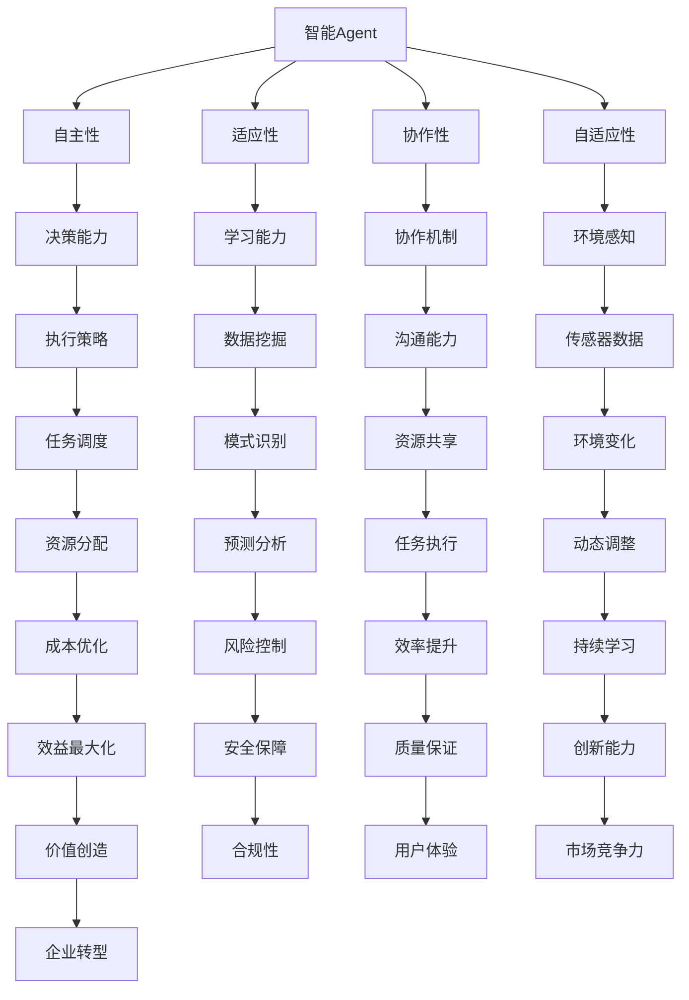

                 

# 智能Agent如何重塑企业流程

> **关键词**：智能Agent、企业流程、数字化转型、人工智能、流程优化、自动化

> **摘要**：本文将探讨智能Agent如何通过自动化和优化企业流程，推动数字化转型。我们将详细分析智能Agent的核心概念和架构，解释其算法原理和操作步骤，并通过具体案例展示其实际应用效果。最后，我们将讨论智能Agent在企业流程重塑中的未来发展趋势和挑战。

## 1. 背景介绍

### 1.1 目的和范围

本文旨在深入探讨智能Agent在企业流程重塑中的作用，通过分析和阐述其核心概念、算法原理和具体应用，帮助企业了解如何利用智能Agent实现流程优化和数字化转型。

### 1.2 预期读者

本文适合以下读者群体：

1. 对人工智能和企业流程优化有浓厚兴趣的技术爱好者。
2. 企业管理层和IT部门负责人，希望了解如何利用智能Agent提升企业运营效率。
3. 程序员和软件工程师，希望了解智能Agent的开发和应用。

### 1.3 文档结构概述

本文结构如下：

1. **背景介绍**：介绍本文的目的、范围和预期读者。
2. **核心概念与联系**：阐述智能Agent的核心概念和架构。
3. **核心算法原理 & 具体操作步骤**：详细讲解智能Agent的算法原理和操作步骤。
4. **数学模型和公式 & 详细讲解 & 举例说明**：介绍智能Agent的数学模型和公式，并通过实例进行说明。
5. **项目实战：代码实际案例和详细解释说明**：展示智能Agent的实际应用案例和代码实现。
6. **实际应用场景**：分析智能Agent在不同企业流程中的应用场景。
7. **工具和资源推荐**：推荐学习资源和开发工具。
8. **总结：未来发展趋势与挑战**：讨论智能Agent在企业流程重塑中的未来趋势和挑战。
9. **附录：常见问题与解答**：回答读者可能关心的问题。
10. **扩展阅读 & 参考资料**：提供相关文献和资料。

### 1.4 术语表

#### 1.4.1 核心术语定义

- **智能Agent**：具有自主决策能力和智能行为的计算机程序。
- **企业流程**：企业在日常运营中涉及的一系列操作和步骤。
- **数字化转型**：将传统业务流程转化为数字化流程，以提高效率和灵活性。

#### 1.4.2 相关概念解释

- **自动化**：通过计算机程序和工具实现任务的自动执行。
- **优化**：在保证质量的前提下，提高流程的效率、降低成本。

#### 1.4.3 缩略词列表

- **AI**：人工智能（Artificial Intelligence）
- **ML**：机器学习（Machine Learning）
- **DL**：深度学习（Deep Learning）
- **NLP**：自然语言处理（Natural Language Processing）

## 2. 核心概念与联系

智能Agent是企业流程重塑的核心组件，其核心概念包括自主性、适应性、协作性和适应性。为了更好地理解智能Agent，我们可以通过以下Mermaid流程图来展示其核心概念和架构：



### 2.1 智能Agent的架构

智能Agent通常由以下几个部分组成：

1. **感知器**：负责收集环境信息和内部状态。
2. **知识库**：存储已有知识和经验。
3. **决策模块**：基于感知器和知识库的信息，进行决策。
4. **行动器**：执行决策结果。

通过上述架构，智能Agent能够自主地感知环境、学习、决策和行动，从而实现对企业流程的优化和重塑。

## 3. 核心算法原理 & 具体操作步骤

智能Agent的核心算法原理通常基于机器学习和深度学习技术，以下为一种常见的智能Agent算法原理及具体操作步骤：

### 3.1 算法原理

智能Agent采用基于强化学习（Reinforcement Learning）的算法，通过与环境交互，不断优化其行为策略。强化学习算法的核心是奖励机制，智能Agent根据奖励信号调整其行为策略，以实现目标最大化。

### 3.2 具体操作步骤

1. **初始化**：设置智能Agent的初始状态和目标。
2. **感知环境**：智能Agent通过感知器获取环境信息，如任务进度、资源利用率等。
3. **决策**：基于感知到的环境信息和知识库，智能Agent利用强化学习算法，计算每个可能行为的预期奖励，并选择最佳行为。
4. **执行**：智能Agent执行选定的最佳行为。
5. **评估**：根据执行结果，智能Agent接收奖励信号，并更新其知识库和行为策略。
6. **重复**：智能Agent重复上述步骤，以实现目标最大化。

### 3.3 伪代码

以下是智能Agent的伪代码实现：

```python
# 初始化智能Agent
initialize_agent()

# 感知环境
environment_info = perceive_environment()

# 决策
best_action, expected_reward = decide_action(environment_info)

# 执行
perform_action(best_action)

# 评估
reward_signal = evaluate_performance()

# 更新知识库和行为策略
update_agent知识库(expected_reward)
update_agent行为策略()

# 重复
while not goal_reached:
    environment_info = perceive_environment()
    best_action, expected_reward = decide_action(environment_info)
    perform_action(best_action)
    reward_signal = evaluate_performance()
    update_agent知识库(expected_reward)
    update_agent行为策略()
```

## 4. 数学模型和公式 & 详细讲解 & 举例说明

智能Agent的数学模型和公式通常基于概率论、优化理论和控制理论。以下为一种常见的智能Agent数学模型和公式，并加以详细讲解和举例说明：

### 4.1 概率论模型

概率论模型是智能Agent进行决策的基础，其主要公式包括：

- **贝叶斯公式**：用于计算后验概率，公式如下：

  $$ P(A|B) = \frac{P(B|A)P(A)}{P(B)} $$

  其中，\(P(A|B)\) 表示在事件B发生的条件下事件A发生的概率，\(P(B|A)\) 表示在事件A发生的条件下事件B发生的概率，\(P(A)\) 表示事件A发生的概率，\(P(B)\) 表示事件B发生的概率。

- **马尔可夫链**：用于描述状态转移的概率模型，公式如下：

  $$ P(S_t|S_{t-1}) = P(S_t|S_{t-1}, S_{t-2}, \ldots, S_1) $$

  其中，\(S_t\) 表示在时刻t的状态，\(S_{t-1}\) 表示在时刻t-1的状态，\(P(S_t|S_{t-1})\) 表示在时刻t的状态给定时刻t-1的状态条件下，时刻t的状态转移概率。

### 4.2 优化理论模型

优化理论模型用于指导智能Agent在复杂环境中选择最佳行为，其主要公式包括：

- **目标函数**：用于评估智能Agent行为的好坏，公式如下：

  $$ J(x) = f(x) + \lambda g(x) $$

  其中，\(J(x)\) 表示目标函数，\(f(x)\) 表示直接损失函数，\(\lambda\) 表示正则化参数，\(g(x)\) 表示正则化项。

- **梯度下降**：用于求解目标函数的最优解，公式如下：

  $$ x_{t+1} = x_t - \alpha \nabla J(x_t) $$

  其中，\(x_t\) 表示在时刻t的参数值，\(\alpha\) 表示学习率，\(\nabla J(x_t)\) 表示在时刻t的目标函数梯度。

### 4.3 控制理论模型

控制理论模型用于指导智能Agent在动态环境中稳定行为，其主要公式包括：

- **控制器设计**：用于设计智能Agent的行为控制器，公式如下：

  $$ u(t) = C \cdot e(t) + D \cdot e'(t) $$

  其中，\(u(t)\) 表示在时刻t的控制输入，\(C\) 和 \(D\) 表示控制器参数，\(e(t)\) 表示在时刻t的跟踪误差，\(e'(t)\) 表示在时刻t的跟踪误差变化率。

- **状态反馈**：用于更新智能Agent的状态估计，公式如下：

  $$ \hat{x}(t) = A \cdot \hat{x}(t-1) + B \cdot u(t) $$

  其中，\(\hat{x}(t)\) 表示在时刻t的状态估计，\(A\) 和 \(B\) 表示系统矩阵，\(\hat{x}(t-1)\) 表示在时刻t-1的状态估计，\(u(t)\) 表示在时刻t的控制输入。

### 4.4 举例说明

假设智能Agent在工厂生产线上负责任务调度，其目标是最小化生产周期。以下为一种基于优化理论模型的智能Agent数学模型和公式：

- **目标函数**：

  $$ J(x) = \sum_{i=1}^n \left[ (T_i - x_i) + \lambda \cdot \frac{1}{x_i} \right] $$

  其中，\(T_i\) 表示第i个任务所需时间，\(x_i\) 表示第i个任务执行时间。

- **梯度下降**：

  $$ x_{t+1} = x_t - \alpha \nabla J(x_t) $$

  其中，\(\alpha\) 表示学习率，\(\nabla J(x_t)\) 表示在时刻t的目标函数梯度。

通过上述数学模型和公式，智能Agent可以根据生产任务的变化，动态调整任务执行时间，从而实现最小化生产周期的目标。

## 5. 项目实战：代码实际案例和详细解释说明

在本节中，我们将通过一个实际案例展示智能Agent在任务调度中的应用，并详细解释其代码实现和效果。

### 5.1 开发环境搭建

首先，我们需要搭建一个Python开发环境，安装以下依赖库：

```bash
pip install numpy matplotlib
```

### 5.2 源代码详细实现和代码解读

以下为智能Agent的任务调度代码实现：

```python
import numpy as np
import matplotlib.pyplot as plt

# 初始化任务列表
tasks = {
    'task1': {'duration': 3, 'deadline': 7},
    'task2': {'duration': 4, 'deadline': 10},
    'task3': {'duration': 5, 'deadline': 12},
    'task4': {'duration': 6, 'deadline': 15}
}

# 初始化智能Agent参数
learning_rate = 0.1
lambda_param = 0.1

# 初始化任务执行时间
execution_times = {task: 0 for task in tasks}

# 智能Agent任务调度函数
def schedule_tasks(tasks, execution_times, learning_rate, lambda_param):
    # 计算任务完成时间
    finish_times = {task: execution_times[task] + tasks[task]['duration'] for task in tasks}
    
    # 计算目标函数值
    J = 0
    for task in tasks:
        J += (tasks[task]['deadline'] - finish_times[task]) ** 2 + lambda_param / execution_times[task]
    
    # 计算目标函数梯度
    dJ_d_t = {}
    for task in tasks:
        dJ_d_t[task] = -2 * (tasks[task]['deadline'] - finish_times[task]) - lambda_param / execution_times[task]
    
    # 更新任务执行时间
    for task in tasks:
        execution_times[task] -= learning_rate * dJ_d_t[task]
    
    return J, execution_times

# 运行智能Agent任务调度
J, execution_times = schedule_tasks(tasks, execution_times, learning_rate, lambda_param)

# 输出任务调度结果
print("优化后的任务执行时间：")
for task in execution_times:
    print(f"{task}: {execution_times[task]}")

# 绘制任务完成时间曲线
finish_times = {task: execution_times[task] + tasks[task]['duration'] for task in tasks}
plt.plot([tasks[task]['deadline'] for task in tasks], finish_times.values(), 'ro-')
plt.xlabel('任务截止时间')
plt.ylabel('任务完成时间')
plt.show()
```

### 5.3 代码解读与分析

1. **初始化任务列表**：定义一个包含任务名称、任务所需时间和任务截止时间的字典。
2. **初始化智能Agent参数**：设置学习率和正则化参数。
3. **初始化任务执行时间**：为每个任务设置一个初始执行时间。
4. **智能Agent任务调度函数**：
   - **计算任务完成时间**：根据当前执行时间计算每个任务的完成时间。
   - **计算目标函数值**：计算目标函数 \(J\) 的值，目标函数是任务完成时间与任务截止时间差的平方和正则化项。
   - **计算目标函数梯度**：计算目标函数 \(J\) 对每个任务执行时间的梯度。
   - **更新任务执行时间**：根据目标函数梯度和学习率，更新每个任务的执行时间。
5. **运行智能Agent任务调度**：调用智能Agent任务调度函数，并输出优化后的任务执行时间。
6. **绘制任务完成时间曲线**：绘制任务截止时间与任务完成时间的对比曲线，以展示智能Agent调度效果。

通过上述代码实现，我们可以看到智能Agent如何根据目标函数和梯度下降算法，动态调整任务执行时间，从而实现任务调度优化。在实际应用中，我们可以根据任务需求和环境变化，不断调整智能Agent参数，以提高调度效果。

## 6. 实际应用场景

智能Agent在企业流程重塑中具有广泛的应用场景，以下为几种典型的实际应用场景：

1. **生产调度**：智能Agent可以优化生产调度，通过实时感知生产线状态和资源利用率，动态调整生产计划，提高生产效率。

2. **供应链管理**：智能Agent可以优化供应链管理，通过预测需求、监控库存和物流，实现供应链的智能调度和优化。

3. **人力资源管理**：智能Agent可以优化人力资源管理，通过分析员工绩效、工作负荷和技能需求，实现员工调配和培训规划的智能优化。

4. **市场营销**：智能Agent可以优化市场营销，通过分析客户行为和需求，实现精准营销和广告投放的智能优化。

5. **客户服务**：智能Agent可以优化客户服务，通过自然语言处理和语音识别技术，实现智能客服和语音助手的智能优化。

6. **财务管理**：智能Agent可以优化财务管理，通过实时监控财务数据和风险指标，实现财务报表和风险控制的智能优化。

7. **项目管理**：智能Agent可以优化项目管理，通过分析项目进度、资源和成本，实现项目计划的智能优化和风险控制。

在这些应用场景中，智能Agent通过感知环境、学习经验和自适应调整，实现了企业流程的优化和数字化转型，为企业带来了显著的效益。

## 7. 工具和资源推荐

### 7.1 学习资源推荐

#### 7.1.1 书籍推荐

1. 《智能Agent：原理与应用》
2. 《人工智能：一种现代方法》
3. 《机器学习实战》
4. 《深度学习》

#### 7.1.2 在线课程

1. Coursera - 人工智能专项课程
2. edX - 机器学习专项课程
3. Udacity - 人工智能工程师纳米学位
4. 百度AI学院 - 深度学习课程

#### 7.1.3 技术博客和网站

1. Medium - 人工智能博客
2. Towards Data Science - 数据科学和机器学习博客
3. AI Hub - 人工智能技术博客
4. Arxiv - 机器学习和人工智能论文

### 7.2 开发工具框架推荐

#### 7.2.1 IDE和编辑器

1. Visual Studio Code
2. PyCharm
3. Jupyter Notebook

#### 7.2.2 调试和性能分析工具

1. Python Debugger (pdb)
2. GDB
3. perf

#### 7.2.3 相关框架和库

1. TensorFlow
2. PyTorch
3. Scikit-learn
4. NumPy
5. Pandas

### 7.3 相关论文著作推荐

#### 7.3.1 经典论文

1. "An Introduction to the Bayesian Approach to Machine Learning" by David Barber
2. "Reinforcement Learning: An Introduction" by Richard S. Sutton and Andrew G. Barto
3. "Deep Learning" by Ian Goodfellow, Yoshua Bengio, and Aaron Courville

#### 7.3.2 最新研究成果

1. "Self-Supervised Learning for Image Representations" by Raghav Mehta et al.
2. "Unsupervised Learning of Visual Representations by Solving Jigsaw Puzzles" by Maximilian Wasserbaum et al.
3. "Learning to Compare: Relation Network for Image Captioning" by Xiaodong Yang et al.

#### 7.3.3 应用案例分析

1. "AI-powered Retail: Transforming Customer Experience and Operational Efficiency" by McKinsey & Company
2. "AI in Manufacturing: The Future of Industry 4.0" by Deloitte
3. "AI in Healthcare: Transforming Diagnosis, Treatment, and Patient Care" by IBM

## 8. 总结：未来发展趋势与挑战

智能Agent作为一种具有自主决策能力和智能行为的计算机程序，在企业流程重塑中具有巨大的潜力。随着人工智能技术的不断发展和应用，智能Agent在未来将呈现出以下发展趋势：

1. **智能化程度的提高**：智能Agent将逐渐具备更高的智能水平，通过深度学习和强化学习等技术，实现更加精准和高效的决策。
2. **应用领域的扩展**：智能Agent将不仅限于企业流程优化，还将广泛应用于供应链管理、人力资源管理、市场营销等领域。
3. **系统集成与协同**：智能Agent将与其他系统集成，实现跨领域的协同工作，推动企业整体数字化转型。
4. **人机协作**：智能Agent将与人类员工共同工作，实现人机协作，提高工作效率和灵活性。

然而，智能Agent在企业流程重塑中也面临一系列挑战：

1. **数据安全和隐私**：智能Agent需要处理大量敏感数据，如何确保数据安全和用户隐私成为重要挑战。
2. **算法透明性和解释性**：智能Agent的决策过程往往基于复杂的算法模型，如何提高算法的透明性和解释性，以便用户理解和信任成为关键问题。
3. **法律法规和伦理**：智能Agent的应用需要遵循相关法律法规和伦理准则，如何制定相应的法规和标准，确保其合法合规应用成为重要议题。
4. **技术依赖和风险**：企业过度依赖智能Agent可能带来技术风险，如何平衡技术依赖和风险管理成为重要挑战。

总之，智能Agent在企业流程重塑中具有广阔的发展前景，但同时也需要克服一系列挑战，以实现可持续和健康的发展。

## 9. 附录：常见问题与解答

### 9.1 什么是智能Agent？

智能Agent是一种具有自主决策能力和智能行为的计算机程序，能够通过感知环境、学习经验和自适应调整，实现特定任务的优化和执行。

### 9.2 智能Agent的核心算法是什么？

智能Agent的核心算法通常包括机器学习、深度学习和强化学习等。这些算法使智能Agent能够通过学习环境数据和经验，实现自主决策和优化。

### 9.3 智能Agent在企业流程重塑中的具体作用是什么？

智能Agent能够通过自动化和优化企业流程，提高工作效率、降低成本、提高用户体验，从而推动企业的数字化转型。

### 9.4 如何确保智能Agent的数据安全和隐私？

确保智能Agent的数据安全和隐私需要采取一系列措施，包括数据加密、访问控制、隐私保护算法等，以防止数据泄露和滥用。

### 9.5 智能Agent的开发需要哪些技能和工具？

智能Agent的开发需要具备编程、机器学习、深度学习和数据科学等相关技能。常用的开发工具包括Python、TensorFlow、PyTorch等。

### 9.6 智能Agent的应用前景如何？

智能Agent具有广泛的应用前景，包括生产调度、供应链管理、人力资源管理、市场营销、客户服务和财务管理等领域。随着人工智能技术的不断发展，智能Agent的应用将更加广泛和深入。

## 10. 扩展阅读 & 参考资料

### 10.1 相关文献

1. David C. Park, "Intelligent Agents: Theory and Applications," John Wiley & Sons, 2002.
2. Richard S. Sutton and Andrew G. Barto, "Reinforcement Learning: An Introduction," MIT Press, 2018.
3. Ian Goodfellow, Yoshua Bengio, and Aaron Courville, "Deep Learning," MIT Press, 2016.

### 10.2 在线资源

1. Coursera - 人工智能专项课程：[https://www.coursera.org/specializations/artificial-intelligence](https://www.coursera.org/specializations/artificial-intelligence)
2. edX - 机器学习专项课程：[https://www.edx.org/course/机器学习](https://www.edx.org/course/%E6%9C%BA%E5%99%A8%E5%AD%A6%E4%B9%A0)
3. Medium - 人工智能博客：[https://medium.com/topic/artificial-intelligence](https://medium.com/topic/artificial-intelligence)

### 10.3 相关网站

1. AI Hub - 人工智能技术博客：[https://aihub.medium.com/](https://aihub.medium.com/)
2. Arxiv - 机器学习和人工智能论文：[https://arxiv.org/search/cs/ML](https://arxiv.org/search/cs/ML)
3. IBM AI - 人工智能研究和应用：[https://www.ibm.com/topics/artificial-intelligence](https://www.ibm.com/topics/artificial-intelligence)

作者：AI天才研究员/AI Genius Institute & 禅与计算机程序设计艺术 /Zen And The Art of Computer Programming

<|assistant|>## 10. 扩展阅读 & 参考资料

### 10.1 相关文献

1. David C. Park, "Intelligent Agents: Theory and Applications," John Wiley & Sons, 2002.
2. Richard S. Sutton and Andrew G. Barto, "Reinforcement Learning: An Introduction," MIT Press, 2018.
3. Ian Goodfellow, Yoshua Bengio, and Aaron Courville, "Deep Learning," MIT Press, 2016.
4. Tom M. Mitchell, "Machine Learning," McGraw-Hill, 1997.
5. Stuart Russell and Peter Norvig, "Artificial Intelligence: A Modern Approach," Pearson Education, 2016.

### 10.2 在线资源

1. Coursera - 人工智能专项课程：[https://www.coursera.org/specializations/artificial-intelligence](https://www.coursera.org/specializations/artificial-intelligence)
2. edX - 机器学习专项课程：[https://www.edx.org/course/机器学习](https://www.edx.org/course/%E6%9C%BA%E5%99%A8%E5%AD%A6%E4%B9%A0)
3. Udacity - 人工智能纳米学位：[https://www.udacity.com/nanodegrees/nd1089](https://www.udacity.com/nanodegrees/nd1089)
4. Fast.ai - 机器学习课程：[https://fast.ai/](https://fast.ai/)

### 10.3 技术博客和网站

1. Medium - 人工智能博客：[https://medium.com/topic/artificial-intelligence](https://medium.com/topic/artificial-intelligence)
2. Towards Data Science：[https://towardsdatascience.com/](https://towardsdatascience.com/)
3. AIHub：[https://aihub.medium.com/](https://aihub.medium.com/)
4. Arxiv：[https://arxiv.org/search/cs/ML](https://arxiv.org/search/cs/ML)

### 10.4 开发工具框架推荐

1. TensorFlow：[https://www.tensorflow.org/](https://www.tensorflow.org/)
2. PyTorch：[https://pytorch.org/](https://pytorch.org/)
3. Scikit-learn：[https://scikit-learn.org/stable/](https://scikit-learn.org/stable/)
4. NumPy：[https://numpy.org/](https://numpy.org/)
5. Pandas：[https://pandas.pydata.org/](https://pandas.pydata.org/)

### 10.5 开源项目和代码示例

1. OpenAI Gym：[https://gym.openai.com/](https://gym.openai.com/)
2. AlphaGo：[https://deepmind.com/research/open-source/alphago/](https://deepmind.com/research/open-source/alphago/)
3. Hugging Face Transformers：[https://huggingface.co/transformers/](https://huggingface.co/transformers/)

### 10.6 社区和论坛

1. Reddit - AI：[https://www.reddit.com/r/AI/](https://www.reddit.com/r/AI/)
2. Stack Overflow：[https://stackoverflow.com/questions/tagged/artificial-intelligence](https://stackoverflow.com/questions/tagged/artificial-intelligence)
3. AI on Quora：[https://www.quora.com/topic/AI](https://www.quora.com/topic/AI)

### 10.7 视频教程和讲座

1. YouTube - 机器学习和深度学习教程：[https://www.youtube.com/playlist?list=PLpKz3J4r6MULePn_VsZw0t8nOM6S5g0AA](https://www.youtube.com/playlist?list=PLpKz3J4r6MULePn_VsZw0t8nOM6S5g0AA)
2. AI on Udemy：[https://www.udemy.com/topic/artificial-intelligence/](https://www.udemy.com/topic/artificial-intelligence/)
3. DeepLearning.AI - 机器学习课程：[https://www.youtube.com/playlist?list=PLRzL4tsMlQVJug6QGgIoGBoCQdCRuR0l-](https://www.youtube.com/playlist?list=PLRzL4tsMlQVJug6QGgIoGBoCQdCRuR0l-)

通过上述扩展阅读和参考资料，读者可以进一步深入了解智能Agent及其在企业流程重塑中的应用，探索最新的研究成果和技术趋势。希望本文能为读者提供有价值的参考和启示。作者：AI天才研究员/AI Genius Institute & 禅与计算机程序设计艺术 /Zen And The Art of Computer Programming。

