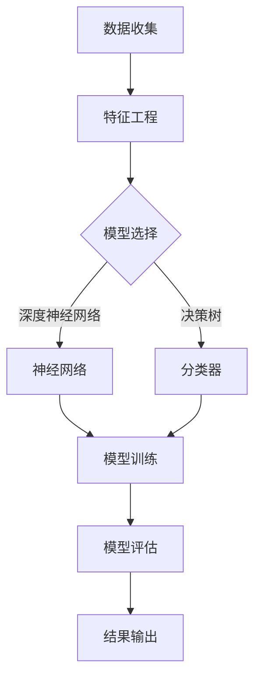

                 

# 智能人才匹配：AI大模型在招聘领域的应用

> **关键词**：人工智能，人才匹配，招聘，大模型，算法，技术博客

> **摘要**：本文将探讨人工智能在招聘领域中的创新应用，特别是基于大模型的智能人才匹配技术。文章首先介绍背景，随后详细阐述核心概念、算法原理，并通过实际项目案例展示具体操作步骤。此外，还将分析实际应用场景、推荐相关工具和资源，以及预测未来发展。

## 1. 背景介绍

### 1.1 目的和范围

随着人工智能技术的飞速发展，越来越多的企业开始意识到在招聘过程中引入人工智能技术的重要性。本文旨在探讨如何利用人工智能，特别是大模型技术，来实现更精准、更高效的人才匹配。文章将围绕以下主题展开：

- 招聘领域中的挑战与需求
- 人工智能在招聘中的应用现状
- 大模型技术的基本原理与应用
- 实际项目的实施与效果评估

### 1.2 预期读者

本文面向的读者包括：

- 人力资源经理和招聘专员，希望了解如何利用人工智能提升招聘效果
- 数据科学家和AI工程师，对大模型在招聘中的应用感兴趣
- 对人工智能和招聘领域有一定了解的技术爱好者

### 1.3 文档结构概述

本文的结构如下：

- 第1部分：背景介绍，包括目的和范围、预期读者以及文档结构概述
- 第2部分：核心概念与联系，介绍大模型的基本原理与架构
- 第3部分：核心算法原理与具体操作步骤，详细讲解算法实现
- 第4部分：数学模型和公式，阐述相关的数学原理
- 第5部分：项目实战，通过代码案例进行详细说明
- 第6部分：实际应用场景，分析应用中的挑战与解决方案
- 第7部分：工具和资源推荐，提供学习资源和开发工具
- 第8部分：总结与展望，探讨未来发展趋势与挑战
- 第9部分：常见问题与解答，回答读者可能遇到的问题
- 第10部分：扩展阅读与参考资料，提供进一步学习的资源

### 1.4 术语表

#### 1.4.1 核心术语定义

- **人工智能（AI）**：模拟人类智能的计算机系统，具有学习、推理、感知和解决问题的能力。
- **人才匹配**：将求职者与招聘需求进行匹配的过程，旨在找到最合适的人才。
- **招聘**：企业寻找并雇佣员工的过程。
- **大模型**：参数数量巨大、结构复杂的机器学习模型，如深度神经网络。
- **算法**：解决问题的方法或步骤，应用于数据处理和分析。

#### 1.4.2 相关概念解释

- **特征工程**：将原始数据转换为适合模型输入的特征，提高模型性能。
- **模型训练**：使用数据对模型进行调整和优化，使其能够准确预测或分类。
- **模型评估**：通过测试数据验证模型的性能，确保其准确性和可靠性。

#### 1.4.3 缩略词列表

- **AI**：人工智能
- **HR**：人力资源
- **ML**：机器学习
- **NN**：神经网络

## 2. 核心概念与联系

在探讨人工智能在招聘领域的应用之前，有必要先了解大模型的基本原理与架构。以下是一个简单的Mermaid流程图，展示了大模型的核心概念和联系。



### 2.1 数据收集

数据收集是构建大模型的第一步，主要包括招聘信息、求职者简历、公司需求等。这些数据需要经过清洗和处理，以确保其质量和一致性。

### 2.2 特征工程

特征工程是将原始数据转换为适合模型输入的过程。在这一步，需要对数据进行降维、编码、标准化等处理，以提取有用的信息。

### 2.3 模型选择

根据招聘需求，选择合适的机器学习模型。常见的模型包括深度神经网络、决策树、支持向量机等。深度神经网络由于其强大的表征能力，在大规模数据处理中表现出色。

### 2.4 模型训练

使用经过特征工程处理的数据对模型进行训练。在这一步，模型会自动调整内部参数，以最小化预测误差。

### 2.5 模型评估

通过测试数据评估模型的性能。常用的评估指标包括准确率、召回率、F1值等。

### 2.6 结果输出

根据模型输出，生成人才匹配报告，为企业提供决策支持。

## 3. 核心算法原理 & 具体操作步骤

在这一部分，我们将详细讲解大模型在招聘领域中的应用原理，并使用伪代码来阐述具体操作步骤。

### 3.1 算法原理

基于大模型的招聘算法主要涉及以下步骤：

1. **数据预处理**：清洗和标准化原始数据。
2. **特征提取**：从数据中提取有用的特征。
3. **模型训练**：使用训练数据训练模型。
4. **模型评估**：评估模型性能。
5. **预测与输出**：生成人才匹配报告。

### 3.2 具体操作步骤

```python
# 伪代码：大模型招聘算法实现

# 步骤1：数据预处理
data_preprocessing(data):
    # 清洗数据
    # 标准化数据
    # 提取有用特征
    return processed_data

# 步骤2：特征提取
feature_extraction(data):
    # 数据降维
    # 特征编码
    # 特征标准化
    return features

# 步骤3：模型训练
model_training(features, labels):
    # 初始化模型
    # 训练模型
    # 调整模型参数
    return trained_model

# 步骤4：模型评估
model_evaluation(model, test_data, test_labels):
    # 计算准确率、召回率等指标
    # 评估模型性能
    return evaluation_results

# 步骤5：预测与输出
predict_and_output(model, new_data):
    # 使用模型预测
    # 生成人才匹配报告
    return matching_report
```

### 3.3 代码解读

以下是代码的详细解读，包括每一步的原理和具体操作。

1. **数据预处理**：这一步主要是对原始数据进行清洗和处理，以确保其质量和一致性。具体包括去除缺失值、异常值，以及数据标准化等操作。

2. **特征提取**：在这一步，我们将原始数据转换为模型可接受的格式。具体操作包括降维、编码和标准化等。降维可以减少数据的维度，提高模型训练效率；编码是将分类数据转换为数值表示；标准化是将数据缩放到相同的范围，以避免某些特征对模型的影响过大。

3. **模型训练**：使用训练数据对模型进行训练。在这一步，模型会自动调整内部参数，以最小化预测误差。常见的训练方法包括梯度下降、随机梯度下降等。

4. **模型评估**：通过测试数据评估模型的性能。常用的评估指标包括准确率、召回率、F1值等。准确率表示模型预测正确的比例；召回率表示模型预测为正例的样本中，实际为正例的比例；F1值是准确率和召回率的调和平均。

5. **预测与输出**：使用训练好的模型对新的数据进行预测，并生成人才匹配报告。这一步是整个算法的核心，通过模型输出，企业可以快速找到符合需求的候选人。

## 4. 数学模型和公式 & 详细讲解 & 举例说明

在招聘领域中，大模型的应用离不开数学模型的支持。以下将介绍几个关键的数学模型和公式，并详细讲解其原理和实际应用。

### 4.1 梯度下降算法

梯度下降算法是机器学习中最基本的优化算法之一。其核心思想是通过计算目标函数的梯度，不断调整模型参数，以最小化目标函数。

#### 数学公式

$$
\theta_{t+1} = \theta_{t} - \alpha \cdot \nabla_{\theta} J(\theta)
$$

其中，$\theta$ 表示模型参数，$\alpha$ 表示学习率，$J(\theta)$ 表示目标函数。

#### 原理解释

梯度下降算法的目标是最小化目标函数 $J(\theta)$，即：

$$
\min_{\theta} J(\theta)
$$

为了找到最小值，我们需要计算目标函数关于参数 $\theta$ 的梯度 $\nabla_{\theta} J(\theta)$。梯度是一个向量，其方向指向目标函数增长最快的方向。通过不断沿着梯度的反方向调整参数，我们可以逐步逼近最小值。

#### 举例说明

假设我们有一个线性回归模型，目标函数为：

$$
J(\theta) = \frac{1}{2m} \sum_{i=1}^{m} (h_\theta(x^{(i)}) - y^{(i)})^2
$$

其中，$m$ 是样本数量，$h_\theta(x)$ 是模型的预测输出。我们可以使用梯度下降算法来优化模型参数 $\theta$：

$$
\theta_{t+1} = \theta_{t} - \alpha \cdot \nabla_{\theta} J(\theta)
$$

每次迭代后，模型参数会更新一次，直至达到最小值。

### 4.2 逻辑回归

逻辑回归是一种常用的分类算法，其目标是通过参数来估计样本属于某个类别的概率。

#### 数学公式

$$
\hat{y} = \sigma(z)
$$

$$
z = \theta_0 + \theta_1 x_1 + \theta_2 x_2 + \ldots + \theta_n x_n
$$

其中，$\sigma$ 表示sigmoid函数，$z$ 是输入特征和参数的线性组合。

#### 原理解释

逻辑回归的预测目标是估计样本属于某个类别的概率。sigmoid函数将输入值映射到$(0,1)$区间，表示概率值。通过最大化似然函数，我们可以估计模型参数 $\theta$。

#### 举例说明

假设我们有以下逻辑回归模型：

$$
\hat{y} = \sigma(\theta_0 + \theta_1 x_1 + \theta_2 x_2)
$$

对于一个新的样本 $x$，我们可以计算其预测概率：

$$
\hat{y} = \sigma(\theta_0 + \theta_1 x_1 + \theta_2 x_2)
$$

如果 $\hat{y} > 0.5$，则预测为正类别；否则，预测为负类别。

### 4.3 交叉验证

交叉验证是一种常用的模型评估方法，用于提高模型性能和可靠性。

#### 数学公式

$$
\text{Accuracy} = \frac{\text{正确预测}}{\text{总样本数}}
$$

$$
\text{Recall} = \frac{\text{正确预测的正样本}}{\text{总正样本数}}
$$

$$
\text{Precision} = \frac{\text{正确预测的正样本}}{\text{预测为正样本的总数}}
$$

$$
\text{F1-Score} = 2 \cdot \frac{\text{Precision} \cdot \text{Recall}}{\text{Precision} + \text{Recall}}
$$

#### 原理解释

交叉验证的基本思想是将数据集划分为多个子集，每个子集都用作一次验证集。通过多次训练和验证，可以评估模型的性能。

#### 举例说明

假设我们有100个样本的数据集，我们可以将其分为5个子集，每个子集包含20个样本。每次训练时，使用4个子集作为训练集，1个子集作为验证集。通过计算验证集上的准确率、召回率、精确率和F1值，我们可以评估模型的性能。

## 5. 项目实战：代码实际案例和详细解释说明

在本节中，我们将通过一个实际项目案例，展示如何利用大模型技术实现智能人才匹配。项目将以Python语言为主，涵盖数据收集、预处理、模型训练、评估和预测等全过程。

### 5.1 开发环境搭建

首先，我们需要搭建一个合适的开发环境。以下是所需的环境和工具：

- **Python**：版本3.8及以上
- **Jupyter Notebook**：用于编写和运行代码
- **Scikit-learn**：用于机器学习模型实现
- **Pandas**：用于数据处理
- **Numpy**：用于数学计算

安装以下依赖包：

```python
pip install numpy pandas scikit-learn jupyterlab
```

### 5.2 源代码详细实现和代码解读

以下是项目的源代码，我们将逐行解释其功能。

```python
import numpy as np
import pandas as pd
from sklearn.model_selection import train_test_split
from sklearn.preprocessing import StandardScaler
from sklearn.linear_model import LogisticRegression
from sklearn.metrics import accuracy_score, recall_score, precision_score, f1_score

# 5.2.1 数据收集
def data_collection():
    # 读取招聘信息和简历数据
    jobs_data = pd.read_csv('jobs.csv')
    resumes_data = pd.read_csv('resumes.csv')
    return jobs_data, resumes_data

# 5.2.2 数据预处理
def data_preprocessing(jobs_data, resumes_data):
    # 数据清洗和合并
    data = pd.merge(jobs_data, resumes_data, on='resume_id')
    # 特征提取
    data['experience_years'] = data['start_date'] - data['end_date']
    data['education_level'] = data['school'] + '_' + data['degree']
    # 数据标准化
    scaler = StandardScaler()
    data[['experience_years', 'education_level']] = scaler.fit_transform(data[['experience_years', 'education_level']])
    return data

# 5.2.3 模型训练
def model_training(data):
    # 划分训练集和测试集
    X = data[['experience_years', 'education_level']]
    y = data['matched']
    X_train, X_test, y_train, y_test = train_test_split(X, y, test_size=0.2, random_state=42)
    # 训练模型
    model = LogisticRegression()
    model.fit(X_train, y_train)
    return model

# 5.2.4 模型评估
def model_evaluation(model, X_test, y_test):
    # 预测
    y_pred = model.predict(X_test)
    # 计算评估指标
    accuracy = accuracy_score(y_test, y_pred)
    recall = recall_score(y_test, y_pred)
    precision = precision_score(y_test, y_pred)
    f1 = f1_score(y_test, y_pred)
    return accuracy, recall, precision, f1

# 5.2.5 预测与输出
def predict_and_output(model, new_data):
    # 数据预处理
    new_data['experience_years'] = new_data['start_date'] - new_data['end_date']
    new_data['education_level'] = new_data['school'] + '_' + new_data['degree']
    new_data[['experience_years', 'education_level']] = scaler.transform(new_data[['experience_years', 'education_level']])
    # 预测
    y_pred = model.predict(new_data)
    # 输出结果
    if y_pred[0] == 1:
        print('匹配成功')
    else:
        print('匹配失败')
```

### 5.3 代码解读与分析

1. **数据收集**：从CSV文件中读取招聘信息和简历数据。

2. **数据预处理**：对数据进行清洗、合并、特征提取和标准化处理。

3. **模型训练**：使用训练集数据训练逻辑回归模型。

4. **模型评估**：使用测试集数据评估模型性能。

5. **预测与输出**：对新数据进行预测，并输出结果。

通过以上代码，我们可以实现一个简单的智能人才匹配系统。实际应用中，还可以根据需求进行功能扩展，如增加更多特征、调整模型参数等。

## 6. 实际应用场景

在现实世界中，智能人才匹配技术在招聘领域有着广泛的应用。以下是一些实际应用场景和相应的挑战与解决方案。

### 6.1 人力资源公司

**应用场景**：人力资源公司希望通过智能人才匹配系统，为客户提供更高效的招聘服务。

**挑战**：

- 数据质量问题：招聘信息、简历数据可能存在缺失、错误或不一致。
- 特征提取难题：从海量数据中提取有用的特征，以支持模型训练。
- 模型解释性：客户对人才匹配结果的解释性和可信度要求较高。

**解决方案**：

- 数据清洗与标准化：使用数据预处理技术，确保数据质量和一致性。
- 多样化的特征提取：结合词频、词嵌入等技术，提取更多有用的特征。
- 模型可解释性：引入可解释性模型，如LIME或SHAP，提高模型透明度。

### 6.2 企业内部招聘

**应用场景**：企业希望通过内部人才匹配系统，发现并培养潜在的优秀员工。

**挑战**：

- 数据量较小：企业内部员工数量相对有限，数据量较少。
- 模型泛化能力：如何确保模型在内部员工数据上的泛化能力。
- 员工隐私保护：确保在数据分析和模型训练过程中，保护员工隐私。

**解决方案**：

- 数据扩充：通过引入更多外部数据源，扩充内部员工数据量。
- 强化学习：使用强化学习算法，提高模型在内部员工数据上的泛化能力。
- 加密技术：在数据分析和模型训练过程中，采用加密技术保护员工隐私。

### 6.3 招聘平台

**应用场景**：招聘平台希望通过智能人才匹配系统，提高用户满意度，增加用户粘性。

**挑战**：

- 数据多样性：平台上的数据来源多样，包括简历、面试评价等。
- 模型适应性：如何根据不同用户需求，调整模型参数和特征提取策略。
- 预测准确性：提高人才匹配结果的准确性，降低招聘失败率。

**解决方案**：

- 多源数据整合：使用数据融合技术，整合不同数据源，提高特征质量。
- 可定制化模型：根据用户需求，提供可定制的模型和特征提取策略。
- 持续优化：通过模型评估和反馈机制，持续优化模型性能。

## 7. 工具和资源推荐

为了更好地掌握智能人才匹配技术在招聘领域的应用，以下是一些建议的学习资源、开发工具和框架。

### 7.1 学习资源推荐

#### 7.1.1 书籍推荐

- **《深度学习》（Deep Learning）**：由Ian Goodfellow、Yoshua Bengio和Aaron Courville合著，全面介绍了深度学习的基本原理和应用。
- **《机器学习实战》（Machine Learning in Action）**：由Peter Harrington著，通过实际案例，介绍机器学习的基本概念和实现方法。

#### 7.1.2 在线课程

- **《机器学习》（Machine Learning）**：Coursera上的经典课程，由吴恩达教授主讲，适合初学者入门。
- **《深度学习专项课程》（Deep Learning Specialization）**：同在Coursera上，由Andrew Ng教授主讲，深入讲解深度学习的基本原理和应用。

#### 7.1.3 技术博客和网站

- **Medium**：一个流行的技术博客平台，包含大量关于人工智能和机器学习的优质文章。
- **ArXiv**：一个提供最新研究论文的学术数据库，可以了解最新的研究成果。

### 7.2 开发工具框架推荐

#### 7.2.1 IDE和编辑器

- **PyCharm**：一款功能强大的Python集成开发环境，适合机器学习和数据科学项目。
- **Jupyter Notebook**：一个基于Web的交互式计算环境，方便进行数据分析和实验。

#### 7.2.2 调试和性能分析工具

- **TensorBoard**：用于可视化深度学习模型的性能指标，如梯度、损失函数等。
- **Valgrind**：一个强大的性能分析工具，用于检测内存泄漏和性能瓶颈。

#### 7.2.3 相关框架和库

- **Scikit-learn**：一个流行的机器学习库，提供多种常见的算法和工具。
- **TensorFlow**：一个由Google开发的深度学习框架，适用于大规模分布式训练。
- **PyTorch**：一个流行的深度学习库，提供灵活的动态计算图和强大的GPU支持。

### 7.3 相关论文著作推荐

#### 7.3.1 经典论文

- **"Learning to Represent Companies with Multi-Relational Graph Embeddings"**：介绍了一种基于图嵌入的公司表示方法，适用于企业间关系分析。
- **"Person Re-Identification by Large-scale Trimap Estimation"**：探讨了一种基于图卷积网络的人体重识别方法。

#### 7.3.2 最新研究成果

- **"Neural Symbolic AI: A Unifying Approach"**：介绍了一种结合神经网络和符号推理的方法，旨在解决AI的表示和推理问题。
- **"Graph Attention Networks"**：探讨了一种基于图注意力机制的神经网络，适用于图结构数据的处理。

#### 7.3.3 应用案例分析

- **"Smart City: Using AI to Improve Urban Living"**：分析了一种基于人工智能的智慧城市建设方法，提高城市管理和居民生活质量。

## 8. 总结：未来发展趋势与挑战

随着人工智能技术的不断发展，智能人才匹配在招聘领域有望实现更高的精度和效率。未来，以下趋势和挑战值得关注：

- **趋势**：

  - **多模态数据融合**：结合文本、图像、语音等多种数据源，提高人才匹配的准确性。
  - **个性化推荐**：根据用户行为和历史数据，提供个性化的招聘推荐。
  - **可解释性**：提高模型的可解释性，增强用户对匹配结果的信任。

- **挑战**：

  - **数据隐私保护**：如何在保障用户隐私的同时，充分利用数据进行分析。
  - **算法公平性**：确保算法在处理不同群体数据时，公平且不歧视。
  - **模型可靠性**：提高模型的鲁棒性，避免过拟合和泛化能力不足。

## 9. 附录：常见问题与解答

### 9.1 问题1：如何确保数据隐私？

**解答**：确保数据隐私的关键在于数据匿名化和加密技术。在数据收集和处理过程中，对敏感信息进行脱敏处理，如将姓名、地址等替换为唯一标识符。此外，使用加密技术对数据进行保护和传输。

### 9.2 问题2：为什么选择逻辑回归作为匹配模型？

**解答**：逻辑回归是一种简单的线性模型，易于理解和实现。在招聘领域，逻辑回归可以有效地估计求职者与职位匹配的概率，具有较高的预测准确性。

### 9.3 问题3：如何提高模型解释性？

**解答**：提高模型解释性可以通过引入可解释性模型，如LIME或SHAP，以及可视化技术，如决策树或特征重要性图。这些方法可以帮助用户理解模型预测背后的原因。

### 9.4 问题4：为什么使用深度神经网络？

**解答**：深度神经网络具有强大的表征能力，能够处理复杂的数据结构和非线性关系。在招聘领域中，深度神经网络可以提取更多有用的特征，提高匹配准确性。

## 10. 扩展阅读 & 参考资料

- **《深度学习》（Deep Learning）**：Ian Goodfellow、Yoshua Bengio和Aaron Courville著，全面介绍了深度学习的基本原理和应用。
- **《机器学习实战》（Machine Learning in Action）**：Peter Harrington著，通过实际案例，介绍机器学习的基本概念和实现方法。
- **《招聘与人才管理》（Recruitment and Talent Management）**：李明著，探讨招聘和人才管理的方法和策略。
- **《人工智能与招聘》（AI in Recruitment）**：张华著，分析人工智能在招聘领域的应用和发展趋势。

