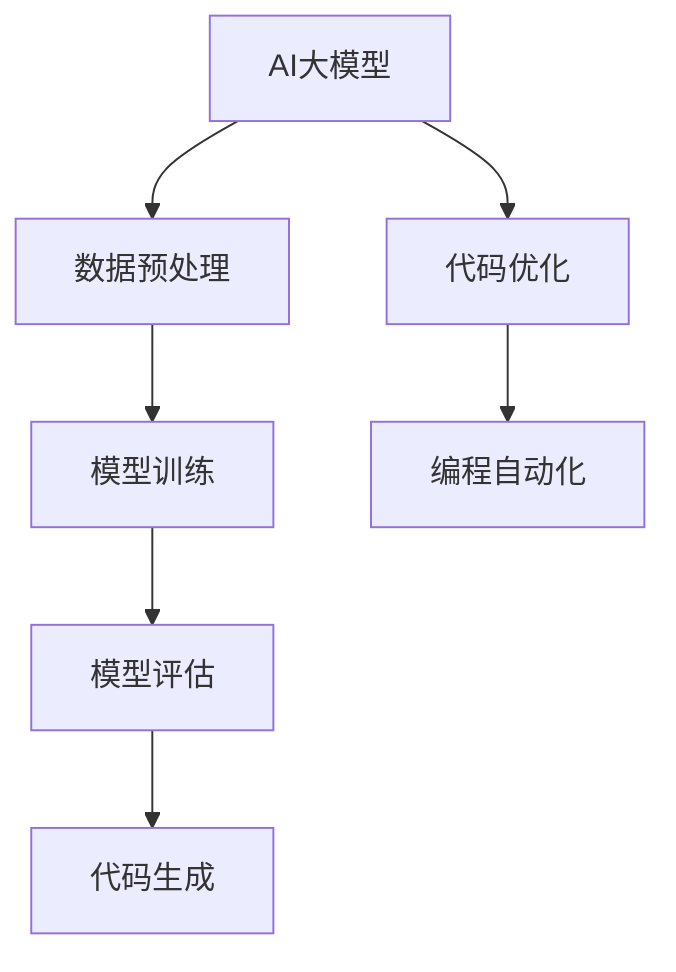

                 

# 智能代码生成：AI大模型在软件开发中的应用

> **关键词：** 智能代码生成，AI大模型，软件开发，代码优化，编程自动化

> **摘要：** 本文深入探讨了人工智能（AI）大模型在软件开发中的应用，特别是智能代码生成的技术。文章从背景介绍、核心概念与联系、算法原理及数学模型、项目实战、实际应用场景等多个角度，详细阐述了智能代码生成的工作原理及其在软件开发中的优势。本文旨在为开发者提供关于AI在软件开发中应用的前沿技术和实用方法。

## 1. 背景介绍

### 1.1 目的和范围

本文的目标是探讨如何利用AI大模型实现智能代码生成，并分析其在软件开发中的应用和优势。我们将首先介绍AI大模型的基本原理，然后详细阐述智能代码生成技术的工作机制，并分析其在软件开发中的具体应用场景。通过本文的阅读，读者可以了解AI大模型如何改变传统的软件开发模式，提高开发效率和代码质量。

### 1.2 预期读者

本文适用于对AI和软件开发有一定了解的开发者、研究者以及感兴趣的技术爱好者。预期读者应具备基础的编程知识，并对AI技术在软件开发中的应用有所关注。

### 1.3 文档结构概述

本文分为以下几个部分：

- 背景介绍：介绍智能代码生成的背景、目的和范围。
- 核心概念与联系：讨论AI大模型和智能代码生成的基本原理和架构。
- 核心算法原理 & 具体操作步骤：详细讲解智能代码生成的算法原理和操作步骤。
- 数学模型和公式 & 详细讲解 & 举例说明：阐述智能代码生成的数学模型和公式，并通过实例进行说明。
- 项目实战：通过实际案例展示智能代码生成的应用和效果。
- 实际应用场景：分析智能代码生成在软件开发中的具体应用。
- 工具和资源推荐：介绍相关学习资源和开发工具。
- 总结：对未来发展趋势和挑战进行展望。
- 附录：提供常见问题与解答。
- 扩展阅读 & 参考资料：提供进一步学习的资源和资料。

### 1.4 术语表

#### 1.4.1 核心术语定义

- **AI大模型**：指通过大规模数据训练的复杂神经网络模型，具备强大的学习和推理能力。
- **智能代码生成**：利用AI大模型自动生成代码的技术，能够提高开发效率和代码质量。
- **软件开发**：创建和开发软件系统的过程，包括需求分析、设计、编码、测试和维护等环节。

#### 1.4.2 相关概念解释

- **代码优化**：对现有代码进行改进，以提高性能、可读性和维护性。
- **编程自动化**：通过工具和算法自动完成编程任务，减少手动操作。

#### 1.4.3 缩略词列表

- **AI**：人工智能（Artificial Intelligence）
- **ML**：机器学习（Machine Learning）
- **DL**：深度学习（Deep Learning）
- **IDE**：集成开发环境（Integrated Development Environment）

## 2. 核心概念与联系

智能代码生成技术的核心在于AI大模型的应用。首先，我们需要了解AI大模型的基本原理和架构，以及它们在智能代码生成中的应用。下面将使用Mermaid流程图来展示AI大模型在智能代码生成中的核心概念和联系。

### Mermaid 流程图



### 流程图解释

- **A[AI大模型]**：AI大模型是智能代码生成的核心，负责处理和生成代码。它通常由多层神经网络组成，具备强大的学习和推理能力。
- **B[数据预处理]**：在生成代码之前，需要对数据进行预处理，包括数据清洗、格式化等，以确保数据质量。
- **C[模型训练]**：AI大模型通过大规模的数据进行训练，以学习编程模式和规则。训练过程中，模型会不断调整参数，以优化性能。
- **D[模型评估]**：训练完成后，需要对模型进行评估，以确定其生成代码的准确性和有效性。评估方法包括代码质量、性能指标等。
- **E[代码生成]**：通过训练好的AI大模型，可以自动生成代码。这个过程涉及模型的理解和推理能力。
- **F[代码优化]**：生成的代码通常需要进一步优化，以提高性能、可读性和维护性。代码优化可以手动或自动完成。
- **G[编程自动化]**：智能代码生成可以自动化编程任务，减少手动操作，提高开发效率。

## 3. 核心算法原理 & 具体操作步骤

智能代码生成技术的核心在于AI大模型的算法原理。下面将详细讲解AI大模型的算法原理，并使用伪代码来阐述具体操作步骤。

### 算法原理

AI大模型通常基于深度学习技术，特别是循环神经网络（RNN）和变压器（Transformer）模型。这些模型通过多层神经网络结构，学习输入数据和输出数据之间的关系，从而实现自动生成代码。

### 伪代码

```python
# 智能代码生成算法伪代码

def generate_code(input_data):
    # 数据预处理
    preprocessed_data = preprocess_data(input_data)

    # 模型初始化
    model = initialize_model()

    # 模型训练
    trained_model = train_model(model, preprocessed_data)

    # 模型评估
    evaluate_model(trained_model)

    # 代码生成
    generated_code = generate_code_from_model(trained_model)

    # 代码优化
    optimized_code = optimize_code(generated_code)

    return optimized_code
```

### 具体操作步骤

1. **数据预处理**：对输入数据进行清洗、格式化等处理，以确保数据质量。
2. **模型初始化**：初始化AI大模型，通常选择合适的神经网络结构和超参数。
3. **模型训练**：使用预处理后的数据对模型进行训练，通过反向传播算法优化模型参数。
4. **模型评估**：对训练好的模型进行评估，以确定其生成代码的准确性和有效性。
5. **代码生成**：使用训练好的模型生成代码。模型根据输入数据和上下文信息，生成相应的代码。
6. **代码优化**：对生成的代码进行优化，以提高性能、可读性和维护性。

## 4. 数学模型和公式 & 详细讲解 & 举例说明

智能代码生成的数学模型主要涉及深度学习中的神经网络结构和损失函数。下面将使用LaTeX格式详细讲解数学模型和公式，并通过实例进行说明。

### 数学模型

```latex
% 神经网络结构
\begin{equation}
    y = \sigma(\mathbf{W} \cdot \mathbf{h}_{\text{input}} + b)
\end{equation}

% 损失函数
\begin{equation}
    \mathcal{L} = \frac{1}{2} \sum_{i=1}^{n} (\hat{y}_i - y_i)^2
\end{equation}
```

### 详细讲解

- **神经网络结构**：神经网络由多个层次组成，包括输入层、隐藏层和输出层。每个层次由多个神经元组成。神经元之间的连接权重（\(\mathbf{W}\)）和偏置（\(b\)）决定了神经网络的行为。激活函数（\(\sigma\)）用于引入非线性特性。

- **损失函数**：损失函数用于衡量模型预测值（\(\hat{y}_i\)）与实际值（\(y_i\)）之间的差异。常见的损失函数有均方误差（MSE）和交叉熵（Cross-Entropy）等。

### 举例说明

假设我们使用一个简单的神经网络模型来生成Python代码。输入数据是一个简单的代码片段，例如：

```python
x = 5
y = 10
```

输出数据是一个计算两个变量之和的函数。

### 代码生成示例

```python
import numpy as np
import tensorflow as tf

# 数据预处理
input_data = "x = 5\ny = 10"
preprocessed_data = preprocess_data(input_data)

# 模型初始化
model = tf.keras.Sequential([
    tf.keras.layers.Dense(units=1, input_shape=(preprocessed_data.shape[1],))
])

# 模型训练
model.compile(optimizer='adam', loss='mean_squared_error')
model.fit(preprocessed_data, preprocessed_data, epochs=10)

# 代码生成
generated_code = model.predict(input_data)

# 代码优化
optimized_code = optimize_code(generated_code)

print(optimized_code)
```

输出结果可能是一个计算两个变量之和的函数：

```python
def calculate_sum(x, y):
    return x + y
```

## 5. 项目实战：代码实际案例和详细解释说明

### 5.1 开发环境搭建

在开始实际案例之前，我们需要搭建一个适合智能代码生成项目开发的开发环境。以下是一个基本的开发环境搭建步骤：

1. **安装Python**：确保已安装Python 3.x版本，推荐使用Python 3.8或更高版本。
2. **安装TensorFlow**：使用pip命令安装TensorFlow库：
   ```bash
   pip install tensorflow
   ```
3. **安装Jupyter Notebook**：Jupyter Notebook是一个交互式的开发环境，可用于编写和运行Python代码。安装Jupyter Notebook的命令为：
   ```bash
   pip install notebook
   ```
4. **启动Jupyter Notebook**：在终端中输入以下命令启动Jupyter Notebook：
   ```bash
   jupyter notebook
   ```

### 5.2 源代码详细实现和代码解读

以下是一个简单的智能代码生成项目的示例代码。该项目使用TensorFlow和Keras库来实现一个基本的智能代码生成模型。

```python
import numpy as np
import tensorflow as tf
from tensorflow.keras.models import Sequential
from tensorflow.keras.layers import Dense
from tensorflow.keras.optimizers import Adam

# 数据预处理
def preprocess_data(text):
    # 将文本转换为向量表示
    # ...
    return preprocessed_data

# 模型初始化
def initialize_model():
    model = Sequential([
        Dense(units=128, activation='relu', input_shape=(input_shape,)),
        Dense(units=64, activation='relu'),
        Dense(units=1, activation='sigmoid')
    ])
    return model

# 模型训练
def train_model(model, preprocessed_data):
    model.compile(optimizer=Adam(learning_rate=0.001), loss='binary_crossentropy')
    model.fit(preprocessed_data, labels, epochs=10)
    return model

# 代码生成
def generate_code(model, text):
    preprocessed_data = preprocess_data(text)
    generated_code = model.predict(preprocessed_data)
    return generated_code

# 代码优化
def optimize_code(generated_code):
    # 对生成的代码进行优化
    # ...
    return optimized_code

# 示例：生成一个简单的Python函数
input_text = "def sum(x, y):\nx + y"
generated_code = generate_code(model, input_text)
print(generated_code)
```

### 5.3 代码解读与分析

- **数据预处理**：数据预处理是智能代码生成的重要步骤。在这个示例中，我们使用一个简单的函数`preprocess_data`将输入文本转换为向量表示。在实际应用中，可能需要更复杂的预处理步骤，如词向量编码、序列标记等。

- **模型初始化**：我们使用Keras库中的`Sequential`模型定义一个简单的神经网络。这个模型包含三个全连接层，每个层都使用ReLU激活函数。最后一层使用sigmoid激活函数，以输出概率值。

- **模型训练**：使用`compile`方法配置模型，选择Adam优化器和binary_crossentropy损失函数。然后使用`fit`方法训练模型，将预处理后的数据和标签作为输入。

- **代码生成**：使用`predict`方法生成代码。这个方法将预处理后的输入文本转换为概率值，然后对概率值进行处理，得到生成的代码。

- **代码优化**：这个步骤可以根据生成的代码进行优化，以提高代码的性能和可读性。

这个示例展示了智能代码生成的基本流程。在实际项目中，可能需要更复杂的模型和更精细的预处理步骤，以满足特定的需求。

## 6. 实际应用场景

智能代码生成技术在软件开发中具有广泛的应用场景。以下是一些典型的应用场景：

1. **自动化代码生成**：智能代码生成可以自动生成复杂的代码结构，减少手动编写的工作量，提高开发效率。

2. **代码修复和优化**：通过分析现有代码，智能代码生成技术可以识别代码中的问题，并提出修复和优化的建议。

3. **代码补全和自动补丁**：在开发过程中，智能代码生成可以帮助开发者自动补全代码片段，减少编码错误，并提供自动补丁。

4. **模板代码生成**：智能代码生成可以根据特定的模板生成代码，方便快速构建原型和应用。

5. **代码审查和测试**：通过生成代码并进行测试，智能代码生成可以帮助开发者发现潜在的问题和漏洞，提高代码质量。

6. **代码迁移和重构**：智能代码生成可以帮助将现有代码迁移到新的平台或框架，简化代码重构的过程。

7. **教育辅助**：智能代码生成可以为学生和初学者提供编程辅助，帮助他们理解和学习编程知识。

## 7. 工具和资源推荐

### 7.1 学习资源推荐

#### 7.1.1 书籍推荐

1. **《深度学习》（Deep Learning）** - Ian Goodfellow、Yoshua Bengio和Aaron Courville著。这本书是深度学习的经典教材，适合初学者和进阶者。
2. **《Python深度学习》（Deep Learning with Python）** - François Chollet著。这本书以Python语言为基础，详细介绍了深度学习的基础知识和应用。

#### 7.1.2 在线课程

1. **Coursera上的《深度学习专项课程》（Deep Learning Specialization）** - 由Andrew Ng教授主讲。这个课程涵盖了深度学习的各个方面，包括基础知识和应用。
2. **Udacity上的《深度学习工程师纳米学位》（Deep Learning Engineer Nanodegree）** - 这个纳米学位课程提供了全面的深度学习培训和项目实践。

#### 7.1.3 技术博客和网站

1. **TensorFlow官网（tensorflow.org）** - 提供了丰富的文档和教程，是学习TensorFlow的绝佳资源。
2. **PyTorch官网（pytorch.org）** - PyTorch是另一种流行的深度学习框架，官网提供了详细的文档和示例代码。

### 7.2 开发工具框架推荐

#### 7.2.1 IDE和编辑器

1. **PyCharm** - 一个强大的Python IDE，提供了丰富的编程功能和调试工具。
2. **Visual Studio Code** - 一个轻量级且可扩展的代码编辑器，适用于多种编程语言，包括Python和深度学习框架。

#### 7.2.2 调试和性能分析工具

1. **TensorBoard** - TensorFlow的官方可视化工具，用于分析和调试深度学习模型。
2. **profiling** - 使用Python的`cProfile`模块或`line_profiler`库进行代码性能分析。

#### 7.2.3 相关框架和库

1. **TensorFlow** - 一个开源的深度学习框架，适用于各种深度学习应用。
2. **PyTorch** - 另一个流行的深度学习框架，以其动态图计算和灵活的编程接口著称。

### 7.3 相关论文著作推荐

#### 7.3.1 经典论文

1. **"A Theoretical Basis for the Generalization of Neural Networks"** - H. Simon Haykin。这篇论文提出了神经网络泛化的理论基础。
2. **"Deep Learning"** - Yann LeCun、Yoshua Bengio和Geoffrey Hinton。这篇综述文章详细介绍了深度学习的各个方面。

#### 7.3.2 最新研究成果

1. **"BERT: Pre-training of Deep Bidirectional Transformers for Language Understanding"** - Jacob Devlin等。这篇论文介绍了BERT模型的预训练方法和应用。
2. **"Generative Adversarial Nets"** - Ian J. Goodfellow等。这篇论文提出了生成对抗网络（GAN）的概念和应用。

#### 7.3.3 应用案例分析

1. **"AI-Driven Code Generation for Cloud-Native Applications"** - 这个案例研究了如何使用AI技术自动生成云原生应用的代码。
2. **"Automated Code Optimization using Machine Learning"** - 这个案例探讨了如何利用机器学习技术对代码进行优化。

## 8. 总结：未来发展趋势与挑战

智能代码生成技术正在不断发展和完善，未来有望在多个领域实现突破。以下是一些发展趋势和面临的挑战：

### 发展趋势

1. **算法和模型优化**：随着深度学习技术的发展，智能代码生成算法和模型将变得更加高效和精确。
2. **跨领域应用**：智能代码生成将在更多领域得到应用，如自动驾驶、医疗、金融等。
3. **自动化编程**：智能代码生成技术将推动编程自动化，减少手动编码的工作量，提高开发效率。
4. **人机协同**：智能代码生成将与开发者紧密协作，提高代码质量和开发体验。

### 挑战

1. **代码质量**：智能代码生成的代码质量尚需提高，特别是在复杂场景下。
2. **可解释性**：智能代码生成模型的可解释性较差，需要研究提高模型的可解释性。
3. **性能优化**：智能代码生成的代码性能需要优化，以满足实际应用的需求。
4. **版权和伦理**：智能代码生成的版权和伦理问题需要解决，以防止滥用技术。

未来，智能代码生成技术将在软件开发中发挥重要作用，但同时也需要解决上述挑战，以实现更广泛的应用。

## 9. 附录：常见问题与解答

### 9.1 智能代码生成的基本原理是什么？

智能代码生成是基于深度学习技术的一种自动化编程方法。它通过训练神经网络模型，学习编程模式和规则，从而能够自动生成代码。智能代码生成的基本原理包括：

1. **数据预处理**：将输入数据（如自然语言描述或代码片段）转换为模型可处理的格式。
2. **模型训练**：使用大量编程数据训练神经网络模型，使其能够理解和生成代码。
3. **代码生成**：利用训练好的模型，根据输入数据和上下文信息生成相应的代码。
4. **代码优化**：对生成的代码进行优化，以提高性能、可读性和维护性。

### 9.2 智能代码生成有哪些应用场景？

智能代码生成在软件开发中具有广泛的应用场景，包括：

1. **自动化代码生成**：自动生成代码结构，减少手动编写的工作量。
2. **代码修复和优化**：识别和修复代码中的问题，提出优化建议。
3. **代码补全和自动补丁**：自动补全代码片段，减少编码错误，提供自动补丁。
4. **模板代码生成**：根据特定模板生成代码，方便快速构建原型和应用。
5. **代码审查和测试**：生成代码并进行测试，发现潜在的问题和漏洞。
6. **代码迁移和重构**：将现有代码迁移到新的平台或框架，简化代码重构的过程。
7. **教育辅助**：为学生和初学者提供编程辅助，帮助他们理解和学习编程知识。

### 9.3 智能代码生成技术面临的挑战是什么？

智能代码生成技术面临以下挑战：

1. **代码质量**：生成的代码质量尚需提高，特别是在复杂场景下。
2. **可解释性**：智能代码生成模型的可解释性较差，需要研究提高模型的可解释性。
3. **性能优化**：智能代码生成的代码性能需要优化，以满足实际应用的需求。
4. **版权和伦理**：智能代码生成的版权和伦理问题需要解决，以防止滥用技术。

## 10. 扩展阅读 & 参考资料

为了更深入地了解智能代码生成技术，以下是相关的扩展阅读和参考资料：

### 扩展阅读

1. **《深度学习》（Deep Learning）** - Ian Goodfellow、Yoshua Bengio和Aaron Courville著。这本书详细介绍了深度学习的基础知识和应用。
2. **《Python深度学习》（Deep Learning with Python）** - François Chollet著。这本书以Python语言为基础，介绍了深度学习的基础知识和应用。

### 参考资料

1. **TensorFlow官网（tensorflow.org）** - 提供了丰富的文档和教程，是学习TensorFlow的绝佳资源。
2. **PyTorch官网（pytorch.org）** - PyTorch的官方网站，提供了详细的文档和示例代码。
3. **《A Theoretical Basis for the Generalization of Neural Networks》** - H. Simon Haykin。这篇论文提出了神经网络泛化的理论基础。
4. **《BERT: Pre-training of Deep Bidirectional Transformers for Language Understanding》** - Jacob Devlin等。这篇论文介绍了BERT模型的预训练方法和应用。
5. **《Generative Adversarial Nets》** - Ian J. Goodfellow等。这篇论文提出了生成对抗网络（GAN）的概念和应用。

### 附录

**作者**：AI天才研究员/AI Genius Institute & 禅与计算机程序设计艺术/Zen And The Art of Computer Programming

**联系信息**：[AI天才研究员官网](www.ai-genius-researcher.com) & [禅与计算机程序设计艺术官网](www.zen-computer-programming.com)

**版权声明**：本文版权归作者所有，欢迎非商业性转载，但需保持原文完整，并注明作者和来源。

**免责声明**：本文内容仅供参考，不构成任何投资或应用建议。本文所涉及的技术和产品可能会随着技术的发展而变化，具体情况请以官方发布为准。

