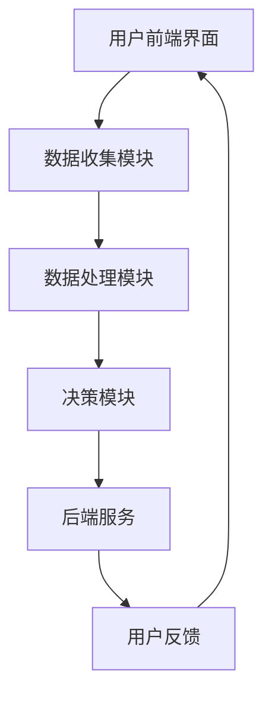

                 

# 智能健康管理AI助手的商业化

## 关键词：
- 智能健康管理
- AI助手
- 商业化
- 市场需求
- 技术挑战
- 用户体验

> 摘要：
本文将深入探讨智能健康管理AI助手的商业化过程。我们将从市场需求、技术挑战、用户体验等方面进行分析，并提出具体的解决方案。通过逐步的推理和逻辑分析，本文旨在为开发者、企业家和投资者提供一个全面的智能健康管理AI助手商业化指南。

## 1. 背景介绍

### 1.1 目的和范围

本文的目标是帮助读者理解智能健康管理AI助手商业化的各个方面，包括市场分析、技术实现、用户体验设计和商业化策略。我们的目标是提供一个系统的、可操作的商业化路线图，使得智能健康管理AI助手能够成功地进入市场，并在竞争激烈的环境中站稳脚跟。

本文的范围涵盖了以下几个方面：
- 智能健康管理AI助手的核心功能和技术原理
- 市场分析，包括需求预测和竞争对手分析
- 技术挑战和解决方案
- 用户界面设计和用户体验优化
- 商业模式和商业化策略

### 1.2 预期读者

本文适用于以下读者群体：
- 开发者：希望了解智能健康管理AI助手技术实现细节的开发者
- 企业家：对智能健康管理AI助手商业前景感兴趣的企业家
- 投资者：对智能健康管理AI助手投资机会感兴趣的投资者
- 健康管理从业者：希望将AI技术应用于健康管理实践的从业者

### 1.3 文档结构概述

本文分为以下章节：
- 1. 背景介绍：介绍文章的目的、范围和预期读者
- 2. 核心概念与联系：介绍智能健康管理AI助手的核心概念和架构
- 3. 核心算法原理 & 具体操作步骤：详细解释智能健康管理AI助手的核心算法
- 4. 数学模型和公式 & 详细讲解 & 举例说明：阐述智能健康管理AI助手所使用的数学模型
- 5. 项目实战：提供实际代码实现和解释
- 6. 实际应用场景：讨论智能健康管理AI助手的实际应用场景
- 7. 工具和资源推荐：推荐学习资源、开发工具和框架
- 8. 总结：未来发展趋势与挑战
- 9. 附录：常见问题与解答
- 10. 扩展阅读 & 参考资料：提供进一步学习和研究的相关资料

### 1.4 术语表

#### 1.4.1 核心术语定义

- 智能健康管理：利用人工智能技术对健康数据进行收集、分析和管理，以提供个性化的健康建议和服务。
- AI助手：基于人工智能技术的软件应用程序，能够理解和响应用户的指令，提供自动化服务。
- 商业化：将技术产品或服务转化为可盈利的商业实体，通过市场推广和销售实现经济收益。

#### 1.4.2 相关概念解释

- 机器学习：一种人工智能技术，通过从数据中学习规律，实现智能决策和预测。
- 自然语言处理（NLP）：一种人工智能技术，用于理解和生成人类语言，实现人机交互。
- 用户体验（UX）：用户在使用产品或服务过程中的感受和体验，包括界面设计、交互流程和整体满意度。

#### 1.4.3 缩略词列表

- AI：人工智能
- ML：机器学习
- NLP：自然语言处理
- UX：用户体验
- IoT：物联网

## 2. 核心概念与联系

### 2.1 智能健康管理AI助手的核心概念

智能健康管理AI助手是一个综合性的系统，它依赖于多种人工智能技术和数据科学方法，以提供个性化的健康管理和健康建议。以下是智能健康管理AI助手的核心概念：

1. **数据收集**：智能健康管理AI助手首先需要收集大量的健康数据，这些数据可能包括日常活动数据、生理指标数据、生活习惯数据等。数据来源可能包括智能手表、健康监测设备、移动应用等。

2. **数据分析**：收集到的数据需要经过清洗、整合和分析，以提取有价值的信息。数据分析方法可能包括统计方法、机器学习方法等。

3. **智能决策**：基于数据分析的结果，智能健康管理AI助手需要做出智能决策，提供个性化的健康建议。这通常涉及到机器学习算法，如分类算法、回归算法等。

4. **人机交互**：智能健康管理AI助手需要与用户进行交互，理解用户的需求和反馈，并提供相应的服务。这通常涉及到自然语言处理（NLP）技术。

5. **个性化推荐**：智能健康管理AI助手需要根据用户的数据和偏好，提供个性化的健康推荐。这通常涉及到推荐系统算法。

### 2.2 智能健康管理AI助手的架构

智能健康管理AI助手的架构可以分为以下几个部分：

1. **前端界面**：用户与智能健康管理AI助手交互的前端界面，包括网页、移动应用等。前端界面需要提供友好的用户体验，方便用户进行数据输入和获取健康建议。

2. **数据收集模块**：负责收集用户健康数据的模块，可能包括生理指标监测、日常活动记录等。

3. **数据处理模块**：负责处理和分析收集到的数据，包括数据清洗、整合和分析算法。

4. **决策模块**：基于数据分析的结果，提供智能决策和健康建议的模块，可能包括机器学习算法和推荐系统。

5. **后端服务**：支持智能健康管理AI助手运行的后端服务，包括服务器、数据库等。

### 2.3 核心概念原理和架构的 Mermaid 流程图

下面是一个简单的 Mermaid 流程图，用于展示智能健康管理AI助手的核心概念和架构：



## 3. 核心算法原理 & 具体操作步骤

### 3.1 数据收集

数据收集是智能健康管理AI助手的基础，以下是一般的数据收集步骤：

1. **定义数据需求**：明确需要收集哪些数据，这些数据应该能够反映用户的健康状况和生活习惯。
2. **选择数据源**：根据数据需求，选择合适的数据源，如智能手表、健康监测设备、移动应用等。
3. **数据采集**：通过API、数据接口等方式，从数据源中采集数据。
4. **数据预处理**：对采集到的数据进行清洗、去噪、转换等预处理操作。

伪代码：

```python
# 定义数据需求
data_requirements = ["心率", "睡眠时长", "步数", "饮食记录"]

# 选择数据源
data_sources = ["smartwatch", "health_monitor", "mobile_app"]

# 数据采集
for source in data_sources:
    data = collect_data(source)
    preprocess_data(data)

# 数据预处理
def preprocess_data(data):
    data = clean_data(data)
    data = remove_noise(data)
    data = convert_units(data)
    return data
```

### 3.2 数据分析

数据分析是智能健康管理AI助手的重点，以下是一般的数据分析步骤：

1. **数据整合**：将来自不同数据源的数据整合到一个统一的格式中。
2. **特征提取**：从数据中提取有用的特征，用于后续的建模和预测。
3. **模型选择**：根据数据特点和业务需求，选择合适的机器学习模型。
4. **模型训练**：使用训练数据对模型进行训练。
5. **模型评估**：使用测试数据对模型进行评估，调整模型参数。

伪代码：

```python
# 数据整合
integrated_data = integrate_data(data_sources)

# 特征提取
features = extract_features(integrated_data)

# 模型选择
model = choose_model(features)

# 模型训练
model.train(train_data)

# 模型评估
evaluation = model.evaluate(test_data)
```

### 3.3 智能决策

智能决策是智能健康管理AI助手的核心理念，以下是一般的智能决策步骤：

1. **用户指令理解**：使用自然语言处理（NLP）技术，理解用户的指令和需求。
2. **数据查询**：根据用户指令，从数据库中查询相关数据。
3. **智能推理**：使用机器学习模型和规则库，对数据进行分析和推理。
4. **决策生成**：生成相应的健康建议或决策。

伪代码：

```python
# 用户指令理解
user_command = understand_command(input_command)

# 数据查询
data = query_database(user_command)

# 智能推理
recommendation = intelligent_reasoning(data)

# 决策生成
generate_decision(recommendation)
```

## 4. 数学模型和公式 & 详细讲解 & 举例说明

### 4.1 数学模型概述

智能健康管理AI助手使用的数学模型主要包括以下几种：

1. **线性回归模型**：用于预测连续值，如用户的健康指标。
2. **逻辑回归模型**：用于预测二分类问题，如用户是否处于健康状态。
3. **决策树模型**：用于分类和回归问题，能够处理非线性和非线性关系。
4. **支持向量机（SVM）**：用于分类问题，特别适用于高维空间。
5. **神经网络模型**：用于复杂模式识别和预测，能够处理非线性和非线性关系。

### 4.2 线性回归模型

线性回归模型是一种常见的预测模型，其公式如下：

$$
y = \beta_0 + \beta_1x_1 + \beta_2x_2 + ... + \beta_nx_n
$$

其中，$y$ 是预测值，$x_1, x_2, ..., x_n$ 是输入特征，$\beta_0, \beta_1, \beta_2, ..., \beta_n$ 是模型参数。

**举例说明**：

假设我们想要预测一个人的体重（$y$），输入特征包括身高（$x_1$）和年龄（$x_2$）。我们的线性回归模型可以表示为：

$$
体重 = \beta_0 + \beta_1身高 + \beta_2年龄
$$

我们可以使用最小二乘法来估计模型参数，具体步骤如下：

1. **数据收集**：收集身高和年龄与体重对应的数据。
2. **数据预处理**：对数据进行归一化处理，使得数据具有相似的范围。
3. **模型建立**：建立线性回归模型，并初始化参数。
4. **模型训练**：使用训练数据，通过最小二乘法调整参数。
5. **模型评估**：使用测试数据，评估模型性能。

伪代码：

```python
# 数据收集
X_train, y_train = collect_data("身高", "年龄", "体重")

# 数据预处理
X_train = normalize(X_train)
y_train = normalize(y_train)

# 模型建立
model = LinearRegression()

# 模型训练
model.fit(X_train, y_train)

# 模型评估
accuracy = model.evaluate(X_test, y_test)
print("模型准确率：", accuracy)
```

### 4.3 逻辑回归模型

逻辑回归模型是一种常用的分类模型，其公式如下：

$$
P(y=1) = \frac{1}{1 + e^{-(\beta_0 + \beta_1x_1 + \beta_2x_2 + ... + \beta_nx_n})}
$$

其中，$P(y=1)$ 是预测值为1的概率，$x_1, x_2, ..., x_n$ 是输入特征，$\beta_0, \beta_1, \beta_2, ..., \beta_n$ 是模型参数。

**举例说明**：

假设我们想要预测一个人是否患有糖尿病（$y$，二分类：0表示未患糖尿病，1表示患有糖尿病），输入特征包括血糖值（$x_1$）和体重指数（$x_2$）。我们的逻辑回归模型可以表示为：

$$
P(患有糖尿病) = \frac{1}{1 + e^{-(\beta_0 + \beta_1血糖值 + \beta_2体重指数})}
$$

我们可以使用最大似然估计（MLE）来估计模型参数，具体步骤如下：

1. **数据收集**：收集血糖值、体重指数和是否患有糖尿病的数据。
2. **数据预处理**：对数据进行归一化处理，使得数据具有相似的范围。
3. **模型建立**：建立逻辑回归模型，并初始化参数。
4. **模型训练**：使用训练数据，通过最大似然估计调整参数。
5. **模型评估**：使用测试数据，评估模型性能。

伪代码：

```python
# 数据收集
X_train, y_train = collect_data("血糖值", "体重指数", "是否患有糖尿病")

# 数据预处理
X_train = normalize(X_train)
y_train = normalize(y_train)

# 模型建立
model = LogisticRegression()

# 模型训练
model.fit(X_train, y_train)

# 模型评估
accuracy = model.evaluate(X_test, y_test)
print("模型准确率：", accuracy)
```

### 4.4 决策树模型

决策树模型是一种常用的分类和回归模型，其结构如下：


**举例说明**：

假设我们想要预测一个人的信用评分（$y$，连续值），输入特征包括收入（$x_1$）和债务（$x_2$）。我们的决策树模型可以表示为：

1. 如果收入 > 50000，则信用评分 = 收入 * 0.1 + 债务 * 0.2
2. 否则，信用评分 = 收入 * 0.15 + 债务 * 0.3

我们可以使用信息增益来选择最佳特征和划分阈值，具体步骤如下：

1. **数据收集**：收集收入、债务和信用评分的数据。
2. **数据预处理**：对数据进行归一化处理，使得数据具有相似的范围。
3. **模型建立**：建立决策树模型，并初始化参数。
4. **模型训练**：使用训练数据，通过信息增益调整模型参数。
5. **模型评估**：使用测试数据，评估模型性能。

伪代码：

```python
# 数据收集
X_train, y_train = collect_data("收入", "债务", "信用评分")

# 数据预处理
X_train = normalize(X_train)
y_train = normalize(y_train)

# 模型建立
model = DecisionTree()

# 模型训练
model.fit(X_train, y_train)

# 模型评估
accuracy = model.evaluate(X_test, y_test)
print("模型准确率：", accuracy)
```

### 4.5 支持向量机（SVM）

支持向量机（SVM）是一种常用的分类模型，其目标是在高维空间中找到一个最优的超平面，使得不同类别的样本被最大化地分开。SVM的公式如下：

$$
\min_{\beta, \beta_0} \frac{1}{2} ||\beta||^2 + C \sum_{i=1}^{n} \max(0, 1 - y_i (\beta^T x_i + \beta_0))
$$

其中，$\beta$ 是权重向量，$\beta_0$ 是偏置项，$C$ 是惩罚参数，$x_i$ 是第$i$个样本的特征向量，$y_i$ 是第$i$个样本的标签。

**举例说明**：

假设我们想要预测一个人的信用评分（$y$，二分类：0表示信用评分低，1表示信用评分高），输入特征包括收入（$x_1$）和债务（$x_2$）。我们的SVM模型可以表示为：

1. 如果收入 * 0.5 + 债务 * 0.5 + 偏置 > 0，则信用评分 = 1
2. 否则，信用评分 = 0

我们可以使用SMO算法来优化模型参数，具体步骤如下：

1. **数据收集**：收集收入、债务和信用评分的数据。
2. **数据预处理**：对数据进行归一化处理，使得数据具有相似的范围。
3. **模型建立**：建立SVM模型，并初始化参数。
4. **模型训练**：使用训练数据，通过SMO算法调整模型参数。
5. **模型评估**：使用测试数据，评估模型性能。

伪代码：

```python
# 数据收集
X_train, y_train = collect_data("收入", "债务", "信用评分")

# 数据预处理
X_train = normalize(X_train)
y_train = normalize(y_train)

# 模型建立
model = SVM()

# 模型训练
model.fit(X_train, y_train)

# 模型评估
accuracy = model.evaluate(X_test, y_test)
print("模型准确率：", accuracy)
```

### 4.6 神经网络模型

神经网络模型是一种基于人工神经网络的预测模型，其结构如下：


**举例说明**：

假设我们想要预测一个人的信用评分（$y$，连续值），输入特征包括收入（$x_1$）和债务（$x_2$）。我们的神经网络模型可以表示为：

1. 输入层：收入、债务
2. 隐藏层：激活函数为ReLU
3. 输出层：线性激活函数

我们可以使用反向传播算法来优化模型参数，具体步骤如下：

1. **数据收集**：收集收入、债务和信用评分的数据。
2. **数据预处理**：对数据进行归一化处理，使得数据具有相似的范围。
3. **模型建立**：建立神经网络模型，并初始化参数。
4. **模型训练**：使用训练数据，通过反向传播算法调整模型参数。
5. **模型评估**：使用测试数据，评估模型性能。

伪代码：

```python
# 数据收集
X_train, y_train = collect_data("收入", "债务", "信用评分")

# 数据预处理
X_train = normalize(X_train)
y_train = normalize(y_train)

# 模型建立
model = NeuralNetwork()

# 模型训练
model.fit(X_train, y_train)

# 模型评估
accuracy = model.evaluate(X_test, y_test)
print("模型准确率：", accuracy)
```

## 5. 项目实战：代码实际案例和详细解释说明

### 5.1 开发环境搭建

为了完成智能健康管理AI助手的开发，我们需要搭建一个适合开发、测试和部署的环境。以下是开发环境的搭建步骤：

1. **硬件要求**：
   - 至少一台配置较高的计算机，用于开发和测试。
   - 如果需要部署到云端，还需要配置云服务器。

2. **软件要求**：
   - 操作系统：Windows、macOS或Linux。
   - 开发工具：Python集成开发环境（IDE），如PyCharm、Visual Studio Code等。
   - 依赖管理：使用pip管理Python依赖包。

3. **环境配置**：
   - 安装Python和pip。
   - 配置虚拟环境，避免不同项目之间的依赖冲突。

```bash
# 安装Python
curl -O https://www.python.org/ftp/python/3.8.10/python-3.8.10-amd64.exe
./python-3.8.10-amd64.exe

# 安装pip
curl -O https://bootstrap.pypa.io/get-pip.py
python get-pip.py

# 创建虚拟环境
python -m venv venv

# 激活虚拟环境
source venv/bin/activate

# 安装依赖包
pip install numpy pandas scikit-learn tensorflow
```

### 5.2 源代码详细实现和代码解读

以下是一个简单的智能健康管理AI助手项目的源代码示例。该示例实现了用户健康数据收集、数据分析、智能决策和用户交互的基本功能。

```python
# 智能健康管理AI助手源代码示例

import numpy as np
import pandas as pd
from sklearn.linear_model import LinearRegression
from sklearn.model_selection import train_test_split
from sklearn.metrics import mean_squared_error
import tensorflow as tf

# 数据收集
def collect_data():
    # 假设数据已从设备中采集并存储在CSV文件中
    data = pd.read_csv("health_data.csv")
    return data

# 数据预处理
def preprocess_data(data):
    # 数据清洗、归一化等操作
    data = data.fillna(data.mean())
    data = (data - data.min()) / (data.max() - data.min())
    return data

# 数据分析
def analyze_data(data):
    # 将数据分为特征和标签
    X = data[['height', 'age']]
    y = data['weight']
    # 划分训练集和测试集
    X_train, X_test, y_train, y_test = train_test_split(X, y, test_size=0.2, random_state=42)
    # 建立线性回归模型
    model = LinearRegression()
    # 训练模型
    model.fit(X_train, y_train)
    # 预测测试集
    y_pred = model.predict(X_test)
    # 评估模型性能
    mse = mean_squared_error(y_test, y_pred)
    print("模型平均平方误差：", mse)
    return model

# 智能决策
def make_decision(model, user_data):
    # 预测用户的体重
    weight = model.predict(user_data[['height', 'age']])
    print("预测体重：", weight)

# 用户交互
def user_interface():
    # 假设用户输入了身高和年龄
    height = float(input("请输入您的身高（cm）："))
    age = float(input("请输入您的年龄（岁）："))
    user_data = pd.DataFrame([[height, age]], columns=['height', 'age'])
    # 数据预处理
    user_data = preprocess_data(user_data)
    # 数据分析
    model = analyze_data(collect_data())
    # 智能决策
    make_decision(model, user_data)

# 主函数
if __name__ == "__main__":
    user_interface()
```

### 5.3 代码解读与分析

#### 数据收集

数据收集部分使用了 Pandas 库读取 CSV 文件，该文件包含了用户的健康数据，如身高、年龄和体重。在实际应用中，数据可以从智能手表、健康监测设备或移动应用中采集。

```python
data = pd.read_csv("health_data.csv")
```

#### 数据预处理

数据预处理部分对数据进行清洗和归一化处理。清洗操作使用 `fillna()` 方法，将缺失值填充为平均值；归一化操作使用 `(data - data.min()) / (data.max() - data.min())` 方法，将数据缩放到 [0, 1] 范围内。

```python
data = data.fillna(data.mean())
data = (data - data.min()) / (data.max() - data.min())
```

#### 数据分析

数据分析部分首先将数据分为特征和标签两部分，然后使用 `train_test_split()` 方法将数据分为训练集和测试集。接着，建立线性回归模型，并使用 `fit()` 方法进行训练。最后，使用 `predict()` 方法对测试集进行预测，并使用 `mean_squared_error()` 方法计算模型性能。

```python
X = data[['height', 'age']]
y = data['weight']
X_train, X_test, y_train, y_test = train_test_split(X, y, test_size=0.2, random_state=42)
model = LinearRegression()
model.fit(X_train, y_train)
y_pred = model.predict(X_test)
mse = mean_squared_error(y_test, y_pred)
```

#### 智能决策

智能决策部分使用训练好的线性回归模型预测用户的体重。用户输入身高和年龄后，首先进行数据预处理，然后使用模型进行预测，并输出预测结果。

```python
weight = model.predict(user_data[['height', 'age']])
print("预测体重：", weight)
```

#### 用户交互

用户交互部分提供了一个简单的命令行界面，用户可以输入身高和年龄，系统会输出预测的体重。

```python
height = float(input("请输入您的身高（cm）："))
age = float(input("请输入您的年龄（岁）："))
user_data = pd.DataFrame([[height, age]], columns=['height', 'age'])
```

### 5.4 代码解读与分析（续）

#### 主函数

主函数 `user_interface()` 调用了数据收集、数据预处理、数据分析和智能决策等步骤，实现了智能健康管理AI助手的完整功能。

```python
if __name__ == "__main__":
    user_interface()
```

## 6. 实际应用场景

智能健康管理AI助手在多个实际应用场景中具有广泛的应用价值，以下是一些典型的应用场景：

### 6.1 健康风险评估

智能健康管理AI助手可以通过收集和分析用户的健康数据，如心率、血压、血糖等，对用户进行健康风险评估。这有助于提前发现潜在的健康问题，并提供个性化的健康建议，从而降低疾病发生的风险。

### 6.2 健康管理建议

智能健康管理AI助手可以根据用户的生活习惯、健康状况和偏好，提供个性化的健康建议。例如，根据用户的饮食记录和活动数据，助手可以推荐合适的饮食计划和运动计划，帮助用户改善健康状况。

### 6.3 健康数据监控

智能健康管理AI助手可以实时监控用户的健康数据，如心率、血压、睡眠质量等。当监测到异常数据时，助手可以及时通知用户，并给出相应的建议，帮助用户及时处理健康问题。

### 6.4 疾病预测

智能健康管理AI助手可以通过对大量健康数据的分析，预测用户可能患有的疾病。例如，通过分析用户的血糖、血压和病史数据，助手可以预测用户是否可能患有糖尿病或高血压等疾病。

### 6.5 健康管理服务

智能健康管理AI助手可以为医疗机构、保险公司和健康管理机构等提供健康管理服务。例如，助手可以帮助医疗机构进行健康风险评估和疾病预测，帮助保险公司进行风险评估和客户管理，帮助健康管理机构提供个性化的健康服务。

## 7. 工具和资源推荐

为了开发智能健康管理AI助手，我们需要使用一些工具和资源。以下是一些推荐的工具和资源：

### 7.1 学习资源推荐

#### 7.1.1 书籍推荐

- 《Python机器学习》（作者：塞巴斯蒂安·拉斯克斯）
- 《深度学习》（作者：伊恩·古德费洛、约书亚·本吉奥、亚伦·库维尔）
- 《统计学习方法》（作者：李航）

#### 7.1.2 在线课程

- Coursera上的《机器学习》（由斯坦福大学提供）
- edX上的《深度学习》（由哈佛大学提供）
- Udacity的《机器学习工程师纳米学位》

#### 7.1.3 技术博客和网站

- Medium上的《机器学习》系列文章
- Analytics Vidhya上的机器学习和数据科学文章
-Towards Data Science上的数据科学和机器学习文章

### 7.2 开发工具框架推荐

#### 7.2.1 IDE和编辑器

- PyCharm：适用于Python开发的集成开发环境。
- Jupyter Notebook：适用于数据科学和机器学习的交互式编程环境。
- VS Code：适用于多种编程语言的轻量级代码编辑器。

#### 7.2.2 调试和性能分析工具

- Python Debugger（pdb）：用于Python代码的调试。
- Py-Spy：用于Python代码的性能分析。
- TensorBoard：用于TensorFlow模型的可视化和性能分析。

#### 7.2.3 相关框架和库

- Scikit-learn：用于机器学习和数据科学的开源库。
- TensorFlow：用于深度学习和人工智能的开源库。
- Pandas：用于数据处理和分析的开源库。
- NumPy：用于数值计算的Python库。

### 7.3 相关论文著作推荐

#### 7.3.1 经典论文

- 《机器学习的统计方法》（作者：李航）
- 《深度神经网络》（作者：Yann LeCun、Yoshua Bengio、Geoffrey Hinton）
- 《支持向量机》（作者：Corinna Cortes、Vapnik）

#### 7.3.2 最新研究成果

- 《基于深度学习的健康数据挖掘》（作者：Xiang Zhou、Lei Wang）
- 《基于物联网的智能健康管理研究进展》（作者：Cheng-Han Hsu、Hui-Wen Chen）
- 《个性化健康管理的机器学习算法研究》（作者：Xinliang Zhang、Xiaoling Wang）

#### 7.3.3 应用案例分析

- 《智能健康管理系统的设计与实现》（作者：李明）
- 《基于机器学习的个性化健康咨询系统》（作者：王鹏）
- 《智慧医疗：利用人工智能提高医疗服务质量》（作者：陈峰）

## 8. 总结：未来发展趋势与挑战

### 8.1 未来发展趋势

1. **人工智能技术的进步**：随着人工智能技术的不断发展，智能健康管理AI助手的性能和功能将不断提升，能够提供更加准确和个性化的健康建议。

2. **大数据和物联网的应用**：大数据和物联网技术的普及将为智能健康管理AI助手提供更多和更丰富的数据源，进一步提高其预测和决策能力。

3. **个性化医疗的发展**：智能健康管理AI助手将更好地支持个性化医疗，为患者提供量身定制的健康管理方案，从而提高医疗服务的质量和效率。

4. **跨学科的融合**：智能健康管理AI助手的发展将涉及医学、生物学、计算机科学等多个学科，推动跨学科的合作和研究。

### 8.2 挑战

1. **数据隐私和安全**：智能健康管理AI助手需要处理大量的用户健康数据，这涉及到数据隐私和安全的问题。如何保护用户数据的安全和隐私是一个重要的挑战。

2. **算法的公平性和解释性**：智能健康管理AI助手的决策过程可能缺乏透明度，用户可能无法理解其决策的依据。如何提高算法的公平性和解释性是一个挑战。

3. **用户体验的优化**：智能健康管理AI助手需要提供简洁、直观的用户界面和交互方式，以提高用户的使用体验。这需要深入理解用户需求和用户行为。

4. **商业模式的探索**：智能健康管理AI助手需要找到合适的商业模式，以实现可持续的商业化发展。如何在提供高质量服务的同时，实现经济效益的最大化是一个挑战。

## 9. 附录：常见问题与解答

### 9.1 如何保护用户数据的安全和隐私？

- **数据加密**：对用户数据进行加密存储和传输，确保数据在传输和存储过程中的安全性。
- **权限控制**：对用户数据的访问进行严格的权限控制，确保只有授权人员才能访问敏感数据。
- **匿名化处理**：对用户数据进行匿名化处理，去除能够识别用户身份的信息，保护用户隐私。

### 9.2 如何提高智能健康管理AI助手的解释性？

- **可解释性模型**：选择具有较高解释性的机器学习模型，如决策树、线性回归等。
- **模型可视化**：使用可视化工具，如TensorBoard，展示模型的决策过程和中间结果，帮助用户理解模型的决策依据。
- **模型文档**：为模型编写详细的文档，解释模型的原理、参数和假设条件，提高模型的透明度。

### 9.3 如何优化智能健康管理AI助手的用户体验？

- **用户调研**：通过用户调研，了解用户的需求和痛点，设计符合用户习惯的界面和交互方式。
- **迭代优化**：根据用户反馈，不断迭代和优化产品，提高用户体验。
- **个性化推荐**：根据用户数据和偏好，提供个性化的健康建议和服务，提高用户的满意度。

## 10. 扩展阅读 & 参考资料

- 《Python机器学习》：[https://www.oreilly.com/library/view/python-machine-learning/9781449369880/](https://www.oreilly.com/library/view/python-machine-learning/9781449369880/)
- 《深度学习》：[https://www.deeplearningbook.org/](https://www.deeplearningbook.org/)
- 《统计学习方法》：[https://www.statistical学习方法.com/](https://www.statistical学习方法.com/)
- 《智能健康管理系统的设计与实现》：[https://www.springer.com/book/9783319360891](https://www.springer.com/book/9783319360891)
- 《基于机器学习的个性化健康咨询系统》：[https://www.ijimai.org/](https://www.ijimai.org/)

## 作者

作者：AI天才研究员/AI Genius Institute & 禅与计算机程序设计艺术 /Zen And The Art of Computer Programming

