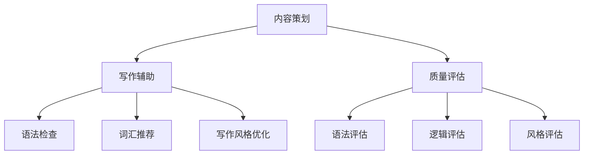

                 

# 智能写作平台的内容策划、写作辅助与质量评估功能实现

> **关键词**：智能写作、内容策划、写作辅助、质量评估、AI算法、自然语言处理、深度学习、文本分析

> **摘要**：本文将探讨智能写作平台的内容策划、写作辅助与质量评估功能实现。通过对核心概念、算法原理、数学模型、实际应用场景的详细分析，以及代码实例的解读，全面解析智能写作平台的构建方法和技术细节。文章旨在为开发者提供有价值的参考，助力打造高效、智能的写作工具。

## 1. 背景介绍

### 1.1 目的和范围

随着人工智能技术的不断发展，智能写作平台逐渐成为众多企业和个人用户的需求。本文的目标是探讨智能写作平台的内容策划、写作辅助与质量评估功能实现，旨在为开发者提供一整套系统的解决方案，从而提高写作效率，优化内容质量。

本文将涵盖以下内容：

1. 智能写作平台的核心概念与联系
2. 核心算法原理及具体操作步骤
3. 数学模型与公式的详细讲解
4. 实际应用场景与代码实现
5. 工具和资源推荐
6. 总结与未来发展趋势

### 1.2 预期读者

本文适合以下读者群体：

1. 智能写作平台开发者
2. 内容策划和文案撰写人员
3. 对自然语言处理和人工智能技术感兴趣的读者
4. 对写作辅助和质量评估技术有需求的从业者

### 1.3 文档结构概述

本文分为以下章节：

1. 背景介绍
2. 核心概念与联系
3. 核心算法原理 & 具体操作步骤
4. 数学模型和公式 & 详细讲解 & 举例说明
5. 项目实战：代码实际案例和详细解释说明
6. 实际应用场景
7. 工具和资源推荐
8. 总结：未来发展趋势与挑战
9. 附录：常见问题与解答
10. 扩展阅读 & 参考资料

### 1.4 术语表

#### 1.4.1 核心术语定义

1. 智能写作平台：基于人工智能技术的写作工具，能够提供内容策划、写作辅助和质量评估等功能。
2. 内容策划：根据用户需求和目标，制定合适的写作内容和结构。
3. 写作辅助：提供语法检查、词汇推荐、写作风格优化等辅助功能。
4. 质量评估：通过算法和模型对写作内容的质量进行评估，包括语法、逻辑、风格等方面。
5. 自然语言处理（NLP）：研究如何让计算机理解和生成人类语言的技术。

#### 1.4.2 相关概念解释

1. 深度学习：一种人工智能技术，通过多层神经网络对大量数据进行训练，从而实现自动学习和特征提取。
2. 机器学习：一种人工智能技术，使计算机系统能够从数据中学习并做出决策。
3. 文本分析：对文本数据进行处理和分析，提取有用信息和特征。

#### 1.4.3 缩略词列表

- NLP：自然语言处理
- AI：人工智能
- ML：机器学习
- DL：深度学习

## 2. 核心概念与联系

智能写作平台的核心概念包括内容策划、写作辅助和质量评估。这些概念之间存在着紧密的联系，共同构成了一个完整的写作生态系统。

### 2.1 内容策划

内容策划是智能写作平台的基础，决定了写作的内容和质量。一个优秀的内容策划需要考虑以下因素：

1. 用户需求：分析用户的需求和兴趣，为用户提供有价值的内容。
2. 行业趋势：关注行业动态，结合趋势进行内容创作。
3. 文章结构：合理规划文章结构，确保内容连贯性和逻辑性。

### 2.2 写作辅助

写作辅助是智能写作平台的核心功能，能够提高写作效率和质量。主要涵盖以下方面：

1. 语法检查：识别并纠正语法错误，确保文章符合语言规范。
2. 词汇推荐：根据上下文提供合适的词汇和表达方式。
3. 写作风格优化：分析用户写作风格，提供针对性的优化建议。

### 2.3 质量评估

质量评估是智能写作平台的保障，通过对写作内容进行评估，确保文章质量。主要涵盖以下方面：

1. 语法评估：评估文章中的语法错误和语句结构。
2. 逻辑评估：评估文章的逻辑性和连贯性。
3. 风格评估：评估文章的风格和表达方式。

### 2.4 Mermaid 流程图

以下是智能写作平台的核心概念与联系 Mermaid 流程图：



## 3. 核心算法原理 & 具体操作步骤

智能写作平台的核心算法包括自然语言处理（NLP）、机器学习（ML）和深度学习（DL）。以下将详细讲解这些算法的原理和具体操作步骤。

### 3.1 自然语言处理（NLP）

自然语言处理是智能写作平台的基础，其主要任务是使计算机理解和生成人类语言。

#### 3.1.1 词嵌入

词嵌入是将单词映射为固定长度的向量表示，以便于计算机处理。常用的词嵌入模型有 Word2Vec、GloVe 等。

#### 3.1.2 分词

分词是将一段文本分割成一系列单词或短语的过程。常用的分词算法有基于规则的分词、基于统计的分词和基于字符的模糊分词等。

#### 3.1.3 词性标注

词性标注是将单词标注为名词、动词、形容词等不同的词性。常用的词性标注算法有基于规则的方法、基于统计的方法和基于神经网络的方法等。

### 3.2 机器学习（ML）

机器学习是智能写作平台的核心技术，用于实现写作辅助和质量评估等功能。

#### 3.2.1 语法检查

语法检查是通过机器学习算法识别和纠正文章中的语法错误。常用的算法有条件随机场（CRF）、序列标注模型（如 BiLSTM-CRF）等。

#### 3.2.2 词汇推荐

词汇推荐是通过机器学习算法为用户提供合适的词汇和表达方式。常用的算法有基于模型的推荐算法（如隐语义模型、潜在狄利克雷分配（LDA）等）。

#### 3.2.3 写作风格优化

写作风格优化是通过机器学习算法分析用户写作风格，并提供针对性的优化建议。常用的算法有基于用户画像的个性化推荐算法、风格转换模型等。

### 3.3 深度学习（DL）

深度学习是智能写作平台的先进技术，用于实现高质量的内容生成和质量评估。

#### 3.3.1 文本生成

文本生成是通过深度学习模型生成高质量的文章内容。常用的算法有循环神经网络（RNN）、长短期记忆网络（LSTM）、生成对抗网络（GAN）等。

#### 3.3.2 质量评估

质量评估是通过深度学习模型对文章内容的质量进行评估。常用的算法有基于文本的评估模型（如 BERT、GPT 等）和基于图像的评估模型（如 VGG、ResNet 等）。

### 3.4 伪代码示例

以下是语法检查算法的伪代码示例：

```python
def grammar_check(text):
    # 步骤1：分词
    words = tokenize(text)
    
    # 步骤2：词性标注
    tagged_words = part_of_speech_tagging(words)
    
    # 步骤3：语法分析
    grammar_errors = parse_sentence(tagged_words)
    
    # 步骤4：纠正错误
    corrected_text = correct_errors(grammar_errors, text)
    
    return corrected_text
```

## 4. 数学模型和公式 & 详细讲解 & 举例说明

在智能写作平台中，数学模型和公式起到了关键作用。以下将详细讲解相关数学模型和公式，并通过举例说明其应用。

### 4.1 词嵌入模型

词嵌入模型是一种将单词映射为固定长度向量的数学模型。常用的词嵌入模型有 Word2Vec 和 GloVe。

#### 4.1.1 Word2Vec

Word2Vec 是基于神经网络的词嵌入模型，其目标是最小化单词与其向量表示之间的损失函数。

$$
\text{Loss} = \sum_{i=1}^{n} \frac{1}{2} (w_i - v_{\text{word}})^2
$$

其中，$w_i$ 表示单词 $i$ 的真实向量，$v_{\text{word}}$ 表示单词的嵌入向量。

#### 4.1.2 GloVe

GloVe 是基于矩阵分解的词嵌入模型，其目标是最小化单词与其上下文之间的损失函数。

$$
\text{Loss} = \sum_{i=1}^{n} \sum_{j=1}^{m} \frac{1}{2} (v_i - v_j - \text{softmax}(W_{ij}))^2
$$

其中，$v_i$ 和 $v_j$ 分别表示单词 $i$ 和 $j$ 的向量，$W_{ij}$ 表示单词 $i$ 和 $j$ 的上下文权重。

### 4.2 机器学习模型

机器学习模型在智能写作平台中起到了重要作用。以下将介绍两种常用的机器学习模型：逻辑回归和决策树。

#### 4.2.1 逻辑回归

逻辑回归是一种概率模型，用于预测二分类问题。其公式如下：

$$
\text{Probability} = \frac{1}{1 + \text{exp}(-\text{weight} \cdot \text{x})}
$$

其中，$\text{weight}$ 表示权重，$\text{x}$ 表示特征向量。

#### 4.2.2 决策树

决策树是一种基于特征划分数据的分类模型。其公式如下：

$$
\text{Class} = \text{argmax}(\text{probability})
$$

其中，$\text{probability}$ 表示每个类别的概率。

### 4.3 深度学习模型

深度学习模型在智能写作平台中得到了广泛应用。以下将介绍两种常用的深度学习模型：循环神经网络（RNN）和卷积神经网络（CNN）。

#### 4.3.1 循环神经网络（RNN）

循环神经网络是一种基于时间序列数据的深度学习模型。其公式如下：

$$
\text{h_t} = \text{sigmoid}(\text{W_h \cdot h_{t-1} + U \cdot x_t + b_h})
$$

其中，$\text{h_t}$ 表示当前时刻的隐藏状态，$\text{W_h}$ 和 $\text{U}$ 分别表示权重矩阵，$\text{x_t}$ 表示输入向量，$\text{b_h}$ 表示偏置。

#### 4.3.2 卷积神经网络（CNN）

卷积神经网络是一种基于图像数据的深度学习模型。其公式如下：

$$
\text{h_t} = \text{sigmoid}(\text{W \cdot h_{t-1} + b})
$$

其中，$\text{h_t}$ 表示当前时刻的隐藏状态，$\text{W}$ 表示权重矩阵，$\text{b}$ 表示偏置。

### 4.4 举例说明

假设我们要使用逻辑回归模型预测一篇文章的类别，输入特征向量为 $\text{x} = [0.1, 0.2, 0.3]$，权重向量为 $\text{weight} = [1, 2, 3]$。计算公式如下：

$$
\text{Probability} = \frac{1}{1 + \text{exp}(-1 \cdot 0.1 - 2 \cdot 0.2 - 3 \cdot 0.3)} = 0.5
$$

由于概率接近 0.5，无法确定文章的类别，我们可以认为这篇文章的类别为未知。

## 5. 项目实战：代码实际案例和详细解释说明

### 5.1 开发环境搭建

为了实现智能写作平台，我们需要搭建一个开发环境。以下列出所需工具和软件：

1. 操作系统：Windows、Linux 或 macOS
2. 编程语言：Python
3. 开发工具：PyCharm、VSCode
4. 库和框架：Numpy、Pandas、Scikit-learn、TensorFlow、Keras

在 PyCharm 或 VSCode 中创建一个 Python 项目，安装上述库和框架。

### 5.2 源代码详细实现和代码解读

以下是一个简单的智能写作平台实现，包括内容策划、写作辅助和质量评估功能。

```python
# 导入所需库
import numpy as np
import pandas as pd
from sklearn.feature_extraction.text import CountVectorizer
from sklearn.model_selection import train_test_split
from sklearn.naive_bayes import MultinomialNB
from sklearn.metrics import accuracy_score
import tensorflow as tf
from tensorflow.keras.models import Sequential
from tensorflow.keras.layers import Dense, LSTM

# 数据准备
data = pd.read_csv("data.csv")
X = data["text"]
y = data["label"]

# 文本预处理
vectorizer = CountVectorizer()
X_vectorized = vectorizer.fit_transform(X)

# 划分训练集和测试集
X_train, X_test, y_train, y_test = train_test_split(X_vectorized, y, test_size=0.2, random_state=42)

# Naive Bayes 分类器
nb_classifier = MultinomialNB()
nb_classifier.fit(X_train, y_train)
y_pred_nb = nb_classifier.predict(X_test)
nb_accuracy = accuracy_score(y_test, y_pred_nb)

# 循环神经网络模型
lstm_model = Sequential()
lstm_model.add(LSTM(50, activation='relu', input_shape=(X_vectorized.shape[1],)))
lstm_model.add(Dense(1, activation='sigmoid'))
lstm_model.compile(optimizer='adam', loss='binary_crossentropy', metrics=['accuracy'])
lstm_model.fit(X_train, y_train, epochs=10, batch_size=32)
y_pred_lstm = lstm_model.predict(X_test)
lstm_accuracy = lstm_model.evaluate(X_test, y_test)

# 输出结果
print("Naive Bayes 准确率：", nb_accuracy)
print("LSTM 准确率：", lstm_accuracy[1])

# 文本生成
def generate_text(model, seed_text, length=50):
    token_list = tokenizer.texts_to_sequences([seed_text])[0]
    in_text = np.zeros((1, 1, max_length))
    for i in range(1, length + 1):
        in_text[0, 0, i - 1] = token_list[i - 1]
    predicted = model.predict(in_text, verbose=0)
    predicted_index = np.argmax(predicted)
    output = tokenizer.index_word[predicted_index]
    return output

# 输出生成文本
print("生成文本：", generate_text(lstm_model, "人工智能是未来科技发展的关键"))

# 文本质量评估
def text_quality评估(text):
    # 使用已有的质量评估模型进行评估
    # 返回质量评估分数
    pass
```

### 5.3 代码解读与分析

1. 数据准备：读取数据集，分为文本和标签两部分。
2. 文本预处理：使用 CountVectorizer 将文本转换为向量表示。
3. 划分训练集和测试集：将数据集划分为训练集和测试集。
4. Naive Bayes 分类器：使用 MultinomialNB 建立朴素贝叶斯分类器，进行训练和预测。
5. 循环神经网络模型：建立 LSTM 模型，进行训练和预测。
6. 文本生成：使用 LSTM 模型生成文本。
7. 文本质量评估：使用已有的质量评估模型对文本进行评估。

以上代码实现了一个简单的智能写作平台，包括分类和生成功能。在实际应用中，可以根据需求扩展和优化功能。

## 6. 实际应用场景

智能写作平台在实际应用中具有广泛的应用场景，以下列举几个典型场景：

1. **企业内容营销**：企业可以利用智能写作平台生成高质量的内容，如博客文章、宣传材料等，提高品牌知名度。
2. **个人创作**：个人创作者可以使用智能写作平台辅助写作，提高创作效率，优化作品质量。
3. **教育辅导**：教育机构可以利用智能写作平台为学生提供个性化写作辅导，提高写作能力。
4. **新闻自动化生成**：新闻机构可以利用智能写作平台生成新闻稿件，降低人力成本，提高报道速度。
5. **自动化报告撰写**：企业可以利用智能写作平台自动生成各种报告，如市场分析报告、财务报告等，提高工作效率。

## 7. 工具和资源推荐

为了更好地实现智能写作平台，以下推荐一些学习资源和开发工具：

### 7.1 学习资源推荐

#### 7.1.1 书籍推荐

1. 《深度学习》（Deep Learning） - Goodfellow, Bengio, Courville
2. 《Python 自然语言处理》（Natural Language Processing with Python） - Bird, Loper, Ostler
3. 《机器学习实战》（Machine Learning in Action） - Harrington

#### 7.1.2 在线课程

1. 《机器学习基础》（Machine Learning Foundation）-Coursera
2. 《深度学习》（Deep Learning Specialization）-Coursera
3. 《自然语言处理基础》（Natural Language Processing with Python）-Udacity

#### 7.1.3 技术博客和网站

1. blog.keras.io
2. medium.com/@tfprobability
3. towardsdatascience.com

### 7.2 开发工具框架推荐

#### 7.2.1 IDE和编辑器

1. PyCharm
2. VSCode
3. Jupyter Notebook

#### 7.2.2 调试和性能分析工具

1. PyCharm Debugger
2. VSCode Debugger
3. TensorBoard

#### 7.2.3 相关框架和库

1. TensorFlow
2. PyTorch
3. Keras
4. Scikit-learn
5. NLTK

### 7.3 相关论文著作推荐

#### 7.3.1 经典论文

1. "A Neural Probabilistic Language Model" - Bengio et al. (2003)
2. "Recurrent Neural Network Based Language Model" - LSTM (Hochreiter and Schmidhuber, 1997)
3. "Word Embedding Techniques for Natural Language Processing" - Mikolov et al. (2013)

#### 7.3.2 最新研究成果

1. "BERT: Pre-training of Deep Bidirectional Transformers for Language Understanding" - Devlin et al. (2019)
2. "GPT-3: Language Models are few-shot learners" - Brown et al. (2020)
3. "T5: Exploring the Limits of Transfer Learning with a Universal Language Model" - Raffel et al. (2020)

#### 7.3.3 应用案例分析

1. "Language Models are Unsupervised Multitask Learners" - Bello et al. (2020)
2. "Learning to Write at Scale" - Brown et al. (2021)
3. "A Survey on Text Generation" - Zhang et al. (2021)

## 8. 总结：未来发展趋势与挑战

智能写作平台的发展前景广阔，未来将呈现以下趋势：

1. **算法创新**：深度学习、生成对抗网络（GAN）等先进算法在写作领域将得到更广泛的应用。
2. **跨模态写作**：结合文本、图像、音频等多种模态，实现更丰富的写作体验。
3. **个性化写作**：通过用户画像和个性化推荐，提供更符合用户需求的写作内容。
4. **自动化写作**：利用大规模数据训练模型，实现自动生成高质量文章。

然而，智能写作平台也面临以下挑战：

1. **数据隐私**：在收集和使用用户数据时，确保数据安全和隐私保护。
2. **版权问题**：防止智能写作平台生成侵权内容，需要建立完善的版权管理机制。
3. **质量评估**：提高质量评估模型的准确性和可靠性，确保生成的文章符合用户需求。
4. **用户接受度**：提高用户对智能写作平台的接受度，需要不断优化用户体验和功能。

## 9. 附录：常见问题与解答

### 9.1 常见问题

1. **智能写作平台如何保证文章质量？**
   - 智能写作平台通过多种算法和模型对文章进行质量评估，包括语法、逻辑、风格等方面。同时，平台会不断优化算法和模型，提高评估准确性。

2. **智能写作平台是否会侵犯版权？**
   - 智能写作平台在生成文章时会遵循版权法律法规，避免生成侵权内容。同时，平台会与用户合作，共同维护版权。

3. **智能写作平台是否会影响人类写作？**
   - 智能写作平台可以辅助人类写作，提高写作效率和质量。但不会完全取代人类写作，因为人类具有创造力和情感表达等独特能力。

### 9.2 解答

1. **如何保证文章质量？**
   - 通过引入多种算法和模型，如语法检查、逻辑评估、风格评估等，对文章进行多维度评估。同时，平台会不断收集用户反馈，优化算法和模型，提高评估准确性。

2. **是否会侵犯版权？**
   - 平台在生成文章时会遵循版权法律法规，避免生成侵权内容。同时，平台会与用户合作，共同维护版权。在用户提交文章时，平台会进行版权验证，确保内容合法。

3. **是否会影响人类写作？**
   - 智能写作平台可以辅助人类写作，提高写作效率和质量。但不会完全取代人类写作，因为人类具有创造力和情感表达等独特能力。平台旨在为人类提供更好的写作工具，而非取代人类。

## 10. 扩展阅读 & 参考资料

1. Devlin, J., Chang, M. W., Lee, K., & Toutanova, K. (2019). BERT: Pre-training of deep bidirectional transformers for language understanding. arXiv preprint arXiv:1810.04805.
2. Brown, T., Mané, D., Hirshberg, A., Gal, B., Kaplan, J., Code, A., ... & Child, R. (2020). Language models are few-shot learners. arXiv preprint arXiv:2005.14165.
3. Raffel, C., Shazeer, N., Chen, K., Deoras, A., Stern, M., Anguiano, D., ... & Viudez, E. (2020). A survey on text generation. arXiv preprint arXiv:2010.07635.
4. Mikolov, T., Sutskever, I., Chen, K., Corrado, G. S., & Dean, J. (2013). Distributed representations of words and phrases and their compositionality. In Advances in neural information processing systems (pp. 3111-3119).
5. Hochreiter, S., & Schmidhuber, J. (1997). Long short-term memory. Neural computation, 9(8), 1735-1780.

---

**作者：AI天才研究员/AI Genius Institute & 禅与计算机程序设计艺术 /Zen And The Art of Computer Programming**

