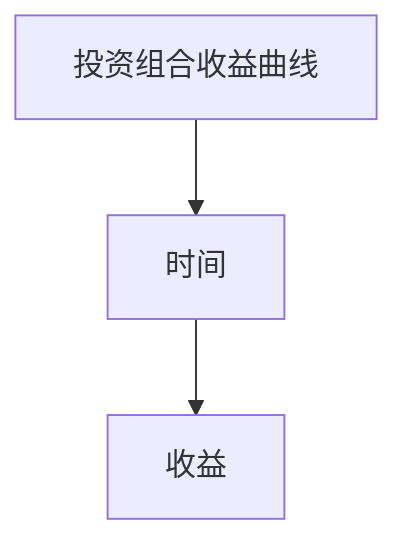

                 

# 智能合约创业：自动化交易的未来

> **关键词：**智能合约、区块链、自动化交易、去中心化、加密货币、交易算法、安全性、可靠性、发展前景
> 
> **摘要：**本文深入探讨了智能合约在自动化交易领域的应用及其发展前景。通过逐步分析智能合约的核心概念、工作原理、数学模型、实际应用案例，以及面临的挑战和未来趋势，为读者呈现了一个充满机遇和挑战的新领域。文章旨在帮助读者理解智能合约技术的本质，以及如何在自动化交易中发挥其优势，为创业者和开发者提供宝贵的参考。

## 1. 背景介绍

### 1.1 目的和范围

本文旨在探讨智能合约技术在自动化交易领域中的应用和发展前景。我们将从以下几个方面展开讨论：

1. **智能合约的核心概念和原理**：介绍智能合约的定义、发展历史及其在区块链技术中的角色。
2. **智能合约的工作机制**：分析智能合约的运作流程、安全性和可靠性保障机制。
3. **智能合约的数学模型和公式**：讲解智能合约中使用的数学模型和公式，以及其在实际交易中的应用。
4. **智能合约的实际应用案例**：通过具体的案例展示智能合约在自动化交易中的成功应用。
5. **智能合约面临的挑战和未来趋势**：探讨智能合约技术在实际应用中面临的挑战，以及其未来的发展趋势和前景。

### 1.2 预期读者

本文主要面向以下几类读者：

1. **区块链技术爱好者**：对区块链技术有浓厚兴趣，希望深入了解智能合约及其应用。
2. **软件开发者**：从事区块链或自动化交易领域开发的工程师，希望掌握智能合约的相关知识。
3. **创业者和投资者**：对智能合约在自动化交易领域的应用前景感兴趣，希望找到新的商业机会。

### 1.3 文档结构概述

本文结构如下：

1. **背景介绍**：概述本文的目的、范围、预期读者以及文档结构。
2. **核心概念与联系**：介绍智能合约的核心概念、原理及其在区块链架构中的位置。
3. **核心算法原理 & 具体操作步骤**：讲解智能合约的实现原理和操作步骤。
4. **数学模型和公式 & 详细讲解 & 举例说明**：介绍智能合约中使用的数学模型和公式，并通过案例说明。
5. **项目实战：代码实际案例和详细解释说明**：通过具体项目展示智能合约的实际应用。
6. **实际应用场景**：探讨智能合约在自动化交易中的实际应用场景。
7. **工具和资源推荐**：推荐相关的学习资源、开发工具和论文著作。
8. **总结：未来发展趋势与挑战**：总结智能合约技术的发展趋势和面临的挑战。
9. **附录：常见问题与解答**：解答读者可能遇到的一些常见问题。
10. **扩展阅读 & 参考资料**：提供更多深入阅读的资料和参考。

### 1.4 术语表

#### 1.4.1 核心术语定义

- **智能合约**：一种运行在区块链上的计算机程序，能够在满足特定条件时自动执行合同条款。
- **区块链**：一种分布式账本技术，通过加密算法确保数据的安全和不可篡改。
- **去中心化**：一种网络架构，通过去中心化的方式避免单点故障和集中控制。
- **加密货币**：基于区块链技术的虚拟货币，如比特币、以太坊等。
- **交易算法**：用于实现自动化交易过程的计算机算法，包括交易策略、风险评估等。

#### 1.4.2 相关概念解释

- **区块链节点**：参与区块链网络的计算机，负责存储、验证和传播区块链数据。
- **共识算法**：区块链网络中节点达成一致的方式，如工作量证明（PoW）、权益证明（PoS）等。
- **加密技术**：用于保护数据安全的技术，包括对称加密、非对称加密等。

#### 1.4.3 缩略词列表

- **BTC**：比特币（Bitcoin）
- **ETH**：以太坊（Ethereum）
- **ICO**：首次币发行（Initial Coin Offering）
- **DAO**：去中心化自治组织（Decentralized Autonomous Organization）
- **DApp**：分布式应用（Decentralized Application）

## 2. 核心概念与联系

在深入探讨智能合约在自动化交易中的应用之前，我们首先需要了解智能合约的核心概念、原理以及其在区块链架构中的位置。

### 2.1 智能合约的概念和定义

智能合约（Smart Contract）是一种运行在区块链上的计算机程序，它能够在满足特定条件时自动执行合同条款。智能合约的出现解决了传统合同在执行过程中存在的一些问题，如信任、执行难度、费用等。

#### 智能合约的发展历史

智能合约的概念最早由计算机科学家尼尔斯·尼伯格·肖恩伯格（Nils Nilsson）在1975年提出，当时被称为“计算机法律”。然而，真正的智能合约概念是在1995年由尼克·萨博（Nick Szabo）提出的，他提出了“电子合同”的概念，并详细阐述了智能合约的原理和特点。

2008年，中本聪（Satoshi Nakamoto）创建了比特币（BTC），首次将智能合约的概念应用于区块链技术中。随后，以太坊（ETH）的推出使得智能合约的发展进入了一个新的阶段。

#### 智能合约的定义

智能合约是一种自动执行、管理和执行合同条款的计算机协议。它基于区块链技术，运行在分布式账本上，具有不可篡改、去中心化、透明等特点。

### 2.2 智能合约的工作原理

智能合约的工作原理可以概括为以下几个步骤：

1. **编写智能合约**：开发者使用智能合约开发语言（如Solidity）编写智能合约代码。
2. **部署智能合约**：将智能合约部署到区块链上，通常通过区块链节点进行验证和存储。
3. **调用智能合约**：当触发特定条件时，用户可以通过区块链网络调用智能合约，执行合同条款。
4. **执行结果**：智能合约根据代码逻辑自动执行，并生成结果。

#### 智能合约的核心组件

- **合同条款**：智能合约的核心内容，定义了合同的具体条款和条件。
- **触发条件**：智能合约执行的触发条件，可以是时间、金额、交易次数等。
- **执行逻辑**：智能合约的代码逻辑，用于实现合同条款的自动执行。

### 2.3 智能合约与区块链的关系

智能合约与区块链技术密不可分，二者相互依存、相互促进。

- **智能合约基于区块链**：智能合约运行在区块链上，利用区块链的分布式账本、加密算法和共识机制等特性，确保合同条款的执行具有不可篡改、透明和去中心化的特点。
- **区块链为智能合约提供支持**：区块链技术为智能合约提供了安全、可靠和透明的运行环境，使智能合约能够高效地执行和验证。

#### 智能合约在区块链架构中的位置

智能合约在区块链架构中位于应用层，是区块链生态系统中不可或缺的一部分。智能合约不仅能够实现传统合同的自动化执行，还能够应用于去中心化金融（DeFi）、去中心化自治组织（DAO）、供应链管理等多个领域。

### 2.4 智能合约的运作流程

智能合约的运作流程可以分为以下几个步骤：

1. **编写智能合约**：开发者使用智能合约开发语言编写智能合约代码，定义合同条款、触发条件和执行逻辑。
2. **编译智能合约**：将智能合约代码编译为区块链网络可识别的代码格式，如Solidity编译器将Solidity代码编译为EVM（Ethereum Virtual Machine）字节码。
3. **部署智能合约**：将编译后的智能合约代码部署到区块链上，通常通过区块链节点进行验证和存储。在以太坊网络中，这通常涉及到发送一个交易来部署智能合约。
4. **调用智能合约**：当触发特定条件时，用户可以通过区块链网络调用智能合约，执行合同条款。调用智能合约通常涉及发送一个交易，其中包含调用方法和参数。
5. **执行结果**：智能合约根据代码逻辑自动执行，并生成结果。执行结果可以是状态变更、数据记录、通知等。
6. **验证和确认**：区块链网络中的节点对智能合约的执行结果进行验证和确认，确保其符合预期。一旦验证通过，智能合约的执行结果将被永久记录在区块链上。

### 2.5 智能合约的安全性

智能合约的安全性是确保其可靠运行的关键因素。智能合约的安全性主要受到以下几个方面的影响：

1. **代码质量**：智能合约代码的质量直接关系到其安全性。开发者需要确保智能合约代码的清晰性、完整性和正确性，避免漏洞和错误。
2. **共识算法**：区块链网络的共识算法对智能合约的安全性至关重要。有效的共识算法能够确保区块链网络中的节点对智能合约的执行结果达成一致，防止恶意攻击和篡改。
3. **加密技术**：智能合约使用加密技术来保护数据的完整性和机密性。加密技术包括对称加密、非对称加密、哈希函数等。
4. **智能合约审查**：智能合约在部署前应经过专业的审查和测试，以确保其安全性。智能合约审查通常包括静态分析和动态分析等方法。

### 2.6 智能合约的可靠性

智能合约的可靠性是指其在执行过程中能够稳定、准确地完成预期任务的能力。智能合约的可靠性受到以下几个因素的影响：

1. **区块链网络的稳定性**：智能合约运行在区块链网络上，因此区块链网络的稳定性直接影响到智能合约的可靠性。区块链网络需要具备高可用性、低延迟和高吞吐量等特点。
2. **智能合约代码的健壮性**：智能合约代码的健壮性直接关系到其可靠性。开发者需要确保智能合约代码能够在各种情况下正常运行，包括网络拥堵、节点故障等。
3. **错误处理机制**：智能合约需要具备良好的错误处理机制，能够在遇到异常情况时正确地响应和处理。
4. **测试和部署流程**：智能合约在部署前应经过充分的测试，以确保其正确性和可靠性。部署流程也应具备完善的备份和恢复机制。

### 2.7 智能合约的透明性

智能合约的透明性是指其运行过程和结果对参与者是可见和可验证的。智能合约的透明性具有以下几个方面的优势：

1. **提高信任度**：智能合约的透明性有助于提高参与者之间的信任度，减少信息不对称和误解。
2. **监督和审计**：智能合约的透明性使得监督和审计工作更加高效和准确。参与者可以实时查看智能合约的运行状态和执行结果，确保其符合预期。
3. **提升市场竞争力**：智能合约的透明性能够提升企业的市场竞争力，吸引更多的客户和投资者。

### 2.8 智能合约的优势和应用场景

智能合约具有一系列优势，使其在多个领域具有广泛的应用场景：

1. **去中心化**：智能合约的去中心化特性使得交易和执行过程不受中心化机构的控制，提高交易的公正性和透明性。
2. **自动化**：智能合约能够自动化执行合同条款，减少人工干预和错误，提高效率。
3. **安全性**：智能合约基于区块链技术，具有不可篡改、加密和安全验证等特点，确保交易和执行过程的安全。
4. **低成本**：智能合约减少了传统合同执行过程中的中介费用，降低交易成本。
5. **适用范围广**：智能合约可以应用于供应链管理、金融交易、版权保护、投票系统等多个领域。

### 2.9 智能合约的挑战和风险

尽管智能合约具有许多优势，但在实际应用中也面临着一些挑战和风险：

1. **代码漏洞**：智能合约代码的漏洞可能导致安全漏洞和损失。开发者需要具备专业的技能和经验，确保代码质量。
2. **共识算法**：共识算法的稳定性直接影响智能合约的执行效率和安全。选择合适的共识算法对于智能合约的可靠性至关重要。
3. **法律和监管**：智能合约的应用涉及法律和监管问题。各国政府对智能合约的法律地位和监管政策存在差异，需要遵守相应的法律法规。
4. **技术升级**：智能合约技术不断发展，开发者需要持续关注技术升级，确保智能合约能够适应未来的需求。

### 2.10 智能合约的总结

智能合约作为一种基于区块链技术的计算机程序，具有去中心化、自动化、安全性和透明性等优势。其在自动化交易、金融、供应链管理、版权保护等领域具有广泛的应用前景。然而，智能合约在实际应用中也面临着一些挑战和风险，需要开发者、企业和政府共同努力，确保其安全、可靠和有效运行。

## 3. 核心算法原理 & 具体操作步骤

### 3.1 智能合约的实现原理

智能合约的实现原理主要包括以下几个关键组成部分：

1. **智能合约开发语言**：智能合约的开发语言是编写智能合约代码的基础，常见的智能合约开发语言包括Solidity、Vyper等。这些语言具有类似编程语言的特性，支持函数、变量、循环、条件判断等编程概念。

2. **区块链网络**：智能合约运行在区块链网络上，区块链网络提供分布式存储、共识机制、加密技术等基础服务。常见的区块链网络包括以太坊（Ethereum）、比特币（Bitcoin）等。

3. **智能合约编译器**：智能合约编译器将智能合约代码转换为区块链网络可识别的字节码。在以太坊网络中，智能合约代码使用Solidity编写，通过Solidity编译器转换为EVM（Ethereum Virtual Machine）字节码。

4. **智能合约部署**：智能合约部署是将编译后的字节码上传到区块链网络上，使其成为可执行合约。部署智能合约通常通过区块链节点进行验证和存储，节点之间通过共识算法达成一致。

5. **智能合约调用**：智能合约调用是指用户通过区块链网络调用智能合约，执行合同条款。调用智能合约通常涉及发送一个交易，交易中包含调用方法和参数。

### 3.2 智能合约的操作步骤

下面是智能合约操作的基本步骤：

1. **编写智能合约**：
    - 选择合适的智能合约开发语言（如Solidity）。
    - 根据合同需求设计智能合约的接口和逻辑。
    - 编写智能合约代码，包括合同条款、触发条件和执行逻辑。

2. **编译智能合约**：
    - 使用智能合约编译器将智能合约代码编译为区块链网络可识别的字节码。
    - 检查编译结果，确保没有错误或警告。

3. **部署智能合约**：
    - 连接到区块链网络（如以太坊网络）。
    - 创建部署交易，其中包含智能合约的字节码和部署地址。
    - 将部署交易发送到区块链网络，节点进行验证和存储。

4. **调用智能合约**：
    - 根据合同需求设计调用交易，其中包含调用方法和参数。
    - 创建交易，并将其发送到区块链网络。
    - 等待区块链网络验证和执行交易。

5. **智能合约执行结果**：
    - 检查交易执行结果，确保智能合约正确执行了合同条款。
    - 如果需要，可以进一步处理交易结果，如记录日志、发送通知等。

### 3.3 智能合约的工作流程

智能合约的工作流程可以概括为以下步骤：

1. **编写智能合约**：
    - 开发者使用智能合约开发语言编写智能合约代码，定义合同条款、触发条件和执行逻辑。

2. **编译智能合约**：
    - 将智能合约代码编译为区块链网络可识别的字节码。
    - 检查编译结果，确保没有错误或警告。

3. **部署智能合约**：
    - 连接到区块链网络（如以太坊网络）。
    - 创建部署交易，其中包含智能合约的字节码和部署地址。
    - 将部署交易发送到区块链网络，节点进行验证和存储。

4. **调用智能合约**：
    - 用户根据合同需求设计调用交易，其中包含调用方法和参数。
    - 创建交易，并将其发送到区块链网络。

5. **智能合约执行**：
    - 智能合约根据代码逻辑自动执行，执行结果记录在区块链上。

6. **结果验证**：
    - 用户和节点对智能合约的执行结果进行验证，确保其符合预期。

### 3.4 智能合约的核心组件

智能合约的核心组件包括：

1. **合同条款**：智能合约的核心内容，定义了合同的具体条款和条件。

2. **触发条件**：智能合约执行的触发条件，可以是时间、金额、交易次数等。

3. **执行逻辑**：智能合约的代码逻辑，用于实现合同条款的自动执行。

### 3.5 智能合约的安全性保障

智能合约的安全性保障主要包括以下几个方面：

1. **代码审计**：智能合约代码在部署前应经过专业的审计，以确保其安全性。

2. **共识算法**：区块链网络的共识算法对智能合约的安全性至关重要。

3. **加密技术**：智能合约使用加密技术来保护数据的完整性和机密性。

4. **错误处理机制**：智能合约需要具备良好的错误处理机制，能够在遇到异常情况时正确地响应和处理。

### 3.6 智能合约的可靠性保障

智能合约的可靠性保障主要包括以下几个方面：

1. **区块链网络的稳定性**：智能合约运行在区块链网络上，因此区块链网络的稳定性直接影响到智能合约的可靠性。

2. **智能合约代码的健壮性**：智能合约代码的健壮性直接关系到其可靠性。

3. **错误处理机制**：智能合约需要具备良好的错误处理机制，能够在遇到异常情况时正确地响应和处理。

4. **测试和部署流程**：智能合约在部署前应经过充分的测试，以确保其正确性和可靠性。

### 3.7 智能合约的透明性保障

智能合约的透明性保障主要包括以下几个方面：

1. **区块链网络的透明性**：智能合约运行在区块链网络上，区块链网络的透明性直接影响到智能合约的透明性。

2. **代码公开**：智能合约的代码应公开，使参与者能够查看和理解智能合约的执行逻辑。

3. **交易记录公开**：智能合约的执行结果和交易记录应公开，使参与者能够实时查看和验证智能合约的执行过程。

### 3.8 智能合约的优势

智能合约具有以下优势：

1. **去中心化**：智能合约的去中心化特性使得交易和执行过程不受中心化机构的控制。

2. **自动化**：智能合约能够自动化执行合同条款，减少人工干预和错误。

3. **安全性**：智能合约基于区块链技术，具有不可篡改、加密和安全验证等特点。

4. **低成本**：智能合约减少了传统合同执行过程中的中介费用，降低交易成本。

5. **适用范围广**：智能合约可以应用于供应链管理、金融交易、版权保护、投票系统等多个领域。

### 3.9 智能合约的挑战和风险

尽管智能合约具有许多优势，但在实际应用中也面临着一些挑战和风险：

1. **代码漏洞**：智能合约代码的漏洞可能导致安全漏洞和损失。

2. **共识算法**：共识算法的稳定性直接影响智能合约的执行效率和安全。

3. **法律和监管**：智能合约的应用涉及法律和监管问题。

4. **技术升级**：智能合约技术不断发展，开发者需要持续关注技术升级，确保智能合约能够适应未来的需求。

### 3.10 智能合约的总结

智能合约是一种基于区块链技术的计算机程序，具有去中心化、自动化、安全性和透明性等优势。其在自动化交易、金融、供应链管理、版权保护等领域具有广泛的应用前景。开发者需要掌握智能合约的实现原理和操作步骤，确保其安全性、可靠性和有效性。智能合约在实际应用中仍面临一些挑战和风险，需要各方共同努力，推动其健康发展。

## 4. 数学模型和公式 & 详细讲解 & 举例说明

### 4.1 智能合约中的数学模型

智能合约在实现过程中，会使用到一些数学模型和公式，以下是一些常用的数学模型及其在智能合约中的应用：

#### 1. 概率模型

概率模型在智能合约中常用于风险评估和预测。例如，在去中心化金融（DeFi）应用中，智能合约会使用概率模型来评估市场的波动性和风险，从而制定相应的交易策略。

**示例：**

假设我们有一个加密货币交易智能合约，该合约会根据市场波动性来调整交易策略。我们可以使用正态分布模型来描述市场波动性，并通过概率模型来预测未来市场的走势。

```latex
X \sim N(\mu, \sigma^2)
```

其中，$X$ 表示市场波动性，$\mu$ 表示均值，$\sigma^2$ 表示方差。我们可以使用概率密度函数（PDF）来计算市场波动性的概率分布：

```latex
f(x) = \frac{1}{\sqrt{2\pi\sigma^2}} e^{-\frac{(x-\mu)^2}{2\sigma^2}}
```

通过概率模型，智能合约可以根据市场波动性的概率分布来制定交易策略，例如，在市场波动性较低时，选择买入，在市场波动性较高时，选择卖出。

#### 2. 市场模型

市场模型用于描述资产价格的变化，常见的是布莱克-舒尔斯模型（Black-Scholes Model）。在智能合约中，市场模型可以用于期权定价、交易策略制定等。

**示例：**

假设我们有一个加密货币期权交易智能合约，使用布莱克-舒尔斯模型来定价期权。

布莱克-舒尔斯模型的公式如下：

```latex
C(S, t) = S_0N(d_1) - Ke^{-r(T-t)}N(d_2)
```

其中，$C(S, t)$ 表示期权价格，$S_0$ 表示当前资产价格，$K$ 表示期权执行价格，$r$ 表示无风险利率，$T-t$ 表示期权剩余时间，$N(\cdot)$ 表示标准正态分布的累积分布函数，$d_1$ 和 $d_2$ 是两个决策参数：

```latex
d_1 = \frac{\ln(S_0/K) + (r + \sigma^2/2)(T-t)}{\sigma\sqrt{T-t}}
d_2 = d_1 - \sigma\sqrt{T-t}
```

通过布莱克-舒尔斯模型，智能合约可以计算出期权的价格，并根据市场情况调整交易策略。

#### 3. 图形模型

图形模型在智能合约中常用于展示数据、图表等，以便于用户理解数据变化和交易情况。

**示例：**

假设我们有一个智能合约，用于监控一个加密货币投资组合的表现。我们可以使用图形模型来展示投资组合的收益曲线。



通过图形模型，用户可以直观地看到投资组合的收益变化，从而做出更明智的投资决策。

### 4.2 数学公式和示例

以下是一些常见的数学公式及其在智能合约中的应用示例：

#### 1. 加密货币交易模型

假设我们有一个加密货币交易智能合约，用于计算交易价格。我们可以使用以下公式来计算交易价格：

```latex
P = \frac{Q \times S_0}{K}
```

其中，$P$ 表示交易价格，$Q$ 表示交易数量，$S_0$ 表示当前资产价格，$K$ 表示交易总量。

**示例：**

假设当前比特币（BTC）的价格为 $50,000 美元，交易数量为 1 个BTC，交易总量为 100 个BTC。我们可以计算出交易价格为：

```latex
P = \frac{1 \times 50,000}{100} = 500 美元
```

#### 2. 加密货币期权定价模型

假设我们有一个加密货币期权交易智能合约，使用布莱克-舒尔斯模型来定价期权。我们可以使用以下公式来计算期权价格：

```latex
C(S, t) = S_0N(d_1) - Ke^{-r(T-t)}N(d_2)
```

其中，$C(S, t)$ 表示期权价格，$S_0$ 表示当前资产价格，$K$ 表示期权执行价格，$r$ 表示无风险利率，$T-t$ 表示期权剩余时间，$N(\cdot)$ 表示标准正态分布的累积分布函数，$d_1$ 和 $d_2$ 是两个决策参数。

**示例：**

假设当前以太坊（ETH）的价格为 $2,000 美元，期权执行价格为 $2,200 美元，无风险利率为 5%，期权剩余时间为 30 天。我们可以计算出期权价格为：

```latex
d_1 = \frac{\ln(2,000/2,200) + (0.05 + 0.3^2/2) \times 30}{0.3 \times \sqrt{30}} \approx 0.2486
d_2 = 0.2486 - 0.3 \times \sqrt{30} \approx -0.7189
C(2,000, 30) = 2,000N(0.2486) - 2,200e^{-0.05 \times 30}N(-0.7189) \approx 86.41 美元
```

#### 3. 投资组合收益模型

假设我们有一个加密货币投资组合，包含多种加密货币。我们可以使用以下公式来计算投资组合的收益：

```latex
R = \sum_{i=1}^n w_i \times r_i
```

其中，$R$ 表示投资组合的收益，$w_i$ 表示第 $i$ 种加密货币的投资比例，$r_i$ 表示第 $i$ 种加密货币的收益。

**示例：**

假设我们的投资组合包含比特币（BTC）、以太坊（ETH）和瑞波币（XRP），投资比例分别为 50%、30% 和 20%，收益分别为 10%、20% 和 15%。我们可以计算出投资组合的收益为：

```latex
R = 0.5 \times 10\% + 0.3 \times 20\% + 0.2 \times 15\% = 0.005 + 0.006 + 0.003 = 0.014 = 1.4\%
```

### 4.3 总结

在智能合约中，数学模型和公式用于实现各种计算和决策，包括交易价格计算、期权定价、投资组合收益计算等。通过使用数学模型和公式，智能合约能够实现自动化和智能化，提高交易的效率和准确性。在实际应用中，开发者需要根据具体需求选择合适的数学模型和公式，并对其进行优化和调整，以实现最佳效果。

## 5. 项目实战：代码实际案例和详细解释说明

### 5.1 开发环境搭建

在进行智能合约开发之前，我们需要搭建一个适合智能合约开发和测试的开发环境。以下是一个基于以太坊智能合约开发的步骤：

1. **安装Node.js**：首先，我们需要安装Node.js，因为Truffle、Ganache等智能合约开发工具都是基于Node.js构建的。可以在Node.js官网（https://nodejs.org/）下载并安装。

2. **安装Ganache**：Ganache是一个本地以太坊节点，用于测试和模拟智能合约。可以在Ganache官网（https://www.trufflesuite.com/ganache）下载并安装。

3. **安装Truffle**：Truffle是一个智能合约开发框架，提供了合约编译、部署和测试等功能。在命令行中运行以下命令安装Truffle：

   ```bash
   npm install -g truffle
   ```

4. **创建新的Truffle项目**：在命令行中运行以下命令创建一个新的Truffle项目：

   ```bash
   truffle init
   ```

   这将生成一个包含项目结构和配置文件的新目录。

5. **配置Truffle项目**：打开项目目录中的`truffle-config.js`文件，配置项目的网络、编译器和合约路径。例如：

   ```javascript
   module.exports = {
     networks: {
       development: {
         host: "127.0.0.1",
         port: 7545,
         network_id: "*",
       },
     },
     compilers: {
       solc: {
         version: "0.8.0",
       },
     },
   };
   ```

   这里，我们配置了一个开发网络，使用Ganache提供的本地节点，网络ID为`*`，表示匹配所有网络。

6. **安装Mocha和Chai**：Mocha是一个测试框架，Chai是一个断言库，用于编写智能合约的测试用例。在命令行中运行以下命令安装：

   ```bash
   npm install mocha chai --save-dev
   ```

7. **编写测试用例**：在项目目录中创建一个名为`test`的文件夹，并在该文件夹中编写智能合约的测试用例。例如，创建一个名为`TestContract.js`的文件，编写以下测试用例：

   ```javascript
   const Contract = artifacts.require("MyContract");
   const chai = require("chai");
   const { expect } = chai;

   contract("MyContract", function() {
     it("should return the initial value", async function() {
       const instance = await Contract.deployed();
       const value = await instance.value.call();
       expect(value).to.equal(10);
     });
   });
   ```

8. **运行测试用例**：在命令行中运行以下命令运行测试用例：

   ```bash
   npm test
   ```

   如果测试用例通过，我们可以继续编写和部署智能合约。

### 5.2 源代码详细实现和代码解读

在这个例子中，我们将使用Solidity语言编写一个简单的智能合约，用于管理一个数字的值，并允许调用者更改这个值。

1. **创建智能合约**：在Truffle项目的`contracts`目录中创建一个名为`MyContract.sol`的文件，并编写以下代码：

   ```solidity
   // SPDX-License-Identifier: MIT
   pragma solidity ^0.8.0;

   contract MyContract {
     uint256 public value;

     constructor() {
       value = 10;
     }

     function changeValue(uint256 newValue) public {
       value = newValue;
     }
   }
   ```

   这段代码定义了一个名为`MyContract`的智能合约，包含一个名为`value`的公共变量，用于存储一个数字值。合约还包含一个构造函数，用于初始化`value`变量的值。此外，合约还包含一个`changeValue`函数，允许调用者通过发送交易更改`value`的值。

2. **解读代码**：

   - **SPDX-License-Identifier**：这是一个元数据注释，用于指定智能合约的许可证。
   - **pragma solidity ^0.8.0**：这是版本pragma，指定了智能合约的编译器版本。这里指定使用0.8.0版本。
   - **contract MyContract**：这是智能合约的定义，名为`MyContract`。
   - **uint256 public value**：这是智能合约的公共变量`value`，用于存储一个32位的无符号整数。
   - **constructor()**：这是智能合约的构造函数，在合约创建时被调用，用于初始化`value`变量。
   - **function changeValue(uint256 newValue) public**：这是智能合约的公共函数`changeValue`，接受一个无符号整数参数`newValue`，并将其赋值给`value`变量。

3. **编译智能合约**：在命令行中运行以下命令编译智能合约：

   ```bash
   truffle compile
   ```

   这将生成`MyContract.json`文件，包含编译后的合约字节码和ABI（Application Binary Interface）。

4. **部署智能合约**：在命令行中运行以下命令部署智能合约到本地Ganache网络：

   ```bash
   truffle migrate --network development
   ```

   这将编译并部署智能合约到本地Ganache网络，并返回合约的部署地址。

### 5.3 代码解读与分析

在理解了智能合约的基本结构后，我们可以进一步分析这段代码：

1. **智能合约结构**：

   - **公共变量（public variables）**：智能合约中的公共变量可以在合约内部和外部访问。这里我们有一个名为`value`的公共变量，用于存储一个32位的无符号整数。
   - **构造函数（constructor）**：构造函数是在合约创建时调用的特殊函数，用于初始化合约状态。这里，构造函数将`value`变量初始化为10。
   - **公共函数（public functions）**：公共函数可以在合约外部调用。这里我们有一个名为`changeValue`的函数，用于更改`value`变量的值。

2. **访问权限修饰符**：

   - **public**：这是访问权限修饰符，表示函数或变量可以被合约外部调用或访问。
   - **external**：这是函数修饰符，表示函数只能通过交易调用，不能通过合约内部调用。
   - **payable**：这是函数修饰符，表示函数可以接收以太币。
   - **view**：这是函数修饰符，表示函数不会修改合约状态，可以只读取状态。
   - **pure**：这是函数修饰符，表示函数不依赖于合约状态，可以独立执行。

3. **事务和事件**：

   - **事务（transactions）**：事务是用户发起的智能合约调用，需要在区块链上进行验证和执行。这里，`changeValue`函数通过交易调用，需要支付一定数量的以太币作为交易费。
   - **事件（events）**：事件是智能合约在执行过程中触发的事件，可以用于记录合约状态变化。这里，我们可以在`changeValue`函数中添加一个事件，记录值的变化。

4. **安全性考虑**：

   - **代码审计**：在部署智能合约之前，进行代码审计是非常重要的。审计可以帮助发现潜在的安全漏洞，如重新入攻击、整数溢出等。
   - **共识算法**：选择合适的共识算法对于智能合约的安全性至关重要。例如，以太坊采用的工作量证明（PoW）算法可以提高区块链网络的共识安全性。
   - **加密技术**：智能合约使用加密技术来保护数据的完整性和机密性。例如，使用以太坊的加密货币钱包地址来确保只有合法的调用者可以执行合约函数。

通过这个简单的例子，我们了解了智能合约的基本结构、代码解读和安全性考虑。在实际应用中，智能合约会涉及更复杂的逻辑和操作，需要开发者具备丰富的编程经验和安全意识。

## 6. 实际应用场景

### 6.1 去中心化金融（DeFi）

去中心化金融（DeFi）是智能合约最广泛的应用场景之一。DeFi通过智能合约实现金融产品和服务，如去中心化交易所（DEX）、去中心化借贷平台、稳定币等。以下是几个典型的DeFi应用场景：

1. **去中心化交易所（DEX）**：
   - **场景**：传统中心化交易所（如Coinbase、Binance）存在信任问题，用户资产安全性无法保障。DeFi通过智能合约实现去中心化交易所，用户可以自由交易加密货币。
   - **解决方案**：使用智能合约创建一个去中心化交易平台，允许用户直接进行点对点交易。智能合约负责记录交易订单和交易匹配，确保交易的安全和高效。
   - **案例分析**：Uniswap是一个流行的去中心化交易所，使用ERC-20标准创建和交易代币。用户通过智能合约发起交易订单，智能合约根据订单匹配交易，实现去中心化交易。

2. **去中心化借贷平台**：
   - **场景**：传统借贷平台（如银行）存在中心化风险，且借贷流程复杂、费用高。DeFi通过智能合约实现去中心化借贷，用户可以自由借贷加密货币。
   - **解决方案**：使用智能合约创建一个去中心化借贷平台，用户可以提供资金并获得利息，也可以借款并支付利息。智能合约负责管理借贷流程，确保借贷的安全和高效。
   - **案例分析**：Aave是一个流行的去中心化借贷平台，用户可以将加密货币存入平台获得利息，也可以借入加密货币并支付利息。智能合约自动处理借贷流程，确保透明和安全。

3. **稳定币**：
   - **场景**：传统货币（如美元）存在通货膨胀和货币贬值的风险，而加密货币价格波动大，难以作为稳定的价值储存。DeFi通过智能合约实现稳定币，解决这些问题。
   - **解决方案**：使用智能合约创建一个稳定币，其价值与真实货币（如美元）挂钩。智能合约自动管理稳定币的供应和需求，确保其价值稳定。
   - **案例分析**：Dai是一种流行的稳定币，其价值与美元挂钩。智能合约通过抵押加密货币发行Dai，并根据市场需求调整供应，确保其价值稳定。

### 6.2 物流和供应链管理

智能合约在物流和供应链管理中的应用，可以提高透明度和效率，减少人工干预和错误。以下是一些典型应用场景：

1. **货物追踪**：
   - **场景**：传统物流和供应链管理中，货物追踪依赖于人工和纸质记录，容易出错和延迟。
   - **解决方案**：使用智能合约记录货物从生产到配送的整个过程，确保数据的真实性和不可篡改性。智能合约自动更新货物的位置信息，提供实时追踪。
   - **案例分析**：TradeFinex是一个基于区块链的物流平台，使用智能合约记录货物的运输过程。每个节点都可以查看货物的状态，确保供应链的透明度。

2. **支付和结算**：
   - **场景**：传统供应链中，支付和结算过程复杂，涉及多个环节和中介，导致效率低下和成本高。
   - **解决方案**：使用智能合约实现自动化支付和结算，减少中介环节，提高效率。智能合约根据货物的交付情况自动执行支付，确保准确和及时。
   - **案例分析**：Verasity是一个基于区块链的供应链平台，使用智能合约管理支付和结算。智能合约确保支付和结算的透明性和可靠性，减少争议和欺诈。

3. **合同执行和验证**：
   - **场景**：传统供应链中，合同执行和验证依赖于人工和纸质记录，容易出现错误和纠纷。
   - **解决方案**：使用智能合约自动化执行合同条款，确保合同执行的透明性和不可篡改性。智能合约根据合同条款自动执行任务，提供实时验证。
   - **案例分析**：Sovrin是一个基于区块链的数字身份平台，使用智能合约管理合同执行。智能合约确保合同的自动执行和验证，减少人工干预和错误。

### 6.3 投票和选举系统

智能合约在投票和选举系统中的应用，可以提高投票的透明度、安全性和公正性。以下是一些典型应用场景：

1. **匿名投票**：
   - **场景**：传统投票系统中，匿名投票难以实现，容易受到舞弊和欺诈。
   - **解决方案**：使用智能合约实现匿名投票，确保每个用户只能投票一次，且投票结果不可篡改。
   - **案例分析**：GuaranteedProof是一个基于区块链的投票平台，使用智能合约实现匿名投票。智能合约确保每个用户只能投票一次，且投票结果公开透明。

2. **去中心化治理**：
   - **场景**：传统公司治理中，决策过程复杂、效率低下，容易受到少数人操控。
   - **解决方案**：使用智能合约实现去中心化治理，确保每个股东都有平等的决策权，决策过程透明、公正。
   - **案例分析**：DAOstack是一个基于区块链的去中心化治理平台，使用智能合约实现决策过程。智能合约确保每个股东都有平等的决策权，提高公司治理的透明度和效率。

3. **选举验证**：
   - **场景**：传统选举中，选举结果容易受到篡改和舞弊，导致信任危机。
   - **解决方案**：使用智能合约实现选举结果验证，确保选举过程的透明性和公正性。
   - **案例分析**：eBallot是一个基于区块链的选举平台，使用智能合约验证选举结果。智能合约确保选举结果不可篡改，提高选举的信任度和公信力。

通过以上实际应用场景，我们可以看到智能合约在自动化交易、金融、物流、供应链管理、投票和选举等领域的广泛应用。智能合约的应用不仅提高了效率和透明度，还减少了人为干预和错误，为各行业带来了巨大的变革和机遇。

## 7. 工具和资源推荐

### 7.1 学习资源推荐

对于想要深入了解智能合约和自动化交易的开发者，以下是一些推荐的学习资源：

#### 7.1.1 书籍推荐

1. **《智能合约：以太坊开发指南》**：由安德烈·马卡罗夫（Andrei Belianin）和乔治·泽林斯基（Georgi Konstantinov）合著，详细介绍了智能合约的基础知识、以太坊开发框架和最佳实践。

2. **《区块链革命》**：由唐·塔普斯科特（Don Tapscott）和亚历克斯·塔普斯科特（Alex Tapscott）合著，全面解析了区块链技术及其对经济和社会的深远影响。

3. **《区块链技术指南》**：由刘伟合著，介绍了区块链技术的核心概念、架构设计、智能合约开发以及应用案例。

#### 7.1.2 在线课程

1. **Coursera上的“区块链和加密货币”课程**：由宾夕法尼亚大学提供，涵盖了区块链技术的基本概念、智能合约和去中心化应用（DApps）的开发。

2. **edX上的“区块链技术与应用”课程**：由新加坡国立大学提供，介绍了区块链的基础知识、智能合约以及其在金融和供应链管理中的应用。

3. **Udacity的“智能合约与DApp开发”纳米学位**：通过一系列课程和项目，帮助学习者掌握智能合约开发、测试和部署。

#### 7.1.3 技术博客和网站

1. **Ethereum.org**：以太坊官方文档和教程网站，提供了丰富的智能合约开发资源和教程。

2. **Medium上的区块链和智能合约专栏**：包括多个知名博主撰写的关于区块链技术、智能合约开发和应用的文章。

3. **Consensys Academy**：Consensys提供的在线学习平台，提供智能合约开发、区块链技术和DApp开发的培训课程。

### 7.2 开发工具框架推荐

在进行智能合约开发时，选择合适的工具和框架可以显著提高开发效率。以下是一些推荐的工具和框架：

#### 7.2.1 IDE和编辑器

1. **Visual Studio Code**：一款功能强大、开源的代码编辑器，通过安装插件（如Solidity和Truffle插件）可以支持智能合约开发。

2. **Eclipse Che**：一个开源的开发工作空间，支持智能合约开发，特别是与以太坊和Solidity相关的工具。

3. **Remix IDE**：一个在线的智能合约开发工具，支持Solidity、Vyper等智能合约开发语言，具有代码编辑、编译、部署和测试等功能。

#### 7.2.2 调试和性能分析工具

1. **Truffle**：一个智能合约开发框架，提供智能合约的编译、部署和测试功能，还包含一个集成调试器。

2. **Ganache**：一个本地以太坊节点，用于测试和模拟智能合约，可以实时查看智能合约的执行日志和状态。

3. **Ethers.js**：一个用于以太坊开发的JavaScript库，提供与以太坊网络交互的API，包括智能合约的调用、事件监听和调试功能。

#### 7.2.3 相关框架和库

1. **OpenZeppelin**：一个开源智能合约库，提供一系列安全、可复用的智能合约组件和工具，如访问控制、权益管理、ERC-20代币等。

2. **web3.js**：一个用于与以太坊网络交互的JavaScript库，支持智能合约的部署、调用和事件监听，是许多以太坊DApp开发的基础库。

3. **Hardhat**：一个用于智能合约开发的环境，支持TypeScript、自动部署和调试功能，是新一代以太坊开发环境。

### 7.3 相关论文著作推荐

1. **“Blockchain: A System for Global Attack-Free Transactions”**：由中本聪（Satoshi Nakamoto）撰写，介绍了比特币和区块链技术的核心概念。

2. **“Smart Contracts: A Vision for Blockchain Applications”**：由尼克·萨博（Nick Szabo）撰写，提出了智能合约的概念和应用前景。

3. **“Decentralized Applications: Using Blockchains to reinvent the future of software”**：由安得烈·马卡罗夫（Andrei Belianin）和乔治·泽林斯基（Georgi Konstantinov）合著，探讨了去中心化应用（DApps）的发展和应用。

这些工具和资源将为智能合约开发者提供宝贵的指导和帮助，助力他们深入了解智能合约技术，开发出更加安全、可靠和高效的智能合约和自动化交易应用。

## 8. 总结：未来发展趋势与挑战

### 8.1 未来发展趋势

智能合约技术的发展前景广阔，未来将在多个领域继续发挥重要作用。以下是智能合约技术未来发展的几个关键趋势：

1. **普及程度提升**：随着区块链技术的普及和智能合约开发工具的不断完善，智能合约将在更多行业和领域得到应用。例如，在金融、供应链管理、版权保护、物联网等领域，智能合约将提高效率、降低成本，并带来新的商业模式。

2. **技术融合**：智能合约技术将与人工智能、物联网、云计算等前沿技术相结合，实现更加智能和高效的应用。例如，智能合约与人工智能的结合可以应用于自动化交易策略，智能合约与物联网的结合可以应用于设备管理和供应链追踪。

3. **标准化和互操作性**：智能合约的标准化和互操作性将进一步提高，促进不同区块链平台之间的协作和集成。这将为开发者提供更多的选择和灵活性，同时降低开发成本和复杂度。

4. **安全性增强**：随着智能合约技术的不断发展，安全性问题将得到更加重视。未来的智能合约将采用更加先进的安全机制，如零知识证明、多重签名、去中心化身份验证等，提高智能合约的安全性和可靠性。

5. **去中心化金融（DeFi）发展**：去中心化金融（DeFi）是智能合约的重要应用场景之一，未来将继续快速发展。DeFi平台将提供更加多样化、灵活的金融服务，如去中心化交易所、借贷平台、稳定币等，为用户提供更多选择和机会。

### 8.2 面临的挑战

尽管智能合约技术具有巨大潜力，但在实际应用中仍面临一些挑战，需要各方共同努力解决：

1. **技术成熟度**：智能合约技术仍处于发展阶段，存在一定的技术成熟度问题。例如，智能合约的执行效率、可扩展性和兼容性等问题仍需进一步研究和优化。

2. **安全性问题**：智能合约的安全性是关键挑战之一。历史上，已经出现了多起智能合约漏洞导致的安全事件。开发者需要具备专业的安全知识和经验，确保智能合约的安全性和可靠性。

3. **法律和监管**：智能合约的应用涉及法律和监管问题。各国政府对智能合约的法律地位和监管政策存在差异，需要制定相应的法律法规和监管框架，确保智能合约的合规性和合法性。

4. **用户体验**：智能合约的易用性和用户体验仍需改进。目前，智能合约的使用门槛较高，对于非技术用户来说，理解和操作智能合约仍有一定难度。未来，需要开发更加简单、直观的智能合约应用界面，提高用户体验。

5. **去中心化程度**：虽然智能合约强调去中心化，但在实际应用中，智能合约往往依赖于特定的区块链平台和节点，存在一定的中心化风险。未来，需要进一步优化区块链网络的结构和共识算法，提高智能合约的去中心化程度。

### 8.3 结论

智能合约作为区块链技术的核心组成部分，具有广泛的应用前景和巨大的潜力。在未来，智能合约将继续在自动化交易、金融服务、供应链管理、物联网等领域发挥重要作用，推动各行业的数字化转型。然而，智能合约技术在实际应用中也面临一些挑战，需要各方共同努力，确保其安全、可靠和有效运行。开发者、企业和政府应携手合作，推动智能合约技术的发展，为构建更加公正、透明和高效的数字经济体系贡献力量。

## 9. 附录：常见问题与解答

### 9.1 智能合约是什么？

智能合约是一种运行在区块链上的计算机程序，能够在满足特定条件时自动执行合同条款。它基于区块链技术，具有去中心化、不可篡改、透明等特点。

### 9.2 智能合约有哪些优势？

智能合约的优势包括：

1. **去中心化**：智能合约不需要第三方中介，减少了交易成本。
2. **自动化**：智能合约能够自动执行合同条款，提高交易效率。
3. **安全性**：智能合约基于区块链技术，具有不可篡改、加密和安全验证等特点。
4. **透明性**：智能合约的执行过程和结果对参与者是可见和可验证的。

### 9.3 智能合约有哪些应用场景？

智能合约的应用场景包括：

1. **去中心化金融（DeFi）**：智能合约可以用于去中心化交易所、借贷平台、稳定币等。
2. **供应链管理**：智能合约可以用于货物追踪、支付和结算、合同执行和验证等。
3. **投票和选举系统**：智能合约可以用于匿名投票、去中心化治理、选举验证等。
4. **物流和运输**：智能合约可以用于货物追踪、支付和结算、合同执行和验证等。

### 9.4 如何开发智能合约？

开发智能合约的步骤包括：

1. **选择合适的开发语言**：如Solidity、Vyper等。
2. **设计智能合约逻辑**：根据需求设计智能合约的接口和逻辑。
3. **编写智能合约代码**：使用智能合约开发语言编写智能合约代码。
4. **编译智能合约**：使用智能合约编译器将代码编译为字节码。
5. **部署智能合约**：将编译后的字节码部署到区块链上。
6. **调用智能合约**：通过区块链网络调用智能合约，执行合同条款。

### 9.5 智能合约有哪些风险？

智能合约的风险包括：

1. **代码漏洞**：智能合约代码的漏洞可能导致安全漏洞和损失。
2. **共识算法**：共识算法的稳定性直接影响智能合约的执行效率和安全。
3. **法律和监管**：智能合约的应用涉及法律和监管问题。
4. **技术升级**：智能合约技术不断发展，需要持续关注技术升级。

### 9.6 智能合约的安全性如何保障？

智能合约的安全性保障包括：

1. **代码审计**：智能合约代码在部署前应经过专业的审计，以确保其安全性。
2. **共识算法**：选择合适的共识算法对智能合约的安全性至关重要。
3. **加密技术**：智能合约使用加密技术来保护数据的完整性和机密性。
4. **错误处理机制**：智能合约需要具备良好的错误处理机制，能够在遇到异常情况时正确地响应和处理。

### 9.7 智能合约的可靠性如何保障？

智能合约的可靠性保障包括：

1. **区块链网络的稳定性**：智能合约运行在区块链网络上，因此区块链网络的稳定性直接影响到智能合约的可靠性。
2. **智能合约代码的健壮性**：智能合约代码的健壮性直接关系到其可靠性。
3. **错误处理机制**：智能合约需要具备良好的错误处理机制，能够在遇到异常情况时正确地响应和处理。
4. **测试和部署流程**：智能合约在部署前应经过充分的测试，以确保其正确性和可靠性。

### 9.8 智能合约的透明性如何保障？

智能合约的透明性保障包括：

1. **区块链网络的透明性**：智能合约运行在区块链网络上，区块链网络的透明性直接影响到智能合约的透明性。
2. **代码公开**：智能合约的代码应公开，使参与者能够查看和理解智能合约的执行逻辑。
3. **交易记录公开**：智能合约的执行结果和交易记录应公开，使参与者能够实时查看和验证智能合约的执行过程。

## 10. 扩展阅读 & 参考资料

为了更好地理解智能合约和自动化交易，以下是一些扩展阅读和参考资料，涵盖智能合约的核心概念、实际应用案例、技术发展动态等方面：

### 10.1 核心概念

1. **智能合约定义及工作原理**：Nikolay A. Durov的《Smart Contracts: A Turing-Complete Program to Represent All Possible Legal Contracts》，详细介绍了智能合约的定义及其在法律领域的应用。
2. **区块链技术基础**：Charles Hoskinson的《A Brief Guide to Cryptocurrencies and Blockchain Technology》，对区块链技术进行了深入浅出的解释。

### 10.2 实际应用案例

1. **DeFi应用**：
   - **Uniswap**：Ethereum.org上的官方文档，详细介绍Uniswap的去中心化交易所实现。
   - **Aave**：Aave的官方文档，涵盖借贷平台的智能合约设计和实施。
2. **供应链管理**：
   - **TradeFinex**：TradeFinex的官方文档，展示物流和供应链管理中智能合约的应用。
   - **Provenance**：Provenance的案例研究，探讨区块链在食品供应链中的应用。

### 10.3 技术发展动态

1. **智能合约安全和审计**：
   - **OpenZeppelin的安全指南**：OpenZeppelin的官方博客，提供智能合约安全和最佳实践。
   - **Consensys的研究报告**：Consensys发布的研究报告，涵盖智能合约的最新技术趋势和安全问题。
2. **区块链网络和共识算法**：
   - **Ethereum 2.0**：Ethereum Foundation的官方文档，详细介绍以太坊2.0的升级计划和技术细节。
   - **Polkadot**：Polkadot的官方文档，探讨跨链技术和多链互操作性的实现。

### 10.4 教程和课程

1. **智能合约开发教程**：
   - **Solidity官方文档**：Solidity语言的官方文档，涵盖从基础到高级的智能合约开发知识。
   - **区块链和智能合约开发课程**：Coursera上的“Blockchain and cryptocurrency technologies”课程，由宾夕法尼亚大学提供。
2. **实战项目**：
   - **Truffle和Ganache的官方教程**：Truffle和Ganache的官方文档，提供智能合约开发环境的搭建和操作指南。

通过这些扩展阅读和参考资料，读者可以进一步深入了解智能合约技术的核心概念、应用案例和最新动态，为实际开发和研究提供有力的支持。

