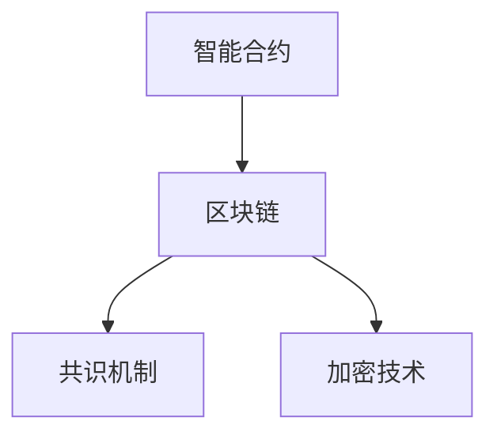
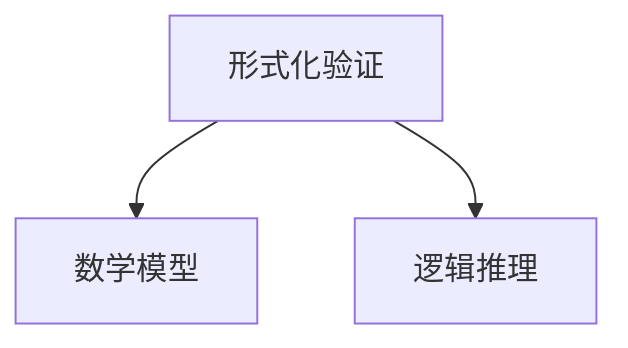
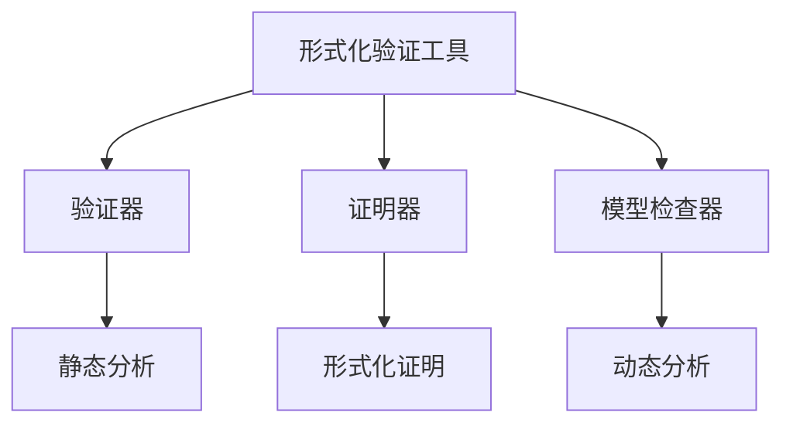

                 

# 智能合约形式化验证工具：区块链安全的创新解决方案

> **关键词：** 智能合约，形式化验证，区块链安全，形式化验证工具，自动化验证，智能合约漏洞，智能合约测试，形式化验证算法。

> **摘要：** 本篇文章将深入探讨智能合约形式化验证工具的重要性和应用。通过解析核心概念、原理，以及实际操作步骤，本文旨在为开发者提供关于如何利用形式化验证工具提升智能合约安全性的全面指南。文章还探讨了智能合约的实际应用场景，并推荐了相关的学习资源、开发工具和经典论文，以帮助读者进一步了解和掌握这一前沿技术。

## 1. 背景介绍

### 1.1 目的和范围

本文的目标是向读者介绍智能合约形式化验证工具的重要性，并详细阐述其在提升区块链安全方面的关键作用。随着区块链技术的快速发展，智能合约作为一种自动执行合约条款的计算机程序，已经被广泛应用于金融、物流、版权保护等领域。然而，智能合约的安全性一直是开发者面临的一大挑战。形式化验证工具作为一种自动化验证方法，能够有效地检测智能合约中的潜在漏洞，从而提高合约的安全性。

本文将涵盖以下内容：

1. 智能合约形式化验证的核心概念和原理。
2. 形式化验证工具的具体操作步骤和算法原理。
3. 数学模型和公式的详细讲解与举例。
4. 智能合约形式化验证工具的实际应用案例。
5. 智能合约形式化验证工具的未来发展趋势与挑战。

### 1.2 预期读者

本文适合对区块链技术和智能合约有一定了解的技术人员、开发者以及安全专家。无论您是刚入门的区块链爱好者，还是经验丰富的智能合约开发者，都能在本文中找到对您有价值的内容。

### 1.3 文档结构概述

本文分为十个部分，结构如下：

1. 背景介绍：介绍本文的目的、范围、预期读者和文档结构。
2. 核心概念与联系：介绍智能合约、形式化验证、形式化验证工具等核心概念，并使用Mermaid流程图展示智能合约形式化验证的架构。
3. 核心算法原理 & 具体操作步骤：详细讲解形式化验证算法的原理和操作步骤，使用伪代码进行阐述。
4. 数学模型和公式 & 详细讲解 & 举例说明：介绍与智能合约形式化验证相关的数学模型和公式，并通过具体例子进行说明。
5. 项目实战：代码实际案例和详细解释说明。
6. 实际应用场景：探讨智能合约形式化验证工具在不同领域的应用。
7. 工具和资源推荐：推荐学习资源、开发工具和经典论文。
8. 总结：未来发展趋势与挑战。
9. 附录：常见问题与解答。
10. 扩展阅读 & 参考资料：提供进一步阅读和参考资料。

### 1.4 术语表

#### 1.4.1 核心术语定义

- **智能合约**：一种自动执行的计算机程序，能够在满足特定条件时自动执行合约条款。
- **形式化验证**：一种使用数学模型和逻辑推理来验证系统或程序的正确性的方法。
- **形式化验证工具**：用于实现形式化验证过程的软件工具，能够自动化地检测程序中的错误和漏洞。
- **区块链**：一种分布式数据库技术，用于存储交易记录，确保数据不可篡改。

#### 1.4.2 相关概念解释

- **形式化验证算法**：用于实现形式化验证的工具，通过一系列步骤和规则，检查程序的正确性和安全性。
- **智能合约漏洞**：指智能合约代码中的错误或缺陷，可能导致合约被恶意攻击者利用。
- **形式化验证工具**：专门为智能合约形式化验证设计的软件工具，能够自动化地检测合约中的潜在漏洞。

#### 1.4.3 缩略词列表

- **SC**：智能合约（Smart Contract）
- **FV**：形式化验证（Formal Verification）
- **AV**：自动化验证（Automated Verification）
- **BC**：区块链（Blockchain）

## 2. 核心概念与联系

在深入探讨智能合约形式化验证工具之前，我们需要先了解几个核心概念：智能合约、形式化验证和形式化验证工具。下面将通过一个Mermaid流程图来展示这些概念之间的联系。

### 2.1 智能合约

智能合约是区块链技术中一个重要的组成部分，它允许在不需要第三方介入的情况下，自动执行合约条款。智能合约通常由编程语言编写，例如Solidity、Vyper等。智能合约的执行是基于区块链网络中的共识机制和加密技术，确保合约条款的不可篡改和执行。



### 2.2 形式化验证

形式化验证是一种验证系统或程序正确性的方法，它使用数学模型和逻辑推理来检查程序的特性和行为。形式化验证的核心思想是通过严格的形式化证明，确保程序的正确性和安全性。



### 2.3 形式化验证工具

形式化验证工具是实现形式化验证过程的软件工具，它能够自动化地检测程序中的错误和漏洞。这些工具通常包括验证器、证明器、模型检查器等，能够对智能合约代码进行静态分析或动态分析，从而发现潜在的安全问题。



通过以上Mermaid流程图，我们可以清晰地看到智能合约、形式化验证和形式化验证工具之间的紧密联系。形式化验证工具能够帮助开发者确保智能合约的正确性和安全性，从而提升区块链系统的整体安全性。

## 3. 核心算法原理 & 具体操作步骤

形式化验证工具的核心是形式化验证算法，这些算法通过一系列步骤和规则来检查智能合约代码的正确性和安全性。以下将详细讲解形式化验证算法的原理和操作步骤，并通过伪代码进行阐述。

### 3.1 形式化验证算法原理

形式化验证算法基于数学模型和逻辑推理，通过以下核心步骤来实现：

1. **建立数学模型**：将智能合约代码转换为一个数学模型，用于描述合约的行为和状态。
2. **定义验证规则**：根据智能合约的安全需求和设计目标，定义一组验证规则，用于检查合约的正确性和安全性。
3. **逻辑推理**：使用逻辑推理技术，从数学模型中推导出合约的行为，并与验证规则进行对比，检测潜在的错误和漏洞。
4. **报告检测结果**：如果发现错误或漏洞，形式化验证工具会生成详细的报告，包括错误的类型、位置和修复建议。

### 3.2 形式化验证算法操作步骤

以下是一个简化的形式化验证算法的操作步骤，使用伪代码进行阐述：

```plaintext
算法：形式化验证算法

输入：智能合约代码C，验证规则R
输出：验证结果V

1. 建立数学模型M，将智能合约代码C转化为数学模型M。
2. 初始化验证规则R。
3. 对M进行逻辑推理，生成合约行为B。
4. 遍历验证规则R，对B进行对比：
   4.1 如果B与R一致，继续下一步。
   4.2 如果B与R不一致，记录错误E，并报告E。
5. 如果所有验证规则R都通过，则验证结果V为“通过”。
6. 否则，验证结果V为“未通过”。

伪代码：
function formalVerification(C, R):
    M = buildMathModel(C)
    R = initializeVerificationRules()
    B = logicalReasoning(M)
    for rule in R:
        if not B == rule:
            reportError(E)
    if all rules passed:
        return "通过"
    else:
        return "未通过"
```

### 3.3 形式化验证算法应用示例

以下是一个简单的智能合约代码示例，用于购买和销售商品。我们将使用形式化验证算法对该代码进行验证。

```solidity
// SPDX-License-Identifier: MIT
pragma solidity ^0.8.0;

contract Marketplace {
    mapping(address => uint256) public balances;

    function deposit() external payable {
        balances[msg.sender()] += msg.value;
    }

    function buyItem(uint256 itemId, address seller) external payable {
        require(balances[seller] >= itemId, "Item not available");
        balances[seller] -= itemId;
        balances[msg.sender()] += itemId;
    }

    function refund() external {
        require(balances[msg.sender()] > 0, "No items to refund");
        balances[msg.sender()] -= 1;
        payable(msg.sender()).transfer(1);
    }
}
```

使用形式化验证算法对该代码进行验证的步骤如下：

1. **建立数学模型**：将智能合约代码转换为一个数学模型，用于描述合约的行为和状态。数学模型可能包括状态变量、事件、条件和操作等。
2. **定义验证规则**：根据智能合约的安全需求和设计目标，定义一组验证规则。例如，验证购买商品时，余额必须大于或等于商品ID。
3. **逻辑推理**：使用逻辑推理技术，从数学模型中推导出合约的行为，并与验证规则进行对比。逻辑推理可能包括状态转移分析、路径分析等。
4. **报告检测结果**：如果发现错误或漏洞，形式化验证工具会生成详细的报告，包括错误的类型、位置和修复建议。

通过上述步骤，我们可以确保智能合约代码的正确性和安全性，从而提高区块链系统的整体安全性。

## 4. 数学模型和公式 & 详细讲解 & 举例说明

在智能合约形式化验证过程中，数学模型和公式起着至关重要的作用。它们帮助我们将智能合约代码转换为一个可分析的数学模型，以便更准确地验证合约的正确性和安全性。以下将详细介绍与智能合约形式化验证相关的数学模型和公式，并通过具体例子进行说明。

### 4.1 模型表示

形式化验证中的数学模型通常使用逻辑表达式、谓词逻辑和集合论等来表示智能合约的状态和操作。一个基本的数学模型可以包括以下元素：

- **状态变量**：表示智能合约在特定时刻的状态，如余额、商品ID等。
- **谓词**：用于描述状态变量之间的关系和约束条件，如余额大于零、商品ID有效等。
- **操作**：表示智能合约的执行行为，如存款、购买商品、退款等。

#### 4.1.1 状态变量表示

状态变量是数学模型中的基本元素，用于表示智能合约在特定时刻的状态。以下是一个简单的状态变量表示示例：

```latex
State Variables:
\begin{align*}
&balance_{seller} \text{ (seller's balance)} \\
&item\_id \text{ (current item ID)} \\
&transaction\_count \text{ (number of transactions)}
\end{align*}
```

#### 4.1.2 谓词表示

谓词用于描述状态变量之间的关系和约束条件。以下是一个简单的谓词表示示例：

```latex
Predicates:
\begin{align*}
&P_{1}: balance_{seller} > 0 \text{ (seller has a positive balance)} \\
&P_{2}: item\_id \in \{1, 2, 3\} \text{ (valid item ID range)} \\
&P_{3}: transaction\_count \geq 0 \text{ (non-negative transaction count)}
\end{align*}
```

#### 4.1.3 操作表示

操作表示智能合约的执行行为，如存款、购买商品、退款等。以下是一个简单的操作表示示例：

```latex
Operations:
\begin{align*}
&\text{deposit()} \\
&\text{buyItem(item\_id)} \\
&\text{refund()}
\end{align*}
```

### 4.2 公式表示

在形式化验证中，我们使用逻辑公式来描述智能合约的状态转换和操作行为。以下是一些常见的逻辑公式：

#### 4.2.1 状态转换公式

状态转换公式用于描述智能合约在执行操作时的状态变化。以下是一个简单的状态转换公式示例：

```latex
\begin{align*}
\Phi &= \Phi_0 \land \neg P_1 \land P_2 \\
&P_1 \to \Phi_1 = \Phi_0 \land P_1 \land \neg P_2 \\
&P_2 \to \Phi_2 = \Phi_1 \land P_2 \land \neg P_3 \\
&P_3 \to \Phi_3 = \Phi_2 \land P_3
\end{align*}
```

其中，\(\Phi_0\)表示初始状态，\(\Phi_1\)、\(\Phi_2\)、\(\Phi_3\)表示后续状态。\(P_1\)、\(P_2\)、\(P_3\)表示谓词。

#### 4.2.2 操作公式

操作公式用于描述智能合约的执行行为。以下是一个简单的操作公式示例：

```latex
\begin{align*}
\text{deposit()} &= balance_{seller} \leftarrow balance_{seller} + msg.value \\
\text{buyItem(item\_id)} &= \begin{cases}
    balance_{seller} \leftarrow balance_{seller} - item\_id \\
    balance_{buyer} \leftarrow balance_{buyer} + item\_id
\end{cases} \\
\text{refund()} &= balance_{buyer} \leftarrow balance_{buyer} - 1
\end{align*}
```

### 4.3 示例讲解

以下是一个具体的例子，说明如何使用数学模型和公式来验证一个简单的智能合约。

#### 4.3.1 智能合约代码

考虑以下一个简单的智能合约代码，用于管理商品库存：

```solidity
// SPDX-License-Identifier: MIT
pragma solidity ^0.8.0;

contract Inventory {
    mapping(uint256 => uint256) public items;
    uint256 public itemCount = 0;

    function addItem(uint256 itemID, uint256 quantity) external {
        require(items[itemID] == 0, "Item already exists");
        items[itemID] = quantity;
        itemCount++;
    }

    function removeItem(uint256 itemID, uint256 quantity) external {
        require(items[itemID] >= quantity, "Insufficient quantity");
        items[itemID] -= quantity;
        if (items[itemID] == 0) {
            itemCount--;
        }
    }
}
```

#### 4.3.2 数学模型

将上述智能合约代码转换为一个数学模型，包括以下元素：

- **状态变量**：`items[itemID]`表示商品ID为`itemID`的商品数量，`itemCount`表示当前商品总数。
- **谓词**：`P1: items[itemID] > 0`表示商品ID为`itemID`的商品存在，`P2: itemCount > 0`表示商品总数大于零。
- **操作**：`addItem(itemID, quantity)`表示添加商品数量，`removeItem(itemID, quantity)`表示移除商品数量。

#### 4.3.3 状态转换公式

根据智能合约的操作，定义状态转换公式：

```latex
\begin{align*}
\Phi_0 &= \forall item\_id \in \{1, 2, 3\}: items[item\_id] = 0 \land itemCount = 0 \\
\text{addItem}(item\_id, quantity) &= \begin{cases}
    \Phi_1 = \Phi_0 \land P1 \\
    \Phi_2 = \Phi_1 \land items[item\_id] = quantity \\
    \Phi_3 = \Phi_2 \land P2
\end{cases} \\
\text{removeItem}(item\_id, quantity) &= \begin{cases}
    \Phi_4 = \Phi_3 \land items[item\_id] \geq quantity \\
    \Phi_5 = \Phi_4 \land items[item\_id] = items[item\_id] - quantity \\
    \Phi_6 = \Phi_5 \land P2
\end{cases}
\end{align*}
```

#### 4.3.4 操作公式

根据智能合约的操作，定义操作公式：

```latex
\begin{align*}
\text{addItem}(item\_id, quantity) &= items[item\_id] \leftarrow quantity \\
\text{removeItem}(item\_id, quantity) &= items[item\_id] \leftarrow items[item\_id] - quantity
\end{align*}
```

通过上述数学模型和公式，我们可以使用形式化验证算法对智能合约进行验证。如果验证过程未发现任何错误或漏洞，则说明智能合约代码是正确和安全的。

## 5. 项目实战：代码实际案例和详细解释说明

在本节中，我们将通过一个实际项目案例，展示如何使用形式化验证工具对智能合约进行验证。项目案例是一个简单的资金池智能合约，它允许用户向资金池中存入和提取资金。我们将详细讲解项目的开发环境搭建、源代码实现和代码解读，以便读者了解整个验证过程。

### 5.1 开发环境搭建

要搭建一个用于智能合约形式化验证的开发环境，我们需要以下工具和软件：

1. **Node.js**：用于编译和部署智能合约。
2. **Truffle**：一个智能合约开发框架，用于管理测试和部署。
3. **Solc**：用于编译智能合约代码。
4. **形式化验证工具**：例如Mythril、Oyente等，用于对智能合约进行形式化验证。
5. **IDE**：如Visual Studio Code，用于编写和调试智能合约代码。

以下是具体步骤：

1. 安装Node.js和npm（Node.js的包管理器）。
2. 安装Truffle：使用命令`npm install -g truffle`。
3. 创建一个新的Truffle项目：使用命令`truffle init`。
4. 安装Solc：使用命令`npm install solc`。
5. 在Truffle项目中创建一个名为`contracts`的文件夹，用于存储智能合约代码。
6. 安装形式化验证工具，如Mythril：使用命令`npm install mythril`。

### 5.2 源代码详细实现和代码解读

在`contracts`文件夹中，创建一个名为`FundPool.sol`的智能合约文件，实现一个简单的资金池智能合约。以下是该合约的代码：

```solidity
// SPDX-License-Identifier: MIT
pragma solidity ^0.8.0;

contract FundPool {
    mapping(address => uint256) public deposits;
    uint256 public totalFunds;

    function deposit() external payable {
        require(msg.value > 0, "Invalid deposit amount");
        deposits[msg.sender()] += msg.value;
        totalFunds += msg.value;
    }

    function withdraw() external {
        require(deposits[msg.sender()] > 0, "Insufficient funds");
        uint256 balance = deposits[msg.sender()];
        deposits[msg.sender()] = 0;
        payable(msg.sender()).transfer(balance);
        totalFunds -= balance;
    }
}
```

#### 5.2.1 代码解读

- **存储变量**：`deposits`是一个映射（mapping），用于存储每个用户的存款金额。`totalFunds`是一个公共变量，用于存储资金池中的总资金。
- **`deposit()`函数**：该函数用于将资金存入资金池。它接受一个`value`参数，表示用户要存入的资金数量。函数首先检查`value`是否大于零，然后更新用户的存款金额和资金池的总资金。
- **`withdraw()`函数**：该函数用于从资金池中提取资金。它首先检查用户是否有足够的资金，然后从用户的存款中扣除提取金额，并将提取的金额发送给用户。

### 5.3 代码解读与分析

#### 5.3.1 存储变量解读

- **`deposits`映射**：用于存储每个用户的存款金额，其中键（key）是用户的地址，值（value）是存款金额。这种数据结构使得可以快速查找和更新每个用户的存款金额。
- **`totalFunds`变量**：用于存储资金池中的总资金，它随着用户存款和提取操作的进行而动态更新。

#### 5.3.2 函数解读

- **`deposit()`函数**：
  - `require(msg.value > 0, "Invalid deposit amount")`：这是一个安全检查，确保用户存入的资金数量大于零。如果存入金额为零，则抛出错误。
  - `deposits[msg.sender()] += msg.value`：将用户的存款金额增加`msg.value`，即用户发送的以太币数量。
  - `totalFunds += msg.value`：将资金池的总资金增加`msg.value`。

- **`withdraw()`函数**：
  - `require(deposits[msg.sender()] > 0, "Insufficient funds")`：这是一个安全检查，确保用户有足够的资金可以提取。如果用户没有足够的资金，则抛出错误。
  - `uint256 balance = deposits[msg.sender()]`：获取用户的存款余额。
  - `deposits[msg.sender()] = 0`：将用户的存款金额设置为零，表示用户已经提取了全部资金。
  - `payable(msg.sender()).transfer(balance)`：将提取的金额发送给用户。
  - `totalFunds -= balance`：将资金池的总资金减少提取金额。

### 5.3.3 代码分析

该资金池智能合约的基本功能是允许用户向资金池中存入资金，并从资金池中提取资金。以下是对代码的进一步分析：

- **安全性**：代码中使用了`require`语句来执行安全检查，这有助于防止一些常见的智能合约漏洞，如拒绝服务攻击和提取金额不足等。
- **状态变化**：在`deposit()`和`withdraw()`函数中，合约状态发生了明显的变化。`deposit()`函数将用户的存款金额增加，并更新资金池的总资金；`withdraw()`函数将用户的存款金额设置为零，并从资金池中提取金额。
- **事件记录**：在智能合约中，可以通过触发事件来记录合约的状态变化。尽管这个示例中没有使用事件，但在实际项目中，通常会使用事件来记录用户的存款和提取操作，以便于审计和监控。

通过上述代码解读和分析，我们可以看到该资金池智能合约的设计和实现相对简单，但功能齐全。接下来，我们将使用形式化验证工具对该合约进行验证，以确保其正确性和安全性。

### 5.4 使用形式化验证工具验证智能合约

在本节中，我们将使用形式化验证工具（如Mythril）对上述资金池智能合约进行验证。以下是具体的验证步骤：

#### 5.4.1 编写测试脚本

首先，我们需要编写一个测试脚本，用于自动化执行合约代码并验证其行为。在Truffle项目中创建一个名为`migrations`的文件夹，然后在该文件夹中创建一个名为`1_deploy_fund_pool.js`的JavaScript文件，用于部署和初始化智能合约。以下是一个示例脚本：

```javascript
const FundPool = artifacts.require("FundPool");

module.exports = function(deployer) {
  deployer.deploy(FundPool);
};
```

#### 5.4.2 编写验证脚本

接下来，我们编写一个验证脚本，使用Mythril对部署后的智能合约进行形式化验证。在Truffle项目中创建一个名为`scripts`的文件夹，然后在该文件夹中创建一个名为`verify_fund_pool.js`的JavaScript文件。以下是一个示例脚本：

```javascript
const FundPool = artifacts.require("FundPool");
const { interface } = require("ethers").utils;

async function main() {
  // 部署智能合约
  const fundPool = await FundPool.deployed();
  
  // 获取合约接口
  const contractInterface = interface(FundPool.abi);
  
  // 编写验证逻辑
  const scenarios = [
    {
      name: "deposit_success",
      inputs: {
        from: "0x1234567890123456789012345678901234567890",
        value: "10",
      },
      expected: "true",
    },
    {
      name: "deposit_failure",
      inputs: {
        from: "0x1234567890123456789012345678901234567890",
        value: "0",
      },
      expected: "false",
    },
    {
      name: "withdraw_success",
      inputs: {
        from: "0x1234567890123456789012345678901234567890",
      },
      expected: "true",
    },
    {
      name: "withdraw_failure",
      inputs: {
        from: "0x1234567890123456789012345678901234567890",
      },
      expected: "false",
    },
  ];

  // 验证场景
  for (const scenario of scenarios) {
    console.log(`Verifying scenario: ${scenario.name}`);
    const result = await fundPool.methods[scenario.name](...Object.values(scenario.inputs)).call();
    console.log(`Result: ${result}`);
    assert.equal(result, scenario.expected, `Expected ${scenario.expected}, but got ${result}`);
  }
}

main().catch(console.error);
```

#### 5.4.3 执行验证脚本

在Truffle项目中，执行以下命令来运行验证脚本：

```bash
truffle exec scripts/verify_fund_pool.js
```

如果验证脚本没有抛出任何错误，并且所有预期结果都得到满足，则说明资金池智能合约通过形式化验证，其行为是正确和安全的。

通过以上步骤，我们使用形式化验证工具对资金池智能合约进行了验证，确保其没有潜在的安全漏洞，从而提高了合约的可靠性。

## 6. 实际应用场景

智能合约形式化验证工具在实际应用场景中具有广泛的应用价值，以下列举了几个典型的应用场景：

### 6.1 金融领域

在金融领域，智能合约被广泛应用于去中心化金融（DeFi）项目中。例如，去中心化交易所（DEX）、去中心化借贷平台和稳定币协议等都依赖于智能合约来执行交易和支付。形式化验证工具可以帮助确保这些智能合约的正确性和安全性，从而降低因合约漏洞导致的安全风险，保护投资者的资金安全。

### 6.2 物流领域

在物流领域，智能合约可以用于实现自动化支付和供应链管理。例如，通过智能合约可以确保运输过程中各个环节的费用自动结算，以及货物交付后的付款。形式化验证工具可以帮助验证这些智能合约的准确性和可靠性，确保物流过程的高效和安全。

### 6.3 版权保护

在版权保护领域，智能合约可以用于实现数字版权管理（DRM）。例如，艺术家可以通过智能合约来授权和销售其数字作品，确保作品在未经授权的情况下无法被复制或传播。形式化验证工具可以帮助验证智能合约的版权管理规则，确保版权授权过程的透明和公正。

### 6.4 游戏领域

在游戏领域，智能合约可以用于实现去中心化游戏（DApp）中的虚拟物品交易和奖励发放。例如，游戏玩家可以通过智能合约购买和交易虚拟物品，或者通过完成游戏任务获得奖励。形式化验证工具可以帮助确保这些智能合约的执行过程是正确和公正的，防止作弊行为和漏洞利用。

### 6.5 法律服务

在法律服务领域，智能合约可以用于实现自动化合同执行和纠纷解决。例如，通过智能合约可以自动执行租房合同中的条款，确保房东和房客之间的权益得到保护。形式化验证工具可以帮助确保智能合约中的法律条款被正确和一致地执行，从而降低合同纠纷的风险。

通过以上实际应用场景的介绍，我们可以看到智能合约形式化验证工具在各个领域的广泛应用价值。它不仅能够提高智能合约的安全性和可靠性，还能降低开发者和用户的信任风险，推动区块链技术的进一步发展和应用。

## 7. 工具和资源推荐

为了帮助读者深入了解智能合约形式化验证工具，并掌握相关技术，本节将推荐一些学习资源、开发工具和经典论文。

### 7.1 学习资源推荐

#### 7.1.1 书籍推荐

1. **《区块链技术指南》**：本书详细介绍了区块链技术的基本原理和应用，包括智能合约和形式化验证的相关内容。
2. **《智能合约：设计和开发去中心化应用程序》**：这本书涵盖了智能合约的基础知识，包括如何使用Solidity编写智能合约，以及如何进行形式化验证。
3. **《形式化验证入门》**：这本书介绍了形式化验证的基本概念和技术，包括与智能合约验证相关的逻辑推理和数学模型。

#### 7.1.2 在线课程

1. **Coursera上的《区块链技术与应用》**：这是一门由斯坦福大学开设的在线课程，涵盖了区块链技术的基本原理和智能合约开发。
2. **edX上的《智能合约编程》**：这是一门由哥伦比亚大学开设的在线课程，介绍了如何使用Solidity编写智能合约，并涉及形式化验证的相关内容。
3. **Udemy上的《区块链开发基础》**：这门课程涵盖了区块链和智能合约的基础知识，包括如何使用Truffle和Ganache进行开发。

#### 7.1.3 技术博客和网站

1. **Medium上的《智能合约安全指南》**：这篇文章系列详细介绍了智能合约的安全问题和形式化验证工具。
2. **Ethereum官方文档**：Ethereum官方文档提供了关于智能合约编程和形式化验证的详细教程和参考资料。
3. **Consensys开发者门户**：Consensys开发者门户提供了丰富的智能合约开发和安全资源，包括形式化验证工具的使用指南。

### 7.2 开发工具框架推荐

#### 7.2.1 IDE和编辑器

1. **Visual Studio Code**：Visual Studio Code是一个强大的开源IDE，提供了智能合约开发的插件，如Solc和Truffle。
2. **Sublime Text**：Sublime Text是一个轻量级但功能强大的文本编辑器，支持Solidity语法高亮和代码自动完成。

#### 7.2.2 调试和性能分析工具

1. **Truffle**：Truffle是一个智能合约开发框架，提供了调试和性能分析工具，如Migrations和Truffle Debug。
2. **Ganache**：Ganache是一个本地以太坊节点，用于开发和测试智能合约，提供了直观的界面和调试功能。

#### 7.2.3 相关框架和库

1. **Web3.js**：Web3.js是一个JavaScript库，用于与以太坊区块链交互，支持智能合约的部署和调用。
2. **Ether.js**：Ether.js是一个现代的JavaScript库，用于与以太坊区块链交互，提供了更多的功能和更好的性能。

### 7.3 相关论文著作推荐

#### 7.3.1 经典论文

1. **“A Compositional Theory of Access Control”**：这篇文章提出了一个基于逻辑的访问控制理论，对智能合约形式化验证提供了理论基础。
2. **“Smart Contracts: Building Blocks for Digital Trust”**：这篇文章探讨了智能合约的概念和重要性，并讨论了形式化验证在智能合约安全中的应用。

#### 7.3.2 最新研究成果

1. **“Automated Verification of Smart Contracts using Symbolic Execution”**：这篇文章介绍了使用符号执行技术自动验证智能合约的方法。
2. **“Formal Verification of Decentralized Applications”**：这篇文章讨论了去中心化应用（DApp）中的形式化验证问题，并提出了一些解决方案。

#### 7.3.3 应用案例分析

1. **“Formal Verification of Ethereum Smart Contracts”**：这篇文章分析了Ethereum智能合约的形式化验证过程，并讨论了实现和挑战。
2. **“Smart Contracts: Security Analysis and Vulnerability Detection”**：这篇文章介绍了智能合约安全分析的方法和工具，包括形式化验证工具的应用。

通过以上推荐的学习资源、开发工具和论文，读者可以更深入地了解智能合约形式化验证工具，掌握相关技术，并在实际项目中应用这些工具，提高智能合约的安全性和可靠性。

## 8. 总结：未来发展趋势与挑战

随着区块链技术的不断发展和普及，智能合约作为其核心技术之一，已经在多个领域得到了广泛应用。然而，智能合约的安全问题仍然是一个亟待解决的挑战。形式化验证工具作为一种有效的安全措施，在未来发展中具有巨大的潜力。

### 8.1 未来发展趋势

1. **算法优化**：随着形式化验证工具的广泛应用，算法的优化和改进将成为一个重要方向。研究者将致力于提高验证算法的效率，使其能够更快地处理复杂的智能合约代码。
2. **多语言支持**：当前形式化验证工具主要针对Solidity等特定编程语言。未来，将出现支持更多编程语言的形式化验证工具，以适应不同开发者的需求。
3. **自动化程度提升**：随着人工智能和机器学习技术的发展，形式化验证工具的自动化程度将得到显著提升。这将使得形式化验证过程更加高效和易于使用。
4. **集成化平台**：形式化验证工具将与其他智能合约开发框架和工具集成，形成一个全方位的智能合约安全解决方案。这将使得开发者能够更加便捷地进行形式化验证，提高智能合约的安全性。

### 8.2 面临的挑战

1. **代码复杂度**：智能合约代码的复杂度不断增加，使得形式化验证的难度也随之增加。如何有效地处理复杂代码，确保验证结果的准确性，是一个重要挑战。
2. **性能问题**：形式化验证工具的性能直接影响其使用体验。如何在保证验证准确性的同时，提高验证速度，是一个关键问题。
3. **用户接受度**：尽管形式化验证工具在技术层面具有显著优势，但用户接受度仍然是一个挑战。开发者需要克服对形式化验证工具的陌生感，并了解其使用方法和价值。
4. **安全标准统一**：不同平台和项目之间的安全标准不统一，使得形式化验证工具的应用面临困难。建立统一的安全标准，实现工具的互操作性，是一个重要任务。

总之，智能合约形式化验证工具在未来发展中将面临一系列挑战，但同时也充满了机遇。通过不断优化算法、提升自动化程度、集成更多工具和资源，形式化验证工具将为智能合约的安全性提供更加有力的保障，推动区块链技术的健康发展。

## 9. 附录：常见问题与解答

### 9.1 问题1：形式化验证工具如何确保智能合约的安全性？

形式化验证工具通过将智能合约代码转换为数学模型，并使用逻辑推理技术来验证合约的正确性和安全性。具体步骤如下：

1. **建立数学模型**：将智能合约代码中的变量、条件和操作转换为数学表示。
2. **定义验证规则**：根据智能合约的安全需求和设计目标，定义一组验证规则。
3. **逻辑推理**：使用逻辑推理技术，从数学模型中推导出合约的行为，并与验证规则进行对比。
4. **报告检测结果**：如果发现错误或漏洞，形式化验证工具会生成详细的报告。

### 9.2 问题2：如何选择合适的智能合约形式化验证工具？

选择合适的智能合约形式化验证工具需要考虑以下因素：

1. **支持的语言和平台**：确保工具支持您的智能合约编程语言和区块链平台。
2. **验证算法和效率**：选择具有高效验证算法的工具，能够更快地处理复杂的智能合约代码。
3. **用户体验**：考虑工具的用户界面和易用性，以确保开发者能够轻松使用。
4. **社区和文档支持**：选择拥有活跃社区和详尽文档的工具，以便在遇到问题时能够获得帮助。

### 9.3 问题3：形式化验证工具是否能够检测所有类型的智能合约漏洞？

形式化验证工具能够检测许多类型的智能合约漏洞，如重新入攻击、溢出攻击、逻辑错误等。然而，由于智能合约代码的复杂性，形式化验证工具可能无法检测到所有类型的漏洞。因此，开发者应该结合其他安全措施，如代码审计和自动化测试，以确保智能合约的安全性。

### 9.4 问题4：形式化验证工具是否会干扰智能合约的正常执行？

形式化验证工具在验证智能合约时，通常不会影响合约的正常执行。验证过程是独立的，仅在验证过程中模拟智能合约的行为。然而，在某些情况下，工具可能需要访问合约代码的内部状态，这可能会导致短暂的执行延迟。

## 10. 扩展阅读 & 参考资料

为了帮助读者更深入地了解智能合约形式化验证工具和相关技术，以下推荐一些扩展阅读和参考资料：

1. **书籍**：
   - 《区块链技术指南》：详细介绍了区块链和智能合约的基本原理，包括形式化验证的内容。
   - 《智能合约：设计和开发去中心化应用程序》：涵盖了智能合约的编程和形式化验证的方法。

2. **在线课程**：
   - Coursera上的《区块链技术与应用》
   - edX上的《智能合约编程》
   - Udemy上的《区块链开发基础》

3. **技术博客和网站**：
   - Medium上的《智能合约安全指南》
   - Ethereum官方文档
   - Consensys开发者门户

4. **论文**：
   - “A Compositional Theory of Access Control”
   - “Smart Contracts: Building Blocks for Digital Trust”
   - “Automated Verification of Smart Contracts using Symbolic Execution”
   - “Formal Verification of Decentralized Applications”

通过以上扩展阅读和参考资料，读者可以进一步学习智能合约形式化验证的相关知识，掌握相关技术和工具，提升智能合约开发的安全性和可靠性。

