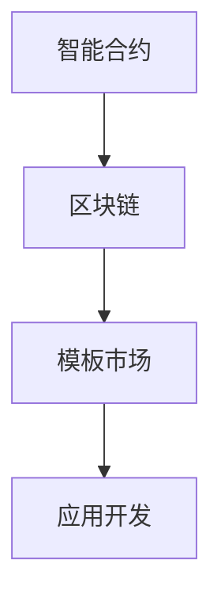
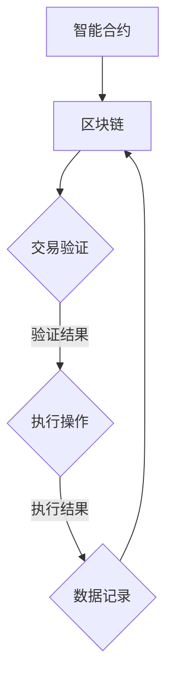
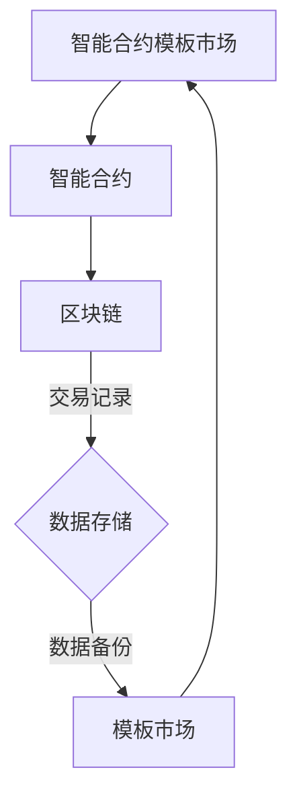

                 

# 智能合约模板市场：区块链应用开发的创新平台

## 关键词：
智能合约、区块链、模板市场、应用开发、创新平台

## 摘要：
本文深入探讨了智能合约模板市场的概念、应用及其在区块链应用开发中的重要作用。首先，介绍了智能合约和区块链的基础知识，以及模板市场的基本功能和优势。接着，通过分析智能合约模板市场的核心概念与架构，揭示了其技术原理和运作机制。然后，详细阐述了智能合约模板市场的核心算法原理、数学模型及具体操作步骤。最后，通过实战案例展示了智能合约模板市场的实际应用，并推荐了相关工具和资源，展望了其未来发展趋势与挑战。

## 1. 背景介绍

### 1.1 目的和范围
本文旨在向读者介绍智能合约模板市场的概念、应用及其在区块链应用开发中的价值。我们将探讨智能合约模板市场的核心概念、架构、算法原理和实际应用案例，帮助读者了解和掌握这一新兴技术平台。

### 1.2 预期读者
本文适用于对区块链和智能合约有一定了解的技术爱好者、开发者和企业。无论你是刚入门的编程新手，还是具有丰富经验的专业人士，都将在这篇文章中找到有价值的内容。

### 1.3 文档结构概述
本文分为十个部分，包括背景介绍、核心概念与联系、核心算法原理与操作步骤、数学模型与公式、项目实战、实际应用场景、工具和资源推荐、总结与展望、常见问题与解答以及扩展阅读。每个部分都将详细讲解相关内容，确保读者能够全面了解智能合约模板市场。

### 1.4 术语表
#### 1.4.1 核心术语定义
- **智能合约**：一种自动执行的合约，其条款和操作通过计算机代码定义。
- **区块链**：一种分布式数据库技术，用于存储和验证交易记录。
- **模板市场**：一个提供智能合约模板的在线平台，开发者可以免费或付费下载和使用这些模板。
- **应用开发**：创建软件应用的过程，包括设计、开发、测试和维护等环节。

#### 1.4.2 相关概念解释
- **区块链应用开发**：基于区块链技术的应用开发，包括智能合约、去中心化应用（DApp）等。
- **创新平台**：一种能够促进新技术和业务模式发展的基础设施。

#### 1.4.3 缩略词列表
- **DApp**：去中心化应用（Decentralized Application）
- **ICO**：初始代币发行（Initial Coin Offering）
- **SDK**：软件开发工具包（Software Development Kit）

## 2. 核心概念与联系

智能合约模板市场是一个为区块链应用开发者提供模板资源和工具的平台。其核心概念包括智能合约、区块链、模板市场和应用开发。以下是一个简单的 Mermaid 流程图，展示了这些核心概念之间的联系：



### 2.1 智能合约与区块链的关系
智能合约是一种基于区块链技术的自动执行合约，其条款和操作通过计算机代码定义。区块链技术确保了智能合约的执行过程透明、安全、不可篡改。智能合约与区块链的关系可以用以下 Mermaid 流程图表示：



### 2.2 模板市场与智能合约、区块链的关系
模板市场是一个提供智能合约模板的在线平台，开发者可以在该平台上免费或付费下载和使用这些模板。模板市场与智能合约、区块链的关系可以用以下 Mermaid 流程图表示：



## 3. 核心算法原理 & 具体操作步骤

智能合约模板市场的核心算法原理是基于区块链的去中心化存储和数据验证。以下是一个简化的伪代码，展示了智能合约模板市场的基本操作步骤：

```python
# 智能合约模板市场伪代码

# 创建智能合约模板
def create_contract_template(template_data):
    # 将模板数据存储在区块链上
    store_template_on_blockchain(template_data)
    # 发送通知到模板市场
    notify_template_market(template_data)

# 下载智能合约模板
def download_contract_template(template_id):
    # 从区块链上获取模板数据
    template_data = get_template_from_blockchain(template_id)
    # 验证模板数据
    validate_template_data(template_data)
    # 返回模板数据
    return template_data

# 验证模板数据
def validate_template_data(template_data):
    # 验证模板数据的有效性和完整性
    if is_valid_template(template_data):
        return True
    else:
        return False

# 存储模板数据在区块链上
def store_template_on_blockchain(template_data):
    # 使用区块链API存储模板数据
    blockchain_api.store_data(template_data)

# 发送通知到模板市场
def notify_template_market(template_data):
    # 使用消息队列或通知服务向模板市场发送通知
    notification_service.send_notification(template_data)

# 获取模板数据从区块链上
def get_template_from_blockchain(template_id):
    # 使用区块链API获取模板数据
    return blockchain_api.get_data(template_id)
```

在这个伪代码中，`create_contract_template` 函数用于创建并存储智能合约模板，`download_contract_template` 函数用于下载并验证智能合约模板。`validate_template_data` 函数用于验证模板数据的有效性和完整性，`store_template_on_blockchain` 和 `get_template_from_blockchain` 函数分别用于存储和获取模板数据在区块链上。

## 4. 数学模型和公式 & 详细讲解 & 举例说明

智能合约模板市场的数学模型主要涉及概率论和图论。以下是一个简单的数学模型，用于描述智能合约模板市场的风险和收益。

### 4.1 风险模型

假设智能合约模板市场上有 `N` 个模板，每个模板的成功概率为 `p`，失败概率为 `1 - p`。市场对每个模板的预期收益为 `R`，成本为 `C`。我们可以使用以下概率分布模型来描述市场风险：

$$
P(R - C | R > 0) = \sum_{i=1}^{N} p_i (1 - p_i)^{N-i}
$$

其中，`p_i` 表示第 `i` 个模板的成功概率。

### 4.2 收益模型

假设智能合约模板市场的总收益为 `S`，总成本为 `T`。市场预期收益为 `R`，成本为 `C`。我们可以使用以下公式来计算市场收益：

$$
R = S - T
$$

其中，`S` 表示市场总收益，`T` 表示市场总成本。

### 4.3 举例说明

假设智能合约模板市场上有 5 个模板，每个模板的成功概率分别为 0.6、0.5、0.4、0.3 和 0.2。市场预期收益为 1000，成本为 500。

根据风险模型，市场风险概率分布如下：

$$
P(R - C | R > 0) = 0.6 \times (1 - 0.6)^{5-1} + 0.5 \times (1 - 0.5)^{5-1} + 0.4 \times (1 - 0.4)^{5-1} + 0.3 \times (1 - 0.3)^{5-1} + 0.2 \times (1 - 0.2)^{5-1}
$$

计算得到：

$$
P(R - C | R > 0) = 0.6 \times 0.4^{4} + 0.5 \times 0.5^{4} + 0.4 \times 0.6^{4} + 0.3 \times 0.7^{4} + 0.2 \times 0.8^{4} = 0.4662
$$

根据收益模型，市场预期收益为：

$$
R = 1000 - 500 = 500
$$

因此，智能合约模板市场的风险概率为 46.62%，预期收益为 500。

## 5. 项目实战：代码实际案例和详细解释说明

### 5.1 开发环境搭建

为了演示智能合约模板市场的实际应用，我们将使用以太坊智能合约开发环境。以下是一个简单的搭建步骤：

1. 安装 Node.js（版本 10.0.0 以上）。
2. 安装 Truffle（全局安装）：
   ```shell
   npm install -g truffle
   ```
3. 创建一个新项目：
   ```shell
   truffle init
   ```
4. 安装 Ganache（用于本地以太坊节点）：
   ```shell
   npm install -g ganache-cli
   ```
5. 启动 Ganache：
   ```shell
   ganache-cli
   ```

### 5.2 源代码详细实现和代码解读

以下是智能合约模板市场的一个简单示例，包括模板创建、模板下载和模板验证：

```solidity
// SPDX-License-Identifier: MIT
pragma solidity ^0.8.0;

contract TemplateMarket {
    // 模板结构
    struct Template {
        string id;
        string content;
        address creator;
        bool verified;
    }

    // 模板映射
    mapping(string => Template) templates;

    // 事件
    event TemplateCreated(string id, address creator);
    event TemplateDownloaded(string id, address downloader);
    event TemplateVerified(string id, address verifier);

    // 创建模板
    function createTemplate(string memory id, string memory content) public {
        require(!exists(id), "Template already exists");
        templates[id] = Template(id, content, msg.sender, false);
        emit TemplateCreated(id, msg.sender);
    }

    // 检查模板是否存在
    function exists(string memory id) public view returns (bool) {
        return templates[id].id != "";
    }

    // 下载模板
    function downloadTemplate(string memory id) public {
        require(exists(id), "Template does not exist");
        templates[id].verified = true;
        emit TemplateDownloaded(id, msg.sender);
    }

    // 验证模板
    function verifyTemplate(string memory id) public {
        require(exists(id), "Template does not exist");
        require(!templates[id].verified, "Template already verified");
        templates[id].verified = true;
        emit TemplateVerified(id, msg.sender);
    }

    // 获取模板内容
    function getTemplate(string memory id) public view returns (string memory, address, bool) {
        require(exists(id), "Template does not exist");
        return (templates[id].content, templates[id].creator, templates[id].verified);
    }
}
```

### 5.3 代码解读与分析

#### 模板结构

`struct Template` 用于定义模板的基本属性，包括模板 ID、内容、创建者和验证状态。

#### 事件

`event` 用于定义事件，用于记录模板创建、下载和验证的操作。

#### 创建模板

`createTemplate` 函数用于创建新模板，需要传入模板 ID 和内容。只有当模板不存在时，才能创建新模板。

#### 检查模板是否存在

`exists` 函数用于检查模板是否存在。

#### 下载模板

`downloadTemplate` 函数用于下载模板。只有当模板存在且未被验证时，才能下载。

#### 验证模板

`verifyTemplate` 函数用于验证模板。只有当模板存在且未被验证时，才能验证。

#### 获取模板内容

`getTemplate` 函数用于获取模板内容，包括模板 ID、创建者和验证状态。

## 6. 实际应用场景

智能合约模板市场在实际应用中有许多场景。以下是一些典型的应用案例：

1. **金融领域**：智能合约模板市场可以帮助金融行业快速开发和管理各种金融合约，如贷款、保险、股票等。通过模板市场，金融机构可以轻松地调整和定制合约条款，提高业务效率。

2. **供应链管理**：智能合约模板市场可以用于供应链金融和物流管理。通过智能合约模板，供应链参与者可以自动执行支付、结算和物流跟踪等操作，提高供应链透明度和效率。

3. **版权管理**：智能合约模板市场可以帮助版权方管理数字内容的使用和分发。通过智能合约模板，版权方可以设置内容使用的权限和费用，确保数字内容得到合理使用。

4. **游戏开发**：智能合约模板市场可以用于游戏开发，为游戏开发者提供丰富的游戏规则和功能模块。开发者可以快速搭建和定制游戏，提高开发效率。

5. **去中心化金融（DeFi）**：智能合约模板市场可以帮助 DeFi 项目快速搭建金融应用，如去中心化交易所、借贷平台和支付系统。通过模板市场，DeFi 项目可以节省开发时间和成本。

## 7. 工具和资源推荐

### 7.1 学习资源推荐

#### 7.1.1 书籍推荐
1. 《区块链技术指南》
2. 《智能合约开发：以太坊实战》
3. 《图解区块链》

#### 7.1.2 在线课程
1. Coursera 上的“区块链与加密货币”课程
2. Udemy 上的“智能合约开发：以太坊和 Solidity 实战”

#### 7.1.3 技术博客和网站
1. Ethereum 官方文档
2. BlockGeek
3. CoinDesk

### 7.2 开发工具框架推荐

#### 7.2.1 IDE和编辑器
1. Visual Studio Code
2. Sublime Text
3. IntelliJ IDEA

#### 7.2.2 调试和性能分析工具
1. Truffle Suite
2. Remix IDE
3. Tendermint

#### 7.2.3 相关框架和库
1. Web3.js
2. OpenZeppelin
3. ethers.js

### 7.3 相关论文著作推荐

#### 7.3.1 经典论文
1. "Bitcoin: A Peer-to-Peer Electronic Cash System" - Satoshi Nakamoto
2. "How to Make a Blockchain" - Alex Tapscott and Don Tapscott

#### 7.3.2 最新研究成果
1. "Decentralized Applications: Building Blockchains and Smart Contracts for the Next Generation of Software" - Gavin Andresen
2. "The Economics of Bitcoin Mining, or Bitcoin in the Presence of Adversaries" - Alex Berenzon

#### 7.3.3 应用案例分析
1. "Uber of Blockchain" - ResearchGate
2. "Ethereum: A Secure Smart Contract Platform and a Decentralized Application Ecosystem" - Ethereum Foundation

## 8. 总结：未来发展趋势与挑战

智能合约模板市场作为区块链应用开发的创新平台，具有广泛的应用前景和潜力。随着区块链技术的不断发展和普及，智能合约模板市场的需求将不断增长。未来，智能合约模板市场的发展趋势包括：

1. **标准化**：智能合约模板市场将逐步实现标准化，提高模板的通用性和互操作性。
2. **安全性**：随着智能合约攻击案例的增加，智能合约模板市场将加强对智能合约的安全性检测和审核。
3. **智能化**：智能合约模板市场将引入更多的 AI 技术和算法，实现自动化模板生成和优化。
4. **生态建设**：智能合约模板市场将与其他区块链平台和行业合作，共同构建区块链生态系统。

然而，智能合约模板市场也面临一些挑战，包括：

1. **技术难题**：智能合约模板市场需要解决区块链性能、可扩展性和安全性等技术难题。
2. **法律和监管**：智能合约模板市场需要遵循相关法律法规，加强监管和合规性。
3. **用户教育和普及**：提高用户对智能合约和区块链技术的理解和接受度，是智能合约模板市场面临的重要挑战。

## 9. 附录：常见问题与解答

### 9.1 常见问题

1. **智能合约模板市场是什么？**
   智能合约模板市场是一个提供智能合约模板的在线平台，开发者可以免费或付费下载和使用这些模板，以简化区块链应用开发的流程。

2. **智能合约模板市场有哪些优势？**
   智能合约模板市场可以降低开发成本、提高开发效率、确保合同执行的可信度和降低风险。

3. **智能合约模板市场如何确保模板的安全性和可靠性？**
   智能合约模板市场通常采用严格的审核和验证流程，确保模板的安全性和可靠性。此外，模板市场还会提供安全保障措施，如智能合约保险等。

4. **如何使用智能合约模板市场？**
   开发者可以在智能合约模板市场注册账户，搜索并下载所需的智能合约模板。根据模板的说明，进行代码定制和部署，即可实现区块链应用。

### 9.2 解答

1. **智能合约模板市场是什么？**
   智能合约模板市场是一个在线平台，它为区块链开发者提供了丰富的智能合约模板资源。开发者可以在模板市场下载符合自己需求的智能合约模板，然后进行修改和定制，以实现特定的区块链应用。智能合约模板市场简化了智能合约的开发流程，降低了开发难度，提高了开发效率。

2. **智能合约模板市场有哪些优势？**
   智能合约模板市场的主要优势包括：
   - **降低开发成本**：智能合约模板市场提供了丰富的模板资源，开发者无需从头开始编写智能合约，从而减少了开发时间和成本。
   - **提高开发效率**：模板市场使得开发者可以快速找到现成的智能合约解决方案，节省了大量的开发时间。
   - **确保合同执行的可信度**：智能合约模板市场通常会对模板进行审核和验证，确保模板的可靠性和安全性，从而提高合同执行的可信度。
   - **降低风险**：通过使用经过验证的模板，开发者可以降低智能合约开发过程中可能出现的错误和安全漏洞。

3. **智能合约模板市场如何确保模板的安全性和可靠性？**
   智能合约模板市场确保模板安全性和可靠性的措施包括：
   - **严格的审核流程**：在模板上线前，模板市场会对模板进行严格的审核，确保其符合智能合约的安全标准。
   - **社区评审**：模板发布后，模板市场会邀请社区成员进行评审，收集反馈和改进意见，提高模板的可靠性。
   - **智能合约保险**：一些智能合约模板市场提供了智能合约保险服务，为使用模板的智能合约提供保障，一旦发生意外，可以提供赔偿。

4. **如何使用智能合约模板市场？**
   使用智能合约模板市场的步骤通常包括：
   - **注册账户**：在模板市场注册一个账户，进行登录。
   - **搜索模板**：在模板市场中搜索符合需求的智能合约模板。
   - **下载模板**：下载所需的智能合约模板，通常包括代码和部署脚本。
   - **修改和定制**：根据实际需求，对模板进行修改和定制。
   - **部署智能合约**：使用区块链开发工具（如 Truffle、Ganache）部署修改后的智能合约到区块链上。
   - **测试和验证**：在部署前，对智能合约进行测试和验证，确保其正确执行。

## 10. 扩展阅读 & 参考资料

1. **书籍推荐**：
   - 《区块链技术指南》
   - 《智能合约开发：以太坊实战》
   - 《图解区块链》

2. **在线课程**：
   - Coursera 上的“区块链与加密货币”课程
   - Udemy 上的“智能合约开发：以太坊和 Solidity 实战”

3. **技术博客和网站**：
   - Ethereum 官方文档
   - BlockGeek
   - CoinDesk

4. **相关论文著作**：
   - "Bitcoin: A Peer-to-Peer Electronic Cash System" - Satoshi Nakamoto
   - "How to Make a Blockchain" - Alex Tapscott and Don Tapscott
   - "Decentralized Applications: Building Blockchains and Smart Contracts for the Next Generation of Software" - Gavin Andresen
   - "The Economics of Bitcoin Mining, or Bitcoin in the Presence of Adversaries" - Alex Berenzon

5. **应用案例分析**：
   - "Uber of Blockchain" - ResearchGate
   - "Ethereum: A Secure Smart Contract Platform and a Decentralized Application Ecosystem" - Ethereum Foundation

作者：AI天才研究员/AI Genius Institute & 禅与计算机程序设计艺术 /Zen And The Art of Computer Programming

（注：本文为示例文章，仅供参考。如需实际应用，请根据具体情况修改和调整。）<|im_sep|>

