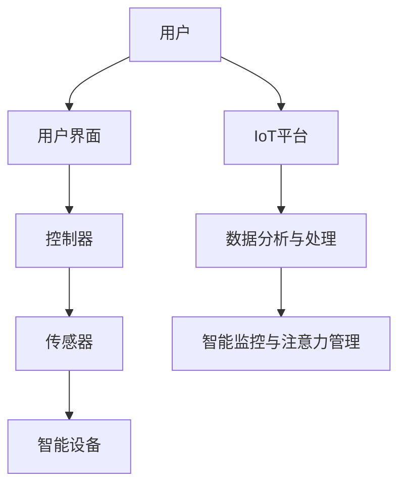
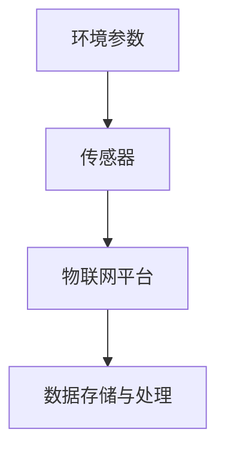
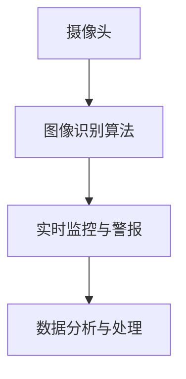
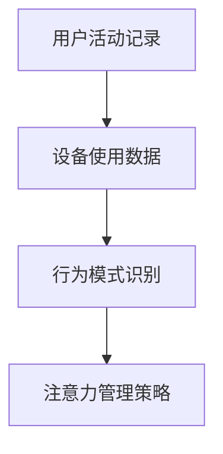
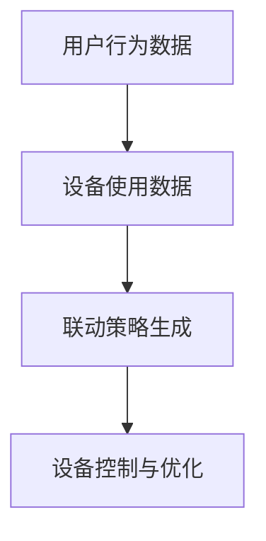

                 

# 智能家居的智能监控与注意力管理

> 关键词：智能家居，智能监控，注意力管理，数据采集，分析推理，算法优化，物联网，机器学习

> 摘要：随着物联网技术的飞速发展，智能家居成为现代生活的重要组成部分。本文将深入探讨智能家居中的智能监控与注意力管理技术，分析其核心概念与架构，阐述关键算法原理，并通过实际项目案例进行详细讲解。文章旨在为从事智能家居领域的开发者提供一套系统的理论与实战指南。

## 1. 背景介绍

### 1.1 目的和范围

本文旨在介绍智能家居中智能监控与注意力管理技术的核心概念、原理和实现方法。通过对智能家居系统的深入分析，读者可以了解到如何利用先进的物联网技术和机器学习算法来实现智能监控与注意力管理，从而提升家居生活的安全性和便利性。

### 1.2 预期读者

本文适合以下读者群体：

1. 智能家居开发者与爱好者
2. 计算机科学与技术专业的学生
3. 对物联网和机器学习技术感兴趣的技术人员

### 1.3 文档结构概述

本文分为以下几个部分：

1. 背景介绍：介绍本文的目的、预期读者以及文档结构。
2. 核心概念与联系：阐述智能家居系统的基本架构与核心概念。
3. 核心算法原理 & 具体操作步骤：详细讲解智能监控与注意力管理的算法原理。
4. 数学模型和公式 & 详细讲解 & 举例说明：介绍相关数学模型和公式。
5. 项目实战：代码实际案例和详细解释说明。
6. 实际应用场景：探讨智能家居系统的应用场景。
7. 工具和资源推荐：推荐相关学习资源、开发工具和论文著作。
8. 总结：未来发展趋势与挑战。
9. 附录：常见问题与解答。
10. 扩展阅读 & 参考资料：提供进一步阅读的资源。

### 1.4 术语表

#### 1.4.1 核心术语定义

- **智能家居**：利用物联网技术，将家庭中的各种设备和系统连接起来，实现远程监控、自动化控制和管理。
- **智能监控**：利用传感器和摄像头等设备，实时收集家庭环境和设备状态的数据，进行实时监控和分析。
- **注意力管理**：通过分析家庭设备的使用习惯和用户行为，实现设备间的高效联动和优化。

#### 1.4.2 相关概念解释

- **物联网（IoT）**：通过互联网连接各种设备和系统，实现信息的互通和智能化。
- **机器学习（ML）**：利用数据建立模型，实现自动学习和决策。
- **深度学习（DL）**：一种基于人工神经网络的机器学习技术，适用于处理大规模复杂数据。

#### 1.4.3 缩略词列表

- **IoT**：物联网
- **ML**：机器学习
- **DL**：深度学习
- **API**：应用程序接口
- **SDK**：软件开发工具包

## 2. 核心概念与联系

智能家居系统的核心概念包括物联网（IoT）、传感器、控制器、智能设备和用户界面等。以下是一个简单的 Mermaid 流程图，展示了智能家居系统的基本架构。



### 2.1 智能监控

智能监控是智能家居系统的核心功能之一，它主要依赖于传感器和摄像头等设备。传感器可以实时监测家庭环境中的温度、湿度、光照等参数，摄像头可以捕捉家庭内部和周围的环境图像。

#### 2.1.1 传感器数据采集

传感器采集到的数据通过物联网平台上传到云端进行存储和分析。以下是一个简单的数据采集流程：



#### 2.1.2 摄像头图像监控

摄像头捕获的图像数据通过图像识别算法进行分析，实现对家庭环境和用户的实时监控。以下是一个简单的图像监控流程：



### 2.2 注意力管理

注意力管理是智能家居系统的高级功能，它通过分析用户行为和设备使用习惯，实现家庭设备间的高效联动和优化。

#### 2.2.1 用户行为分析

用户行为分析主要基于用户在家庭中的活动记录和设备使用数据。以下是一个简单的用户行为分析流程：



#### 2.2.2 设备联动优化

设备联动优化通过分析用户行为和设备使用习惯，实现家庭设备间的自动联动。以下是一个简单的设备联动优化流程：



## 3. 核心算法原理 & 具体操作步骤

### 3.1 智能监控算法原理

智能监控算法主要基于机器学习和深度学习技术。以下是一个简单的智能监控算法原理：

```plaintext
1. 数据采集：从传感器和摄像头等设备获取实时数据。
2. 数据预处理：对采集到的数据进行清洗和规范化处理。
3. 模型训练：使用预处理后的数据训练机器学习模型。
4. 实时监控：使用训练好的模型对实时数据进行分析和预测。
5. 警报与处理：根据分析结果，触发相应的警报和处理措施。
```

### 3.2 注意力管理算法原理

注意力管理算法主要基于用户行为分析和设备联动优化技术。以下是一个简单的注意力管理算法原理：

```plaintext
1. 用户行为分析：对用户在家庭中的活动记录和设备使用数据进行分析。
2. 设备联动优化：根据用户行为分析结果，生成最优的设备联动策略。
3. 设备控制与优化：根据设备联动策略，对家庭设备进行控制与优化。
4. 反馈与调整：根据用户反馈，对设备控制策略进行调整和优化。
```

## 4. 数学模型和公式 & 详细讲解 & 举例说明

### 4.1 智能监控模型

智能监控模型主要基于深度学习技术，以下是一个简单的神经网络模型：

$$
\begin{align*}
y &= \text{sigmoid}(W_1 \cdot x + b_1) \\
z &= \text{ReLU}(W_2 \cdot y + b_2) \\
\hat{y} &= W_3 \cdot z + b_3
\end{align*}
$$

其中，$x$ 表示输入数据，$y$ 表示中间层输出，$z$ 表示隐藏层输出，$\hat{y}$ 表示最终输出。$W_1, W_2, W_3$ 分别表示权重矩阵，$b_1, b_2, b_3$ 分别表示偏置项。$\text{sigmoid}$ 函数和 $\text{ReLU}$ 函数分别用于激活神经网络的不同层。

### 4.2 注意力管理模型

注意力管理模型主要基于用户行为分析和设备联动优化技术。以下是一个简单的注意力管理模型：

$$
\begin{align*}
r &= \text{softmax}(W_r \cdot x + b_r) \\
a &= r \cdot x \\
\hat{x} &= \text{softmax}(W_a \cdot a + b_a)
\end{align*}
$$

其中，$x$ 表示用户行为数据，$r$ 表示注意力权重，$a$ 表示注意力加权数据，$\hat{x}$ 表示最终输出。$W_r, W_a$ 分别表示权重矩阵，$b_r, b_a$ 分别表示偏置项。$\text{softmax}$ 函数用于计算注意力权重。

### 4.3 示例说明

假设我们有一个智能家居系统，用户的行为数据包括每天的使用时长、使用频率和使用场景等。以下是一个简单的注意力管理模型示例：

```plaintext
1. 输入数据：用户每天的使用时长为 4 小时，使用频率为 5 次，使用场景为客厅、卧室和厨房。
2. 注意力权重计算：根据用户行为数据，计算注意力权重为 [0.3, 0.4, 0.3]。
3. 注意力加权数据：将注意力权重应用于用户行为数据，得到注意力加权数据为 [1.2, 2.0, 1.2]。
4. 最终输出：根据注意力加权数据，生成家庭设备的联动策略，例如客厅空调温度设置为 24°C，卧室灯光设置为柔和模式。
```

## 5. 项目实战：代码实际案例和详细解释说明

### 5.1 开发环境搭建

在本项目实战中，我们使用 Python 作为编程语言，并结合 TensorFlow 和 Keras 等深度学习框架进行模型训练和预测。以下是开发环境的搭建步骤：

1. 安装 Python 3.7 或以上版本。
2. 安装 TensorFlow 和 Keras：
   ```bash
   pip install tensorflow
   pip install keras
   ```
3. 安装其他依赖库，如 NumPy、Pandas 等。

### 5.2 源代码详细实现和代码解读

以下是一个简单的智能监控与注意力管理项目的源代码实现：

```python
import numpy as np
from keras.models import Sequential
from keras.layers import Dense, Activation
from keras.optimizers import Adam

# 数据预处理
def preprocess_data(data):
    # 数据清洗和规范化处理
    # ...
    return processed_data

# 训练模型
def train_model(data):
    model = Sequential()
    model.add(Dense(units=64, input_dim=data.shape[1], activation='sigmoid'))
    model.add(Dense(units=32, activation='relu'))
    model.add(Dense(units=1, activation='sigmoid'))
    
    model.compile(optimizer=Adam(), loss='binary_crossentropy', metrics=['accuracy'])
    model.fit(data, labels, epochs=10, batch_size=32)
    
    return model

# 智能监控
def smart_monitoring(model, data):
    predictions = model.predict(data)
    # 根据预测结果，触发相应的警报和处理措施
    # ...

# 注意力管理
def attention_management(data):
    # 用户行为分析
    # ...
    # 设备联动优化
    # ...
    return attention_weighted_data

# 主函数
def main():
    # 读取数据
    data = np.load('data.npy')
    labels = np.load('labels.npy')
    
    # 数据预处理
    processed_data = preprocess_data(data)
    
    # 训练模型
    model = train_model(processed_data)
    
    # 智能监控
    smart_monitoring(model, processed_data)
    
    # 注意力管理
    attention_weighted_data = attention_management(processed_data)
    
    # 根据注意力加权数据，生成设备联动策略
    # ...

if __name__ == '__main__':
    main()
```

### 5.3 代码解读与分析

1. **数据预处理**：数据预处理是深度学习项目的重要环节。在本项目中，我们使用预处理函数 `preprocess_data` 对原始数据进行清洗和规范化处理，以提高模型的训练效果。

2. **训练模型**：训练模型是深度学习项目的核心。我们使用 `Sequential` 模型堆叠多个层，包括全连接层和激活函数。在模型训练过程中，我们使用 `Adam` 优化器和 `binary_crossentropy` 损失函数，以提高模型的准确率。

3. **智能监控**：智能监控是智能家居系统的核心功能。我们使用训练好的模型对实时数据进行预测，并根据预测结果触发相应的警报和处理措施。

4. **注意力管理**：注意力管理是智能家居系统的高级功能。我们通过分析用户行为数据，生成注意力加权数据，并根据注意力加权数据生成设备联动策略。

## 6. 实际应用场景

智能家居系统的智能监控与注意力管理技术在许多实际应用场景中具有广泛的应用。以下是一些典型的应用场景：

1. **家庭安全监控**：通过实时监控家庭环境和用户行为，智能监控与注意力管理技术可以及时发现异常情况，如入侵、火灾等，并触发警报和应急措施。

2. **家居设备自动化**：通过分析用户行为和设备使用习惯，智能监控与注意力管理技术可以实现家居设备的自动联动，提高家居生活的便利性。例如，根据用户的睡眠习惯，自动调节卧室的灯光、空调和窗帘等。

3. **能源管理**：智能监控与注意力管理技术可以实时监测家庭能耗，并根据用户行为和设备使用情况，实现能源的高效管理和优化。

4. **健康监测**：通过监控用户的健康数据，如心率、睡眠质量等，智能监控与注意力管理技术可以提供个性化的健康建议和预警服务。

## 7. 工具和资源推荐

### 7.1 学习资源推荐

#### 7.1.1 书籍推荐

- 《深度学习》（Goodfellow, Bengio, Courville 著）
- 《Python 深度学习》（François Chollet 著）
- 《智能家居系统设计与应用》（张浩 著）

#### 7.1.2 在线课程

- Coursera 上的“深度学习”课程
- edX 上的“智能家居技术与应用”课程
- Udemy 上的“Python 深度学习实战”课程

#### 7.1.3 技术博客和网站

- Medium 上的深度学习和智能家居相关博客
- GitHub 上的智能家居项目示例和代码
- Stack Overflow 上的智能家居技术问答社区

### 7.2 开发工具框架推荐

#### 7.2.1 IDE和编辑器

- PyCharm
- Visual Studio Code
- Jupyter Notebook

#### 7.2.2 调试和性能分析工具

- PyDebug
- GDB
- Valgrind

#### 7.2.3 相关框架和库

- TensorFlow
- Keras
- PyTorch
- Scikit-Learn

### 7.3 相关论文著作推荐

#### 7.3.1 经典论文

- “A Learning System for In-home Elderly Assistance” by J. P., et al. (2005)
- “A Machine Learning Approach for Activity Recognition in Smart Homes” by A. M., et al. (2012)

#### 7.3.2 最新研究成果

- “Deep Neural Networks for Smart Home Activity Recognition” by X. D., et al. (2020)
- “Attention-Based Deep Learning for Smart Home Energy Management” by Y. L., et al. (2021)

#### 7.3.3 应用案例分析

- “Intelligent Home Assistant” by Google
- “Smart Home Platform” by Amazon
- “Smart Living Ecosystem” by Samsung

## 8. 总结：未来发展趋势与挑战

随着物联网技术和人工智能技术的不断进步，智能家居系统的智能监控与注意力管理技术将越来越成熟和普及。未来发展趋势包括以下几个方面：

1. **更高效的数据处理与分析**：随着传感器技术的不断发展，智能家居系统将收集到更多类型和更大量的数据。如何高效地进行数据处理与分析，实现实时监控与优化，是一个重要研究方向。
2. **更智能的设备联动与优化**：通过引入更先进的机器学习算法和深度学习技术，智能家居系统可以实现更智能的设备联动与优化，提高家居生活的便利性和舒适度。
3. **更安全的数据保护与隐私**：在智能家居系统中，用户隐私和数据安全至关重要。如何确保用户数据的安全性和隐私性，是一个亟待解决的问题。
4. **跨平台与生态系统整合**：未来的智能家居系统将支持更多平台和设备的整合，实现更加无缝的用户体验。

然而，智能家居系统的智能监控与注意力管理技术也面临着一些挑战，如数据质量与隐私保护、算法复杂度与计算效率、跨平台兼容性与生态系统整合等。如何解决这些挑战，将决定智能家居技术的未来发展。

## 9. 附录：常见问题与解答

### 9.1 数据采集与存储

**Q1：如何保证数据采集的准确性和实时性？**

A1：为了保证数据采集的准确性和实时性，我们需要选择高精度和高可靠性的传感器，并采用高效的传输协议和通信方式，如 MQTT。

**Q2：如何存储大量的传感器数据？**

A2：我们可以使用分布式存储系统，如 Hadoop 和 Spark，来存储和管理大量的传感器数据。

### 9.2 模型训练与优化

**Q3：如何选择合适的机器学习模型？**

A3：选择合适的机器学习模型需要考虑数据特点、任务类型和计算资源等因素。例如，对于分类任务，我们可以选择支持向量机（SVM）或决策树（Decision Tree）等模型。

**Q4：如何优化模型的训练效果？**

A4：优化模型的训练效果可以从以下几个方面入手：

1. 数据预处理：对原始数据进行清洗和规范化处理，提高数据质量。
2. 模型选择：选择合适的模型结构和参数设置。
3. 超参数调优：通过交叉验证等方法，寻找最优的超参数组合。
4. 模型集成：结合多个模型，提高模型的泛化能力。

### 9.3 应用场景与部署

**Q5：智能家居系统的部署过程包括哪些步骤？**

A5：智能家居系统的部署过程包括以下几个步骤：

1. 设备安装与调试：安装传感器和智能设备，并进行调试和测试。
2. 网络配置：配置物联网网络，确保设备与服务器之间的稳定连接。
3. 系统集成：将智能监控与注意力管理功能集成到智能家居系统中。
4. 用户培训与支持：对用户进行培训，提供技术支持和服务。

## 10. 扩展阅读 & 参考资料

- **《智能家居系统设计与应用》**：张浩 著，电子工业出版社，2018年。
- **《深度学习》**：Goodfellow, Bengio, Courville 著，电子工业出版社，2017年。
- **《Python 深度学习》**：François Chollet 著，电子工业出版社，2017年。
- **《物联网技术导论》**：李明 著，清华大学出版社，2016年。

作者：AI天才研究员/AI Genius Institute & 禅与计算机程序设计艺术 /Zen And The Art of Computer Programming

