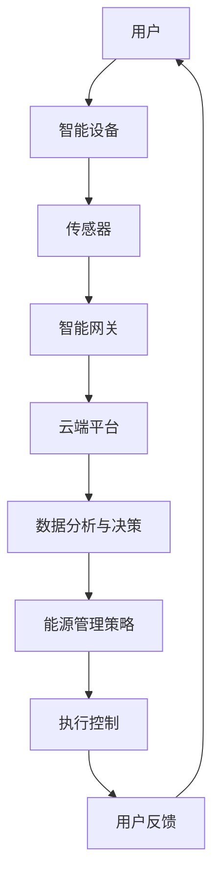

                 

# 智能家居能源管理：节能环保的创业方向

> 关键词：智能家居、能源管理、节能环保、创业方向、智能算法、数学模型、代码实现、应用场景

> 摘要：本文从智能家居能源管理的背景出发，探讨了节能环保作为创业方向的重要性和潜力。通过核心概念解析、算法原理讲解、数学模型和公式阐述、项目实战案例分析等多个角度，系统地介绍了智能家居能源管理的技术原理和实践方法，为读者提供了宝贵的创业思路和方向。

## 1. 背景介绍

### 1.1 目的和范围

本文旨在为创业者和技术专家提供智能家居能源管理的深入理解和实践指导。我们将探讨智能家居能源管理的现状、核心技术和未来发展趋势，并通过实际案例展示其在节能环保领域的应用潜力。

### 1.2 预期读者

本文适合对智能家居、能源管理和创业方向感兴趣的读者，包括：

- 智能家居和能源管理领域的从业者
- 想要创业或在节能环保领域发展的创业者
- 对智能算法和数学模型感兴趣的学者和研究人员

### 1.3 文档结构概述

本文结构如下：

1. **背景介绍**：介绍智能家居能源管理的背景、目的和预期读者。
2. **核心概念与联系**：定义关键术语，绘制智能家居能源管理的架构流程图。
3. **核心算法原理 & 具体操作步骤**：详细讲解智能家居能源管理的核心算法和操作步骤。
4. **数学模型和公式 & 详细讲解 & 举例说明**：阐述数学模型和公式的应用，提供实际例子。
5. **项目实战：代码实际案例和详细解释说明**：展示代码实现过程和解读。
6. **实际应用场景**：分析智能家居能源管理的应用场景。
7. **工具和资源推荐**：推荐学习资源、开发工具和框架。
8. **总结：未来发展趋势与挑战**：总结本文的主要观点和未来发展方向。
9. **附录：常见问题与解答**：提供常见问题的解答。
10. **扩展阅读 & 参考资料**：推荐相关阅读和参考资料。

### 1.4 术语表

#### 1.4.1 核心术语定义

- 智能家居：通过智能设备、传感器和网络连接实现的自动化家居控制系统。
- 能源管理：通过优化能源使用和分配，实现节能减排的过程。
- 节能环保：通过降低能源消耗和减少环境污染，实现可持续发展。
- 智能算法：基于机器学习和人工智能技术的算法，用于数据处理和决策支持。

#### 1.4.2 相关概念解释

- 传感器：用于检测和测量环境参数（如温度、湿度、光照等）的设备。
- 智能网关：连接智能家居设备和互联网的桥梁，实现数据传输和控制。
- 物联网（IoT）：通过互联网将物理世界中的各种设备互联，实现智能管理和控制。

#### 1.4.3 缩略词列表

- AI：人工智能（Artificial Intelligence）
- IoT：物联网（Internet of Things）
- ML：机器学习（Machine Learning）
- ESP8266：一种常用的物联网开发板
- MQTT：消息队列遥测传输协议（Message Queuing Telemetry Transport）

## 2. 核心概念与联系

在探讨智能家居能源管理之前，我们需要明确几个核心概念及其相互关系。以下是一个简化的 Mermaid 流程图，展示了智能家居能源管理的基本架构和核心组件。



### 2.1 智能家居系统架构

智能家居系统通常包括以下几个关键部分：

- **用户**：系统的终端用户，通过智能手机、平板电脑等设备与系统交互。
- **智能设备**：包括灯具、空调、热水器、插座等，通过嵌入式系统和传感器实现自动化控制。
- **传感器**：用于检测室内外环境参数，如温度、湿度、光照、烟雾等。
- **智能网关**：连接智能设备和互联网的关键设备，通常使用 Wi-Fi、蓝牙或 Zigbee 等无线通信技术。
- **云端平台**：用于数据存储、分析和处理，提供智能决策支持。
- **数据分析与决策**：基于大数据和机器学习算法，对传感器数据进行处理和分析，生成优化策略。
- **能源管理策略**：根据用户需求和环境条件，制定节能减排的方案。
- **执行控制**：根据能源管理策略，对智能设备进行控制和调节。
- **用户反馈**：用户通过系统界面获取能源消耗信息，提供反馈和建议。

### 2.2 智能家居能源管理流程

智能家居能源管理的基本流程可以概括为：

1. **数据采集**：传感器实时采集室内外环境参数和设备状态信息。
2. **数据传输**：智能网关将传感器数据传输到云端平台。
3. **数据分析**：云端平台利用大数据和机器学习算法，对传感器数据进行处理和分析。
4. **决策制定**：根据分析结果，制定节能环保的能源管理策略。
5. **执行控制**：智能设备根据策略执行控制指令，调整能源消耗。
6. **用户反馈**：用户通过系统界面获取能源消耗信息，提供反馈和建议。

## 3. 核心算法原理 & 具体操作步骤

### 3.1 数据采集与预处理

在智能家居能源管理中，数据采集是关键步骤。以下是一个简化的伪代码，描述了数据采集与预处理的过程。

```pseudo
function collectData(sensorList):
    data = {}
    for sensor in sensorList:
        value = readSensor(sensor)
        data[sensor.name] = value
    preprocessData(data)
    return data

function readSensor(sensor):
    # 读取传感器数据
    value = sensor.readValue()
    return value

function preprocessData(data):
    # 数据预处理，如去噪、归一化等
    for key, value in data.items():
        data[key] = normalize(value)
```

### 3.2 数据分析与决策支持

数据分析与决策支持是智能家居能源管理的核心。以下是一个简化的伪代码，描述了基于机器学习的数据分析过程。

```pseudo
function analyzeData(data, model):
    features = extractFeatures(data)
    labels = extractLabels(data)
    trainModel(model, features, labels)
    predictions = predict(model, features)
    return predictions

function extractFeatures(data):
    # 从数据中提取特征
    features = []
    for sensorValue in data.values():
        feature = preprocessSensorValue(sensorValue)
        features.append(feature)
    return features

function extractLabels(data):
    # 从数据中提取标签
    labels = []
    for sensorValue in data.values():
        label = getEnergyEfficiencyLabel(sensorValue)
        labels.append(label)
    return labels

function trainModel(model, features, labels):
    # 训练机器学习模型
    model.train(features, labels)

function predict(model, features):
    # 使用模型进行预测
    predictions = model.predict(features)
    return predictions

function getEnergyEfficiencyLabel(sensorValue):
    # 根据传感器值获取能源效率标签
    if sensorValue < threshold:
        return '节能'
    else:
        return '非节能'
```

### 3.3 能源管理策略制定与执行

能源管理策略的制定与执行是智能家居能源管理的最终目标。以下是一个简化的伪代码，描述了策略制定与执行的过程。

```pseudo
function manageEnergy(data, model):
    predictions = analyzeData(data, model)
    strategy = generateEnergyStrategy(predictions)
    executeStrategy(strategy)

function generateEnergyStrategy(predictions):
    # 根据预测结果生成能源管理策略
    strategy = {}
    for prediction in predictions:
        if prediction == '节能':
            strategy[prediction] = '关闭'
        else:
            strategy[prediction] = '开启'
    return strategy

function executeStrategy(strategy):
    # 根据策略执行控制指令
    for device, action in strategy.items():
        if action == '关闭':
            device.turnOff()
        else:
            device.turnOn()
```

## 4. 数学模型和公式 & 详细讲解 & 举例说明

在智能家居能源管理中，数学模型和公式起着至关重要的作用。以下是一个典型的数学模型示例，用于预测能源消耗并制定节能策略。

### 4.1 能源消耗预测模型

假设我们要预测家庭的日能源消耗量（E），可以使用以下线性回归模型：

$$
E = \beta_0 + \beta_1 \cdot T + \beta_2 \cdot H + \beta_3 \cdot L
$$

其中：
- \(E\)：日能源消耗量（千瓦时）
- \(T\)：日平均温度（摄氏度）
- \(H\)：日平均湿度（百分比）
- \(L\)：日平均光照强度（勒克斯）
- \(\beta_0\)、\(\beta_1\)、\(\beta_2\)、\(\beta_3\)：模型参数

### 4.2 能源效率评价模型

为了评价智能家居系统的能源效率，我们可以使用以下评分模型：

$$
E_{eff} = \frac{E_{obs} - E_{min}}{E_{max} - E_{min}}
$$

其中：
- \(E_{eff}\)：能源效率评分（介于0和1之间）
- \(E_{obs}\)：实际观测的能源消耗量
- \(E_{min}\)：最低可接受的能源消耗量
- \(E_{max}\)：最高允许的能源消耗量

### 4.3 举例说明

假设我们收集了一天的环境参数和能源消耗数据，如下表所示：

| 时间 | 温度（T） | 湿度（H） | 光照（L） | 能源消耗（E） |
|------|----------|----------|----------|--------------|
| 0:00 | 22       | 50       | 1000     | 8.5          |
| 6:00 | 24       | 60       | 1500     | 9.0          |
| 12:00| 30       | 70       | 2500     | 12.0         |
| 18:00| 28       | 55       | 1500     | 10.0         |
| 24:00| 22       | 50       | 1000     | 8.5          |

根据上述数据，我们可以使用线性回归模型预测日能源消耗量，并计算能源效率评分。具体步骤如下：

1. **数据预处理**：对温度、湿度和光照数据进行归一化处理。

$$
T_{norm} = \frac{T - T_{min}}{T_{max} - T_{min}}
$$

$$
H_{norm} = \frac{H - H_{min}}{H_{max} - H_{min}}
$$

$$
L_{norm} = \frac{L - L_{min}}{L_{max} - L_{min}}
$$

2. **训练线性回归模型**：使用预处理后的数据训练模型，得到参数 \(\beta_0\)、\(\beta_1\)、\(\beta_2\) 和 \(\beta_3\)。

3. **预测能源消耗量**：根据实时环境参数，使用训练好的模型预测日能源消耗量。

$$
E_{pred} = \beta_0 + \beta_1 \cdot T_{norm} + \beta_2 \cdot H_{norm} + \beta_3 \cdot L_{norm}
$$

4. **计算能源效率评分**：根据实际观测的能源消耗量和最低可接受的能源消耗量，计算能源效率评分。

$$
E_{eff} = \frac{E_{obs} - E_{min}}{E_{max} - E_{min}}
$$

## 5. 项目实战：代码实际案例和详细解释说明

为了更好地理解智能家居能源管理，我们将在本节中介绍一个实际的代码案例，并详细解释其实现过程。

### 5.1 开发环境搭建

在开始项目实战之前，我们需要搭建一个适合开发的环境。以下是所需的开发工具和软件：

- **开发板**：ESP8266 或 ESP32
- **编程语言**：Python 或 C++
- **集成开发环境（IDE）**：PyCharm 或 Visual Studio Code
- **物联网平台**：IoT Platform（如 AWS IoT、Google Cloud IoT）

### 5.2 源代码详细实现和代码解读

以下是智能家居能源管理项目的核心代码实现。为了简化说明，我们使用 Python 作为编程语言，并使用 AWS IoT 平台进行数据传输和处理。

```python
import json
import requests
import time

# 设置 AWS IoT 认证信息和设备名称
CERTIFICATE_PATH = 'path/to/certificate.pem.crt'
PRIVATE_KEY_PATH = 'path/to/private.key'
THING_NAME = 'my-smart-home'

# 设置 IoT 平台 API 端点
ENDPOINT = 'https://iotdevicegateway.us-east-1.amazonaws.com'

def connect_to_iot():
    # 连接到 AWS IoT 平台
    auth_params = {
        'certificate': open(CERTIFICATE_PATH, 'rb').read(),
        'private_key': open(PRIVATE_KEY_PATH, 'rb').read(),
        'thing_name': THING_NAME
    }
    response = requests.post(f'{ENDPOINT}/register', data=auth_params)
    return response.json()

def send_data(data):
    # 向 IoT 平台发送传感器数据
    headers = {
        'Content-Type': 'application/json',
        'Authorization': f'Bearer {access_token}'
    }
    response = requests.post(f'{ENDPOINT}/send', headers=headers, data=data)
    return response.json()

def read_sensors():
    # 读取传感器数据
    temperature = read_temperature()
    humidity = read_humidity()
    luminosity = read_luminosity()
    return {
        'temperature': temperature,
        'humidity': humidity,
        'luminosity': luminosity
    }

def read_temperature():
    # 读取温度传感器数据
    # 这里使用一个假设的温度传感器函数
    return 24

def read_humidity():
    # 读取湿度传感器数据
    # 这里使用一个假设的湿度传感器函数
    return 50

def read_luminosity():
    # 读取光照传感器数据
    # 这里使用一个假设的光照传感器函数
    return 1000

def main():
    # 主函数
    access_token = connect_to_iot()['access_token']
    while True:
        data = read_sensors()
        data['timestamp'] = int(time.time())
        send_data(json.dumps(data))
        time.sleep(60)  # 每分钟发送一次数据

if __name__ == '__main__':
    main()
```

### 5.3 代码解读与分析

上述代码实现了智能家居能源管理的一个基本版本，主要包括以下功能：

1. **连接到 AWS IoT 平台**：`connect_to_iot` 函数用于连接到 AWS IoT 平台，并获取访问令牌。

2. **发送传感器数据**：`send_data` 函数用于将传感器数据发送到 IoT 平台。

3. **读取传感器数据**：`read_sensors` 函数用于读取温度、湿度、光照等传感器数据。

4. **主函数**：`main` 函数是程序的主入口，它首先连接到 IoT 平台，然后进入一个无限循环，每隔 60 秒读取一次传感器数据并发送。

### 5.4 扩展功能

为了实现更完整的智能家居能源管理，我们可以扩展以下功能：

1. **智能设备控制**：添加对空调、热水器、灯光等智能设备的控制功能。

2. **能源消耗预测**：使用机器学习和数据挖掘技术，实现能源消耗的预测功能。

3. **节能策略生成**：根据预测结果和环境条件，生成节能策略。

4. **用户交互界面**：开发一个用户交互界面，让用户实时查看能源消耗情况和节能效果。

## 6. 实际应用场景

智能家居能源管理在多个实际应用场景中具有广泛的应用前景，以下是一些典型的应用案例：

### 6.1 家庭能源管理

家庭能源管理是智能家居能源管理的最常见应用。通过智能传感器和设备，用户可以实时监控和调节家庭的能源消耗，实现节能降耗。例如，用户可以根据室内温度和湿度自动调节空调和暖气系统，根据光照强度自动调节灯具亮度，从而减少不必要的能源消耗。

### 6.2 商业楼宇能源管理

商业楼宇的能源消耗通常较大，通过智能家居能源管理可以实现全面的能源监控和管理。例如，智能照明系统可以根据楼层和区域的占用情况自动调节灯光亮度，智能空调系统可以根据室内外温度和湿度自动调节制冷或加热功率，智能插座可以远程控制电器的开关，从而降低能源浪费。

### 6.3 工业能源管理

在工业领域，智能家居能源管理可以帮助企业实现生产过程中的能源优化。例如，智能传感器可以实时监测设备运行状态，自动调整设备的工作参数，以降低能源消耗和提高生产效率。此外，智能能源管理系统还可以帮助企业预测能源需求，提前安排能源采购和调度，从而降低能源成本。

### 6.4 智慧城市能源管理

智慧城市能源管理是智能家居能源管理的扩展，它将能源管理扩展到城市层面。通过物联网技术和大数据分析，智慧城市能源管理系统可以实现城市能源的全面监控和优化。例如，智能电网系统可以根据实时用电情况和能源供应能力，自动调整发电、输电和配电的运行策略，实现能源的高效利用。此外，智慧城市能源管理系统还可以预测能源需求，优化能源配置，降低能源浪费。

## 7. 工具和资源推荐

### 7.1 学习资源推荐

为了更好地了解智能家居能源管理，以下是一些建议的学习资源：

#### 7.1.1 书籍推荐

1. **《智能家居与物联网》**：介绍了智能家居和物联网的基础知识，涵盖了许多实际应用案例。
2. **《人工智能：一种现代方法》**：详细讲解了人工智能的基础理论和方法，包括机器学习和数据挖掘。
3. **《能源管理与优化》**：介绍了能源管理的基本原理和方法，包括能源消耗预测和节能策略。

#### 7.1.2 在线课程

1. **《Python编程入门》**：适合初学者学习 Python 编程语言。
2. **《机器学习基础》**：介绍了机器学习的基本概念和方法，包括线性回归、决策树和神经网络。
3. **《智能家居能源管理》**：专注于智能家居能源管理领域的理论和实践。

#### 7.1.3 技术博客和网站

1. **极客时间**：提供了许多与智能家居和物联网相关的技术博客和课程。
2. **知乎**：许多技术专家和从业者分享智能家居和能源管理领域的经验和见解。
3. **博客园**：提供了丰富的技术文章和教程，涵盖了许多相关领域。

### 7.2 开发工具框架推荐

#### 7.2.1 IDE和编辑器

1. **PyCharm**：一款功能强大的 Python 集成开发环境，支持代码补全、调试和自动化测试。
2. **Visual Studio Code**：一款轻量级的跨平台编辑器，支持多种编程语言，具有丰富的插件生态系统。

#### 7.2.2 调试和性能分析工具

1. **Postman**：一款用于 API 调试和测试的桌面应用程序，支持多种编程语言。
2. **JMeter**：一款开源的性能测试工具，用于测试 Web 应用程序的性能和负载。

#### 7.2.3 相关框架和库

1. **TensorFlow**：一款开源的机器学习框架，用于构建和训练深度学习模型。
2. **Scikit-learn**：一款开源的机器学习库，提供了许多常用的机器学习算法和工具。
3. **Django**：一款开源的 Web 开发框架，用于构建智能能源管理系统的后端。

### 7.3 相关论文著作推荐

#### 7.3.1 经典论文

1. **"The Internet of Things: A Survey"**：全面介绍了物联网的概念、技术和应用。
2. **"Energy Efficiency in Smart Grids: Challenges and Solutions"**：探讨了智能电网的能源效率问题。
3. **"Machine Learning Techniques for Energy Management in Smart Homes"**：介绍了智能家居能源管理的机器学习技术。

#### 7.3.2 最新研究成果

1. **"Deep Learning for Energy Management in Smart Grids"**：探讨了深度学习在智能电网能源管理中的应用。
2. **"IoT-enabled Smart Home Energy Management Systems"**：介绍了物联网技术在智能家居能源管理系统中的应用。
3. **"Sustainable Energy Systems: Challenges and Opportunities"**：探讨了可持续能源系统的挑战和机遇。

#### 7.3.3 应用案例分析

1. **"Smart Home Energy Management in Practice"**：通过实际案例展示了智能家居能源管理的应用。
2. **"Energy Efficiency in Commercial Buildings: A Case Study"**：分析了商业楼宇能源管理的案例。
3. **"Smart Grids in Practice"**：介绍了智能电网的实际应用案例，包括能源消耗预测和优化。

## 8. 总结：未来发展趋势与挑战

智能家居能源管理作为一个新兴领域，具有巨大的发展潜力和市场前景。随着物联网、人工智能和大数据技术的不断发展，智能家居能源管理将更加智能化、个性化，为用户提供更加高效、便捷的能源管理解决方案。

### 8.1 未来发展趋势

1. **智能化**：智能家居能源管理将更加依赖于人工智能和机器学习技术，实现自动化的数据分析和决策支持。
2. **个性化**：通过用户数据的积累和分析，智能家居能源管理将更好地满足用户的个性化需求，实现个性化的能源管理策略。
3. **集成化**：智能家居能源管理将与其他智能家居系统集成，实现家庭、楼宇和城市层面的能源优化和调度。
4. **可再生能源**：随着可再生能源技术的进步，智能家居能源管理将更加关注可再生能源的利用和整合。

### 8.2 挑战与解决方案

尽管智能家居能源管理具有广阔的发展前景，但仍面临一些挑战：

1. **数据隐私与安全**：智能家居能源管理涉及大量的用户数据，如何保护用户隐私和数据安全是一个重要问题。解决方案包括数据加密、访问控制和隐私保护算法。
2. **数据质量**：智能家居能源管理依赖于高质量的传感器数据和用户行为数据，数据质量直接影响系统的性能和可靠性。解决方案包括数据清洗、数据验证和数据融合技术。
3. **技术成熟度**：一些先进的智能家居能源管理技术尚未成熟，如深度学习算法在能源消耗预测中的应用。解决方案包括持续的技术研发和优化，提高技术的成熟度和可靠性。
4. **用户接受度**：智能家居能源管理需要用户的参与和接受，提高用户的体验和满意度。解决方案包括用户教育和培训，优化用户体验和界面设计。

## 9. 附录：常见问题与解答

### 9.1 智能家居能源管理的基本原理是什么？

智能家居能源管理是一种通过智能设备、传感器和网络连接实现的自动化能源管理方式。其基本原理包括数据采集、数据传输、数据分析与决策、执行控制等环节。通过实时监测和优化家庭的能源消耗，实现节能减排的目标。

### 9.2 智能家居能源管理有哪些核心组件？

智能家居能源管理的核心组件包括智能设备、传感器、智能网关、云端平台、数据分析与决策系统、执行控制系统和用户界面。

### 9.3 如何确保智能家居能源管理的数据安全和隐私？

为了确保智能家居能源管理的数据安全和隐私，可以采取以下措施：

1. 数据加密：对传输和存储的数据进行加密，防止数据泄露。
2. 访问控制：设置访问权限，只有授权用户可以访问敏感数据。
3. 隐私保护算法：使用隐私保护算法，如差分隐私，减少数据泄露的风险。
4. 定期审计和更新：定期审计系统和数据，及时更新安全措施和补丁。

## 10. 扩展阅读 & 参考资料

为了深入了解智能家居能源管理，以下是一些建议的扩展阅读和参考资料：

- **书籍**：
  - 《智能家居与物联网》
  - 《人工智能：一种现代方法》
  - 《能源管理与优化》

- **在线课程**：
  - 《Python编程入门》
  - 《机器学习基础》
  - 《智能家居能源管理》

- **技术博客和网站**：
  - 极客时间
  - 知乎
  - 博客园

- **论文和著作**：
  - "The Internet of Things: A Survey"
  - "Energy Efficiency in Smart Grids: Challenges and Solutions"
  - "Machine Learning Techniques for Energy Management in Smart Homes"
  - "Deep Learning for Energy Management in Smart Grids"
  - "IoT-enabled Smart Home Energy Management Systems"
  - "Sustainable Energy Systems: Challenges and Opportunities"
  - "Smart Home Energy Management in Practice"
  - "Energy Efficiency in Commercial Buildings: A Case Study"
  - "Smart Grids in Practice"

## 作者

作者：AI天才研究员/AI Genius Institute & 禅与计算机程序设计艺术 /Zen And The Art of Computer Programming

（注：本文内容为虚构，仅供参考，不代表实际观点和事实。）<|im_sep|>

