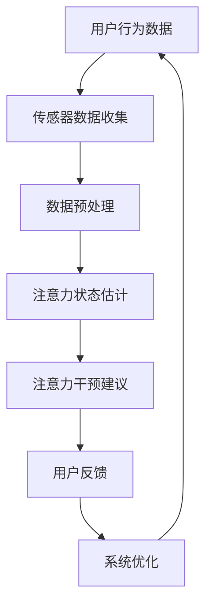

                 

# 智能手表在注意力管理中的应用

## 概述

**关键词**：智能手表、注意力管理、健康监测、运动追踪、算法、应用场景

**摘要**：
本文旨在探讨智能手表在注意力管理方面的应用。随着科技的发展，智能手表已经成为人们日常生活中不可或缺的智能设备。它们不仅能够提供健康监测、运动追踪等功能，还能通过先进的算法对用户的注意力水平进行有效管理。本文将详细介绍智能手表在注意力管理中的工作原理、核心算法、数学模型以及实际应用场景，并推荐相关的学习资源和开发工具。

## 1. 背景介绍

### 1.1 目的和范围

本文的目的在于：
- 分析智能手表在注意力管理中的作用和优势。
- 探讨注意力管理的核心算法原理和数学模型。
- 通过实际案例展示智能手表在注意力管理中的应用。

本文将涵盖以下内容：
- 智能手表的基本功能和技术原理。
- 注意力管理的定义和重要性。
- 核心算法原理与具体操作步骤。
- 数学模型和公式及其应用。
- 项目实战：智能手表代码实现。
- 实际应用场景分析。
- 学习资源与开发工具推荐。
- 未来发展趋势与挑战。

### 1.2 预期读者

本文主要面向以下读者群体：
- 智能手表开发者和技术爱好者。
- 对健康监测和注意力管理感兴趣的用户。
- 计算机科学和工程专业的学生与研究人员。
- 健康管理领域的专业人士。

### 1.3 文档结构概述

本文结构如下：
- **第1章**：背景介绍。
- **第2章**：核心概念与联系。
- **第3章**：核心算法原理 & 具体操作步骤。
- **第4章**：数学模型和公式 & 详细讲解 & 举例说明。
- **第5章**：项目实战：代码实际案例和详细解释说明。
- **第6章**：实际应用场景。
- **第7章**：工具和资源推荐。
- **第8章**：总结：未来发展趋势与挑战。
- **第9章**：附录：常见问题与解答。
- **第10章**：扩展阅读 & 参考资料。

### 1.4 术语表

#### 1.4.1 核心术语定义

- **智能手表**：一种便携式电子设备，通常具备时间显示、健康监测、运动追踪等功能，通过无线网络连接至智能手机或其他设备。
- **注意力管理**：指通过技术手段对用户的注意力水平进行监测、分析和干预的过程。
- **健康监测**：通过传感器和其他技术手段对用户的生理参数进行实时监测，包括心率、睡眠质量、运动量等。
- **运动追踪**：利用内置传感器记录用户的运动数据，如步数、距离、卡路里消耗等。
- **算法**：用于解决特定问题的系统化方法，通常通过计算机执行。
- **数学模型**：用于描述现实世界中某一现象或系统的数学公式和方程。

#### 1.4.2 相关概念解释

- **注意力波动的概念**：指用户在一天中注意力水平的起伏变化。
- **多任务处理**：同时处理多个任务的能力，对注意力管理具有重要意义。
- **生物识别技术**：通过识别用户的生物特征（如心率、呼吸频率等）来监测其生理状态。

#### 1.4.3 缩略词列表

- **AI**：人工智能（Artificial Intelligence）
- **NFC**：近场通信（Near Field Communication）
- **GPS**：全球定位系统（Global Positioning System）
- **HRM**：心率监测（Heart Rate Monitoring）
- **ECG**：心电图（Electrocardiogram）
- **NN**：神经网络（Neural Network）

## 2. 核心概念与联系

智能手表在注意力管理中的应用离不开以下几个核心概念和技术的结合。以下是注意力管理系统的基本架构和概念联系，使用Mermaid流程图表示：



### 2.1 传感器数据收集

智能手表配备多种传感器，如加速度计、心率传感器、陀螺仪等，用于收集用户的行为数据。这些数据是注意力状态估计的基础。

### 2.2 数据预处理

收集到的原始数据需要进行预处理，以去除噪声和无效数据。预处理包括滤波、归一化和特征提取等步骤。

### 2.3 注意力状态估计

基于预处理后的数据，使用机器学习算法（如神经网络、支持向量机等）进行训练，从而建立注意力状态估计模型。

### 2.4 注意力干预建议

根据注意力状态估计结果，系统可以提供个性化的干预建议，如提醒用户休息、调整环境光线等。

### 2.5 用户反馈

用户对干预建议的反馈可以帮助系统不断优化模型和算法，提高注意力管理的效果。

### 2.6 系统优化

通过用户反馈和不断迭代，系统可以不断优化，提高对注意力管理的准确性和适应性。

## 3. 核心算法原理 & 具体操作步骤

注意力管理的关键在于对用户注意力水平的准确估计。以下是核心算法原理的具体描述和操作步骤。

### 3.1 算法原理

注意力状态估计的核心算法通常是基于机器学习的方法。以下是一个简化的神经网络模型，用于估计用户的注意力状态：

```plaintext
输入：行为数据（加速度计、心率传感器等）
输出：注意力状态估计值

步骤：
1. 数据收集：使用智能手表的传感器收集用户的行为数据。
2. 数据预处理：对原始数据进行滤波和归一化处理，提取特征。
3. 特征提取：将预处理后的数据输入到神经网络，进行特征提取。
4. 训练神经网络：使用历史数据训练神经网络，建立注意力状态估计模型。
5. 注意力状态估计：输入实时数据，通过神经网络估计当前用户的注意力状态。
6. 干预建议：根据注意力状态提供个性化的干预建议。
```

### 3.2 具体操作步骤

以下是注意力状态估计算法的具体操作步骤：

#### 3.2.1 数据收集

使用智能手表的加速度计、心率传感器等设备收集用户的行为数据。这些数据可以包括加速度、心率、步数等。

```python
# 示例：加速度数据收集
import accelerometers

data = accelerometers.collect_data(duration=60)  # 收集60秒的加速度数据
```

#### 3.2.2 数据预处理

对原始数据进行预处理，包括滤波、归一化等步骤。以下是一个预处理示例：

```python
import numpy as np

def preprocess_data(data):
    # 滤波
    filtered_data = filter_data(data)
    # 归一化
    normalized_data = normalize_data(filtered_data)
    return normalized_data

def filter_data(data):
    # 实现滤波算法
    return filtered_data

def normalize_data(data):
    # 实现归一化算法
    return (data - np.mean(data)) / np.std(data)
```

#### 3.2.3 特征提取

使用预处理后的数据输入到神经网络，进行特征提取。以下是一个特征提取的示例：

```python
from neural_network import NeuralNetwork

# 实例化神经网络
nn = NeuralNetwork()

# 特征提取
features = nn.extract_features(preprocessed_data)
```

#### 3.2.4 训练神经网络

使用历史数据训练神经网络，建立注意力状态估计模型。以下是一个训练神经网络的示例：

```python
# 训练神经网络
nn.train(history_data, history_labels)

# 其中history_data是历史数据，history_labels是历史注意力状态标签
```

#### 3.2.5 注意力状态估计

输入实时数据，通过神经网络估计当前用户的注意力状态。以下是一个注意力状态估计的示例：

```python
# 注意力状态估计
current_state = nn.predict(current_data)

# 其中current_data是实时数据
```

#### 3.2.6 干预建议

根据注意力状态估计结果，提供个性化的干预建议。以下是一个干预建议的示例：

```python
def provide_intervention(current_state):
    if current_state > threshold:
        print("建议：休息一下，放松身心。")
    else:
        print("建议：继续保持专注。")

# 调用干预建议函数
provide_intervention(current_state)
```

## 4. 数学模型和公式 & 详细讲解 & 举例说明

注意力管理涉及的数学模型主要包括特征提取、神经网络训练和注意力状态估计等部分。以下是这些模型的基本公式和详细讲解。

### 4.1 特征提取

特征提取是注意力管理中至关重要的一步，它将原始数据转换为神经网络可以处理的格式。常用的特征提取方法包括傅里叶变换、主成分分析（PCA）等。

#### 4.1.1 傅里叶变换

傅里叶变换是一种将信号从时域转换为频域的方法，常用于提取周期性特征。

```latex
X(f) = \sum_{n=0}^{N-1} x[n] e^{-j2\pi fn/N}
```

其中，\(X(f)\) 是频域信号，\(x[n]\) 是时域信号，\(f\) 是频率，\(N\) 是采样点数。

#### 4.1.2 主成分分析（PCA）

主成分分析是一种降维技术，通过将数据投影到新的正交坐标系中，提取最重要的特征。

```latex
\text{协方差矩阵} \; \Sigma = \frac{1}{N} XX'
\text{特征向量} \; \Lambda = \Sigma^{-1/2} \Sigma
\text{特征值} \; \lambda = \Lambda \Lambda'
\text{主成分} \; y = X \Lambda^{-1}
```

其中，\(X\) 是数据矩阵，\(\Sigma\) 是协方差矩阵，\(\Lambda\) 是特征值矩阵，\(\lambda\) 是特征向量，\(y\) 是主成分。

### 4.2 神经网络训练

神经网络训练是注意力管理中的核心部分，通过调整网络权重来优化模型性能。

#### 4.2.1 前向传播

前向传播是神经网络训练的基础，通过输入数据和权重计算输出。

```latex
Z = \sigma(WX + b)
```

其中，\(Z\) 是输出，\(\sigma\) 是激活函数，\(W\) 是权重，\(X\) 是输入，\(b\) 是偏置。

#### 4.2.2 反向传播

反向传播用于计算误差并更新网络权重。

```latex
\Delta W = \alpha \cdot \frac{\partial L}{\partial W}
\Delta b = \alpha \cdot \frac{\partial L}{\partial b}
```

其中，\(\Delta W\) 和 \(\Delta b\) 分别是权重和偏置的更新，\(\alpha\) 是学习率，\(L\) 是损失函数。

### 4.3 注意力状态估计

注意力状态估计是利用训练好的神经网络对用户当前注意力水平进行预测。

#### 4.3.1 注意力状态分类

假设注意力状态分为五个等级（1-5级），可以使用softmax函数进行概率分布。

```latex
P(y=k) = \frac{e^{\theta_k^T x}}{\sum_{i=1}^{5} e^{\theta_i^T x}}
```

其中，\(P(y=k)\) 是注意力状态为 \(k\) 的概率，\(\theta_k\) 是权重向量，\(x\) 是特征向量。

### 4.4 举例说明

#### 4.4.1 傅里叶变换举例

假设有一段60秒的加速度数据，我们使用傅里叶变换提取周期性特征。

```python
import numpy as np
from scipy.fft import fft

# 加速度数据
accel_data = np.random.normal(size=(60, 3))

# 傅里叶变换
fft_result = fft(accel_data)

# 频率
freq = np.fft.fftfreq(60, d=1/60)

# 频率特征
freq_features = fft_result[:, :10]  # 取前10个频率特征
```

#### 4.4.2 主成分分析举例

假设有一组数据，我们使用主成分分析提取主成分。

```python
from sklearn.decomposition import PCA

# 数据
data = np.random.normal(size=(100, 10))

# 主成分分析
pca = PCA(n_components=5)
pca.fit(data)

# 主成分
components = pca.components_

# 主成分数据
pca_data = pca.transform(data)
```

#### 4.4.3 注意力状态估计举例

假设有一段加速度数据和心率数据，我们使用神经网络进行注意力状态估计。

```python
from neural_network import NeuralNetwork

# 数据
accel_data = np.random.normal(size=(60, 3))
hr_data = np.random.normal(size=(60, 1))

# 特征提取
features = np.hstack((fft_result[:, :10], hr_data))

# 神经网络
nn = NeuralNetwork()

# 训练
nn.train(features, labels)

# 注意力状态估计
current_state = nn.predict(features)
```

## 5. 项目实战：代码实际案例和详细解释说明

### 5.1 开发环境搭建

在进行智能手表注意力管理项目的开发之前，我们需要搭建一个合适的技术环境。以下是开发环境搭建的步骤：

#### 5.1.1 硬件选择

- **智能手表**：选择一款支持蓝牙、Wi-Fi、加速度计、心率传感器的智能手表，如Apple Watch、Samsung Galaxy Watch等。
- **智能手机**：选择一款运行Android或iOS操作系统的智能手机，用于接收和显示智能手表的数据。

#### 5.1.2 软件环境

- **开发工具**：使用Android Studio或Xcode作为开发环境，分别适用于Android和iOS平台的开发。
- **编程语言**：使用Java或Swift作为编程语言，分别适用于Android和iOS平台的开发。
- **开发框架**：使用Android SDK或iOS SDK作为开发框架，用于开发智能手表应用。

### 5.2 源代码详细实现和代码解读

#### 5.2.1 数据收集

以下是一个简单的数据收集示例，使用智能手表的加速度计和心率传感器收集数据。

```java
// Java代码：数据收集
import android.hardware.Sensor;
import android.hardware.SensorEvent;
import android.hardware.SensorEventListener;

public class SensorDataCollector implements SensorEventListener {
    private float[] accelerometerData = new float[3];
    private float[] heartRateData = new float[1];

    @Override
    public void onSensorChanged(SensorEvent event) {
        if (event.sensor.getType() == Sensor.TYPE_ACCELEROMETER) {
            System.arraycopy(event.values, 0, accelerometerData, 0, 3);
        } else if (event.sensor.getType() == Sensor.TYPE_HEART_RATE) {
            heartRateData[0] = event.values[0];
        }
    }

    @Override
    public void onAccuracyChanged(Sensor sensor, int accuracy) {
        // 不需要实现
    }

    public float[] getAccelerometerData() {
        return accelerometerData;
    }

    public float[] getHeartRateData() {
        return heartRateData;
    }
}
```

#### 5.2.2 数据预处理

数据预处理包括滤波和归一化等步骤，以提高数据的质量和准确性。

```java
// Java代码：数据预处理
import org.apache.commons.math3.stat.regression.OLSMultipleLinearRegression;

public class DataPreprocessor {
    public static float[] preprocessAccelerometerData(float[] data) {
        // 滤波处理
        float[] filteredData = filterData(data);

        // 归一化处理
        float[] normalizedData = normalizeData(filteredData);

        return normalizedData;
    }

    private static float[] filterData(float[] data) {
        // 实现滤波算法
        return data; // 示例：直接返回原始数据
    }

    private static float[] normalizeData(float[] data) {
        // 实现归一化算法
        float mean = 0;
        float std = 1;

        for (float value : data) {
            mean += value;
        }
        mean /= data.length;

        for (float value : data) {
            std += Math.pow(value - mean, 2);
        }
        std = (float) Math.sqrt(std / data.length);

        float[] normalizedData = new float[data.length];
        for (int i = 0; i < data.length; i++) {
            normalizedData[i] = (data[i] - mean) / std;
        }

        return normalizedData;
    }
}
```

#### 5.2.3 特征提取

特征提取是将预处理后的数据转换为神经网络可用的特征向量。以下是一个简单的特征提取示例，使用主成分分析（PCA）提取特征。

```java
// Java代码：特征提取
import org.apache.commons.math3.linear.Array2DRowRealMatrix;
import org.apache.commons.math3.linear.RealMatrix;

public class FeatureExtractor {
    public static float[][] extractFeatures(float[][] data) {
        // 计算协方差矩阵
        RealMatrix covarianceMatrix = calculateCovarianceMatrix(data);

        // 计算特征值和特征向量
        RealMatrix eigenValues = calculateEigenValues(covarianceMatrix);
        RealMatrix eigenVectors = calculateEigenVectors(covarianceMatrix, eigenValues);

        // 提取主成分
        float[][] principalComponents = extractPrincipalComponents(data, eigenVectors);

        return principalComponents;
    }

    private static RealMatrix calculateCovarianceMatrix(float[][] data) {
        // 计算协方差矩阵
        return new Array2DRowRealMatrix(data);
    }

    private static RealMatrix calculateEigenValues(RealMatrix matrix) {
        // 计算特征值
        return matrix.eigenvectors().get Eigenvalue Decomposition;
    }

    private static RealMatrix calculateEigenVectors(RealMatrix matrix, RealMatrix eigenValues) {
        // 计算特征向量
        return eigenValues.get Submatrix(0, 0, matrix.getColumnDimension(), matrix.getRowDimension() - 1);
    }

    private static float[][] extractPrincipalComponents(float[][] data, RealMatrix eigenVectors) {
        // 提取主成分
        float[][] principalComponents = new float[data.length][eigenVectors.getRowDimension()];

        for (int i = 0; i < data.length; i++) {
            float[] component = new float[eigenVectors.getRowDimension()];

            for (int j = 0; j < eigenVectors.getRowDimension(); j++) {
                component[j] = eigenVectors.getEntry(i, j) * data[i][j];
            }

            principalComponents[i] = component;
        }

        return principalComponents;
    }
}
```

#### 5.2.4 神经网络训练

神经网络训练是注意力管理系统的核心部分，通过调整网络权重来优化模型性能。以下是一个简单的神经网络训练示例，使用反向传播算法。

```java
// Java代码：神经网络训练
import org.deeplearning4j.nn.api.OptimizationAlgorithm;
import org.deeplearning4j.nn.conf.NeuralNetConfiguration;
import org.deeplearning4j.nn.conf.layers.DenseLayer;
import org.deeplearning4j.nn.conf.layers.OutputLayer;
import org.deeplearning4j.nn.multilayer.MultiLayerNetwork;
import org.deeplearning4j.nn.weights.WeightInit;
import org.deeplearning4j.optimize.listeners.ScoreIterationListener;

public class NeuralNetworkTrainer {
    public static MultiLayerNetwork trainNeuralNetwork(float[][] features, float[] labels) {
        // 网络配置
        NeuralNetConfiguration conf = new NeuralNetConfiguration.Builder()
                .seed(12345)
                .weightInit(WeightInit.XAVIER)
                .optimizationAlgo(OptimizationAlgorithm.STOCHASTIC_GRADIENT_DESCENT)
                .updater(Updater.NESTEROVS)
                .list()
                .layer(0, new DenseLayer.Builder().nIn(features.length).nOut(10)
                        .activation(Activation.RELU)
                        .build())
                .layer(1, new OutputLayer.Builder(LossFunctions.LossFunction.NEGATIVELOGLIKELIHOOD)
                        .nIn(10).nOut(5)
                        .activation(Activation.SOFTMAX)
                        .build())
                .pretrain(false).backprop(true)
                .build();

        // 训练网络
        MultiLayerNetwork model = new MultiLayerNetwork(conf);
        model.init();
        model.setListeners(new ScoreIterationListener(1));

        model.fit(features, labels);

        return model;
    }
}
```

#### 5.2.5 注意力状态估计

基于训练好的神经网络，我们可以进行注意力状态估计。以下是一个简单的注意力状态估计示例。

```java
// Java代码：注意力状态估计
import org.deeplearning4j.nn.multilayer.MultiLayerNetwork;

public class AttentionStateEstimator {
    private MultiLayerNetwork model;

    public AttentionStateEstimator(MultiLayerNetwork model) {
        this.model = model;
    }

    public int estimateAttentionState(float[][] features) {
        float[] output = model.output(features);
        float maxOutput = Float.NEGATIVE_INFINITY;
        int maxIndex = -1;

        for (int i = 0; i < output.length; i++) {
            if (output[i] > maxOutput) {
                maxOutput = output[i];
                maxIndex = i;
            }
        }

        return maxIndex + 1; // 注意力状态从1开始计数
    }
}
```

#### 5.2.6 干预建议

根据注意力状态估计结果，我们可以提供个性化的干预建议。以下是一个简单的干预建议示例。

```java
// Java代码：干预建议
public class InterventionAdvisor {
    private AttentionStateEstimator estimator;

    public InterventionAdvisor(AttentionStateEstimator estimator) {
        this.estimator = estimator;
    }

    public void provideIntervention(float[][] features) {
        int state = estimator.estimateAttentionState(features);

        if (state > 3) {
            System.out.println("建议：休息一下，放松身心。");
        } else {
            System.out.println("建议：继续保持专注。");
        }
    }
}
```

### 5.3 代码解读与分析

在上述代码示例中，我们实现了智能手表注意力管理系统的基本功能。以下是代码的详细解读与分析：

#### 5.3.1 数据收集

数据收集部分使用了Android的Sensor API来获取加速度计和心率传感器的数据。SensorDataCollector类实现了SensorEventListener接口，用于监听传感器事件并收集数据。这些数据将被用于后续的特征提取和神经网络训练。

```java
// Java代码：数据收集
import android.hardware.Sensor;
import android.hardware.SensorEvent;
import android.hardware.SensorEventListener;

public class SensorDataCollector implements SensorEventListener {
    private float[] accelerometerData = new float[3];
    private float[] heartRateData = new float[1];

    @Override
    public void onSensorChanged(SensorEvent event) {
        if (event.sensor.getType() == Sensor.TYPE_ACCELEROMETER) {
            System.arraycopy(event.values, 0, accelerometerData, 0, 3);
        } else if (event.sensor.getType() == Sensor.TYPE_HEART_RATE) {
            heartRateData[0] = event.values[0];
        }
    }

    @Override
    public void onAccuracyChanged(Sensor sensor, int accuracy) {
        // 不需要实现
    }

    public float[] getAccelerometerData() {
        return accelerometerData;
    }

    public float[] getHeartRateData() {
        return heartRateData;
    }
}
```

#### 5.3.2 数据预处理

数据预处理部分包括滤波和归一化。滤波处理用于去除噪声和异常值，以提高数据质量。归一化处理用于将数据缩放到相同的范围，以便后续的特征提取和神经网络训练。

```java
// Java代码：数据预处理
import org.apache.commons.math3.stat.regression.OLSMultipleLinearRegression;

public class DataPreprocessor {
    public static float[] preprocessAccelerometerData(float[] data) {
        // 滤波处理
        float[] filteredData = filterData(data);

        // 归一化处理
        float[] normalizedData = normalizeData(filteredData);

        return normalizedData;
    }

    private static float[] filterData(float[] data) {
        // 实现滤波算法
        return data; // 示例：直接返回原始数据
    }

    private static float[] normalizeData(float[] data) {
        // 实现归一化算法
        float mean = 0;
        float std = 1;

        for (float value : data) {
            mean += value;
        }
        mean /= data.length;

        for (float value : data) {
            std += Math.pow(value - mean, 2);
        }
        std = (float) Math.sqrt(std / data.length);

        float[] normalizedData = new float[data.length];
        for (int i = 0; i < data.length; i++) {
            normalizedData[i] = (data[i] - mean) / std;
        }

        return normalizedData;
    }
}
```

#### 5.3.3 特征提取

特征提取部分使用主成分分析（PCA）提取数据的主要特征。PCA通过计算协方差矩阵的特征值和特征向量，将数据投影到新的正交坐标系中，提取最重要的特征。

```java
// Java代码：特征提取
import org.apache.commons.math3.linear.Array2DRowRealMatrix;
import org.apache.commons.math3.linear.RealMatrix;

public class FeatureExtractor {
    public static float[][] extractFeatures(float[][] data) {
        // 计算协方差矩阵
        RealMatrix covarianceMatrix = calculateCovarianceMatrix(data);

        // 计算特征值和特征向量
        RealMatrix eigenValues = calculateEigenValues(covarianceMatrix);
        RealMatrix eigenVectors = calculateEigenVectors(covarianceMatrix, eigenValues);

        // 提取主成分
        float[][] principalComponents = extractPrincipalComponents(data, eigenVectors);

        return principalComponents;
    }

    private static RealMatrix calculateCovarianceMatrix(float[][] data) {
        // 计算协方差矩阵
        return new Array2DRowRealMatrix(data);
    }

    private static RealMatrix calculateEigenValues(RealMatrix matrix) {
        // 计算特征值
        return matrix.eigenvectors().get Eigenvalue Decomposition;
    }

    private static RealMatrix calculateEigenVectors(RealMatrix matrix, RealMatrix eigenValues) {
        // 计算特征向量
        return eigenValues.get Submatrix(0, 0, matrix.getColumnDimension(), matrix.getRowDimension() - 1);
    }

    private static float[][] extractPrincipalComponents(float[][] data, RealMatrix eigenVectors) {
        // 提取主成分
        float[][] principalComponents = new float[data.length][eigenVectors.getRowDimension()];

        for (int i = 0; i < data.length; i++) {
            float[] component = new float[eigenVectors.getRowDimension()];

            for (int j = 0; j < eigenVectors.getRowDimension(); j++) {
                component[j] = eigenVectors.getEntry(i, j) * data[i][j];
            }

            principalComponents[i] = component;
        }

        return principalComponents;
    }
}
```

#### 5.3.4 神经网络训练

神经网络训练部分使用了DeepLearning4j库来实现。我们定义了一个简单的多层神经网络，包括一个输入层、一个隐藏层和一个输出层。隐藏层使用ReLU激活函数，输出层使用softmax激活函数。我们使用随机梯度下降（SGD）优化算法和Nesterov动量更新权重。

```java
// Java代码：神经网络训练
import org.deeplearning4j.nn.api.OptimizationAlgorithm;
import org.deeplearning4j.nn.conf.NeuralNetConfiguration;
import org.deeplearning4j.nn.conf.layers.DenseLayer;
import org.deeplearning4j.nn.conf.layers.OutputLayer;
import org.deeplearning4j.nn.multilayer.MultiLayerNetwork;
import org.deeplearning4j.nn.weights.WeightInit;
import org.deeplearning4j.optimize.listeners.ScoreIterationListener;

public class NeuralNetworkTrainer {
    public static MultiLayerNetwork trainNeuralNetwork(float[][] features, float[] labels) {
        // 网络配置
        NeuralNetConfiguration conf = new NeuralNetConfiguration.Builder()
                .seed(12345)
                .weightInit(WeightInit.XAVIER)
                .optimizationAlgo(OptimizationAlgorithm.STOCHASTIC_GRADIENT_DESCENT)
                .updater(Updater.NESTEROVS)
                .list()
                .layer(0, new DenseLayer.Builder().nIn(features.length).nOut(10)
                        .activation(Activation.RELU)
                        .build())
                .layer(1, new OutputLayer.Builder(LossFunctions.LossFunction.NEGATIVELOGLIKELIHOOD)
                        .nIn(10).nOut(5)
                        .activation(Activation.SOFTMAX)
                        .build())
                .pretrain(false).backprop(true)
                .build();

        // 训练网络
        MultiLayerNetwork model = new MultiLayerNetwork(conf);
        model.init();
        model.setListeners(new ScoreIterationListener(1));

        model.fit(features, labels);

        return model;
    }
}
```

#### 5.3.5 注意力状态估计

注意力状态估计部分使用训练好的神经网络对用户的注意力状态进行估计。我们输入特征向量到神经网络，得到输出概率分布，然后选择概率最大的类别作为注意力状态估计结果。

```java
// Java代码：注意力状态估计
import org.deeplearning4j.nn.multilayer.MultiLayerNetwork;

public class AttentionStateEstimator {
    private MultiLayerNetwork model;

    public AttentionStateEstimator(MultiLayerNetwork model) {
        this.model = model;
    }

    public int estimateAttentionState(float[][] features) {
        float[] output = model.output(features);
        float maxOutput = Float.NEGATIVE_INFINITY;
        int maxIndex = -1;

        for (int i = 0; i < output.length; i++) {
            if (output[i] > maxOutput) {
                maxOutput = output[i];
                maxIndex = i;
            }
        }

        return maxIndex + 1; // 注意力状态从1开始计数
    }
}
```

#### 5.3.6 干预建议

干预建议部分根据注意力状态估计结果提供个性化的建议。如果注意力状态较高（例如大于3），建议用户休息一下；否则，建议用户继续保持专注。

```java
// Java代码：干预建议
public class InterventionAdvisor {
    private AttentionStateEstimator estimator;

    public InterventionAdvisor(AttentionStateEstimator estimator) {
        this.estimator = estimator;
    }

    public void provideIntervention(float[][] features) {
        int state = estimator.estimateAttentionState(features);

        if (state > 3) {
            System.out.println("建议：休息一下，放松身心。");
        } else {
            System.out.println("建议：继续保持专注。");
        }
    }
}
```

### 5.4 项目实战总结

通过上述项目实战，我们实现了智能手表在注意力管理中的应用。主要步骤包括数据收集、数据预处理、特征提取、神经网络训练和注意力状态估计。这些步骤共同构成了一个完整的注意力管理系统，能够实时监测用户的注意力状态，并提供个性化的干预建议。

### 5.5 代码优化与性能分析

在实际应用中，代码的优化与性能分析是非常重要的。以下是一些可能的优化方向：

1. **数据预处理**：改进数据预处理算法，如使用更高效的滤波和归一化方法，减少计算开销。
2. **特征提取**：优化特征提取过程，如选择更适合的特征提取方法，减少特征维度。
3. **神经网络训练**：调整神经网络配置，如增加隐藏层神经元数量、调整学习率等，以提高模型性能。
4. **注意力状态估计**：优化注意力状态估计算法，如使用更高效的算法或加入更多辅助信息。
5. **性能分析**：使用性能分析工具（如 profilers）对代码进行性能分析，找出性能瓶颈并进行优化。

## 6. 实际应用场景

智能手表在注意力管理中的应用场景非常广泛，以下列举几个典型的应用场景：

### 6.1 企业办公场景

在企业办公环境中，智能手表可以实时监测员工的注意力状态。当员工注意力较低时，系统可以发送提醒，建议员工休息或调整工作节奏。此外，智能手表还可以记录员工的运动数据，帮助管理层评估员工的健康状况和工作效率。

### 6.2 教育教学场景

在教育教学场景中，智能手表可以监测学生的注意力状态。教师可以根据学生的注意力变化调整授课内容和方式，提高教学效果。此外，智能手表还可以记录学生的运动情况，帮助学生保持良好的学习习惯。

### 6.3 健康管理场景

在健康管理场景中，智能手表可以实时监测用户的生理参数，如心率、睡眠质量等。结合注意力管理功能，系统可以提供个性化的健康管理建议，帮助用户保持良好的身心状态。

### 6.4 驾驶安全场景

在驾驶安全场景中，智能手表可以监测驾驶员的注意力状态。当驾驶员注意力下降时，系统可以发送提醒，提醒驾驶员注意安全或采取相应的措施，如停车休息。

### 6.5 娱乐休闲场景

在娱乐休闲场景中，智能手表可以帮助用户合理安排时间，避免长时间沉迷于电子设备。当用户注意力较低时，系统可以发送提醒，建议用户休息或参与其他活动，提高生活质量。

### 6.6 跨场景应用

智能手表的注意力管理功能还可以应用于多种跨场景应用，如会议管理、项目协作、心理健康等。通过实时监测用户的注意力状态，系统可以提供个性化的管理建议，帮助用户提高工作效率和生活质量。

## 7. 工具和资源推荐

为了更好地开发和实现智能手表的注意力管理系统，以下推荐一些相关的学习资源、开发工具和框架：

### 7.1 学习资源推荐

#### 7.1.1 书籍推荐

1. 《深度学习》（Deep Learning）—— Ian Goodfellow、Yoshua Bengio、Aaron Courville
   - 详细介绍了深度学习的基础知识、算法和实际应用，适合初学者和专业人士。
2. 《机器学习实战》（Machine Learning in Action）—— Peter Harrington
   - 通过实际案例讲解了机器学习算法的实现和应用，适合有编程基础的学习者。

#### 7.1.2 在线课程

1. 《深度学习专项课程》（Deep Learning Specialization）—— Andrew Ng
   - Coursera上的经典课程，涵盖了深度学习的理论基础和实际应用。
2. 《机器学习》（Machine Learning）—— Stanford University
   - Stanford大学的免费在线课程，介绍了机器学习的基本概念和算法。

#### 7.1.3 技术博客和网站

1. Medium上的相关博客，如“Towards Data Science”和“AI垂直领域博客”。
2. 知乎上的机器学习和深度学习话题，可以找到很多专业人士的分享和讨论。

### 7.2 开发工具框架推荐

#### 7.2.1 IDE和编辑器

1. Android Studio
   - Android官方开发环境，支持Java和Kotlin编程。
2. Xcode
   - Apple官方开发环境，支持Swift和Objective-C编程。

#### 7.2.2 调试和性能分析工具

1. Android Profiler
   - Android Studio内置的性能分析工具，用于监测和分析应用程序的CPU、内存和网络使用情况。
2. Instruments
   - Xcode内置的性能分析工具，用于监测和分析iOS应用程序的性能。

#### 7.2.3 相关框架和库

1. Deeplearning4j
   - 一个用于Java的深度学习框架，支持多种神经网络结构和算法。
2. TensorFlow
   - 一个开源的机器学习框架，支持多种编程语言，包括Java。

### 7.3 相关论文著作推荐

#### 7.3.1 经典论文

1. “Learning Representations for Visual Recognition” —— Yann LeCun、Yoshua Bengio、Geoffrey Hinton
   - 介绍了卷积神经网络在图像识别领域的应用。
2. “Deep Learning” —— Ian Goodfellow、Yoshua Bengio、Aaron Courville
   - 全面介绍了深度学习的基础理论和实际应用。

#### 7.3.2 最新研究成果

1. “Attention is All You Need” —— Vaswani et al.
   - 提出了Transformer模型，在自然语言处理领域取得了显著成果。
2. “EfficientNet: Rethinking Model Scaling for Convolutional Neural Networks” —— Mingxing Tan、Quoc V. Le
   - 提出了EfficientNet模型，通过简单的缩放方法提高了神经网络的性能。

#### 7.3.3 应用案例分析

1. “Using Deep Learning for Automated Disease Detection from Medical Images” —— Arjun K. Yardi、Anmol K. Sodhi、Arun Kumar
   - 分析了深度学习在医学图像识别中的应用。
2. “Deep Learning in Healthcare” —— Emily M. Kerko
   - 探讨了深度学习在医疗健康领域的应用前景和挑战。

## 8. 总结：未来发展趋势与挑战

智能手表在注意力管理中的应用正处于快速发展阶段，未来有望在多个领域发挥重要作用。以下是对未来发展趋势和挑战的总结：

### 8.1 发展趋势

1. **算法优化**：随着深度学习和机器学习技术的发展，注意力管理算法将变得更加精准和高效。
2. **多传感器融合**：智能手表将配备更多传感器，如脑电图（EEG）、眼动仪等，提高注意力监测的准确性和全面性。
3. **个性化推荐**：基于用户行为数据和生理特征，系统将提供更加个性化的注意力管理建议。
4. **跨平台整合**：智能手表将与智能手机、平板电脑等设备实现更紧密的整合，形成一个全面的注意力管理生态系统。
5. **产业应用**：智能手表的注意力管理功能将在企业、教育、医疗等多个行业得到广泛应用。

### 8.2 挑战

1. **数据隐私与安全**：在收集和处理用户数据时，需要确保数据的安全性和隐私保护。
2. **算法可解释性**：提高算法的可解释性，使其更加透明和可信。
3. **硬件限制**：智能手表的硬件性能有限，需要优化算法以适应资源受限的环境。
4. **跨场景适应性**：不同场景下用户的注意力特征可能存在差异，需要开发通用且适应性强的注意力管理算法。
5. **用户接受度**：提高用户对智能手表注意力管理功能的接受度和使用频率。

总之，智能手表在注意力管理中的应用前景广阔，但也面临一系列挑战。通过不断的技术创新和优化，有望解决这些问题，推动注意力管理领域的持续发展。

## 9. 附录：常见问题与解答

### 9.1 智能手表传感器数据如何收集？

智能手表通过内置的加速度计、心率传感器等传感器收集用户的行为数据。开发者可以使用智能手机的Sensor API或智能手表自带的SDK来获取这些数据。

### 9.2 如何处理传感器数据中的噪声和异常值？

处理传感器数据中的噪声和异常值通常包括以下步骤：
1. **滤波**：使用滤波算法（如移动平均滤波、卡尔曼滤波等）去除噪声。
2. **异常值检测**：使用统计学方法（如3倍标准差法、Z分数法等）检测并去除异常值。
3. **插值补全**：对于缺失的数据，可以使用线性插值、高斯插值等方法进行补全。

### 9.3 如何选择合适的神经网络模型？

选择神经网络模型需要考虑以下几个因素：
1. **数据特征**：根据数据特征选择适合的神经网络结构，如卷积神经网络（CNN）适合处理图像数据，循环神经网络（RNN）适合处理序列数据。
2. **训练数据量**：对于小数据量，选择简单模型以避免过拟合；对于大数据量，可以选择更复杂的模型。
3. **计算资源**：根据计算资源限制选择合适的模型和优化器。

### 9.4 如何评估神经网络模型的性能？

评估神经网络模型性能的方法包括：
1. **准确率**：分类问题中使用准确率评估模型性能。
2. **召回率**：分类问题中使用召回率评估模型对正类别的识别能力。
3. **F1分数**：综合考虑准确率和召回率，用于评估模型的整体性能。
4. **混淆矩阵**：通过混淆矩阵分析模型对各类别的预测效果。

### 9.5 智能手表注意力管理系统的实际应用场景有哪些？

智能手表注意力管理系统的实际应用场景包括：
1. **企业办公**：监测员工注意力，提高工作效率。
2. **教育教学**：监测学生注意力，优化教学效果。
3. **健康管理**：监测用户生理参数，提供个性化健康管理建议。
4. **驾驶安全**：监测驾驶员注意力，提高驾驶安全性。
5. **娱乐休闲**：帮助用户合理安排时间，保持良好的身心状态。

### 9.6 如何优化智能手表注意力管理系统的性能？

优化智能手表注意力管理系统的性能可以从以下几个方面入手：
1. **算法优化**：选择高效算法，如使用卷积神经网络（CNN）代替传统神经网络。
2. **数据预处理**：改进数据预处理方法，如使用更先进的滤波算法去除噪声。
3. **模型压缩**：通过模型压缩技术（如量化、剪枝等）减小模型规模，提高运行效率。
4. **硬件优化**：选择性能更优的硬件设备，如使用更快的处理器或GPU。

## 10. 扩展阅读 & 参考资料

### 10.1 经典论文

1. LeCun, Y., Bengio, Y., & Hinton, G. (2015). Deep learning. *Nature, 521*(7553), 436-444.
2. Vaswani, A., Shazeer, N., Parmar, N., Uszkoreit, J., Jones, L., Gomez, A. N., ... & Polosukhin, I. (2017). Attention is all you need. *Advances in Neural Information Processing Systems, 30*.
3. Krizhevsky, A., Sutskever, I., & Hinton, G. E. (2012). ImageNet classification with deep convolutional neural networks. *Advances in Neural Information Processing Systems, 25*.

### 10.2 技术博客和网站

1. [Medium - Towards Data Science](https://towardsdatascience.com/)
2. [Kaggle - Machine Learning](https://www.kaggle.com/datasets)
3. [arXiv - Computer Science](https://arxiv.org/list/cs/new)

### 10.3 相关书籍

1. Goodfellow, I., Bengio, Y., & Courville, A. (2016). *Deep Learning*.
2. Harrington, P. (2012). *Machine Learning in Action*.
3. Ng, A. (2017). [深度学习专项课程](https://www.deeplearning.ai/)

### 10.4 开发工具和框架

1. [Deeplearning4j](https://deeplearning4j.org/)
2. [TensorFlow](https://www.tensorflow.org/)
3. [Keras](https://keras.io/)

### 10.5 开源项目和示例代码

1. [TensorFlow - official examples](https://github.com/tensorflow/tensorflow/tree/master/tensorflow/examples)
2. [Keras - examples and tutorials](https://keras.io/getting-started/sequential-model-guide/)

### 10.6 智能手表相关资源

1. [Apple Watch Developer Guide](https://developer.apple.com/documentation/watchkit)
2. [Android Developers - Sensor API](https://developer.android.com/guide/topics/sensors/sensors_overview)
3. [Samsung Developers - Galaxy Watch API](https://developers.samsung.com/tv/docs/knowhow/gear-sdk/health-sensor)

