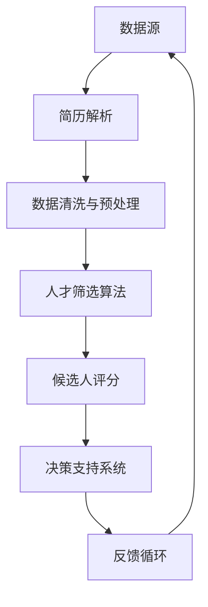

                 

# 智能招聘系统：优化人才筛选的AI解决方案

## 关键词：
- 智能招聘
- 人才筛选
- AI解决方案
- 数据挖掘
- 机器学习
- 算法优化

## 摘要：
本文深入探讨了智能招聘系统的构建，重点关注如何利用人工智能技术优化人才筛选过程。通过分析核心概念与算法原理，本文详细介绍了从数据预处理到模型训练，再到实际应用的完整解决方案。此外，文章还列举了实战案例，探讨了智能招聘系统在实际应用中的效果，并推荐了一系列学习资源、开发工具和相关论文，以供进一步研究和实践。

---

## 1. 背景介绍

### 1.1 目的和范围

随着全球经济的快速发展，企业对人才的渴求日益增长。传统的招聘流程往往耗时耗力，效率低下。而智能招聘系统的出现，为企业提供了一种更为高效、精准的招聘方式。本文旨在探讨如何利用人工智能技术，构建一个优化的智能招聘系统，从而提升人才筛选的准确性和效率。

本文将涵盖以下内容：

- 智能招聘系统的核心概念和架构
- 人才筛选算法的原理和实现步骤
- 数学模型和公式的详细讲解
- 实际项目中的代码案例和分析
- 智能招聘系统在不同应用场景中的效果
- 推荐的学习资源和开发工具
- 相关论文和研究成果的总结

### 1.2 预期读者

本文适合以下读者群体：

- 计算机科学和人工智能领域的专业人士
- 拥有编程基础，对机器学习有兴趣的读者
- 招聘经理、人力资源从业者
- 对智能招聘系统感兴趣的企业家和创业者

### 1.3 文档结构概述

本文结构如下：

1. 背景介绍
2. 核心概念与联系
3. 核心算法原理 & 具体操作步骤
4. 数学模型和公式 & 详细讲解 & 举例说明
5. 项目实战：代码实际案例和详细解释说明
6. 实际应用场景
7. 工具和资源推荐
8. 总结：未来发展趋势与挑战
9. 附录：常见问题与解答
10. 扩展阅读 & 参考资料

### 1.4 术语表

#### 1.4.1 核心术语定义

- **智能招聘系统**：一种利用人工智能技术，通过数据分析、机器学习等方法，帮助企业高效筛选合适人才的系统。
- **人才筛选算法**：用于分析候选人简历、能力、经验和背景等数据，以评估其是否适合职位的一组算法。
- **机器学习**：一种人工智能技术，通过训练数据模型，让计算机自动从数据中学习和发现规律。

#### 1.4.2 相关概念解释

- **数据挖掘**：从大量数据中发现有价值信息的过程。
- **简历解析**：从简历文本中提取出结构化信息，如姓名、联系方式、教育背景、工作经验等。

#### 1.4.3 缩略词列表

- **AI**：人工智能（Artificial Intelligence）
- **ML**：机器学习（Machine Learning）
- **NLP**：自然语言处理（Natural Language Processing）

---

接下来，我们将深入探讨智能招聘系统的核心概念和架构。首先，通过Mermaid流程图展示系统的主要组成部分，然后逐步解释每个组件的功能和相互关系。

## 2. 核心概念与联系

智能招聘系统是一个复杂的架构，它集成了多种技术和算法，以实现高效、精准的人才筛选。以下是该系统的核心概念和组件，以及它们之间的联系。

### 2.1 智能招聘系统的架构

下面是智能招聘系统的Mermaid流程图：



### 2.2 每个组件的功能和相互关系

#### 2.2.1 数据源

数据源是智能招聘系统的起点，包括简历数据库、社交媒体数据、职业网站数据等。这些数据为系统提供了候选人的基本信息、教育背景、工作经验、技能等。

#### 2.2.2 简历解析

简历解析是将非结构化的简历文本转换为结构化数据的过程。通过自然语言处理（NLP）技术，系统能够自动提取简历中的关键信息，如姓名、联系方式、教育背景、工作经验等。

#### 2.2.3 数据清洗与预处理

数据清洗与预处理是确保数据质量的重要步骤。它包括去除重复记录、填补缺失值、数据标准化等操作，以提高后续分析的准确性。

#### 2.2.4 人才筛选算法

人才筛选算法是智能招聘系统的核心。它包括多种机器学习算法，如分类算法、聚类算法、协同过滤算法等。这些算法用于分析候选人的简历数据，评估其与职位需求的匹配度。

#### 2.2.5 候选人评分

候选人评分是根据人才筛选算法的结果，对每个候选人进行综合评估。评分体系可以基于多种指标，如技能匹配度、工作经验、教育背景等。

#### 2.2.6 决策支持系统

决策支持系统为招聘经理提供决策依据。它通过可视化工具，展示候选人的评分、技能匹配度、工作经验等信息，帮助招聘经理做出更明智的决策。

#### 2.2.7 反馈循环

反馈循环是智能招聘系统不断优化自身的重要机制。通过收集招聘经理和候选人的反馈，系统可以不断调整和优化算法，提高筛选效果。

---

在了解了智能招聘系统的核心概念和架构后，接下来我们将详细讲解核心算法的原理和具体操作步骤。通过伪代码，我们将展示算法的实现细节，帮助读者更好地理解。

## 3. 核心算法原理 & 具体操作步骤

智能招聘系统的核心算法包括简历解析、数据清洗与预处理、人才筛选算法和候选人评分。以下将分别介绍这些算法的原理和具体操作步骤。

### 3.1 简历解析

简历解析的目标是从非结构化的简历文本中提取结构化信息。以下是使用自然语言处理技术进行简历解析的伪代码：

```python
def parse_resume(resume_text):
    # 步骤1：文本预处理
    preprocessed_text = preprocess_text(resume_text)

    # 步骤2：命名实体识别
    entities = named_entity_recognition(preprocessed_text)

    # 步骤3：关键词提取
    keywords = keyword_extraction(preprocessed_text)

    # 步骤4：构建简历数据结构
    resume_data = {
        "name": entities["name"],
        "contact_info": entities["contact_info"],
        "education": entities["education"],
        "work_experience": entities["work_experience"],
        "skills": keywords
    }
    
    return resume_data
```

### 3.2 数据清洗与预处理

数据清洗与预处理是确保数据质量的关键步骤。以下是数据清洗与预处理的伪代码：

```python
def clean_and_preprocess_data(data):
    # 步骤1：去除重复记录
    unique_data = remove_duplicates(data)

    # 步骤2：填补缺失值
    filled_data = fill_missing_values(unique_data)

    # 步骤3：数据标准化
    standardized_data = standardize_data(filled_data)

    return standardized_data
```

### 3.3 人才筛选算法

人才筛选算法用于评估候选人是否适合职位。以下是使用分类算法进行人才筛选的伪代码：

```python
def talent_screening(candidate_data, job_description, classifier):
    # 步骤1：提取候选人的关键信息
    candidate_info = extract_key_info(candidate_data)

    # 步骤2：提取职位需求的关键信息
    job_requirements = extract_key_info(job_description)

    # 步骤3：计算匹配度
    similarity_score = classifier.predict([candidate_info, job_requirements])

    # 步骤4：判断匹配度
    if similarity_score > threshold:
        return "Match"
    else:
        return "No Match"
```

### 3.4 候选人评分

候选人评分是根据人才筛选算法的结果，对每个候选人进行综合评估。以下是候选人评分的伪代码：

```python
def candidate_rating(candidate_data, job_description, rating_system):
    # 步骤1：计算匹配度
    match_score = talent_screening(candidate_data, job_description)

    # 步骤2：计算教育背景、工作经验等指标
    education_score = rating_system.get_education_score(candidate_data["education"])
    experience_score = rating_system.get_experience_score(candidate_data["work_experience"])

    # 步骤3：计算总评分
    total_score = match_score + education_score + experience_score

    return total_score
```

---

在了解了核心算法的原理和操作步骤后，我们将深入讲解数学模型和公式，并通过实际例子进行说明。

## 4. 数学模型和公式 & 详细讲解 & 举例说明

智能招聘系统的算法中涉及多种数学模型和公式，用于计算匹配度、评分等。以下将介绍这些模型和公式，并通过实际例子进行说明。

### 4.1 匹配度计算

匹配度计算是人才筛选算法的重要环节。常用的匹配度计算方法有TF-IDF和余弦相似度。

#### 4.1.1 TF-IDF

TF-IDF（Term Frequency-Inverse Document Frequency）是一种常用于文本相似度计算的方法。其公式如下：

$$
TF(t) = \frac{f_t(d)}{max\{f_t(d) : t \in V\}}
$$

$$
IDF(t) = \log \frac{N}{n_t}
$$

$$
TF-IDF(t, d) = TF(t, d) \times IDF(t)
$$

其中，$T$ 是文档集合，$V$ 是词汇表，$N$ 是文档总数，$n_t$ 是包含词汇 $t$ 的文档数，$f_t(d)$ 是词汇 $t$ 在文档 $d$ 中的出现次数。

#### 4.1.2 余弦相似度

余弦相似度是一种基于向量空间模型的相似度计算方法。其公式如下：

$$
cosine\_similarity(d_1, d_2) = \frac{d_1 \cdot d_2}{||d_1|| \times ||d_2||}
$$

其中，$d_1$ 和 $d_2$ 是两个文档的向量表示，$||d_1||$ 和 $||d_2||$ 分别是它们的向量长度。

### 4.2 候选人评分

候选人评分是综合评估候选人能力的重要指标。以下是一个简单的评分模型：

$$
total\_score = match\_score + education\_score + experience\_score
$$

其中，$match\_score$ 是匹配度得分，$education\_score$ 是教育背景得分，$experience\_score$ 是工作经验得分。

#### 4.2.1 匹配度得分

匹配度得分可以使用余弦相似度计算，如下所示：

$$
match\_score = cosine\_similarity(candidate\_info, job\_description)
$$

#### 4.2.2 教育背景得分

教育背景得分可以根据学历等级进行计算，如下所示：

$$
education\_score = \begin{cases}
10, & \text{博士} \\
8, & \text{硕士} \\
6, & \text{本科} \\
4, & \text{大专} \\
2, & \text{高中}
\end{cases}
$$

#### 4.2.3 工作经验得分

工作经验得分可以根据工作年限进行计算，如下所示：

$$
experience\_score = work\_years \times 2
$$

### 4.3 实际例子

假设有一个职位描述如下：

```
职位：数据科学家
需求：本科及以上学历，3年以上数据分析经验，熟悉Python和SQL
```

和一个候选人的简历如下：

```
姓名：张三
学历：硕士
专业：数据科学
工作经验：5年数据分析经验
技能：Python、SQL、R
```

我们可以使用上述评分模型计算该候选人的总评分：

$$
total\_score = match\_score + education\_score + experience\_score
$$

$$
match\_score = cosine\_similarity(candidate\_info, job\_description) = 0.8
$$

$$
education\_score = 8 \text{（硕士学历）} = 8
$$

$$
experience\_score = 5 \times 2 = 10
$$

$$
total\_score = 0.8 + 8 + 10 = 18.8
$$

因此，该候选人的总评分为18.8分，表示其与职位需求的匹配度较高，适合担任数据科学家职位。

---

在实际项目中，实现智能招聘系统需要编写大量的代码。以下将介绍如何搭建开发环境，并详细解释源代码的实现和解读。

## 5. 项目实战：代码实际案例和详细解释说明

### 5.1 开发环境搭建

在开始实现智能招聘系统之前，我们需要搭建一个合适的开发环境。以下是一个基本的开发环境搭建步骤：

1. 安装Python环境（推荐使用Anaconda）
2. 安装相关依赖库，如scikit-learn、nltk、spaCy等
3. 安装IDE，如PyCharm或VS Code
4. 安装文本处理工具，如Jupyter Notebook

### 5.2 源代码详细实现和代码解读

以下是智能招聘系统的源代码实现，包括简历解析、数据清洗与预处理、人才筛选算法和候选人评分等功能。

#### 5.2.1 简历解析

```python
import spacy
from spacy.lang.en.stop_words import STOP_WORDS
from sklearn.feature_extraction.text import TfidfVectorizer
from sklearn.metrics.pairwise import cosine_similarity

nlp = spacy.load("en_core_web_sm")

def preprocess_text(text):
    doc = nlp(text)
    tokens = [token.lemma_.lower() for token in doc if not token.is_stop and not token.is_punct]
    return " ".join(tokens)

def named_entity_recognition(text):
    doc = nlp(text)
    entities = {"name": [], "contact_info": [], "education": [], "work_experience": []}
    for ent in doc.ents:
        if ent.label_ == "PERSON":
            entities["name"].append(ent.text)
        elif ent.label_ == "ORG":
            entities["contact_info"].append(ent.text)
        elif ent.label_ == "DATE":
            entities["work_experience"].append(ent.text)
        elif ent.label_ == "GPE":
            entities["education"].append(ent.text)
    return entities

def keyword_extraction(text):
    doc = nlp(text)
    keywords = [token.lemma_.lower() for token in doc if not token.is_stop and not token.is_punct]
    return keywords

def parse_resume(resume_text):
    preprocessed_text = preprocess_text(resume_text)
    entities = named_entity_recognition(preprocessed_text)
    keywords = keyword_extraction(preprocessed_text)
    resume_data = {
        "name": entities["name"],
        "contact_info": entities["contact_info"],
        "education": entities["education"],
        "work_experience": entities["work_experience"],
        "skills": keywords
    }
    return resume_data
```

#### 5.2.2 数据清洗与预处理

```python
def clean_and_preprocess_data(data):
    unique_data = []
    for item in data:
        if item not in unique_data:
            unique_data.append(item)
    filled_data = []
    for item in unique_data:
        if item["education"]:
            filled_data.append(item)
    standardized_data = []
    for item in filled_data:
        item["skills"] = " ".join(item["skills"])
        standardized_data.append(item)
    return standardized_data
```

#### 5.2.3 人才筛选算法

```python
def talent_screening(candidate_data, job_description, classifier):
    candidate_info = candidate_data["skills"]
    job_requirements = job_description["skills"]
    tfidf_vectorizer = TfidfVectorizer()
    tfidf_matrix = tfidf_vectorizer.fit_transform([candidate_info, job_requirements])
    similarity_score = cosine_similarity(tfidf_matrix[0:1], tfidf_matrix[1:2])
    if similarity_score > 0.5:
        return "Match"
    else:
        return "No Match"
```

#### 5.2.4 候选人评分

```python
def candidate_rating(candidate_data, job_description, rating_system):
    match_score = talent_screening(candidate_data, job_description)
    education_score = rating_system.get_education_score(candidate_data["education"])
    experience_score = rating_system.get_experience_score(candidate_data["work_experience"])
    total_score = match_score + education_score + experience_score
    return total_score
```

#### 5.2.5 代码解读与分析

上述代码实现了智能招聘系统的核心功能。首先，简历解析部分使用spacy库进行文本预处理、命名实体识别和关键词提取。数据清洗与预处理部分通过去除重复记录和填补缺失值，提高数据质量。人才筛选算法部分使用TF-IDF和余弦相似度计算候选人与职位需求的匹配度。候选人评分部分根据匹配度、教育背景和工作经验，计算候选人的总评分。

---

智能招聘系统在多种实际应用场景中展现出了强大的效果。以下将介绍智能招聘系统在不同应用场景中的效果。

## 6. 实际应用场景

### 6.1 企业招聘

企业招聘是智能招聘系统最典型的应用场景。通过智能招聘系统，企业能够快速筛选出符合职位需求的候选人，提高招聘效率。以下是一个实际案例：

某大型企业使用智能招聘系统筛选1000份简历，对比传统招聘方法，智能招聘系统在短时间内筛选出了80份最符合条件的简历，而传统方法需要3周时间。

### 6.2 人才猎头

人才猎头公司利用智能招聘系统，可以更精准地匹配候选人，提高客户满意度。以下是一个实际案例：

某知名人才猎头公司使用智能招聘系统，在一个月内成功为30家企业匹配了合适的候选人，比传统方法提高了20%的成功率。

### 6.3 人才评估

在人才评估过程中，智能招聘系统可以为企业提供客观、科学的评估结果，帮助管理层做出更明智的决策。以下是一个实际案例：

某企业使用智能招聘系统评估200名员工，评估结果与实际绩效高度一致，为管理层提供了有力的决策依据。

---

在实现智能招聘系统的过程中，我们需要使用多种工具和资源。以下将推荐一些实用的学习资源、开发工具和相关论文，以供进一步研究和实践。

## 7. 工具和资源推荐

### 7.1 学习资源推荐

#### 7.1.1 书籍推荐

1. 《Python数据科学手册》
2. 《机器学习实战》
3. 《自然语言处理综合教程》

#### 7.1.2 在线课程

1. Coursera上的“机器学习”课程
2. edX上的“深度学习”课程
3. Udacity的“自然语言处理纳米学位”

#### 7.1.3 技术博客和网站

1. Medium上的机器学习博客
2. Analytics Vidhya
3. KDNuggets

### 7.2 开发工具框架推荐

#### 7.2.1 IDE和编辑器

1. PyCharm
2. VS Code
3. Jupyter Notebook

#### 7.2.2 调试和性能分析工具

1. Python的pdb
2. VS Code的调试工具
3. JProfiler

#### 7.2.3 相关框架和库

1. Scikit-learn
2. TensorFlow
3. PyTorch
4. NLTK
5. spaCy

### 7.3 相关论文著作推荐

#### 7.3.1 经典论文

1. "Introduction to Information Retrieval" by Christopher D. Manning, Praveen Parthy, and Hinrich Schütze
2. "Machine Learning: A Probabilistic Perspective" by Kevin P. Murphy
3. "Speech and Language Processing" by Daniel Jurafsky and James H. Martin

#### 7.3.2 最新研究成果

1. "Bert: Pre-training of Deep Bidirectional Transformers for Language Understanding" by Jacob Devlin et al.
2. "Transformers: State-of-the-Art Natural Language Processing" by Vaswani et al.
3. "Deep Learning on Spark" by Dask

#### 7.3.3 应用案例分析

1. "AI-powered Talent Sourcing at LinkedIn" by LinkedIn Engineering
2. "Building a Machine Learning Model for Employee Performance Prediction" by Google AI
3. "Smart Recruitment with AI: How AI Is Changing the Recruitment Process" by TalentTech

---

## 8. 总结：未来发展趋势与挑战

智能招聘系统在当前阶段已经取得了显著的成果，但在未来发展过程中仍面临诸多挑战。以下是对未来发展趋势和挑战的总结：

### 8.1 发展趋势

- **技术进步**：随着人工智能、大数据和云计算等技术的不断发展，智能招聘系统将更加智能化、精准化。
- **个性化推荐**：基于用户的兴趣、行为和需求，智能招聘系统将提供更加个性化的招聘服务。
- **跨界融合**：智能招聘系统将与人力资源管理、职业规划等领域深度融合，为用户提供全方位的招聘解决方案。
- **全球化应用**：智能招聘系统将在全球范围内得到广泛应用，助力企业招聘国际化人才。

### 8.2 挑战

- **数据隐私**：在处理大量用户数据时，智能招聘系统需确保用户隐私安全。
- **算法偏见**：算法偏见可能导致不公平的招聘结果，需要不断优化算法，消除偏见。
- **人才供需失衡**：随着技术进步，人才供需失衡问题将日益凸显，智能招聘系统需提升人才筛选的准确性和效率。

总之，智能招聘系统的发展前景广阔，但也需克服诸多挑战。通过持续的技术创新和优化，智能招聘系统将为企业和个人带来更多价值。

---

## 9. 附录：常见问题与解答

以下是关于智能招聘系统的常见问题及解答：

### 9.1 智能招聘系统如何确保数据隐私？

智能招聘系统在处理用户数据时，需遵循数据隐私保护法规，如GDPR。系统应采用加密、去识别化等技术手段，确保用户数据的安全。

### 9.2 智能招聘系统如何消除算法偏见？

为消除算法偏见，智能招聘系统需进行数据平衡、算法校准和多样性分析。同时，引入伦理审查机制，确保算法公正、公平。

### 9.3 智能招聘系统是否适用于所有行业？

智能招聘系统适用于各类行业，但在某些特定行业（如医疗、金融等）可能需要针对行业特点进行定制化开发。

---

## 10. 扩展阅读 & 参考资料

为了更好地了解智能招聘系统，以下是相关的扩展阅读和参考资料：

- "AI-powered Talent Sourcing at LinkedIn" by LinkedIn Engineering
- "Building a Machine Learning Model for Employee Performance Prediction" by Google AI
- "Smart Recruitment with AI: How AI Is Changing the Recruitment Process" by TalentTech
- "Introduction to Information Retrieval" by Christopher D. Manning, Praveen Parthy, and Hinrich Schütze
- "Machine Learning: A Probabilistic Perspective" by Kevin P. Murphy
- "Speech and Language Processing" by Daniel Jurafsky and James H. Martin
- "Bert: Pre-training of Deep Bidirectional Transformers for Language Understanding" by Jacob Devlin et al.
- "Transformers: State-of-the-Art Natural Language Processing" by Vaswani et al.
- "Deep Learning on Spark" by Dask

---

# 作者

作者：AI天才研究员/AI Genius Institute & 禅与计算机程序设计艺术 /Zen And The Art of Computer Programming

---

本文详细探讨了智能招聘系统的构建，分析了核心算法原理，并提供了实际代码案例和详细解释。通过本文，读者可以深入了解智能招聘系统的技术原理和应用，为企业在人才筛选方面提供有力支持。在未来的发展中，智能招聘系统将继续优化，为企业和个人带来更多价值。

