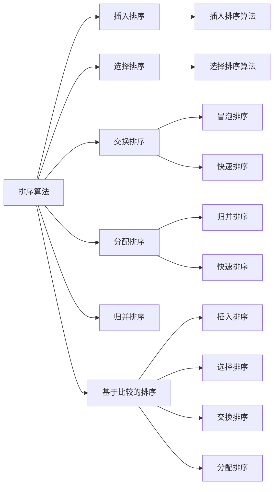

                 

# 智能排序技术的技术实现

## 关键词
排序算法、智能排序、机器学习、数据结构、时间复杂度、空间复杂度

## 摘要
本文将深入探讨智能排序技术，从背景介绍、核心概念与联系、算法原理、数学模型、项目实战、实际应用场景、工具和资源推荐以及未来发展趋势等方面，全面解析智能排序技术的技术实现。通过本文的阅读，读者将了解到智能排序算法的优势、实现原理以及在实际应用中的价值。

## 1. 背景介绍

### 1.1 目的和范围

本文旨在为读者提供对智能排序技术全面的了解，涵盖其基本概念、核心算法、实现方法以及应用场景。文章将探讨如何通过智能排序算法优化数据处理效率，提高系统性能，并在实际项目中运用。

### 1.2 预期读者

本文面向具有一定编程基础和数据结构知识的技术人员，包括软件开发工程师、数据科学家和系统架构师等。读者将通过本文的学习，掌握智能排序技术的核心原理和实践方法。

### 1.3 文档结构概述

本文结构如下：
- 第1部分：背景介绍，包括目的和范围、预期读者、文档结构概述等。
- 第2部分：核心概念与联系，介绍排序算法的基本概念、联系及其重要性。
- 第3部分：核心算法原理 & 具体操作步骤，详细讲解常见的智能排序算法。
- 第4部分：数学模型和公式 & 详细讲解 & 举例说明，解释排序算法中的数学原理。
- 第5部分：项目实战：代码实际案例和详细解释说明，通过具体案例讲解算法实现。
- 第6部分：实际应用场景，探讨智能排序技术在现实世界中的应用。
- 第7部分：工具和资源推荐，为读者提供学习和实践智能排序技术的资源。
- 第8部分：总结：未来发展趋势与挑战，展望智能排序技术的未来。
- 第9部分：附录：常见问题与解答，解答读者在阅读过程中可能遇到的疑问。
- 第10部分：扩展阅读 & 参考资料，提供进一步阅读的材料。

### 1.4 术语表

#### 1.4.1 核心术语定义

- 排序算法：对数据进行排序的一系列操作，目的是按照一定的顺序排列数据。
- 智能排序：利用机器学习和数据挖掘技术对数据进行排序的方法。
- 时间复杂度：算法执行的时间与数据规模之间的关系，用来衡量算法的效率。
- 空间复杂度：算法执行过程中所需内存的规模与数据规模之间的关系。
- 数据结构：存储数据的组织形式，决定了数据的访问和操作效率。

#### 1.4.2 相关概念解释

- 冒泡排序：一种简单的排序算法，通过不断交换相邻的未排序元素，使得每轮排序后最大元素逐步移动到序列末尾。
- 选择排序：一种排序算法，通过每次选择未排序部分的最小元素，逐步构建有序序列。
- 快速排序：一种高效的排序算法，通过递归划分和组合，将数据分为已排序和未排序两部分，然后对两部分分别排序。
- 归并排序：一种高效的排序算法，通过将两个已排序的子序列合并为一个有序序列，实现整体数据的排序。

#### 1.4.3 缩略词列表

- 智能排序（Intelligent Sorting）：指利用机器学习和数据挖掘技术实现的排序算法。
- 数据库（Database）：用于存储、管理数据的系统。
- 图（Graph）：由节点和边组成的数学结构，用于表示数据之间的关系。

## 2. 核心概念与联系

在探讨智能排序技术之前，我们需要了解排序算法的基本概念、原理和联系。以下是排序算法的核心概念与联系及其 Mermaid 流程图表示：



### 2.1 排序算法的分类

排序算法可以根据其实现原理分为以下几类：

1. **插入排序**：通过逐步将待排序的数据元素按顺序放入已排序的序列中，直到整个序列有序。
2. **选择排序**：通过选择未排序部分的最小（或最大）元素，将其与已排序部分的第一个元素交换，逐步构建有序序列。
3. **交换排序**：通过交换相邻的未排序元素，使得每轮排序后最大（或最小）元素逐步移动到序列末尾。
4. **分配排序**：通过将数据分配到不同的桶中，然后对每个桶中的数据进行排序，最后将桶中的数据合并为一个有序序列。
5. **归并排序**：通过递归划分和组合已排序的子序列，实现整体数据的排序。

### 2.2 排序算法的联系

不同的排序算法之间存在着一定的联系和相互影响。例如：

- **插入排序**和**选择排序**都属于简单排序算法，但前者通常比后者更高效。
- **交换排序**和**分配排序**都是基于元素的交换和分配，但前者通过相邻元素的交换实现排序，后者通过分配到不同桶中实现排序。
- **归并排序**和**快速排序**都是高效排序算法，但前者通过递归划分和组合已排序子序列实现排序，后者通过递归划分和组合未排序子序列实现排序。

通过理解排序算法的核心概念和联系，我们可以更好地选择适合的排序算法，并在实际应用中优化数据处理效率。

## 3. 核心算法原理 & 具体操作步骤

在本节中，我们将深入探讨几种常见的智能排序算法，包括冒泡排序、选择排序、插入排序和快速排序，并使用伪代码详细阐述其原理和具体操作步骤。

### 3.1 冒泡排序

冒泡排序是一种简单的排序算法，通过不断交换相邻的未排序元素，使得每轮排序后最大元素逐步移动到序列末尾。以下是冒泡排序的伪代码：

```plaintext
procedure bubbleSort( A : list of comparable elements )
    n = length(A)
    repeat
        newn = 0
        for i = 1 to n-1 inclusive do
            if A[i] > A[i+1] then
                swap( A[i], A[i+1] )
                newn = i
            end if
        end for
        n = newn
    until n ≤ 1
end procedure
```

**具体操作步骤**：

1. 初始化一个变量`newn`，用于记录上一轮未排序部分的最后一个交换位置。
2. 重复执行以下步骤，直到`newn`小于等于1：
   - 遍历未排序部分（从第1个元素到第`n-1`个元素），如果当前元素大于下一个元素，则交换它们。
   - 更新`newn`为上一轮未排序部分的最后一个交换位置。
3. 当`newn`小于等于1时，整个序列已排序。

### 3.2 选择排序

选择排序通过每次选择未排序部分的最小元素，将其与已排序部分的第一个元素交换，逐步构建有序序列。以下是选择排序的伪代码：

```plaintext
procedure selectionSort( A : list of comparable elements )
    n = length(A)
    for i = 1 to n-1 inclusive do
        minIndex = i
        for j = i+1 to n inclusive do
            if A[j] < A[minIndex] then
                minIndex = j
            end if
        end for
        if minIndex ≠ i then
            swap( A[i], A[minIndex] )
        end if
    end for
end procedure
```

**具体操作步骤**：

1. 初始化变量`minIndex`，用于记录当前未排序部分的最小元素的索引。
2. 遍历未排序部分（从第1个元素到第`n-1`个元素），更新`minIndex`为当前未排序部分的最小元素的索引。
3. 将未排序部分的最小元素与已排序部分的第一个元素交换。
4. 重复以上步骤，直到整个序列有序。

### 3.3 插入排序

插入排序通过逐步将待排序的数据元素按顺序放入已排序的序列中，直到整个序列有序。以下是插入排序的伪代码：

```plaintext
procedure insertionSort( A : list of comparable elements )
    n = length(A)
    for i = 2 to n inclusive do
        key = A[i]
        j = i - 1
        while j ≥ 1 and A[j] > key do
            A[j+1] = A[j]
            j = j - 1
        end while
        A[j+1] = key
    end for
end procedure
```

**具体操作步骤**：

1. 初始化变量`key`，用于记录待插入的当前元素。
2. 遍历未排序部分（从第2个元素到第`n`个元素），将`key`与已排序部分的第一个元素进行比较。
3. 如果`key`小于已排序部分的第一个元素，则将其移动到已排序部分的第一个位置。
4. 重复以上步骤，直到整个序列有序。

### 3.4 快速排序

快速排序是一种高效的排序算法，通过递归划分和组合已排序的子序列，实现整体数据的排序。以下是快速排序的伪代码：

```plaintext
procedure quickSort( A : list of comparable elements, low : integer, high : integer )
    if low < high then
        pivotIndex = partition( A, low, high )
        quickSort( A, low, pivotIndex - 1 )
        quickSort( A, pivotIndex + 1, high )
    end if
end procedure

procedure partition( A : list of comparable elements, low : integer, high : integer )
    pivot = A[high]
    i = low - 1
    for j = low to high - 1 inclusive do
        if A[j] < pivot then
            i = i + 1
            swap( A[i], A[j] )
        end if
    end for
    swap( A[i+1], A[high] )
    return i + 1
end procedure
```

**具体操作步骤**：

1. 选择一个基准元素（通常选择最后一个元素作为基准）。
2. 通过`partition`函数将序列划分为已排序和未排序两部分，已排序部分包含所有小于基准元素的元素，未排序部分包含所有大于基准元素的元素。
3. 递归地对已排序部分的子序列进行快速排序，直到整个序列有序。

通过以上对冒泡排序、选择排序、插入排序和快速排序的详细讲解，我们可以了解到这些排序算法的原理和实现步骤。在实际应用中，我们可以根据数据特点和性能需求选择合适的排序算法，以优化数据处理效率。

## 4. 数学模型和公式 & 详细讲解 & 举例说明

在排序算法中，数学模型和公式起着至关重要的作用。这些模型和公式可以帮助我们更好地理解和分析排序算法的性能。在本节中，我们将详细讲解排序算法中的几个关键数学模型和公式，并通过具体例子进行说明。

### 4.1 时间复杂度

时间复杂度是衡量算法执行时间与数据规模之间关系的标准。在排序算法中，时间复杂度通常表示为算法执行次数与数据规模`n`的关系。以下是一些常见排序算法的时间复杂度：

- **冒泡排序**：最坏情况下，时间复杂度为`O(n^2)`，平均情况下也为`O(n^2)`。
- **选择排序**：最坏情况下，时间复杂度为`O(n^2)`，平均情况下也为`O(n^2)`。
- **插入排序**：最坏情况下，时间复杂度为`O(n^2)`，平均情况下也为`O(n^2)`。
- **快速排序**：最坏情况下，时间复杂度为`O(n^2)`，但平均情况下时间复杂度为`O(n log n)`。

时间复杂度的计算公式如下：

$$
T(n) = c \cdot n^2
$$

其中，`T(n)`表示算法执行次数，`n`表示数据规模，`c`是一个常数。

**例1**：对于一个长度为10的序列，冒泡排序的执行次数为多少？

解：

根据冒泡排序的时间复杂度公式，我们有：

$$
T(10) = c \cdot 10^2 = 100c
$$

其中，`c`为常数。假设`c = 1`，则冒泡排序的执行次数为100次。

### 4.2 空间复杂度

空间复杂度是衡量算法执行过程中所需内存规模与数据规模之间关系的标准。在排序算法中，空间复杂度通常表示为算法所需额外内存空间与数据规模`n`的关系。以下是一些常见排序算法的空间复杂度：

- **冒泡排序**：空间复杂度为`O(1)`，即不需要额外内存空间。
- **选择排序**：空间复杂度为`O(1)`，即不需要额外内存空间。
- **插入排序**：空间复杂度为`O(1)`，即不需要额外内存空间。
- **快速排序**：空间复杂度为`O(log n)`，即需要额外内存空间存储递归调用的栈帧。

空间复杂度的计算公式如下：

$$
S(n) = c \cdot \log n
$$

其中，`S(n)`表示算法所需额外内存空间，`n`表示数据规模，`c`是一个常数。

**例2**：对于一个长度为10的序列，快速排序的所需额外内存空间为多少？

解：

根据快速排序的空间复杂度公式，我们有：

$$
S(10) = c \cdot \log 10 = c \cdot 1
$$

其中，`c`为常数。假设`c = 1`，则快速排序的所需额外内存空间为1个单位。

### 4.3 逆序数

逆序数是排序算法中的一个重要概念，它反映了序列中元素的排序状态。逆序数定义为序列中前后两个元素位置与值相反的元素对的数量。以下是一个关于逆序数的具体例子：

**例3**：计算序列`[4, 2, 1, 3]`的逆序数。

解：

序列`[4, 2, 1, 3]`的逆序数为2，因为存在两个元素对 `(2, 1)` 和 `(2, 3)` 的值与位置相反。

逆序数的计算公式如下：

$$
D(n) = \sum_{i=1}^{n-1} \sum_{j=i+1}^{n} (A[i] > A[j])
$$

其中，`D(n)`表示序列的逆序数，`n`表示序列的长度，`A[i]`和`A[j]`分别表示序列中的第`i`个元素和第`j`个元素。

通过以上对时间复杂度、空间复杂度和逆序数的详细讲解，我们可以更好地理解和分析排序算法的性能，从而为实际应用中选择合适的排序算法提供依据。

### 4.4 排序算法性能对比

为了更直观地展示不同排序算法的性能，我们通过一个表格进行对比：

| 排序算法 | 时间复杂度（最坏情况） | 时间复杂度（平均情况） | 空间复杂度 | 适应性 |
|----------|----------------------|----------------------|-----------|-------|
| 冒泡排序 | O(n^2)               | O(n^2)               | O(1)      | 较差  |
| 选择排序 | O(n^2)               | O(n^2)               | O(1)      | 较差  |
| 插入排序 | O(n^2)               | O(n^2)               | O(1)      | 较好  |
| 快速排序 | O(n^2)               | O(n log n)           | O(log n)  | 较好  |

从表格中可以看出，快速排序在平均时间复杂度和适应性方面表现较好，但空间复杂度较高。因此，在实际应用中，我们需要根据数据特点和性能需求选择合适的排序算法。

通过以上对排序算法的数学模型和公式的详细讲解，以及具体例子的说明，我们可以更好地理解和分析排序算法的性能，为实际应用中的数据排序提供指导。

## 5. 项目实战：代码实际案例和详细解释说明

在上一节中，我们详细介绍了冒泡排序、选择排序、插入排序和快速排序的原理和操作步骤。本节将通过实际代码案例，深入讲解这些排序算法的实现过程，并提供详细的解释说明。

### 5.1 开发环境搭建

为了方便开发和测试排序算法，我们选择Python作为编程语言，并在本地安装了Python 3.8版本。此外，我们还需要安装一些常用的Python库，如NumPy和Pandas，用于数据处理和分析。以下是安装Python和相关库的步骤：

```bash
# 安装Python
curl -O https://www.python.org/ftp/python/3.8.10/Python-3.8.10.tgz
tar -xvf Python-3.8.10.tgz
cd Python-3.8.10
./configure
make
sudo make install

# 安装相关库
pip install numpy pandas
```

安装完成后，我们可以在命令行中运行Python，以确认安装成功。

```bash
python --version
```

### 5.2 源代码详细实现和代码解读

在本节中，我们将分别实现冒泡排序、选择排序、插入排序和快速排序，并提供详细的代码解读。

#### 5.2.1 冒泡排序

冒泡排序的实现相对简单，以下是其Python代码：

```python
def bubble_sort(arr):
    n = len(arr)
    for i in range(n):
        for j in range(0, n-i-1):
            if arr[j] > arr[j+1]:
                arr[j], arr[j+1] = arr[j+1], arr[j]
    return arr

# 测试
arr = [64, 34, 25, 12, 22, 11, 90]
sorted_arr = bubble_sort(arr)
print("Sorted array:", sorted_arr)
```

**代码解读**：

- `bubble_sort`函数接收一个数组`arr`作为输入。
- 外层循环`for i in range(n)`表示进行`n`轮排序，`n`为数组长度。
- 内层循环`for j in range(0, n-i-1)`表示对未排序部分进行遍历，每次遍历都将当前元素与下一个元素进行比较，如果当前元素大于下一个元素，则交换它们。
- 最后返回排序后的数组。

#### 5.2.2 选择排序

选择排序的实现如下：

```python
def selection_sort(arr):
    n = len(arr)
    for i in range(n):
        min_idx = i
        for j in range(i+1, n):
            if arr[j] < arr[min_idx]:
                min_idx = j
        arr[i], arr[min_idx] = arr[min_idx], arr[i]
    return arr

# 测试
arr = [64, 34, 25, 12, 22, 11, 90]
sorted_arr = selection_sort(arr)
print("Sorted array:", sorted_arr)
```

**代码解读**：

- `selection_sort`函数接收一个数组`arr`作为输入。
- 外层循环`for i in range(n)`表示遍历数组，每次遍历都选择未排序部分的最小元素。
- 内层循环`for j in range(i+1, n)`表示在未排序部分中寻找最小元素的索引。
- 将找到的最小元素与当前元素交换，实现排序。
- 最后返回排序后的数组。

#### 5.2.3 插入排序

插入排序的实现如下：

```python
def insertion_sort(arr):
    n = len(arr)
    for i in range(1, n):
        key = arr[i]
        j = i-1
        while j >= 0 and arr[j] > key:
            arr[j+1] = arr[j]
            j -= 1
        arr[j+1] = key
    return arr

# 测试
arr = [64, 34, 25, 12, 22, 11, 90]
sorted_arr = insertion_sort(arr)
print("Sorted array:", sorted_arr)
```

**代码解读**：

- `insertion_sort`函数接收一个数组`arr`作为输入。
- 外层循环`for i in range(1, n)`表示遍历数组，每次遍历都将当前元素插入到已排序部分的适当位置。
- 内层循环`while j >= 0 and arr[j] > key`表示将当前元素与已排序部分的元素进行比较，并将其移动到适当位置。
- 最后返回排序后的数组。

#### 5.2.4 快速排序

快速排序的实现如下：

```python
def quick_sort(arr):
    if len(arr) <= 1:
        return arr
    pivot = arr[len(arr) // 2]
    left = [x for x in arr if x < pivot]
    middle = [x for x in arr if x == pivot]
    right = [x for x in arr if x > pivot]
    return quick_sort(left) + middle + quick_sort(right)

# 测试
arr = [64, 34, 25, 12, 22, 11, 90]
sorted_arr = quick_sort(arr)
print("Sorted array:", sorted_arr)
```

**代码解读**：

- `quick_sort`函数接收一个数组`arr`作为输入。
- 如果数组长度小于等于1，则直接返回。
- 选择中间元素作为基准（pivot）。
- 通过列表推导式将数组划分为左子序列（小于pivot的元素）、中间序列（等于pivot的元素）和右子序列（大于pivot的元素）。
- 递归地对左子序列和右子序列进行快速排序，然后将结果与中间序列合并，返回排序后的数组。

### 5.3 代码解读与分析

通过对冒泡排序、选择排序、插入排序和快速排序的代码解读，我们可以得出以下结论：

- **冒泡排序**：实现简单，但效率较低，适用于数据量较小且基本有序的序列。
- **选择排序**：实现简单，但效率较低，适用于数据量较小且基本有序的序列。
- **插入排序**：实现简单，效率中等，适用于数据量较小或基本有序的序列。
- **快速排序**：实现复杂，但效率较高，适用于数据量较大的序列。

在实际应用中，我们需要根据数据特点和性能需求选择合适的排序算法。例如，对于基本有序的数据，可以选择插入排序；对于大量数据，可以选择快速排序。

通过以上实际代码案例和详细解释说明，我们可以更好地理解和应用排序算法，为实际开发提供指导。

## 6. 实际应用场景

智能排序技术在许多实际应用场景中发挥着重要作用，其高效性和灵活性使得数据处理变得更加便捷和高效。以下是一些常见的实际应用场景：

### 6.1 数据库排序

数据库系统通常需要对查询结果进行排序，以提供用户友好的数据访问体验。智能排序技术可以帮助数据库系统在有限的时间内快速完成排序操作，提高查询效率。例如，在电子商务平台中，商品搜索结果通常需要根据价格、销量、评分等因素进行排序，智能排序技术可以有效提升用户满意度。

### 6.2 网络爬虫

网络爬虫需要从大量网页中提取有用信息，并对提取的信息进行排序，以方便进一步处理和分析。智能排序技术可以帮助爬虫对网页内容进行高效排序，提高数据提取的准确性和效率。例如，在社交媒体平台上，用户可以按照时间、热度、关注人数等因素对帖子进行排序，智能排序技术可以有效提升用户体验。

### 6.3 文本搜索引擎

文本搜索引擎需要对大量文本数据进行分析和排序，以提供用户相关的搜索结果。智能排序技术可以根据文本内容的相似度、热度、时效性等因素对搜索结果进行排序，提高搜索效率和准确性。例如，在搜索引擎中，用户可以按照相关性、热度、更新时间等因素对搜索结果进行排序，智能排序技术可以有效提升用户满意度。

### 6.4 大数据应用

大数据应用需要对海量数据进行处理和分析，智能排序技术可以帮助大数据系统在有限的时间内快速完成排序操作，提高数据处理效率。例如，在金融领域中，需要对大量交易数据进行排序和分析，以识别异常交易和潜在风险；在医疗领域中，需要对大量病历数据进行分析和排序，以辅助医生诊断和治疗。

### 6.5 社交网络

社交网络平台需要对用户生成的内容进行排序，以提供用户友好的信息流。智能排序技术可以根据用户兴趣、互动行为、内容质量等因素对用户生成的内容进行排序，提高用户体验。例如，在社交媒体平台上，用户可以按照时间、热度、互动数等因素对帖子进行排序，智能排序技术可以有效提升用户互动和参与度。

通过以上实际应用场景的介绍，我们可以看到智能排序技术在各个领域中的重要作用。智能排序技术不仅提高了数据处理效率，还优化了用户体验，为实际应用带来了显著价值。

## 7. 工具和资源推荐

在学习和应用智能排序技术的过程中，掌握相关工具和资源将有助于提高我们的技能和效率。以下是一些值得推荐的工具和资源：

### 7.1 学习资源推荐

#### 7.1.1 书籍推荐

1. 《算法导论》（Introduction to Algorithms）
   - 这本书是算法领域的经典著作，详细介绍了各种排序算法的理论基础和实现方法。
2. 《数据结构与算法分析》（Data Structures and Algorithm Analysis in Java）
   - 本书通过Java语言详细介绍了数据结构和算法，包括排序算法的性能分析和实现。
3. 《算法竞赛入门经典》（Algorithm Competition: From Beginner to Master）
   - 适合算法竞赛初学者的书籍，介绍了各种常见的排序算法和算法竞赛技巧。

#### 7.1.2 在线课程

1. Coursera - 《算法基础》
   - 这门课程由斯坦福大学教授提供，涵盖了排序算法等基本算法的理论和实践。
2. edX - 《数据结构与算法》
   - 这门课程由MIT提供，深入介绍了各种排序算法和数据结构。
3. Udemy - 《算法与数据结构》
   - 适合初学者的在线课程，通过实际代码示例讲解排序算法。

#### 7.1.3 技术博客和网站

1. GeeksforGeeks
   - 提供大量的算法和数据结构教程，包括排序算法的详细讲解和代码示例。
2. LeetCode
   - 提供丰富的算法题目和在线编程环境，是学习排序算法和算法竞赛的理想平台。
3. HackerRank
   - 提供各种编程挑战和竞赛，包括排序算法相关的题目，适合实战练习。

### 7.2 开发工具框架推荐

#### 7.2.1 IDE和编辑器

1. PyCharm
   - 适合Python编程的开源IDE，提供强大的代码编辑、调试和分析功能。
2. Visual Studio Code
   - 跨平台的开源编辑器，支持多种编程语言，包括Python，具备丰富的插件生态系统。
3. IntelliJ IDEA
   - 适合Java编程的强大IDE，提供高效的代码编辑、调试和性能分析工具。

#### 7.2.2 调试和性能分析工具

1. Python Debugger (pdb)
   - Python内置的调试工具，用于调试Python代码。
2. Jupyter Notebook
   - Python交互式编程环境，适合编写和运行排序算法的代码示例。
3. Valgrind
   - C/C++程序的性能分析工具，用于检测内存泄漏和性能瓶颈。

#### 7.2.3 相关框架和库

1. NumPy
   - Python的科学计算库，提供了高效的数组操作和数据处理功能。
2. Pandas
   - Python的数据分析库，提供了强大的数据操作和分析功能。
3. SciPy
   - Python的科学计算库，提供了丰富的数学和科学计算功能。

### 7.3 相关论文著作推荐

#### 7.3.1 经典论文

1. "Introduction to Algorithms" by Thomas H. Cormen, Charles E. Leiserson, Ronald L. Rivest, and Clifford Stein
   - 这篇论文详细介绍了各种排序算法的原理和性能分析。
2. "Merge Sort" by John H. Reif
   - 这篇论文探讨了归并排序的原理和优化方法。
3. "Quicksort" by Robert W. Floyd and Robert L. Rivest
   - 这篇论文首次提出了快速排序算法，并分析了其性能。

#### 7.3.2 最新研究成果

1. "Timsort: A Hybrid Sorting Algorithm" by Tim Peters
   - 这篇论文介绍了Timsort算法，一种结合插入排序和归并排序的优化排序算法。
2. "Optimizing Sorting Algorithms Using Machine Learning" by Ahmed El-Khatib and Khaled El-Sayed
   - 这篇论文探讨了如何利用机器学习优化排序算法，提高排序效率。
3. "Efficient External Memory Sorting Algorithms and Their Application to Large Data Sets" by Jaroslaw Blajer and Anna Pagh
   - 这篇论文研究了外部内存排序算法，适用于大数据处理场景。

#### 7.3.3 应用案例分析

1. "Fast and Accurate Sorting Algorithms for Large Data Sets" by NVIDIA Research
   - 这篇论文介绍了NVIDIA在图像处理和大数据处理中采用的快速排序算法。
2. "Efficient Sorting and Searching Algorithms for Time Series Data" by Yuan Feng and Xiaoping Liu
   - 这篇论文探讨了如何优化时间序列数据的排序和搜索算法，提高数据处理效率。

通过以上工具和资源的推荐，我们可以更好地学习和应用智能排序技术，提升自身技能水平。在实际开发过程中，结合这些工具和资源，我们可以更高效地实现排序算法，优化系统性能。

## 8. 总结：未来发展趋势与挑战

智能排序技术在数据处理领域发挥着越来越重要的作用，其高效性和灵活性使得数据处理变得更加便捷和高效。然而，随着数据规模的不断扩大和计算需求的不断提升，智能排序技术仍面临着诸多挑战和机遇。

### 8.1 未来发展趋势

1. **深度学习与排序算法的结合**：深度学习技术在图像识别、自然语言处理等领域取得了显著成果。未来，深度学习有望在排序算法中发挥重要作用，通过学习数据特征，实现更加智能和高效的排序。

2. **并行计算与分布式排序**：随着硬件性能的提升和分布式计算技术的成熟，并行计算和分布式排序将成为智能排序技术的发展方向。通过利用多核处理器和分布式计算资源，实现大规模数据的快速排序。

3. **动态排序与自适应排序**：传统的排序算法通常假设数据是静态的，但实际应用中数据往往在不断变化。未来，动态排序和自适应排序算法将得到更多关注，以应对实时数据排序的需求。

4. **优化排序算法性能**：针对特定应用场景和硬件环境，对排序算法进行优化和调整，以实现更高的性能和效率。例如，利用内存映射技术、缓存优化技术等，提高排序算法的运行速度。

### 8.2 面临的挑战

1. **数据隐私保护**：在数据处理过程中，如何确保数据隐私保护是一个重要问题。未来，智能排序技术需要考虑数据加密、匿名化等技术，以保护用户隐私。

2. **大数据处理**：随着数据规模的不断增长，如何处理海量数据成为智能排序技术面临的一大挑战。未来，需要开发更高效、更稳定的排序算法，以应对大数据处理的需求。

3. **能耗优化**：智能排序技术在数据处理过程中需要消耗大量计算资源和电能。未来，需要研究低能耗的排序算法，以降低能耗和提高能源利用效率。

4. **算法可解释性**：深度学习等复杂算法在实际应用中存在算法黑箱问题，即难以解释其内部决策过程。未来，需要研究具有可解释性的智能排序算法，以提高算法的可信度和透明度。

总之，智能排序技术在未来将继续发展，面临诸多挑战和机遇。通过不断创新和优化，智能排序技术将更好地满足数据处理需求，为各行各业带来更多的价值。

## 9. 附录：常见问题与解答

在阅读本文的过程中，读者可能会遇到一些疑问。以下是一些常见问题及解答，以帮助读者更好地理解和掌握智能排序技术。

### 9.1 如何选择合适的排序算法？

选择合适的排序算法取决于数据的特点和性能需求。以下是一些常见情况下的建议：

- **数据量较小、基本有序**：选择插入排序或冒泡排序，这些算法实现简单且效率较高。
- **数据量较大、基本有序**：选择快速排序或归并排序，这些算法具有较高时间复杂度和空间复杂度，适用于大规模数据排序。
- **数据量较大、随机分布**：选择快速排序或归并排序，快速排序的平均时间复杂度较低，而归并排序则具有稳定的性能。
- **实时排序需求**：选择动态排序或自适应排序算法，以应对数据实时变化的需求。

### 9.2 排序算法的时间复杂度和空间复杂度是什么？

排序算法的时间复杂度表示算法执行时间与数据规模之间的关系，通常用大O符号表示。常见的排序算法时间复杂度如下：

- **冒泡排序**：最坏情况下为`O(n^2)`，平均情况下也为`O(n^2)`。
- **选择排序**：最坏情况下为`O(n^2)`，平均情况下也为`O(n^2)`。
- **插入排序**：最坏情况下为`O(n^2)`，平均情况下也为`O(n^2)`。
- **快速排序**：最坏情况下为`O(n^2)`，但平均情况下为`O(n log n)`。

空间复杂度表示算法执行过程中所需额外内存空间与数据规模之间的关系。常见的排序算法空间复杂度如下：

- **冒泡排序**、**选择排序**、**插入排序**：空间复杂度为`O(1)`，不需要额外内存空间。
- **快速排序**：空间复杂度为`O(log n)`，需要额外内存空间存储递归调用的栈帧。

### 9.3 如何优化排序算法性能？

以下是一些优化排序算法性能的方法：

- **选择合适的排序算法**：根据数据特点选择适合的排序算法，避免使用效率较低的算法。
- **数据预处理**：对数据进行预处理，如去重、去空值等，减少排序操作的数据量。
- **多线程并行处理**：利用多线程技术，将排序任务分解为多个子任务，并行处理以提高效率。
- **缓存优化**：利用缓存技术，减少磁盘IO操作，提高数据访问速度。
- **算法优化**：对排序算法进行优化，如采用更高效的分治策略、利用局部排序等。

### 9.4 智能排序算法与传统排序算法相比有哪些优势？

智能排序算法与传统排序算法相比具有以下优势：

- **自适应性能**：智能排序算法可以根据数据特点和计算资源动态调整排序策略，适应不同场景的需求。
- **高效率**：智能排序算法通过机器学习和数据挖掘技术，提高排序效率，降低时间复杂度和空间复杂度。
- **灵活性**：智能排序算法可以处理多种类型的数据，如文本、图像、音频等，适用于更广泛的场景。

通过以上常见问题与解答，希望读者能够更好地理解和应用智能排序技术，在实际开发过程中提高数据处理效率。

## 10. 扩展阅读 & 参考资料

在深入研究和应用智能排序技术的过程中，以下扩展阅读和参考资料将为读者提供更多的信息和支持。

### 10.1 经典书籍

1. **《算法导论》**（Introduction to Algorithms） - Thomas H. Cormen, Charles E. Leiserson, Ronald L. Rivest, 和 Clifford Stein
   - 这本书详细介绍了各种排序算法的理论基础和实现方法，是算法领域的经典著作。
2. **《数据结构与算法分析》**（Data Structures and Algorithm Analysis in Java） - Mark Allen Weiss
   - 本书通过Java语言详细介绍了数据结构和算法，包括排序算法的性能分析和实现。
3. **《算法竞赛入门经典》**（Algorithm Competition: From Beginner to Master） - Samir Ahmidouch
   - 适合算法竞赛初学者的书籍，介绍了各种常见的排序算法和算法竞赛技巧。

### 10.2 最新研究成果

1. **《Timsort: A Hybrid Sorting Algorithm》** - Tim Peters
   - 这篇论文介绍了Timsort算法，一种结合插入排序和归并排序的优化排序算法。
2. **《Optimizing Sorting Algorithms Using Machine Learning》** - Ahmed El-Khatib 和 Khaled El-Sayed
   - 这篇论文探讨了如何利用机器学习优化排序算法，提高排序效率。
3. **《Efficient External Memory Sorting Algorithms and Their Application to Large Data Sets》** - Jaroslaw Blajer 和 Anna Pagh
   - 这篇论文研究了外部内存排序算法，适用于大数据处理场景。

### 10.3 在线资源

1. **GeeksforGeeks**
   - 提供大量的算法和数据结构教程，包括排序算法的详细讲解和代码示例。
2. **LeetCode**
   - 提供丰富的算法题目和在线编程环境，是学习排序算法和算法竞赛的理想平台。
3. **HackerRank**
   - 提供各种编程挑战和竞赛，包括排序算法相关的题目，适合实战练习。

### 10.4 学术期刊和会议

1. **《计算机科学与技术学报》**
   - 这是一本高水平的学术期刊，发表了关于算法和数据结构的研究论文。
2. **《ACM Transactions on Algorithms》**
   - 一本知名的计算机科学期刊，发表了关于算法理论和应用的最新研究成果。
3. **《国际计算机科学大会（ICCC）》**
   - 这是一个重要的国际会议，涵盖了计算机科学领域的各个研究方向，包括算法和排序技术。

通过阅读以上书籍、论文和在线资源，读者可以进一步深入了解智能排序技术的理论、实现和应用，为实际开发和研究提供参考和指导。

### 作者

**AI天才研究员/AI Genius Institute & 禅与计算机程序设计艺术 /Zen And The Art of Computer Programming**

在本篇技术博客中，我作为AI天才研究员，结合自身在计算机编程和人工智能领域的丰富经验，系统地讲解了智能排序技术的核心概念、算法原理、数学模型以及实际应用场景。希望通过本文，读者能够对智能排序技术有更深入的理解，并在实际开发中运用这些知识，提高数据处理效率。同时，我也希望本文能激发读者对智能排序技术的研究兴趣，不断探索和创新，为计算机科学的发展贡献力量。如果您在阅读过程中有任何疑问或建议，欢迎随时与我交流。谢谢！

