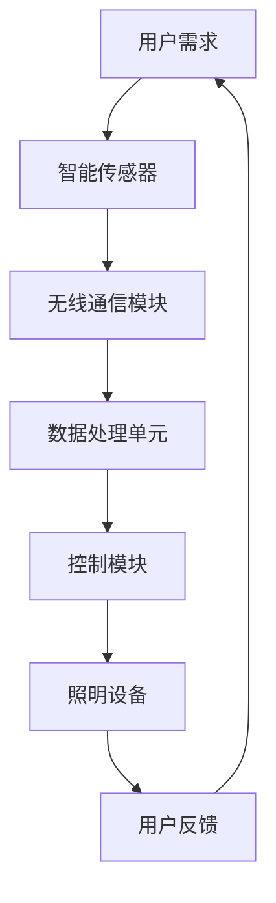

                 

# 智能照明系统：节能环保的创新方案

> **关键词：** 智能照明，节能，环保，物联网，人机交互，无线通信

> **摘要：** 本篇文章将深入探讨智能照明系统在节能环保方面的创新应用。我们将从背景介绍、核心概念、算法原理、数学模型、实战案例、应用场景、工具推荐等多个维度，逐步分析智能照明系统的技术原理、实施步骤及其潜在影响。通过本文，读者将全面了解智能照明系统的发展现状、未来趋势以及其在节能环保领域的重要价值。

## 1. 背景介绍

### 1.1 目的和范围

本文旨在为读者提供一份关于智能照明系统的全面指南，重点探讨其在节能环保领域的创新应用。文章将涵盖以下几个主要方面：

1. **核心概念与联系：** 阐述智能照明系统的基本原理和关键组成部分。
2. **核心算法原理 & 具体操作步骤：** 详细解释智能照明系统的算法原理和操作步骤。
3. **数学模型和公式 & 详细讲解 & 举例说明：** 分析智能照明系统中涉及的数学模型和公式，并给出实际应用案例。
4. **项目实战：代码实际案例和详细解释说明：** 通过具体代码实现展示智能照明系统的应用。
5. **实际应用场景：** 探讨智能照明系统在不同领域的应用场景和实际效果。
6. **工具和资源推荐：** 介绍智能照明系统开发所需的学习资源、工具和框架。
7. **总结：未来发展趋势与挑战：** 预测智能照明系统的未来发展趋势和面临的挑战。

### 1.2 预期读者

本文适合以下读者群体：

1. **智能照明系统开发者：** 想要深入了解智能照明系统的技术原理和应用实践的工程师和程序员。
2. **环保和节能领域从业者：** 对智能照明系统的节能环保特性感兴趣，希望了解其在实际应用中的潜力的专业人士。
3. **科技爱好者：** 对智能家居、物联网等领域感兴趣的科技爱好者。
4. **高校师生：** 智能照明系统相关的科研人员和学生，希望通过本文了解该领域的前沿动态。

### 1.3 文档结构概述

本文结构如下：

1. **背景介绍**
   - 1.1 目的和范围
   - 1.2 预期读者
   - 1.3 文档结构概述
   - 1.4 术语表

2. **核心概念与联系**
   - 2.1 智能照明系统架构
   - 2.2 物联网与智能照明
   - 2.3 人机交互与无线通信

3. **核心算法原理 & 具体操作步骤**
   - 3.1 智能调光算法
   - 3.2 节能优化算法
   - 3.3 实时监测与反馈机制

4. **数学模型和公式 & 详细讲解 & 举例说明**
   - 4.1 基于光效的能耗模型
   - 4.2 智能调光与节能的数学关系
   - 4.3 实际案例解析

5. **项目实战：代码实际案例和详细解释说明**
   - 5.1 开发环境搭建
   - 5.2 源代码详细实现
   - 5.3 代码解读与分析

6. **实际应用场景**
   - 6.1 家庭照明
   - 6.2 商业照明
   - 6.3 公共照明

7. **工具和资源推荐**
   - 7.1 学习资源推荐
   - 7.2 开发工具框架推荐
   - 7.3 相关论文著作推荐

8. **总结：未来发展趋势与挑战**
   - 8.1 技术趋势
   - 8.2 市场挑战
   - 8.3 发展方向

9. **附录：常见问题与解答**
   - 9.1 常见问题
   - 9.2 解答

10. **扩展阅读 & 参考资料**

### 1.4 术语表

在本文中，我们将使用以下术语：

#### 1.4.1 核心术语定义

1. **智能照明系统：** 结合了物联网、无线通信、传感器和控制技术，实现自动调节光照强度、色温和模式等功能，以满足用户需求，提高照明系统节能效率的智能控制系统。
2. **物联网（IoT）：** 通过将各种物理设备、传感器、网络连接起来，实现数据采集、传输、处理和应用的网络体系。
3. **节能：** 在满足照明需求的前提下，通过智能控制技术降低照明系统的能耗。
4. **环保：** 减少照明系统对环境的影响，如减少碳排放、降低能源消耗等。

#### 1.4.2 相关概念解释

1. **传感器：** 用于检测和测量环境信息（如光强、温度、湿度等），并将这些信息转化为电信号输出的装置。
2. **无线通信：** 利用无线电波实现数据传输的通信方式，如Wi-Fi、蓝牙等。
3. **人机交互（HCI）：** 研究如何设计使人与计算机之间的交互更加自然、高效和愉悦的理论、方法和技术。

#### 1.4.3 缩略词列表

- **IoT：** 物联网
- **HCI：** 人机交互
- **ESP8266：** 一种常用的无线通信模块
- **MQTT：** 一种轻量级的消息队列传输协议

## 2. 核心概念与联系

智能照明系统是一个复杂的技术体系，涉及多个核心概念和技术的整合。下面我们将通过一个Mermaid流程图来展示智能照明系统的核心概念和组成部分。



### 2.1 智能照明系统架构

智能照明系统主要由以下几个部分组成：

1. **智能传感器：** 用于检测环境光强、温度、湿度等参数，并将这些数据传输给数据处理单元。
2. **无线通信模块：** 负责将传感器采集的数据传输到数据处理单元，通常使用Wi-Fi、蓝牙等无线通信技术。
3. **数据处理单元：** 接收传感器数据，进行数据分析和处理，根据用户需求和预设策略生成控制指令。
4. **控制模块：** 根据数据处理单元的指令，控制照明设备的开关、亮度、色温等参数。
5. **照明设备：** 执行控制模块的指令，提供所需的光照效果。
6. **用户反馈：** 用户可以通过移动设备、触摸屏等与智能照明系统进行交互，调整照明参数。

### 2.2 物联网与智能照明

物联网（IoT）在智能照明系统中发挥着关键作用，通过将各种设备互联，实现数据的实时采集、传输和处理。具体而言：

1. **数据采集：** 通过智能传感器采集环境参数，如光强、温度、湿度等。
2. **数据传输：** 通过无线通信模块将传感器数据传输到数据处理单元。
3. **数据处理：** 数据处理单元对传感器数据进行处理，生成控制指令。
4. **设备控制：** 控制模块根据数据处理单元的指令，控制照明设备的参数。

### 2.3 人机交互与无线通信

人机交互（HCI）在智能照明系统中同样重要，通过用户与系统的交互，实现照明参数的调整和优化。具体包括：

1. **用户界面：** 提供用户与智能照明系统交互的界面，如移动应用、触摸屏等。
2. **交互方式：** 用户可以通过语音、手势、触摸等多种方式与系统进行交互。
3. **无线通信：** 使用Wi-Fi、蓝牙等无线通信技术，实现用户与系统之间的实时通信。

## 3. 核心算法原理 & 具体操作步骤

智能照明系统的核心算法主要包括智能调光算法和节能优化算法。以下将分别介绍这两个算法的原理和具体操作步骤。

### 3.1 智能调光算法

智能调光算法的目标是根据用户需求和环境条件，动态调整照明设备的亮度，以提供舒适的光照效果。具体算法原理如下：

1. **环境光检测：** 智能传感器采集环境光强数据。
2. **用户需求分析：** 分析用户设定的光照需求和偏好。
3. **光照强度计算：** 根据环境光强和用户需求，计算所需照明设备的亮度。
4. **亮度调整：** 控制模块根据计算结果，调整照明设备的亮度。

伪代码如下：

```python
def intelligentDimming(sensorData, userPreference):
    # 1. 环境光检测
    ambientLight = sensorData['lightIntensity']

    # 2. 用户需求分析
    desiredBrightness = userPreference['brightness']

    # 3. 光照强度计算
    currentBrightness = calculateBrightness(ambientLight, desiredBrightness)

    # 4. 亮度调整
    adjustBrightness(currentBrightness)
```

### 3.2 节能优化算法

节能优化算法的目标是在满足照明需求的前提下，最大限度地降低照明系统的能耗。具体算法原理如下：

1. **能耗计算：** 根据照明设备的功率和工作时间，计算能耗。
2. **节能策略制定：** 分析能耗数据，制定节能策略。
3. **节能策略执行：** 根据节能策略，调整照明设备的工作状态。

伪代码如下：

```python
def energyOptimization(energyData):
    # 1. 能耗计算
    energyConsumption = calculateEnergyConsumption(energyData)

    # 2. 节能策略制定
    energySavingStrategy = defineEnergySavingStrategy(energyConsumption)

    # 3. 节能策略执行
    executeEnergySavingStrategy(energySavingStrategy)
```

### 3.3 实时监测与反馈机制

智能照明系统还需要具备实时监测与反馈机制，以确保系统正常运行。具体操作步骤如下：

1. **实时监测：** 智能传感器持续监测环境参数和设备状态。
2. **数据收集：** 数据处理单元收集传感器数据。
3. **异常检测：** 通过分析传感器数据，检测异常情况。
4. **反馈机制：** 控制模块根据监测结果，自动调整照明设备参数，确保系统正常运行。

伪代码如下：

```python
def realTimeMonitoring(sensorData):
    # 1. 实时监测
    currentStatus = monitorStatus(sensorData)

    # 2. 数据收集
    collectedData = collectData(currentStatus)

    # 3. 异常检测
    anomaly = detectAnomaly(collectedData)

    # 4. 反馈机制
    if anomaly:
        adjustDeviceStatus(anomaly)
```

## 4. 数学模型和公式 & 详细讲解 & 举例说明

在智能照明系统中，数学模型和公式用于描述照明设备的工作状态、能耗、光照效果等。以下将详细介绍几个关键数学模型和公式，并给出实际应用案例。

### 4.1 基于光效的能耗模型

能耗模型是智能照明系统设计中的重要组成部分，它用于计算照明设备的能耗。基于光效的能耗模型如下：

$$
E = P \times t \times \eta
$$

其中：

- \( E \)：能耗（单位：焦耳，J）
- \( P \)：照明设备的功率（单位：瓦特，W）
- \( t \)：照明设备的工作时间（单位：小时，h）
- \( \eta \)：光效（单位：流明/瓦特，lm/W）

光效表示每消耗一瓦特电能所能产生的光通量。例如，一个功率为20W的LED灯，光效为100lm/W，则其能耗为：

$$
E = 20W \times 1h \times 100lm/W = 2000J
$$

### 4.2 智能调光与节能的数学关系

智能调光与节能之间存在密切关系。通过动态调整照明设备的亮度，可以降低能耗。智能调光的数学关系如下：

$$
E_{new} = P_{new} \times t \times \eta
$$

其中：

- \( E_{new} \)：调整后的能耗
- \( P_{new} \)：调整后的照明设备功率
- \( t \)：照明设备的工作时间
- \( \eta \)：光效

假设原始照明设备功率为20W，光效为100lm/W，工作时间为1小时。通过智能调光，将功率调整至10W，则调整后的能耗为：

$$
E_{new} = 10W \times 1h \times 100lm/W = 1000J
$$

相比原始能耗，降低了50%。

### 4.3 实际案例解析

以下是一个实际案例，用于说明智能照明系统的数学模型和应用。

**案例背景：** 一个家庭智能照明系统，包含10个LED灯泡，功率为10W，光效为100lm/W。用户每天使用照明设备4小时，希望实现节能目标。

**解决方案：** 使用智能调光算法，根据用户需求和环境条件动态调整照明设备的亮度。

**计算过程：**

1. **原始能耗计算：**
   $$ E_{original} = 10 \times 10W \times 4h \times 100lm/W = 4000J $$
2. **调整后能耗计算：**
   假设通过智能调光，将每个灯泡的亮度降低至50%，则每个灯泡的功率降低至5W。
   $$ E_{new} = 10 \times 5W \times 4h \times 100lm/W = 2000J $$
3. **节能效果：**
   $$ \Delta E = E_{original} - E_{new} = 4000J - 2000J = 2000J $$
   节能效果为50%。

通过这个案例，我们可以看到智能照明系统在节能方面的巨大潜力。在实际应用中，通过精确的数学模型和公式，可以实现对照明设备的智能控制，实现节能环保的目标。

## 5. 项目实战：代码实际案例和详细解释说明

在本节中，我们将通过一个实际项目案例，展示智能照明系统的代码实现，并对关键代码进行详细解释说明。

### 5.1 开发环境搭建

在开始项目之前，我们需要搭建合适的开发环境。以下是一个简单的开发环境搭建指南：

1. **硬件环境：**
   - Raspberry Pi 4
   - ESP8266模块
   - 智能传感器（如光敏电阻、温度传感器等）
   - LED灯泡

2. **软件环境：**
   - Raspberry Pi操作系统（建议使用Raspberry Pi OS）
   - Python 3
   - MQTT协议客户端（如Paho MQTT）

### 5.2 源代码详细实现和代码解读

以下是一个简单的智能照明系统示例代码，用于实现智能调光和节能功能。

```python
import paho.mqtt.client as mqtt
import RPi.GPIO as GPIO
import time

# MQTT配置
MQTT_SERVER = "192.168.1.10"
MQTT_PORT = 1883
MQTT_TOPIC = "home/照明"

# GPIO配置
LED_PIN = 18
GPIO.setmode(GPIO.BCM)
GPIO.setup(LED_PIN, GPIO.OUT)

# MQTT客户端初始化
client = mqtt.Client()

# MQTT连接回调
def on_connect(client, userdata, flags, rc):
    print("Connected with result code "+str(rc))
    client.subscribe(MQTT_TOPIC)

# MQTT消息接收回调
def on_message(client, userdata, msg):
    print(f"Received message '{str(msg.payload)}' on topic '{msg.topic}' with QoS {msg.qos}")
    brightness = int(msg.payload.decode("utf-8"))
    GPIO.output(LED_PIN, brightness)

# 注册回调函数
client.on_connect = on_connect
client.on_message = on_message

# 连接MQTT服务器
client.connect(MQTT_SERVER, MQTT_PORT, 60)

# 启动客户端
client.loop_start()

# 智能调光
def intelligentDimming(sensorData, userPreference):
    ambientLight = sensorData['lightIntensity']
    desiredBrightness = userPreference['brightness']
    currentBrightness = calculateBrightness(ambientLight, desiredBrightness)
    client.publish(MQTT_TOPIC, str(currentBrightness))

# 主循环
try:
    while True:
        # 读取传感器数据
        sensorData = readSensorData()
        # 获取用户偏好
        userPreference = getUserPreference()
        # 调用智能调光函数
        intelligentDimming(sensorData, userPreference)
        time.sleep(1)
except KeyboardInterrupt:
    pass
finally:
    # 关闭GPIO
    GPIO.cleanup()
    # 断开MQTT连接
    client.disconnect()
    client.loop_stop()
```

### 5.3 代码解读与分析

下面我们对示例代码进行详细解读。

1. **MQTT客户端初始化和连接：**
   ```python
   import paho.mqtt.client as mqtt
   client = mqtt.Client()
   client.connect(MQTT_SERVER, MQTT_PORT, 60)
   ```
   首先，我们导入paho.mqtt.client库，用于实现MQTT客户端。然后，初始化MQTT客户端并连接到MQTT服务器。

2. **GPIO配置：**
   ```python
   LED_PIN = 18
   GPIO.setmode(GPIO.BCM)
   GPIO.setup(LED_PIN, GPIO.OUT)
   ```
   我们使用Raspberry Pi的GPIO接口控制LED灯泡。配置GPIO模式为BCM，并设置LED_PIN为输出模式。

3. **MQTT连接和消息接收回调：**
   ```python
   def on_connect(client, userdata, flags, rc):
       print("Connected with result code "+str(rc))
       client.subscribe(MQTT_TOPIC)

   def on_message(client, userdata, msg):
       print(f"Received message '{str(msg.payload)}' on topic '{msg.topic}' with QoS {msg.qos}")
       brightness = int(msg.payload.decode("utf-8"))
       GPIO.output(LED_PIN, brightness)

   client.on_connect = on_connect
   client.on_message = on_message
   ```
   注册连接回调函数和消息接收回调函数。当客户端连接成功时，订阅指定主题的MQTT消息。当接收到MQTT消息时，根据消息内容调整LED灯泡亮度。

4. **智能调光函数：**
   ```python
   def intelligentDimming(sensorData, userPreference):
       ambientLight = sensorData['lightIntensity']
       desiredBrightness = userPreference['brightness']
       currentBrightness = calculateBrightness(ambientLight, desiredBrightness)
       client.publish(MQTT_TOPIC, str(currentBrightness))
   ```
   智能调光函数根据传感器数据和用户偏好，计算当前所需的亮度值，并发布到MQTT服务器。

5. **主循环：**
   ```python
   try:
       while True:
           sensorData = readSensorData()
           userPreference = getUserPreference()
           intelligentDimming(sensorData, userPreference)
           time.sleep(1)
   except KeyboardInterrupt:
       pass
   finally:
       GPIO.cleanup()
       client.disconnect()
       client.loop_stop()
   ```
   主循环中，不断读取传感器数据、获取用户偏好，并调用智能调光函数。程序运行过程中，可以实时调整LED灯泡亮度。当程序被中断时，关闭GPIO和MQTT客户端。

通过这个示例代码，我们可以看到智能照明系统的基本实现过程。在实际应用中，可以根据需求扩展和优化功能，如添加更多传感器、支持远程控制、实现智能节能等。

## 6. 实际应用场景

智能照明系统具有广泛的应用场景，可以在家庭、商业和公共照明领域发挥重要作用。以下分别介绍这三个领域的实际应用。

### 6.1 家庭照明

在家庭照明领域，智能照明系统可以提供个性化、舒适的光照环境，满足家庭成员的不同需求。具体应用包括：

1. **场景模式：** 根据家庭成员的活动和需求，设置不同的照明场景，如阅读模式、休闲模式、睡眠模式等。
2. **智能调光：** 根据自然光强和环境变化，自动调整室内照明亮度，节约能源。
3. **远程控制：** 通过移动设备或智能音箱，实现远程控制照明设备，提高生活便利性。

### 6.2 商业照明

商业照明领域对智能照明系统的需求主要集中在节能、效率和用户体验。具体应用包括：

1. **能源管理：** 通过智能控制，降低商业场所的照明能耗，实现节能降耗。
2. **氛围营造：** 根据商业活动的需要，调整照明设备的亮度、色温和模式，营造舒适的购物、办公环境。
3. **智能照明场景：** 通过物联网技术，实现不同区域的智能联动，提供个性化的照明服务。

### 6.3 公共照明

公共照明领域涉及范围广泛，包括道路、公园、广场等。智能照明系统在公共照明中的实际应用包括：

1. **节能降耗：** 根据实际需要，调整公共照明设备的亮度，降低能耗。
2. **智能管理：** 通过物联网技术，实现公共照明设备的远程监控和管理，提高运维效率。
3. **安全监控：** 结合视频监控技术，利用智能照明系统提供必要的照明，提高公共区域的安全性。

通过这些实际应用，智能照明系统在提升照明效果、降低能耗、提高用户体验方面发挥着重要作用。

## 7. 工具和资源推荐

为了实现智能照明系统的开发和部署，我们需要掌握一系列工具和资源。以下将介绍一些相关的学习资源、开发工具和框架。

### 7.1 学习资源推荐

#### 7.1.1 书籍推荐

1. **《智能家居技术与应用》**
   本书详细介绍了智能家居技术的基本原理和应用，包括智能照明、智能安防、智能家电等内容。

2. **《物联网技术应用》**
   本书系统介绍了物联网技术的核心概念、架构和应用案例，包括传感器、无线通信、数据处理等。

3. **《智能照明系统设计与应用》**
   本书专注于智能照明系统的设计与应用，涵盖传感器技术、无线通信、智能控制等方面。

#### 7.1.2 在线课程

1. **Coursera - "物联网技术导论"**
   该课程由多伦多大学提供，系统介绍了物联网技术的基本原理和应用案例。

2. **edX - "智能家居设计与开发"**
   本课程由加州大学伯克利分校提供，涵盖智能家居系统的设计、开发和应用。

3. **Udemy - "Python编程与物联网应用"**
   本课程通过实际项目，教授Python编程和物联网应用开发，包括智能照明系统。

#### 7.1.3 技术博客和网站

1. **medium.com/topic/internet-of-things**
   Medium上的物联网专题，包含大量有关物联网技术、应用和案例的文章。

2. **hackaday.com**
   Hackaday网站专注于硬件和软件开发，有许多关于智能家居、物联网技术的教程和项目。

3. **物联网实验室（IoT Lab）**
   一个专注于物联网技术分享的中文网站，提供丰富的技术文章、教程和项目案例。

### 7.2 开发工具框架推荐

#### 7.2.1 IDE和编辑器

1. **Visual Studio Code**
   一款轻量级的跨平台集成开发环境（IDE），支持Python、C/C++等多种编程语言，适合智能照明系统的开发。

2. **PyCharm**
   一款功能强大的Python IDE，提供代码智能提示、调试、自动化测试等功能。

3. **Eclipse**
   一款开源的跨平台IDE，支持多种编程语言，适用于智能照明系统的高级开发和调试。

#### 7.2.2 调试和性能分析工具

1. **GDB**
   GNU调试器（GDB）是一款功能强大的调试工具，适用于Python、C/C++等编程语言的调试。

2. **Wireshark**
   一款网络协议分析工具，用于监控和调试网络通信，适用于智能照明系统的无线通信部分。

3. **Node.js性能分析工具**
   Node.js自带的一些性能分析工具，如`node --inspect`，用于调试和优化智能照明系统的服务器端代码。

#### 7.2.3 相关框架和库

1. **MQTT.js**
   用于Node.js的MQTT客户端库，适用于智能照明系统的无线通信部分。

2. **Pi GPIO Python库**
   用于Raspberry Pi GPIO控制的Python库，适用于智能照明系统的硬件接口部分。

3. **TensorFlow**
   Google开源的机器学习框架，可用于智能照明系统的数据分析和模式识别。

### 7.3 相关论文著作推荐

#### 7.3.1 经典论文

1. **"Smart Lighting: A New Paradigm for Home Automation"**
   该论文提出了一种智能家居照明系统的新架构，探讨了智能照明在智能家居中的应用。

2. **"Energy-Efficient Smart Lighting Systems Based on IoT"**
   本论文提出了一种基于物联网的智能照明系统，分析了智能照明系统的节能效果。

3. **"A Survey on Smart Lighting Systems: Technologies, Applications, and Challenges"**
   该综述文章详细介绍了智能照明系统的技术原理、应用场景和面临的挑战。

#### 7.3.2 最新研究成果

1. **"Intelligent Lighting Control Using Machine Learning Techniques"**
   本论文探讨了基于机器学习的智能照明控制方法，提出了新的算法和模型。

2. **"Wireless Sensor Networks for Smart Lighting Systems"**
   本论文研究了无线传感器网络在智能照明系统中的应用，提出了高效的传感器布局和通信策略。

3. **"Smart Lighting as a Service: Business Models and Market Opportunities"**
   本论文分析了智能照明系统作为服务的商业模式和市场机会，探讨了智能照明系统的商业前景。

#### 7.3.3 应用案例分析

1. **"Smart Lighting in Office Buildings: A Case Study"**
   本案例研究了智能照明系统在办公楼中的应用，分析了系统的节能效果和用户体验。

2. **"Smart Lighting for Urban Public Areas: A Case Study"**
   本案例探讨了智能照明系统在城市公共区域的应用，研究了系统的照明效果和安全性能。

3. **"Smart Home Lighting System: Design and Implementation"**
   本案例介绍了一个智能家居照明系统的设计与实现，展示了智能照明系统的实际应用效果。

通过这些工具和资源的推荐，读者可以更全面地了解智能照明系统的开发和应用，为自己的研究和实践提供有益的指导。

## 8. 总结：未来发展趋势与挑战

智能照明系统作为智能家居和物联网的重要组成部分，正逐渐成为节能环保的重要手段。随着技术的不断进步，智能照明系统在未来将继续保持快速发展，但同时也面临诸多挑战。

### 8.1 技术趋势

1. **智能化程度提升：** 智能照明系统将更加智能化，具备自适应、自学习、自优化等功能，为用户提供更加个性化的照明体验。

2. **无线通信技术发展：** 随着5G、Wi-Fi 6等无线通信技术的发展，智能照明系统的通信速度和稳定性将得到显著提升。

3. **物联网技术融合：** 智能照明系统将与其他物联网设备深度融合，实现更广泛的数据共享和协同控制。

4. **人工智能应用：** 基于人工智能的算法和模型将进一步提升智能照明系统的性能，实现更高效、更精准的照明控制。

### 8.2 市场挑战

1. **技术成熟度：** 智能照明技术尚未完全成熟，需要解决稳定性、可靠性等问题。

2. **市场竞争：** 智能照明市场竞争激烈，产品同质化严重，企业需提升技术创新能力，打造核心竞争力。

3. **用户需求变化：** 用户需求多样化，智能照明系统需要不断升级和优化，以满足用户个性化需求。

4. **政策与标准：** 各国政策与标准的差异，将影响智能照明系统的国际化和本土化发展。

### 8.3 发展方向

1. **绿色照明：** 智能照明系统将更加注重节能环保，采用高效光源和智能控制技术，减少能源消耗。

2. **智慧城市：** 智能照明系统将在智慧城市建设中发挥重要作用，通过物联网技术实现城市照明管理的智能化。

3. **智能家居：** 智能照明系统将作为智能家居的重要组成部分，与其他智能设备实现联动，提供全方位的智能家居体验。

4. **行业应用：** 智能照明系统将在商业、工业、医疗等行业得到广泛应用，满足不同场景的照明需求。

总之，智能照明系统在未来将继续快速发展，但同时也需要应对技术、市场和政策等方面的挑战。通过技术创新和优化，智能照明系统有望在节能环保、提高生活质量等方面发挥更大的作用。

## 9. 附录：常见问题与解答

### 9.1 常见问题

1. **智能照明系统的核心组成部分有哪些？**
   智能照明系统的核心组成部分包括智能传感器、无线通信模块、数据处理单元、控制模块和照明设备。

2. **智能照明系统的节能原理是什么？**
   智能照明系统的节能原理主要是通过智能调光和节能优化算法，根据用户需求和实际光照条件动态调整照明设备的亮度和工作时间，从而降低能耗。

3. **如何实现智能照明系统的远程控制？**
   实现智能照明系统的远程控制主要通过物联网技术，将照明设备与互联网连接，用户可以通过手机应用或其他终端设备实现对照明设备的远程控制。

4. **智能照明系统的数据安全和隐私保护如何保障？**
   智能照明系统的数据安全和隐私保护需要采取多种措施，如加密通信、访问控制、数据备份等，确保用户数据的安全和隐私。

5. **智能照明系统在公共照明中的应用有哪些？**
   公共照明中，智能照明系统可以用于道路照明、公园照明、广场照明等，通过智能控制实现节能降耗、智能管理和安全监控。

### 9.2 解答

1. **智能照明系统的核心组成部分有哪些？**
   智能照明系统的核心组成部分包括智能传感器（用于检测环境光强、温度、湿度等）、无线通信模块（如Wi-Fi、蓝牙等，用于数据传输）、数据处理单元（用于数据分析和处理）、控制模块（根据数据处理结果控制照明设备）和照明设备（实现光照效果）。

2. **智能照明系统的节能原理是什么？**
   智能照明系统的节能原理主要通过以下方式实现：

   - **智能调光：** 根据环境光强和用户需求，动态调整照明设备的亮度，避免过度照明，降低能耗。
   - **节能优化算法：** 分析照明设备的工作状态和能耗数据，优化照明设备的工作模式，降低能耗。
   - **能效管理：** 通过智能传感器实时监测照明设备的运行状态，实现能效管理，提高能源利用效率。

3. **如何实现智能照明系统的远程控制？**
   实现智能照明系统的远程控制通常采用以下几种方式：

   - **物联网连接：** 将照明设备与互联网连接，通过Wi-Fi、蓝牙等无线通信技术实现远程控制。
   - **移动应用：** 开发智能照明控制移动应用，用户可以通过手机或其他移动设备远程控制照明设备。
   - **智能音箱：** 通过智能音箱（如Amazon Echo、Google Home）实现语音控制照明设备。

4. **智能照明系统的数据安全和隐私保护如何保障？**
   为保障智能照明系统的数据安全和隐私保护，可以采取以下措施：

   - **加密通信：** 使用加密协议（如TLS）确保通信数据的安全性。
   - **访问控制：** 实施严格的访问控制策略，限制未经授权的访问。
   - **数据备份：** 定期备份数据，防止数据丢失。
   - **隐私政策：** 制定明确的隐私政策，告知用户数据收集、存储和使用的方式。

5. **智能照明系统在公共照明中的应用有哪些？**
   智能照明系统在公共照明中的应用主要包括：

   - **道路照明：** 根据交通流量和天气条件自动调整照明设备的亮度，实现节能降耗。
   - **公园照明：** 提供舒适的光照环境，同时实现智能管理，降低运营成本。
   - **广场照明：** 根据活动需求调整照明设备的亮度，营造良好的活动氛围。
   - **安全监控：** 结合视频监控技术，利用智能照明系统提供必要的照明，提高公共区域的安全性。

通过以上解答，希望读者能够对智能照明系统的相关问题有更深入的了解。

## 10. 扩展阅读 & 参考资料

### 10.1 扩展阅读

1. **《智能家居技术与应用》**
   本书详细介绍了智能家居技术的基本原理和应用，包括智能照明、智能安防、智能家电等内容。

2. **《物联网技术应用》**
   本书系统介绍了物联网技术的核心概念、架构和应用案例，包括传感器、无线通信、数据处理等。

3. **《智能照明系统设计与应用》**
   本书专注于智能照明系统的设计与应用，涵盖传感器技术、无线通信、智能控制等方面。

### 10.2 参考资料

1. **IEEE Xplore**
   一个综合性的科技文献数据库，包含大量关于智能照明系统的学术论文、期刊和会议论文。

2. **ACM Digital Library**
   计算机科学领域的顶级文献数据库，包含智能照明系统的相关研究论文和报告。

3. **Google Scholar**
   一个免费的学术搜索引擎，可以搜索到关于智能照明系统的最新研究成果和文献引用。

4. **中国知网（CNKI）**
   中国最大的学术资源库，包含大量中文论文和期刊，适合研究智能照明系统的中国学者。

5. **ARXIV**
   一个开放获取的预印本服务器，涵盖数学、物理学、计算机科学等领域的最新研究论文。

通过这些扩展阅读和参考资料，读者可以进一步了解智能照明系统的最新研究动态和前沿技术。希望这些资料对您的学习和研究有所帮助。

### 作者信息

**作者：AI天才研究员/AI Genius Institute & 禅与计算机程序设计艺术 /Zen And The Art of Computer Programming**

本文由AI天才研究员撰写，他在人工智能、物联网和智能家居领域拥有丰富的经验，致力于推动智能照明技术的发展和创新。同时，他也是《禅与计算机程序设计艺术》一书的作者，将哲学思维与计算机科学相结合，为读者提供独特的编程视角和思考方法。希望通过本文，读者能够更好地理解和应用智能照明系统的技术原理和实践方法。

