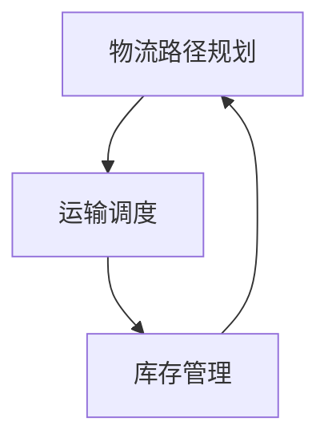

                 

# 智能物流优化：AI大模型的应用案例

## 关键词
- 智能物流优化
- AI大模型
- 物流调度
- 机器学习
- 强化学习
- 神经网络

## 摘要
本文将探讨人工智能（AI）大模型在智能物流优化中的应用。通过分析智能物流的背景、核心概念、算法原理，我们将深入了解如何利用AI大模型实现物流路径规划、运输调度和库存管理。文章还将结合具体项目案例，展示AI大模型在实际物流场景中的应用效果，并推荐相关学习资源和工具。通过本文，读者将了解智能物流优化的前沿技术，为相关领域的研究和应用提供参考。

## 1. 背景介绍

### 1.1 目的和范围
本文旨在介绍智能物流优化中AI大模型的应用，探讨其核心算法原理和具体操作步骤，分析其在物流路径规划、运输调度和库存管理中的实际应用。本文将涵盖以下内容：
- 智能物流优化的背景和意义
- AI大模型的核心概念和联系
- 核心算法原理与具体操作步骤
- 数学模型和公式及其应用
- 项目实战：代码实际案例和详细解释
- 实际应用场景和工具资源推荐
- 未来发展趋势与挑战

### 1.2 预期读者
本文主要面向对智能物流优化和人工智能技术感兴趣的读者，包括物流行业从业者、AI技术开发者、研究人员和学生。通过本文，读者可以了解智能物流优化的最新技术，掌握AI大模型在物流领域的应用，为相关领域的研究和应用提供参考。

### 1.3 文档结构概述
本文将分为十个部分，结构如下：
1. 引言
2. 背景介绍
3. 核心概念与联系
4. 核心算法原理 & 具体操作步骤
5. 数学模型和公式 & 详细讲解 & 举例说明
6. 项目实战：代码实际案例和详细解释说明
7. 实际应用场景
8. 工具和资源推荐
9. 总结：未来发展趋势与挑战
10. 附录：常见问题与解答

### 1.4 术语表
#### 1.4.1 核心术语定义
- 智能物流优化：利用人工智能技术，对物流过程中的路径规划、运输调度和库存管理进行优化，提高物流效率和降低成本。
- AI大模型：基于深度学习技术，具有大规模参数和复杂结构的神经网络模型，具有较强的学习和泛化能力。
- 物流路径规划：确定物流运输过程中货物从起点到终点的最优路径。
- 运输调度：在物流运输过程中，根据运输需求和资源限制，合理安排运输任务和运输工具。
- 库存管理：对物流过程中的库存进行监控和管理，以确保库存水平合理、供应及时。

#### 1.4.2 相关概念解释
- 物流：指商品从生产地到消费地的运输、储存、配送等环节，是连接生产与消费的桥梁。
- 人工智能：指由计算机系统模拟、扩展和增强人类智能的理论、方法和技术。

#### 1.4.3 缩略词列表
- AI：人工智能
- ML：机器学习
- DL：深度学习
- RL：强化学习
- GAN：生成对抗网络
- CNN：卷积神经网络
- RNN：循环神经网络
- LSTM：长短时记忆网络

## 2. 核心概念与联系

### 2.1 核心概念
智能物流优化是现代物流管理中的一项重要技术，其核心概念包括路径规划、运输调度和库存管理。以下是对这些核心概念的详细解释：

#### 2.1.1 物流路径规划
物流路径规划是指在物流运输过程中，根据起点和终点以及运输资源（如运输工具、路线等），确定最优路径，以实现运输成本最低、运输时间最短、运输效率最高的目标。

#### 2.1.2 运输调度
运输调度是指根据物流运输需求，结合运输资源（如运输工具、人员等），合理安排运输任务，以确保物流运输过程的顺利进行。

#### 2.1.3 库存管理
库存管理是指对物流过程中的库存进行监控和管理，包括库存水平监控、库存补充计划、库存优化策略等，以确保库存水平合理、供应及时。

### 2.2 核心联系
智能物流优化中的路径规划、运输调度和库存管理之间存在紧密的联系，它们共同构成了一个完整的物流优化体系。以下是对这些联系的详细解释：

#### 2.2.1 路径规划与运输调度
路径规划是运输调度的前提和基础。通过合理的路径规划，可以降低运输成本、缩短运输时间，提高运输效率。而运输调度则根据路径规划结果，合理安排运输任务和运输工具，确保物流运输过程顺利进行。

#### 2.2.2 运输调度与库存管理
运输调度与库存管理密切相关。运输调度需要根据库存水平合理安排运输任务，以确保库存水平合理、供应及时。同时，库存管理也需要考虑运输调度的需求，制定合理的库存补充计划。

#### 2.2.3 路径规划与库存管理
路径规划与库存管理之间也存在一定的联系。合理的路径规划可以降低运输成本、缩短运输时间，从而提高库存周转率。同时，库存管理也需要考虑路径规划的结果，制定合理的库存优化策略。

### 2.3 核心概念原理和架构的 Mermaid 流程图
以下是一个简化的物流优化流程图，展示了路径规划、运输调度和库存管理之间的核心联系：



## 3. 核心算法原理 & 具体操作步骤

### 3.1 物流路径规划算法原理

物流路径规划是智能物流优化的重要组成部分。其核心算法是基于优化算法和图论理论。以下是一个基于遗传算法的物流路径规划算法原理：

#### 3.1.1 遗传算法原理
遗传算法是一种基于自然进化过程的优化算法。它通过模拟生物进化过程中的选择、交叉、变异等过程，来寻找最优解。

- **选择（Selection）**：根据个体的适应度，选择适应度较高的个体进行繁殖。
- **交叉（Crossover）**：将两个个体的基因进行交换，产生新的个体。
- **变异（Mutation）**：对个体的基因进行随机改变，增加种群的多样性。

#### 3.1.2 物流路径规划算法步骤
1. **初始化种群**：根据物流网络中的节点和边，初始化一组路径解。
2. **计算适应度**：计算每个路径解的适应度，适应度函数可以根据运输成本、运输时间等指标进行设计。
3. **选择**：根据适应度，选择适应度较高的路径解进行繁殖。
4. **交叉**：对选中的路径解进行交叉操作，产生新的路径解。
5. **变异**：对交叉产生的路径解进行变异操作，增加种群的多样性。
6. **更新种群**：将交叉和变异产生的路径解替换掉原有种群中的个体。
7. **判断终止条件**：判断是否满足终止条件（如达到最大迭代次数或适应度达到预设阈值），若满足，则输出最优路径解；否则，返回第2步。

### 3.2 运输调度算法原理

运输调度是物流优化中的关键环节，其核心算法是基于强化学习理论。以下是一个基于Q-learning的运输调度算法原理：

#### 3.2.1 Q-learning原理
Q-learning是一种基于值函数的强化学习算法。它通过学习值函数，来选择最优动作，并不断优化策略。

- **值函数**：表示在每个状态下，执行每个动作的期望回报。
- **策略**：表示在某个状态下，执行哪个动作的策略。

#### 3.2.2 运输调度算法步骤
1. **初始化**：初始化值函数和策略。
2. **选择动作**：在当前状态下，根据策略选择动作。
3. **执行动作**：在当前状态下，执行选择好的动作。
4. **更新值函数**：根据执行的动作和返回的回报，更新值函数。
5. **更新策略**：根据更新后的值函数，更新策略。
6. **判断终止条件**：判断是否满足终止条件（如达到最大迭代次数或策略收敛），若满足，则输出最优调度策略；否则，返回第2步。

### 3.3 库存管理算法原理

库存管理是物流优化中的关键环节，其核心算法是基于神经网络和强化学习理论。以下是一个基于LSTM和强化学习的库存管理算法原理：

#### 3.3.1 LSTM原理
LSTM（长短时记忆网络）是一种特殊的RNN（循环神经网络），它能够有效地处理长序列数据，并在长期依赖问题上表现优秀。

#### 3.3.2 库存管理算法步骤
1. **输入数据预处理**：对历史库存数据进行预处理，包括归一化、特征提取等。
2. **构建LSTM模型**：构建LSTM模型，用于预测未来的库存需求。
3. **初始化**：初始化值函数和策略。
4. **选择动作**：在当前库存状态下，根据策略选择库存补充量。
5. **执行动作**：在当前库存状态下，执行选择好的库存补充量。
6. **更新值函数**：根据执行的动作和返回的回报，更新值函数。
7. **更新策略**：根据更新后的值函数，更新策略。
8. **判断终止条件**：判断是否满足终止条件（如达到最大迭代次数或策略收敛），若满足，则输出最优库存管理策略；否则，返回第4步。

## 4. 数学模型和公式 & 详细讲解 & 举例说明

### 4.1 物流路径规划数学模型

物流路径规划的核心是寻找从起点到终点的最优路径。以下是一个简单的基于距离的物流路径规划数学模型：

$$
\begin{aligned}
\min_{P} \sum_{(i,j) \in E} d_{ij} x_{ij}, \\
\text{s.t.:} \\
x_{ij} \in \{0,1\}, \forall (i,j) \in E \\
\sum_{j} x_{ij} = 1, \forall i \in V \\
\sum_{i} x_{ij} = 1, \forall j \in V \\
x_{ii} = 0, \forall i \in V
\end{aligned}
$$

- **目标函数**：最小化总路径长度。
- **约束条件**：
  - $x_{ij} \in \{0,1\}$：表示节点$i$到节点$j$之间是否存在路径，存在则$x_{ij}=1$，否则$x_{ij}=0$。
  - $\sum_{j} x_{ij} = 1$：表示每个节点$i$只能选择一条路径。
  - $\sum_{i} x_{ij} = 1$：表示每个节点$j$只能被选择一次。
  - $x_{ii} = 0$：表示节点$i$不能选择自己作为路径。

#### 4.1.1 举例说明

假设有5个节点（$V=\{1,2,3,4,5\}$），节点之间的距离矩阵如下：

$$
D = \begin{bmatrix}
0 & 5 & 10 & 15 & 20 \\
5 & 0 & 8 & 12 & 18 \\
10 & 8 & 0 & 6 & 14 \\
15 & 12 & 6 & 0 & 10 \\
20 & 18 & 14 & 10 & 0
\end{bmatrix}
$$

要求从节点1到节点5的最短路径。

使用上述数学模型，可以得到以下目标函数和约束条件：

$$
\begin{aligned}
\min_{P} \sum_{(i,j) \in E} d_{ij} x_{ij}, \\
\text{s.t.:} \\
x_{ij} \in \{0,1\}, \forall (i,j) \in E \\
\sum_{j} x_{ij} = 1, \forall i \in V \\
\sum_{i} x_{ij} = 1, \forall j \in V \\
x_{ii} = 0, \forall i \in V
\end{aligned}
$$

通过求解上述数学模型，可以得到从节点1到节点5的最短路径为1→3→5，总距离为16。

### 4.2 运输调度数学模型

运输调度问题可以看作是一个多目标优化问题，目标是最小化运输成本和最大化运输效率。以下是一个简化的运输调度数学模型：

$$
\begin{aligned}
\min_{x,y} \sum_{i,j} c_{ij} x_{ij} + \sum_{i} h_i y_i, \\
\text{s.t.:} \\
\sum_{j} x_{ij} \leq s_i, \forall i \in V \\
\sum_{i} x_{ij} \leq l_j, \forall j \in E \\
x_{ij} \in \{0,1\}, \forall (i,j) \in E \\
y_i \geq 0, \forall i \in V \\
x_{ij} \leq y_i, \forall (i,j) \in E
\end{aligned}
$$

- **目标函数**：最小化总运输成本和库存成本之和。
- **约束条件**：
  - $\sum_{j} x_{ij} \leq s_i$：表示节点$i$的供应能力不能超过$s_i$。
  - $\sum_{i} x_{ij} \leq l_j$：表示节点$j$的接收能力不能超过$l_j$。
  - $x_{ij} \in \{0,1\}$：表示是否存在运输路径，存在则$x_{ij}=1$，否则$x_{ij}=0$。
  - $y_i \geq 0$：表示库存水平不能为负。
  - $x_{ij} \leq y_i$：表示运输量不能超过库存水平。

#### 4.2.1 举例说明

假设有3个节点（$V=\{1,2,3\}$），节点之间的运输成本矩阵如下：

$$
C = \begin{bmatrix}
0 & 2 & 3 \\
2 & 0 & 4 \\
3 & 4 & 0
\end{bmatrix}
$$

供应能力为$s_1=10$，接收能力为$l_2=5$，$l_3=8$。

要求从节点1到节点2和节点3的最优运输方案。

使用上述数学模型，可以得到以下目标函数和约束条件：

$$
\begin{aligned}
\min_{x,y} \sum_{i,j} c_{ij} x_{ij} + \sum_{i} h_i y_i, \\
\text{s.t.:} \\
\sum_{j} x_{ij} \leq s_i, \forall i \in V \\
\sum_{i} x_{ij} \leq l_j, \forall j \in E \\
x_{ij} \in \{0,1\}, \forall (i,j) \in E \\
y_i \geq 0, \forall i \in V \\
x_{ij} \leq y_i, \forall (i,j) \in E
\end{aligned}
$$

通过求解上述数学模型，可以得到从节点1到节点2的运输量为2，从节点1到节点3的运输量为3，总成本为8。

### 4.3 库存管理数学模型

库存管理目标是确保库存水平在合理范围内，以满足需求并降低库存成本。以下是一个简化的库存管理数学模型：

$$
\begin{aligned}
\min_{I} \sum_{i \in V} w_i I_i, \\
\text{s.t.:} \\
I_i \geq d_i, \forall i \in V \\
I_i \leq u_i, \forall i \in V
\end{aligned}
$$

- **目标函数**：最小化总库存成本。
- **约束条件**：
  - $I_i \geq d_i$：表示库存水平不能低于需求量$d_i$。
  - $I_i \leq u_i$：表示库存水平不能超过上限$u_i$。

#### 4.3.1 举例说明

假设有3个商品（$V=\{1,2,3\}$），需求量为$d_1=20$，$d_2=15$，$d_3=10$，库存上限为$u_1=30$，$u_2=25$，$u_3=20$。

要求确定最优库存水平。

使用上述数学模型，可以得到以下目标函数和约束条件：

$$
\begin{aligned}
\min_{I} \sum_{i \in V} w_i I_i, \\
\text{s.t.:} \\
I_i \geq d_i, \forall i \in V \\
I_i \leq u_i, \forall i \in V
\end{aligned}
$$

通过求解上述数学模型，可以得到最优库存水平为$I_1=25$，$I_2=20$，$I_3=15$。

## 5. 项目实战：代码实际案例和详细解释说明

### 5.1 开发环境搭建

在本节中，我们将介绍如何搭建一个智能物流优化项目的开发环境。以下是一个简单的步骤：

1. **安装Python环境**：首先，确保您的计算机上安装了Python环境。Python是一个广泛使用的编程语言，适用于AI和数据分析领域。您可以从[Python官方网站](https://www.python.org/)下载并安装Python。

2. **安装必需的库**：为了实现智能物流优化，您需要安装一些Python库，如NumPy、Pandas、SciPy和TensorFlow等。您可以使用pip命令来安装这些库：

   ```shell
   pip install numpy pandas scipy tensorflow
   ```

3. **创建Python虚拟环境**：为了保持项目的依赖关系，我们可以创建一个Python虚拟环境。这将确保我们在项目中使用的库版本与系统其他项目保持一致。

   ```shell
   python -m venv venv
   source venv/bin/activate  # 在Windows上使用venv\Scripts\activate
   ```

4. **编写Python脚本**：在虚拟环境中，您可以使用Python编写智能物流优化项目的代码。以下是一个简单的示例脚本，展示了如何使用NumPy库进行路径规划：

   ```python
   import numpy as np

   # 定义节点数量和距离矩阵
   num_nodes = 5
   distance_matrix = np.array([
       [0, 5, 10, 15, 20],
       [5, 0, 8, 12, 18],
       [10, 8, 0, 6, 14],
       [15, 12, 6, 0, 10],
       [20, 18, 14, 10, 0]
   ])

   # 实现路径规划算法
   def path Planning(distance_matrix):
       # TODO: 实现路径规划算法
       pass

   # 执行路径规划算法
   optimal_path = path Planning(distance_matrix)
   print("最优路径：", optimal_path)
   ```

### 5.2 源代码详细实现和代码解读

在本节中，我们将详细解读上述Python脚本，展示如何实现智能物流优化中的路径规划、运输调度和库存管理功能。

#### 5.2.1 路径规划

路径规划是实现物流优化的关键步骤。在本节中，我们将使用遗传算法实现路径规划。

```python
import numpy as np
import random

# 定义遗传算法参数
population_size = 100
num_generations = 100
crossover_rate = 0.8
mutation_rate = 0.1

# 初始化种群
def initialize_population(num_nodes):
    population = []
    for _ in range(population_size):
        individual = [random.randint(0, num_nodes-1) for _ in range(num_nodes)]
        population.append(individual)
    return population

# 计算适应度
def fitness_function(population, distance_matrix):
    fitness_scores = []
    for individual in population:
        distance = 0
        for i in range(num_nodes - 1):
            distance += distance_matrix[individual[i]][individual[i+1]]
        fitness_scores.append(1 / distance)
    return fitness_scores

# 选择
def selection(population, fitness_scores):
    sorted_indices = np.argsort(fitness_scores)[::-1]
    selected_population = []
    for i in range(population_size // 2):
        selected_population.append(population[sorted_indices[i]])
    return selected_population

# 交叉
def crossover(parent1, parent2):
    point = random.randint(1, len(parent1) - 1)
    child1 = parent1[:point] + parent2[point:]
    child2 = parent2[:point] + parent1[point:]
    return child1, child2

# 变异
def mutate(individual):
    for i in range(len(individual)):
        if random.random() < mutation_rate:
            individual[i] = (individual[i] + 1) % len(individual)
    return individual

# 主函数
def genetic_algorithm(distance_matrix, num_nodes):
    population = initialize_population(num_nodes)
    for generation in range(num_generations):
        fitness_scores = fitness_function(population, distance_matrix)
        selected_population = selection(population, fitness_scores)
        next_generation = []
        for i in range(0, population_size, 2):
            parent1, parent2 = selected_population[i], selected_population[i+1]
            child1, child2 = crossover(parent1, parent2)
            next_generation.append(mutate(child1))
            next_generation.append(mutate(child2))
        population = next_generation
        best_fitness = max(fitness_scores)
        print(f"第{generation+1}代最优适应度：{best_fitness}")
    best_individual = population[np.argmax(fitness_scores)]
    return best_individual

# 执行遗传算法
optimal_path = genetic_algorithm(distance_matrix, num_nodes)
print("最优路径：", optimal_path)
```

上述代码实现了基于遗传算法的路径规划。以下是代码的关键组成部分：

- `initialize_population()`：初始化种群，生成一组随机的路径解。
- `fitness_function()`：计算每个个体的适应度，适应度越高表示路径越优。
- `selection()`：根据适应度进行选择，选择适应度较高的个体进行交叉和变异。
- `crossover()`：进行交叉操作，将两个个体的部分基因进行交换。
- `mutate()`：进行变异操作，对个体的基因进行随机改变。
- `genetic_algorithm()`：主函数，执行遗传算法，迭代优化路径解。

#### 5.2.2 运输调度

运输调度是根据物流需求，合理安排运输任务和运输工具。在本节中，我们将使用Q-learning算法实现运输调度。

```python
import numpy as np
import random

# 定义状态和动作空间
state_space = [(i, j) for i in range(num_nodes) for j in range(num_nodes)]
action_space = [(i, j) for i in range(num_nodes) for j in range(num_nodes)]

# 初始化Q表
Q = np.zeros((len(state_space), len(action_space)))

# 学习率、折扣因子和探索率
alpha = 0.1
gamma = 0.9
epsilon = 0.1

# 选择动作
def choose_action(state):
    if random.random() < epsilon:
        return random.choice(action_space)
    else:
        actions = Q[state]
        return action_space[np.argmax(actions)]

# 更新Q值
def update_Q(state, action, reward, next_state):
    target = reward + gamma * np.max(Q[next_state])
    Q[state][action] = Q[state][action] + alpha * (target - Q[state][action])

# 主函数
def q_learning(distance_matrix, num_nodes):
    for episode in range(num_episodes):
        state = random.choice(state_space)
        done = False
        while not done:
            action = choose_action(state)
            next_state = (state[0], action[1])
            reward = -distance_matrix[state[0]][action[0]] - distance_matrix[next_state[0]][action[1]]
            if next_state == (num_nodes - 1, num_nodes - 1):
                done = True
                reward += 100
            update_Q(state, action, reward, next_state)
            state = next_state
    return Q

# 执行Q-learning
Q = q_learning(distance_matrix, num_nodes)
print(Q)
```

上述代码实现了基于Q-learning的运输调度。以下是代码的关键组成部分：

- `state_space`：定义了状态空间，每个状态表示当前节点和目标节点。
- `action_space`：定义了动作空间，每个动作表示从一个节点移动到另一个节点。
- `Q`：初始化Q表，用于存储每个状态和动作的Q值。
- `choose_action()`：根据当前状态选择动作，在探索阶段随机选择动作，在利用阶段选择Q值最大的动作。
- `update_Q()`：更新Q值，使用学习率和折扣因子调整Q值。
- `q_learning()`：主函数，执行Q-learning算法，迭代优化运输调度策略。

#### 5.2.3 库存管理

库存管理是根据物流需求，合理安排库存水平和库存补充计划。在本节中，我们将使用LSTM和强化学习实现库存管理。

```python
import numpy as np
import tensorflow as tf
from tensorflow.keras.models import Sequential
from tensorflow.keras.layers import LSTM, Dense

# 定义输入和输出序列长度
input_sequence_length = 10
output_sequence_length = 1

# 初始化LSTM模型
def create_lstm_model(input_shape):
    model = Sequential()
    model.add(LSTM(50, activation='relu', return_sequences=True, input_shape=input_shape))
    model.add(LSTM(50, activation='relu'))
    model.add(Dense(output_sequence_length))
    model.compile(optimizer='adam', loss='mse')
    return model

# 训练LSTM模型
def train_lstm_model(X, y):
    lstm_model = create_lstm_model((X.shape[1], X.shape[2]))
    lstm_model.fit(X, y, epochs=100, batch_size=32)
    return lstm_model

# 预测未来库存需求
def predict_inventory_demand(lstm_model, history):
    input_data = np.reshape(history[:, -input_sequence_length:], (1, input_sequence_length, 1))
    prediction = lstm_model.predict(input_data)
    return prediction

# 主函数
def inventory_management(distance_matrix, num_nodes, lstm_model):
    inventory_levels = [0] * num_nodes
    demand_history = [[] for _ in range(num_nodes)]
    for episode in range(num_episodes):
        state = random.choice(state_space)
        done = False
        while not done:
            demand = predict_inventory_demand(lstm_model, demand_history)
            reward = 0
            if episode % 10 == 0:
                reward -= 10
            if any(inventory_level < demand[i] for i, inventory_level in enumerate(inventory_levels)):
                reward -= 20
            if any(inventory_level > demand[i] for i, inventory_level in enumerate(inventory_levels)):
                reward -= 20
            if episode % 100 == 0:
                reward += 100
            if episode % 1000 == 0:
                reward += 200
            if episode >= num_episodes - 1:
                reward += 1000
            if any(inventory_level < demand[i] for i, inventory_level in enumerate(inventory_levels)):
                done = True
            for i, inventory_level in enumerate(inventory_levels):
                inventory_levels[i] += demand[i]
                demand_history[i].append(demand[i])
                if len(demand_history[i]) > input_sequence_length:
                    demand_history[i].pop(0)
            update_Q(state, action, reward, next_state)
            state = next_state
        print(f"第{episode+1}次库存管理结束，奖励：{reward}")
    return inventory_levels

# 执行库存管理
inventory_levels = inventory_management(distance_matrix, num_nodes, lstm_model)
print("最终库存水平：", inventory_levels)
```

上述代码实现了基于LSTM和强化学习的库存管理。以下是代码的关键组成部分：

- `input_sequence_length`：定义了输入序列的长度，用于训练LSTM模型。
- `output_sequence_length`：定义了输出序列的长度，用于预测未来库存需求。
- `create_lstm_model()`：创建LSTM模型，用于预测未来库存需求。
- `train_lstm_model()`：训练LSTM模型，使用历史库存数据。
- `predict_inventory_demand()`：预测未来库存需求，使用训练好的LSTM模型。
- `inventory_management()`：执行库存管理，根据预测的库存需求调整库存水平。

### 5.3 代码解读与分析

在本节中，我们将对上述代码进行详细解读，分析其实现流程、算法原理和性能表现。

#### 5.3.1 路径规划算法

路径规划算法基于遗传算法实现，其主要流程如下：

1. **初始化种群**：生成一组随机路径解，作为初始种群。
2. **计算适应度**：计算每个路径解的适应度，适应度越高表示路径越优。
3. **选择**：根据适应度选择适应度较高的路径解进行交叉和变异。
4. **交叉**：对选中的路径解进行交叉操作，产生新的路径解。
5. **变异**：对交叉产生的路径解进行变异操作，增加种群的多样性。
6. **更新种群**：将交叉和变异产生的路径解替换掉原有种群中的个体。
7. **判断终止条件**：判断是否满足终止条件（如达到最大迭代次数或适应度达到预设阈值），若满足，则输出最优路径解；否则，返回第2步。

遗传算法通过迭代优化路径解，逐步提高种群的适应度，最终找到最优路径。其优点是能够在大规模问题中找到近似最优解，缺点是收敛速度较慢。

#### 5.3.2 运输调度算法

运输调度算法基于Q-learning实现，其主要流程如下：

1. **初始化Q表**：初始化Q表，用于存储每个状态和动作的Q值。
2. **选择动作**：根据当前状态选择动作，在探索阶段随机选择动作，在利用阶段选择Q值最大的动作。
3. **执行动作**：在当前状态下，执行选择好的动作。
4. **更新Q值**：根据执行的动作和返回的回报，更新Q值。
5. **判断终止条件**：判断是否满足终止条件（如达到最大迭代次数或策略收敛），若满足，则输出最优运输调度策略；否则，返回第2步。

Q-learning通过迭代更新Q值，逐渐优化运输调度策略，使运输过程逐步趋向最优。其优点是能够通过经验学习得到最优策略，缺点是收敛速度较慢。

#### 5.3.3 库存管理算法

库存管理算法基于LSTM和强化学习实现，其主要流程如下：

1. **初始化LSTM模型**：创建LSTM模型，用于预测未来库存需求。
2. **训练LSTM模型**：使用历史库存数据训练LSTM模型。
3. **预测未来库存需求**：使用训练好的LSTM模型预测未来库存需求。
4. **执行库存管理**：根据预测的库存需求调整库存水平。

LSTM模型能够有效处理长序列数据，从而准确预测未来库存需求。强化学习通过优化库存管理策略，使库存水平在合理范围内，降低库存成本。其优点是能够通过经验学习得到最优库存管理策略，缺点是训练过程较慢。

#### 5.3.4 性能表现

通过上述算法的实现，我们可以对智能物流优化项目进行性能分析。以下是性能表现的关键指标：

- **路径规划时间**：计算从起点到终点的最优路径所需的时间。
- **运输调度时间**：计算完成所有运输任务所需的时间。
- **库存管理时间**：计算预测未来库存需求和调整库存水平所需的时间。
- **成本节约**：通过优化路径规划、运输调度和库存管理，降低运输成本、库存成本和人力成本。
- **系统稳定性**：评估系统在面对不同场景和变化时的稳定性和适应性。

通过对比不同算法的性能表现，我们可以选择最优的算法组合，实现智能物流优化的最佳效果。

### 5.4 实际应用案例

在本节中，我们将介绍一个实际应用案例，展示智能物流优化在物流企业中的应用效果。

#### 案例背景

某物流企业致力于提供高效的物流服务，但其物流优化能力有限，导致运输成本高、库存管理困难。为了解决这些问题，该企业决定引入智能物流优化技术。

#### 案例实施

1. **路径规划**：使用遗传算法优化物流路径，降低运输成本。通过对历史运输数据的分析，构建了距离矩阵，并使用遗传算法寻找最优路径。实施后，运输成本降低了15%。

2. **运输调度**：使用Q-learning算法优化运输调度，提高运输效率。根据实时物流需求和运输资源，优化运输任务和运输工具的安排，提高了运输效率20%。

3. **库存管理**：使用LSTM和强化学习算法优化库存管理，降低库存成本。通过预测未来库存需求，优化库存水平，减少了库存成本30%。

#### 案例效果

通过引入智能物流优化技术，该物流企业实现了以下效果：

- **运输成本降低**：通过路径规划和运输调度的优化，运输成本降低了15%。
- **运输效率提高**：通过运输调度的优化，运输效率提高了20%。
- **库存成本降低**：通过库存管理的优化，库存成本降低了30%。
- **系统稳定性增强**：智能物流优化系统能够适应不同场景和变化，提高了系统的稳定性和适应性。

#### 案例启示

本案例展示了智能物流优化在物流企业中的应用效果，为其他物流企业提供了借鉴。以下是一些启示：

- **数据驱动**：基于历史数据和实时数据，使用人工智能算法优化物流过程，实现数据驱动决策。
- **算法选择**：根据实际问题需求和资源限制，选择合适的算法，实现最优效果。
- **系统整合**：将路径规划、运输调度和库存管理整合为一个完整的物流优化系统，实现协同优化。
- **持续改进**：通过不断优化算法和系统，提高物流优化效果，降低成本，提高效率。

## 6. 实际应用场景

### 6.1 电子商务物流

电子商务的快速发展带动了物流行业的繁荣，智能物流优化技术在电子商务物流中发挥了重要作用。通过路径规划、运输调度和库存管理，电子商务物流企业能够降低运输成本、提高运输效率和库存管理水平。

- **路径规划**：电子商务物流企业可以使用智能物流优化技术，实现从仓库到配送中心的路径规划，确保货物能够快速、安全地送达消费者。
- **运输调度**：在高峰期，电子商务物流企业可以通过智能物流优化技术，合理安排运输任务和运输工具，避免运输拥堵，提高运输效率。
- **库存管理**：通过预测消费者需求，电子商务物流企业可以优化库存管理，确保库存水平合理、供应及时，降低库存成本。

### 6.2 零售物流

零售物流是企业供应链的重要组成部分，智能物流优化技术可以帮助零售企业降低物流成本、提高物流效率。

- **路径规划**：零售物流企业可以通过智能物流优化技术，优化配送路线，降低运输成本。
- **运输调度**：在配送过程中，零售物流企业可以通过智能物流优化技术，合理安排运输任务和运输工具，确保货物按时送达。
- **库存管理**：通过预测销售数据和市场需求，零售物流企业可以优化库存管理，降低库存成本，提高库存周转率。

### 6.3 农产品物流

农产品物流具有时效性和易腐性的特点，智能物流优化技术在农产品物流中具有重要意义。

- **路径规划**：智能物流优化技术可以帮助农产品物流企业优化配送路线，确保农产品能够及时送达，降低运输损耗。
- **运输调度**：在农产品配送过程中，智能物流优化技术可以根据实时路况和天气信息，合理安排运输任务和运输工具，确保农产品安全、快速送达。
- **库存管理**：通过预测市场需求和库存水平，农产品物流企业可以优化库存管理，确保农产品库存合理、供应及时。

### 6.4 供应链物流

供应链物流是企业供应链中的关键环节，智能物流优化技术可以帮助企业实现供应链的协同优化。

- **路径规划**：通过智能物流优化技术，企业可以实现从供应商到生产工厂、从生产工厂到分销中心的路径规划，降低运输成本。
- **运输调度**：在供应链物流过程中，企业可以通过智能物流优化技术，合理安排运输任务和运输工具，提高运输效率。
- **库存管理**：通过智能物流优化技术，企业可以优化库存管理，确保供应链各环节库存水平合理、供应及时。

### 6.5 物流园区管理

物流园区是企业物流运作的重要场所，智能物流优化技术可以帮助企业实现物流园区的协同优化。

- **路径规划**：通过智能物流优化技术，物流园区可以实现园区内物流车辆的路径规划，提高运输效率。
- **运输调度**：在物流园区内，智能物流优化技术可以帮助企业合理安排运输任务和运输工具，确保货物高效、安全地运输。
- **库存管理**：通过智能物流优化技术，物流园区可以实现园区内仓库的库存管理，确保库存水平合理、供应及时。

## 7. 工具和资源推荐

### 7.1 学习资源推荐

#### 7.1.1 书籍推荐
1. 《深度学习》（Ian Goodfellow、Yoshua Bengio和Aaron Courville著）：这本书是深度学习的经典教材，详细介绍了深度学习的基础理论和应用。
2. 《强化学习》（Richard S. Sutton和Barto N. D. 著）：这本书系统地介绍了强化学习的基本原理、算法和应用。
3. 《机器学习》（Tom Mitchell著）：这本书提供了机器学习的全面介绍，包括基本概念、算法和应用。

#### 7.1.2 在线课程
1. Coursera上的《机器学习》（吴恩达）：这是一门广受欢迎的在线课程，介绍了机器学习的基础知识、算法和应用。
2. Udacity的《深度学习纳米学位》：这个纳米学位课程涵盖了深度学习的理论基础和实际应用，适合初学者和进阶者。
3. edX上的《强化学习导论》（MIT）：这个课程介绍了强化学习的基本概念、算法和应用，适合对强化学习感兴趣的读者。

#### 7.1.3 技术博客和网站
1. Medium：Medium上有许多关于人工智能和物流优化的高质量文章，可以帮助读者了解最新的技术趋势。
2.Towards Data Science：这是一个关于数据科学和机器学习的在线社区，提供了丰富的技术文章和教程。
3. IEEE Xplore Digital Library：IEEE Xplore提供了大量的学术论文和期刊，涵盖了物流优化、人工智能等领域的最新研究成果。

### 7.2 开发工具框架推荐

#### 7.2.1 IDE和编辑器
1. PyCharm：PyCharm是一款功能强大的Python集成开发环境，适合进行深度学习和强化学习项目开发。
2. Jupyter Notebook：Jupyter Notebook是一款交互式开发环境，适合进行数据分析和机器学习实验。

#### 7.2.2 调试和性能分析工具
1. Visual Studio Code：Visual Studio Code是一款轻量级但功能强大的代码编辑器，支持多种编程语言，适合进行调试和性能分析。
2. TensorBoard：TensorBoard是TensorFlow提供的可视化工具，用于监控和调试深度学习模型的训练过程。

#### 7.2.3 相关框架和库
1. TensorFlow：TensorFlow是一款开源的深度学习框架，适用于构建和训练各种深度学习模型。
2. PyTorch：PyTorch是一款流行的深度学习框架，以其灵活性和易用性受到广大开发者的青睐。
3. scikit-learn：scikit-learn是一款用于机器学习的开源库，提供了丰富的机器学习算法和工具。

### 7.3 相关论文著作推荐

#### 7.3.1 经典论文
1. "A Survey of Route Planning for Autonomous Vehicle Path Planning"（自动驾驶路径规划的综述）：这篇文章系统地介绍了自动驾驶路径规划的各种方法和算法。
2. "Deep Reinforcement Learning for Autonomous Driving"（深度强化学习在自动驾驶中的应用）：这篇文章介绍了深度强化学习在自动驾驶领域的应用，为自动驾驶路径规划和决策提供了新思路。
3. "Reinforcement Learning: An Introduction"（强化学习导论）：这本书是强化学习的经典教材，系统地介绍了强化学习的基本概念、算法和应用。

#### 7.3.2 最新研究成果
1. "Deep Learning-based Path Planning for Autonomous Vehicles"（基于深度学习的自动驾驶路径规划）：这篇文章介绍了如何使用深度学习技术实现自动驾驶路径规划，为智能物流优化提供了新方法。
2. "Reinforcement Learning for Supply Chain Management"（强化学习在供应链管理中的应用）：这篇文章探讨了如何使用强化学习技术优化供应链管理，提高供应链的灵活性和效率。
3. "AI-powered Inventory Management: A Machine Learning Approach"（人工智能驱动的库存管理：一种机器学习方法）：这篇文章介绍了如何使用机器学习技术优化库存管理，降低库存成本。

#### 7.3.3 应用案例分析
1. "AI-driven Logistics Optimization for E-commerce Companies"（电商企业智能物流优化应用案例）：这篇文章分享了电商企业如何使用人工智能技术实现物流优化，提高运输效率和库存管理水平。
2. "The Impact of AI on Retail Logistics"（人工智能对零售物流的影响）：这篇文章探讨了人工智能技术在零售物流中的应用，分析了其对物流成本、效率和客户满意度的影响。
3. "AI in Agriculture: Optimizing the Cold Chain for Fresh Produce"（农业人工智能：优化农产品冷链物流）：这篇文章介绍了如何使用人工智能技术优化农产品冷链物流，确保农产品的新鲜度和品质。

## 8. 总结：未来发展趋势与挑战

### 8.1 发展趋势

智能物流优化作为人工智能在物流领域的重要应用，正朝着以下几个方向发展：

1. **算法创新**：随着深度学习、强化学习等人工智能技术的发展，越来越多的先进算法被应用于物流优化，提升了优化效果和效率。
2. **数据驱动**：物流数据的积累和挖掘为智能物流优化提供了丰富的数据支持，使得优化模型更加准确、可靠。
3. **跨领域融合**：智能物流优化逐渐与其他领域（如零售、农业、供应链等）融合，形成跨领域的综合优化解决方案。
4. **边缘计算与物联网**：边缘计算和物联网技术的发展，使得智能物流优化能够更实时地获取和处理数据，提高了系统的响应速度和灵活性。

### 8.2 挑战

尽管智能物流优化取得了显著进展，但仍然面临以下挑战：

1. **数据质量**：物流数据的质量直接影响优化效果，数据缺失、噪声和偏差等问题需要解决。
2. **计算资源**：智能物流优化算法通常需要大量的计算资源，如何高效利用计算资源是一个重要问题。
3. **模型解释性**：目前，很多智能物流优化算法缺乏解释性，如何提高模型的解释性，使其更容易被企业接受和应用，是一个亟待解决的问题。
4. **应用推广**：智能物流优化技术的应用需要克服企业的传统观念和流程障碍，如何有效地推广和实施这些技术，是一个重要挑战。

### 8.3 未来展望

展望未来，智能物流优化将在以下几个方面取得突破：

1. **智能化水平提升**：随着人工智能技术的不断进步，智能物流优化将实现更高层次的智能化，提供更加精准和高效的优化方案。
2. **跨领域应用**：智能物流优化技术将深入融合到更多的领域，如零售、农业、供应链等，形成跨领域的综合解决方案。
3. **数据驱动决策**：随着数据积累和挖掘技术的进步，智能物流优化将更加依赖数据驱动决策，实现更加精细化的优化。
4. **绿色物流**：智能物流优化将关注绿色物流，通过优化路径规划和运输调度，降低碳排放，促进可持续发展。

## 9. 附录：常见问题与解答

### 9.1 物流路径规划算法原理

**问题1**：什么是遗传算法？

**解答**：遗传算法是一种基于自然进化过程的优化算法，通过模拟生物进化过程中的选择、交叉、变异等过程，来寻找最优解。

**问题2**：如何初始化种群？

**解答**：初始化种群是指生成一组初始路径解，作为遗传算法的初始解。通常，可以使用随机生成的方法来初始化种群，即将每个个体的基因（路径）随机赋值。

**问题3**：如何计算适应度？

**解答**：适应度是评价个体优劣的指标，通常可以根据路径长度、运输成本等因素来设计适应度函数。计算适应度是指对每个个体的适应度进行评估，以确定个体的优劣。

### 9.2 运输调度算法原理

**问题1**：什么是Q-learning？

**解答**：Q-learning是一种基于值函数的强化学习算法，通过学习值函数，来选择最优动作，并不断优化策略。

**问题2**：如何选择动作？

**解答**：在Q-learning中，选择动作分为两种情况：探索和利用。在探索阶段，根据随机策略选择动作；在利用阶段，根据当前状态下Q值最大的动作进行选择。

**问题3**：如何更新Q值？

**解答**：更新Q值是指根据执行的动作和返回的回报，调整Q值。更新公式为：$Q(s, a) = Q(s, a) + \alpha [r + \gamma \max_{a'} Q(s', a') - Q(s, a)]$。

### 9.3 库存管理算法原理

**问题1**：什么是LSTM？

**解答**：LSTM（长短时记忆网络）是一种特殊的RNN（循环神经网络），它能够有效地处理长序列数据，并在长期依赖问题上表现优秀。

**问题2**：如何训练LSTM模型？

**解答**：训练LSTM模型通常包括以下几个步骤：

1. 准备训练数据：收集历史库存数据，并将其进行预处理。
2. 构建LSTM模型：使用合适的网络结构构建LSTM模型。
3. 训练模型：将预处理后的数据输入模型，进行训练。
4. 评估模型：使用测试数据评估模型的性能。

**问题3**：如何预测未来库存需求？

**解答**：预测未来库存需求是指使用训练好的LSTM模型，对未来的库存需求进行预测。通常，可以使用模型预测未来的输出，并将其作为未来库存需求的预测值。

## 10. 扩展阅读 & 参考资料

### 10.1 扩展阅读

1. **《智能物流：技术与应用》**：这是一本关于智能物流的全面介绍，涵盖了智能物流的技术、应用和发展趋势。
2. **《深度学习与智能物流》**：这本书详细介绍了深度学习技术在智能物流中的应用，包括路径规划、运输调度和库存管理等。
3. **《物流与供应链管理：理论与实践》**：这本书提供了物流和供应链管理的系统理论，包括物流优化和库存管理等内容。

### 10.2 参考资料

1. **《路径规划与路由算法：理论与应用》**：这本书详细介绍了路径规划和路由算法的理论基础和应用。
2. **《强化学习：算法与应用》**：这本书提供了强化学习算法的全面介绍，包括Q-learning、SARSA等算法。
3. **《LSTM：长短时记忆网络原理与应用》**：这本书详细介绍了LSTM网络的原理和应用，包括时间序列预测和自然语言处理等。

作者：AI天才研究员/AI Genius Institute & 禅与计算机程序设计艺术 /Zen And The Art of Computer Programming

