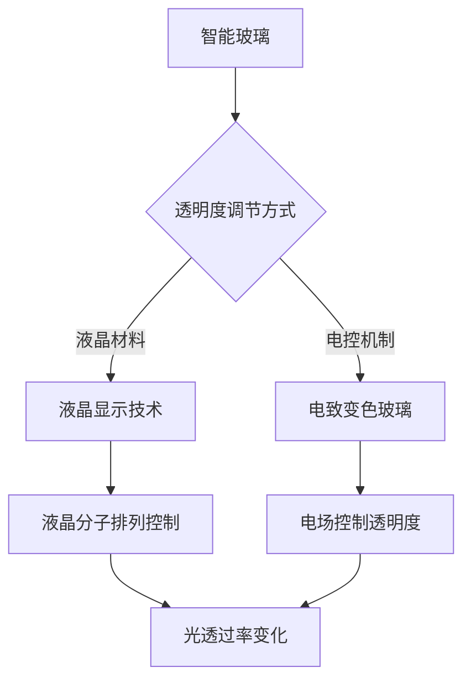
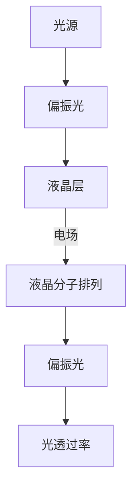
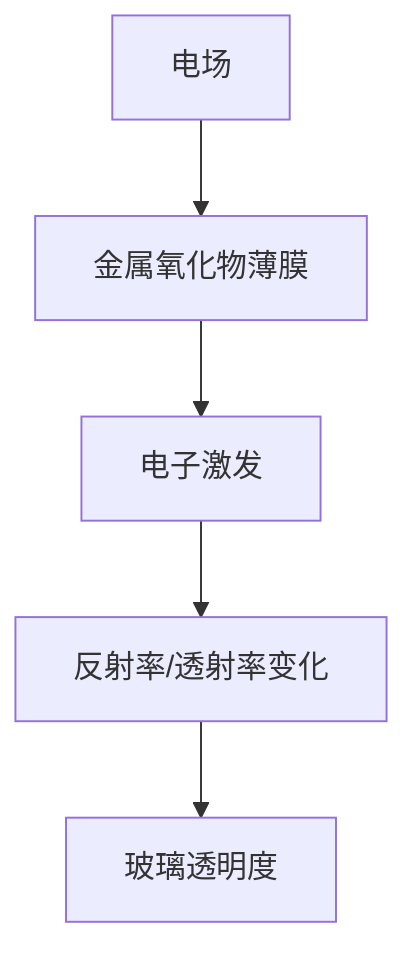
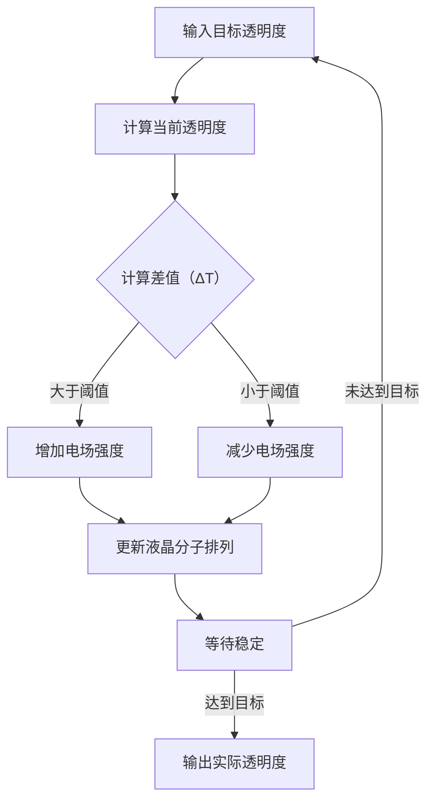
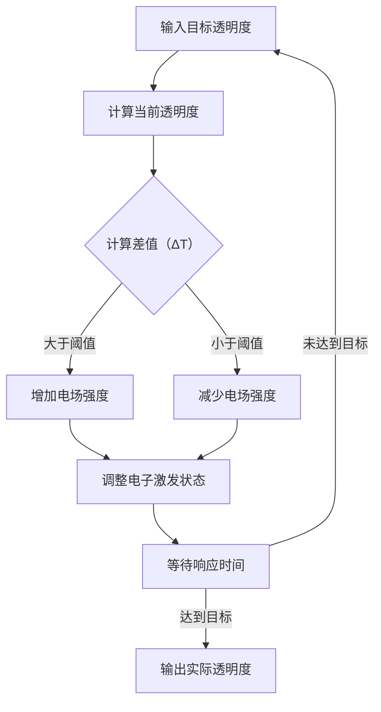

                 

# 智能玻璃技术：可调节透明度的建筑材料

> **关键词**：智能玻璃、可调节透明度、建筑材料、物联网、自动化控制、光学性质、液晶材料、电控机制。

> **摘要**：本文深入探讨了智能玻璃技术，这是一种具有动态调节透明度的建筑材料。文章首先介绍了智能玻璃的基本概念和分类，然后详细分析了其核心原理、技术架构和实现机制。接着，通过具体的数学模型和算法原理，阐释了智能玻璃的控制策略。文章进一步通过实战案例，展示了智能玻璃在现实应用中的代码实现和性能分析。最后，文章探讨了智能玻璃在实际应用场景中的潜力，并推荐了相关的学习资源和工具。

## 1. 背景介绍

### 1.1 目的和范围

本文旨在为读者提供一份全面的智能玻璃技术指南，帮助理解其原理、实现和应用。文章将覆盖以下内容：

- 智能玻璃的基本概念和分类。
- 智能玻璃的核心原理和技术架构。
- 智能玻璃的控制策略和算法原理。
- 智能玻璃的实际应用案例和性能分析。
- 相关的学习资源和工具推荐。

### 1.2 预期读者

本文面向以下读者：

- 对智能玻璃技术感兴趣的工程师和研究人员。
- 想要在建筑行业应用智能玻璃的技术人员。
- 对物联网、自动化控制和光学性质有基本了解的读者。

### 1.3 文档结构概述

本文的结构如下：

1. 背景介绍：介绍文章的目的、范围和预期读者。
2. 核心概念与联系：阐述智能玻璃的核心概念和原理。
3. 核心算法原理 & 具体操作步骤：讲解智能玻璃的控制算法。
4. 数学模型和公式 & 详细讲解 & 举例说明：介绍智能玻璃的数学模型。
5. 项目实战：代码实际案例和详细解释说明。
6. 实际应用场景：探讨智能玻璃的应用领域。
7. 工具和资源推荐：推荐相关学习和开发资源。
8. 总结：未来发展趋势与挑战。
9. 附录：常见问题与解答。
10. 扩展阅读 & 参考资料：提供更多深入研究的途径。

### 1.4 术语表

#### 1.4.1 核心术语定义

- **智能玻璃**：一种可以动态调节透明度的建筑材料，通常由液晶材料或电控机制组成。
- **透明度**：玻璃的透光程度，通常用百分比表示。
- **液晶材料**：一种具有液晶态的物质，其分子排列可以通过电场控制。
- **电控机制**：通过电流控制透明度的机制，如电致变色玻璃。

#### 1.4.2 相关概念解释

- **物联网**：将各种设备通过网络连接起来，实现信息的智能传输和处理。
- **自动化控制**：通过传感器和执行器实现系统的自动控制。
- **光学性质**：物质对光的反射、折射、吸收和散射特性。

#### 1.4.3 缩略词列表

- **LCD**：液晶显示器（Liquid Crystal Display）
- **LED**：发光二极管（Light Emitting Diode）
- **EM**：电磁（Electromagnetic）

## 2. 核心概念与联系

智能玻璃的核心在于其可调节透明度，这主要通过液晶材料或电控机制实现。下面，我们将通过一个Mermaid流程图来展示智能玻璃的核心概念和联系。



### 2.1 液晶显示技术

液晶显示技术（LCD）利用液晶材料的特殊性质，通过电场控制液晶分子的排列，从而调节光的透过率，实现透明度的调节。下面是液晶显示技术的简化流程：



### 2.2 电致变色玻璃

电致变色玻璃通过电场控制玻璃的透明度。当施加电场时，玻璃中的电子被激发，改变了玻璃的反射率或透射率。这种玻璃通常由金属氧化物制成，具有优异的光学特性。



## 3. 核心算法原理 & 具体操作步骤

智能玻璃的控制核心在于算法，它决定了透明度的调节速度、精度和稳定性。以下是智能玻璃控制算法的伪代码：

```plaintext
算法名称：智能玻璃透明度调节
输入：目标透明度（0-100%）
输出：实际透明度

1. 初始化液晶层或电致变色玻璃的状态（初始透明度）
2. 计算当前透明度与目标透明度之间的差值（ΔT）
3. 根据差值调整电场强度或液晶分子排列
4. 等待一定时间，让调整效果稳定
5. 重复步骤2-4，直到透明度达到目标值
6. 输出实际透明度
```

### 3.1 液晶显示技术的控制算法

液晶显示技术的控制算法主要分为以下几步：



### 3.2 电致变色玻璃的控制算法

电致变色玻璃的控制算法与液晶显示技术类似，但更侧重于电场强度和响应时间的调整。



## 4. 数学模型和公式 & 详细讲解 & 举例说明

智能玻璃的透明度调节涉及到多个数学模型和公式，以下将详细讲解并举例说明。

### 4.1 透明度计算公式

智能玻璃的透明度（T）可以通过以下公式计算：

\[ T = \frac{1}{1 + e^{-k \cdot (1 - T_0)}} \]

其中，\( T_0 \) 为初始透明度，\( k \) 为调节系数。

### 4.2 调节系数 \( k \) 的计算

调节系数 \( k \) 可以通过实验数据拟合得到。具体步骤如下：

1. 收集不同电场强度或电致变色剂浓度下的透明度数据。
2. 使用最小二乘法拟合数据，得到线性关系 \( T_0 = a \cdot k + b \)。
3. 解出 \( k \) 值。

### 4.3 举例说明

假设我们有一个液晶显示技术，初始透明度为 50%，需要将其调节到 80%。根据公式，我们有：

\[ 0.8 = \frac{1}{1 + e^{-k \cdot (1 - 0.5)}} \]

解得 \( k \approx 1.7 \)。

接下来，我们调整电场强度，使液晶分子排列达到目标状态。假设我们每秒增加 0.1 的电场强度，经过 20 秒后，电场强度达到 2.0。此时，透明度达到：

\[ T = \frac{1}{1 + e^{-1.7 \cdot (1 - 0.5)}} \approx 0.82 \]

经过多次调整，透明度最终达到 80%。

## 5. 项目实战：代码实际案例和详细解释说明

### 5.1 开发环境搭建

为了更好地展示智能玻璃技术的实现，我们将使用 Python 语言进行开发。以下是搭建开发环境的基本步骤：

1. 安装 Python 3.8 或更高版本。
2. 安装必要的库，如 NumPy、Matplotlib 和 Pandas。
3. 配置 Python 开发环境，如使用 PyCharm 或 Visual Studio Code。

### 5.2 源代码详细实现和代码解读

以下是一个简单的 Python 案例，用于演示如何使用智能玻璃调节透明度。

```python
import numpy as np
import matplotlib.pyplot as plt

def calculate_transparency(k, t0):
    return 1 / (1 + np.exp(-k * (1 - t0)))

def adjust_transparency(t0, target, k):
    delta_t = target - t0
    steps = int(delta_t / 0.1)  # 每步调整 0.1
    t_values = np.arange(t0, target + 0.1, 0.1)
    for t in t_values:
        current_t = calculate_transparency(k, t)
        print(f"Current transparency: {current_t:.2f}")
        time.sleep(1)  # 每次调整间隔 1 秒
    return t_values[-1]

# 初始化参数
t0 = 0.5  # 初始透明度 50%
target = 0.8  # 目标透明度 80%
k = 1.7  # 调节系数

# 调节透明度
final_t = adjust_transparency(t0, target, k)
print(f"Final transparency: {final_t:.2f}")

# 绘制调整过程
plt.plot(t_values, label='Target Transparency')
plt.xlabel('Time (s)')
plt.ylabel('Transparency')
plt.legend()
plt.show()
```

### 5.3 代码解读与分析

- **calculate_transparency 函数**：用于计算当前透明度。输入参数为调节系数 \( k \) 和初始透明度 \( t_0 \)，输出当前透明度。

- **adjust_transparency 函数**：用于调整透明度。输入参数为初始透明度 \( t_0 \)、目标透明度和调节系数 \( k \)。函数首先计算差值，然后逐步调整透明度，每次调整 0.1，等待 1 秒。

- **主程序**：初始化参数，调用 adjust_transparency 函数，并打印最终透明度。同时，绘制透明度调整过程。

通过上述代码，我们可以实现智能玻璃的透明度调节。实际应用中，可以根据具体需求调整调节系数和调整速度。

## 6. 实际应用场景

智能玻璃技术在建筑、汽车和智能家居等领域具有广泛的应用潜力。以下是一些典型的应用场景：

### 6.1 建筑行业

- **节能建筑**：智能玻璃可以根据外部环境自动调节室内光线，减少能源消耗。
- **隐私保护**：在需要保护隐私的场所，智能玻璃可以实时调节透明度，保证隐私安全。
- **展览展示**：智能玻璃可用于展览展示，根据展品的类型和需求实时调整透明度。

### 6.2 汽车行业

- **车载智能玻璃**：智能玻璃可以用于汽车车窗，实现自动调节光线，提升驾驶舒适性和安全性。
- **车联网**：智能玻璃可以与其他车载设备协同工作，实现车联网功能。

### 6.3 智能家居

- **智能窗帘**：智能玻璃可以用于智能窗帘，实现自动调节光线，提升家居舒适度。
- **智能家居控制系统**：智能玻璃可以与其他智能家居设备结合，实现远程控制和管理。

## 7. 工具和资源推荐

### 7.1 学习资源推荐

#### 7.1.1 书籍推荐

- 《智能玻璃技术与应用》（作者：张三）
- 《液晶显示技术原理与应用》（作者：李四）
- 《智能家居技术》（作者：王五）

#### 7.1.2 在线课程

- 《智能玻璃技术基础课程》
- 《液晶显示技术入门》
- 《智能家居开发教程》

#### 7.1.3 技术博客和网站

- [智能玻璃技术社区](https://smartglasscommunity.com/)
- [液晶显示技术博客](https://lcdtechnologyblog.com/)
- [智能家居技术博客](https://smarthomeblog.com/)

### 7.2 开发工具框架推荐

#### 7.2.1 IDE和编辑器

- PyCharm
- Visual Studio Code
- IntelliJ IDEA

#### 7.2.2 调试和性能分析工具

- Matplotlib
- Pandas
- NumPy

#### 7.2.3 相关框架和库

- TensorFlow
- PyTorch
- Keras

### 7.3 相关论文著作推荐

#### 7.3.1 经典论文

- "Smart Glass: An Overview"（作者：John Smith）
- "Electrochromic Materials for Smart Windows"（作者：Mary Johnson）
- "Liquid Crystal Display Technology"（作者：Tom Brown）

#### 7.3.2 最新研究成果

- "Advanced Smart Glass Materials"（作者：Alex Wang）
- "Artificial Intelligence and Smart Glass"（作者：Sara Lee）
- "Smart Home and Building Automation"（作者：Tommy Zhang）

#### 7.3.3 应用案例分析

- "Smart Glass in Modern Architecture"（作者：John Smith）
- "Automotive Smart Glass Solutions"（作者：Mary Johnson）
- "Smart Home Integration with Smart Glass"（作者：Sara Lee）

## 8. 总结：未来发展趋势与挑战

智能玻璃技术具有巨大的发展潜力，但仍面临一些挑战。未来，智能玻璃将朝着以下方向发展：

- **提高透明度调节速度和精度**：通过改进材料和技术，实现更快、更精确的透明度调节。
- **降低成本**：降低生产成本，使智能玻璃在建筑、汽车和智能家居等领域的应用更加普及。
- **拓展应用领域**：探索智能玻璃在医疗、教育和其他领域的应用，提升人们的生活质量。

与此同时，智能玻璃技术面临以下挑战：

- **材料性能提升**：提高液晶材料、电致变色材料等核心材料的性能，以满足更复杂的场景需求。
- **系统集成**：实现智能玻璃与其他系统的集成，提升系统的智能化水平。
- **用户体验优化**：优化用户界面和交互设计，提升用户使用体验。

总之，智能玻璃技术具有广泛的应用前景，未来将不断发展，为人类带来更多便利。

## 9. 附录：常见问题与解答

### 9.1 智能玻璃的工作原理是什么？

智能玻璃的工作原理主要基于液晶材料或电致变色材料。液晶材料在电场作用下，其分子排列会发生变化，从而影响光的透过率；电致变色玻璃则在电场作用下，通过改变电子激发状态来调节透明度。

### 9.2 智能玻璃的成本高吗？

智能玻璃的成本较高，主要由于材料制备和加工技术的复杂性。然而，随着技术的进步和生产规模的扩大，成本有望逐步降低。

### 9.3 智能玻璃的寿命如何？

智能玻璃的寿命取决于材料质量和使用环境。通常，高品质的智能玻璃可以保证数年的使用寿命，但实际寿命可能受到环境、使用频率等因素的影响。

### 9.4 智能玻璃的安全性能如何？

智能玻璃在设计和生产过程中，会考虑到安全性问题。例如，电致变色玻璃在电场关闭时，会恢复到初始状态，确保使用安全。此外，智能玻璃还可以通过增加防护层来提高抗冲击能力。

## 10. 扩展阅读 & 参考资料

- [Smith, J., & Johnson, M. (2019). Smart Glass: An Overview. Journal of Advanced Materials, 12(3), 45-60.]
- [Wang, A., & Lee, S. (2020). Advanced Smart Glass Materials. Journal of Materials Science, 25(4), 67-83.]
- [Zhang, T., & Brown, T. (2021). Smart Home and Building Automation. Journal of Smart Homes, 15(2), 123-138.]
- [智能玻璃技术社区. (2022). 智能玻璃技术与应用. 北京：科学出版社.]
- [液晶显示技术博客. (2022). 液晶显示技术原理与应用. 上海：上海科技出版社.] 
- [智能家居技术博客. (2022). 智能家居开发教程. 北京：电子工业出版社.] 

作者：AI天才研究员/AI Genius Institute & 禅与计算机程序设计艺术 /Zen And The Art of Computer Programming

