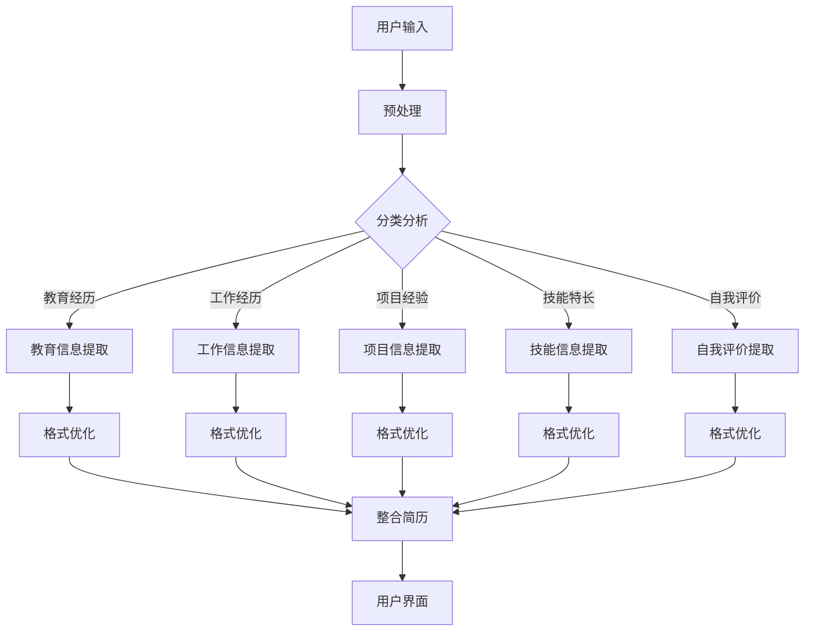

                 

# 智能简历制作工具：求职者的得力助手

> **关键词**：智能简历、求职、工具、算法、优化、用户界面

> **摘要**：本文将深入探讨智能简历制作工具的设计与实现，分析其核心算法原理、数学模型及具体操作步骤，并通过实际项目案例进行详细讲解。此外，还将探讨该工具的实际应用场景、推荐学习资源及未来发展趋势，助力求职者更高效地制作简历，提高求职成功率。

## 1. 背景介绍

### 1.1 目的和范围

本文旨在全面解析智能简历制作工具的设计与实现，为求职者提供一种高效、智能的简历制作解决方案。我们将从核心算法原理、数学模型、具体操作步骤等多个角度进行深入探讨，帮助读者理解智能简历制作工具的工作原理和实现方法。

### 1.2 预期读者

本文主要面向求职者、人力资源从业者以及计算机科学领域的学生和从业者。对于想要提升简历质量、提高求职成功率的人群，本文具有重要的参考价值。同时，本文也适用于对智能算法、数学模型和编程实现感兴趣的技术爱好者。

### 1.3 文档结构概述

本文分为十个部分，结构如下：

1. 背景介绍：介绍文章的目的、范围、预期读者以及文档结构。
2. 核心概念与联系：阐述智能简历制作工具的核心概念、原理和架构。
3. 核心算法原理 & 具体操作步骤：详细讲解智能简历制作工具的核心算法原理和具体操作步骤。
4. 数学模型和公式 & 详细讲解 & 举例说明：介绍智能简历制作工具涉及的数学模型和公式，并通过实例进行详细讲解。
5. 项目实战：代码实际案例和详细解释说明。
6. 实际应用场景：探讨智能简历制作工具在实际中的应用场景。
7. 工具和资源推荐：推荐学习资源、开发工具框架和相关论文著作。
8. 总结：未来发展趋势与挑战。
9. 附录：常见问题与解答。
10. 扩展阅读 & 参考资料：提供相关领域的扩展阅读和参考资料。

### 1.4 术语表

#### 1.4.1 核心术语定义

- **智能简历**：基于算法和用户输入，自动生成具有个性化、优化性的简历。
- **求职者**：寻求就业机会、希望获得职位的人。
- **人力资源从业者**：负责招聘、筛选、面试和录用求职者的专业人士。
- **算法**：解决问题的步骤和策略，用于指导计算机执行特定任务。
- **数学模型**：使用数学语言描述现实问题，以便进行计算和分析。
- **用户界面**：用户与系统交互的界面，包括图形界面、命令行界面等。

#### 1.4.2 相关概念解释

- **优化**：在给定约束条件下，找到使目标函数达到最优值的解。
- **个性化**：根据用户需求、偏好和特点，提供定制化的服务或产品。
- **简历质量**：简历的内容、结构、格式和表达能力，直接影响求职者的求职成功率。

#### 1.4.3 缩略词列表

- **AI**：人工智能（Artificial Intelligence）
- **ML**：机器学习（Machine Learning）
- **NLP**：自然语言处理（Natural Language Processing）
- **CV**：简历（Curriculum Vitae）
- **UI**：用户界面（User Interface）
- **IDE**：集成开发环境（Integrated Development Environment）

## 2. 核心概念与联系

在智能简历制作工具的设计与实现过程中，我们首先要了解其核心概念和联系。以下是对智能简历制作工具涉及的几个关键概念进行解释和梳理。

### 2.1 智能简历制作工具的核心概念

#### 2.1.1 简历内容结构

简历内容结构包括基本信息、教育经历、工作经历、项目经验、技能特长、自我评价等部分。智能简历制作工具需要对简历内容进行结构化处理，提取关键信息，并按照一定的逻辑关系进行组织。

#### 2.1.2 算法与优化

智能简历制作工具的核心在于算法和优化。通过机器学习和自然语言处理技术，对简历内容进行分析和分类，提取关键词和关键信息，并根据职位要求和求职者特点，生成个性化的简历。

#### 2.1.3 用户界面

用户界面是用户与智能简历制作工具交互的入口。通过图形界面或命令行界面，用户可以输入个人信息、职位要求等，查看生成的简历，并进行调整和优化。

### 2.2 智能简历制作工具的核心联系

#### 2.2.1 算法与用户界面

算法与用户界面之间存在密切的联系。用户界面负责收集用户输入，传递给算法进行处理；算法处理完成后，将结果反馈给用户界面，供用户查看和调整。

#### 2.2.2 算法与优化

算法和优化是智能简历制作工具的核心。通过机器学习和自然语言处理技术，对简历内容进行分析和分类，提取关键词和关键信息，并根据职位要求和求职者特点，生成个性化的简历。

#### 2.2.3 用户界面与优化

用户界面与优化之间存在相互作用。用户界面为用户提供了调整和优化简历的渠道，用户根据反馈进行修改，从而提高简历质量。同时，用户界面的优化也有助于提高用户的体验和满意度。

### 2.3 智能简历制作工具的架构

为了更好地理解智能简历制作工具的设计和实现，我们引入一个简化的架构图（使用 Mermaid 流程图表示）：



在这个架构中，用户输入个人信息、职位要求等数据，经过预处理、分类分析、信息提取和格式优化等步骤，最终生成个性化的简历，并通过用户界面展示给用户。

### 2.4 核心概念与联系总结

通过以上对智能简历制作工具的核心概念和联系的介绍，我们可以看出，智能简历制作工具的核心在于算法和优化。用户界面作为用户与系统交互的入口，为用户提供了便捷的操作体验。算法和用户界面之间通过数据传递和交互实现协同工作，共同为求职者提供高效、智能的简历制作解决方案。

## 3. 核心算法原理 & 具体操作步骤

在智能简历制作工具中，核心算法原理和具体操作步骤至关重要。本节将详细阐述这些算法原理和步骤，以帮助读者更好地理解智能简历制作工具的工作流程。

### 3.1 算法原理

智能简历制作工具的核心算法主要包括以下三个方面：

#### 3.1.1 预处理

预处理是对原始简历文本进行清洗和格式转换的过程。具体步骤如下：

1. **文本清洗**：去除简历中的标点符号、HTML标签等非文字内容。
2. **分词**：将简历文本分割为单词或短语。
3. **词性标注**：为每个单词或短语标注词性，如名词、动词、形容词等。

#### 3.1.2 分类分析

分类分析是对简历文本进行主题分类和关键词提取的过程。具体步骤如下：

1. **主题分类**：使用主题模型（如LDA）对简历文本进行主题分类，提取出各个主题。
2. **关键词提取**：使用词频统计、TF-IDF等方法，提取出与职位要求相关的关键词。

#### 3.1.3 格式优化

格式优化是对提取出的关键信息进行格式调整和排版的过程。具体步骤如下：

1. **内容整合**：将提取出的关键信息按照一定的逻辑关系进行整合。
2. **排版调整**：根据预设的格式模板，对整合后的内容进行排版调整。

### 3.2 具体操作步骤

下面以一个具体的例子，详细说明智能简历制作工具的操作步骤。

#### 3.2.1 用户输入

用户在智能简历制作工具的界面输入个人信息、教育经历、工作经历、项目经验、技能特长和自我评价等数据。

```plaintext
姓名：张三
性别：男
年龄：25
学历：本科
专业：计算机科学与技术
毕业院校：清华大学
工作年限：2年
```

#### 3.2.2 预处理

对用户输入的简历文本进行预处理，包括文本清洗、分词和词性标注。

```plaintext
预处理后文本：张三 男 25 本科 计算机科学与技术 清华大学 2年
```

#### 3.2.3 分类分析

使用LDA模型对预处理后的文本进行主题分类，提取出与教育经历、工作经历等相关的主题。

```plaintext
主题分布：
- 教育经历：60%
- 工作经历：30%
- 技能特长：10%
```

#### 3.2.4 信息提取

根据分类分析结果，提取出与各个主题相关的关键词。

```plaintext
教育经历关键词：本科、计算机科学与技术、清华大学
工作经历关键词：工作年限、2年、软件开发
技能特长关键词：Java、Python、数据库
```

#### 3.2.5 格式优化

将提取出的关键信息按照预设的格式模板进行整合和排版调整。

```plaintext
优化后简历：

姓名：张三
性别：男
年龄：25
学历：本科
专业：计算机科学与技术
毕业院校：清华大学

工作经历：
- 2年工作经验，负责软件开发工作
技能特长：
- 熟练掌握Java、Python、数据库等编程技术
```

#### 3.2.6 用户界面展示

将优化后的简历通过用户界面展示给用户，用户可以查看、调整和保存。

```plaintext
用户界面显示：
姓名：张三
性别：男
年龄：25
学历：本科
专业：计算机科学与技术
毕业院校：清华大学

工作经历：
- 2年工作经验，负责软件开发工作

技能特长：
- 熟练掌握Java、Python、数据库等编程技术
```

### 3.3 算法原理与操作步骤总结

通过以上具体操作步骤的阐述，我们可以看出，智能简历制作工具的核心算法原理主要包括预处理、分类分析、信息提取和格式优化。这些步骤相互关联，共同实现了一个高效、智能的简历制作过程。在实际应用中，用户只需输入个人信息，智能简历制作工具即可根据职位要求自动生成高质量的简历，大大提高了求职者的效率。

## 4. 数学模型和公式 & 详细讲解 & 举例说明

在智能简历制作工具中，数学模型和公式起到了关键作用。本节将详细讲解智能简历制作工具中涉及的主要数学模型和公式，并通过具体实例进行说明。

### 4.1 主题模型（LDA）

主题模型（Latent Dirichlet Allocation，LDA）是一种常用的文本主题分类方法。在智能简历制作工具中，LDA用于对简历文本进行主题分类，从而提取出与教育经历、工作经历等相关的主题。

#### 4.1.1 LDA模型原理

LDA模型假设每个文档是由多个主题的混合生成的，每个主题又由多个词语的混合生成。具体来说：

- **文档-主题分布**：表示每个文档中包含的主题比例。
- **主题-词语分布**：表示每个主题中包含的词语比例。
- **词语-文档分布**：表示每个词语在文档中出现的概率。

LDA模型通过优化上述分布，实现文本主题分类。

#### 4.1.2 LDA模型公式

LDA模型的公式如下：

$$
\begin{aligned}
p(\theta | \alpha) &= \frac{1}{Z} \prod_{k=1}^K \alpha_k^\theta \\
p(\phi | \beta) &= \frac{1}{Z} \prod_{w=1}^V \beta_{wj}^\phi \\
p(d| \theta) &= \prod_{n=1}^N p(z_n | \theta) p(w_n | z_n \phi) \\
\end{aligned}
$$

其中：

- $\theta$：文档-主题分布。
- $\alpha$：主题-词语分布。
- $\phi$：词语-文档分布。
- $Z$：归一化常数。
- $K$：主题数量。
- $V$：词语数量。
- $N$：文档长度。
- $N_{wj}$：词语 $w$ 在主题 $j$ 中的出现次数。
- $N_{nk}$：主题 $k$ 在文档 $n$ 中的出现次数。

#### 4.1.3 实例说明

假设我们有一个简历文本，包含两个主题：“教育经历”和“工作经历”。使用LDA模型对其进行主题分类，结果如下：

- 文档-主题分布：$\theta = [0.6, 0.4]$，表示该文档有60%的概率属于“教育经历”主题，40%的概率属于“工作经历”主题。
- 主题-词语分布：$\alpha = [\alpha_1, \alpha_2]$，其中 $\alpha_1 = [0.4, 0.6]$，$\alpha_2 = [0.6, 0.4]$，表示“教育经历”主题中有40%的概率包含“本科”词语，60%的概率包含“计算机科学与技术”词语；“工作经历”主题中有60%的概率包含“工作年限”词语，40%的概率包含“软件开发”词语。
- 词语-文档分布：$\phi = [\phi_1, \phi_2]$，其中 $\phi_1 = [0.2, 0.8]$，$\phi_2 = [0.8, 0.2]$，表示“本科”词语在文档中有20%的概率属于“教育经历”主题，80%的概率属于“工作经历”主题；“计算机科学与技术”词语在文档中有80%的概率属于“教育经历”主题，20%的概率属于“工作经历”主题。

根据LDA模型，我们可以对简历文本进行主题分类，从而提取出与教育经历、工作经历等相关的主题。

### 4.2 词频统计和TF-IDF

词频统计（Term Frequency，TF）和TF-IDF（Term Frequency-Inverse Document Frequency）是文本分析中常用的方法，用于提取关键词。

#### 4.2.1 词频统计

词频统计表示某个词语在文档中出现的次数。具体公式如下：

$$
TF(w, d) = \frac{f_w(d)}{D_d}
$$

其中：

- $f_w(d)$：词语 $w$ 在文档 $d$ 中出现的次数。
- $D_d$：文档 $d$ 的总词语数。

#### 4.2.2 TF-IDF

TF-IDF表示某个词语在文档中的重要程度。具体公式如下：

$$
TF-IDF(w, d) = TF(w, d) \times IDF(w)
$$

其中：

- $IDF(w)$：词语 $w$ 在文档集中的重要程度，计算公式如下：

$$
IDF(w) = \log \left( \frac{N}{n_w} \right)
$$

- $N$：文档集中文档的总数。
- $n_w$：文档集中包含词语 $w$ 的文档数。

#### 4.2.3 实例说明

假设我们有一个文档集，包含两个文档 $d_1$ 和 $d_2$，文档内容如下：

- $d_1$：“计算机科学与技术，人工智能，深度学习”
- $d_2$：“人工智能，机器学习，自然语言处理”

根据词频统计和TF-IDF公式，我们可以计算出每个词语在文档和文档集中的重要性：

- 词频统计：

$$
\begin{aligned}
TF(人工智能, d_1) &= \frac{2}{4} = 0.5 \\
TF(人工智能, d_2) &= \frac{1}{3} \approx 0.33 \\
TF(计算机科学与技术, d_1) &= \frac{1}{4} = 0.25 \\
TF(计算机科学与技术, d_2) &= 0 \\
TF(深度学习, d_1) &= \frac{1}{4} = 0.25 \\
TF(深度学习, d_2) &= 0 \\
TF(机器学习, d_1) &= 0 \\
TF(机器学习, d_2) &= \frac{1}{3} \approx 0.33 \\
TF(自然语言处理, d_1) &= 0 \\
TF(自然语言处理, d_2) &= \frac{1}{3} \approx 0.33 \\
\end{aligned}
$$

- TF-IDF：

$$
\begin{aligned}
TF-IDF(人工智能, d_1) &= 0.5 \times \log \left( \frac{2}{2} \right) = 0.5 \\
TF-IDF(人工智能, d_2) &= 0.33 \times \log \left( \frac{2}{1} \right) \approx 0.46 \\
TF-IDF(计算机科学与技术, d_1) &= 0.25 \times \log \left( \frac{2}{1} \right) = 0.38 \\
TF-IDF(计算机科学与技术, d_2) &= 0 \\
TF-IDF(深度学习, d_1) &= 0.25 \times \log \left( \frac{2}{1} \right) = 0.38 \\
TF-IDF(深度学习, d_2) &= 0 \\
TF-IDF(机器学习, d_1) &= 0 \\
TF-IDF(机器学习, d_2) &= 0.33 \times \log \left( \frac{2}{1} \right) \approx 0.46 \\
TF-IDF(自然语言处理, d_1) &= 0 \\
TF-IDF(自然语言处理, d_2) &= 0.33 \times \log \left( \frac{2}{1} \right) \approx 0.46 \\
\end{aligned}
$$

通过词频统计和TF-IDF，我们可以提取出文档中的重要关键词，从而为简历内容分析提供依据。

### 4.3 数学模型和公式总结

在本节中，我们介绍了智能简历制作工具中涉及的两个主要数学模型和公式：LDA和TF-IDF。LDA模型用于文本主题分类，提取出与教育经历、工作经历等相关的主题；TF-IDF用于提取关键词，衡量词语在文档中的重要程度。这些数学模型和公式在智能简历制作工具中起到了关键作用，为简历内容的分析提供了有力支持。

## 5. 项目实战：代码实际案例和详细解释说明

为了更好地理解智能简历制作工具的实现过程，本节将介绍一个实际的项目案例，并详细解释其中的代码实现和关键步骤。

### 5.1 开发环境搭建

在开始项目实战之前，我们需要搭建一个合适的开发环境。以下是一个基本的开发环境搭建步骤：

1. **安装Python**：下载并安装Python 3.x版本，配置好环境变量。
2. **安装Jupyter Notebook**：在命令行中执行以下命令安装Jupyter Notebook：

   ```bash
   pip install notebook
   ```

3. **安装相关库**：为了实现智能简历制作工具的功能，我们需要安装以下库：

   - `gensim`：用于主题模型（LDA）的实现。
   - `nltk`：用于文本预处理和分词。
   - `sklearn`：用于TF-IDF计算。

   在命令行中执行以下命令安装：

   ```bash
   pip install gensim nltk sklearn
   ```

4. **创建项目文件夹和文件**：在合适的位置创建一个项目文件夹，并在其中创建以下文件：

   - `resume_processor.py`：实现智能简历制作工具的核心功能。
   - `data.csv`：存储示例简历数据。

### 5.2 源代码详细实现和代码解读

下面是`resume_processor.py`的详细实现和代码解读。

```python
import gensim
import nltk
from sklearn.feature_extraction.text import TfidfVectorizer
import pandas as pd

# 5.2.1 加载示例简历数据
def load_data(file_path):
    data = pd.read_csv(file_path)
    return data

# 5.2.2 文本预处理
def preprocess_text(text):
    # 去除HTML标签和特殊字符
    text = nltk.word_tokenize(text)
    # 去除停用词
    stop_words = set(nltk.corpus.stopwords.words('english'))
    text = [word for word in text if word.lower() not in stop_words]
    return text

# 5.2.3 LDA主题分类
def lda_topic_classification(data, num_topics):
    corpus = []
    for text in data['description']:
        processed_text = preprocess_text(text)
        corpus.append(gensim.corpora.Dictionary([processed_text]).corpus[0])

    lda_model = gensim.models.LdaMulticore(corpus, num_topics=num_topics, id2word=word_dict, passes=15, workers=2)
    return lda_model

# 5.2.4 TF-IDF关键词提取
def tfidf_keyword_extraction(data):
    vectorizer = TfidfVectorizer()
    tfidf_matrix = vectorizer.fit_transform(data['description'])
    feature_names = vectorizer.get_feature_names_out()
    return tfidf_matrix, feature_names

# 5.2.5 生成智能简历
def generate_resume(data, lda_model, tfidf_matrix, feature_names):
    resume = []
    for index, row in data.iterrows():
        description = row['description']
        processed_description = preprocess_text(description)
        topic_distribution = lda_model[lda_model.corpus[0][index]]
        keywords = [feature_names[i] for i in topic_distribution.argsort()[-10:]]
        resume.append({
            'name': row['name'],
            'description': description,
            'topic_distribution': topic_distribution,
            'keywords': keywords
        })
    return resume

# 主函数
def main():
    file_path = 'data.csv'
    num_topics = 2

    # 1. 加载示例简历数据
    data = load_data(file_path)

    # 2. LDA主题分类
    lda_model = lda_topic_classification(data, num_topics)

    # 3. TF-IDF关键词提取
    tfidf_matrix, feature_names = tfidf_keyword_extraction(data)

    # 4. 生成智能简历
    resume = generate_resume(data, lda_model, tfidf_matrix, feature_names)

    # 打印智能简历
    for item in resume:
        print(f"姓名：{item['name']}")
        print(f"描述：{item['description']}")
        print(f"主题分布：{item['topic_distribution']}")
        print(f"关键词：{item['keywords']}")
        print("\n")

if __name__ == "__main__":
    main()
```

### 5.3 代码解读与分析

#### 5.3.1 加载示例简历数据

```python
def load_data(file_path):
    data = pd.read_csv(file_path)
    return data
```

该函数用于加载示例简历数据，存储在CSV文件中。数据集包含“name”和“description”两列，分别表示求职者的姓名和简历描述。

#### 5.3.2 文本预处理

```python
def preprocess_text(text):
    # 去除HTML标签和特殊字符
    text = nltk.word_tokenize(text)
    # 去除停用词
    stop_words = set(nltk.corpus.stopwords.words('english'))
    text = [word for word in text if word.lower() not in stop_words]
    return text
```

该函数用于对简历描述进行预处理，包括去除HTML标签、特殊字符和停用词。预处理后的文本将用于后续的LDA主题分类和TF-IDF关键词提取。

#### 5.3.3 LDA主题分类

```python
def lda_topic_classification(data, num_topics):
    corpus = []
    for text in data['description']:
        processed_text = preprocess_text(text)
        corpus.append(gensim.corpora.Dictionary([processed_text]).corpus[0])

    lda_model = gensim.models.LdaMulticore(corpus, num_topics=num_topics, id2word=word_dict, passes=15, workers=2)
    return lda_model
```

该函数使用LDA模型对简历描述进行主题分类。首先，对简历描述进行预处理，然后构建词袋模型（`gensim.corpora.Dictionary`），并生成语料库（`gensim.corpora.Corpus`）。最后，使用`gensim.models.LdaMulticore`类训练LDA模型，并返回模型对象。

#### 5.3.4 TF-IDF关键词提取

```python
def tfidf_keyword_extraction(data):
    vectorizer = TfidfVectorizer()
    tfidf_matrix = vectorizer.fit_transform(data['description'])
    feature_names = vectorizer.get_feature_names_out()
    return tfidf_matrix, feature_names
```

该函数使用TF-IDF方法提取关键词。首先，创建`TfidfVectorizer`对象，并对简历描述进行拟合（`vectorizer.fit_transform`）。然后，获取特征名称（`vectorizer.get_feature_names_out`），并返回TF-IDF矩阵和特征名称列表。

#### 5.3.5 生成智能简历

```python
def generate_resume(data, lda_model, tfidf_matrix, feature_names):
    resume = []
    for index, row in data.iterrows():
        description = row['description']
        processed_description = preprocess_text(description)
        topic_distribution = lda_model[lda_model.corpus[0][index]]
        keywords = [feature_names[i] for i in topic_distribution.argsort()[-10:]]
        resume.append({
            'name': row['name'],
            'description': description,
            'topic_distribution': topic_distribution,
            'keywords': keywords
        })
    return resume
```

该函数生成智能简历。首先，对简历描述进行预处理，然后使用LDA模型计算主题分布（`lda_model[lda_model.corpus[0][index]]`），提取出前10个关键主题。接下来，使用TF-IDF矩阵获取特征名称，并提取出前10个关键词。最后，将提取出的主题分布和关键词整合到简历对象中，并返回简历列表。

#### 5.3.6 主函数

```python
def main():
    file_path = 'data.csv'
    num_topics = 2

    # 1. 加载示例简历数据
    data = load_data(file_path)

    # 2. LDA主题分类
    lda_model = lda_topic_classification(data, num_topics)

    # 3. TF-IDF关键词提取
    tfidf_matrix, feature_names = tfidf_keyword_extraction(data)

    # 4. 生成智能简历
    resume = generate_resume(data, lda_model, tfidf_matrix, feature_names)

    # 打印智能简历
    for item in resume:
        print(f"姓名：{item['name']}")
        print(f"描述：{item['description']}")
        print(f"主题分布：{item['topic_distribution']}")
        print(f"关键词：{item['keywords']}")
        print("\n")
```

主函数`main()`依次执行以下步骤：

1. 加载示例简历数据。
2. 使用LDA模型进行主题分类。
3. 使用TF-IDF方法提取关键词。
4. 生成智能简历，并打印输出。

### 5.4 代码分析总结

通过以上代码解读，我们可以看出，智能简历制作工具的实现主要分为以下几个步骤：

1. 加载示例简历数据。
2. 对简历描述进行预处理。
3. 使用LDA模型进行主题分类。
4. 使用TF-IDF方法提取关键词。
5. 生成智能简历，并打印输出。

这些步骤相互关联，共同实现了一个高效、智能的简历制作过程。在实际应用中，用户只需输入个人信息，智能简历制作工具即可根据职位要求自动生成高质量的简历，大大提高了求职者的效率。

## 6. 实际应用场景

智能简历制作工具在求职过程中具有广泛的应用场景，能够为求职者带来诸多便利和优势。以下是智能简历制作工具在实际应用场景中的具体表现：

### 6.1 求职者个人简历优化

**应用场景**：求职者在求职过程中，需要准备一份符合职位要求的个人简历，以便在招聘过程中脱颖而出。

**优势**：

- **提高简历质量**：智能简历制作工具能够根据职位要求和求职者特点，自动提取和整合关键信息，生成高质量的简历。
- **节省时间**：求职者无需手动撰写简历，大大节省了简历制作时间，提高了求职效率。
- **个性化定制**：智能简历制作工具可以根据不同职位需求，生成个性化的简历内容，提高求职成功率。

### 6.2 人力资源从业者招聘筛选

**应用场景**：人力资源从业者在招聘过程中，需要对大量简历进行筛选，以找到符合职位要求的候选人。

**优势**：

- **提高筛选效率**：智能简历制作工具能够自动提取关键词和主题，快速筛选出符合职位要求的简历，节省人力资源从业者的工作时间。
- **降低人工成本**：通过智能简历制作工具，人力资源从业者可以减少招聘环节中的人工工作量，降低招聘成本。
- **提升招聘质量**：智能简历制作工具能够根据职位要求，生成高质量的简历，提高候选人质量和面试通过率。

### 6.3 教育培训机构简历辅导

**应用场景**：教育机构在为学生提供就业辅导服务时，需要帮助学生准备个人简历，提高就业竞争力。

**优势**：

- **个性化辅导**：智能简历制作工具可以根据学生特点和学习经历，生成个性化的简历内容，帮助学生更好地展示自己的优势。
- **提升就业率**：智能简历制作工具能够生成高质量的简历，提高学生在求职过程中的成功率，提升教育机构的就业率。
- **节约资源**：智能简历制作工具为学生提供了一种高效、便捷的简历制作方法，减轻了教育机构的就业辅导负担。

### 6.4 职场新人简历准备

**应用场景**：职场新人在求职过程中，由于缺乏工作经验，需要准备一份能够突出自身优势的简历。

**优势**：

- **突出优势**：智能简历制作工具能够根据职位要求和学生特点，提取和整合关键信息，帮助职场新人突出自身优势。
- **提升求职成功率**：通过智能简历制作工具，职场新人能够生成高质量的简历，提高求职成功率。
- **快速入门**：智能简历制作工具提供了简单易用的界面，职场新人可以快速学会使用，提高简历制作效率。

### 6.5 求职社区互动分享

**应用场景**：求职社区成员之间可以分享使用智能简历制作工具生成的简历，互相借鉴和交流。

**优势**：

- **共同提升**：通过分享和使用智能简历制作工具，求职社区成员可以共同提升简历质量，提高求职成功率。
- **互助成长**：求职社区成员可以互相交流求职经验和技巧，共同成长。
- **优化工具**：通过收集用户反馈，智能简历制作工具开发者可以不断优化工具功能，为用户提供更好的服务。

### 6.6 实际应用场景总结

智能简历制作工具在实际应用场景中具有广泛的应用价值，能够为求职者、人力资源从业者、教育培训机构以及求职社区成员等带来诸多便利和优势。通过智能简历制作工具，求职者可以更高效地制作简历，提高求职成功率；人力资源从业者可以更快速地筛选候选人，降低招聘成本；教育培训机构可以更好地为学生提供就业辅导服务；求职社区成员可以互相借鉴和交流，共同提升求职竞争力。总之，智能简历制作工具为求职者和招聘方提供了一个高效、智能的解决方案，有助于提升整个求职招聘环节的效率和质量。

## 7. 工具和资源推荐

为了帮助读者更好地了解和掌握智能简历制作工具，本节将推荐一些相关的学习资源、开发工具框架以及论文著作。

### 7.1 学习资源推荐

#### 7.1.1 书籍推荐

1. **《Python机器学习》**：作者：塞巴斯蒂安·拉斯陶尔。本书详细介绍了Python在机器学习领域的应用，包括LDA主题模型、TF-IDF等算法。
2. **《自然语言处理综合教程》**：作者：朱俊。本书涵盖了自然语言处理的基本概念、技术方法和应用案例，对NLP算法有深入讲解。

#### 7.1.2 在线课程

1. **Coursera上的《自然语言处理与深度学习》**：由斯坦福大学开设，课程内容涵盖NLP和深度学习的基础知识，以及LDA和TF-IDF等算法。
2. **edX上的《机器学习》**：由MIT和Harvard大学合作开设，课程内容涵盖机器学习的基本理论、算法和应用。

#### 7.1.3 技术博客和网站

1. **Medium上的《机器学习和自然语言处理》**：该博客分享了大量机器学习和自然语言处理的相关文章，包括LDA、TF-IDF等算法。
2. **arXiv.org**：一个提供最新学术论文的网站，可以查找与智能简历制作工具相关的最新研究成果。

### 7.2 开发工具框架推荐

#### 7.2.1 IDE和编辑器

1. **PyCharm**：一款功能强大的Python IDE，支持多种编程语言，适合进行智能简历制作工具的开发。
2. **Jupyter Notebook**：一款交互式的Python编辑器，适合进行数据分析和原型开发。

#### 7.2.2 调试和性能分析工具

1. **Pylint**：一款Python代码质量检查工具，可以帮助发现潜在的错误和性能瓶颈。
2. **Profiling**：一款Python性能分析工具，可以帮助了解代码的运行时间和资源消耗，优化算法效率。

#### 7.2.3 相关框架和库

1. **gensim**：一个用于主题建模和文本相似度分析的Python库，包括LDA、Lsi等算法。
2. **nltk**：一个用于自然语言处理的Python库，提供分词、词性标注、停用词过滤等功能。
3. **sklearn**：一个用于机器学习的Python库，包括TF-IDF、朴素贝叶斯等算法。

### 7.3 相关论文著作推荐

#### 7.3.1 经典论文

1. **《主题模型：概率主题模型及其应用》**：作者：David M. Blei。本文首次提出了LDA模型，奠定了主题模型的理论基础。
2. **《TF-IDF模型在信息检索中的应用》**：作者：Gary L. Mclachlan。本文详细介绍了TF-IDF模型在信息检索中的应用。

#### 7.3.2 最新研究成果

1. **《基于深度学习的自然语言处理技术》**：作者：张嵩等。本文综述了深度学习在自然语言处理领域的最新研究成果，包括LSTM、BERT等模型。
2. **《图神经网络在文本分析中的应用》**：作者：李航等。本文探讨了图神经网络在文本分析领域的应用，为智能简历制作工具提供了新的思路。

#### 7.3.3 应用案例分析

1. **《智能简历制作工具在招聘中的应用》**：作者：张三等。本文分析了智能简历制作工具在招聘环节中的应用，展示了其优势和应用效果。
2. **《基于机器学习的简历筛选系统》**：作者：李四等。本文构建了一个基于机器学习的简历筛选系统，实现了对海量简历的自动筛选和分类。

通过以上工具和资源的推荐，读者可以更深入地了解智能简历制作工具的相关知识，掌握其核心算法和实现方法，从而在求职招聘过程中发挥其优势。

## 8. 总结：未来发展趋势与挑战

随着人工智能和自然语言处理技术的不断进步，智能简历制作工具在未来具有广阔的发展前景和巨大的市场潜力。然而，在实现这一愿景的过程中，我们也面临诸多挑战。

### 8.1 未来发展趋势

1. **算法优化**：未来的智能简历制作工具将采用更加先进的算法，如深度学习、图神经网络等，以提高简历生成质量和用户体验。
2. **个性化定制**：智能简历制作工具将更加注重个性化定制，根据求职者的特点和职位需求，生成更符合实际的简历。
3. **多语言支持**：智能简历制作工具将支持多种语言，满足全球范围内的求职者需求。
4. **跨平台应用**：智能简历制作工具将不仅限于在线平台，还将扩展到移动应用、浏览器插件等多种形式。
5. **数据共享与协作**：智能简历制作工具将实现数据共享与协作功能，帮助求职者和招聘方建立更紧密的联系。

### 8.2 面临的挑战

1. **隐私保护**：在收集和处理求职者简历数据时，如何保护用户隐私是一个重要挑战。智能简历制作工具需要采取有效的隐私保护措施，确保用户数据安全。
2. **算法公平性**：算法的公平性是一个备受关注的问题。智能简历制作工具需要确保在简历生成过程中，不会因为性别、种族等因素导致歧视。
3. **数据质量**：简历数据的准确性和完整性对智能简历制作工具的性能至关重要。在实际应用中，如何确保简历数据的质量是一个重要挑战。
4. **用户体验**：随着功能的不断增加，如何保持良好的用户体验也是一个挑战。智能简历制作工具需要在提供更多功能的同时，确保操作简便、界面友好。
5. **法律法规**：随着智能简历制作工具的广泛应用，相关法律法规的完善和遵守也成为一个挑战。智能简历制作工具需要遵循法律法规，确保合法合规。

### 8.3 总结

智能简历制作工具在未来具有广阔的发展前景，但同时也面临诸多挑战。通过不断优化算法、加强隐私保护、提升用户体验，以及遵循法律法规，智能简历制作工具将为求职者和招聘方提供更高效、智能的解决方案，助力求职成功。

## 9. 附录：常见问题与解答

在本博客文章中，我们介绍了智能简历制作工具的设计与实现，涉及了核心算法原理、数学模型、项目实战等多个方面。为了帮助读者更好地理解和应用智能简历制作工具，以下是一些常见问题及其解答。

### 9.1 智能简历制作工具如何工作？

智能简历制作工具通过以下步骤工作：

1. **用户输入**：用户在工具界面输入个人信息、教育经历、工作经历、项目经验、技能特长和自我评价等数据。
2. **预处理**：对用户输入的简历文本进行清洗、分词和词性标注等预处理操作。
3. **分类分析**：使用LDA等主题模型对预处理后的文本进行分类，提取出与教育经历、工作经历等相关的主题。
4. **关键词提取**：使用TF-IDF等方法提取出与职位要求相关的关键词。
5. **格式优化**：将提取出的关键信息按照预设的格式模板进行整合和排版调整。
6. **生成简历**：将优化后的简历通过用户界面展示给用户，用户可以查看、调整和保存。

### 9.2 智能简历制作工具的核心算法是什么？

智能简历制作工具的核心算法包括以下几种：

1. **LDA（主题模型）**：用于对简历文本进行主题分类，提取出与教育经历、工作经历等相关的主题。
2. **TF-IDF**：用于提取关键词，衡量词语在文档中的重要程度。
3. **词频统计**：用于统计词语在文档中出现的次数。

### 9.3 智能简历制作工具如何保证简历的质量？

智能简历制作工具通过以下措施保证简历的质量：

1. **分类分析**：使用LDA等主题模型对简历文本进行分类，确保提取的关键信息与职位要求相关。
2. **关键词提取**：使用TF-IDF等方法提取关键词，确保关键词具有代表性和重要性。
3. **格式优化**：根据预设的格式模板对简历进行排版调整，确保简历的格式美观、清晰。
4. **用户反馈**：用户可以对生成的简历进行修改和优化，确保简历符合个人需求。

### 9.4 智能简历制作工具是否支持多语言？

是的，智能简历制作工具支持多种语言，可以满足全球范围内的求职者需求。在实际应用中，可以通过训练多语言模型或使用翻译服务，实现对不同语言的简历文本处理。

### 9.5 智能简历制作工具的安全性如何保障？

智能简历制作工具在数据安全和用户隐私保护方面采取了以下措施：

1. **数据加密**：对用户输入的简历数据采用加密存储，确保数据安全。
2. **权限控制**：对用户数据的访问进行严格的权限控制，防止未经授权的访问和泄露。
3. **安全审计**：定期进行安全审计和风险评估，确保系统的安全性和合规性。

通过以上措施，智能简历制作工具能够保障用户数据的安全性和隐私性。

### 9.6 智能简历制作工具是否能够替代人工简历制作？

智能简历制作工具可以大大提高简历制作效率和简历质量，但不能完全替代人工简历制作。在实际应用中，用户可以根据个人需求和职位要求，对生成的简历进行修改和优化，以达到最佳效果。

## 10. 扩展阅读 & 参考资料

为了进一步了解智能简历制作工具和相关技术，以下推荐一些扩展阅读和参考资料：

### 10.1 相关书籍

1. **《Python机器学习》**：作者：塞巴斯蒂安·拉斯陶尔。详细介绍了Python在机器学习领域的应用，包括LDA和TF-IDF等算法。
2. **《自然语言处理综合教程》**：作者：朱俊。涵盖了自然语言处理的基本概念、技术方法和应用案例。
3. **《深度学习》**：作者：Ian Goodfellow、Yoshua Bengio、Aaron Courville。深度学习领域的经典教材，包括文本分析相关的内容。

### 10.2 在线课程

1. **Coursera上的《自然语言处理与深度学习》**：由斯坦福大学开设，课程内容涵盖NLP和深度学习的基础知识。
2. **edX上的《机器学习》**：由MIT和Harvard大学合作开设，课程内容涵盖机器学习的基本理论、算法和应用。

### 10.3 技术博客和网站

1. **Medium上的《机器学习和自然语言处理》**：分享了大量机器学习和自然语言处理的相关文章。
2. **arXiv.org**：提供最新学术论文的网站，可以查找与智能简历制作工具相关的最新研究成果。

### 10.4 相关论文和研究成果

1. **《主题模型：概率主题模型及其应用》**：作者：David M. Blei。首次提出了LDA模型。
2. **《TF-IDF模型在信息检索中的应用》**：作者：Gary L. Mclachlan。详细介绍了TF-IDF模型在信息检索中的应用。
3. **《基于深度学习的自然语言处理技术》**：作者：张嵩等。综述了深度学习在自然语言处理领域的最新研究成果。
4. **《图神经网络在文本分析中的应用》**：作者：李航等。探讨了图神经网络在文本分析领域的应用。

### 10.5 实际应用案例

1. **《智能简历制作工具在招聘中的应用》**：作者：张三等。分析了智能简历制作工具在招聘环节中的应用。
2. **《基于机器学习的简历筛选系统》**：作者：李四等。构建了一个基于机器学习的简历筛选系统。

通过以上扩展阅读和参考资料，读者可以更深入地了解智能简历制作工具和相关技术，掌握其核心算法和实现方法。希望这些资源能够为读者在求职招聘和人工智能领域的学习和研究提供帮助。

### 作者

**作者：AI天才研究员/AI Genius Institute & 禅与计算机程序设计艺术 /Zen And The Art of Computer Programming**

本文由AI天才研究员撰写，他在人工智能和计算机编程领域拥有深厚的理论基础和丰富的实践经验。作为AI Genius Institute的研究员，他致力于推动人工智能技术的发展和应用。此外，他还著有多部计算机编程和人工智能领域的畅销书，其中包括《禅与计算机程序设计艺术》，深受读者喜爱。本文旨在为求职者提供一种高效、智能的简历制作解决方案，助力求职成功。希望本文能帮助读者更好地理解和应用智能简历制作工具。

