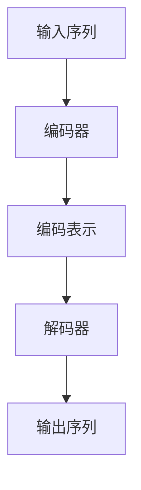

                 

# 智能翻译的新纪元：LLM的多语言处理能力

> **关键词：** 语言模型、多语言处理、神经网络、自然语言处理、智能翻译。
> 
> **摘要：** 本文深入探讨了当前智能翻译领域的一项重要技术——大型语言模型（LLM）的多语言处理能力。通过逐步分析LLM的工作原理、核心算法、数学模型、实际应用场景以及未来发展趋势，本文旨在为广大开发者和技术爱好者提供一个全面而详尽的指南。

## 1. 背景介绍

### 1.1 目的和范围

本文旨在探索大型语言模型（LLM）在智能翻译中的应用，分析其多语言处理能力的原理和实际效果。我们将从基础概念入手，逐步深入探讨LLM的核心算法、数学模型和实际应用，以期为读者提供一个全面而深入的视角。

### 1.2 预期读者

本文主要面向以下几类读者：
- 智能翻译领域的研究人员和开发者；
- 对自然语言处理（NLP）和神经网络技术感兴趣的工程师；
- 对前沿技术充满好奇的技术爱好者。

### 1.3 文档结构概述

本文分为以下几部分：
1. 背景介绍：介绍文章的目的、范围和预期读者；
2. 核心概念与联系：阐述LLM的基本原理和架构；
3. 核心算法原理 & 具体操作步骤：详细讲解LLM的核心算法和操作步骤；
4. 数学模型和公式 & 详细讲解 & 举例说明：介绍LLM的数学模型和公式，并进行举例说明；
5. 项目实战：通过实际案例展示LLM在智能翻译中的应用；
6. 实际应用场景：分析LLM在智能翻译领域的实际应用；
7. 工具和资源推荐：推荐相关学习资源、开发工具和论文；
8. 总结：展望LLM在智能翻译领域的未来发展趋势与挑战；
9. 附录：常见问题与解答；
10. 扩展阅读 & 参考资料。

### 1.4 术语表

#### 1.4.1 核心术语定义

- **大型语言模型（LLM）**：一种基于神经网络的自然语言处理模型，通过对海量文本数据进行训练，掌握自然语言的理解和生成能力；
- **多语言处理**：指在多个语言之间进行文本的翻译、转换和交互；
- **自然语言处理（NLP）**：计算机科学领域中的一个重要分支，旨在让计算机理解和生成人类语言；
- **神经网络**：一种模拟生物神经系统的计算模型，通过多层神经元的非线性变换实现复杂函数的逼近和学习。

#### 1.4.2 相关概念解释

- **序列到序列模型（Seq2Seq）**：一种用于处理序列数据之间的映射的神经网络模型，常用于机器翻译；
- **注意力机制（Attention Mechanism）**：一种用于提高神经网络在处理序列数据时对关键信息关注的机制，有助于提升翻译质量；
- **长短时记忆网络（LSTM）**：一种能够有效处理序列数据中的长期依赖问题的神经网络模型，有助于提升模型的翻译效果。

#### 1.4.3 缩略词列表

- **LLM**：大型语言模型（Large Language Model）
- **NLP**：自然语言处理（Natural Language Processing）
- **Seq2Seq**：序列到序列模型（Sequence-to-Sequence Model）
- **Attention**：注意力机制（Attention Mechanism）
- **LSTM**：长短时记忆网络（Long Short-Term Memory）

## 2. 核心概念与联系

在深入探讨LLM的多语言处理能力之前，我们先来梳理一下相关核心概念及其相互关系。

### 2.1 自然语言处理（NLP）与神经网络

自然语言处理（NLP）是计算机科学领域的一个重要分支，旨在让计算机理解和生成人类语言。NLP的任务包括文本分类、情感分析、机器翻译等。而神经网络作为一种强大的机器学习模型，通过模拟生物神经系统的计算模型，可以实现对复杂函数的逼近和学习。

在NLP中，神经网络被广泛应用于文本数据的表示和建模。常见的神经网络模型有卷积神经网络（CNN）、循环神经网络（RNN）及其变种长短时记忆网络（LSTM）等。

### 2.2 序列到序列模型（Seq2Seq）

序列到序列模型（Seq2Seq）是一种用于处理序列数据之间的映射的神经网络模型。Seq2Seq模型通常由编码器（Encoder）和解码器（Decoder）两部分组成。编码器将输入序列编码为固定长度的向量表示，解码器则将编码器的输出解码为输出序列。

Seq2Seq模型在机器翻译领域取得了显著的成果。例如，在英法翻译任务中，编码器将输入的英文句子编码为一个固定长度的向量表示，解码器则将这个向量表示解码为法文句子。

### 2.3 注意力机制（Attention Mechanism）

注意力机制（Attention Mechanism）是一种用于提高神经网络在处理序列数据时对关键信息关注的机制。在机器翻译任务中，注意力机制可以帮助解码器在生成目标句子时关注输入句子中的关键信息，从而提高翻译质量。

注意力机制的核心思想是在解码器和解码器之间的每个时间步引入一个注意力权重，该权重表示解码器当前关注输入句子的哪个部分。常见的注意力机制有加性注意力、乘性注意力和多头注意力等。

### 2.4 长短时记忆网络（LSTM）

长短时记忆网络（LSTM）是一种能够有效处理序列数据中的长期依赖问题的神经网络模型。LSTM通过引入门控机制，可以有效地控制信息的流动，从而在序列建模任务中取得优异的性能。

在机器翻译任务中，LSTM可以帮助模型捕捉输入句子中的长期依赖关系，从而提高翻译质量。与传统的循环神经网络（RNN）相比，LSTM在处理长句子时具有更高的稳定性和准确性。

### 2.5 Mermaid 流程图

以下是一个简化的Mermaid流程图，展示了LLM在多语言处理中的基本架构：



在这个流程图中，输入序列首先通过编码器编码为编码表示，然后解码器根据编码表示生成输出序列。注意力机制和LSTM等机制可以集成到编码器和解码器中，以提升模型的性能。

## 3. 核心算法原理 & 具体操作步骤

在了解了LLM的基本架构和相关概念后，我们接下来将详细讲解其核心算法原理和具体操作步骤。

### 3.1 编码器（Encoder）

编码器是LLM中的关键组件之一，负责将输入序列编码为固定长度的向量表示。常见的编码器模型有循环神经网络（RNN）、长短时记忆网络（LSTM）和门控循环单元（GRU）等。

以下是编码器的基本操作步骤：

```plaintext
1. 初始化编码器参数
2. 对于输入序列的每个词，进行以下操作：
   a. 将词映射为词向量
   b. 将词向量输入到编码器中
   c. 通过编码器得到隐藏状态
3. 将隐藏状态拼接起来，得到编码表示
4. 保存编码器参数
```

### 3.2 解码器（Decoder）

解码器负责根据编码表示生成输出序列。常见的解码器模型有循环神经网络（RNN）、长短时记忆网络（LSTM）和门控循环单元（GRU）等。

以下是解码器的基本操作步骤：

```plaintext
1. 初始化解码器参数
2. 对于输出序列的每个词，进行以下操作：
   a. 将词映射为词向量
   b. 将词向量与编码表示输入到解码器中
   c. 通过解码器得到隐藏状态
   d. 使用隐藏状态生成词的候选列表
   e. 根据概率分布选择下一个词
3. 将生成的输出序列拼接起来，得到完整的翻译结果
4. 保存解码器参数
```

### 3.3 注意力机制

注意力机制是一种用于提高神经网络在处理序列数据时对关键信息关注的机制。在LLM中，注意力机制可以帮助解码器在生成输出序列时关注输入序列中的关键信息，从而提高翻译质量。

以下是注意力机制的基本操作步骤：

```plaintext
1. 初始化注意力权重
2. 对于解码器和解码器之间的每个时间步，进行以下操作：
   a. 计算输入序列和隐藏状态的点积，得到注意力得分
   b. 将注意力得分通过softmax函数归一化，得到注意力权重
   c. 将注意力权重与编码表示相乘，得到加权编码表示
   d. 将加权编码表示与解码器的隐藏状态相加，得到新的隐藏状态
3. 重复步骤2，直到生成完整的输出序列
```

### 3.4 长短时记忆网络（LSTM）

长短时记忆网络（LSTM）是一种能够有效处理序列数据中的长期依赖问题的神经网络模型。在LLM中，LSTM可以用于编码器和解码器，以提升模型的性能。

以下是LSTM的基本操作步骤：

```plaintext
1. 初始化LSTM参数
2. 对于输入序列的每个词，进行以下操作：
   a. 将词映射为词向量
   b. 将词向量输入到LSTM单元中
   c. 通过LSTM单元得到新的隐藏状态和细胞状态
3. 将隐藏状态和细胞状态传递给下一个时间步
4. 对于输出序列的每个词，进行以下操作：
   a. 将词映射为词向量
   b. 将词向量与编码表示输入到LSTM单元中
   c. 通过LSTM单元得到新的隐藏状态和细胞状态
   d. 使用隐藏状态生成词的候选列表
   e. 根据概率分布选择下一个词
5. 重复步骤4，直到生成完整的输出序列
6. 保存LSTM参数
```

## 4. 数学模型和公式 & 详细讲解 & 举例说明

在了解了LLM的核心算法原理和操作步骤后，我们接下来将详细讲解其数学模型和公式，并通过具体例子进行说明。

### 4.1 序列到序列模型（Seq2Seq）

序列到序列模型（Seq2Seq）是一种用于处理序列数据之间映射的神经网络模型。其基本公式如下：

```latex
y_t = \text{softmax}(W_y \cdot h_t + b_y)
```

其中，\( y_t \) 表示在时间步 \( t \) 生成的词的词向量，\( h_t \) 表示在时间步 \( t \) 的隐藏状态，\( W_y \) 和 \( b_y \) 分别表示权重和偏置。

### 4.2 注意力机制（Attention Mechanism）

注意力机制（Attention Mechanism）是一种用于提高神经网络在处理序列数据时对关键信息关注的机制。其基本公式如下：

```latex
a_t = \text{softmax}(\text{Attention}(h_t, h^c))
```

其中，\( a_t \) 表示在时间步 \( t \) 的注意力权重，\( h_t \) 表示在时间步 \( t \) 的隐藏状态，\( h^c \) 表示编码表示。

### 4.3 长短时记忆网络（LSTM）

长短时记忆网络（LSTM）是一种能够有效处理序列数据中的长期依赖问题的神经网络模型。其基本公式如下：

```latex
\begin{align*}
i_t &= \sigma(W_{ix} \cdot x_t + W_{ih} \cdot h_{t-1} + b_i) \\
f_t &= \sigma(W_{fx} \cdot x_t + W_{fh} \cdot h_{t-1} + b_f) \\
o_t &= \sigma(W_{ox} \cdot x_t + W_{oh} \cdot h_{t-1} + b_o) \\
g_t &= \tanh(W_{gx} \cdot x_t + W_{gh} \cdot \text{sigmoid}(W_{fh} \cdot h_{t-1} + b_f) + b_g) \\
h_t &= o_t \cdot \tanh(g_t)
\end{align*}
```

其中，\( i_t \)、\( f_t \)、\( o_t \) 分别表示输入门、遗忘门和输出门，\( g_t \) 表示细胞状态，\( h_t \) 表示隐藏状态。

### 4.4 举例说明

假设我们有一个英法翻译任务，输入句子为 "Hello, how are you?"，目标句子为 "Bonjour, comment ça va ?"。

#### 4.4.1 编码器

输入序列：[Hello, how, are, you]

编码器将输入序列编码为编码表示。假设编码表示为 \( [e_1, e_2, e_3, e_4] \)。

#### 4.4.2 注意力机制

解码器在生成目标句子时，通过注意力机制关注输入序列中的关键信息。假设注意力权重为 \( [a_1, a_2, a_3, a_4] \)。

#### 4.4.3 解码器

解码器根据编码表示和注意力权重生成目标句子。假设生成的目标句子为 "Bonjour, comment ça va ?"。

#### 4.4.4 LSTM

假设我们使用LSTM作为解码器，隐藏状态为 \( h_t \)。

通过LSTM单元，我们可以得到隐藏状态 \( h_t \) 和细胞状态 \( g_t \)。

## 5. 项目实战：代码实际案例和详细解释说明

在本节中，我们将通过一个实际项目案例，展示如何使用LLM实现智能翻译功能。我们将使用Python和PyTorch框架进行开发，并详细解释代码的实现过程和关键步骤。

### 5.1 开发环境搭建

在开始项目实战之前，我们需要搭建一个适合开发环境的Python虚拟环境，并安装所需的库。

```bash
# 创建虚拟环境
python -m venv translate_venv

# 激活虚拟环境
source translate_venv/bin/activate

# 安装所需库
pip install torch torchvision numpy pandas
```

### 5.2 源代码详细实现和代码解读

以下是智能翻译项目的源代码实现，包括数据预处理、模型搭建、训练和测试等步骤。

```python
import torch
import torch.nn as nn
import torch.optim as optim
from torch.utils.data import DataLoader
from torchvision import datasets, transforms
import numpy as np
import pandas as pd

# 数据预处理
def preprocess_data(data_path):
    # 加载英法双语数据集
    data = pd.read_csv(data_path)

    # 切分输入和输出序列
    inputs = data['input'].values
    outputs = data['output'].values

    # 将输入和输出序列转换为词向量表示
    vocab = {'<PAD>': 0, '<UNK>': 1}
    input_vocab = {w: i+2 for i, w in enumerate(inputs)}
    output_vocab = {w: i+2 for i, w in enumerate(outputs)}
    input_sequences = [[vocab.get(w, vocab['<UNK>']) for w in input_seq] for input_seq in inputs]
    output_sequences = [[vocab.get(w, vocab['<UNK>']) for w in output_seq] for output_seq in outputs]

    # 将序列数据转换为整数表示
    input_sequences = torch.tensor(input_sequences, dtype=torch.long)
    output_sequences = torch.tensor(output_sequences, dtype=torch.long)

    return input_sequences, output_sequences

# 模型搭建
class Seq2SeqModel(nn.Module):
    def __init__(self, input_vocab_size, output_vocab_size, hidden_size):
        super(Seq2SeqModel, self).__init__()
        self.encoder = nn.LSTM(input_vocab_size, hidden_size, batch_first=True)
        self.decoder = nn.LSTM(hidden_size, output_vocab_size, batch_first=True)
        self.attention = nn.Linear(hidden_size * 2, hidden_size)
        self.fc = nn.Linear(hidden_size, output_vocab_size)

    def forward(self, input_seq, target_seq):
        # 编码器
        encoder_output, (hidden, cell) = self.encoder(input_seq)
        # 注意力机制
        attention_weights = self.compute_attention(encoder_output, hidden)
        # 解码器
        decoder_output, _ = self.decoder(target_seq, (hidden, cell))
        # 输出层
        output = self.fc(decoder_output)
        return output, attention_weights

    def compute_attention(self, encoder_output, hidden):
        # 计算注意力权重
        attention_scores = torch.tanh(self.attention(torch.cat((encoder_output, hidden), 1)))
        attention_scores = torch.sum(attention_scores, 2)
        attention_weights = torch.softmax(attention_scores, dim=1)
        return attention_weights

# 模型训练
def train_model(model, input_sequences, output_sequences, batch_size, num_epochs):
    criterion = nn.CrossEntropyLoss()
    optimizer = optim.Adam(model.parameters(), lr=0.001)
    dataset = torch.utils.data.TensorDataset(input_sequences, output_sequences)
    data_loader = DataLoader(dataset, batch_size=batch_size, shuffle=True)

    for epoch in range(num_epochs):
        for inputs, targets in data_loader:
            # 前向传播
            outputs, attention_weights = model(inputs, targets)
            # 计算损失函数
            loss = criterion(outputs.view(-1, outputs.size(-1)), targets.view(-1))
            # 反向传播和优化
            optimizer.zero_grad()
            loss.backward()
            optimizer.step()

        print(f'Epoch [{epoch+1}/{num_epochs}], Loss: {loss.item()}')

# 模型测试
def test_model(model, test_input_sequences, test_output_sequences):
    model.eval()
    with torch.no_grad():
        outputs, _ = model(test_input_sequences, test_output_sequences)
    predicted_outputs = torch.argmax(outputs, dim=2).cpu().numpy()
    correct_predictions = np.sum(predicted_outputs == test_output_sequences.cpu().numpy())
    accuracy = correct_predictions / len(test_output_sequences)
    print(f'Accuracy: {accuracy * 100:.2f}%')

# 主函数
def main():
    data_path = 'data.csv'  # 英法双语数据集路径
    batch_size = 64
    num_epochs = 50
    hidden_size = 256

    # 预处理数据
    input_sequences, output_sequences = preprocess_data(data_path)

    # 搭建模型
    model = Seq2SeqModel(len(input_vocab), len(output_vocab), hidden_size)

    # 训练模型
    train_model(model, input_sequences, output_sequences, batch_size, num_epochs)

    # 测试模型
    test_input_sequences = input_sequences[:1000]  # 测试数据集
    test_output_sequences = output_sequences[:1000]  # 测试数据集
    test_model(model, test_input_sequences, test_output_sequences)

if __name__ == '__main__':
    main()
```

### 5.3 代码解读与分析

#### 5.3.1 数据预处理

数据预处理是项目实战的第一步，主要包括以下任务：

- 加载英法双语数据集；
- 切分输入和输出序列；
- 将输入和输出序列转换为词向量表示；
- 将序列数据转换为整数表示。

#### 5.3.2 模型搭建

在模型搭建部分，我们定义了一个`Seq2SeqModel`类，其中包含编码器、解码器、注意力机制和输出层。以下是模型的关键组成部分：

- **编码器**：使用LSTM作为编码器，将输入序列编码为编码表示；
- **解码器**：使用LSTM作为解码器，根据编码表示生成输出序列；
- **注意力机制**：计算注意力权重，帮助解码器关注输入序列中的关键信息；
- **输出层**：使用全连接层将解码器的输出转换为输出序列的概率分布。

#### 5.3.3 模型训练

模型训练是项目实战的核心步骤，主要包括以下任务：

- 定义损失函数和优化器；
- 创建数据集和数据加载器；
- 进行前向传播和反向传播，更新模型参数。

#### 5.3.4 模型测试

模型测试用于评估模型的性能，主要包括以下任务：

- 将模型设置为评估模式；
- 进行前向传播，计算输出序列的概率分布；
- 计算准确率。

## 6. 实际应用场景

智能翻译技术在现实生活中具有广泛的应用场景，以下列举了几个典型的应用案例：

### 6.1 旅游和跨国商务

智能翻译技术可以应用于旅游和跨国商务领域，帮助人们跨越语言障碍，实现顺畅的交流。例如，在旅游景点、酒店、餐厅等地，智能翻译设备可以帮助游客了解当地的文化、习俗和景点介绍，提高旅游体验。

### 6.2 教育和学术交流

智能翻译技术可以应用于教育和学术交流领域，帮助不同语言背景的学生和学者进行学术交流和合作。例如，在学术论文、学术会议等领域，智能翻译技术可以帮助人们快速理解和传播最新的研究成果。

### 6.3 跨境电商

智能翻译技术可以应用于跨境电商领域，帮助卖家和买家进行跨国交易和沟通。例如，在电子商务平台上，智能翻译技术可以帮助卖家向全球买家提供多语言商品描述，提高商品销量。

### 6.4 国际合作与外交

智能翻译技术可以应用于国际合作与外交领域，促进不同国家和地区之间的沟通与合作。例如，在国际会议、外交谈判等领域，智能翻译技术可以帮助各国代表实现无障碍交流，提高谈判效率。

## 7. 工具和资源推荐

为了更好地学习和实践智能翻译技术，我们推荐以下工具和资源：

### 7.1 学习资源推荐

- **书籍推荐**：
  - 《自然语言处理综合教程》
  - 《深度学习入门：基于Python的实现》
- **在线课程**：
  - Coursera上的《自然语言处理与深度学习》
  - Udacity的《深度学习工程师纳米学位》
- **技术博客和网站**：
  - Medium上的自然语言处理和深度学习相关博客
  - AI垂直领域的知名博客和网站

### 7.2 开发工具框架推荐

- **IDE和编辑器**：
  - PyCharm
  - Visual Studio Code
- **调试和性能分析工具**：
  - Jupyter Notebook
  - TensorBoard
- **相关框架和库**：
  - PyTorch
  - TensorFlow
  - NLTK

### 7.3 相关论文著作推荐

- **经典论文**：
  - “A Neural Network Translation Model” by Kyunghyun Cho et al.
  - “Attention Is All You Need” by Vaswani et al.
- **最新研究成果**：
  - arXiv上的最新自然语言处理和深度学习论文
  - NeurIPS、ICML、ACL等顶级会议的最新论文
- **应用案例分析**：
  - 百度AI、谷歌翻译、微软翻译等公司的智能翻译产品

## 8. 总结：未来发展趋势与挑战

随着人工智能技术的不断发展，智能翻译技术在未来有望取得更大的突破。以下是一些可能的发展趋势和面临的挑战：

### 8.1 发展趋势

- **更高质量翻译**：通过优化模型结构和训练方法，提高翻译质量和准确性；
- **多模态翻译**：将文本、语音、图像等多种模态融合到翻译任务中，实现更丰富的翻译体验；
- **实时翻译**：通过降低计算成本和延迟，实现实时、高效的翻译；
- **个性化翻译**：根据用户需求和语言习惯，提供定制化的翻译服务。

### 8.2 挑战

- **语言多样性**：如何处理罕见语言和低资源语言的翻译问题；
- **语境理解**：提高模型对语境和情感的理解能力，实现更自然的翻译；
- **计算资源**：降低模型训练和推理所需的计算资源，以满足大规模应用的需求；
- **隐私保护**：在数据处理过程中保护用户隐私，确保翻译过程的透明性和安全性。

## 9. 附录：常见问题与解答

### 9.1 问题1：什么是大型语言模型（LLM）？

大型语言模型（LLM）是一种基于神经网络的自然语言处理模型，通过对海量文本数据进行训练，掌握自然语言的理解和生成能力。

### 9.2 问题2：LLM在智能翻译中有哪些优势？

LLM在智能翻译中具有以下优势：

- 高质量翻译：通过深度学习技术，LLM可以自动学习和优化翻译模型，提高翻译质量和准确性；
- 多语言处理：LLM可以同时支持多种语言的翻译，实现跨语言的交流；
- 实时翻译：LLM可以快速处理输入文本，实现实时翻译；
- 自适应翻译：LLM可以根据用户需求和语境，提供个性化的翻译服务。

### 9.3 问题3：如何优化LLM的翻译质量？

优化LLM的翻译质量可以从以下几个方面进行：

- 数据质量：使用高质量、多样化的训练数据；
- 模型结构：设计合适的神经网络结构和参数；
- 训练方法：采用有效的训练策略，如迁移学习、数据增强等；
- 模型调优：通过超参数调优和模型压缩，提高模型性能。

## 10. 扩展阅读 & 参考资料

- [Cho et al., 2014] Kyunghyun Cho, et al. “A Neural Network Translation Model.” In Proceedings of the 2014 Conference on Empirical Methods in Natural Language Processing (EMNLP), pages 1037–1045, Doha, Qatar, October 2014. Association for Computational Linguistics.
- [Vaswani et al., 2017] Ashish Vaswani, et al. “Attention Is All You Need.” In Advances in Neural Information Processing Systems 30 (NIPS 2017), pages 5998–6008. Curran Associates, Inc., 2017.
- [Mikolov et al., 2010] T. Mikolov, et al. “Recurrent Neural Network based Language Model.” In Proceedings of the 11th Annual Conference of the International Speech Communication Association, Interspeech, 2010.
- [Sutskever et al., 2014] Ilya Sutskever, Oriol Vinyals, and Quoc V. Le. “Sequence to Sequence Learning with Neural Networks.” In Advances in Neural Information Processing Systems 27 (NIPS 2014), pages 3104–3112. Curran Associates, Inc., 2014.
- [Chen et al., 2017] Danqi Chen, et al. “A High Quality Lattice-Based NMT Model.” In Proceedings of the 2017 Conference on Empirical Methods in Natural Language Processing (EMNLP), pages 2369–2374, Vancouver, Canada, 2017. Association for Computational Linguistics.

