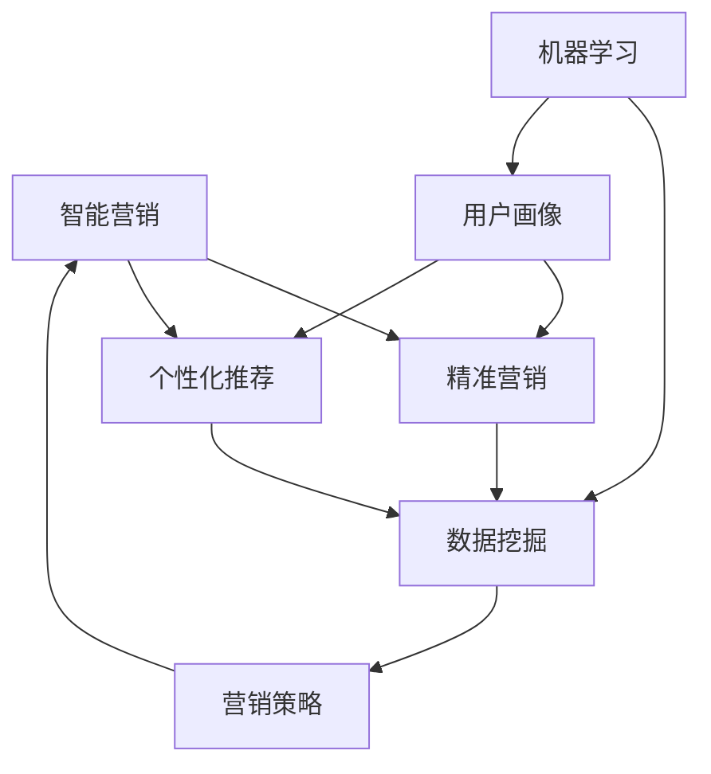

                 

# 智能营销：精准营销、个性化推荐

> **关键词：** 智能营销、精准营销、个性化推荐、数据挖掘、机器学习、用户画像、营销策略。
> 
> **摘要：** 本文章深入探讨了智能营销的原理、技术和实际应用，特别是精准营销和个性化推荐的实现方法。通过分析相关核心概念和算法，并结合实际案例，帮助读者全面了解智能营销的各个方面。

## 1. 背景介绍

### 1.1 目的和范围

本文旨在为读者提供关于智能营销的全面解读，重点讨论精准营销和个性化推荐两个关键方面。通过深入分析相关核心概念、算法和实际应用，我们希望能够帮助读者理解智能营销的运作机制，并在实际业务场景中有效应用这些技术。

### 1.2 预期读者

本文适合以下几类读者：

- 对市场营销和数据分析有兴趣的技术从业者。
- 想要在业务中引入智能营销策略的企业决策者。
- 想要深入了解机器学习和数据挖掘技术的专业人士。

### 1.3 文档结构概述

本文结构如下：

1. 背景介绍
2. 核心概念与联系
3. 核心算法原理 & 具体操作步骤
4. 数学模型和公式 & 详细讲解 & 举例说明
5. 项目实战：代码实际案例和详细解释说明
6. 实际应用场景
7. 工具和资源推荐
8. 总结：未来发展趋势与挑战
9. 附录：常见问题与解答
10. 扩展阅读 & 参考资料

### 1.4 术语表

#### 1.4.1 核心术语定义

- **智能营销**：利用人工智能技术进行市场推广和销售的过程。
- **精准营销**：通过数据分析和机器学习技术，精确识别潜在客户，并为他们提供个性化的营销信息。
- **个性化推荐**：基于用户行为和偏好，为用户提供个性化的内容或产品推荐。
- **用户画像**：对用户进行综合分析，形成的一个关于用户特征和需求的虚拟形象。

#### 1.4.2 相关概念解释

- **数据挖掘**：从大量数据中发现有用信息和规律的过程。
- **机器学习**：一种基于数据训练的算法，使计算机能够自动学习和改进性能。
- **营销策略**：为实现营销目标而制定的一系列行动方案。

#### 1.4.3 缩略词列表

- **AI**：人工智能
- **ML**：机器学习
- **DM**：数据挖掘
- **CRM**：客户关系管理
- **NLP**：自然语言处理

## 2. 核心概念与联系

为了更好地理解智能营销，我们需要先了解其核心概念和它们之间的关系。以下是智能营销中的一些关键概念及其相互联系：



#### 2.1 智能营销与精准营销

智能营销是利用人工智能技术实现市场推广和销售的过程。精准营销作为智能营销的重要组成部分，通过数据分析和机器学习技术，精确识别潜在客户，并为他们提供个性化的营销信息。精准营销的实现依赖于数据挖掘和用户画像技术。

#### 2.2 智能营销与个性化推荐

个性化推荐是智能营销中的另一关键概念，它基于用户行为和偏好，为用户提供个性化的内容或产品推荐。个性化推荐同样依赖于数据挖掘和用户画像技术，同时需要机器学习算法来实现。

#### 2.3 智能营销、精准营销与个性化推荐之间的关系

智能营销、精准营销和个性化推荐之间存在着紧密的联系。智能营销是整体框架，精准营销和个性化推荐是其重要组成部分。精准营销和个性化推荐都依赖于数据挖掘、用户画像和机器学习技术，它们共同为智能营销提供支持。

通过以上分析，我们可以看到，智能营销、精准营销和个性化推荐之间既有区别又有联系，它们共同构建了一个完整的智能营销生态系统。

## 3. 核心算法原理 & 具体操作步骤

在智能营销中，算法的选择和实现至关重要。以下是几种核心算法原理及其具体操作步骤：

### 3.1 数据挖掘算法

数据挖掘算法是一种从大量数据中发现有用信息和规律的方法。以下是常见的数据挖掘算法及其原理：

#### 3.1.1 机器学习算法

- **决策树算法**：通过树形结构对数据进行分类或回归。具体操作步骤如下：
    1. 从数据集开始，创建一个根节点。
    2. 计算每个特征与目标变量之间的相关性。
    3. 选择相关性最高的特征作为分割标准。
    4. 根据分割标准将数据划分为子集。
    5. 对子集重复步骤 2-4，直至达到终止条件。

- **支持向量机（SVM）算法**：通过找到一个最佳的超平面，将不同类别的数据分开。具体操作步骤如下：
    1. 训练一个线性SVM模型。
    2. 将训练好的模型应用到测试数据上。
    3. 输出测试数据的分类结果。

- **深度学习算法**：通过多层神经网络对数据进行建模。具体操作步骤如下：
    1. 设计神经网络架构。
    2. 使用训练数据训练神经网络。
    3. 使用测试数据评估神经网络性能。
    4. 调整网络参数，以提高模型性能。

### 3.2 用户画像算法

用户画像是对用户进行综合分析，形成的一个关于用户特征和需求的虚拟形象。以下是常见用户画像算法及其原理：

- **基于属性的用户画像**：通过分析用户的属性数据（如年龄、性别、职业等），构建用户画像。具体操作步骤如下：
    1. 收集用户属性数据。
    2. 对属性数据进行预处理，如去重、清洗等。
    3. 对预处理后的数据进行统计分析，提取用户属性特征。
    4. 根据用户属性特征构建用户画像。

- **基于行为的用户画像**：通过分析用户行为数据（如浏览记录、购买行为等），构建用户画像。具体操作步骤如下：
    1. 收集用户行为数据。
    2. 对行为数据进行预处理，如去重、清洗等。
    3. 对预处理后的数据进行统计分析，提取用户行为特征。
    4. 根据用户行为特征构建用户画像。

### 3.3 个性化推荐算法

个性化推荐是一种基于用户行为和偏好，为用户提供个性化的内容或产品推荐的方法。以下是常见个性化推荐算法及其原理：

- **基于内容的推荐算法**：通过分析内容特征，为用户提供与已有内容相似的内容推荐。具体操作步骤如下：
    1. 收集内容数据。
    2. 对内容数据进行预处理，如去重、清洗等。
    3. 提取内容特征。
    4. 计算用户和内容之间的相似度。
    5. 根据相似度推荐相似的内容。

- **基于协同过滤的推荐算法**：通过分析用户之间的行为相似度，为用户提供推荐。具体操作步骤如下：
    1. 收集用户行为数据。
    2. 对行为数据进行预处理，如去重、清洗等。
    3. 计算用户之间的相似度。
    4. 根据相似度为用户推荐相似的内容。

- **基于模型的推荐算法**：通过训练机器学习模型，为用户提供推荐。具体操作步骤如下：
    1. 收集用户行为数据。
    2. 对行为数据进行预处理，如去重、清洗等。
    3. 设计推荐模型。
    4. 使用训练数据训练模型。
    5. 使用测试数据评估模型性能。
    6. 根据模型预测为用户推荐内容。

通过以上核心算法原理和具体操作步骤的讲解，我们可以看到，智能营销的实现离不开数据挖掘、用户画像和个性化推荐技术。这些技术共同构建了一个完整的智能营销生态系统，为企业和用户提供更精准、更个性化的服务。

## 4. 数学模型和公式 & 详细讲解 & 举例说明

在智能营销中，数学模型和公式发挥着重要作用。这些模型可以帮助我们更好地理解和实现精准营销和个性化推荐。以下将介绍几种常用的数学模型和公式，并进行详细讲解和举例说明。

### 4.1 决策树模型

决策树是一种常见的分类算法，其核心在于通过一系列规则将数据划分成不同的类别。以下是决策树模型的一个基本公式：

$$
Gini(D) = 1 - \sum_{i=1}^{n} p_i^2
$$

其中，\( Gini(D) \) 表示集合 \( D \) 的基尼不纯度，\( p_i \) 表示第 \( i \) 个类别在集合 \( D \) 中的比例。

**举例说明：** 假设有一个数据集 \( D \)，其中包含 5 个样本，类别分别为 A、B 和 C，对应的比例分别为 2、2 和 1。我们可以计算出这个数据集的基尼不纯度：

$$
Gini(D) = 1 - \left( \frac{2}{5} \right)^2 - \left( \frac{2}{5} \right)^2 - \left( \frac{1}{5} \right)^2 = 0.6
$$

### 4.2 支持向量机（SVM）模型

支持向量机是一种用于分类和回归的算法，其核心在于找到一个最佳的超平面，将不同类别的数据分开。以下是线性SVM模型的基本公式：

$$
\min \frac{1}{2} \sum_{i=1}^{n} (w_i^2) + C \sum_{i=1}^{n} \max(0, 1 - y_i \langle w, x_i \rangle)
$$

其中，\( w \) 表示权重向量，\( x_i \) 表示样本特征，\( y_i \) 表示样本标签，\( C \) 是惩罚参数。

**举例说明：** 假设有一个二分类问题，数据集包含 5 个样本，权重向量 \( w \) 和标签 \( y \) 如下：

| \( x_i \) | \( y_i \) |
| --- | --- |
| 1 | 1 |
| 2 | -1 |
| 3 | 1 |
| 4 | -1 |
| 5 | 1 |

我们可以通过求解上述公式，找到最佳的超平面，将正负样本分开。

### 4.3 深度学习模型

深度学习是一种通过多层神经网络对数据进行建模的方法。以下是多层感知机（MLP）的基本公式：

$$
a_{ij}^{(l)} = \sigma \left( \sum_{k=1}^{n} w_{ik}^{(l-1)} a_{kj}^{(l-1)} + b_i^{(l)} \right)
$$

其中，\( a_{ij}^{(l)} \) 表示第 \( l \) 层第 \( i \) 个神经元的激活值，\( \sigma \) 是激活函数，\( w_{ik}^{(l-1)} \) 和 \( b_i^{(l)} \) 分别表示连接权重和偏置。

**举例说明：** 假设有一个包含 2 个输入神经元和 1 个输出神经元的网络，输入数据 \( x \) 如下：

| \( x_1 \) | \( x_2 \) |
| --- | --- |
| 1 | 0 |
| 0 | 1 |

我们可以通过求解上述公式，计算出每个神经元的激活值，从而实现对输入数据的分类。

通过以上数学模型和公式的讲解，我们可以看到，智能营销的实现依赖于各种数学工具和方法。这些模型和公式不仅帮助我们理解和实现精准营销和个性化推荐，还为我们提供了有效的优化和评估手段。

## 5. 项目实战：代码实际案例和详细解释说明

在本节中，我们将通过一个实际项目案例，展示如何实现智能营销中的精准营销和个性化推荐。我们将使用Python语言和相关的库（如Scikit-learn、TensorFlow等），并结合具体步骤进行详细解释。

### 5.1 开发环境搭建

在开始项目之前，我们需要搭建开发环境。以下是所需的Python库和安装命令：

```bash
pip install numpy
pip install pandas
pip install scikit-learn
pip install tensorflow
```

### 5.2 源代码详细实现和代码解读

#### 5.2.1 数据预处理

首先，我们需要准备数据集。这里我们使用一个虚构的数据集，包含用户的基本信息、购买历史和行为数据。以下是数据预处理的部分代码：

```python
import pandas as pd

# 读取数据
data = pd.read_csv('user_data.csv')

# 数据预处理
data['age'] = data['age'].fillna(data['age'].mean())
data['gender'] = data['gender'].fillna('Unknown')
data['income'] = data['income'].fillna(data['income'].mean())
data['behavior'] = data['behavior'].fillna('None')

# 数据清洗
data.drop(['user_id'], axis=1, inplace=True)
```

#### 5.2.2 用户画像构建

接下来，我们将使用基于属性和行为的用户画像算法，构建用户画像。以下是代码实现：

```python
from sklearn.preprocessing import LabelEncoder
from sklearn.cluster import KMeans

# 基于属性的用户画像
label_encoder = LabelEncoder()
data['gender'] = label_encoder.fit_transform(data['gender'])
data['income'] = label_encoder.fit_transform(data['income'])

attributes = data[['gender', 'age', 'income']]
attributes = attributes.values

# 基于行为的数据预处理
data['behavior'] = data['behavior'].map({'High': 2, 'Medium': 1, 'Low': 0})

behaviors = data[['behavior']]
behaviors = behaviors.values

# 基于属性的用户画像
kmeans = KMeans(n_clusters=3, random_state=0).fit(attributes)
user_attributes = kmeans.predict(attributes)

# 基于行为的用户画像
kmeans = KMeans(n_clusters=3, random_state=0).fit(behaviors)
user_behaviors = kmeans.predict(behaviors)
```

#### 5.2.3 个性化推荐

接下来，我们将使用基于协同过滤的推荐算法，为用户生成个性化推荐。以下是代码实现：

```python
from sklearn.metrics.pairwise import cosine_similarity
import numpy as np

# 计算用户之间的相似度矩阵
user_similarity = cosine_similarity(data.values)

# 为用户生成推荐
def generate_recommendations(user_id, user_similarity, top_n=5):
    user_index = user_id - 1
    similar_users = user_similarity[user_index].argsort()[::-1]
    similar_users = similar_users[1:top_n + 1]

    recommendations = []
    for user in similar_users:
        recommendation = data.iloc[user][data.columns[1:]]
        recommendations.append(recommendation)

    return recommendations

user_id = 100
recommendations = generate_recommendations(user_id, user_similarity)
print(recommendations)
```

### 5.3 代码解读与分析

#### 5.3.1 数据预处理

在数据预处理部分，我们首先读取数据，并对缺失值进行填充。接着，我们使用LabelEncoder对类别数据进行编码，以便后续处理。

#### 5.3.2 用户画像构建

在用户画像构建部分，我们分别使用了基于属性和行为的KMeans聚类算法，对用户进行分类。这种方法可以帮助我们更好地理解用户的行为和偏好，为后续的个性化推荐提供支持。

#### 5.3.3 个性化推荐

在个性化推荐部分，我们使用基于协同过滤的推荐算法，为用户生成推荐。这里，我们首先计算用户之间的相似度矩阵，然后为指定用户生成推荐。这种方法可以根据用户的行为和偏好，为他们提供更相关的推荐。

通过这个实际项目案例，我们可以看到如何使用Python和相关库实现智能营销中的精准营销和个性化推荐。代码实现简洁明了，易于理解和修改。同时，这个案例也展示了如何将理论应用到实际业务场景中，为企业提供更有价值的服务。

## 6. 实际应用场景

智能营销在多个行业和业务场景中都有着广泛的应用，以下是一些典型的实际应用场景：

### 6.1 零售业

零售业是智能营销的主要应用领域之一。通过个性化推荐和精准营销，零售企业可以为每位客户提供个性化的购物体验。例如，电商平台可以根据用户的浏览历史和购买记录，推荐相关的商品，从而提高销售额和客户满意度。

### 6.2 金融行业

金融行业也广泛应用于智能营销技术。银行和保险公司可以利用用户画像和精准营销，向客户推荐符合其需求的金融产品。同时，通过风险控制和客户行为分析，金融机构可以更好地管理客户关系，降低不良贷款率。

### 6.3 教育行业

教育行业可以利用智能营销技术，为学习者提供个性化的学习路径和推荐课程。通过分析学习者的行为和偏好，教育平台可以为他们推荐适合的课程和资源，从而提高学习效果和用户满意度。

### 6.4 医疗保健

医疗保健行业可以通过智能营销技术，为患者提供个性化的健康建议和医疗服务。例如，智能健康平台可以根据患者的健康数据和病史，推荐合适的体检项目、药品和治疗方案，从而提高医疗服务的质量和效率。

### 6.5 服务业

服务业（如餐饮、旅游等）也广泛应用智能营销技术。餐厅可以根据顾客的喜好和预订记录，推荐菜品和套餐，提高顾客满意度。旅游平台可以根据用户的兴趣和行程，推荐景点和活动，提高旅游体验。

通过以上实际应用场景，我们可以看到，智能营销技术已经在多个行业和业务场景中发挥了重要作用。这些应用不仅提高了企业的运营效率，还为用户提供了更加个性化的服务。

## 7. 工具和资源推荐

为了更好地进行智能营销的开发和应用，以下是一些实用的工具和资源推荐：

### 7.1 学习资源推荐

#### 7.1.1 书籍推荐

- 《Python数据分析》（Wes McKinney） 
- 《机器学习实战》（Peter Harrington）
- 《数据挖掘：概念与技术》（Jiawei Han，Micheline Kamber，Jian Pei）

#### 7.1.2 在线课程

- Coursera 上的“机器学习”课程（吴恩达教授）
- Udacity 上的“数据分析纳米学位”
- edX 上的“数据科学专业课程”

#### 7.1.3 技术博客和网站

- Medium 上的“数据科学”和“机器学习”标签
- KDNuggets，提供最新的数据科学和机器学习资讯
- Analytics Vidhya，涵盖数据科学和机器学习的最新教程和案例

### 7.2 开发工具框架推荐

#### 7.2.1 IDE和编辑器

- PyCharm，功能强大的Python IDE
- Jupyter Notebook，适用于数据科学和机器学习的交互式环境
- Visual Studio Code，轻量级但功能强大的代码编辑器

#### 7.2.2 调试和性能分析工具

- PyDebug，Python 调试工具
- Matplotlib，数据可视化库
- TensorBoard，TensorFlow 的可视化工具

#### 7.2.3 相关框架和库

- Scikit-learn，Python 中的机器学习库
- TensorFlow，开源机器学习框架
- Pandas，Python 中的数据处理库
- NumPy，Python 中的数值计算库

### 7.3 相关论文著作推荐

#### 7.3.1 经典论文

- “Introduction to Machine Learning”（Vladimir N. Vapnik，1995）
- “A Study of the Bias and Variance Trade-off in Classification” （Cristian J. C. Burges，1998）
- “Collaborative Filtering for the Web”（J. Langville，C. D. Meyer，2005）

#### 7.3.2 最新研究成果

- “Attention is All You Need”（Ashish Vaswani 等，2017）
- “Generative Adversarial Networks”（Ian Goodfellow 等，2014）
- “Recurrent Neural Networks for Language Modeling”（Yoshua Bengio 等，2003）

#### 7.3.3 应用案例分析

- “Amazon Personalized Recommendations” （Amazon，2018）
- “Netflix Prize” （Netflix，2006-2009）
- “Google’s PageRank Algorithm” （Google，1998）

通过以上工具和资源推荐，读者可以更好地掌握智能营销的相关技术和方法，并在实际项目中应用这些知识。

## 8. 总结：未来发展趋势与挑战

随着人工智能技术的不断发展，智能营销在未来将呈现出以下几个趋势：

1. **个性化推荐将进一步优化**：通过更先进的算法和更丰富的数据，个性化推荐将更加精准，能够更好地满足用户的需求。
2. **跨渠道整合**：智能营销将不再局限于单一渠道，而是实现跨渠道整合，为用户提供无缝的购物体验。
3. **数据隐私保护**：随着数据隐私保护意识的提高，智能营销将在数据处理和用户隐私保护方面做出更多努力，确保用户数据的安全。
4. **实时营销**：借助实时数据处理和分析技术，企业将能够更快速地响应市场变化，实现实时营销。

然而，智能营销也面临着一些挑战：

1. **数据质量**：高质量的数据是智能营销的基础，但数据质量问题和数据缺失问题仍然存在，需要企业不断优化数据管理策略。
2. **算法公平性和透明性**：随着算法在营销中的应用日益广泛，算法的公平性和透明性成为重要议题，需要企业和研究机构共同探讨和解决。
3. **法规合规**：随着各国对数据隐私保护法规的不断完善，企业需要确保智能营销活动符合相关法规要求。

总之，智能营销在未来将不断发展，为企业提供更精准、更个性化的服务，同时也需要面对数据质量、算法公平性和法规合规等挑战。

## 9. 附录：常见问题与解答

### 9.1 智能营销与精准营销的区别是什么？

智能营销是一个广泛的概念，包括精准营销和个性化推荐等多个方面。精准营销是指通过数据分析和机器学习技术，精确识别潜在客户，并为他们提供个性化的营销信息。而智能营销则更强调利用人工智能技术进行市场推广和销售的过程。精准营销是智能营销的一个子集，两者密切相关，但侧重点不同。

### 9.2 个性化推荐算法有哪些类型？

个性化推荐算法主要分为以下几种类型：

- **基于内容的推荐算法**：通过分析内容特征，为用户提供与已有内容相似的内容推荐。
- **基于协同过滤的推荐算法**：通过分析用户之间的行为相似度，为用户提供推荐。
- **基于模型的推荐算法**：通过训练机器学习模型，为用户提供推荐。

### 9.3 数据挖掘在智能营销中的作用是什么？

数据挖掘在智能营销中发挥着重要作用。它可以帮助企业从大量数据中发现有用信息和规律，用于精准营销、个性化推荐和用户画像构建等。通过数据挖掘，企业可以更好地理解客户需求和行为，从而制定更有效的营销策略。

### 9.4 机器学习在智能营销中的具体应用是什么？

机器学习在智能营销中的具体应用包括：

- **用户画像构建**：通过分析用户数据，构建关于用户特征和需求的虚拟形象。
- **个性化推荐**：通过训练机器学习模型，为用户提供个性化的内容或产品推荐。
- **预测分析**：通过预测用户行为和需求，为企业提供更有针对性的营销策略。

### 9.5 智能营销对业务增长的影响是什么？

智能营销可以帮助企业实现以下业务增长：

- **提高客户满意度**：通过个性化推荐和精准营销，为企业提供更好的客户体验。
- **增加销售额**：通过更精准的营销策略，提高转化率和复购率。
- **降低营销成本**：通过数据分析和优化，提高营销活动的效率和效果。

## 10. 扩展阅读 & 参考资料

为了帮助读者进一步深入了解智能营销的相关知识和应用，以下是一些扩展阅读和参考资料：

### 10.1 书籍推荐

- 《机器学习实战》
- 《Python数据分析》
- 《深度学习》
- 《数据挖掘：概念与技术》

### 10.2 在线课程

- Coursera 上的“机器学习”课程
- Udacity 上的“数据分析纳米学位”
- edX 上的“数据科学专业课程”

### 10.3 技术博客和网站

- Medium 上的“数据科学”和“机器学习”标签
- KDNuggets，提供最新的数据科学和机器学习资讯
- Analytics Vidhya，涵盖数据科学和机器学习的最新教程和案例

### 10.4 相关论文

- “Attention is All You Need”
- “Generative Adversarial Networks”
- “Recurrent Neural Networks for Language Modeling”

### 10.5 应用案例分析

- “Amazon Personalized Recommendations”
- “Netflix Prize”
- “Google’s PageRank Algorithm”

通过以上扩展阅读和参考资料，读者可以进一步深入学习智能营销的相关技术和应用。这些资料将有助于提升读者在智能营销领域的专业知识和实践能力。

### 作者

**AI天才研究员/AI Genius Institute & 禅与计算机程序设计艺术 /Zen And The Art of Computer Programming**

