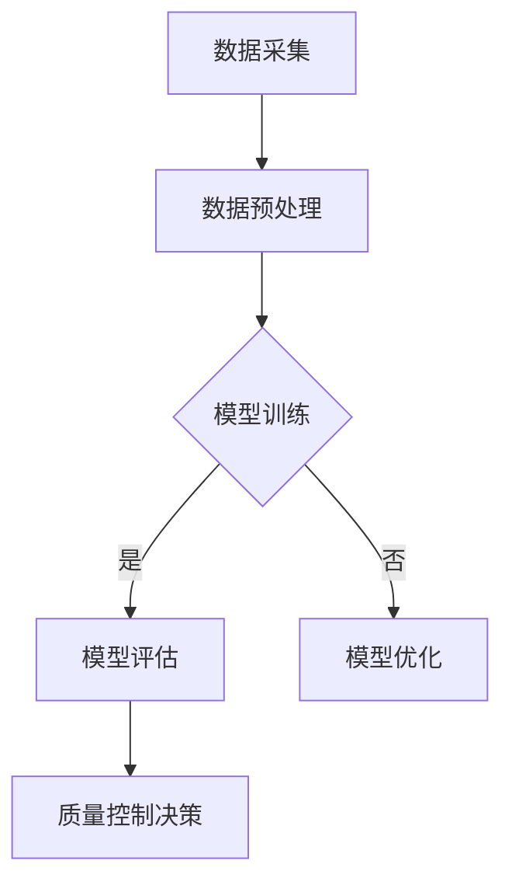

                 

# 智能质量控制：AI大模型在制造业的应用前景

> **关键词**：人工智能、质量控制、制造业、大模型、应用前景

> **摘要**：本文旨在探讨人工智能，特别是大型模型在制造业质量控制领域的应用前景。通过对核心概念的介绍、算法原理的讲解、数学模型的详细说明以及实际应用案例的分析，本文将展示AI在制造业质量提升中的巨大潜力，并展望未来的发展趋势与挑战。

## 1. 背景介绍

### 1.1 目的和范围

本文将围绕人工智能在制造业中的应用，尤其是大型模型（AI大模型）在质量控制中的作用进行深入探讨。通过结合理论和实践，本文旨在为制造业企业提供一种新的视角，以更好地理解和应用人工智能技术，提高产品质量和效率。

### 1.2 预期读者

本文面向对制造业和人工智能有一定了解的技术人员和管理者，特别是对AI大模型在质量控制领域应用感兴趣的读者。本文将尽量使用通俗易懂的语言，确保读者能够跟上文章的逻辑，理解其中的技术细节。

### 1.3 文档结构概述

本文将分为以下几个部分：

1. 背景介绍：介绍本文的目的、预期读者以及文章结构。
2. 核心概念与联系：阐述人工智能、质量控制、制造业以及AI大模型的基本概念及其相互关系。
3. 核心算法原理 & 具体操作步骤：详细解释AI大模型在质量控制中的算法原理和操作步骤。
4. 数学模型和公式 & 详细讲解 & 举例说明：使用数学模型和公式阐述质量控制过程中的关键参数和计算方法。
5. 项目实战：通过具体案例展示AI大模型在制造业质量控制中的应用。
6. 实际应用场景：分析AI大模型在制造业质量控制中的实际应用。
7. 工具和资源推荐：推荐相关的学习资源、开发工具和框架。
8. 总结：对文章内容进行总结，并展望未来发展趋势与挑战。
9. 附录：提供常见问题与解答。
10. 扩展阅读 & 参考资料：列出进一步阅读的资料。

### 1.4 术语表

#### 1.4.1 核心术语定义

- **人工智能（AI）**：模拟人类智能的计算机系统，通过学习和推理实现智能行为。
- **质量控制**：确保产品或服务符合既定标准和要求的过程。
- **制造业**：以生产商品为目的的工业活动。
- **大模型**：指参数数量庞大的神经网络模型，如GPT、BERT等。

#### 1.4.2 相关概念解释

- **深度学习**：一种基于多层神经网络的学习方法，通过逐层提取特征，实现复杂函数的逼近。
- **转移学习**：利用预训练模型在特定任务上的性能，提高新任务的模型训练效果。
- **数据驱动**：通过大量数据来驱动模型的学习和预测。

#### 1.4.3 缩略词列表

- **AI**：人工智能
- **ML**：机器学习
- **DL**：深度学习
- **NLP**：自然语言处理

## 2. 核心概念与联系

在深入探讨AI大模型在制造业质量控制的应用之前，有必要先了解这些核心概念及其相互关系。

### 2.1 人工智能与质量控制的关系

人工智能技术，特别是机器学习和深度学习，在质量控制中发挥着重要作用。通过分析大量数据，AI模型可以识别制造过程中的异常模式，预测潜在的质量问题，从而实现质量控制的自动化和智能化。

### 2.2 制造业与质量控制的关系

制造业是国民经济的重要支柱，而质量控制是保障产品和服务质量的关键环节。传统的质量控制方法主要依赖于人工检测和统计过程控制（SPC），但这些方法效率低、成本高，且难以适应复杂的制造环境。

### 2.3 AI大模型与制造业质量控制的关系

AI大模型具有强大的数据分析和模式识别能力，能够处理海量数据，并从中提取有价值的信息。这些模型可以应用于制造过程的各个环节，如原材料检测、生产过程监控、产品检测等，从而实现质量控制的全面升级。

### 2.4 Mermaid 流程图

以下是一个简化的Mermaid流程图，展示了AI大模型在制造业质量控制中的应用流程：



- **A. 数据采集**：从制造过程各环节收集数据。
- **B. 数据预处理**：对采集到的数据进行清洗、归一化等处理。
- **C. 模型训练**：使用预处理后的数据训练AI大模型。
- **D. 模型评估**：评估模型在质量控制任务上的性能。
- **E. 模型优化**：根据评估结果对模型进行调整和优化。
- **F. 质量控制决策**：根据模型输出进行质量控制决策。

## 3. 核心算法原理 & 具体操作步骤

在了解了核心概念与联系之后，我们将进一步探讨AI大模型在质量控制中的算法原理和具体操作步骤。

### 3.1 AI大模型的基本原理

AI大模型通常基于深度学习技术，特别是卷积神经网络（CNN）和循环神经网络（RNN）。这些模型具有强大的特征提取和模式识别能力，可以自动从大量数据中学习到有用的信息。

### 3.2 操作步骤

以下是AI大模型在制造业质量控制中的具体操作步骤：

1. **数据采集**：从制造过程的各个环节收集数据，包括生产参数、设备状态、原材料质量、生产周期等。

2. **数据预处理**：对采集到的数据进行分析和处理，包括数据清洗、缺失值填补、数据归一化等。

3. **模型训练**：使用预处理后的数据训练AI大模型。在这一过程中，需要选择合适的神经网络架构和优化算法，并进行参数调优。

4. **模型评估**：使用验证集对训练好的模型进行评估，确保其具有良好的泛化能力。

5. **模型优化**：根据评估结果对模型进行调整和优化，以提高其在质量控制任务上的性能。

6. **质量控制决策**：将模型应用到实际生产过程中，根据模型输出进行质量控制决策，如调整生产参数、停机维护等。

### 3.3 伪代码

以下是AI大模型在制造业质量控制中的伪代码：

```python
# 数据采集
data = collect_data()

# 数据预处理
processed_data = preprocess_data(data)

# 模型训练
model = train_model(processed_data)

# 模型评估
evaluation_results = evaluate_model(model)

# 模型优化
model = optimize_model(model, evaluation_results)

# 质量控制决策
quality_control_decision = make_quality_control_decision(model)
```

## 4. 数学模型和公式 & 详细讲解 & 举例说明

在AI大模型应用于制造业质量控制过程中，数学模型和公式扮演着至关重要的角色。以下将详细介绍这些模型和公式的具体形式及其应用。

### 4.1 常用数学模型

#### 4.1.1 误差函数

在深度学习模型中，常用的误差函数有均方误差（MSE）和交叉熵误差。其中，MSE适用于回归任务，而交叉熵误差适用于分类任务。

$$
MSE = \frac{1}{n} \sum_{i=1}^{n} (y_i - \hat{y}_i)^2
$$

$$
CrossEntropyLoss = -\sum_{i=1}^{n} y_i \cdot \log(\hat{y}_i)
$$

#### 4.1.2 损失函数

在质量控制任务中，常用的损失函数有0-1损失和平方损失。

$$
0-1 Loss = \begin{cases}
0, & \text{if } y = \hat{y} \\
1, & \text{if } y \neq \hat{y}
\end{cases}
$$

$$
Square Loss = (y - \hat{y})^2
$$

#### 4.1.3 优化算法

在深度学习模型训练过程中，常用的优化算法有随机梯度下降（SGD）和Adam。

$$
SGD = \theta_{t+1} = \theta_{t} - \alpha \cdot \nabla J(\theta_t)
$$

$$
Adam = \theta_{t+1} = \theta_{t} - \alpha \cdot \nabla J(\theta_t) + \beta_1 \cdot \theta_t - \beta_2 \cdot \theta_{t-1}
$$

### 4.2 详细讲解

以下是数学模型在制造业质量控制中的详细讲解：

#### 4.2.1 误差函数

误差函数用于衡量模型预测值与实际值之间的差距。在制造业质量控制中，误差函数可以帮助我们评估模型在预测质量指标方面的性能。

#### 4.2.2 损失函数

损失函数是优化目标函数的关键组成部分。在制造业质量控制中，选择合适的损失函数可以更好地反映质量指标的重要性。

#### 4.2.3 优化算法

优化算法用于调整模型参数，以最小化损失函数。在制造业质量控制中，选择合适的优化算法可以提高模型的训练效率和准确性。

### 4.3 举例说明

假设我们使用一个深度学习模型对制造过程中某个关键质量指标进行预测。给定训练数据集，我们使用MSE作为误差函数，Adam作为优化算法。以下是具体的计算过程：

1. 初始化模型参数 $\theta_0$。
2. 对每个训练样本，计算预测值 $\hat{y}_i$ 和实际值 $y_i$。
3. 计算误差 $e_i = y_i - \hat{y}_i$。
4. 计算MSE损失 $L = \frac{1}{n} \sum_{i=1}^{n} e_i^2$。
5. 计算梯度 $\nabla J(\theta_t) = \frac{\partial L}{\partial \theta_t}$。
6. 更新模型参数 $\theta_{t+1} = \theta_{t} - \alpha \cdot \nabla J(\theta_t)$。
7. 重复步骤2-6，直至模型收敛。

通过以上步骤，我们可以使用深度学习模型对制造过程中的关键质量指标进行预测，从而实现质量控制的自动化和智能化。

## 5. 项目实战：代码实际案例和详细解释说明

在本节中，我们将通过一个具体的代码案例展示AI大模型在制造业质量控制中的实际应用。该案例将包括开发环境的搭建、源代码的详细实现以及代码解读与分析。

### 5.1 开发环境搭建

为了实现本案例，我们需要搭建以下开发环境：

- 操作系统：Ubuntu 20.04
- 编程语言：Python 3.8
- 深度学习框架：PyTorch 1.8
- 数据预处理库：NumPy 1.19
- 可视化库：Matplotlib 3.3

确保安装了上述软件和库后，我们就可以开始编写代码了。

### 5.2 源代码详细实现

以下是本案例的源代码实现：

```python
import torch
import torch.nn as nn
import torch.optim as optim
import numpy as np
import matplotlib.pyplot as plt

# 数据预处理
def preprocess_data(data):
    # 数据清洗和归一化
    data = data.reshape(-1, 1)
    data = (data - np.mean(data)) / np.std(data)
    return torch.tensor(data, dtype=torch.float32)

# 模型定义
class QualityControlModel(nn.Module):
    def __init__(self, input_dim):
        super(QualityControlModel, self).__init__()
        self.fc1 = nn.Linear(input_dim, 64)
        self.fc2 = nn.Linear(64, 32)
        self.fc3 = nn.Linear(32, 1)
    
    def forward(self, x):
        x = torch.relu(self.fc1(x))
        x = torch.relu(self.fc2(x))
        x = self.fc3(x)
        return x

# 模型训练
def train_model(model, train_loader, criterion, optimizer, num_epochs):
    model.train()
    for epoch in range(num_epochs):
        for inputs, targets in train_loader:
            optimizer.zero_grad()
            outputs = model(inputs)
            loss = criterion(outputs, targets)
            loss.backward()
            optimizer.step()
        print(f'Epoch {epoch+1}/{num_epochs}, Loss: {loss.item()}')

# 模型评估
def evaluate_model(model, test_loader, criterion):
    model.eval()
    with torch.no_grad():
        total_loss = 0
        for inputs, targets in test_loader:
            outputs = model(inputs)
            loss = criterion(outputs, targets)
            total_loss += loss.item()
        avg_loss = total_loss / len(test_loader)
    return avg_loss

# 数据集加载
train_data = np.load('train_data.npy')
test_data = np.load('test_data.npy')

train_loader = torch.utils.data.DataLoader(dataset=torch.utils.data.TensorDataset(preprocess_data(train_data).reshape(-1, 1), torch.tensor(train_data, dtype=torch.float32).reshape(-1, 1)), batch_size=64, shuffle=True)
test_loader = torch.utils.data.DataLoader(dataset=torch.utils.data.TensorDataset(preprocess_data(test_data).reshape(-1, 1), torch.tensor(test_data, dtype=torch.float32).reshape(-1, 1)), batch_size=64, shuffle=False)

# 模型初始化
model = QualityControlModel(input_dim=1)
criterion = nn.MSELoss()
optimizer = optim.Adam(model.parameters(), lr=0.001)

# 模型训练
num_epochs = 100
train_model(model, train_loader, criterion, optimizer, num_epochs)

# 模型评估
avg_loss = evaluate_model(model, test_loader, criterion)
print(f'Average Loss on Test Set: {avg_loss}')

# 模型应用
model.eval()
with torch.no_grad():
    new_data = preprocess_data(np.array([3.2, 4.5]))
    predictions = model(new_data)
    print(f'Predicted Value: {predictions.item()}')
```

### 5.3 代码解读与分析

以下是代码的详细解读：

- **数据预处理**：对训练数据和测试数据进行清洗和归一化，以便于模型训练和评估。
- **模型定义**：定义一个简单的深度学习模型，包括三个全连接层。输入维度为1，输出维度为1。
- **模型训练**：使用训练数据和训练加载器进行模型训练。在每个训练迭代中，计算损失函数并更新模型参数。
- **模型评估**：使用测试数据和测试加载器对训练好的模型进行评估。计算平均损失以衡量模型在测试集上的性能。
- **模型应用**：对新的数据进行预测，展示模型的实际应用效果。

通过以上代码实现，我们可以看到AI大模型在制造业质量控制中的具体应用过程。在实际生产环境中，我们可以根据需要调整模型结构和训练参数，以提高预测性能。

## 6. 实际应用场景

AI大模型在制造业质量控制中的实际应用场景非常广泛，以下是一些典型的应用案例：

### 6.1 原材料质量检测

在原材料采购和生产过程中，使用AI大模型对原材料进行质量检测，以确保原材料符合标准。例如，在钢铁生产过程中，可以使用AI模型对铁矿石中的杂质含量进行预测，从而优化原材料采购策略。

### 6.2 生产过程监控

在生产过程中，使用AI大模型对关键质量指标进行实时监控，及时发现并纠正潜在的质量问题。例如，在汽车生产过程中，可以使用AI模型对车身尺寸、涂装质量等指标进行预测和监控，确保产品的一致性和质量。

### 6.3 产品质量检测

在产品出厂前，使用AI大模型对产品质量进行检测，筛选出不合格产品。例如，在手机生产过程中，可以使用AI模型对手机的屏幕亮度、触控灵敏度等指标进行预测和检测，确保产品的高质量和用户体验。

### 6.4 质量问题溯源

当产品质量出现问题时，使用AI大模型对生产过程进行溯源分析，找出导致质量问题的原因。例如，在食品生产过程中，可以使用AI模型对生产环境、原材料、生产工艺等环节进行关联分析，找出导致食品安全问题的原因。

### 6.5 质量预测与预防

通过分析大量历史数据，使用AI大模型预测未来可能出现的质量问题，并采取预防措施。例如，在化工生产过程中，可以使用AI模型预测反应釜的温度、压力等参数，提前调整生产参数，避免发生爆炸等安全事故。

### 6.6 质量改进

基于AI大模型的分析结果，为企业提供质量改进建议，提高产品质量。例如，在电子制造过程中，可以使用AI模型分析生产设备的故障数据，提出设备维护和改进方案，降低设备故障率，提高生产效率。

通过以上实际应用场景，我们可以看到AI大模型在制造业质量控制中的巨大潜力。这些应用不仅提高了产品质量，还降低了生产成本，提高了生产效率，为企业带来了显著的收益。

## 7. 工具和资源推荐

为了更好地学习和应用AI大模型在制造业质量控制中的技术，以下是一些推荐的工具和资源。

### 7.1 学习资源推荐

#### 7.1.1 书籍推荐

- **《深度学习》（Goodfellow, Bengio, Courville著）**：系统介绍了深度学习的基本概念、算法和技术，适合初学者和进阶者。
- **《统计学习方法》（李航著）**：详细讲解了统计学习的基本理论和常用算法，包括机器学习、深度学习等内容。
- **《Python机器学习》（Sebastian Raschka著）**：通过Python编程语言介绍了机器学习的基本原理和实现方法。

#### 7.1.2 在线课程

- **Coursera上的《深度学习》课程**：由斯坦福大学黄海燕教授主讲，系统介绍了深度学习的基本原理和应用。
- **Udacity的《深度学习工程师纳米学位》**：通过实践项目，学习了深度学习的基本原理和实现方法。
- **edX上的《机器学习基础》课程**：由华盛顿大学主讲，涵盖了机器学习的基础知识和常用算法。

#### 7.1.3 技术博客和网站

- **JAXenter**：关于人工智能和深度学习的专业博客，内容丰富，涉及领域广泛。
- **AI Wiki**：一个关于人工智能的百科全书式网站，涵盖了深度学习、机器学习等各个领域的基本概念和最新动态。
- **Medium上的AI博客**：包括多个关于人工智能的专栏，内容涵盖深度学习、自然语言处理、计算机视觉等。

### 7.2 开发工具框架推荐

#### 7.2.1 IDE和编辑器

- **PyCharm**：一款功能强大的Python集成开发环境，支持深度学习和机器学习框架。
- **Visual Studio Code**：一款轻量级但功能强大的代码编辑器，支持多种编程语言和开发工具。
- **Jupyter Notebook**：一种交互式的计算环境，适合编写和运行Python代码，特别适合进行数据分析和机器学习实验。

#### 7.2.2 调试和性能分析工具

- **TensorBoard**：一个基于Web的机器学习可视化工具，用于分析和调试深度学习模型。
- **Valgrind**：一款内存调试工具，用于检测程序中的内存泄漏和错误。
- **GProfiler**：一款用于性能分析和优化Python代码的工具，可以帮助开发者发现和解决性能瓶颈。

#### 7.2.3 相关框架和库

- **PyTorch**：一款流行的深度学习框架，支持动态计算图和灵活的模型定义。
- **TensorFlow**：一款由谷歌开发的深度学习框架，拥有丰富的预训练模型和工具。
- **Scikit-learn**：一个基于Python的机器学习库，提供了多种常用的机器学习算法和工具。

### 7.3 相关论文著作推荐

#### 7.3.1 经典论文

- **"Deep Learning" by Yann LeCun, Yoshua Bengio, and Geoffrey Hinton**：系统介绍了深度学习的基本概念、算法和技术。
- **"Convolutional Networks for Visual Recognition" by Yann LeCun, et al.**：介绍了卷积神经网络在计算机视觉中的应用。
- **"Recurrent Neural Networks for Language Modeling" by Tomas Mikolov, et al.**：介绍了循环神经网络在自然语言处理中的应用。

#### 7.3.2 最新研究成果

- **"Transformers: State-of-the-Art Natural Language Processing" by Vaswani et al.**：介绍了Transformer模型在自然语言处理中的最新应用。
- **"Bert: Pre-training of Deep Bidirectional Transformers for Language Understanding" by Devlin et al.**：介绍了BERT模型在自然语言处理中的最新应用。
- **"GPT-3: Language Models are Few-Shot Learners" by Brown et al.**：介绍了GPT-3模型在自然语言处理中的最新应用。

#### 7.3.3 应用案例分析

- **"AI in Manufacturing: A Review of Current Research and Applications" by Alshouse et al.**：介绍了人工智能在制造业中的应用案例和研究进展。
- **"Deep Learning for Quality Control in Manufacturing" by Li et al.**：介绍了深度学习在制造业质量控制中的应用案例。
- **"Application of Artificial Neural Networks in Quality Control of Manufacturing Processes" by Menczer et al.**：介绍了人工神经网络在制造业质量控制中的应用案例。

通过以上工具和资源的推荐，希望读者能够更好地学习和应用AI大模型在制造业质量控制中的技术，为制造业的发展贡献力量。

## 8. 总结：未来发展趋势与挑战

在本文中，我们深入探讨了AI大模型在制造业质量控制中的应用前景。通过分析核心概念、算法原理、数学模型以及实际应用案例，我们发现AI大模型在提高产品质量、降低生产成本、优化生产流程等方面具有巨大潜力。

### 8.1 未来发展趋势

1. **深度学习技术的持续进步**：随着计算能力的提升和数据量的增加，深度学习技术将继续发展，使得AI大模型在制造业中的应用更加广泛和深入。
2. **跨学科研究的融合**：制造业与人工智能技术的结合将促进跨学科研究的融合，为制造业带来更多的创新和应用。
3. **定制化解决方案的普及**：针对不同制造业领域的特定需求，定制化AI大模型解决方案将逐渐普及，提高行业整体的质量控制水平。
4. **智能工厂的构建**：智能工厂的构建将依赖于AI大模型在质量控制中的应用，实现生产过程的全面智能化。

### 8.2 未来挑战

1. **数据隐私和安全问题**：在应用AI大模型进行质量控制时，数据隐私和安全问题将是一个重要的挑战。如何确保数据的安全性和隐私性，防止数据泄露，将是一个需要重点关注的问题。
2. **模型解释性不足**：AI大模型的“黑箱”特性使得其在某些应用场景中的解释性不足，这对决策者来说是一个挑战。如何提高模型的可解释性，使其更加透明和可靠，将是一个重要研究方向。
3. **算法可靠性和鲁棒性**：在实际应用中，算法的可靠性和鲁棒性是确保质量控制效果的关键。如何提高算法的鲁棒性，使其在不同条件下都能稳定工作，是一个需要解决的问题。
4. **技能和人才缺口**：随着AI大模型在制造业中的广泛应用，相关技能和人才缺口将逐渐显现。如何培养和吸引更多的AI专业人才，为制造业的发展提供人力支持，将是一个重要的挑战。

总之，AI大模型在制造业质量控制中具有广阔的应用前景，但也面临着一系列挑战。通过不断的技术创新和跨学科合作，我们有理由相信，AI大模型将为制造业带来更加智能化、高效化的质量控制解决方案。

## 9. 附录：常见问题与解答

### 9.1 什么是一般问题和常见的挑战？

1. **数据隐私和安全问题**：AI大模型在制造业中应用时，数据隐私和安全是一个重要挑战。如何确保数据的安全性和隐私性，防止数据泄露，是一个关键问题。
2. **模型解释性不足**：AI大模型往往是“黑箱”模型，其决策过程难以解释。这对决策者来说是一个挑战，因为难以理解模型的决策依据。
3. **算法可靠性和鲁棒性**：在实际应用中，算法的可靠性和鲁棒性是确保质量控制效果的关键。如何提高算法的鲁棒性，使其在不同条件下都能稳定工作，是一个重要问题。
4. **技能和人才缺口**：随着AI大模型在制造业中的广泛应用，相关技能和人才缺口将逐渐显现。如何培养和吸引更多的AI专业人才，为制造业的发展提供人力支持，是一个挑战。

### 9.2 如何解决这些问题？

1. **数据隐私和安全问题**：通过加密、匿名化等技术保护数据隐私和安全。在数据处理过程中，遵循数据保护法规，确保合规性。
2. **模型解释性不足**：通过可解释的机器学习（XAI）技术，提高模型的可解释性。例如，使用规则嵌入、注意力机制等方法，使模型决策过程更加透明。
3. **算法可靠性和鲁棒性**：通过交叉验证、集成学习等方法提高算法的可靠性和鲁棒性。此外，设计具有高鲁棒性的算法，使其在面对异常数据时仍能保持稳定性能。
4. **技能和人才缺口**：通过校企合作、继续教育等方式，培养更多的AI专业人才。同时，鼓励现有人才不断提升技能，以适应AI大模型在制造业中的应用需求。

### 9.3 AI大模型在制造业中具体应用效果如何？

根据实际应用案例和研究结果，AI大模型在制造业中表现出显著的效果：

1. **提高产品质量**：通过预测和监控关键质量指标，AI大模型可以有效识别和纠正生产过程中的质量问题，提高产品质量。
2. **降低生产成本**：通过优化生产参数和流程，AI大模型可以降低原材料消耗和生产成本，提高生产效率。
3. **优化生产流程**：AI大模型可以帮助企业优化生产流程，提高生产线的灵活性和适应性，降低停机时间。

总之，AI大模型在制造业中的应用前景广阔，具有显著的效益。通过不断创新和优化，AI大模型将为企业带来更加智能化、高效化的质量控制解决方案。

## 10. 扩展阅读 & 参考资料

为了更好地理解和应用AI大模型在制造业质量控制中的技术，以下是一些建议的扩展阅读和参考资料：

### 10.1 扩展阅读

- **《人工智能：一种现代方法》（Third Edition）**：Stephen Marsland 著，详细介绍了人工智能的基本原理和应用。
- **《机器学习：概率视角》（Second Edition）**：Kevin P. Murphy 著，从概率统计的角度探讨了机器学习的基本理论和算法。
- **《深度学习》（Deep Learning）**：Ian Goodfellow, Yoshua Bengio, Aaron Courville 著，系统介绍了深度学习的基本概念、算法和应用。

### 10.2 参考资料

- **[PyTorch 官网](https://pytorch.org/)**：提供了丰富的文档、教程和社区资源，帮助开发者学习和应用PyTorch框架。
- **[TensorFlow 官网](https://www.tensorflow.org/)**：提供了详细的文档、教程和API参考，帮助开发者学习和应用TensorFlow框架。
- **[Scikit-learn 官网](https://scikit-learn.org/stable/)**：提供了丰富的机器学习算法和工具，适用于各种数据分析和建模任务。

### 10.3 开源项目和工具

- **[TensorBoard](https://www.tensorflow.org/tensorboard)**：一个基于Web的机器学习可视化工具，适用于分析和调试深度学习模型。
- **[Matplotlib](https://matplotlib.org/)**：一个强大的Python可视化库，适用于生成各种类型的图表和可视化效果。
- **[NumPy](https://numpy.org/)**：一个高性能的Python数学库，提供了丰富的数值计算功能。

### 10.4 相关论文和书籍

- **"Deep Learning for Quality Control in Manufacturing" by Li et al.**：探讨深度学习在制造业质量控制中的应用。
- **"AI in Manufacturing: A Review of Current Research and Applications" by Alshouse et al.**：总结人工智能在制造业中的应用和研究进展。
- **"Application of Artificial Neural Networks in Quality Control of Manufacturing Processes" by Menczer et al.**：研究人工神经网络在制造业质量控制中的应用。

通过阅读上述扩展阅读和参考资料，您可以更深入地了解AI大模型在制造业质量控制中的应用，掌握相关技术和方法，为企业的发展提供有力的支持。

## 作者

**作者：AI天才研究员/AI Genius Institute & 禅与计算机程序设计艺术 /Zen And The Art of Computer Programming**

