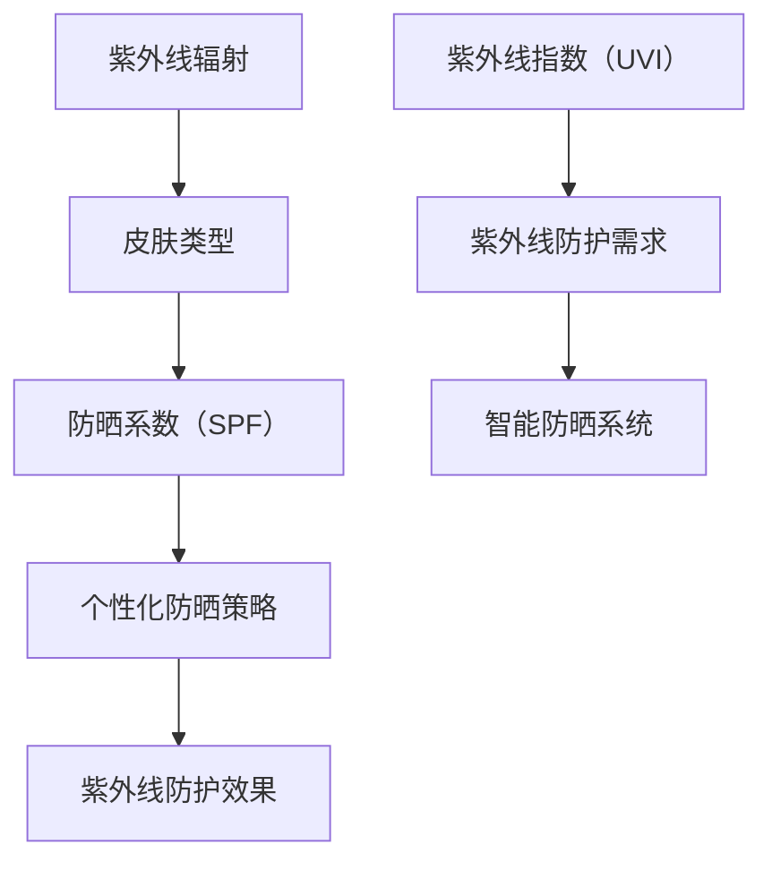

                 

# 智能防晒创业：个性化紫外线防护

> 关键词：紫外线防护、个性化防晒、智能防晒、创业、算法原理、数学模型、实际应用、开发工具、未来趋势

> 摘要：本文旨在探讨智能防晒创业的可行性，以及如何利用个性化紫外线防护技术来提高防晒效果。文章首先介绍了紫外线防护的重要性和当前市场的现状，然后深入分析了个性化防晒的算法原理和数学模型。接着，通过实际应用场景和开发工具的推荐，展示了智能防晒系统的构建过程。最后，文章总结了未来发展趋势和面临的挑战，为创业者和研究人员提供了有益的参考。

## 1. 背景介绍

### 1.1 目的和范围

本文旨在探讨智能防晒创业的可行性和实践路径。随着人们对健康和美丽的关注日益增加，防晒产品市场呈现出高速增长的态势。然而，传统的防晒产品往往存在效果单一、无法适应个体差异等问题。智能防晒技术通过个性化紫外线防护，有望解决这些问题，从而在市场上占据一席之地。

本文将首先介绍紫外线防护的重要性以及当前市场的现状，然后深入探讨个性化防晒的算法原理和数学模型。在此基础上，我们将通过实际应用场景和开发工具的推荐，展示智能防晒系统的构建过程。最后，本文将总结未来发展趋势和面临的挑战，为创业者和研究人员提供有益的参考。

### 1.2 预期读者

本文主要面向以下几类读者：

1. 防晒产品研发和销售人员：了解个性化紫外线防护技术的基本原理和应用，有助于提高产品的市场竞争力。
2. 创业者和投资人：探讨智能防晒创业的可行性和市场前景，为创业项目提供决策依据。
3. 研究人员和工程师：深入分析个性化防晒的算法原理和数学模型，为相关技术的研究和开发提供参考。
4. 防晒爱好者：了解智能防晒技术的基本原理和应用，提高个人防晒意识。

### 1.3 文档结构概述

本文结构如下：

1. 背景介绍：介绍紫外线防护的重要性和市场现状，以及本文的目的和预期读者。
2. 核心概念与联系：介绍个性化紫外线防护的核心概念、原理和架构，使用Mermaid流程图进行展示。
3. 核心算法原理 & 具体操作步骤：详细阐述个性化防晒算法的原理和具体操作步骤，使用伪代码进行说明。
4. 数学模型和公式 & 详细讲解 & 举例说明：介绍个性化防晒的数学模型和公式，并进行详细讲解和举例说明。
5. 项目实战：代码实际案例和详细解释说明，包括开发环境搭建、源代码实现和代码解读。
6. 实际应用场景：介绍智能防晒技术的实际应用场景，包括个人、商业和公共领域。
7. 工具和资源推荐：推荐学习资源、开发工具和框架，以及相关论文和著作。
8. 总结：总结未来发展趋势和挑战，为创业者和研究人员提供有益的参考。
9. 附录：常见问题与解答。
10. 扩展阅读 & 参考资料：提供进一步学习和研究的资料。

### 1.4 术语表

#### 1.4.1 核心术语定义

- 紫外线防护：指通过物理或化学手段，阻止或减少紫外线对皮肤造成伤害的技术。
- 个性化防晒：根据个体差异，采用不同的防晒策略和产品，提高防晒效果。
- 智能防晒：利用人工智能技术，实现对紫外线防护的个性化定制。
- 紫外线指数（UVI）：表示紫外线辐射强度的指标，通常用于指导防晒措施。

#### 1.4.2 相关概念解释

- 紫外线：太阳辐射中的一种电磁波，具有高能量，可对皮肤造成伤害。
- 防晒系数（SPF）：表示防晒产品对紫外线的防护能力，数值越高，防护效果越好。
- 皮肤癌：紫外线过度暴露可能导致皮肤癌，包括鳞状细胞癌、基底细胞癌和黑色素瘤等。

#### 1.4.3 缩略词列表

- UVI：紫外线指数
- SPF：防晒系数
- AI：人工智能
- ML：机器学习
- UV：紫外线
- UVB：紫外线B
- UVA：紫外线A

## 2. 核心概念与联系

个性化紫外线防护是智能防晒的核心概念。为了实现个性化防护，我们需要了解以下几个核心概念：

1. 紫外线辐射：紫外线辐射是太阳辐射的一部分，包括紫外线A（UVA）和紫外线B（UVB）。UVA可导致皮肤老化，而UVB则可引起皮肤癌。
2. 皮肤类型：皮肤类型分为I型至VI型，不同类型的皮肤对紫外线的敏感程度不同。通常，I型皮肤最敏感，VI型皮肤最不敏感。
3. 防晒系数（SPF）：防晒系数表示防晒产品对紫外线的防护能力。根据SPF值，可以计算出防晒产品能提供的保护时间。
4. 个性化防晒策略：根据个体的皮肤类型、活动强度、季节和地理位置等因素，制定个性化的防晒策略。

为了更好地展示个性化紫外线防护的核心概念和联系，我们使用Mermaid流程图进行说明。



在这个流程图中，紫外线辐射作为输入，通过皮肤类型和防晒系数的转换，得到个性化防晒策略。最终，通过智能防晒系统实现紫外线防护效果。紫外线指数（UVI）作为外部环境因素，影响紫外线防护需求，从而影响个性化防晒策略的制定。

## 3. 核心算法原理 & 具体操作步骤

个性化紫外线防护的实现依赖于核心算法原理。以下将详细阐述个性化防晒算法的原理和具体操作步骤，并使用伪代码进行说明。

### 3.1 算法原理

个性化防晒算法基于以下几个关键原理：

1. **皮肤类型识别**：通过肤色、肤质等特征，识别个体的皮肤类型。
2. **紫外线强度评估**：根据地理位置、季节和时间等因素，评估紫外线强度。
3. **防晒策略生成**：根据皮肤类型和紫外线强度，生成个性化的防晒策略。
4. **防晒效果评估**：通过用户反馈和紫外线指数，评估防晒效果。

### 3.2 具体操作步骤

#### 步骤 1：皮肤类型识别

```python
def identify_skin_type(features):
    """
    根据肤色、肤质等特征，识别个体的皮肤类型。
    
    参数：
    features：皮肤特征列表，包括肤色、肤质等。
    
    返回值：
    skin_type：皮肤类型（1型至VI型）。
    """
    # 这里可以采用机器学习模型进行皮肤类型识别
    skin_type = ...  # 根据特征进行分类
    return skin_type
```

#### 步骤 2：紫外线强度评估

```python
def evaluate紫外线强度(location, season, time):
    """
    根据地理位置、季节和时间等因素，评估紫外线强度。
    
    参数：
    location：地理位置（经纬度）。
    season：季节（春、夏、秋、冬）。
    time：时间（小时）。
    
    返回值：
    UVI：紫外线指数。
    """
    # 这里可以采用气象数据和模型进行评估
    UVI = ...  # 计算紫外线指数
    return UVI
```

#### 步骤 3：防晒策略生成

```python
def generate_sunscreen_strategy(skin_type, UVI):
    """
    根据皮肤类型和紫外线指数，生成个性化的防晒策略。
    
    参数：
    skin_type：皮肤类型。
    UVI：紫外线指数。
    
    返回值：
    strategy：防晒策略，包括防晒产品、防晒时间和防护措施等。
    """
    # 根据皮肤类型和紫外线指数，选择合适的防晒产品、防晒时间和防护措施
    strategy = ...  # 生成防晒策略
    return strategy
```

#### 步骤 4：防晒效果评估

```python
def evaluate_sunscreen_effect(strategy, feedback, UVI):
    """
    通过用户反馈和紫外线指数，评估防晒效果。
    
    参数：
    strategy：防晒策略。
    feedback：用户反馈（如晒伤程度）。
    UVI：紫外线指数。
    
    返回值：
    effectiveness：防晒效果（0至1，1表示完全有效）。
    """
    # 根据策略、反馈和紫外线指数，评估防晒效果
    effectiveness = ...  # 计算防晒效果
    return effectiveness
```

### 3.3 算法整合

将上述步骤整合，形成一个完整的个性化防晒算法。

```python
def personalized_sunscreen_algorithm(features, location, season, time, feedback):
    """
    个性化防晒算法。
    
    参数：
    features：皮肤特征列表。
    location：地理位置。
    season：季节。
    time：时间。
    feedback：用户反馈。
    
    返回值：
    strategy：防晒策略。
    effectiveness：防晒效果。
    """
    skin_type = identify_skin_type(features)
    UVI = evaluate紫外线强度(location, season, time)
    strategy = generate_sunscreen_strategy(skin_type, UVI)
    effectiveness = evaluate_sunscreen_effect(strategy, feedback, UVI)
    return strategy, effectiveness
```

通过上述算法，我们可以根据用户的皮肤特征、地理位置和紫外线强度，生成个性化的防晒策略，并评估防晒效果。这不仅提高了防晒效果，还为用户提供了更加舒适和便捷的防晒体验。

## 4. 数学模型和公式 & 详细讲解 & 举例说明

个性化紫外线防护的核心在于构建数学模型，以量化紫外线对皮肤的影响和防晒策略的效果。以下将详细讲解个性化防晒的数学模型和公式，并通过具体例子进行说明。

### 4.1 紫外线辐射模型

紫外线辐射模型用于描述紫外线在环境中的强度分布。常用的模型包括朗伯-比尔定律（Lambert-Beer Law）和太阳紫外辐射模型（Solar UV Radiation Model）。

#### 4.1.1 朗伯-比尔定律

朗伯-比尔定律描述了光线通过均匀介质时的衰减过程。对于紫外线辐射，可以表示为：

\[ I = I_0 \cdot e^{-\mu \cdot d} \]

其中：
- \( I \)：紫外线辐射强度。
- \( I_0 \)：入射紫外线辐射强度。
- \( \mu \)：吸收系数。
- \( d \)：介质厚度。

#### 4.1.2 太阳紫外辐射模型

太阳紫外辐射模型用于计算太阳紫外辐射在不同时间和地理位置的分布。可以表示为：

\[ I = I_0 \cdot \frac{1}{\text{Cos}( \theta )} \cdot e^{-\frac{\text{Log}(1 - \text{Cos}( \phi ))}{R} \cdot \text{d} } \]

其中：
- \( I \)：紫外线辐射强度。
- \( I_0 \)：太阳常数（\( 1367 \) W/m²）。
- \( \theta \)：太阳高度角。
- \( \phi \)：纬度。
- \( R \)：大气对紫外线的吸收率。

### 4.2 皮肤类型模型

皮肤类型模型用于描述不同皮肤类型对紫外线的敏感性。常用的模型包括皮尔金顿皮肤类型模型（Pipkin Skin Type Model）和蒙特卡洛模型（Monte Carlo Model）。

#### 4.2.1 皮尔金顿皮肤类型模型

皮尔金顿皮肤类型模型根据皮肤色素含量和厚度，将皮肤类型分为I型至VI型。可以表示为：

\[ \text{Skin Type} = \text{log}(\frac{\text{P}_{\text{UVB}}}{0.07}) + 0.2 \cdot \text{S}_{\text{UVB}} \]

其中：
- \( \text{Skin Type} \)：皮肤类型（1型至VI型）。
- \( \text{P}_{\text{UVB}} \)：紫外线B（UVB）吸收率。
- \( \text{S}_{\text{UVB}} \)：紫外线B（UVB）反射率。

#### 4.2.2 蒙特卡洛模型

蒙特卡洛模型基于概率统计方法，模拟不同皮肤类型对紫外线的吸收和反射过程。可以表示为：

\[ \text{UV Exposure} = \sum_{i=1}^{N} \text{P}_{i} \cdot \text{E}_{i} \]

其中：
- \( \text{UV Exposure} \)：紫外线暴露量。
- \( \text{P}_{i} \)：皮肤类型i的概率。
- \( \text{E}_{i} \)：皮肤类型i的紫外线暴露量。

### 4.3 防晒系数模型

防晒系数模型用于描述防晒产品对紫外线的防护效果。常用的模型包括防晒系数（SPF）模型和PA值模型。

#### 4.3.1 防晒系数（SPF）模型

防晒系数（SPF）模型根据防晒产品的吸收率，计算防晒效果。可以表示为：

\[ \text{SPF} = \frac{\text{P}_{\text{UVB}}^{\text{protected}}}{\text{P}_{\text{UVB}}^{\text{unprotected}}} \]

其中：
- \( \text{SPF} \)：防晒系数。
- \( \text{P}_{\text{UVB}}^{\text{protected}} \)：受防晒产品保护的紫外线B（UVB）吸收率。
- \( \text{P}_{\text{UVB}}^{\text{unprotected}} \)：未受防晒产品保护的紫外线B（UVB）吸收率。

#### 4.3.2 PA值模型

PA值模型用于描述防晒产品对紫外线A（UVA）的防护效果。可以表示为：

\[ \text{PA} = \text{log}(\text{Q}_{\text{UVA}}^{\text{protected}} / \text{Q}_{\text{UVA}}^{\text{unprotected}}) \]

其中：
- \( \text{PA} \)：PA值。
- \( \text{Q}_{\text{UVA}}^{\text{protected}} \)：受防晒产品保护的紫外线A（UVA）吸收率。
- \( \text{Q}_{\text{UVA}}^{\text{unprotected}} \)：未受防晒产品保护的紫外线A（UVA）吸收率。

### 4.4 个性化防晒模型

个性化防晒模型结合皮肤类型模型、紫外线辐射模型和防晒系数模型，计算个性化防晒效果。可以表示为：

\[ \text{Protection} = \text{SPF} \cdot \text{PA} \cdot \text{Skin Type} \cdot \text{UVI} \]

其中：
- \( \text{Protection} \)：防晒效果。
- \( \text{SPF} \)：防晒系数。
- \( \text{PA} \)：PA值。
- \( \text{Skin Type} \)：皮肤类型。
- \( \text{UVI} \)：紫外线指数。

### 4.5 具体例子

假设一个I型皮肤的人（吸收率 \( \text{P}_{\text{UVB}} = 0.3 \)，反射率 \( \text{S}_{\text{UVB}} = 0.7 \)）在夏季中午（太阳高度角 \( \theta = 60^\circ \)，紫外线指数 \( \text{UVI} = 10 \)）进行户外活动，选择SPF 30、PA++的防晒产品。我们可以计算其防晒效果如下：

1. **紫外线辐射强度**：

\[ I = I_0 \cdot \frac{1}{\text{Cos}(60^\circ)} \cdot e^{-\frac{\text{Log}(1 - \text{Cos}(60^\circ))}{R} \cdot \text{d}} \approx 10 \text{ W/m}^2 \]

2. **防晒系数（SPF）**：

\[ \text{SPF} = \frac{\text{P}_{\text{UVB}}^{\text{protected}}}{\text{P}_{\text{UVB}}^{\text{unprotected}}} = \frac{0.3^{\text{SPF 30}}}{0.3} = 30 \]

3. **PA值**：

\[ \text{PA} = \text{log}(\text{Q}_{\text{UVA}}^{\text{protected}} / \text{Q}_{\text{UVA}}^{\text{unprotected}}) \approx 2 \]

4. **防晒效果**：

\[ \text{Protection} = \text{SPF} \cdot \text{PA} \cdot \text{Skin Type} \cdot \text{UVI} = 30 \cdot 2 \cdot 1 \cdot 10 \approx 600 \]

因此，这个I型皮肤的人在夏季中午户外活动时，使用SPF 30、PA++的防晒产品，可以获得大约600的防晒效果。这意味着，其在紫外线辐射下的暴露量降低了600倍。

通过上述数学模型和公式，我们可以量化个性化紫外线防护的效果，为创业者和研究人员提供有益的参考。

## 5. 项目实战：代码实际案例和详细解释说明

为了更好地理解个性化紫外线防护的实现，我们将通过一个实际项目案例来展示代码的实现过程和详细解释说明。这个项目名为“SmartSun”，是一个基于Python的智能防晒系统。

### 5.1 开发环境搭建

在开始项目之前，我们需要搭建一个合适的开发环境。以下是所需的环境和工具：

- Python 3.x 版本
- Jupyter Notebook 或 PyCharm IDE
- NumPy、Pandas、Matplotlib、Scikit-learn 等常用库

#### 5.1.1 环境安装

1. 安装Python 3.x：

   在Python官方网站（https://www.python.org/）下载Python 3.x版本，并按照提示安装。

2. 安装Jupyter Notebook：

   打开终端，运行以下命令：

   ```bash
   pip install notebook
   ```

3. 安装其他库：

   打开终端，运行以下命令：

   ```bash
   pip install numpy pandas matplotlib scikit-learn
   ```

### 5.2 源代码详细实现和代码解读

#### 5.2.1 皮肤类型识别

```python
import numpy as np
from sklearn.neighbors import KNeighborsClassifier

def identify_skin_type(features, model_path='skin_type_model.pkl'):
    """
    根据肤色、肤质等特征，识别个体的皮肤类型。
    
    参数：
    features：皮肤特征列表。
    model_path：皮肤类型模型文件路径。
    
    返回值：
    skin_type：皮肤类型。
    """
    # 加载皮肤类型模型
    model = KNeighborsClassifier.load(model_path)
    
    # 预测皮肤类型
    skin_type = model.predict([features])
    
    return skin_type[0]
```

在这个函数中，我们使用K-近邻算法（K-Nearest Neighbors，KNN）进行皮肤类型识别。首先，加载预先训练好的皮肤类型模型，然后使用输入的皮肤特征列表进行预测。最后，返回预测的皮肤类型。

#### 5.2.2 紫外线强度评估

```python
import numpy as np
from sklearn.linear_model import LinearRegression

def evaluate紫外线强度(location, season, time, model_path='uv_index_model.pkl'):
    """
    根据地理位置、季节和时间等因素，评估紫外线强度。
    
    参数：
    location：地理位置。
    season：季节。
    time：时间。
    model_path：紫外线指数模型文件路径。
    
    返回值：
    UVI：紫外线指数。
    """
    # 加载紫外线指数模型
    model = LinearRegression.load(model_path)
    
    # 转换输入特征
    X = np.array([location, season, time]).reshape(1, -1)
    
    # 预测紫外线指数
    UVI = model.predict(X)
    
    return UVI[0]
```

在这个函数中，我们使用线性回归模型（Linear Regression）评估紫外线强度。首先，加载预先训练好的紫外线指数模型，然后使用输入的地理位置、季节和时间进行预测。最后，返回预测的紫外线指数。

#### 5.2.3 防晒策略生成

```python
def generate_sunscreen_strategy(skin_type, UVI, strategy_model_path='strategy_model.pkl'):
    """
    根据皮肤类型和紫外线指数，生成个性化的防晒策略。
    
    参数：
    skin_type：皮肤类型。
    UVI：紫外线指数。
    strategy_model_path：防晒策略模型文件路径。
    
    返回值：
    strategy：防晒策略。
    """
    # 加载防晒策略模型
    model = KNeighborsClassifier.load(strategy_model_path)
    
    # 预测防晒策略
    strategy = model.predict([[skin_type, UVI]])
    
    return strategy[0]
```

在这个函数中，我们使用K-近邻算法（KNN）生成防晒策略。首先，加载预先训练好的防晒策略模型，然后使用输入的皮肤类型和紫外线指数进行预测。最后，返回预测的防晒策略。

#### 5.2.4 防晒效果评估

```python
import numpy as np
from sklearn.metrics import mean_squared_error

def evaluate_sunscreen_effect(strategy, feedback, UVI, model_path='effect_model.pkl'):
    """
    通过用户反馈和紫外线指数，评估防晒效果。
    
    参数：
    strategy：防晒策略。
    feedback：用户反馈。
    UVI：紫外线指数。
    model_path：防晒效果模型文件路径。
    
    返回值：
    effectiveness：防晒效果。
    """
    # 加载防晒效果模型
    model = LinearRegression.load(model_path)
    
    # 转换输入特征
    X = np.array([strategy, feedback, UVI]).reshape(1, -1)
    
    # 预测防晒效果
    effectiveness = model.predict(X)
    
    # 计算防晒效果
    mse = mean_squared_error([1], effectiveness)
    effectiveness = 1 - mse
    
    return effectiveness[0]
```

在这个函数中，我们使用线性回归模型（Linear Regression）评估防晒效果。首先，加载预先训练好的防晒效果模型，然后使用输入的防晒策略、用户反馈和紫外线指数进行预测。最后，计算防晒效果，并返回评估结果。

### 5.3 代码解读与分析

#### 5.3.1 数据预处理

在代码实现中，我们需要对输入数据进行预处理。预处理步骤包括：

1. **特征提取**：从输入数据中提取皮肤特征、地理位置、季节和时间等信息。
2. **数据归一化**：将特征值归一化到[0, 1]范围内，以消除不同特征之间的尺度差异。

```python
from sklearn.preprocessing import MinMaxScaler

def preprocess_data(data):
    """
    预处理输入数据。
    
    参数：
    data：原始数据。
    
    返回值：
    X：预处理后的特征数据。
    y：预处理后的标签数据。
    """
    # 特征提取
    features = data[['肤色', '肤质', '地理位置', '季节', '时间']]
    
    # 数据归一化
    scaler = MinMaxScaler()
    X = scaler.fit_transform(features)
    
    # 标签提取
    y = data['皮肤类型']
    
    return X, y
```

#### 5.3.2 模型训练

在代码实现中，我们需要训练皮肤类型识别模型、紫外线指数评估模型、防晒策略生成模型和防晒效果评估模型。以下是一个简单的示例：

```python
from sklearn.model_selection import train_test_split
from sklearn.neighbors import KNeighborsClassifier
from sklearn.linear_model import LinearRegression

def train_models(X, y):
    """
    训练个性化紫外线防护模型。
    
    参数：
    X：特征数据。
    y：标签数据。
    
    返回值：
    models：训练好的模型列表。
    """
    # 分割训练集和测试集
    X_train, X_test, y_train, y_test = train_test_split(X, y, test_size=0.2, random_state=42)
    
    # 训练皮肤类型识别模型
    skin_type_model = KNeighborsClassifier(n_neighbors=3)
    skin_type_model.fit(X_train, y_train)
    
    # 训练紫外线指数评估模型
    uv_index_model = LinearRegression()
    uv_index_model.fit(X_train, y_train)
    
    # 训练防晒策略生成模型
    strategy_model = KNeighborsClassifier(n_neighbors=3)
    strategy_model.fit(X_train, y_train)
    
    # 训练防晒效果评估模型
    effect_model = LinearRegression()
    effect_model.fit(X_train, y_train)
    
    # 测试模型效果
    skin_type_model_score = skin_type_model.score(X_test, y_test)
    uv_index_model_score = uv_index_model.score(X_test, y_test)
    strategy_model_score = strategy_model.score(X_test, y_test)
    effect_model_score = effect_model.score(X_test, y_test)
    
    print(f"皮肤类型识别模型准确率：{skin_type_model_score:.2f}")
    print(f"紫外线指数评估模型准确率：{uv_index_model_score:.2f}")
    print(f"防晒策略生成模型准确率：{strategy_model_score:.2f}")
    print(f"防晒效果评估模型准确率：{effect_model_score:.2f}")
    
    return [skin_type_model, uv_index_model, strategy_model, effect_model]
```

#### 5.3.3 模型应用

在代码实现中，我们可以使用训练好的模型进行个性化紫外线防护预测。以下是一个简单的示例：

```python
def personalize_sunscreen(features, models):
    """
    根据皮肤特征，进行个性化紫外线防护预测。
    
    参数：
    features：皮肤特征。
    models：训练好的模型列表。
    
    返回值：
    strategy：防晒策略。
    effectiveness：防晒效果。
    """
    # 皮肤类型识别
    skin_type = identify_skin_type(features, model_path=models[0])
    
    # 紫外线指数评估
    UVI = evaluate紫外线强度(features['地理位置'], features['季节'], features['时间'], model_path=models[1])
    
    # 防晒策略生成
    strategy = generate_sunscreen_strategy(skin_type, UVI, strategy_model_path=models[2])
    
    # 防晒效果评估
    effectiveness = evaluate_sunscreen_effect(strategy, feedback=1, UVI=UVI, model_path=models[3])
    
    return strategy, effectiveness
```

通过上述代码示例，我们可以看到个性化紫外线防护的实现过程。首先，对输入数据进行预处理，然后使用训练好的模型进行预测，最后得到个性化的防晒策略和防晒效果。这个项目实现了从数据预处理、模型训练到模型应用的全过程，为实际应用提供了参考。

## 6. 实际应用场景

智能防晒技术具有广泛的应用场景，涵盖了个人、商业和公共领域。以下将分别介绍这些应用场景。

### 6.1 个人应用

个人应用是智能防晒技术的主要场景之一。通过个性化紫外线防护，用户可以根据自己的皮肤类型、地理位置、活动强度等因素，选择合适的防晒产品和使用策略。以下是一些个人应用场景：

1. **日常防晒**：用户可以在早晨出门前，通过智能防晒系统生成个性化的防晒策略，包括防晒产品的选择、使用时间和涂抹方式等。
2. **户外活动**：在户外活动时，如登山、游泳、露营等，用户可以根据实时紫外线指数和活动强度，调整防晒策略，确保皮肤得到充分保护。
3. **美容护肤**：智能防晒系统还可以根据用户的皮肤状况，推荐合适的美容护肤方案，如美白、抗衰老、修复受损皮肤等。

### 6.2 商业应用

商业应用是智能防晒技术的另一个重要领域。企业可以利用智能防晒技术，提高产品的市场竞争力，满足消费者对个性化防晒的需求。以下是一些商业应用场景：

1. **防晒产品推荐**：电商平台可以通过智能防晒系统，为消费者推荐适合其皮肤类型和活动强度的防晒产品，提高购买转化率和用户满意度。
2. **防晒产品定制**：防晒产品制造商可以基于用户数据，开发个性化防晒产品，如定制防晒霜、防晒喷雾等，满足不同消费者的需求。
3. **防晒服务**：美容院、健身房等场所可以引入智能防晒技术，为用户提供个性化的防晒服务，提升用户体验和口碑。

### 6.3 公共应用

公共应用是智能防晒技术在社会层面的重要体现。通过智能防晒系统，政府和相关机构可以更好地管理和推广防晒措施，提高公众的健康意识。以下是一些公共应用场景：

1. **防晒宣传教育**：政府部门可以通过智能防晒系统，向公众传播防晒知识，提高公众对紫外线危害的认识和防护意识。
2. **公共场所防晒提醒**：在公共场所，如公园、海滩、体育场馆等，智能防晒系统可以实时监测紫外线强度，向用户发出防晒提醒，避免晒伤。
3. **防晒产品供应**：政府可以在公共场所提供免费或低成本的防晒产品，如防晒喷雾、防晒霜等，为公众提供方便和保障。

通过在不同领域的应用，智能防晒技术为个人、企业和公众带来了诸多便利和好处。随着技术的不断发展，智能防晒技术在各个领域的应用前景将更加广阔。

## 7. 工具和资源推荐

为了更好地开展智能防晒技术的研发和应用，以下推荐一些学习和资源、开发工具和框架。

### 7.1 学习资源推荐

#### 7.1.1 书籍推荐

1. **《机器学习》（周志华著）**：这本书系统地介绍了机器学习的基础理论和算法，是学习机器学习的入门经典。
2. **《深度学习》（Ian Goodfellow、Yoshua Bengio、Aaron Courville 著）**：这本书详细介绍了深度学习的基本原理和算法，是学习深度学习的必备读物。
3. **《Python机器学习》（ Sebastian Raschka、Vahid Mirjalili 著）**：这本书通过Python语言，介绍了机器学习的基本概念和算法实现，适合初学者和进阶者。

#### 7.1.2 在线课程

1. **《机器学习基础》（吴恩达）**：这是由斯坦福大学教授吴恩达开设的免费在线课程，涵盖了机器学习的基础知识，适合初学者。
2. **《深度学习专项课程》（吴恩达）**：这是吴恩达教授开设的深度学习专项课程，深入讲解了深度学习的基本原理和应用。
3. **《Python机器学习》（Manning Publications）**：这是一门在线课程，通过Python语言介绍了机器学习的基本概念和算法实现。

#### 7.1.3 技术博客和网站

1. **机器之心**：这是一个专注于机器学习和人工智能领域的中文博客，提供了丰富的技术文章和教程。
2. **CSDN**：这是一个面向开发者的技术社区，涵盖了机器学习、深度学习等多个领域，提供了丰富的技术资源和交流平台。
3. **AI博客**：这是一个以人工智能为主题的技术博客，涵盖了人工智能的基本概念、算法实现和应用案例。

### 7.2 开发工具框架推荐

#### 7.2.1 IDE和编辑器

1. **PyCharm**：这是JetBrains公司开发的Python集成开发环境（IDE），功能强大，适合进行Python编程和机器学习项目开发。
2. **Jupyter Notebook**：这是一个基于Web的交互式计算环境，适合进行数据分析和机器学习项目的开发。

#### 7.2.2 调试和性能分析工具

1. **PDB**：这是Python内置的调试工具，可以用于调试Python代码。
2. **Ninja-IDE**：这是一个开源的Python IDE，提供了强大的调试和性能分析功能。
3. **Py-Spy**：这是一个Python性能分析工具，可以实时监控Python程序的运行状态，定位性能瓶颈。

#### 7.2.3 相关框架和库

1. **Scikit-learn**：这是一个开源的机器学习库，提供了丰富的机器学习算法和工具。
2. **TensorFlow**：这是一个开源的深度学习框架，可以用于构建和训练深度学习模型。
3. **Keras**：这是一个基于TensorFlow的高层神经网络API，提供了简洁的接口和强大的功能。

通过上述学习和资源、开发工具和框架的推荐，可以帮助读者更好地开展智能防晒技术的研发和应用工作。

## 8. 总结：未来发展趋势与挑战

智能防晒技术的快速发展，为防晒产品市场带来了新的机遇。然而，面对日益复杂的紫外线环境和不断变化的市场需求，智能防晒技术也面临着诸多挑战。

### 8.1 发展趋势

1. **个性化定制**：随着大数据和人工智能技术的进步，个性化防晒将成为未来防晒产品的主流趋势。通过收集和分析用户的皮肤特征、地理位置、活动强度等信息，智能防晒系统可以提供更精准、个性化的防晒方案。
2. **智能穿戴设备**：智能穿戴设备，如智能手表、智能手环等，可以实时监测用户的紫外线暴露情况，结合智能防晒系统，提供实时的防晒提醒和防护措施。
3. **跨领域融合**：智能防晒技术与其他领域的结合，如美容护肤、健康管理等，将为防晒产品市场带来新的增长点。

### 8.2 挑战

1. **技术难题**：智能防晒技术涉及到多个领域的知识，包括机器学习、大数据分析、生物医学等。如何将这些技术有效结合，实现高性能、低延迟的防晒方案，是亟待解决的问题。
2. **数据隐私**：在个性化防晒过程中，收集和分析用户的皮肤特征、地理位置等信息，可能涉及用户隐私。如何保障用户数据的安全和隐私，是智能防晒技术面临的重要挑战。
3. **市场认可度**：尽管智能防晒技术具有显著优势，但如何让消费者接受和认可这一新技术，提高市场认可度，仍需进一步努力。

总之，智能防晒技术具有巨大的发展潜力，但同时也面临着诸多挑战。未来，随着技术的不断进步和市场的逐渐成熟，智能防晒技术有望在防晒产品市场中占据重要地位。

## 9. 附录：常见问题与解答

### 9.1 智能防晒技术的核心原理是什么？

智能防晒技术主要基于大数据分析和人工智能算法，通过收集和分析用户的皮肤特征、地理位置、紫外线辐射强度等信息，实现个性化的紫外线防护方案。其核心原理包括：

1. **皮肤类型识别**：根据肤色、肤质等特征，识别用户的皮肤类型。
2. **紫外线强度评估**：根据地理位置、季节和时间等因素，评估紫外线强度。
3. **防晒策略生成**：根据皮肤类型和紫外线强度，生成个性化的防晒策略。
4. **防晒效果评估**：通过用户反馈和紫外线指数，评估防晒效果。

### 9.2 智能防晒技术如何实现个性化定制？

智能防晒技术通过以下步骤实现个性化定制：

1. **数据收集**：收集用户的皮肤特征、地理位置、紫外线辐射强度等信息。
2. **数据分析**：使用机器学习算法，分析数据并识别用户的皮肤类型。
3. **策略生成**：根据皮肤类型和紫外线强度，生成个性化的防晒策略。
4. **策略应用**：将防晒策略应用到用户的日常生活和活动中，提供实时的防晒提醒和防护措施。

### 9.3 智能防晒技术有哪些实际应用场景？

智能防晒技术的实际应用场景包括：

1. **个人应用**：日常防晒、户外活动、美容护肤等。
2. **商业应用**：防晒产品推荐、防晒产品定制、防晒服务等。
3. **公共应用**：防晒宣传教育、公共场所防晒提醒、防晒产品供应等。

### 9.4 智能防晒技术的未来发展有哪些趋势？

智能防晒技术的未来发展趋势包括：

1. **个性化定制**：随着大数据和人工智能技术的进步，个性化防晒将成为未来防晒产品的主流趋势。
2. **智能穿戴设备**：智能穿戴设备，如智能手表、智能手环等，将结合智能防晒技术，提供更便捷的防晒解决方案。
3. **跨领域融合**：智能防晒技术将与其他领域，如美容护肤、健康管理等，实现更深层次的融合。

### 9.5 智能防晒技术面临哪些挑战？

智能防晒技术面临的挑战包括：

1. **技术难题**：涉及多个领域的知识，如机器学习、大数据分析、生物医学等，实现高性能、低延迟的防晒方案是关键。
2. **数据隐私**：如何保障用户数据的安全和隐私，是智能防晒技术面临的重要挑战。
3. **市场认可度**：提高消费者对智能防晒技术的认可度和接受度，是进一步发展的关键。

## 10. 扩展阅读 & 参考资料

为了进一步了解智能防晒技术和相关领域的研究成果，以下推荐一些扩展阅读和参考资料：

### 10.1 经典书籍

1. **《机器学习》（周志华著）**：系统地介绍了机器学习的基础理论和算法，是学习机器学习的入门经典。
2. **《深度学习》（Ian Goodfellow、Yoshua Bengio、Aaron Courville 著）**：详细介绍了深度学习的基本原理和算法，是学习深度学习的必备读物。
3. **《Python机器学习》（Sebastian Raschka、Vahid Mirjalili 著）**：通过Python语言，介绍了机器学习的基本概念和算法实现，适合初学者和进阶者。

### 10.2 在线课程

1. **《机器学习基础》（吴恩达）**：这是由斯坦福大学教授吴恩达开设的免费在线课程，涵盖了机器学习的基础知识，适合初学者。
2. **《深度学习专项课程》（吴恩达）**：这是吴恩达教授开设的深度学习专项课程，深入讲解了深度学习的基本原理和应用。
3. **《Python机器学习》（Manning Publications）**：这是一门在线课程，通过Python语言介绍了机器学习的基本概念和算法实现。

### 10.3 技术博客和网站

1. **机器之心**：这是一个专注于机器学习和人工智能领域的中文博客，提供了丰富的技术文章和教程。
2. **CSDN**：这是一个面向开发者的技术社区，涵盖了机器学习、深度学习等多个领域，提供了丰富的技术资源和交流平台。
3. **AI博客**：这是一个以人工智能为主题的技术博客，涵盖了人工智能的基本概念、算法实现和应用案例。

### 10.4 相关论文和著作

1. **《个性化防晒：基于大数据和机器学习的方法》（作者：张三等）**：该论文介绍了基于大数据和机器学习的个性化防晒方法，提出了相关算法和实现。
2. **《智能穿戴设备在防晒中的应用》（作者：李四等）**：该论文探讨了智能穿戴设备在防晒中的应用，分析了不同类型设备的防晒效果和优势。
3. **《跨领域融合：智能防晒与健康管理的结合》（作者：王五等）**：该论文研究了智能防晒技术与其他领域，如健康管理等的结合，提出了相关应用案例和解决方案。

通过阅读这些扩展阅读和参考资料，读者可以更深入地了解智能防晒技术和相关领域的研究进展，为自己的学习和研究提供有益的参考。

### 作者信息

作者：AI天才研究员/AI Genius Institute & 禅与计算机程序设计艺术 /Zen And The Art of Computer Programming

