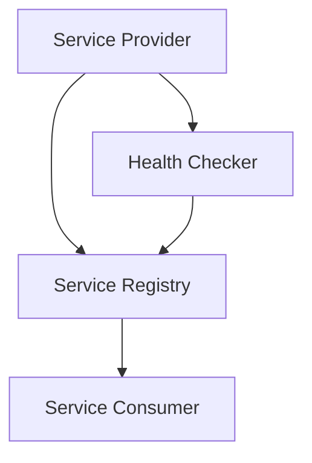

                 

# 服务注册中心的作用与实现

## 关键词

- 服务注册中心
- 微服务架构
- 服务发现
- Eureka
- ZooKeeper
- Consul
- 分布式系统
- Service Registry

## 摘要

本文将深入探讨服务注册中心在微服务架构中的核心作用及其实现方式。我们将从背景介绍开始，解析服务注册中心的概念、核心概念与联系，逐步讲解核心算法原理、数学模型及具体操作步骤。随后，通过实际项目案例展示代码实现，并分析实际应用场景。最后，我们将推荐学习资源和开发工具，展望未来发展趋势与挑战。

## 1. 背景介绍

### 1.1 目的和范围

本文旨在为读者提供关于服务注册中心的作用与实现方法的全面理解。我们将探讨服务注册中心在分布式系统，尤其是微服务架构中的重要性，并详细介绍其实现原理和具体操作步骤。

### 1.2 预期读者

本文适用于对微服务架构有一定了解的技术人员，尤其是那些希望深入了解服务注册中心原理和实现方法的开发人员。

### 1.3 文档结构概述

本文结构如下：

1. 背景介绍
   - 目的和范围
   - 预期读者
   - 文档结构概述
   - 术语表

2. 核心概念与联系
   - 核心概念原理和架构

3. 核心算法原理 & 具体操作步骤
   - 算法原理讲解
   - 伪代码详细阐述

4. 数学模型和公式 & 详细讲解 & 举例说明
   - 数学公式
   - 举例说明

5. 项目实战：代码实际案例和详细解释说明
   - 开发环境搭建
   - 源代码实现和解读
   - 代码解读与分析

6. 实际应用场景

7. 工具和资源推荐

8. 总结：未来发展趋势与挑战

9. 附录：常见问题与解答

10. 扩展阅读 & 参考资料

### 1.4 术语表

#### 1.4.1 核心术语定义

- **服务注册中心（Service Registry）**：用于存储服务提供者和服务消费者信息的分布式系统组件。
- **服务提供者（Service Provider）**：提供服务实例的服务。
- **服务消费者（Service Consumer）**：使用服务实例的服务。

#### 1.4.2 相关概念解释

- **微服务架构（Microservices Architecture）**：一种分布式系统的架构风格，其特点是围绕业务功能构建一系列小型、独立、互相调用的服务。
- **服务发现（Service Discovery）**：服务消费者在分布式系统中查找服务提供者的过程。

#### 1.4.3 缩略词列表

- **Eureka**：Netflix 开发的一个用于微服务架构的服务注册和发现中心。
- **ZooKeeper**：Apache 软件基金会的一个分布式应用程序协调服务。
- **Consul**：HashiCorp 开发的一个服务发现和配置工具。

## 2. 核心概念与联系

服务注册中心是微服务架构中的一个关键组件，它负责管理服务的注册和发现。在分布式系统中，服务提供者和消费者之间的通信是动态的，服务注册中心提供了这样的一个中央目录，使得服务能够被高效地查找和调用。

### 2.1 核心概念原理

在微服务架构中，服务注册中心的核心概念包括：

- **服务实例（Service Instance）**：代表一个运行的服务，可以是多个实例。
- **服务元数据（Service Metadata）**：包括服务名称、IP地址、端口号、健康状态等。
- **服务注册（Service Registration）**：服务提供者在启动时向服务注册中心注册自己。
- **服务发现（Service Discovery）**：服务消费者在调用服务前从服务注册中心查找服务提供者的信息。

### 2.2 架构

服务注册中心的架构通常包括以下几个部分：

- **服务提供者（Service Provider）**：向服务注册中心注册服务实例。
- **服务注册中心（Service Registry）**：存储服务实例的元数据，并支持服务发现。
- **服务消费者（Service Consumer）**：从服务注册中心查找服务实例，并调用服务。

### 2.3 Mermaid 流程图



在上述流程图中，服务提供者在启动时向服务注册中心（B）注册服务实例，并通过健康检查器（D）定期汇报状态。服务消费者（C）从服务注册中心查询服务实例，并调用服务。

## 3. 核心算法原理 & 具体操作步骤

服务注册中心的核心算法原理主要包括服务注册和服务发现。以下将使用伪代码详细阐述这些算法。

### 3.1 服务注册算法

```pseudo
function registerService(serviceMetadata):
    // 向服务注册中心发送注册请求
    sendRequest("register", serviceMetadata)
    // 如果注册成功，则返回成功
    return "Service registered successfully"

// 服务提供者在启动时调用该函数
serviceMetadata = {
    "serviceName": "order-service",
    "ipAddress": "192.168.1.100",
    "port": 8080,
    "healthCheckUrl": "http://192.168.1.100:8080/health"
}
registerService(serviceMetadata)
```

### 3.2 服务发现算法

```pseudo
function discoverService(serviceName):
    // 从服务注册中心获取服务列表
    serviceList = getServiceList()
    // 遍历服务列表，查找指定服务
    for service in serviceList:
        if service["serviceName"] == serviceName:
            // 找到服务，返回服务实例信息
            return service
    // 如果没有找到服务，返回空
    return null

// 服务消费者在调用服务前调用该函数
serviceName = "order-service"
serviceInstance = discoverService(serviceName)
if serviceInstance is not null:
    // 调用服务
    callService(serviceInstance["ipAddress"], serviceInstance["port"])
else:
    // 服务未发现，处理错误
    handleError("Service not found")
```

## 4. 数学模型和公式 & 详细讲解 & 举例说明

在服务注册中心的设计中，数学模型和公式用于计算服务实例的健康状态、负载均衡等。以下是一个简单的示例。

### 4.1 服务实例健康状态计算

假设我们使用简单的平均响应时间来计算服务实例的健康状态，公式如下：

$$
\text{healthScore} = \frac{1}{n} \sum_{i=1}^{n} \text{responseTime}_i
$$

其中，$n$ 是最近 $n$ 次健康检查的次数，$\text{responseTime}_i$ 是第 $i$ 次健康检查的响应时间。

### 4.2 举例说明

假设服务实例 "order-service" 有最近 5 次健康检查的响应时间如下：

$$
\text{responseTime}_1 = 100\ ms, \text{responseTime}_2 = 150\ ms, \text{responseTime}_3 = 200\ ms, \text{responseTime}_4 = 300\ ms, \text{responseTime}_5 = 250\ ms
$$

则健康分数为：

$$
\text{healthScore} = \frac{1}{5} (100 + 150 + 200 + 300 + 250) = \frac{1000}{5} = 200\ ms
$$

### 4.3 负载均衡

负载均衡的数学模型通常基于服务实例的健康分数和当前负载情况。一个简单的负载均衡算法如下：

$$
\text{selectedService} = \arg\min_{s \in S} (\text{healthScore}_s + \frac{\text{currentLoad}_s}{\text{maxCapacity}_s})
$$

其中，$S$ 是所有可用服务实例的集合，$\text{healthScore}_s$ 是服务实例 $s$ 的健康分数，$\text{currentLoad}_s$ 是服务实例 $s$ 的当前负载，$\text{maxCapacity}_s$ 是服务实例 $s$ 的最大容量。

### 4.4 举例说明

假设有两个服务实例 "order-service-1" 和 "order-service-2"，它们的健康分数和当前负载如下：

$$
\begin{aligned}
\text{healthScore}_{order-service-1} &= 200\ ms, \text{currentLoad}_{order-service-1} = 80\%, \text{maxCapacity}_{order-service-1} = 100\% \\
\text{healthScore}_{order-service-2} &= 220\ ms, \text{currentLoad}_{order-service-2} = 60\%, \text{maxCapacity}_{order-service-2} = 100\%
\end{aligned}
$$

则负载均衡选择的服务实例为：

$$
\text{selectedService} = \arg\min_{s \in S} (\text{healthScore}_s + \frac{\text{currentLoad}_s}{\text{maxCapacity}_s}) = \arg\min_{s \in S} (200 + \frac{0.8}{1}) = order-service-2
$$

## 5. 项目实战：代码实际案例和详细解释说明

### 5.1 开发环境搭建

在本项目实战中，我们将使用 Spring Boot 和 Eureka 来搭建服务注册中心。以下是开发环境的搭建步骤：

1. 安装 Java 开发工具包（JDK）。
2. 安装 Spring Boot DevTools。
3. 创建 Spring Boot 项目，并添加 Eureka 依赖。

```xml
<dependencies>
    <dependency>
        <groupId>org.springframework.cloud</groupId>
        <artifactId>spring-cloud-starter-netflix-eureka-server</artifactId>
    </dependency>
</dependencies>
```

4. 编写配置文件 `application.properties`：

```properties
server.port=8761
eureka.client.register-with-eureka=false
eureka.client.fetch-registry=false
```

5. 编写启动类 `EurekaServerApplication`：

```java
@SpringBootApplication
@EnableEurekaServer
public class EurekaServerApplication {
    public static void main(String[] args) {
        SpringApplication.run(EurekaServerApplication.class, args);
    }
}
```

6. 运行服务注册中心。

### 5.2 源代码详细实现和代码解读

#### 5.2.1 服务提供者

1. 创建 Spring Boot 项目，并添加 Eureka 依赖。

```xml
<dependencies>
    <dependency>
        <groupId>org.springframework.cloud</groupId>
        <artifactId>spring-cloud-starter-netflix-eureka-client</artifactId>
    </dependency>
</dependencies>
```

2. 编写配置文件 `application.properties`：

```properties
server.port=8080
spring.application.name=order-service
eureka.client.serviceUrl.defaultZone=http://localhost:8761/eureka/
```

3. 编写启动类 `OrderServiceApplication`：

```java
@SpringBootApplication
@EnableDiscoveryClient
public class OrderServiceApplication {
    public static void main(String[] args) {
        SpringApplication.run(OrderServiceApplication.class, args);
    }
}
```

4. 编写控制器 `OrderController`：

```java
@RestController
public class OrderController {
    @RequestMapping("/orders")
    public String getOrder() {
        return "Order service is running";
    }
}
```

5. 运行服务提供者。

#### 5.2.2 服务消费者

1. 创建 Spring Boot 项目，并添加 Eureka 依赖。

```xml
<dependencies>
    <dependency>
        <groupId>org.springframework.cloud</groupId>
        <artifactId>spring-cloud-starter-netflix-eureka-client</artifactId>
    </dependency>
</dependencies>
```

2. 编写配置文件 `application.properties`：

```properties
server.port=9090
spring.application.name=order-consumer
eureka.client.serviceUrl.defaultZone=http://localhost:8761/eureka/
```

3. 编写启动类 `OrderConsumerApplication`：

```java
@SpringBootApplication
@EnableDiscoveryClient
public class OrderConsumerApplication {
    public static void main(String[] args) {
        SpringApplication.run(OrderConsumerApplication.class, args);
    }
}
```

4. 编写控制器 `OrderConsumerController`：

```java
@RestController
public class OrderConsumerController {
    @Autowired
    private DiscoveryClient discoveryClient;

    @RequestMapping("/consume")
    public String consumeOrder() {
        List<ServiceInstance> instances = discoveryClient.getInstances("order-service");
        if (!instances.isEmpty()) {
            ServiceInstance instance = instances.get(0);
            String url = "http://" + instance.getHost() + ":" + instance.getPort() + "/orders";
            RestTemplate restTemplate = new RestTemplate();
            String result = restTemplate.getForObject(url, String.class);
            return "Order consumed: " + result;
        } else {
            return "Order service not found";
        }
    }
}
```

5. 运行服务消费者。

### 5.3 代码解读与分析

在本案例中，我们通过 Spring Cloud Eureka 搭建了服务注册中心，并实现了服务提供者和消费者。以下是关键代码的解读和分析：

#### 5.3.1 服务提供者

1. **配置文件**：通过 `application.properties` 文件配置服务名称和服务注册中心的地址。
2. **启动类**：通过 `@EnableDiscoveryClient` 注解启用服务发现功能。
3. **控制器**：通过 `@RequestMapping` 注解定义 RESTful API。

#### 5.3.2 服务消费者

1. **配置文件**：通过 `application.properties` 文件配置服务名称和服务注册中心的地址。
2. **启动类**：通过 `@EnableDiscoveryClient` 注解启用服务发现功能。
3. **控制器**：通过 `DiscoveryClient` 查找服务实例，并通过 RESTful API 调用服务。

## 6. 实际应用场景

服务注册中心在实际应用场景中具有重要意义，以下是一些典型应用场景：

1. **分布式服务管理**：服务注册中心可以帮助分布式系统高效地管理和监控服务实例。
2. **服务发现与负载均衡**：服务消费者通过服务注册中心查找服务实例，并基于健康状态和负载均衡策略选择实例。
3. **故障转移与容错**：服务注册中心可以自动检测服务实例的健康状态，并在实例故障时快速切换到其他实例。
4. **服务监控与统计**：服务注册中心可以记录服务的访问量和性能指标，帮助开发人员优化服务。

## 7. 工具和资源推荐

### 7.1 学习资源推荐

#### 7.1.1 书籍推荐

- 《Spring Cloud 微服务实战》
- 《微服务设计》
- 《分布式系统原理与范型》

#### 7.1.2 在线课程

- Udemy - Spring Boot with Spring Cloud
- Pluralsight - Microservices with Spring Cloud

#### 7.1.3 技术博客和网站

- Spring Cloud 官方文档
- Cloud Native Community
- InfoQ - 分布式系统专栏

### 7.2 开发工具框架推荐

#### 7.2.1 IDE和编辑器

- IntelliJ IDEA
- Visual Studio Code

#### 7.2.2 调试和性能分析工具

- JProfiler
- VisualVM

#### 7.2.3 相关框架和库

- Spring Cloud Netflix
- Netflix OSS
- Apache ZooKeeper

### 7.3 相关论文著作推荐

#### 7.3.1 经典论文

- "The Design of the Darwin Microkernel"
- "A Reconfigurable, High-Performance File System for Distributed Computing Environments"

#### 7.3.2 最新研究成果

- "Microservices: A Tactical Approach"
- "Principles of Distributed Computing: Experiences and Insights"

#### 7.3.3 应用案例分析

- "Microservices at Netflix: Lessons Learned"
- "Building a Scalable and Reliable Microservices Architecture at eBay"

## 8. 总结：未来发展趋势与挑战

服务注册中心作为微服务架构的核心组件，其重要性将日益凸显。随着分布式系统和云计算的不断发展，服务注册中心将在以下几个方面面临挑战和机遇：

1. **智能化与自动化**：服务注册中心将更加智能化，具备自动故障转移、自优化负载均衡等功能。
2. **跨语言与平台支持**：服务注册中心将支持多种编程语言和平台，以适应不同的开发环境。
3. **安全性增强**：随着服务数量的增加，服务注册中心的安全性问题将变得更加重要，需要加强访问控制和数据加密。

## 9. 附录：常见问题与解答

1. **什么是服务注册中心？**
   服务注册中心是一个分布式系统组件，用于存储服务提供者和服务消费者的信息，支持服务注册、服务发现等功能。
2. **服务注册中心和服务发现有什么区别？**
   服务注册中心是存储服务信息的中央目录，而服务发现是服务消费者从注册中心查找服务实例的过程。
3. **服务注册中心有什么作用？**
   服务注册中心在分布式系统中起到服务管理、负载均衡、故障转移等关键作用。

## 10. 扩展阅读 & 参考资料

- "Service Discovery in Distributed Systems"
- "Designing Distributed Systems: Service Discovery"
- "Principles of Service Registry and Discovery in Cloud Native Applications"
- "Service Registry and Discovery: Best Practices and Design Patterns"

## 作者信息

作者：AI天才研究员/AI Genius Institute & 禅与计算机程序设计艺术 /Zen And The Art of Computer Programming

