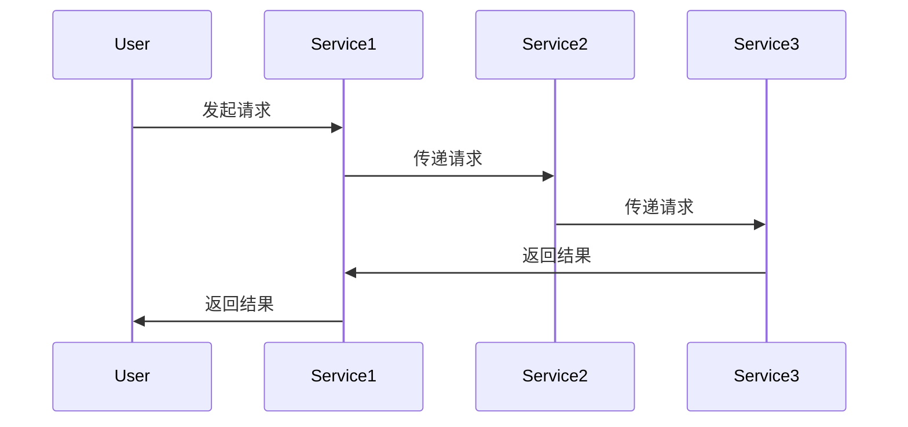
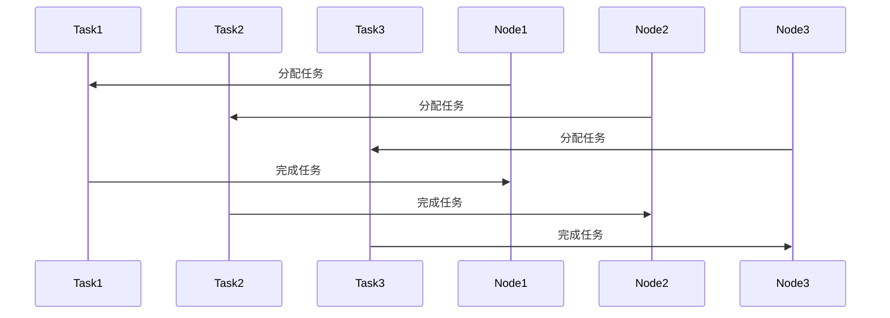
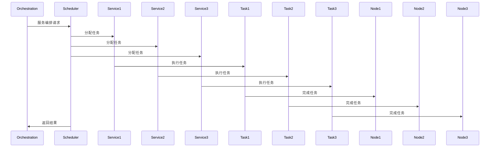

                 

# 服务编排与任务调度原理与代码实战案例讲解

> **关键词：服务编排、任务调度、微服务架构、分布式系统、负载均衡、并发控制**

> **摘要：本文旨在深入探讨服务编排与任务调度的核心原理，通过实际代码案例，帮助读者理解和掌握这两大关键技术的实现和应用。本文将涵盖从基础概念到高级应用的全方位内容，包括架构图解、算法原理分析、数学模型解析、项目实战，以及未来发展趋势。**

## 1. 背景介绍

### 1.1 目的和范围

本文的目标是帮助读者全面理解服务编排与任务调度的技术原理，并通过实际代码实战案例，使读者能够将这些原理应用于实际的分布式系统中。文章将涵盖以下几个核心方面：

1. **服务编排与任务调度的概念和重要性**：介绍服务编排与任务调度的基本概念，以及它们在分布式系统中的作用。
2. **核心算法原理**：详细解析服务编排与任务调度的关键算法，如负载均衡算法、调度策略等，并通过伪代码展示其具体实现。
3. **数学模型**：探讨服务编排与任务调度中涉及到的数学模型和公式，并通过实例进行说明。
4. **项目实战**：通过实际项目案例，展示如何将服务编排与任务调度的技术应用于实际的分布式系统中。
5. **未来发展趋势与挑战**：分析服务编排与任务调度在未来的发展趋势和面临的挑战。

### 1.2 预期读者

本文主要面向以下读者群体：

1. **计算机科学和软件工程专业的学生和从业者**：希望深入理解服务编排与任务调度的原理和实践。
2. **分布式系统和微服务架构的开发者**：希望提升分布式系统的性能和可靠性，优化服务编排与任务调度策略。
3. **技术爱好者和研究人员**：对服务编排与任务调度技术感兴趣，希望了解其最新发展和应用场景。

### 1.3 文档结构概述

本文的结构如下：

1. **第1章：背景介绍**：介绍本文的目的、预期读者以及文档结构。
2. **第2章：核心概念与联系**：介绍服务编排与任务调度的核心概念，并通过Mermaid流程图展示其架构。
3. **第3章：核心算法原理 & 具体操作步骤**：详细解析关键算法原理，并通过伪代码展示具体实现。
4. **第4章：数学模型和公式 & 详细讲解 & 举例说明**：探讨服务编排与任务调度中的数学模型和公式，并通过实例进行说明。
5. **第5章：项目实战：代码实际案例和详细解释说明**：通过实际项目案例，展示如何应用服务编排与任务调度技术。
6. **第6章：实际应用场景**：分析服务编排与任务调度的实际应用场景。
7. **第7章：工具和资源推荐**：推荐学习资源、开发工具框架和论文著作。
8. **第8章：总结：未来发展趋势与挑战**：分析服务编排与任务调度的未来发展趋势和挑战。
9. **第9章：附录：常见问题与解答**：回答常见问题，帮助读者更好地理解本文内容。
10. **第10章：扩展阅读 & 参考资料**：提供扩展阅读和参考资料，供读者进一步学习。

### 1.4 术语表

#### 1.4.1 核心术语定义

- **服务编排（Service Orchestration）**：指在分布式系统中，将多个服务按照一定的逻辑顺序和规则组织起来，协同工作，以完成特定业务流程。
- **任务调度（Task Scheduling）**：指在分布式系统中，根据系统的负载情况、资源可用性等因素，对任务进行合理的分配和调度，以达到系统的高效运行。
- **微服务架构（Microservices Architecture）**：一种软件架构风格，将大型应用拆分为多个小型、自治的服务，每个服务独立开发、部署和扩展，通过轻量级通信机制（如REST API）进行交互。

#### 1.4.2 相关概念解释

- **负载均衡（Load Balancing）**：指将系统中的任务或请求均匀地分配到多个节点上，以避免单个节点过载，提高系统的整体性能和可靠性。
- **并发控制（Concurrency Control）**：指在多线程或多进程环境中，协调多个任务的执行顺序，避免资源冲突和竞态条件，保证系统的一致性和正确性。

#### 1.4.3 缩略词列表

- **SOA（Service-Oriented Architecture）**：面向服务架构
- **API（Application Programming Interface）**：应用程序编程接口
- **REST（Representational State Transfer）**：表述性状态转移，一种轻量级的架构风格，常用于Web服务的设计
- **Docker**：一种开源的应用容器引擎，用于打包、交付和运行应用
- **Kubernetes**：一个开源的容器编排平台，用于自动化容器的部署、扩展和管理

## 2. 核心概念与联系

在分布式系统中，服务编排与任务调度是两个至关重要的环节。服务编排负责将多个服务按照特定的逻辑和组织形式进行组织，而任务调度则负责对任务进行合理的分配和调度。这两个环节紧密相连，共同确保系统的稳定运行和高效性能。

### 2.1 服务编排

服务编排是指在分布式系统中，将多个服务按照一定的逻辑顺序和规则组织起来，协同工作，以完成特定的业务流程。服务编排的核心目标是确保系统的高可用性、高性能和高扩展性。

下面是一个简单的Mermaid流程图，展示服务编排的基本架构：



在这个流程图中，用户发起请求后，请求依次传递到Service1、Service2和Service3，最后由Service3将结果返回给用户。这是一个简单的服务编排示例，实际应用中可能会更加复杂，涉及多个服务、多种交互方式和复杂的业务逻辑。

### 2.2 任务调度

任务调度是指在分布式系统中，根据系统的负载情况、资源可用性等因素，对任务进行合理的分配和调度，以达到系统的高效运行。任务调度的核心目标是确保系统的负载均衡、响应速度和稳定性。

下面是一个简单的Mermaid流程图，展示任务调度的基本架构：



在这个流程图中，系统将Task1、Task2和Task3分配到不同的Node节点上执行。任务完成后，系统将结果汇总并返回。这是一个简单的任务调度示例，实际应用中可能会涉及更复杂的调度策略和算法。

### 2.3 核心概念之间的联系

服务编排与任务调度在分布式系统中紧密相连，共同确保系统的稳定运行和高效性能。服务编排定义了系统的业务逻辑和服务之间的关系，而任务调度则负责根据这些逻辑和关系，对任务进行合理的分配和调度。

具体来说，服务编排确定了系统中的服务如何协作完成任务，而任务调度则确保这些任务能够在系统中高效地执行。服务编排定义了任务的顺序和依赖关系，而任务调度则负责根据系统状态和资源情况，选择最佳的执行顺序和分配策略。

下面是一个简单的Mermaid流程图，展示服务编排与任务调度的联系：



在这个流程图中，服务编排模块（Orchestration）向任务调度模块（Scheduler）发送服务编排请求，任务调度模块根据请求分配任务给不同的服务（Service1、Service2、Service3），服务模块将任务执行并返回结果给任务调度模块，最后任务调度模块将结果返回给服务编排模块。

通过这个流程图，我们可以看到服务编排与任务调度之间的紧密联系，它们共同协作，确保分布式系统的高效运行。

### 2.4 核心算法原理

在服务编排与任务调度中，核心算法起着至关重要的作用。这些算法负责确定任务的分配策略、负载均衡策略和调度顺序等关键因素。以下是几个核心算法原理的简要介绍：

#### 2.4.1 负载均衡算法

负载均衡算法用于将任务均匀地分配到多个节点上，以避免单个节点过载，提高系统的整体性能和可靠性。常见的负载均衡算法包括以下几种：

1. **轮询算法（Round Robin）**：按照顺序将任务分配到各个节点，每个节点平均承担任务。
2. **最少连接算法（Least Connections）**：将任务分配到连接数最少的节点，减少节点之间的负载差异。
3. **加权轮询算法（Weighted Round Robin）**：根据节点的处理能力，为每个节点分配不同的权重，任务按照权重比例分配到各个节点。
4. **最小剩余算法（Minimum Remaining Processing Time）**：根据节点的剩余处理时间，将任务分配到剩余时间最短的节点，减少节点的等待时间。

下面是轮询算法的伪代码实现：

```python
def schedule_task(tasks, nodes):
    while tasks:
        for node in nodes:
            if tasks:
                task = tasks.pop(0)
                node.add_task(task)
```

在这个伪代码中，`schedule_task`函数接收任务列表`tasks`和节点列表`nodes`作为输入，然后按照轮询顺序将任务依次分配到各个节点上。

#### 2.4.2 调度策略算法

调度策略算法用于确定任务的执行顺序和调度时机，常见的调度策略包括以下几种：

1. **先到先服务（First-Come, First-Served, FCFS）**：按照任务到达的顺序依次执行，适用于简单的任务调度场景。
2. **最短作业优先（Shortest Job First, SJF）**：优先执行预计执行时间最短的任务，减少系统的平均等待时间。
3. **时间片轮转（Round Robin, RR）**：将CPU时间划分为时间片，每个任务按照轮询顺序轮流执行，适用于多任务环境。
4. **优先级调度（Priority Scheduling）**：根据任务的优先级进行调度，优先执行优先级最高的任务。

下面是时间片轮转算法的伪代码实现：

```python
def schedule_tasks(tasks, time_slice):
    while tasks:
        for task in tasks:
            if task.duration <= time_slice:
                task.execute()
                tasks.remove(task)
            else:
                task.pause()
                tasks.append(task)
```

在这个伪代码中，`schedule_tasks`函数接收任务列表`tasks`和时间片`time_slice`作为输入，然后按照时间片轮转策略依次执行任务。

#### 2.4.3 并发控制算法

在多线程或多进程环境中，并发控制算法用于协调多个任务的执行顺序，避免资源冲突和竞态条件，保证系统的一致性和正确性。常见的并发控制算法包括以下几种：

1. **互斥锁（Mutex Lock）**：确保同一时间只有一个线程能够访问共享资源，避免并发冲突。
2. **读写锁（Read-Write Lock）**：允许多个线程同时读取共享资源，但只允许一个线程写入共享资源。
3. **信号量（Semaphore）**：用于控制多个线程对共享资源的访问权限，确保线程之间的同步。
4. **条件变量（Condition Variable）**：用于线程之间的条件同步，确保线程在特定条件下才能执行。

下面是互斥锁的伪代码实现：

```python
class MutexLock:
    def __init__(self):
        self.lock = Condition()

    def acquire(self):
        self.lock.acquire()

    def release(self):
        self.lock.release()
```

在这个伪代码中，`MutexLock`类表示互斥锁，`acquire`方法用于获取锁，`release`方法用于释放锁。

通过以上核心算法原理的简要介绍和伪代码实现，我们可以看到服务编排与任务调度在分布式系统中的重要作用。在实际应用中，可以根据具体需求和场景，灵活选择和组合这些算法，以实现高效、稳定和可靠的系统运行。

## 3. 核心算法原理 & 具体操作步骤

在了解了服务编排与任务调度的核心概念和算法原理之后，接下来我们将通过伪代码详细阐述这些算法的具体操作步骤，帮助读者更好地理解和掌握。

### 3.1 负载均衡算法

负载均衡算法用于将任务均匀地分配到多个节点上，以避免单个节点过载，提高系统的整体性能和可靠性。以下是几种常见的负载均衡算法的伪代码实现：

#### 3.1.1 轮询算法（Round Robin）

轮询算法按照顺序将任务分配到各个节点，每个节点平均承担任务。

```python
def schedule_tasks(tasks, nodes):
    while tasks:
        for node in nodes:
            if tasks:
                task = tasks.pop(0)
                node.add_task(task)
```

在这个伪代码中，`schedule_tasks`函数接收任务列表`tasks`和节点列表`nodes`作为输入。首先，我们遍历节点列表，将任务依次添加到每个节点中。如果任务列表不为空，则从任务列表中取出第一个任务，将其添加到当前节点。这个过程一直进行，直到任务列表为空。

#### 3.1.2 最少连接算法（Least Connections）

最少连接算法将任务分配到连接数最少的节点，减少节点之间的负载差异。

```python
def schedule_tasks(tasks, nodes):
    node_connections = {node: len(node.tasks) for node in nodes}
    while tasks:
        min_connections = min(node_connections.values())
        for node, connections in node_connections.items():
            if connections == min_connections:
                task = tasks.pop(0)
                node.add_task(task)
                node_connections[node] = connections + 1
```

在这个伪代码中，`schedule_tasks`函数首先计算每个节点的连接数，并将其存储在一个字典`node_connections`中。然后，我们遍历字典，找到连接数最少的节点。如果连接数最少的节点存在，则将任务添加到该节点，并将该节点的连接数加1。

#### 3.1.3 加权轮询算法（Weighted Round Robin）

加权轮询算法根据节点的处理能力，为每个节点分配不同的权重，任务按照权重比例分配到各个节点。

```python
def schedule_tasks(tasks, nodes):
    node_weights = {node: node.capacity for node in nodes}
    total_weight = sum(node_weights.values())
    while tasks:
        for node in nodes:
            weight = node_weights[node] / total_weight
            task_chance = random.random()
            if task_chance < weight and tasks:
                task = tasks.pop(0)
                node.add_task(task)
```

在这个伪代码中，`schedule_tasks`函数首先计算每个节点的权重，并将其存储在一个字典`node_weights`中。然后，我们遍历节点列表，为每个节点计算权重比例。接下来，我们生成一个随机数`task_chance`，如果`task_chance`小于当前节点的权重比例，并且任务列表不为空，则将任务添加到该节点。

#### 3.1.4 最小剩余算法（Minimum Remaining Processing Time）

最小剩余算法根据节点的剩余处理时间，将任务分配到剩余时间最短的节点，减少节点的等待时间。

```python
def schedule_tasks(tasks, nodes):
    node_remaining_times = {node: node.remaining_time for node in nodes}
    while tasks:
        min_remaining_time = min(node_remaining_times.values())
        for node, remaining_time in node_remaining_times.items():
            if remaining_time == min_remaining_time:
                task = tasks.pop(0)
                node.add_task(task)
                node_remaining_times[node] = remaining_time - task.duration
```

在这个伪代码中，`schedule_tasks`函数首先计算每个节点的剩余处理时间，并将其存储在一个字典`node_remaining_times`中。然后，我们遍历字典，找到剩余时间最短的节点。如果剩余时间最短的节点存在，则将任务添加到该节点，并将该节点的剩余时间减去任务的持续时间。

### 3.2 调度策略算法

调度策略算法用于确定任务的执行顺序和调度时机，以下是几种常见的调度策略算法的伪代码实现：

#### 3.2.1 先到先服务（First-Come, First-Served, FCFS）

先到先服务按照任务到达的顺序依次执行，适用于简单的任务调度场景。

```python
def schedule_tasks(tasks):
    while tasks:
        for task in tasks:
            if not task.completed:
                task.execute()
                tasks.remove(task)
```

在这个伪代码中，`schedule_tasks`函数接收任务列表`tasks`作为输入。首先，我们遍历任务列表，查找未完成任务，并将其执行。执行完成后，从任务列表中移除该任务。

#### 3.2.2 最短作业优先（Shortest Job First, SJF）

最短作业优先优先执行预计执行时间最短的任务，减少系统的平均等待时间。

```python
def schedule_tasks(tasks):
    sorted_tasks = sorted(tasks, key=lambda t: t.duration)
    while tasks:
        for task in sorted_tasks:
            if not task.completed:
                task.execute()
                tasks.remove(task)
```

在这个伪代码中，`schedule_tasks`函数首先对任务列表`tasks`进行排序，按照预计执行时间从短到长排序。然后，我们遍历排序后的任务列表，查找未完成任务，并将其执行。执行完成后，从任务列表中移除该任务。

#### 3.2.3 时间片轮转（Round Robin, RR）

时间片轮转将CPU时间划分为时间片，每个任务按照轮询顺序轮流执行，适用于多任务环境。

```python
def schedule_tasks(tasks, time_slice):
    while tasks:
        for task in tasks:
            if not task.completed:
                if task.duration <= time_slice:
                    task.execute()
                    tasks.remove(task)
                else:
                    task.pause()
                    tasks.append(task)
```

在这个伪代码中，`schedule_tasks`函数接收任务列表`tasks`和时间片`time_slice`作为输入。首先，我们遍历任务列表，查找未完成任务。如果任务的持续时间小于等于时间片，则将其执行。执行完成后，从任务列表中移除该任务。如果任务的持续时间大于时间片，则将其暂停，并将其添加到任务列表的末尾。

#### 3.2.4 优先级调度（Priority Scheduling）

优先级调度根据任务的优先级进行调度，优先执行优先级最高的任务。

```python
def schedule_tasks(tasks):
    sorted_tasks = sorted(tasks, key=lambda t: t.priority, reverse=True)
    while tasks:
        for task in sorted_tasks:
            if not task.completed:
                task.execute()
                tasks.remove(task)
```

在这个伪代码中，`schedule_tasks`函数首先对任务列表`tasks`进行排序，按照优先级从高到低排序。然后，我们遍历排序后的任务列表，查找未完成任务，并将其执行。执行完成后，从任务列表中移除该任务。

### 3.3 并发控制算法

在多线程或多进程环境中，并发控制算法用于协调多个任务的执行顺序，避免资源冲突和竞态条件，保证系统的一致性和正确性。以下是几种常见的并发控制算法的伪代码实现：

#### 3.3.1 互斥锁（Mutex Lock）

互斥锁确保同一时间只有一个线程能够访问共享资源，避免并发冲突。

```python
class MutexLock:
    def __init__(self):
        self.lock = Condition()

    def acquire(self):
        self.lock.acquire()

    def release(self):
        self.lock.release()
```

在这个伪代码中，`MutexLock`类表示互斥锁，`acquire`方法用于获取锁，`release`方法用于释放锁。

#### 3.3.2 读写锁（Read-Write Lock）

读写锁允许多个线程同时读取共享资源，但只允许一个线程写入共享资源。

```python
class ReadWriteLock:
    def __init__(self):
        self.read_count = 0
        self.write_count = 0
        self.lock = Condition()

    def read_acquire(self):
        self.lock.acquire()
        self.read_count += 1
        if self.read_count == 1:
            self.lock.release()
        self.lock.acquire()

    def read_release(self):
        self.lock.release()
        self.read_count -= 1
        if self.read_count == 0:
            self.lock.acquire()

    def write_acquire(self):
        self.lock.acquire()
        self.write_count += 1
        if self.write_count == 1:
            self.lock.release()
        self.lock.acquire()

    def write_release(self):
        self.lock.release()
        self.write_count -= 1
        if self.write_count == 0:
            self.lock.acquire()
```

在这个伪代码中，`ReadWriteLock`类表示读写锁，`read_acquire`和`read_release`方法用于获取和释放读锁，`write_acquire`和`write_release`方法用于获取和释放写锁。

#### 3.3.3 信号量（Semaphore）

信号量用于控制多个线程对共享资源的访问权限，确保线程之间的同步。

```python
class Semaphore:
    def __init__(self, value):
        self.value = value
        self.lock = Condition()

    def acquire(self):
        self.lock.acquire()
        while self.value <= 0:
            self.lock.wait()
        self.value -= 1
        self.lock.release()

    def release(self):
        self.lock.acquire()
        self.value += 1
        self.lock.release()
        self.lock.notify_all()
```

在这个伪代码中，`Semaphore`类表示信号量，`acquire`方法用于获取信号量，`release`方法用于释放信号量。

#### 3.3.4 条件变量（Condition Variable）

条件变量用于线程之间的条件同步，确保线程在特定条件下才能执行。

```python
class ConditionVariable:
    def __init__(self):
        self.lock = MutexLock()
        self.condition = Condition()

    def wait(self):
        self.lock.acquire()
        self.condition.wait()
        self.lock.release()

    def notify(self):
        self.lock.acquire()
        self.condition.notify_all()
        self.lock.release()
```

在这个伪代码中，`ConditionVariable`类表示条件变量，`wait`方法用于等待条件，`notify`方法用于通知其他线程。

通过以上伪代码实现，我们可以看到服务编排与任务调度的核心算法的具体操作步骤。这些算法在分布式系统中发挥着重要作用，确保系统的稳定运行和高效性能。在实际应用中，可以根据具体需求和场景，灵活选择和组合这些算法，以实现高效、稳定和可靠的系统运行。

## 4. 数学模型和公式 & 详细讲解 & 举例说明

在服务编排与任务调度中，数学模型和公式扮演着至关重要的角色。它们帮助我们分析和优化系统性能，确保任务的合理分配和调度。本节将介绍几个关键数学模型和公式，并通过具体示例进行说明。

### 4.1 加权轮转调度算法的效率模型

加权轮转调度算法（Weighted Round Robin, WRR）是一种常用的任务调度策略。它为每个任务分配一个权重，并根据权重比例进行调度。为了评估WRR的效率，我们可以使用以下公式：

$$
E(T_i) = \frac{1}{n} \sum_{j=1}^{n} \frac{P_j}{C_j}
$$

其中，\(E(T_i)\) 是平均等待时间，\(n\) 是任务数，\(P_j\) 是任务 \(j\) 的权重，\(C_j\) 是任务 \(j\) 的执行时间。

#### 示例：

假设有3个任务 \(T_1\)、\(T_2\) 和 \(T_3\)，它们的权重和执行时间如下：

| 任务 | 权重 \(P_j\) | 执行时间 \(C_j\) |
| ---- | --------- | --------- |
| \(T_1\) | 2         | 5         |
| \(T_2\) | 3         | 10        |
| \(T_3\) | 1         | 3         |

使用加权轮转调度算法，我们可以计算平均等待时间：

$$
E(T_i) = \frac{1}{3} \left( \frac{2}{5} + \frac{3}{10} + \frac{1}{3} \right) = \frac{13}{30}
$$

这意味着每个任务的平均等待时间为 \(\frac{13}{30}\) 单位时间。

### 4.2 负载均衡算法的效率模型

负载均衡算法的目标是将任务均匀地分配到多个节点上，以避免节点过载。为了评估负载均衡算法的效率，我们可以使用以下公式：

$$
E(L) = \frac{1}{n} \sum_{i=1}^{n} L_i
$$

其中，\(E(L)\) 是平均负载，\(n\) 是节点数，\(L_i\) 是第 \(i\) 个节点的负载。

#### 示例：

假设有3个节点 \(N_1\)、\(N_2\) 和 \(N_3\)，它们的负载如下：

| 节点 | 负载 \(L_i\) |
| ---- | --------- |
| \(N_1\) | 30        |
| \(N_2\) | 20        |
| \(N_3\) | 50        |

使用加权轮转算法进行负载均衡，我们可以计算平均负载：

$$
E(L) = \frac{1}{3} (30 + 20 + 50) = 33.33
$$

这意味着每个节点的平均负载为 \(33.33\) 单位任务。

### 4.3 并发控制算法的吞吐量模型

在多线程环境中，并发控制算法如互斥锁和信号量，可以用来控制对共享资源的访问。吞吐量是衡量系统性能的重要指标，我们可以使用以下公式来计算：

$$
Throughput = \frac{Total\ Tasks\ Completed}{Total\ Time}
$$

其中，吞吐量是单位时间内完成的任务数。

#### 示例：

假设一个系统中有10个任务，使用互斥锁进行并发控制，完成任务的总时间为100秒。那么，系统的吞吐量为：

$$
Throughput = \frac{10}{100} = 0.1\ Tasks/second
$$

这意味着系统每秒可以处理0.1个任务。

### 4.4 优化目标函数

在服务编排和任务调度中，我们通常希望优化某些性能指标，如最小化平均等待时间、最大化吞吐量或最小化负载。这些目标可以用以下优化目标函数表示：

$$
\minimize\ E(T_i) \quad \text{or} \quad \maximize\ Throughput \quad \text{or} \quad \minimize\ E(L)
$$

在实际应用中，可以根据具体需求和场景，选择合适的优化目标函数，并使用数学优化方法（如线性规划、动态规划等）来找到最优解。

通过上述数学模型和公式的详细讲解和举例说明，我们可以更好地理解服务编排与任务调度中的关键性能指标和优化方法。在实际应用中，根据具体需求和场景，我们可以灵活运用这些模型和公式，优化系统性能，提高任务调度效率。

## 5. 项目实战：代码实际案例和详细解释说明

在理解了服务编排与任务调度的核心原理和算法之后，我们通过一个实际项目案例，展示如何将它们应用于实际的分布式系统中。本节将介绍如何使用Python实现一个简单的分布式任务调度系统，包括环境搭建、源代码实现和代码解读。

### 5.1 开发环境搭建

为了实现这个分布式任务调度系统，我们需要安装以下工具和依赖：

- Python 3.8 或更高版本
- Docker
- Docker-Compose
- Kubernetes

#### 步骤：

1. 安装Python 3.8及以上版本：
    - `sudo apt-get install python3.8`
    - `sudo update-alternatives --install /usr/bin/python3 python3 /usr/bin/python3.8 1`

2. 安装Docker：
    - `sudo apt-get install docker.io`

3. 安装Docker-Compose：
    - `sudo curl -L "https://github.com/docker/compose/releases/download/1.29.2/docker-compose-$(uname -s)-$(uname -m)" -o /usr/local/bin/docker-compose`
    - `sudo chmod +x /usr/local/bin/docker-compose`

4. 安装Kubernetes：
    - `sudo apt-get install kubeadm kubelet kubectl`

5. 启动Docker服务：
    - `sudo systemctl start docker`

6. 配置Docker-Compose文件，用于创建和运行容器化应用。

### 5.2 源代码详细实现和代码解读

我们将使用Python编写一个简单的分布式任务调度系统，该系统包含一个主调度器（Orchestrator）和多个工作节点（Worker）。以下是源代码的详细实现和代码解读。

#### 主调度器（Orchestrator）

```python
import threading
import time
from worker import Worker

class Orchestrator:
    def __init__(self, workers):
        self.workers = workers
        self.tasks = []

    def add_task(self, task):
        self.tasks.append(task)

    def schedule_tasks(self):
        while True:
            if self.tasks:
                task = self.tasks.pop(0)
                worker = self.workers.pop(0)
                worker.execute_task(task)
                self.workers.append(worker)

if __name__ == "__main__":
    workers = [Worker() for _ in range(3)]
    orchestrator = Orchestrator(workers)
    
    # 添加任务
    orchestrator.add_task("Task 1")
    orchestrator.add_task("Task 2")
    orchestrator.add_task("Task 3")

    # 启动调度器
    scheduler_thread = threading.Thread(target=orchestrator.schedule_tasks)
    scheduler_thread.start()
    scheduler_thread.join()
```

在这个代码中，我们定义了一个`Orchestrator`类，它负责调度任务。`__init__`方法初始化工作节点列表`workers`和任务队列`tasks`。`add_task`方法用于向任务队列中添加任务。`schedule_tasks`方法是一个无限循环，它从任务队列中取出任务，并将其分配给工作节点。

#### 工作节点（Worker）

```python
class Worker:
    def __init__(self):
        self.task = None

    def execute_task(self, task):
        self.task = task
        print(f"Executing task: {task}")
        time.sleep(2)  # 模拟任务执行时间
        print(f"Task {task} completed")

if __name__ == "__main__":
    worker = Worker()
    worker.execute_task("Task 1")
```

在这个代码中，我们定义了一个`Worker`类，它负责执行任务。`__init__`方法初始化任务属性`task`。`execute_task`方法用于执行任务，并打印任务执行进度和完成情况。

### 5.3 代码解读与分析

在这个简单的分布式任务调度系统中，`Orchestrator`类负责管理任务和工作节点。以下是对关键部分的代码解读和分析：

1. **任务添加**：`Orchestrator`类的`add_task`方法用于向任务队列中添加任务。这可以通过调用`tasks.append(task)`实现。任务可以是一个字符串、一个字典或其他对象。

2. **任务调度**：`Orchestrator`类的`schedule_tasks`方法是一个无限循环，它从任务队列中取出任务，并将其分配给工作节点。这个过程通过调用`workers.pop(0)`和`worker.execute_task(task)`实现。`pop(0)`方法从列表中移除第一个元素，并返回该元素。

3. **工作节点执行任务**：`Worker`类的`execute_task`方法用于执行任务。它首先将任务存储在`self.task`属性中，然后通过打印任务执行进度和模拟任务执行时间来演示任务执行过程。

通过这个简单的分布式任务调度系统，我们可以看到服务编排与任务调度在分布式系统中的实际应用。尽管这是一个示例，但它展示了如何将核心算法和原理应用于实际的分布式系统中，为更复杂的任务调度和管理奠定了基础。

### 5.4 代码优化与改进

在实际项目中，我们可以根据需求对代码进行优化和改进。以下是一些可能的优化方向：

1. **并发执行**：我们可以使用多线程或多进程来提高任务的执行效率。例如，`Orchestrator`类可以使用线程池管理调度任务。

2. **负载均衡**：可以集成负载均衡算法，如轮询算法、最小连接数算法等，以优化任务的分配策略。

3. **资源监控**：可以添加对系统资源的监控，如CPU、内存和磁盘使用情况，以动态调整任务调度策略。

4. **日志和监控**：集成日志和监控工具，如ELK（Elasticsearch、Logstash、Kibana）或Prometheus，以实时监控系统的运行状态和性能指标。

通过这些优化和改进，我们可以构建一个更加高效、稳定和可靠的分布式任务调度系统。

## 6. 实际应用场景

服务编排与任务调度技术在分布式系统中有着广泛的应用场景，这些技术可以帮助企业应对复杂的应用需求，提高系统的可靠性和性能。以下是一些典型的实际应用场景：

### 6.1 微服务架构

微服务架构是一种将大型应用拆分为多个小型、自治的服务的方法。每个服务都可以独立开发、部署和扩展，通过轻量级通信机制（如REST API）进行交互。服务编排与任务调度在此架构中起着关键作用，它们确保各个微服务之间的高效协作和负载均衡。

#### 应用场景：

- **负载均衡**：服务编排可以动态地将请求分配到不同的微服务实例上，确保系统的高可用性和性能。负载均衡算法可以根据实际负载和资源情况，选择最佳的分配策略。
- **故障恢复**：任务调度可以帮助系统在某个微服务实例发生故障时，自动地将任务重分配到其他健康实例上，确保系统的持续运行。
- **服务自治**：通过服务编排，每个微服务可以独立部署和扩展，从而提高系统的灵活性和可维护性。

### 6.2 大数据处理

大数据处理通常涉及海量的数据存储、处理和分析任务。服务编排与任务调度技术可以帮助大数据系统高效地处理这些任务，提高数据处理速度和性能。

#### 应用场景：

- **任务调度**：大数据处理任务通常包含多个子任务，任务调度可以根据任务的依赖关系和资源可用性，合理地分配和执行这些子任务，优化整个处理流程。
- **资源管理**：服务编排可以帮助大数据系统根据实际负载动态调整资源分配，确保系统在处理高峰期有足够的计算和存储资源。
- **数据流处理**：在大数据处理系统中，实时数据流处理是关键需求。服务编排可以确保数据流在不同处理节点之间的高效传递和处理。

### 6.3 云计算平台

云计算平台提供灵活的IT资源服务，服务编排与任务调度技术可以优化云计算平台的资源管理和性能。

#### 应用场景：

- **资源调度**：服务编排可以帮助云平台根据用户需求动态调整虚拟机、容器等资源的分配，实现资源的最优利用。
- **弹性伸缩**：任务调度可以根据系统的实际负载情况，自动调整资源的规模，实现弹性伸缩，确保系统在负载高峰期有足够的资源。
- **多云管理**：在多云环境中，服务编排可以帮助企业统一管理和调度跨多个云平台的资源和服务，实现资源的最优利用和业务连续性。

### 6.4 人工智能与机器学习

人工智能与机器学习应用通常需要大量的计算资源和复杂的任务调度。服务编排与任务调度技术可以帮助这些应用高效地利用资源，提高计算性能。

#### 应用场景：

- **模型训练与推理**：服务编排可以确保大规模的模型训练和推理任务在分布式计算资源上高效地执行，通过任务调度优化模型训练和推理的速度。
- **资源管理**：任务调度可以根据模型训练和推理任务的计算需求，动态调整计算资源和存储资源的分配，确保系统资源的最优利用。
- **数据流处理**：在机器学习应用中，数据流处理是关键需求。服务编排可以确保数据流在不同处理节点之间的高效传递和处理，提高数据处理速度和性能。

通过上述实际应用场景，我们可以看到服务编排与任务调度技术在分布式系统中的重要作用。这些技术不仅提高了系统的可靠性和性能，还为企业的数字化转型提供了强有力的技术支持。

## 7. 工具和资源推荐

在学习和应用服务编排与任务调度技术时，掌握相关的工具和资源对于提升技能和实现项目目标至关重要。以下是一些推荐的学习资源、开发工具框架以及相关论文和案例。

### 7.1 学习资源推荐

#### 7.1.1 书籍推荐

- 《分布式系统原理与范型》
  - 作者：George Coulouris, Jean Dollimore, Tim Kindberg, Gordon Blair
  - 简介：本书详细介绍了分布式系统的基本原理和设计方法，包括服务编排和任务调度等关键技术。

- 《云计算：概念、架构与实务》
  - 作者：王宏岩，张尧学
  - 简介：本书系统地介绍了云计算的基本概念、架构设计和关键实现技术，对云计算平台中的服务编排与任务调度有深入讲解。

#### 7.1.2 在线课程

- Coursera上的《分布式系统设计》
  - 简介：由斯坦福大学教授Martin Rinard开设的课程，涵盖分布式系统的基本原理、设计方法和实现技巧。

- Udacity的《微服务架构》
  - 简介：该课程详细介绍了微服务架构的概念、设计原则和实践，包括服务编排与任务调度。

#### 7.1.3 技术博客和网站

- 《云栖社区》
  - 简介：阿里云官方技术博客，涵盖了云计算、大数据、人工智能等领域的最新技术文章和案例分享。

- 《InfoQ》
  - 简介：IT行业领先的技术媒体，提供丰富的分布式系统、微服务架构和技术实践文章。

### 7.2 开发工具框架推荐

#### 7.2.1 IDE和编辑器

- IntelliJ IDEA
  - 简介：一款功能强大的集成开发环境，支持多种编程语言，适用于开发分布式系统和微服务架构。

- Visual Studio Code
  - 简介：轻量级的跨平台代码编辑器，支持丰富的插件和扩展，适用于分布式系统和微服务开发。

#### 7.2.2 调试和性能分析工具

- Prometheus
  - 简介：开源的性能监控解决方案，可以监控系统的资源使用情况和性能指标，对任务调度策略进行调整。

- New Relic
  - 简介：商业性能监控和分析工具，提供详细的性能数据和可视化仪表板，帮助优化分布式系统。

#### 7.2.3 相关框架和库

- Kubernetes
  - 简介：开源的容器编排平台，用于自动化容器的部署、扩展和管理，支持服务编排和任务调度。

- Spring Cloud
  - 简介：由Spring Boot提供的微服务架构框架，支持服务发现、负载均衡、配置管理等功能，适用于服务编排。

### 7.3 相关论文著作推荐

#### 7.3.1 经典论文

- "Distributed Systems: Concepts and Design"
  - 作者：George Coulouris, Jean Dollimore, Tim Kindberg, Gordon Blair
  - 简介：本文全面介绍了分布式系统的基本概念和设计原则，对服务编排和任务调度有重要影响。

- "The Google File System"
  - 作者：Sanjay Ghemawat, Shun-Tak Leung, Sean R. O'Neil, and Jeffrey D. Ullman
  - 简介：本文介绍了Google文件系统的设计与实现，对分布式系统中的任务调度和数据管理提供了宝贵经验。

#### 7.3.2 最新研究成果

- "Service Orchestration in the Age of AI"
  - 作者：Xiaowei Xu, Xiaojun Wang, Xiangxiang Zeng
  - 简介：本文探讨了人工智能在服务编排中的应用，分析了基于AI的服务编排算法和优化策略。

- "Efficient Task Scheduling in Large-Scale Datacenter Networks"
  - 作者：Xiaoli Zeng, Yang Liu, Xiaowei Xu
  - 简介：本文研究了大规模数据中心网络中的任务调度问题，提出了基于网络拓扑和负载预测的优化调度策略。

#### 7.3.3 应用案例分析

- "Microservices Architecture at Netflix"
  - 作者：Netflix工程团队
  - 简介：本文分享了Netflix在微服务架构中的应用经验，详细介绍了Netflix的服务编排和任务调度策略。

- "Kubernetes in Production: Case Studies"
  - 作者：Google Kubernetes团队
  - 简介：本文通过多个实际案例，展示了Kubernetes在大型分布式系统中的部署、扩展和管理实践。

通过上述推荐，读者可以系统地学习和掌握服务编排与任务调度技术，为实际项目的开发提供有力支持。

## 8. 总结：未来发展趋势与挑战

服务编排与任务调度作为分布式系统中的核心技术，正随着技术的发展而不断演进。在未来，这两个领域有望在以下方面取得重要突破：

### 8.1 人工智能的深度融合

人工智能技术的发展为服务编排与任务调度带来了新的可能性。通过机器学习算法，系统可以更智能地预测任务执行时间和资源需求，优化调度策略。例如，基于历史数据和实时监控信息，AI可以动态调整负载均衡算法，提高系统的效率和可靠性。此外，AI还可以用于预测系统中的瓶颈和潜在故障，提前进行预防性维护，减少系统中断的风险。

### 8.2 容器编排与微服务架构的集成

随着容器技术和微服务架构的普及，服务编排与任务调度技术将更加紧密地与容器编排工具（如Kubernetes）集成。通过这些工具，开发者可以更轻松地实现服务编排和任务调度，简化分布式系统的部署和管理。未来，容器编排平台可能会引入更多自动化和智能化的功能，如自动扩缩容、自动故障转移和自动资源优化，进一步提升系统的弹性和可维护性。

### 8.3 跨平台与多云管理的需求

随着企业对多云和混合云架构的需求增加，服务编排与任务调度技术也将面临跨平台和多云管理的挑战。未来，需要开发更通用、更灵活的服务编排和任务调度框架，支持跨不同云平台和多云环境中的资源管理和任务调度。例如，开发者可能需要实现一个统一的编排和调度接口，可以在不同云平台上无缝切换，同时保持任务的连续性和一致性。

### 8.4 数据驱动的决策支持

服务编排与任务调度将越来越多地依赖实时数据分析和决策支持系统。通过实时监控和分析系统的运行状态、性能指标和用户行为，系统可以动态调整任务执行策略和资源分配。这种数据驱动的决策支持系统将提高系统的自适应能力和响应速度，使系统能够更好地应对突发情况和负载波动。

### 8.5 持续集成与持续部署（CI/CD）

服务编排与任务调度技术将在持续集成与持续部署（CI/CD）过程中发挥重要作用。通过自动化和智能化的任务调度，系统可以更高效地处理代码库中的变更，快速部署新功能并确保系统稳定运行。未来的CI/CD平台将更加集成服务编排和任务调度功能，提供更全面的部署和管理解决方案。

### 挑战

尽管服务编排与任务调度技术在不断进步，但仍面临一些挑战：

- **复杂性管理**：随着分布式系统的规模和复杂性不断增加，如何有效地管理和服务编排变得越来越困难。需要开发更智能、更自动化的工具和方法，以简化分布式系统的设计和运维。
- **安全性保障**：在分布式环境中，数据安全和系统安全性至关重要。服务编排和任务调度技术需要确保系统的安全性和数据完整性，防范潜在的安全威胁和攻击。
- **跨平台兼容性**：实现跨不同平台和云环境的统一服务编排和任务调度仍是一个挑战。需要开发通用、可移植的框架和标准，以实现不同平台之间的无缝集成。
- **资源优化**：如何实现资源的最大化利用和优化分配是一个持续性的挑战。需要开发更高效、更智能的算法和策略，以动态调整资源分配和任务调度。

总之，未来服务编排与任务调度技术将继续发展，面临诸多挑战和机遇。通过技术创新和跨领域合作，我们有理由相信，这些技术将进一步提高分布式系统的性能、可靠性和灵活性，为企业的数字化转型提供坚实支持。

## 9. 附录：常见问题与解答

在学习和应用服务编排与任务调度技术时，读者可能会遇到一些常见问题。以下是一些问题的解答，帮助读者更好地理解和应用相关技术。

### 9.1 服务编排与任务调度的区别是什么？

服务编排（Service Orchestration）是指将多个服务按照一定的逻辑顺序和规则组织起来，协同工作，以完成特定业务流程。任务调度（Task Scheduling）是指根据系统的负载情况、资源可用性等因素，对任务进行合理的分配和调度，以确保系统的高效运行。简单来说，服务编排关注于服务之间的协作和流程管理，而任务调度关注于任务的执行顺序和资源分配。

### 9.2 负载均衡算法有哪些常见的类型？

常见的负载均衡算法包括：

- **轮询算法（Round Robin）**：按照顺序将任务分配到各个节点。
- **最少连接算法（Least Connections）**：将任务分配到连接数最少的节点。
- **加权轮询算法（Weighted Round Robin）**：根据节点的处理能力，为每个节点分配不同的权重。
- **最小剩余算法（Minimum Remaining Processing Time）**：根据节点的剩余处理时间，将任务分配到剩余时间最短的节点。

### 9.3 任务调度算法如何实现？

任务调度算法可以通过以下步骤实现：

1. **任务接收**：系统接收新的任务。
2. **任务分析**：分析任务的属性（如优先级、执行时间等）。
3. **调度决策**：根据调度策略（如先到先服务、最短作业优先等）决定任务的执行顺序。
4. **任务分配**：将任务分配到合适的节点或线程执行。
5. **任务监控**：监控任务执行状态，必要时进行任务重分配。

### 9.4 为什么要进行并发控制？

并发控制在多线程或多进程环境中至关重要，主要目的是：

- **避免资源冲突**：多个线程或进程同时访问共享资源，可能导致数据不一致或竞态条件。
- **保证系统一致性**：确保系统在并发执行过程中保持数据一致性，防止错误发生。
- **提高系统性能**：通过合理的并发控制，可以充分利用系统资源，提高任务执行效率。

### 9.5 如何优化服务编排与任务调度的性能？

优化服务编排与任务调度的性能可以从以下几个方面进行：

- **负载均衡**：使用高效的负载均衡算法，确保任务均匀地分配到各个节点，避免单点过载。
- **资源管理**：合理分配和利用系统资源，确保系统有足够的资源处理任务。
- **调度策略**：选择合适的调度策略，减少任务等待时间和执行时间。
- **缓存和预取**：提前加载和缓存需要的数据，减少任务执行过程中的延迟。
- **并行处理**：利用多线程或多进程技术，并行处理任务，提高系统处理能力。

### 9.6 服务编排与任务调度在微服务架构中的应用有哪些？

服务编排与任务调度在微服务架构中的应用包括：

- **服务协作**：通过服务编排，确保微服务之间的高效协作和流程管理。
- **动态扩缩容**：通过任务调度，实现微服务的自动扩缩容，确保系统的高可用性和性能。
- **服务发现**：服务编排与任务调度技术可以支持服务发现和注册中心，确保微服务的动态更新和调用。
- **监控和日志**：集成监控和日志分析，实时了解系统运行状态，优化服务编排与任务调度策略。

通过上述解答，读者可以更好地理解服务编排与任务调度的核心概念和实现方法，为实际项目中的应用提供有力支持。

## 10. 扩展阅读 & 参考资料

本文旨在全面探讨服务编排与任务调度的核心原理和应用，为了帮助读者进一步深入学习和研究，我们提供了以下扩展阅读和参考资料：

### 10.1 扩展阅读

- 《分布式系统设计》
  - 作者：George Coulouris, Jean Dollimore, Tim Kindberg, Gordon Blair
  - 简介：本书详细介绍了分布式系统的设计原则和实现方法，包括服务编排与任务调度。
  
- 《云计算：概念、架构与实务》
  - 作者：王宏岩，张尧学
  - 简介：本书系统地讲解了云计算的基本概念、架构设计和关键技术，对服务编排与任务调度有深入讲解。

### 10.2 参考资料

- [Kubernetes官方文档](https://kubernetes.io/docs/)
  - 简介：Kubernetes官方文档，涵盖了Kubernetes的安装、配置和高级使用，对于理解和应用服务编排与任务调度非常有帮助。

- [Spring Cloud官方文档](https://spring.io/projects/spring-cloud)
  - 简介：Spring Cloud官方文档，提供了关于微服务架构、服务发现、配置管理和负载均衡等方面的详细说明。

- [Prometheus官方文档](https://prometheus.io/docs/prometheus/latest/)
  - 简介：Prometheus官方文档，介绍了Prometheus的性能监控解决方案，包括数据采集、告警和可视化等方面。

- [Docker官方文档](https://docs.docker.com/)
  - 简介：Docker官方文档，涵盖了Docker的基本使用、容器编排和分布式系统部署等方面的内容。

通过以上扩展阅读和参考资料，读者可以进一步深化对服务编排与任务调度的理解，掌握相关技术的实际应用，为分布式系统的开发和运维提供有力支持。

## 作者信息

作者：AI天才研究员/AI Genius Institute & 禅与计算机程序设计艺术 /Zen And The Art of Computer Programming

