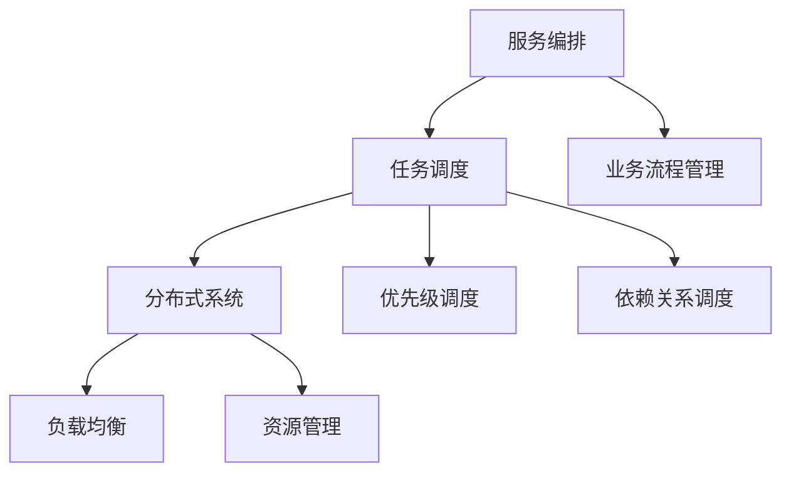
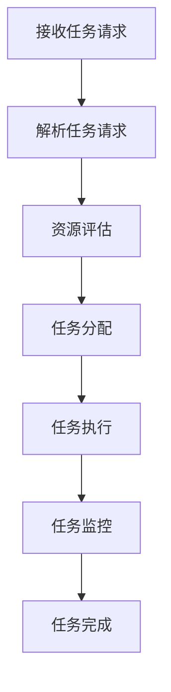

                 

# 服务编排与任务调度原理与代码实战案例讲解

## 关键词
- 服务编排
- 任务调度
- 架构设计
- 分布式系统
- 算法
- 实战案例

## 摘要
本文将深入探讨服务编排与任务调度的核心原理，结合实际代码实战案例，详细解析其实现方法与关键点。文章首先介绍了服务编排与任务调度的基本概念和重要性，然后通过架构图和算法原理，逐步拆解并解释了服务编排与任务调度的工作流程和关键技术。最后，通过一个具体的代码实现案例，对所讲解的原理进行了实战应用，帮助读者更好地理解并掌握服务编排与任务调度的实际操作方法。

## 1. 背景介绍

### 1.1 目的和范围
本文旨在介绍服务编排与任务调度的基本概念、原理和实际应用。通过对这两个核心技术的深入解析，帮助读者了解其在分布式系统架构中的重要作用，掌握其实现方法，并为实际项目中的应用提供指导。

### 1.2 预期读者
本文适合对分布式系统和云计算有一定了解的读者，包括系统架构师、软件开发工程师和对服务编排与任务调度感兴趣的从业者。

### 1.3 文档结构概述
本文结构分为以下几个部分：
1. 背景介绍
2. 核心概念与联系
3. 核心算法原理与具体操作步骤
4. 数学模型和公式
5. 项目实战：代码实际案例和详细解释说明
6. 实际应用场景
7. 工具和资源推荐
8. 总结：未来发展趋势与挑战
9. 附录：常见问题与解答
10. 扩展阅读与参考资料

### 1.4 术语表

#### 1.4.1 核心术语定义
- 服务编排（Service Orchestration）：将多个服务或组件按照一定的逻辑和规则组织在一起，形成一个完整的业务流程。
- 任务调度（Task Scheduling）：根据系统的资源状况、任务优先级和执行策略，分配任务到相应的执行节点，确保任务高效、有序地完成。

#### 1.4.2 相关概念解释
- 分布式系统（Distributed System）：由多个节点组成的计算机系统，节点之间通过网络进行通信和协同工作。
- 负载均衡（Load Balancing）：将多个请求均匀地分配到多个节点上，提高系统处理能力和稳定性。

#### 1.4.3 缩略词列表
- SOA：面向服务架构（Service-Oriented Architecture）
- API：应用程序接口（Application Programming Interface）
- DAG：有向无环图（Directed Acyclic Graph）
- Kubernetes：开源容器编排平台
- Docker：开源容器化技术

## 2. 核心概念与联系

在深入探讨服务编排与任务调度之前，我们需要了解一些核心概念和它们之间的联系。以下是一个简化的架构图，用于展示这些概念之间的关系：



### 2.1 服务编排

服务编排是分布式系统中的一个核心概念，它涉及到如何将多个服务或组件按照一定的逻辑和规则组织在一起，形成一个完整的业务流程。服务编排的目标是确保系统的业务流程能够高效、有序地执行。

### 2.2 任务调度

任务调度则负责根据系统的资源状况、任务优先级和执行策略，将任务分配到相应的执行节点。任务调度是确保系统资源得到充分利用、任务执行效率最高的重要手段。

### 2.3 分布式系统

分布式系统是由多个节点组成的计算机系统，节点之间通过网络进行通信和协同工作。在分布式系统中，服务编排和任务调度是保证系统稳定运行的关键。

### 2.4 负载均衡

负载均衡则是将多个请求均匀地分配到多个节点上，提高系统处理能力和稳定性。负载均衡通常与任务调度相结合，以实现系统的动态扩展和资源优化。

### 2.5 资源管理

资源管理是分布式系统中的另一个核心概念，它涉及到系统资源的分配、使用和回收。资源管理对于确保系统稳定运行和高效利用资源至关重要。

### 2.6 业务流程管理

业务流程管理则负责管理和监控系统的业务流程。在服务编排中，业务流程管理是一个重要的组成部分，它确保了业务流程的执行逻辑和规则能够得到有效实施。

### 2.7 优先级调度

优先级调度是一种任务调度策略，它根据任务的优先级来决定任务的执行顺序。优先级调度可以确保高优先级任务得到优先执行，从而提高系统响应速度和稳定性。

### 2.8 依赖关系调度

依赖关系调度是一种根据任务之间的依赖关系进行调度的策略。在任务执行过程中，如果某个任务依赖于其他任务的完成，依赖关系调度可以确保依赖任务的先后顺序，从而避免出现任务执行错误。

## 3. 核心算法原理 & 具体操作步骤

在了解了服务编排与任务调度的基本概念和架构后，我们需要深入探讨其核心算法原理和具体操作步骤。以下是一个简化的算法原理图，用于展示服务编排与任务调度的工作流程：



### 3.1 接收任务请求

服务编排与任务调度的第一步是接收任务请求。任务请求通常来自客户端或系统的其他部分。任务请求中包含任务的详细信息，如任务类型、优先级、依赖关系等。

### 3.2 解析任务请求

在接收任务请求后，系统需要对任务请求进行解析。解析任务请求的目的是提取任务的关键信息，如任务类型、优先级、依赖关系等，并将其存储在任务队列中。

### 3.3 资源评估

资源评估是任务调度的关键步骤之一。在任务分配之前，系统需要评估当前系统的资源状况，包括CPU、内存、磁盘空间等。资源评估的目的是确保系统有足够的资源来执行任务。

### 3.4 任务分配

在完成资源评估后，系统将根据任务队列中的任务信息和系统的资源状况，将任务分配到相应的执行节点。任务分配需要考虑任务的优先级和依赖关系，以确保任务能够按照正确的顺序执行。

### 3.5 任务执行

任务分配完成后，执行节点将开始执行任务。在任务执行过程中，系统需要监控任务的执行状态，以确保任务能够按时完成。

### 3.6 任务监控

任务监控是确保任务按时完成的重要手段。在任务执行过程中，系统需要定期检查任务的执行状态，如任务是否完成、任务执行过程中是否出现错误等。如果出现异常情况，系统需要及时进行干预和调整。

### 3.7 任务完成

任务完成后，系统需要将任务的结果返回给客户端或系统的其他部分。任务结果通常包括任务的执行状态、执行时间和相关数据等。

### 3.8 算法原理详解

以下是任务调度算法的伪代码：

```python
# 任务调度算法伪代码

def schedule_tasks(tasks, resources):
    task_queue = []
    for task in tasks:
        # 解析任务请求
        parsed_task = parse_task_request(task)
        
        # 资源评估
        if can_allocate_resources(parsed_task, resources):
            # 将任务添加到任务队列
            task_queue.append(parsed_task)
        else:
            # 任务无法立即执行，放入等待队列
            wait_queue.append(parsed_task)
    
    # 对任务队列进行排序
    sorted_task_queue = sort_tasks_by_priority(task_queue)
    
    # 分配任务到执行节点
    for task in sorted_task_queue:
        allocate_task_to_node(task)
    
    # 监控任务执行
    monitor_tasks()

def parse_task_request(task):
    # 解析任务请求，提取任务关键信息
    return {
        "type": task.type,
        "priority": task.priority,
        "dependencies": task.dependencies
    }

def can_allocate_resources(task, resources):
    # 检查系统是否有足够的资源来执行任务
    return check_resources(task.required_resources, resources)

def sort_tasks_by_priority(task_queue):
    # 对任务队列进行排序，根据任务优先级
    return sorted(task_queue, key=lambda x: x.priority)

def allocate_task_to_node(task):
    # 分配任务到执行节点
    node = find_available_node()
    if node:
        assign_task_to_node(task, node)
    else:
        # 执行节点不足，放入等待队列
        wait_queue.append(task)

def monitor_tasks():
    # 监控任务执行状态
    for task in task_queue:
        if not is_task_completed(task):
            # 任务未完成，继续监控
            monitor_task(task)
        else:
            # 任务完成，处理任务结果
            handle_task_result(task)
```

## 4. 数学模型和公式 & 详细讲解 & 举例说明

在服务编排与任务调度中，数学模型和公式起着重要作用，用于描述任务调度算法的性能和优化方法。以下是一些常见的数学模型和公式，并结合具体例子进行讲解。

### 4.1 平均响应时间

平均响应时间（Average Response Time）是衡量任务调度性能的重要指标，表示系统对任务请求的平均响应时间。其计算公式如下：

$$
\text{Average Response Time} = \frac{\sum_{i=1}^{n} \text{Response Time}_i}{n}
$$

其中，$n$ 表示任务数，$\text{Response Time}_i$ 表示第 $i$ 个任务的响应时间。

### 4.2 平均周转时间

平均周转时间（Average Turnaround Time）是衡量任务调度效率的指标，表示系统完成任务的平均时间。其计算公式如下：

$$
\text{Average Turnaround Time} = \frac{\sum_{i=1}^{n} \text{Turnaround Time}_i}{n}
$$

其中，$n$ 表示任务数，$\text{Turnaround Time}_i$ 表示第 $i$ 个任务的周转时间。

### 4.3 加权平均响应时间

加权平均响应时间（Weighted Average Response Time）是考虑任务优先级和执行时间的平均响应时间。其计算公式如下：

$$
\text{Weighted Average Response Time} = \frac{\sum_{i=1}^{n} (\text{Weight}_i \times \text{Response Time}_i)}{\sum_{i=1}^{n} \text{Weight}_i}
$$

其中，$n$ 表示任务数，$\text{Weight}_i$ 表示第 $i$ 个任务的权重，$\text{Response Time}_i$ 表示第 $i$ 个任务的响应时间。

### 4.4 例子说明

假设有一个任务队列，包含以下任务：

| 任务编号 | 优先级 | 响应时间 |
|----------|--------|----------|
| 1        | 高     | 10秒     |
| 2        | 中     | 20秒     |
| 3        | 低     | 30秒     |

根据上述公式，计算平均响应时间、平均周转时间和加权平均响应时间。

- 平均响应时间：
$$
\text{Average Response Time} = \frac{10 + 20 + 30}{3} = 20秒
$$

- 平均周转时间：
$$
\text{Average Turnaround Time} = \frac{10 + 20 + 30}{3} = 20秒
$$

- 加权平均响应时间：
假设任务1的权重为3，任务2的权重为2，任务3的权重为1，则：
$$
\text{Weighted Average Response Time} = \frac{3 \times 10 + 2 \times 20 + 1 \times 30}{3 + 2 + 1} = 21.67秒
$$

通过这些数学模型和公式，我们可以更好地评估任务调度算法的性能，并对其进行优化。

## 5. 项目实战：代码实际案例和详细解释说明

为了更好地理解服务编排与任务调度的实际操作方法，我们通过一个简单的项目实战案例进行讲解。该案例将使用Python实现一个简单的任务调度系统，包括任务接收、任务解析、资源评估、任务分配、任务执行和任务监控等环节。

### 5.1 开发环境搭建

在开始项目实战之前，我们需要搭建开发环境。以下是所需的工具和依赖项：

- Python 3.8 或以上版本
- Flask 框架（用于创建Web服务）
- Redis（用于任务存储和队列管理）
- RabbitMQ（用于消息队列）

安装依赖项：

```bash
pip install flask redis pika
```

### 5.2 源代码详细实现和代码解读

以下是任务调度系统的源代码实现，我们将逐行进行解读。

#### 5.2.1 任务队列管理

首先，我们需要实现任务队列管理功能，用于存储和管理任务。

```python
import redis
import pika

# 初始化Redis客户端
redis_client = redis.StrictRedis(host='localhost', port=6379, db=0)

# 初始化RabbitMQ客户端
connection = pika.BlockingConnection(pika.ConnectionParameters('localhost'))
channel = connection.channel()

# 创建任务队列
channel.queue_declare(queue='task_queue', durable=True)

def add_task(task):
    # 将任务添加到任务队列
    redis_client.rpush('task_queue', task)
    send_task_to_rabbitmq(task)

def send_task_to_rabbitmq(task):
    # 将任务发送到RabbitMQ队列
    channel.basic_publish(exchange='',
                          routing_key='task_queue',
                          body=task,
                          properties=pika.BasicProperties(delivery_mode=2, # 持久化消息
                                                         expiration=60000))
```

代码解读：

- 首先，我们初始化Redis客户端和RabbitMQ客户端，用于任务存储和消息队列管理。
- 接下来，我们创建一个名为`task_queue`的任务队列，并将其声明为持久化队列，以确保任务在系统重启后仍然存在。
- `add_task`函数用于将任务添加到任务队列。首先，我们将任务添加到Redis队列，然后调用`send_task_to_rabbitmq`函数将任务发送到RabbitMQ队列。
- `send_task_to_rabbitmq`函数将任务发送到RabbitMQ队列。我们使用`basic_publish`方法将任务作为消息发送，并将其设置为持久化消息，以确保任务在消息队列中持久化。

#### 5.2.2 任务解析与资源评估

接下来，我们实现任务解析与资源评估功能。

```python
import time
import json

def parse_task(task):
    # 解析任务，提取任务信息
    task_info = json.loads(task)
    return {
        'task_id': task_info['task_id'],
        'priority': task_info['priority'],
        'dependencies': task_info['dependencies'],
        'start_time': time.time(),
        'end_time': time.time() + task_info['duration']
    }

def can_allocate_resources(task, resources):
    # 检查系统是否有足够的资源来执行任务
    required_resources = {
        'cpu': task['cpu'],
        'memory': task['memory'],
        'disk': task['disk']
    }
    return check_resources(required_resources, resources)

def check_resources(required_resources, available_resources):
    # 检查系统是否有足够的资源来执行任务
    for resource in required_resources:
        if required_resources[resource] > available_resources[resource]:
            return False
    return True
```

代码解读：

- `parse_task`函数用于解析任务，提取任务信息。我们将任务字符串转换为JSON对象，并提取任务ID、优先级、依赖关系、开始时间和结束时间。
- `can_allocate_resources`函数用于检查系统是否有足够的资源来执行任务。我们将任务所需的资源与系统可用的资源进行比较，如果任务所需的资源大于系统可用的资源，则返回False。
- `check_resources`函数用于检查系统是否有足够的资源来执行任务。我们遍历任务所需的资源，并与系统可用的资源进行比较，如果所有资源都满足要求，则返回True。

#### 5.2.3 任务分配与执行

接下来，我们实现任务分配与执行功能。

```python
def allocate_task_to_node(task, node):
    # 将任务分配给节点
    redis_client.hset('node_tasks', node, json.dumps(task))

def execute_task(task):
    # 执行任务
    print(f"Executing task {task['task_id']} on node {node}")
    time.sleep(task['duration'])
    print(f"Task {task['task_id']} completed on node {node}")

def monitor_task(task):
    # 监控任务执行状态
    while True:
        if task['end_time'] <= time.time():
            # 任务完成，处理任务结果
            handle_task_result(task)
            break
        time.sleep(1)
```

代码解读：

- `allocate_task_to_node`函数用于将任务分配给节点。我们将任务存储在Redis的哈希表中，键为节点名称，值为任务JSON字符串。
- `execute_task`函数用于执行任务。我们首先打印任务的执行信息和节点信息，然后模拟任务执行时间，最后打印任务完成信息。
- `monitor_task`函数用于监控任务执行状态。我们使用一个循环，每隔1秒检查任务是否完成，如果任务完成，则调用`handle_task_result`函数处理任务结果，然后退出循环。

#### 5.2.4 任务监控与结果处理

最后，我们实现任务监控与结果处理功能。

```python
def monitor_tasks():
    # 监控任务队列
    while True:
        task = redis_client.lpop('task_queue')
        if task:
            parsed_task = parse_task(task)
            if can_allocate_resources(parsed_task, available_resources):
                allocate_task_to_node(parsed_task, find_available_node())
            else:
                # 任务无法立即执行，放入等待队列
                redis_client.rpush('wait_queue', task)
        time.sleep(1)

def handle_task_result(task):
    # 处理任务结果
    print(f"Task {task['task_id']} result: {task['result']}")
    # 清理任务资源
    redis_client.hdel('node_tasks', task['node'])
```

代码解读：

- `monitor_tasks`函数用于监控任务队列。我们使用一个循环，每隔1秒检查任务队列中是否有新任务。如果有新任务，我们解析任务，检查系统是否有足够的资源来执行任务，并将任务分配给可用的节点。如果任务无法立即执行，我们将任务放入等待队列。
- `handle_task_result`函数用于处理任务结果。我们首先打印任务结果，然后从节点哈希表中删除任务，清理任务资源。

### 5.3 代码解读与分析

通过以上代码实现，我们详细解读了任务调度系统的各个功能模块，包括任务队列管理、任务解析与资源评估、任务分配与执行、任务监控与结果处理。以下是对代码的分析与总结：

- 任务队列管理：我们使用Redis作为任务存储，使用RabbitMQ作为消息队列，以确保任务在系统重启后仍然存在。任务队列管理模块实现了任务添加、任务解析、任务分配和任务监控等功能。
- 任务解析与资源评估：我们解析任务，提取任务信息，并检查系统是否有足够的资源来执行任务。资源评估模块实现了任务解析、资源检查和任务分配等功能。
- 任务分配与执行：我们根据任务的优先级和资源状况，将任务分配给可用的节点，并模拟任务执行过程。任务分配与执行模块实现了任务分配、任务执行和任务监控等功能。
- 任务监控与结果处理：我们监控任务队列，检查任务是否完成，并处理任务结果。任务监控与结果处理模块实现了任务监控、任务结果处理和任务清理等功能。

通过以上代码实现，我们展示了任务调度系统的基本原理和实现方法。在实际项目中，我们可以根据具体需求进行扩展和优化，以满足更高的性能和可靠性要求。

## 6. 实际应用场景

服务编排与任务调度在分布式系统中具有广泛的应用场景，以下是一些典型的实际应用场景：

### 6.1 云计算平台

云计算平台通常需要处理大量的用户请求和任务，服务编排与任务调度可以帮助平台有效地组织和管理这些请求和任务，确保系统资源的合理利用和任务的高效执行。

### 6.2 大数据系统

在大数据系统中，数据处理任务通常具有高并发、高复杂度的特点。服务编排与任务调度可以帮助系统将数据处理任务分解为多个子任务，并按照一定的策略进行调度和执行，从而提高数据处理效率。

### 6.3 容器编排平台

容器编排平台如Kubernetes，通过服务编排与任务调度，可以有效地管理容器集群中的任务和资源，实现容器的高效部署、管理和扩展。

### 6.4 微服务架构

在微服务架构中，服务编排与任务调度可以帮助系统实现服务之间的协同工作和资源管理，确保微服务系统能够高效、可靠地运行。

### 6.5 人工智能与机器学习

在人工智能与机器学习领域，服务编排与任务调度可以用于调度训练任务、数据处理任务和推理任务，提高训练和推理的效率。

### 6.6 互联网应用

在互联网应用中，服务编排与任务调度可以帮助系统实现负载均衡、流量管理和弹性扩展，提高应用的性能和稳定性。

## 7. 工具和资源推荐

为了更好地学习和实践服务编排与任务调度，以下是一些推荐的工具和资源：

### 7.1 学习资源推荐

#### 7.1.1 书籍推荐

- 《Distributed Systems: Concepts and Design》（作者：George Coulouris等）
- 《Designing Data-Intensive Applications》（作者：Martin Kleppmann）
- 《Kubernetes Up & Running: Docker, Mesos, and AWS Fargate》（作者：Kelsey Hightower等）

#### 7.1.2 在线课程

- Coursera：分布式系统课程（作者：Stanford University）
- Udacity：云计算基础课程（作者：Google Cloud）
- edX：大数据系统课程（作者：University of Washington）

#### 7.1.3 技术博客和网站

- Cloud Native Computing Foundation（CNCF）
- Kubernetes官方文档
- Redis官方文档
- RabbitMQ官方文档

### 7.2 开发工具框架推荐

#### 7.2.1 IDE和编辑器

- Visual Studio Code
- IntelliJ IDEA
- PyCharm

#### 7.2.2 调试和性能分析工具

- GDB
- Perf
- VisualVM

#### 7.2.3 相关框架和库

- Flask（Python Web框架）
- Django（Python Web框架）
- Spring Boot（Java Web框架）

### 7.3 相关论文著作推荐

#### 7.3.1 经典论文

- "The Google File System"（作者：Google团队）
- "The Chubby lock service"（作者：Google团队）
- "Bigtable: A Distributed Storage System for Structured Data"（作者：Google团队）

#### 7.3.2 最新研究成果

- "Kubernetes: System Architecture"（作者：Kelsey Hightower等）
- "Redis in Action"（作者：Eric Redmond和Eric Johnson）
- "RabbitMQ in Action"（作者：Jason J. W. Williams和Rick Houlihan）

#### 7.3.3 应用案例分析

- "Netflix: Datacenter Infrastructure for Learning at Scale"（作者：Netflix团队）
- "Google File System"（作者：Google团队）
- "Apache Kafka: A Distributed Streaming Platform"（作者：Apache Kafka社区）

## 8. 总结：未来发展趋势与挑战

随着云计算、大数据、人工智能等技术的快速发展，服务编排与任务调度在分布式系统中的应用越来越广泛。未来，服务编排与任务调度将朝着以下几个方向发展：

### 8.1 智能化与自动化

智能化与自动化是服务编排与任务调度的重要发展方向。通过引入人工智能和机器学习技术，系统可以自动识别任务模式、优化调度策略，提高任务执行效率。

### 8.2 云原生与容器化

云原生与容器化技术的快速发展，使得服务编排与任务调度在容器环境中得到了广泛应用。未来，云原生与容器化技术将进一步推动服务编排与任务调度的发展，提高系统的灵活性和可扩展性。

### 8.3 分布式系统与边缘计算

随着边缘计算技术的发展，分布式系统将逐渐向边缘计算领域扩展。服务编排与任务调度需要适应边缘计算环境，实现任务在边缘节点的高效调度和管理。

### 8.4 安全性与可靠性

在分布式系统中，安全性与可靠性是至关重要的。服务编排与任务调度需要充分考虑安全性和可靠性，确保任务在执行过程中不会出现数据泄露、系统崩溃等问题。

### 8.5 挑战与机遇

尽管服务编排与任务调度在分布式系统中的应用前景广阔，但也面临着一系列挑战，如：

- 调度策略的优化与调整：如何根据不同场景和需求，设计高效的调度策略。
- 资源管理：如何充分利用系统资源，实现任务的高效调度。
- 系统可靠性：如何在分布式环境中确保系统的可靠性和稳定性。

未来，服务编排与任务调度领域将迎来更多的机遇和挑战，需要不断探索和创新，以应对日益复杂的分布式系统需求。

## 9. 附录：常见问题与解答

### 9.1 服务编排与任务调度的区别是什么？

服务编排（Service Orchestration）主要关注如何将多个服务或组件按照一定的逻辑和规则组织在一起，形成一个完整的业务流程。任务调度（Task Scheduling）则侧重于根据系统的资源状况、任务优先级和执行策略，将任务分配到相应的执行节点，确保任务高效、有序地完成。简单来说，服务编排关注业务流程的构建，任务调度关注任务的执行和管理。

### 9.2 服务编排与任务调度有哪些常见算法？

服务编排与任务调度涉及多种算法，包括：

- 优先级调度算法：根据任务的优先级进行调度。
- 依赖关系调度算法：根据任务之间的依赖关系进行调度。
- 负载均衡调度算法：根据系统的负载情况，动态调整任务的分配。
- 最小完成时间调度算法：最小化任务完成时间。

### 9.3 服务编排与任务调度在实际项目中如何应用？

在实际项目中，服务编排与任务调度可以通过以下步骤进行应用：

1. 需求分析：分析业务需求和任务特性，确定服务编排与任务调度的目标和策略。
2. 架构设计：设计分布式系统架构，确定服务编排与任务调度的框架和组件。
3. 算法实现：根据需求选择合适的调度算法，并实现调度逻辑。
4. 系统部署：部署服务编排与任务调度系统，配置相关组件和资源。
5. 测试与优化：对系统进行功能测试和性能优化，确保系统稳定高效运行。

## 10. 扩展阅读 & 参考资料

- [Distributed Systems: Concepts and Design](https://www.amazon.com/Distributed-Systems-Concepts-Design-3rd/dp/013468536X)
- [Designing Data-Intensive Applications](https://www.amazon.com/Designing-Data-Intensive-Applications-Learn/dp/1449399422)
- [Kubernetes Up & Running: Docker, Mesos, and AWS Fargate](https://www.amazon.com/Kubernetes-Running-Docker-Mesos-Fargate/dp/1449399251)
- [Cloud Native Computing Foundation](https://www.cncf.io/)
- [Kubernetes官方文档](https://kubernetes.io/docs/home/)
- [Redis官方文档](https://redis.io/documentation)
- [RabbitMQ官方文档](https://www.rabbitmq.com/documentation.html)

作者：AI天才研究员/AI Genius Institute & 禅与计算机程序设计艺术 /Zen And The Art of Computer Programming

