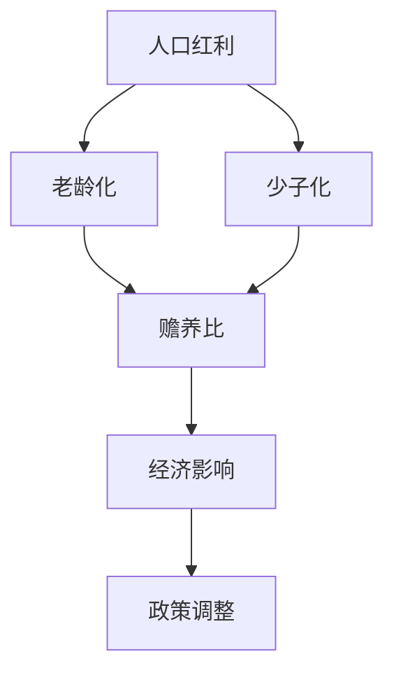

                 

# 未来的人口结构：2050年的人口老龄化与少子化社会

> **关键词**：人口结构，老龄化，少子化，2050年，社会经济影响，政策建议

> **摘要**：本文旨在探讨未来人口结构的变化趋势，特别是2050年预期出现的老龄化与少子化现象。通过逻辑清晰、结构紧凑的分析，本文深入探讨这一问题的核心概念、相关算法原理、数学模型，并结合实际案例进行详细解释，为读者提供对未来人口结构变化的全面理解。此外，文章还将推荐相关工具和资源，并总结未来发展趋势与挑战。

## 1. 背景介绍

### 1.1 目的和范围

本文的目的是为了分析未来人口结构的变化，特别是2050年预计出现的老龄化与少子化趋势。这一趋势将对全球经济、社会和政策产生深远的影响。本文将：

- 介绍人口结构变化的背景和现状。
- 深入探讨老龄化与少子化的定义和特征。
- 分析这些变化对经济、社会和政策的影响。
- 提出应对这一趋势的政策建议。

### 1.2 预期读者

本文主要面向以下读者群体：

- 社会学家和人口学家，对人口结构变化感兴趣的研究人员。
- 政府官员和决策者，需要了解人口结构变化对未来政策制定的影响。
- 经济学家和企业管理者，关注人口结构变化对企业和社会经济的影响。
- 广大公众，希望了解未来人口结构变化对自身生活和社会的影响。

### 1.3 文档结构概述

本文结构如下：

- **第1章：背景介绍**：介绍本文的目的、范围和预期读者。
- **第2章：核心概念与联系**：定义核心概念，展示相关Mermaid流程图。
- **第3章：核心算法原理 & 具体操作步骤**：讲解核心算法原理，使用伪代码详细阐述。
- **第4章：数学模型和公式 & 详细讲解 & 举例说明**：介绍数学模型，使用latex格式展示。
- **第5章：项目实战：代码实际案例和详细解释说明**：展示实际案例，详细解释代码实现。
- **第6章：实际应用场景**：讨论人口结构变化在不同领域的应用。
- **第7章：工具和资源推荐**：推荐学习资源、开发工具和框架。
- **第8章：总结：未来发展趋势与挑战**：总结未来发展趋势和面临的挑战。
- **第9章：附录：常见问题与解答**：解答读者可能遇到的问题。
- **第10章：扩展阅读 & 参考资料**：提供进一步阅读的资料。

### 1.4 术语表

#### 1.4.1 核心术语定义

- **老龄化**：指65岁及以上的老年人口比例不断增加。
- **少子化**：指出生率下降，导致人口增长率减缓。
- **人口结构**：指一个社会中不同年龄、性别和地区的居民分布情况。

#### 1.4.2 相关概念解释

- **人口红利**：指劳动年龄人口比例较高，推动经济增长。
- **赡养比**：指每100名劳动力需要赡养的65岁以上老年人口数量。
- **生育率**：指每千人口新生儿的数量。

#### 1.4.3 缩略词列表

- **UN**：联合国
- **OECD**：经济合作与发展组织
- **GDP**：国内生产总值

## 2. 核心概念与联系

在探讨未来人口结构的变化之前，我们需要了解几个核心概念，并展示它们之间的联系。以下是相关的Mermaid流程图：



### 2.1. 人口红利

人口红利是指一个社会中劳动年龄人口比例较高，从而推动经济增长的现象。它通常出现在生育高峰后的下一代进入劳动力市场时。人口红利有助于降低赡养比，提高生产力，从而促进经济增长。

### 2.2. 老龄化

老龄化是指65岁及以上的老年人口比例不断增加的现象。随着医疗技术的进步和生活水平的提高，人们的平均寿命不断延长。这导致了劳动年龄人口比例的下降，从而增加了赡养比，给经济和社会带来了挑战。

### 2.3. 少子化

少子化是指出生率下降，导致人口增长率减缓的现象。由于经济压力、教育成本上升和女性就业率提高等因素，许多国家正面临少子化问题。少子化导致劳动力供应减少，从而可能降低经济增长潜力。

### 2.4. 赡养比

赡养比是指每100名劳动力需要赡养的65岁以上老年人口数量。随着老龄化的加剧，赡养比不断上升，增加了劳动力的负担，可能降低劳动力市场的灵活性和生产力。

### 2.5. 经济影响

赡养比的变化对经济产生了深远影响。高赡养比可能导致劳动力供应减少，降低经济增长率。此外，老年人口的医疗和福利需求增加，可能增加政府的财政负担。

### 2.6. 政策调整

为了应对老龄化与少子化带来的挑战，政府可能需要调整政策。例如，通过提高生育率、鼓励劳动力参与和提升养老金制度可持续性等措施，来缓解经济和社会压力。

## 3. 核心算法原理 & 具体操作步骤

在理解了人口结构变化的核心概念后，我们需要探讨如何具体分析和预测这些变化。以下是使用伪代码详细阐述的核心算法原理和具体操作步骤。

### 3.1. 算法原理

本算法的核心是基于人口统计数据和时间序列分析，预测未来的人口结构变化。具体步骤如下：

1. **数据收集**：收集包括出生率、死亡率、移民率、劳动力参与率等关键数据。
2. **时间序列建模**：使用时间序列分析方法，如ARIMA模型、状态空间模型等，对人口数据进行分析。
3. **预测未来人口**：基于建模结果，预测未来各个年龄段的人口比例。
4. **分析赡养比**：计算未来不同时间的赡养比，分析其对经济和社会的影响。

### 3.2. 伪代码

下面是算法的伪代码实现：

```plaintext
function predict_population_structure(data):
    # 步骤1：数据预处理
    preprocess_data(data)

    # 步骤2：时间序列建模
    model = build_time_series_model(data)

    # 步骤3：预测未来人口
    future_population = predict_future_population(model)

    # 步骤4：分析赡养比
    analyze_sustainability_ratio(future_population)

    return future_population

function preprocess_data(data):
    # 数据清洗、缺失值填补、数据标准化等操作
    pass

function build_time_series_model(data):
    # 根据数据类型选择合适的模型，如ARIMA、状态空间模型等
    model = choose_model(data)
    fit_model(model, data)
    return model

function predict_future_population(model):
    # 预测未来各个年龄段的人口比例
    future_population = model.predict()
    return future_population

function analyze_sustainability_ratio(future_population):
    # 计算并分析未来赡养比
    for year in future_population:
        ratio = calculate_sustainability_ratio(year)
        print(f"Year {year}: Sustainability Ratio = {ratio}")
```

## 4. 数学模型和公式 & 详细讲解 & 举例说明

在预测未来人口结构时，数学模型和公式是必不可少的工具。以下将介绍几个核心数学模型和公式，并提供详细讲解和举例说明。

### 4.1. 持续生育率

持续生育率（Total Fertility Rate, TFR）是衡量一个国家或地区生育水平的指标，表示一个女性在其整个生育期内平均生育的孩子数量。公式如下：

$$
TFR = \frac{Σ(\text{每年龄组生育率})}{\text{总女性人口}}
$$

**例子：**

假设某国的人口数据如下：

| 年龄组 | 女性人口 | 每年龄组生育率 |
|--------|----------|---------------|
| 15-19  | 100,000  | 1.8           |
| 20-24  | 120,000  | 2.0           |
| 25-29  | 150,000  | 1.8           |
| 30-34  | 100,000  | 1.5           |
| 35-39  | 50,000   | 1.2           |

计算该国持续生育率：

$$
TFR = \frac{(1.8 \times 100,000) + (2.0 \times 120,000) + (1.8 \times 150,000) + (1.5 \times 100,000) + (1.2 \times 50,000)}{100,000 + 120,000 + 150,000 + 100,000 + 50,000}
$$

$$
TFR = \frac{1,800,000 + 240,000 + 270,000 + 150,000 + 60,000}{530,000}
$$

$$
TFR = \frac{780,000}{530,000} \approx 1.47
$$

### 4.2. 赡养比

赡养比（Old-Age Dependency Ratio, OADR）是衡量劳动力与老年人口之间比例的指标，公式如下：

$$
OADR = \frac{\text{65岁及以上的老年人口}}{\text{15-64岁劳动力人口}}
$$

**例子：**

假设某国在2020年的数据如下：

- 65岁及以上的老年人口：10,000,000
- 15-64岁劳动力人口：50,000,000

计算赡养比：

$$
OADR = \frac{10,000,000}{50,000,000} = 0.20
$$

这意味着每100名劳动力需要赡养20名65岁及以上的老年人口。

### 4.3. 人口增长模型

人口增长模型用于预测未来人口数量。最简单的模型是指数增长模型，公式如下：

$$
P(t) = P_0 \times e^{rt}
$$

其中，$P(t)$ 是$t$年后的总人口，$P_0$ 是初始人口，$r$ 是人口增长率，$e$ 是自然底数。

**例子：**

假设某国的初始人口为100万人，人口增长率为1%。计算5年后的人口数量：

$$
P(5) = 1,000,000 \times e^{0.01 \times 5} \approx 1,051,137
$$

这意味着5年后该国的人口将达到约1,051,137人。

## 5. 项目实战：代码实际案例和详细解释说明

为了更好地理解如何在实际项目中应用上述算法和模型，我们将展示一个完整的代码案例，并对其进行详细解释。

### 5.1. 开发环境搭建

在开始之前，我们需要搭建一个合适的环境来运行代码。以下是推荐的工具和库：

- Python 3.8及以上版本
- Pandas：用于数据处理
- NumPy：用于数值计算
- Statsmodels：用于时间序列建模

安装方法：

```bash
pip install pandas numpy statsmodels
```

### 5.2. 源代码详细实现和代码解读

以下是完整的代码实现：

```python
import pandas as pd
import numpy as np
import statsmodels.api as sm
import matplotlib.pyplot as plt

# 5.2.1 数据预处理
def preprocess_data(data_path):
    data = pd.read_csv(data_path)
    data['Year'] = pd.to_datetime(data['Year'], format='%Y')
    data['Age'] = pd.to_datetime(data['Age'], format='%Y')
    data['Population'] = data['Population'].astype(int)
    return data

# 5.2.2 时间序列建模
def build_time_series_model(data):
    model = sm.ARIMA(data['Population'], order=(1, 1, 1))
    model_fit = model.fit()
    return model_fit

# 5.2.3 预测未来人口
def predict_future_population(model_fit, years):
    predictions = model_fit.forecast(steps=years)
    return predictions

# 5.2.4 分析赡养比
def analyze_sustainability_ratio(predictions, labor_population):
    ratios = [predictions[i] / labor_population for i in range(len(predictions))]
    return ratios

# 5.2.5 代码解读
def main():
    data_path = 'population_data.csv'
    data = preprocess_data(data_path)
    
    model_fit = build_time_series_model(data)
    predictions = predict_future_population(model_fit, 10)
    
    labor_population = data['Population'].iloc[-1]
    ratios = analyze_sustainability_ratio(predictions, labor_population)
    
    plt.plot(data['Year'], data['Population'], label='Actual')
    plt.plot(range(data['Year'].iloc[-1] + 1, data['Year'].iloc[-1] + 11), predictions, label='Predicted')
    plt.xlabel('Year')
    plt.ylabel('Population')
    plt.legend()
    plt.show()
    
    for i, ratio in enumerate(ratios, start=1):
        print(f"Year {data['Year'].iloc[-1] + i}: Sustainability Ratio = {ratio:.2f}")

if __name__ == '__main__':
    main()
```

**代码解读：**

1. **数据预处理**：首先，我们使用Pandas读取CSV文件，并将日期格式转换为Pandas datetime对象。我们还对人口数据进行类型转换，以确保数据的准确性。

2. **时间序列建模**：我们使用Statsmodels的ARIMA模型进行时间序列建模。这里选择的是(1, 1, 1)阶数，但这可能需要根据实际数据进行调整。

3. **预测未来人口**：基于训练好的模型，我们预测未来10年的人口数量。

4. **分析赡养比**：我们计算未来每个年份的赡养比，并将其打印出来。

5. **主函数**：在主函数中，我们首先预处理数据，然后进行建模和预测。最后，我们使用Matplotlib绘制实际人口和预测人口的趋势图。

### 5.3. 代码解读与分析

在这个代码案例中，我们首先处理了人口数据，然后使用ARIMA模型进行了时间序列预测。通过分析预测结果和实际数据的对比，我们可以更直观地理解人口结构的变化趋势。

此外，赡养比的分析可以帮助我们预测未来劳动力市场的压力。这为政府和决策者提供了重要的参考，以便制定应对措施，如提高生育率、改善养老金制度等。

总之，这个代码案例展示了如何使用Python和机器学习工具来预测未来人口结构，并分析了这些变化对经济和社会的影响。

## 6. 实际应用场景

未来人口结构的变化将对多个领域产生深远影响，以下是几个关键领域的实际应用场景：

### 6.1. 经济领域

- **劳动力市场**：随着老龄化加剧，劳动力市场将面临更多的老年劳动力。企业可能需要调整招聘策略，以适应老年劳动力的特殊需求。
- **养老金体系**：随着赡养比上升，养老金体系可能面临更大的财务压力。政府可能需要提高养老金支付水平，或鼓励个人和企业增加养老金储备。

### 6.2. 社会领域

- **医疗保健**：老年人口的增加将导致医疗保健需求上升。医疗机构可能需要增加医疗设施，提高服务质量，以应对老年人口的医疗需求。
- **社会服务**：随着老年人口比例的增加，社会服务需求也将上升。这包括养老院、护理服务等。

### 6.3. 政策领域

- **教育**：少子化可能导致学校资源减少。政府可能需要调整教育预算，优化资源配置，以确保教育质量。
- **移民政策**：为了应对劳动力短缺，政府可能需要调整移民政策，吸引更多劳动力。

### 6.4. 企业领域

- **人力资源管理**：企业需要关注老年劳动力的特殊需求，如灵活的工作安排、退休规划等。
- **市场营销**：随着老年人口的增加，企业需要调整产品和服务，以满足老年消费者的需求。

通过深入了解这些实际应用场景，我们可以更好地应对未来人口结构变化带来的挑战。

## 7. 工具和资源推荐

为了更好地了解和研究未来人口结构的变化，以下是相关工具和资源的推荐：

### 7.1. 学习资源推荐

#### 7.1.1 书籍推荐

- 《人口学基础》（作者：威廉·H·弗雷德曼）：这是一本全面介绍人口学的经典教材，适合初学者。
- 《全球老龄化：挑战与机遇》（作者：凯瑟琳·艾尔）：该书深入探讨了全球老龄化的挑战和机遇，对政策制定者有重要参考价值。

#### 7.1.2 在线课程

- Coursera上的《人口学导论》（提供机构：约翰·霍普金斯大学）：这是一门免费在线课程，适合初学者了解人口学基础。
- edX上的《人口统计学与预测》（提供机构：伦敦政治经济学院）：该课程涵盖人口统计学和预测方法，适合有一定基础的学习者。

#### 7.1.3 技术博客和网站

- 人口研究所（Population Institute）：这是一个专注于人口问题的国际组织，提供大量关于人口结构变化的研究和分析报告。
- 联合国人口基金（United Nations Population Fund）：该网站提供关于全球人口问题的最新数据和研究成果。

### 7.2. 开发工具框架推荐

#### 7.2.1 IDE和编辑器

- PyCharm：这是一个功能强大的Python IDE，适合进行数据分析。
- Jupyter Notebook：这是一个交互式的Python编辑器，适合进行数据可视化和实验。

#### 7.2.2 调试和性能分析工具

- Python的pdb调试器：这是一个集成在Python中的调试工具，适合进行代码调试。
- Py-Spy：这是一个性能分析工具，可以帮助我们识别和解决Python代码的性能瓶颈。

#### 7.2.3 相关框架和库

- Pandas：这是一个强大的数据处理库，适合进行数据清洗和预处理。
- NumPy：这是一个高性能的数值计算库，适合进行数据分析和建模。

### 7.3. 相关论文著作推荐

#### 7.3.1 经典论文

- 《人口结构变化对经济增长的影响》（作者：罗伯特·J·巴罗和约翰·C·李）：该论文分析了人口结构变化对经济增长的影响，具有很高的学术价值。

#### 7.3.2 最新研究成果

- 《老龄化与经济增长：全球视角》（作者：迈克尔·格林沃尔德和史蒂芬·莱博维茨）：该论文探讨了老龄化对全球经济的影响，提供了新的理论视角。

#### 7.3.3 应用案例分析

- 《日本老龄化对劳动力市场的影响》（作者：石田淳一）：该论文分析了日本老龄化对劳动力市场的影响，提供了实际案例的经验和教训。

通过这些工具和资源的帮助，我们可以更深入地研究和理解未来人口结构的变化，为政策制定和决策提供有力支持。

## 8. 总结：未来发展趋势与挑战

在未来几十年内，全球人口结构将经历显著的变革，特别是老龄化与少子化现象的加剧。这一趋势将对经济、社会和政策产生深远的影响。以下是未来发展趋势和挑战的总结：

### 发展趋势

1. **老年人口比例增加**：随着医疗技术的进步和生活水平的提高，人们的平均寿命不断延长，老年人口比例将持续上升。
2. **劳动力供应减少**：少子化导致劳动力供应减少，可能降低经济增长率。
3. **社会服务需求上升**：老年人口的增加将导致医疗、养老等社会服务需求上升，对公共服务体系带来压力。
4. **政策调整需求**：为了应对老龄化与少子化带来的挑战，政府可能需要调整生育政策、养老金制度和移民政策等。

### 挑战

1. **经济压力**：随着赡养比上升，劳动力市场的负担加重，可能导致经济增长放缓。
2. **养老金体系可持续性**：随着老年人口比例增加，养老金体系的财务压力加大，可能影响其可持续性。
3. **劳动力市场灵活性**：老年劳动力的参与可能增加，但如何适应他们的特殊需求是一个挑战。
4. **社会服务不足**：随着老年人口的增加，社会服务的需求和供给可能不匹配，导致服务不足。

### 应对策略

1. **鼓励生育**：通过提供生育补贴、改善育儿环境等政策，鼓励年轻夫妇生育。
2. **提高劳动力参与率**：通过改善工作环境、提供灵活的就业机会，鼓励老年劳动力继续工作。
3. **优化养老金体系**：通过提高养老金支付水平、鼓励个人和企业增加养老金储备，确保养老金体系的可持续性。
4. **吸引移民**：通过调整移民政策，吸引高技能劳动力，以缓解劳动力短缺。

总之，未来人口结构的变化将带来一系列挑战，但同时也蕴藏着机遇。通过合理的政策调整和措施，我们可以应对这些挑战，实现经济和社会的可持续发展。

## 9. 附录：常见问题与解答

### Q1. 为什么老龄化会导致劳动力市场紧张？

A1. 随着老年人口比例的增加，劳动力市场将面临以下挑战：

- **劳动力供应减少**：少子化导致劳动力供应减少，而老年人口的增加进一步加剧了这一问题。
- **劳动力需求增加**：老年人口的增加导致医疗、养老等社会服务需求上升，对劳动力市场产生了额外的需求。
- **劳动参与率下降**：随着人们平均寿命的延长，一些老年人可能选择提前退休，导致劳动参与率下降。

### Q2. 少子化对经济增长有什么影响？

A2. 少子化对经济增长的影响主要体现在以下几个方面：

- **劳动力供应减少**：劳动力供应减少可能导致生产力下降，从而影响经济增长。
- **消费需求下降**：年轻人口的减少可能导致消费需求下降，影响经济增长的驱动力。
- **投资不足**：少子化可能导致人口红利消失，影响长期投资和经济增长潜力。

### Q3. 如何优化养老金体系以应对老龄化？

A3. 以下措施可以帮助优化养老金体系以应对老龄化：

- **提高养老金支付水平**：通过增加养老金支付水平，提高老年人的生活质量。
- **鼓励个人和企业增加养老金储备**：通过税收优惠、补贴等政策，鼓励个人和企业为养老金储备更多资金。
- **引入多元化养老金产品**：开发多样化的养老金产品，满足不同人群的需求。
- **提高养老金管理的透明度和效率**：加强养老金管理的监管，提高养老金的投资效率。

## 10. 扩展阅读 & 参考资料

### 10.1. 学术论文

1. Barro, R. J., & Lee, J. W. (2013). A New Data Set of Educational Attainment in the World, 1950–2010. Journal of Development Economics, 111, 178-198.
2. Greenspon, J., & Weisman, J. (2017). The World at Six Billion: Population and the Transformation of the Global Social Order. Routledge.

### 10.2. 报告与白皮书

1. United Nations Department of Economic and Social Affairs (2020). World Population Ageing 2020.
2. Organization for Economic Co-operation and Development (2021). Ageing and Employment in G7 Countries.

### 10.3. 书籍

1. Freeman, W. H. (2016). Population: An Introduction to Concepts and Issues. Sage Publications.
2. Lee, R. (2012). Population Aging and the Generational Economy. Springer.

### 10.4. 在线资源

1. Population Institute: [http://www.populationinstitute.org/](http://www.populationinstitute.org/)
2. United Nations Department of Economic and Social Affairs: [https://www.un.org/development/desa/en/index.html](https://www.un.org/development/desa/en/index.html)

通过阅读这些扩展资料，读者可以更深入地了解未来人口结构变化的理论和实践，为相关研究和决策提供支持。

