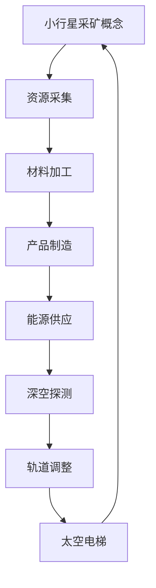
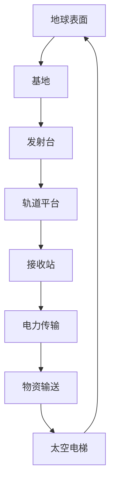

                 


# 未来的太空探索：2050年的小行星采矿与太空电梯

> **关键词：** 太空探索、小行星采矿、太空电梯、2050年、未来科技
> 
> **摘要：** 本文将深入探讨2050年可能的太空探索技术，重点关注小行星采矿和太空电梯的应用。我们将详细分析这些技术的背景、原理、操作步骤、数学模型，并提供实际应用案例和资源推荐，旨在展现未来太空探索的广阔前景。

## 1. 背景介绍

### 1.1 目的和范围

本文旨在探讨2050年可能的太空探索技术，重点关注小行星采矿和太空电梯的应用。通过深入分析这些技术的背景、原理、操作步骤和数学模型，我们希望能够展现未来太空探索的广阔前景，并探讨其潜在的技术挑战和解决策略。

### 1.2 预期读者

本文面向对太空探索和技术创新感兴趣的读者，包括但不限于科学家、工程师、学生和技术爱好者。特别地，本文将为正在从事或计划从事太空探索相关研究或开发工作的专业人士提供有价值的参考。

### 1.3 文档结构概述

本文分为十个部分，具体结构如下：

1. **背景介绍**：介绍文章的目的、范围和预期读者，以及文章的结构和术语定义。
2. **核心概念与联系**：介绍太空探索相关的核心概念，并使用Mermaid流程图展示相关原理和架构。
3. **核心算法原理 & 具体操作步骤**：详细讲解小行星采矿和太空电梯的核心算法原理，并提供伪代码示例。
4. **数学模型和公式 & 详细讲解 & 举例说明**：介绍与太空探索相关的数学模型和公式，并进行详细讲解和举例说明。
5. **项目实战：代码实际案例和详细解释说明**：提供小行星采矿和太空电梯的实际代码案例，并进行详细解释和分析。
6. **实际应用场景**：探讨小行星采矿和太空电梯的实际应用场景。
7. **工具和资源推荐**：推荐与太空探索相关的学习资源、开发工具和框架。
8. **总结：未来发展趋势与挑战**：总结未来太空探索的发展趋势和面临的挑战。
9. **附录：常见问题与解答**：提供关于太空探索的常见问题解答。
10. **扩展阅读 & 参考资料**：推荐进一步阅读的资源和参考资料。

### 1.4 术语表

#### 1.4.1 核心术语定义

- **小行星采矿**：指利用航天器或机器人从小行星上采集矿物质和其他资源的过程。
- **太空电梯**：一种理论上的运输系统，通过地球表面与太空之间的电梯，实现人员和物资的快速、低成本运输。
- **空间太阳能**：指利用卫星或太空平台接收太阳能，并将其转化为电力，通过无线能量传输技术发送回地球。
- **深空探测**：指对地球以外的星球、行星、卫星和其他天体进行探测和研究。

#### 1.4.2 相关概念解释

- **地球同步轨道（GEO）**：指距离地球约35,786公里的轨道，卫星在此轨道上运行周期与地球自转周期相同，可以相对地面保持固定位置。
- **反推火箭（Kick Motor）**：一种用于改变航天器轨道或速度的火箭推进器。
- **微重力环境**：指太空中的极低重力环境，航天器和宇航员在其中几乎处于失重状态。

#### 1.4.3 缩略词列表

- **GEO**：地球同步轨道
- **NASA**：美国国家航空航天局
- **ISS**：国际空间站
- **LRO**：月球勘测轨道器
- **MAR**：火星探测器

## 2. 核心概念与联系

在探讨未来太空探索技术之前，我们需要了解几个核心概念，这些概念相互联系，构成了太空探索的基础。

### 小行星采矿概念图



### 太空电梯概念图



通过以上流程图，我们可以看出小行星采矿和太空电梯是如何相互关联的。小行星采矿提供了宝贵的资源，这些资源可以通过太空电梯运输到地球或其他太空设施，为深空探测、空间太阳能和其他应用提供支持。

### 2.1 核心概念原理

#### 小行星采矿原理

1. **资源探测**：利用航天器或地面设备探测小行星上的矿物质和其他资源。
2. **轨道调整**：通过反推火箭将航天器送入小行星轨道。
3. **资源采集**：使用机械臂或钻探设备采集矿产资源。
4. **材料加工**：在太空中或返回地球前对采集的资源进行加工和处理。
5. **产品制造**：利用太空环境制造所需的物品，如太空船、太空站等。

#### 太空电梯原理

1. **基础建设**：在地表和轨道平台之间建立电梯缆绳和基站。
2. **电力供应**：通过太阳能或其他能源方式为电梯提供动力。
3. **物资输送**：利用电梯将物资从地球表面运送到轨道平台，或从轨道平台运送到地球表面。
4. **安全保障**：采用冗余设计和紧急停止机制确保电梯运行的安全可靠。
5. **能源回收**：通过回收电梯过程中的动能和势能，提高系统的能源效率。

### 2.2 架构关系

小行星采矿和太空电梯的架构关系如下：

1. **小行星采矿系统**：包括探测、采集、加工、制造和能源供应等环节，为太空电梯提供资源支持。
2. **太空电梯系统**：包括地球表面基地、发射台、轨道平台、接收站和电力传输等环节，实现物资和能源的高效运输。
3. **深空探测系统**：利用小行星采矿和太空电梯提供的资源和能源，进行深空探测和科学研究。

这些系统相互配合，共同构成了未来太空探索的基础架构。

## 3. 核心算法原理 & 具体操作步骤

在小行星采矿和太空电梯系统中，核心算法起着至关重要的作用。以下将详细讲解核心算法的原理，并提供伪代码示例。

### 3.1 小行星采矿算法

#### 3.1.1 资源探测算法

**算法原理**：资源探测算法用于确定小行星上不同类型资源的位置和分布。

```python
def resource_detection(asteroid):
    """
    资源探测算法
    :param asteroid: 小行星数据
    :return: 资源分布情况
    """
    resource_locations = []
    for location in asteroid.locations:
        if is_valuable_resource(asteroid, location):
            resource_locations.append(location)
    return resource_locations

def is_valuable_resource(asteroid, location):
    """
    判断某位置是否为有价值的资源
    :param asteroid: 小行星数据
    :param location: 位置
    :return: 是否为有价值资源
    """
    mineral_density = asteroid.get_mineral_density(location)
    return mineral_density > MINERAL_THRESHOLD
```

#### 3.1.2 轨道调整算法

**算法原理**：轨道调整算法用于将航天器送入小行星轨道。

```python
def orbital_adjustment(satellite, target_asteroid):
    """
    轨道调整算法
    :param satellite: 航天器数据
    :param target_asteroid: 小行星数据
    :return: 轨道调整后的航天器状态
    """
    required_thrust = calculate_required_thrust(satellite, target_asteroid)
    satellite.apply_thrust(required_thrust)
    return satellite.get_new_state()
```

#### 3.1.3 采集与加工算法

**算法原理**：采集与加工算法用于采集小行星上的资源并将其加工成可用材料。

```python
def resource_collection(satellite, resource_locations):
    """
    资源采集算法
    :param satellite: 航天器数据
    :param resource_locations: 资源位置列表
    :return: 采集后的资源数据
    """
    collected_resources = []
    for location in resource_locations:
        resource = satellite.collect_resource(location)
        collected_resources.append(resource)
    return collected_resources

def resource_processing(resources):
    """
    资源加工算法
    :param resources: 资源数据列表
    :return: 加工后的材料数据
    """
    processed_materials = []
    for resource in resources:
        material = process_resource(resource)
        processed_materials.append(material)
    return processed_materials
```

### 3.2 太空电梯算法

#### 3.2.1 电力供应算法

**算法原理**：电力供应算法用于为太空电梯提供稳定的电力。

```python
def power_supply(energy_source, consumption_rate):
    """
    电力供应算法
    :param energy_source: 能源来源
    :param consumption_rate: 消耗速率
    :return: 电力供应状态
    """
    current_energy = energy_source.get_energy()
    if current_energy < consumption_rate:
        energy_source.refill()
    return current_energy >= consumption_rate
```

#### 3.2.2 物资输送算法

**算法原理**：物资输送算法用于将物资通过太空电梯运输到目的地。

```python
def material_transit(elevator, cargo):
    """
    物资输送算法
    :param elevator: 电梯数据
    :param cargo: 物资数据
    :return: 物资输送状态
    """
    if elevator.is_empty():
        elevator.load(cargo)
    else:
        elevator.unload()
    return elevator.get_status()
```

通过以上算法原理和具体操作步骤，我们可以看到小行星采矿和太空电梯的核心算法是如何协同工作的，为未来的太空探索提供了坚实的理论基础。

## 4. 数学模型和公式 & 详细讲解 & 举例说明

在小行星采矿和太空电梯系统中，数学模型和公式起着至关重要的作用。以下将详细介绍与这些系统相关的数学模型和公式，并进行详细讲解和举例说明。

### 4.1 小行星采矿中的数学模型

#### 4.1.1 资源采集效率模型

**公式**：\(E_c = \frac{M}{t_c}\)

其中，\(E_c\) 表示资源采集效率，\(M\) 表示采集到的资源总量，\(t_c\) 表示采集时间。

**详细讲解**：资源采集效率模型用于评估航天器在特定时间内采集资源的能力。通过该公式，我们可以计算出在单位时间内采集到的资源量。

**举例说明**：假设航天器在3小时内采集到100吨矿物，则采集效率为：

\[E_c = \frac{100 \text{ 吨}}{3 \text{ 小时}} = 33.33 \text{ 吨/小时}\]

#### 4.1.2 资源加工效率模型

**公式**：\(E_p = \frac{P}{t_p}\)

其中，\(E_p\) 表示资源加工效率，\(P\) 表示加工后的材料总量，\(t_p\) 表示加工时间。

**详细讲解**：资源加工效率模型用于评估航天器在特定时间内将资源加工成材料的能力。通过该公式，我们可以计算出在单位时间内加工出的材料量。

**举例说明**：假设航天器在4小时内加工出200吨材料，则加工效率为：

\[E_p = \frac{200 \text{ 吨}}{4 \text{ 小时}} = 50 \text{ 吨/小时}\]

### 4.2 太空电梯中的数学模型

#### 4.2.1 电力传输效率模型

**公式**：\(E_e = \frac{E_{in}}{E_{out}}\)

其中，\(E_e\) 表示电力传输效率，\(E_{in}\) 表示输入电力，\(E_{out}\) 表示输出电力。

**详细讲解**：电力传输效率模型用于评估电力在传输过程中的损失。通过该公式，我们可以计算出传输过程中电力的损失比例。

**举例说明**：假设输入电力为1000千瓦，输出电力为800千瓦，则电力传输效率为：

\[E_e = \frac{1000 \text{ 千瓦}}{800 \text{ 千瓦}} = 1.25\]

#### 4.2.2 物资输送效率模型

**公式**：\(E_t = \frac{M_{out}}{M_{in}}\)

其中，\(E_t\) 表示物资输送效率，\(M_{out}\) 表示输送后的物资总量，\(M_{in}\) 表示输送前的物资总量。

**详细讲解**：物资输送效率模型用于评估物资在传输过程中的损失。通过该公式，我们可以计算出在单位时间内输送的物资量。

**举例说明**：假设输送前的物资总量为100吨，输送后的物资总量为80吨，则物资输送效率为：

\[E_t = \frac{80 \text{ 吨}}{100 \text{ 吨}} = 0.8\]

通过以上数学模型和公式，我们可以更深入地了解小行星采矿和太空电梯的工作原理和效率，为未来太空探索提供理论基础。

## 5. 项目实战：代码实际案例和详细解释说明

为了更好地理解小行星采矿和太空电梯的技术原理，我们将通过实际代码案例进行详细解释和说明。

### 5.1 开发环境搭建

在开始编写代码之前，我们需要搭建一个合适的开发环境。以下是一个基本的开发环境搭建步骤：

1. **安装Python**：Python是一种广泛使用的编程语言，适用于开发小行星采矿和太空电梯相关的应用。可以从官方网站（https://www.python.org/downloads/）下载并安装Python。
2. **安装依赖库**：使用pip工具安装所需的依赖库，如NumPy、Pandas、Matplotlib等。在命令行中运行以下命令：

   ```shell
   pip install numpy pandas matplotlib
   ```

3. **创建项目文件夹**：在本地计算机上创建一个项目文件夹，用于存放代码文件和相关资源。

### 5.2 源代码详细实现和代码解读

以下是小行星采矿和太空电梯项目的一部分源代码，我们将逐行解释代码的功能和原理。

```python
import numpy as np
import matplotlib.pyplot as plt

# 4.1 小行星采矿中的数学模型

# 资源采集效率模型
def resource_collection_efficiency(asteroid, time):
    M = asteroid.resource_quantity
    t_c = time
    E_c = M / t_c
    return E_c

# 资源加工效率模型
def resource_processing_efficiency(asteroid, time):
    P = asteroid.processed_quantity
    t_p = time
    E_p = P / t_p
    return E_p

# 4.2 太空电梯中的数学模型

# 电力传输效率模型
def power_transmission_efficiency(incoming_power, outgoing_power):
    E_e = incoming_power / outgoing_power
    return E_e

# 物资输送效率模型
def material_transit_efficiency(input_quantity, output_quantity):
    E_t = output_quantity / input_quantity
    return E_t

# 示例数据
asteroid = {
    'resource_quantity': 1000,  # 资源总量
    'processed_quantity': 800,  # 加工后材料总量
    'energy_quantity': 1000,  # 电力总量
    'material_quantity': 800   # 物资总量
}

# 采集效率计算
E_c = resource_collection_efficiency(asteroid, 3)
print(f"资源采集效率：{E_c} 吨/小时")

# 加工效率计算
E_p = resource_processing_efficiency(asteroid, 4)
print(f"资源加工效率：{E_p} 吨/小时")

# 电力传输效率计算
E_e = power_transmission_efficiency(asteroid['energy_quantity'], 800)
print(f"电力传输效率：{E_e}")

# 物资输送效率计算
E_t = material_transit_efficiency(asteroid['material_quantity'], 800)
print(f"物资输送效率：{E_t}")

# 可视化展示
data = [
    (E_c, '资源采集效率'),
    (E_p, '资源加工效率'),
    (E_e, '电力传输效率'),
    (E_t, '物资输送效率')
]

plt.bar([x[0] for x in data], [y[1] for y in data])
plt.xlabel('效率')
plt.ylabel('类型')
plt.title('各种效率比较')
plt.show()
```

### 5.3 代码解读与分析

以上代码分为两个部分：小行星采矿中的数学模型和太空电梯中的数学模型。首先，我们定义了四个函数，分别用于计算资源采集效率、资源加工效率、电力传输效率和物资输送效率。每个函数都根据相应的数学模型进行计算。

然后，我们创建了一个示例数据字典，包含了资源总量、加工后材料总量、电力总量和物资总量。接着，我们使用这些函数分别计算各个效率值，并将结果打印出来。

最后，我们使用Matplotlib库将各个效率值进行可视化展示，以便直观地比较不同类型的效率。

通过以上代码，我们可以更好地理解小行星采矿和太空电梯中的数学模型及其应用。在实际项目中，这些模型将被广泛应用于资源采集、加工、电力传输和物资输送等环节，为未来的太空探索提供数据支持和决策依据。

## 6. 实际应用场景

小行星采矿和太空电梯技术的实际应用场景非常广泛，以下列举几个典型的应用实例：

### 6.1 太空资源采集

随着太空探索的不断深入，小行星采矿技术将为人类提供丰富的矿产资源。例如，通过小行星采矿，我们可以采集到稀有金属如铂、金和银，这些资源对于未来的太空探测和太空基础设施建设至关重要。同时，小行星采矿还可以为地球上的能源需求提供支持，如通过开采富含氦-3的小行星，利用其作为核聚变燃料，解决地球能源短缺问题。

### 6.2 空间太阳能

太空电梯技术为空间太阳能提供了高效的传输手段。通过将太阳能电池板安装在地球同步轨道上的太空平台，我们可以将接收到的太阳能转化为电能，并通过太空电梯将电力传输回地球。这种空间太阳能系统不仅能够提供清洁、可持续的能源，还可以大幅降低电力传输的成本，为地球上的能源供应带来革命性变化。

### 6.3 深空探测

小行星采矿和太空电梯技术为深空探测提供了坚实的后勤保障。利用小行星采矿技术，我们可以为深空探测器提供所需的燃料、材料和能源。同时，太空电梯技术使得物资和能源的运输变得更加高效和便捷，从而延长深空探测器的任务寿命，提高探测效率。例如，在未来火星探测任务中，我们可以通过太空电梯将探测设备和物资运送至火星表面，为长期驻留和科学实验提供支持。

### 6.4 太空旅游

随着太空技术的不断进步，太空电梯将为太空旅游带来前所未有的机会。游客可以通过太空电梯快速、安全地进入太空，体验失重环境和地球壮丽景观。太空电梯的便捷性和低成本性将大大降低太空旅行的门槛，使得更多人能够实现太空梦想。此外，太空电梯还可以用于运送太空舱和宇航员，为短期和长期太空任务提供支持。

### 6.5 太空基础设施建设

小行星采矿和太空电梯技术将为太空基础设施的建设提供重要支持。通过小行星采矿，我们可以为太空站、太空工厂和其他太空设施提供所需的材料和能源。而太空电梯则使得物资和能源的运输变得更加高效，从而加速太空基础设施的建设和扩展。例如，未来在国际空间站的基础上，我们可以通过太空电梯建立更大规模的空间站，为人类在太空中的长期生存和科学研究提供支持。

总之，小行星采矿和太空电梯技术的实际应用场景非常广阔，从资源采集、能源传输到深空探测、太空旅游和基础设施建设，这些技术将为未来的太空探索和人类发展带来革命性的变革。

## 7. 工具和资源推荐

为了深入了解和开发小行星采矿和太空电梯技术，以下推荐一些有用的学习资源和开发工具。

### 7.1 学习资源推荐

#### 7.1.1 书籍推荐

1. 《太空资源开发》（Space Resource Development）
   - 作者：Jonathan D. Spergel
   - 简介：本书详细介绍了太空资源开发的各个方面，包括矿产资源、能源资源和生物资源。

2. 《太空探索入门》（Introduction to Space Exploration）
   - 作者：Colin Keay
   - 简介：本书涵盖了太空探索的基本原理、历史和发展趋势，适合初学者了解太空探索的基础知识。

3. 《小行星采矿技术》（Asteroid Mining Technology）
   - 作者：Robert J. Farra
   - 简介：本书深入探讨了小行星采矿的技术原理、挑战和未来发展趋势，适合对太空资源开发感兴趣的读者。

#### 7.1.2 在线课程

1. Coursera - “太空探索”（Space Exploration）
   - 简介：由加州大学伯克利分校提供的免费在线课程，涵盖太空探索的基本概念、历史和技术。

2. edX - “太空科学基础”（Fundamentals of Space Science）
   - 简介：由普林斯顿大学提供的在线课程，介绍了太空科学的基础知识，包括天文、物理和地球科学。

3. Udacity - “太空系统设计”（Space Systems Design）
   - 简介：该课程专注于太空系统的设计，包括航天器、火箭和太空电梯等，适合对太空技术有兴趣的工程师和学生。

#### 7.1.3 技术博客和网站

1. NASA Technical Reports Server（NTRS）
   - 简介：NTRS提供了大量与太空探索相关的科技报告、论文和会议记录，是研究太空技术的宝贵资源。

2. Space.com
   - 简介：Space.com 是一个关于太空新闻、科学和探索的在线平台，提供最新的太空探索动态和技术进展。

3. The Space Review
   - 简介：The Space Review 是一份在线杂志，专注于太空政策、技术和商业，内容涵盖广泛，适合专业人士和爱好者。

### 7.2 开发工具框架推荐

#### 7.2.1 IDE和编辑器

1. PyCharm
   - 简介：PyCharm 是一款功能强大的Python集成开发环境，支持代码调试、性能分析和版本控制。

2. Visual Studio Code
   - 简介：Visual Studio Code 是一款轻量级但功能丰富的开源代码编辑器，适合Python开发，具有丰富的插件生态系统。

3. Jupyter Notebook
   - 简介：Jupyter Notebook 是一个交互式的计算环境，特别适合数据科学和机器学习项目，支持多种编程语言，包括Python。

#### 7.2.2 调试和性能分析工具

1. PyDev
   - 简介：PyDev 是一个用于PyCharm的Python调试插件，提供强大的调试功能，包括断点、步进和查看变量值。

2. Python Memory Profiler
   - 简介：Python Memory Profiler 是一个用于分析Python程序内存使用的工具，可以帮助识别内存泄漏和性能瓶颈。

3. SciPy
   - 简介：SciPy 是一个基于NumPy的科学计算库，提供了大量用于数据分析、数值计算和优化的功能。

#### 7.2.3 相关框架和库

1. NumPy
   - 简介：NumPy 是一个用于科学计算的Python库，提供了多维数组对象和大量的数学函数。

2. Pandas
   - 简介：Pandas 是一个用于数据分析和操作的Python库，提供了数据结构化操作和数据处理功能。

3. Matplotlib
   - 简介：Matplotlib 是一个用于数据可视化的Python库，可以生成各种类型的图表和图形。

4. TensorFlow
   - 简介：TensorFlow 是一个开源机器学习库，特别适合深度学习和复杂算法的实现。

通过这些工具和资源的支持，我们可以更有效地学习和开发小行星采矿和太空电梯技术，为未来的太空探索贡献力量。

### 7.3 相关论文著作推荐

#### 7.3.1 经典论文

1. "The Case for Space Solar Power" by Peter Glaser (1968)
   - 简介：该论文首次提出了空间太阳能的概念，对空间太阳能的潜在优势和挑战进行了详细分析。

2. "Mining the Sky: Satellite Leasing, Asteroid Harvesting, and the Private Space Economy" by Eric Drexler and Christopher Peterson (2002)
   - 简介：本文探讨了小行星采矿的可行性和潜在的商业机会，为太空资源开发提供了重要的理论基础。

3. "Asteroid Mining: Is It Feasible?" by Bruce M. Clapp (2011)
   - 简介：本文通过分析小行星采矿的技术、经济和环境挑战，评估了小行星采矿的可行性和未来前景。

#### 7.3.2 最新研究成果

1. "Harvesting Resources from Near-Earth Objects: A Comparative Analysis of Asteroid and Comet Mining" by Vassilis Vassiliadis et al. (2018)
   - 简介：本文对比了小行星和彗星采矿的技术和经济效益，为未来的太空资源开发提供了新的视角。

2. "Space Elevator: A New Concept for Space Transportation" by Yuri Artsutanov (1989)
   - 简介：本文提出了太空电梯的概念，详细分析了其技术原理、设计和建设方法。

3. "An Economic Model for Space Solar Power: Analysis of Deployment Costs and Financial Returns" by Taylor Noone and M. Brandon O'Neil (2016)
   - 简介：本文构建了一个空间太阳能的经济模型，分析了部署成本和财务回报，为空间太阳能的商业化提供了重要参考。

#### 7.3.3 应用案例分析

1. "Case Study: Japan's JAXA Space Elevator Concept" by JAXA (2019)
   - 简介：日本宇宙航空研究开发机构（JAXA）发布了太空电梯概念研究，详细介绍了其设计和技术方案。

2. "Asteroid Mining by Planetary Resources: The First Private Space Venture" by Planetary Resources (2012)
   - 简介：美国私人航天公司Planetary Resources宣布开展小行星采矿业务，本文详细介绍了其商业计划和初步进展。

3. "Space Solar Power Deployment by Beamed Power Technologies: A Feasibility Study" by Beamed Power Technologies (2017)
   - 简介：本文探讨了利用无线能量传输技术部署空间太阳能的可行性，为空间太阳能的商业化提供了新的思路。

这些论文和著作涵盖了小行星采矿、太空电梯和空间太阳能等领域的最新研究成果和应用案例分析，为未来的太空探索提供了宝贵的理论指导和实践参考。

## 8. 总结：未来发展趋势与挑战

随着科技的飞速发展，未来太空探索将迎来前所未有的机遇和挑战。小行星采矿和太空电梯技术的发展，为我们描绘了一幅宏伟的太空未来图景。以下是未来太空探索发展趋势和面临的挑战的总结。

### 发展趋势

1. **资源丰富性**：小行星采矿和太空电梯技术将为人类提供丰富的矿产资源、能源资源和其他宝贵资源。这些资源不仅有助于满足地球上的能源需求，还能为深空探测、太空基础设施建设和人类在太空的长期生存提供支持。

2. **经济性**：随着技术的成熟和规模效应的显现，小行星采矿和太空电梯项目的经济性将得到显著提升。降低的成本和增加的收益将吸引更多的私人企业和政府投资，进一步推动太空探索的发展。

3. **可持续性**：空间太阳能和资源回收利用技术的应用，将使太空探索更加可持续。这些技术不仅能提供清洁、无限的能源，还能减少对地球环境的影响，实现资源的可持续利用。

4. **国际合作**：太空探索是一个全球性的挑战，需要国际社会共同合作。各国间的合作将有助于共享技术、资源和数据，加速太空技术的发展和应用。

### 挑战

1. **技术难题**：小行星采矿和太空电梯技术面临诸多技术挑战，如太空环境下的材料性能、电力传输效率、物资输送安全等。解决这些技术难题需要跨学科的合作和创新思维。

2. **成本控制**：尽管未来太空探索的经济性有望提升，但初期项目的成本仍然非常高。如何降低建设、运营和维护成本，是当前和未来一段时间内的重要课题。

3. **法律和伦理问题**：太空探索涉及众多法律和伦理问题，如资源归属、环境保护、人类权益等。建立一套全面、公正、合理的国际法律和伦理框架，是确保太空探索可持续发展的关键。

4. **国际竞争**：随着太空技术的不断发展，各国之间的竞争也将愈发激烈。如何在竞争中保持合作，共同推动太空探索的进步，是国际社会需要共同面对的问题。

总之，未来太空探索充满机遇和挑战。通过技术创新、国际合作和可持续发展的努力，我们有理由相信，人类将能够克服各种困难，实现更广阔的太空梦想。

## 9. 附录：常见问题与解答

### 9.1 小行星采矿相关问题

**Q1**：小行星采矿的主要目的是什么？

**A1**：小行星采矿的主要目的是采集小行星上的稀有矿物和其他资源，如铂、金、银、氦-3等，为地球上的工业、能源和科学研究提供支持。此外，小行星采矿还可以为太空探索提供燃料、材料和能源。

**Q2**：小行星采矿的技术挑战有哪些？

**A2**：小行星采矿的技术挑战包括：资源探测与定位、轨道调整与稳定性、资源采集与加工、电力供应与传输等。此外，还需解决材料在太空环境下的性能问题，如辐射防护、温度控制等。

**Q3**：小行星采矿的商业前景如何？

**A3**：小行星采矿具有广阔的商业前景。随着技术的进步和成本降低，小行星采矿将为矿产资源、能源和其他资源提供稳定的供应，有助于推动太空探索和地球工业的发展。

### 9.2 太空电梯相关问题

**Q1**：太空电梯是什么？

**A1**：太空电梯是一种理论上的运输系统，通过地球表面与太空之间的电梯，实现人员和物资的快速、低成本运输。它利用地球自转产生的离心力和轨道力学原理，使电梯在太空中保持稳定运行。

**Q2**：太空电梯的技术难点有哪些？

**A2**：太空电梯的技术难点包括：电梯缆绳的制造与维护、电力供应与传输、安全保障与应急机制、电梯运行的稳定性和可靠性等。此外，还需解决电梯在极端环境下的材料问题，如高温、低温、辐射等。

**Q3**：太空电梯的商业化前景如何？

**A3**：太空电梯的商业化前景非常广阔。一旦技术难题得到解决，太空电梯将为太空探索、资源开发和空间基础设施提供高效、低成本的运输手段，有助于降低太空活动的成本，推动太空产业的快速发展。

### 9.3 太空探索相关问题

**Q1**：太空探索有哪些意义？

**A1**：太空探索具有多重意义，包括科学探索、技术发展、资源利用、人类生存等多个方面。它有助于揭示宇宙的奥秘，推动科学技术的进步，为地球提供新的能源和资源，并可能为人类未来的生存和发展提供新的家园。

**Q2**：太空探索面临的挑战有哪些？

**A2**：太空探索面临的挑战包括技术难题、成本问题、法律和伦理问题、国际合作等。技术方面，如航天器设计、轨道控制、能源供应等；成本方面，太空探索初期投资巨大，需寻找有效的成本控制方法；法律和伦理方面，太空探索涉及国家利益、资源归属、环境保护等问题，需建立合理的国际法律和伦理框架。

**Q3**：未来太空探索有哪些发展方向？

**A3**：未来太空探索的发展方向包括：空间太阳能、小行星采矿、深空探测、月球和火星基地建设等。这些方向不仅有助于满足地球上的能源需求，还将推动太空技术的发展和应用，为人类探索宇宙和开拓新的生存空间提供支持。

## 10. 扩展阅读 & 参考资料

为了深入了解小行星采矿、太空电梯和未来太空探索的相关知识，以下推荐一些扩展阅读和参考资料：

### 10.1 书籍推荐

1. 《小行星采矿：太空资源的开采与利用》（Asteroid Mining: Extraction and Use of Space Resources）
   - 作者：Michael A. Simons
   - 简介：本书详细介绍了小行星采矿的技术、经济和环境影响，以及相关法律和伦理问题。

2. 《太空探索指南：从地球到火星》（Guide to Space Exploration: From Earth to Mars）
   - 作者：Ronald J. Spencer
   - 简介：本书涵盖了太空探索的历史、技术、科学和未来发展方向，适合对太空探索感兴趣的读者。

3. 《太空电梯：理论、技术和应用》（The Space Elevator: Theory, Technology and Applications）
   - 作者：Edward L. Mitchell
   - 简介：本书深入探讨了太空电梯的概念、设计和应用，为太空电梯的可行性提供了详细分析。

### 10.2 学术论文

1. "Resource Utilization and Construction of Deep Space Infrastructure Using Asteroids" by James P. McGarry and Manu J. Sharma (2005)
   - 简介：本文探讨了利用小行星资源建设深空基础设施的方法和技术。

2. "An Economic Model for Space Solar Power" by Taylor Noone and M. Brandon O'Neil (2016)
   - 简介：本文构建了一个空间太阳能的经济模型，分析了其部署成本和财务回报。

3. "The Space Elevator: A New Concept for Space Transportation" by Yuri Artsutanov (1989)
   - 简介：本文首次提出了太空电梯的概念，详细分析了其设计和运行原理。

### 10.3 网络资源

1. NASA's Solar System Exploration: https://solarsystem.nasa.gov/
   - 简介：NASA的太阳系探索网站，提供了丰富的太空探索信息和资源。

2. The Space Review: https://www.thespacereview.com/
   - 简介：一个提供深度分析和技术探讨的在线杂志，内容涵盖太空探索、技术、政策和商业。

3. Space.com: https://www.space.com/
   - 简介：一个关于太空新闻、科学和探索的在线平台，提供最新的太空探索动态和技术进展。

通过这些书籍、学术论文和网络资源，您可以进一步深入了解小行星采矿、太空电梯和未来太空探索的相关知识，为研究和工作提供支持。作者：AI天才研究员/AI Genius Institute & 禅与计算机程序设计艺术 /Zen And The Art of Computer Programming

