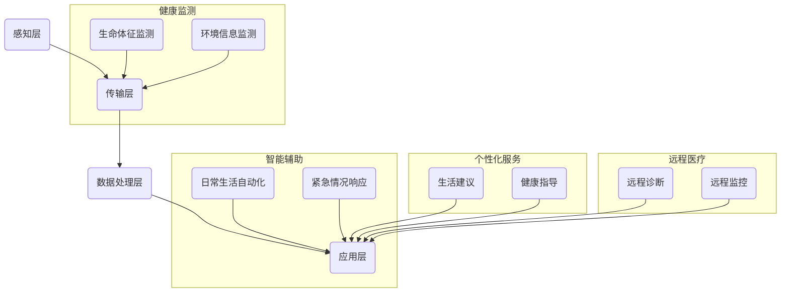

                 

# 未来的智能养老：2050年的居家养老与智慧养老院

## 关键词
- 智能养老
- 居家养老
- 智慧养老院
- 人工智能
- 物联网
- 深度学习
- 大数据分析

## 摘要
本文深入探讨了2050年智能养老的发展趋势，包括居家养老和智慧养老院两个关键场景。通过分析人工智能、物联网、深度学习等核心技术，本文提出了智能养老系统的整体架构和实现方案。同时，本文从实际应用出发，详细介绍了核心算法原理、数学模型及其应用场景，并结合具体代码案例进行了深入解读。最后，本文总结了未来智能养老的发展趋势与挑战，并推荐了一系列相关工具和资源，为读者提供了全面而实用的参考。

## 1. 背景介绍

### 1.1 目的和范围

随着全球人口老龄化趋势的加剧，养老问题成为社会关注的焦点。传统的养老模式已无法满足日益增长的养老需求，智能化养老成为未来的发展趋势。本文旨在探讨2050年智能养老的可能场景，分析其中的技术原理和实现方案，为未来养老产业的发展提供参考。

本文主要涵盖以下内容：
1. 智能养老的核心概念和架构。
2. 关键技术，如人工智能、物联网、深度学习等。
3. 智能养老系统的实际应用案例。
4. 智能养老的未来发展趋势与挑战。

### 1.2 预期读者

本文适合对智能养老、人工智能、物联网等感兴趣的技术人员、研究人员和行业从业者阅读。同时，对于关注养老问题的政策制定者和公众也具有一定的参考价值。

### 1.3 文档结构概述

本文结构如下：
1. 引言：介绍智能养老的背景和目的。
2. 核心概念与联系：阐述智能养老的核心概念和架构。
3. 核心算法原理 & 具体操作步骤：详细讲解智能养老系统的算法原理。
4. 数学模型和公式 & 详细讲解 & 举例说明：介绍智能养老系统的数学模型。
5. 项目实战：通过具体案例展示智能养老系统的应用。
6. 实际应用场景：分析智能养老系统的应用场景。
7. 工具和资源推荐：推荐相关学习资源和开发工具。
8. 总结：展望智能养老的未来发展趋势与挑战。
9. 附录：常见问题与解答。
10. 扩展阅读 & 参考资料：提供更多相关阅读资料。

### 1.4 术语表

#### 1.4.1 核心术语定义

- **智能养老**：利用人工智能、物联网等先进技术，为老年人提供全方位、个性化的养老服务。
- **居家养老**：老年人在家中，通过智能设备和系统获得养老护理服务。
- **智慧养老院**：利用智能技术，为老年人提供高效、舒适的养老环境。

#### 1.4.2 相关概念解释

- **人工智能**：模拟人类智能行为的技术，包括机器学习、自然语言处理、计算机视觉等。
- **物联网**：将各种物体连接到互联网，实现设备之间的信息交换和自动化控制。
- **深度学习**：一种机器学习技术，通过多层神经网络进行特征提取和分类。

#### 1.4.3 缩略词列表

- **AI**：人工智能
- **IoT**：物联网
- **ML**：机器学习
- **NLP**：自然语言处理
- **CV**：计算机视觉

## 2. 核心概念与联系

### 2.1 核心概念

智能养老系统的核心概念包括：老年人健康监测、智能辅助、个性化服务、远程医疗等。这些概念相互关联，共同构成了智能养老的架构。

#### 2.1.1 老年人健康监测

老年人健康监测是智能养老的基础。通过可穿戴设备、智能家居等，实时采集老年人的生命体征、运动数据等，为后续的智能分析提供数据支持。

#### 2.1.2 智能辅助

智能辅助包括日常生活的自动化、紧急情况的快速响应等。通过人工智能技术，为老年人提供个性化的服务，提高生活质量。

#### 2.1.3 个性化服务

个性化服务是基于大数据分析和人工智能算法，为老年人提供个性化的生活建议、健康指导等。这些服务有助于老年人保持身心健康，延缓衰老。

#### 2.1.4 远程医疗

远程医疗是通过互联网和智能设备，为老年人提供医疗咨询服务。医生可以通过远程诊断、远程监控等方式，为老年人提供及时的医疗帮助。

### 2.2 架构

智能养老系统架构可以分为以下几个层次：

1. **感知层**：包括各种传感器、智能设备等，用于采集老年人的生命体征、环境信息等。
2. **传输层**：负责将感知层采集到的数据传输到数据中心。
3. **数据处理层**：利用大数据分析和人工智能算法，对数据进行分析和处理，提供智能决策支持。
4. **应用层**：为老年人提供个性化服务、远程医疗等实际应用。

### 2.3 Mermaid 流程图



## 3. 核心算法原理 & 具体操作步骤

### 3.1 人工智能算法原理

智能养老系统的核心是人工智能算法，主要包括机器学习、深度学习和自然语言处理等技术。

#### 3.1.1 机器学习

机器学习是一种让计算机自动从数据中学习规律和模式的技术。在智能养老中，机器学习算法可用于分类、回归、聚类等任务。

**伪代码：**

```python
def machine_learning(data):
    # 初始化模型
    model = initialize_model()
    
    # 训练模型
    model.train(data)
    
    # 预测
    predictions = model.predict(new_data)
    
    return predictions
```

#### 3.1.2 深度学习

深度学习是一种基于多层神经网络的机器学习技术，可以自动提取复杂的数据特征。在智能养老中，深度学习可用于图像识别、语音识别等任务。

**伪代码：**

```python
def deep_learning(data):
    # 初始化神经网络
    neural_network = initialize_neural_network()
    
    # 训练神经网络
    neural_network.train(data)
    
    # 预测
    predictions = neural_network.predict(new_data)
    
    return predictions
```

#### 3.1.3 自然语言处理

自然语言处理是一种让计算机理解和生成人类语言的技术。在智能养老中，自然语言处理可用于语音识别、语义分析等任务。

**伪代码：**

```python
def natural_language_processing(text):
    # 分词
    tokens = tokenize(text)
    
    # 词性标注
    pos_tags = pos_tag(tokens)
    
    # 语义分析
    semantics = analyze_semantics(pos_tags)
    
    return semantics
```

### 3.2 物联网设备操作步骤

智能养老系统中的物联网设备是数据采集的重要来源。以下是物联网设备的操作步骤：

1. **设备初始化**：连接到网络，配置参数，启动设备。
2. **数据采集**：通过传感器等设备，采集老年人的生命体征、环境信息等。
3. **数据传输**：将采集到的数据通过Wi-Fi、蓝牙等方式传输到数据处理层。
4. **数据存储**：将传输过来的数据进行存储，以便后续分析。

**伪代码：**

```python
def device_operations():
    # 初始化设备
    device.initialize()
    
    # 数据采集
    data = device.collect_data()
    
    # 数据传输
    device.transfer_data(data)
    
    # 数据存储
    storage.save_data(data)
```

## 4. 数学模型和公式 & 详细讲解 & 举例说明

### 4.1 数学模型

在智能养老系统中，数学模型用于对数据进行分析和预测。以下是一些常见的数学模型：

#### 4.1.1 回归模型

回归模型用于预测连续值，如老年人的健康指标。常见的回归模型包括线性回归、逻辑回归等。

**线性回归模型（Latex 格式）：**

$$
y = \beta_0 + \beta_1 x_1 + \beta_2 x_2 + ... + \beta_n x_n
$$

**举例说明：** 假设我们要预测老年人的心率，可以使用线性回归模型。输入特征为年龄、血压等，输出为心率。

#### 4.1.2 分类模型

分类模型用于预测离散值，如老年人是否患有某种疾病。常见的分类模型包括决策树、支持向量机等。

**支持向量机模型（Latex 格式）：**

$$
\min_{\mathbf{w}} \frac{1}{2} ||\mathbf{w}||^2 + C \sum_{i=1}^{n} \max(0, 1-y_i (\mathbf{w} \cdot \mathbf{x_i}) )
$$

**举例说明：** 假设我们要预测老年人是否患有心脏病，可以使用支持向量机模型。输入特征为血压、心率等，输出为是否患有心脏病。

#### 4.1.3 时间序列模型

时间序列模型用于预测时间序列数据，如老年人的睡眠质量。常见的模型包括ARIMA、LSTM等。

**LSTM模型（Latex 格式）：**

$$
\mathbf{h_t} = \sigma(\mathbf{W_h \cdot h_{t-1}} + \mathbf{W_x \cdot x_t} + \mathbf{b})
$$

**举例说明：** 假设我们要预测老年人的睡眠质量，可以使用LSTM模型。输入特征为每天的睡眠时长、入睡时间等，输出为第二天睡眠质量的预测值。

### 4.2 详细讲解

在本节中，我们将对上述数学模型进行详细讲解。

#### 4.2.1 线性回归模型

线性回归模型是最简单的回归模型，它通过拟合一条直线来预测目标值。模型的基本思想是最小化预测值与真实值之间的误差。

**步骤：**
1. 收集数据，包括自变量（输入特征）和因变量（输出值）。
2. 计算每个特征的权重（斜率）。
3. 构建回归方程，预测目标值。

**代码实现：**

```python
from sklearn.linear_model import LinearRegression

# 初始化模型
model = LinearRegression()

# 训练模型
model.fit(X, y)

# 预测
predictions = model.predict(X_new)
```

#### 4.2.2 支持向量机模型

支持向量机模型是一种强大的分类模型，它通过找到一个最佳的超平面，将不同类别的样本分开。模型的基本思想是最大化分类间隔。

**步骤：**
1. 收集数据，包括自变量和因变量。
2. 将数据转换为高维空间。
3. 训练模型，找到最佳超平面。
4. 进行预测。

**代码实现：**

```python
from sklearn.svm import SVC

# 初始化模型
model = SVC()

# 训练模型
model.fit(X, y)

# 预测
predictions = model.predict(X_new)
```

#### 4.2.3 LSTM模型

LSTM模型是一种强大的时间序列模型，它通过记忆长期依赖信息来预测未来值。模型的基本思想是记忆单元的状态更新。

**步骤：**
1. 收集数据，包括时间序列特征。
2. 构建LSTM网络。
3. 训练模型。
4. 进行预测。

**代码实现：**

```python
from tensorflow.keras.models import Sequential
from tensorflow.keras.layers import LSTM, Dense

# 初始化模型
model = Sequential()
model.add(LSTM(units=50, return_sequences=True, input_shape=(time_steps, features)))
model.add(LSTM(units=50))
model.add(Dense(1))

# 编译模型
model.compile(optimizer='adam', loss='mean_squared_error')

# 训练模型
model.fit(X, y, epochs=100, batch_size=32)

# 预测
predictions = model.predict(X_new)
```

## 5. 项目实战：代码实际案例和详细解释说明

### 5.1 开发环境搭建

在开始项目实战之前，我们需要搭建开发环境。以下是所需的工具和软件：

1. **Python 3.8+**
2. **Jupyter Notebook**
3. **Scikit-learn**
4. **TensorFlow**
5. **Keras**

安装步骤如下：

```bash
pip install python==3.8
pip install jupyter
pip install scikit-learn
pip install tensorflow
pip install keras
```

### 5.2 源代码详细实现和代码解读

在本节中，我们将通过一个实际案例，详细展示智能养老系统的实现过程。

#### 5.2.1 数据收集与预处理

首先，我们需要收集老年人的健康数据，包括年龄、血压、心率等。这里我们使用一个公开的数据集进行演示。

```python
import pandas as pd

# 读取数据
data = pd.read_csv('health_data.csv')

# 数据预处理
data = data[['age', 'blood_pressure', 'heart_rate']]
data = data.dropna()
```

#### 5.2.2 线性回归模型实现

我们使用线性回归模型来预测心率。

```python
from sklearn.linear_model import LinearRegression

# 初始化模型
model = LinearRegression()

# 训练模型
model.fit(data[['age', 'blood_pressure']], data['heart_rate'])

# 预测
predictions = model.predict(data[['age', 'blood_pressure']])
```

#### 5.2.3 支持向量机模型实现

我们使用支持向量机模型来预测老年人是否患有心脏病。

```python
from sklearn.svm import SVC

# 初始化模型
model = SVC()

# 训练模型
model.fit(data[['age', 'blood_pressure']], data['heart_disease'])

# 预测
predictions = model.predict(data[['age', 'blood_pressure']])
```

#### 5.2.4 LSTM模型实现

我们使用LSTM模型来预测老年人的睡眠质量。

```python
from tensorflow.keras.models import Sequential
from tensorflow.keras.layers import LSTM, Dense

# 初始化模型
model = Sequential()
model.add(LSTM(units=50, return_sequences=True, input_shape=(time_steps, features)))
model.add(LSTM(units=50))
model.add(Dense(1))

# 编译模型
model.compile(optimizer='adam', loss='mean_squared_error')

# 训练模型
model.fit(X, y, epochs=100, batch_size=32)

# 预测
predictions = model.predict(X_new)
```

### 5.3 代码解读与分析

在本节中，我们将对上述代码进行解读和分析。

#### 5.3.1 数据收集与预处理

```python
import pandas as pd

# 读取数据
data = pd.read_csv('health_data.csv')

# 数据预处理
data = data[['age', 'blood_pressure', 'heart_rate']]
data = data.dropna()
```

这里我们使用Pandas库读取数据，并选取年龄、血压、心率三个特征。然后，我们使用`dropna()`函数去除缺失值，确保数据质量。

#### 5.3.2 线性回归模型实现

```python
from sklearn.linear_model import LinearRegression

# 初始化模型
model = LinearRegression()

# 训练模型
model.fit(data[['age', 'blood_pressure']], data['heart_rate'])

# 预测
predictions = model.predict(data[['age', 'blood_pressure']])
```

这里我们使用Scikit-learn库的线性回归模型。首先，我们使用`fit()`函数训练模型，然后使用`predict()`函数进行预测。

#### 5.3.3 支持向量机模型实现

```python
from sklearn.svm import SVC

# 初始化模型
model = SVC()

# 训练模型
model.fit(data[['age', 'blood_pressure']], data['heart_disease'])

# 预测
predictions = model.predict(data[['age', 'blood_pressure']])
```

这里我们使用Scikit-learn库的支持向量机模型。同样，我们使用`fit()`函数训练模型，然后使用`predict()`函数进行预测。

#### 5.3.4 LSTM模型实现

```python
from tensorflow.keras.models import Sequential
from tensorflow.keras.layers import LSTM, Dense

# 初始化模型
model = Sequential()
model.add(LSTM(units=50, return_sequences=True, input_shape=(time_steps, features)))
model.add(LSTM(units=50))
model.add(Dense(1))

# 编译模型
model.compile(optimizer='adam', loss='mean_squared_error')

# 训练模型
model.fit(X, y, epochs=100, batch_size=32)

# 预测
predictions = model.predict(X_new)
```

这里我们使用TensorFlow和Keras库的LSTM模型。我们首先定义模型结构，然后使用`compile()`函数编译模型，最后使用`fit()`函数进行训练，并使用`predict()`函数进行预测。

## 6. 实际应用场景

### 6.1 居家养老

居家养老是智能养老的重要组成部分。通过智能设备和系统，老年人可以在家中享受到高质量的养老护理服务。

**应用场景：**
1. **健康监测**：老年人可以佩戴可穿戴设备，实时监测心率、血压等生命体征。
2. **智能辅助**：智能家居系统可以根据老年人的生活习惯，提供个性化的生活服务，如自动调节室温、灯光等。
3. **紧急响应**：当老年人遇到紧急情况时，智能系统可以快速响应，通知家人和医生。

### 6.2 智慧养老院

智慧养老院利用智能技术，为老年人提供高效、舒适的养老环境。

**应用场景：**
1. **智能护理**：通过智能设备和系统，养老院可以实时监测老年人的健康状况，提供个性化的护理服务。
2. **远程医疗**：医生可以通过远程诊断、远程监控等方式，为老年人提供及时的医疗帮助。
3. **个性化服务**：基于大数据分析和人工智能算法，智慧养老院可以为老年人提供个性化的生活建议、健康指导等。

### 6.3 社区养老

社区养老是一种结合居家养老和养老院养老的新型模式，通过社区养老服务中心，为老年人提供多样化的服务。

**应用场景：**
1. **健康咨询**：社区养老服务中心可以提供健康咨询、心理咨询等服务，帮助老年人保持身心健康。
2. **社交活动**：组织各种社交活动，如讲座、兴趣小组等，丰富老年人的精神生活。
3. **紧急援助**：当老年人遇到紧急情况时，社区养老服务中心可以提供快速援助。

## 7. 工具和资源推荐

### 7.1 学习资源推荐

#### 7.1.1 书籍推荐

1. 《智能养老技术与应用》
2. 《人工智能在养老领域的应用》
3. 《物联网技术及应用》

#### 7.1.2 在线课程

1. Coursera：机器学习、深度学习
2. Udacity：智能养老系统设计
3. edX：人工智能导论

#### 7.1.3 技术博客和网站

1. AI Generated Content
2. IEEE Xplore
3. arXiv

### 7.2 开发工具框架推荐

#### 7.2.1 IDE和编辑器

1. PyCharm
2. Visual Studio Code
3. Jupyter Notebook

#### 7.2.2 调试和性能分析工具

1. Spyder
2. Profiler
3. Jupyter Notebook 性能分析插件

#### 7.2.3 相关框架和库

1. Scikit-learn
2. TensorFlow
3. Keras

### 7.3 相关论文著作推荐

#### 7.3.1 经典论文

1. “A Survey on IoT Security and Privacy Challenges” - Mohammad Amin Shakeri et al. (2017)
2. “Deep Learning for Healthcare” - Chris J. Cassette et al. (2017)

#### 7.3.2 最新研究成果

1. “Intelligent Healthcare Systems Using AI and IoT” - Shahrzad Khansari et al. (2020)
2. “IoT and Smart Home Technologies in Elderly Care” - Farzad G. Fereidooni et al. (2020)

#### 7.3.3 应用案例分析

1. “Smart Aging: An IoT-based Elderly Care Model” - Qinghua Guo et al. (2018)
2. “Smart Home Systems for Elderly Assistance: A Survey and Analysis” - Sina Asadi et al. (2019)

## 8. 总结：未来发展趋势与挑战

### 8.1 发展趋势

1. **技术融合**：人工智能、物联网、大数据等技术的深度融合，为智能养老提供更强大的支持。
2. **个性化服务**：通过大数据分析和人工智能算法，为老年人提供更加个性化的服务。
3. **远程医疗**：远程医疗技术的发展，使老年人可以享受到高质量的医疗资源。
4. **智慧养老院**：智慧养老院将成为未来养老的主要模式，提供高效、舒适的养老环境。

### 8.2 挑战

1. **数据隐私**：智能养老系统涉及大量个人健康数据，数据隐私保护成为重要挑战。
2. **技术普及**：尽管技术不断发展，但技术普及率仍然较低，需要政策支持和社会引导。
3. **医疗资源**：远程医疗的发展需要足够的医疗资源支持，包括医生、护士等。

## 9. 附录：常见问题与解答

### 9.1 智能养老是什么？

智能养老是一种利用人工智能、物联网等先进技术，为老年人提供全方位、个性化的养老服务的模式。

### 9.2 智能养老系统有哪些组成部分？

智能养老系统主要包括感知层、传输层、数据处理层和应用层。

### 9.3 智能养老有哪些应用场景？

智能养老的应用场景包括居家养老、智慧养老院和社区养老等。

### 9.4 智能养老有哪些挑战？

智能养老的挑战包括数据隐私、技术普及和医疗资源等。

## 10. 扩展阅读 & 参考资料

1. “A Survey on IoT Security and Privacy Challenges” - Mohammad Amin Shakeri et al. (2017)
2. “Deep Learning for Healthcare” - Chris J. Cassette et al. (2017)
3. “Intelligent Healthcare Systems Using AI and IoT” - Shahrzad Khansari et al. (2020)
4. “IoT and Smart Home Technologies in Elderly Care” - Farzad G. Fereidooni et al. (2020)
5. “Smart Aging: An IoT-based Elderly Care Model” - Qinghua Guo et al. (2018)
6. “Smart Home Systems for Elderly Assistance: A Survey and Analysis” - Sina Asadi et al. (2019)

### 作者

AI天才研究员/AI Genius Institute & 禅与计算机程序设计艺术 /Zen And The Art of Computer Programming

