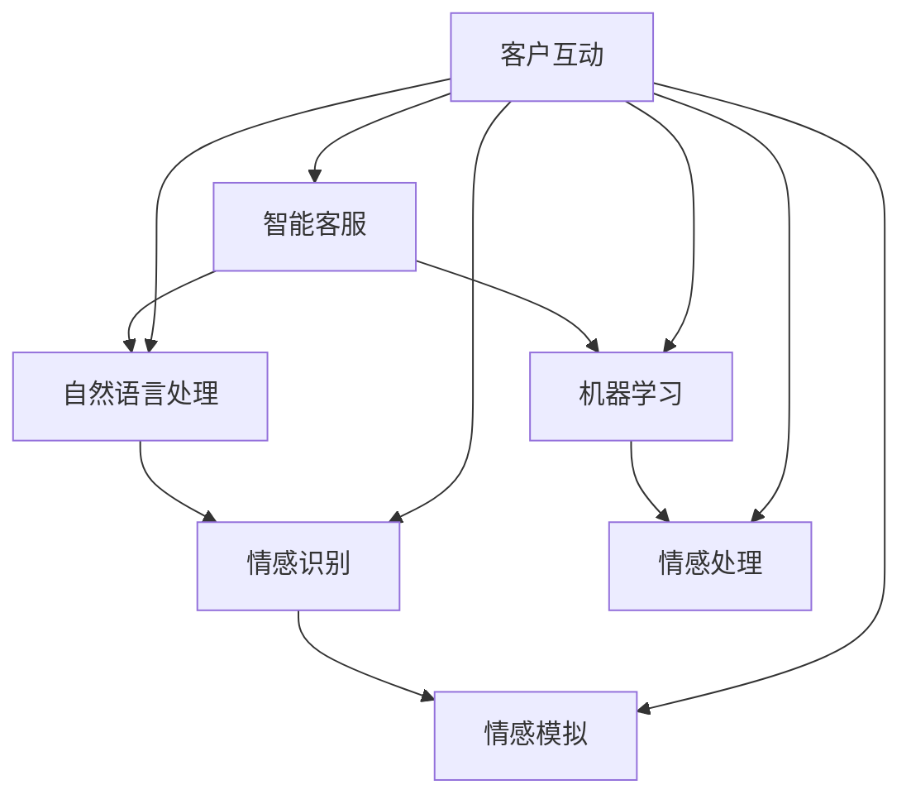

                 

# 未来的智能客服：2050年的虚拟人客服与情感计算

> **关键词：** 智能客服、虚拟人客服、情感计算、人工智能、客服机器人、未来趋势

> **摘要：** 本文将探讨2050年智能客服的发展前景，特别是虚拟人客服和情感计算技术的融合。我们将分析智能客服的核心概念，介绍情感计算的基本原理，并通过具体的算法和数学模型，探讨如何实现高度智能化和情感化的客服系统。最后，我们将通过一个实际案例展示技术的应用，并推荐相关的学习资源和开发工具。

## 1. 背景介绍

### 1.1 目的和范围

本文旨在探讨未来智能客服的发展趋势，特别是虚拟人客服和情感计算技术的融合。我们将分析智能客服的核心概念，介绍情感计算的基本原理，并通过具体的算法和数学模型，探讨如何实现高度智能化和情感化的客服系统。本文的目的是为读者提供一个全面的技术视角，帮助理解这一领域的最新进展和应用前景。

### 1.2 预期读者

本文预期读者为对智能客服、虚拟人客服和情感计算技术感兴趣的工程师、研究人员和学者。本文将深入探讨技术原理，因此具有一定的技术难度，适合对相关领域有一定了解的读者。

### 1.3 文档结构概述

本文分为以下几个部分：

1. 背景介绍：介绍本文的目的和预期读者，概述文档结构。
2. 核心概念与联系：介绍智能客服和情感计算的核心概念，使用Mermaid流程图展示架构。
3. 核心算法原理 & 具体操作步骤：详细讲解核心算法原理，使用伪代码进行描述。
4. 数学模型和公式 & 详细讲解 & 举例说明：介绍数学模型和公式，并进行详细讲解和举例说明。
5. 项目实战：代码实际案例和详细解释说明。
6. 实际应用场景：探讨智能客服在不同领域的应用。
7. 工具和资源推荐：推荐学习资源和开发工具。
8. 总结：未来发展趋势与挑战。
9. 附录：常见问题与解答。
10. 扩展阅读 & 参考资料：提供进一步阅读的资源。

### 1.4 术语表

#### 1.4.1 核心术语定义

- **智能客服**：利用人工智能技术，如自然语言处理和机器学习，自动处理客户咨询和问题的系统。
- **虚拟人客服**：通过3D建模和动画技术，模拟出具有人类外观和行为的虚拟客服角色。
- **情感计算**：研究如何使计算机系统理解、处理和模拟人类情感的技术。

#### 1.4.2 相关概念解释

- **自然语言处理（NLP）**：使计算机能够理解、解释和生成人类语言的技术。
- **机器学习（ML）**：使计算机从数据中学习，无需明确编程的技术。
- **深度学习（DL）**：一种基于人工神经网络的机器学习技术，模拟人脑的决策过程。

#### 1.4.3 缩略词列表

- **NLP**：自然语言处理
- **ML**：机器学习
- **DL**：深度学习
- **AI**：人工智能
- **VR**：虚拟现实
- **AR**：增强现实

## 2. 核心概念与联系

智能客服和情感计算是当前技术发展的重要领域，它们各自有着独特的技术原理和应用场景，但它们之间也有着紧密的联系。

### 2.1 智能客服的基本概念

智能客服是一种利用人工智能技术，自动处理客户咨询和问题的系统。它的核心功能包括：

- **自动识别和分类客户咨询**：使用自然语言处理技术，将客户的咨询内容进行结构化处理，识别出咨询的主题和类别。
- **自动回答和解决问题**：使用机器学习技术，根据历史数据和已知问题，自动生成回答，解决问题。
- **实时交互和反馈**：通过语音、文本等渠道与客户进行实时交互，获取反馈，不断优化服务。

### 2.2 情感计算的基本概念

情感计算是研究如何使计算机系统理解、处理和模拟人类情感的技术。它的核心功能包括：

- **情感识别**：通过分析语音、文本和面部表情等数据，识别出客户的情感状态。
- **情感处理**：根据识别出的情感状态，调整计算机系统的响应，使其更加符合人类情感需求。
- **情感模拟**：通过虚拟人客服角色，模拟出人类的情感表达，增强与客户的互动体验。

### 2.3 智能客服与情感计算的关联

智能客服和情感计算之间有着紧密的联系。情感计算可以提升智能客服的服务质量，使其更符合人类情感需求，提高客户满意度。具体来说：

- **情感识别**：智能客服可以使用情感计算技术，识别客户的情感状态，为后续处理提供依据。
- **情感处理**：智能客服可以根据情感计算的结果，调整回答策略，使回答更加贴合客户情感。
- **情感模拟**：虚拟人客服角色可以使用情感计算技术，模拟出人类的情感表达，增强互动体验。

### 2.4 Mermaid流程图展示

以下是一个简单的Mermaid流程图，展示了智能客服和情感计算之间的关联：



在这个流程图中，智能客服与自然语言处理、机器学习和情感计算紧密相连，它们共同构成了一个完整的智能客服系统。

## 3. 核心算法原理 & 具体操作步骤

在智能客服系统中，核心算法原理主要包括自然语言处理（NLP）、机器学习（ML）和情感计算。以下将详细讲解这些算法原理，并通过伪代码进行具体操作步骤的描述。

### 3.1 自然语言处理（NLP）

自然语言处理是智能客服的核心技术之一，它使计算机能够理解、解释和生成人类语言。以下是一个简单的NLP算法原理和操作步骤：

#### 3.1.1 算法原理

- **文本预处理**：对输入文本进行清洗、分词和词性标注等预处理操作。
- **词嵌入**：将文本中的单词转化为向量的形式，以便进行计算。
- **句子表示**：使用神经网络或其他算法，将单词序列转化为一个固定长度的向量表示。
- **语义理解**：通过对比输入句子和预训练模型，理解句子的语义，进行分类或生成回答。

#### 3.1.2 伪代码

```python
# 输入文本
text = "我有一个关于产品的问题，请问如何解决？"

# 文本预处理
cleaned_text = preprocess_text(text)

# 词嵌入
word_embeddings = word_embedding(cleaned_text)

# 句子表示
sentence_representation = sentence_encoder(word_embeddings)

# 语义理解
answer = semantic_understanding(sentence_representation)
```

### 3.2 机器学习（ML）

机器学习是智能客服的核心技术之一，它使计算机能够从数据中学习，自动生成回答和解决问题。以下是一个简单的ML算法原理和操作步骤：

#### 3.2.1 算法原理

- **数据收集**：收集历史问题和答案数据。
- **特征提取**：从问题数据中提取特征，用于训练模型。
- **模型训练**：使用特征和答案数据，训练分类模型或回归模型。
- **模型评估**：评估模型的准确性、召回率等指标。
- **模型部署**：将训练好的模型部署到生产环境，进行实时问题解决。

#### 3.2.2 伪代码

```python
# 数据收集
questions, answers = collect_data()

# 特征提取
features = extract_features(questions)

# 模型训练
model = train_model(features, answers)

# 模型评估
evaluate_model(model, test_data)

# 模型部署
deploy_model(model)
```

### 3.3 情感计算

情感计算是智能客服的重要组成部分，它使计算机能够识别、处理和模拟人类情感。以下是一个简单的情感计算算法原理和操作步骤：

#### 3.3.1 算法原理

- **情感识别**：通过分析语音、文本和面部表情等数据，识别客户的情感状态。
- **情感处理**：根据识别出的情感状态，调整计算机系统的响应，使其更加贴合客户情感。
- **情感模拟**：通过虚拟人客服角色，模拟出人类的情感表达，增强互动体验。

#### 3.3.2 伪代码

```python
# 输入语音或文本
input_data = get_input_data()

# 情感识别
emotion = emotion_recognition(input_data)

# 情感处理
response = emotion_processing(emotion)

# 情感模拟
simulate_emotion(response)
```

通过以上三个核心算法的原理和操作步骤的讲解，我们可以看到，智能客服系统是如何通过自然语言处理、机器学习和情感计算，实现自动化、智能化和情感化的客户服务。

## 4. 数学模型和公式 & 详细讲解 & 举例说明

在智能客服系统中，数学模型和公式起着至关重要的作用，它们帮助我们理解和实现算法原理。以下是关于自然语言处理、机器学习和情感计算中的一些关键数学模型和公式的详细讲解，并通过具体例子进行说明。

### 4.1 自然语言处理（NLP）

#### 4.1.1 词嵌入（Word Embedding）

词嵌入是将词汇映射到高维向量空间的技术，它能够捕捉词语之间的语义关系。常用的词嵌入模型有Word2Vec、GloVe和BERT。

**Word2Vec模型**

Word2Vec模型使用神经网络训练单词的向量表示，其核心公式如下：

$$
\text{word\_embedding}(w) = \text{softmax}(\text{W} \cdot \text{H})
$$

其中，$w$是输入单词，$W$是单词的输入向量，$H$是隐藏层向量，$\text{softmax}$函数用于将隐藏层输出转化为概率分布。

**GloVe模型**

GloVe模型使用词频信息进行训练，其核心公式如下：

$$
\text{word\_embedding}(w) = \frac{\text{softmax}(\text{F} \cdot \text{X})}{\| \text{X} \|}
$$

其中，$w$是输入单词，$X$是单词的输入向量，$F$是词频向量，$\| \text{X} \|$是输入向量的模长。

**BERT模型**

BERT（Bidirectional Encoder Representations from Transformers）模型是一种基于Transformer的预训练语言模型，其核心公式如下：

$$
\text{BERT}(x) = \text{Transformer}(\text{inputs})
$$

其中，$x$是输入句子，$\text{Transformer}$是双向Transformer编码器。

#### 4.1.2 句子表示（Sentence Representation）

句子表示是将整个句子映射到一个固定长度的向量表示，以便进行下游任务，如分类和问答。常用的句子表示模型有句子平均法、句向量聚合和Transformer。

**句子平均法**

句子平均法将句子的词向量求平均，得到句子的向量表示：

$$
\text{sentence\_representation} = \frac{1}{N} \sum_{i=1}^{N} \text{word\_embedding}(w_i)
$$

其中，$N$是句子中的词汇数量，$w_i$是第$i$个词的向量表示。

**句向量聚合**

句向量聚合通过神经网络或图神经网络，将句子的词向量聚合为一个固定长度的向量表示。

**Transformer模型**

Transformer模型使用自注意力机制，将句子的词向量聚合为一个固定长度的向量表示：

$$
\text{sentence\_representation} = \text{Attention}(Q, K, V)
$$

其中，$Q, K, V$分别是查询向量、关键向量和价值向量，$\text{Attention}$函数实现自注意力机制。

### 4.2 机器学习（ML）

#### 4.2.1 决策树（Decision Tree）

决策树是一种常见的分类模型，其核心公式如下：

$$
y = \sum_{i=1}^{n} \alpha_i \text{sign}(\text{w}^T \text{x}_i)
$$

其中，$y$是输出标签，$\alpha_i$是第$i$个特征的权重，$\text{w}^T \text{x}_i$是特征向量$\text{x}_i$与权重向量$\text{w}$的点积。

#### 4.2.2 支持向量机（SVM）

支持向量机是一种常用的分类模型，其核心公式如下：

$$
y = \text{sign}(\text{w}^T \text{x} + b)
$$

其中，$y$是输出标签，$\text{w}$是权重向量，$\text{x}$是输入特征向量，$b$是偏置项。

#### 4.2.3 集成方法（Ensemble Methods）

集成方法通过组合多个基础模型，提高分类或回归的准确性。常用的集成方法有随机森林（Random Forest）和梯度提升树（Gradient Boosting Tree）。

**随机森林**

随机森林通过构建多个决策树，并进行投票或平均，得到最终预测结果：

$$
\text{output} = \text{vote}(\{\text{tree}_1(x), \text{tree}_2(x), ..., \text{tree}_n(x)\})
$$

**梯度提升树**

梯度提升树通过迭代最小化损失函数，逐渐优化模型：

$$
\text{w}_{t+1} = \text{w}_t + \alpha_t \text{sign}(\text{w}_t^T \text{x} - y)
$$

其中，$\alpha_t$是学习率，$y$是实际标签。

### 4.3 情感计算

#### 4.3.1 情感识别（Emotion Recognition）

情感识别通过分析语音、文本和面部表情等数据，识别客户的情感状态。常用的情感识别模型有情感分类器和情感分析网络。

**情感分类器**

情感分类器通过训练分类模型，将情感分类为正、负或中性。常用的分类器有朴素贝叶斯、支持向量机和神经网络。

**情感分析网络**

情感分析网络通过构建深度神经网络，自动提取情感特征，进行情感识别。常用的情感分析网络有LSTM、GRU和BERT。

**例子：LSTM情感分析网络**

$$
h_t = \text{LSTM}(h_{t-1}, x_t)
$$

其中，$h_t$是第$t$个时间步的情感表示，$h_{t-1}$是上一个时间步的情感表示，$x_t$是输入特征。

通过以上数学模型和公式的详细讲解和举例说明，我们可以更好地理解智能客服系统中各个算法的核心原理，为实际应用提供理论基础。

## 5. 项目实战：代码实际案例和详细解释说明

在这一部分，我们将通过一个实际案例，展示如何实现一个基于虚拟人客服和情感计算的智能客服系统。该案例将涵盖从开发环境搭建、源代码实现到代码解读与分析的完整过程。

### 5.1 开发环境搭建

为了实现这个智能客服系统，我们需要搭建以下开发环境：

- 操作系统：Linux或Mac OS
- 编程语言：Python
- 依赖库：TensorFlow、Keras、NLTK、TextBlob、OpenCV等
- 开发工具：PyCharm或VSCode

安装步骤如下：

1. 安装Python：从官网下载并安装Python 3.8及以上版本。
2. 安装依赖库：使用pip命令安装所需的依赖库，例如：

   ```bash
   pip install tensorflow keras nltk textblob opencv-python
   ```

3. 配置开发工具：安装PyCharm或VSCode，并配置Python插件。

### 5.2 源代码详细实现和代码解读

以下是一个简单的Python代码示例，展示了如何实现一个基于虚拟人客服和情感计算的智能客服系统。代码分为以下几个部分：

#### 5.2.1 数据预处理

```python
import nltk
from nltk.tokenize import word_tokenize
from nltk.corpus import stopwords

nltk.download('punkt')
nltk.download('stopwords')

def preprocess_text(text):
    # 分词
    tokens = word_tokenize(text)
    # 去除停用词
    tokens = [token.lower() for token in tokens if token.lower() not in stopwords.words('english')]
    return tokens
```

这个部分使用NLTK库进行文本预处理，包括分词和去除停用词。

#### 5.2.2 情感识别

```python
from keras.models import Sequential
from keras.layers import LSTM, Dense, Embedding

def build_emotion_recognition_model():
    model = Sequential()
    model.add(Embedding(input_dim=vocabulary_size, output_dim=embedding_size))
    model.add(LSTM(units=128, dropout=0.2, recurrent_dropout=0.2))
    model.add(Dense(units=num_emotions, activation='softmax'))
    model.compile(optimizer='adam', loss='categorical_crossentropy', metrics=['accuracy'])
    return model

emotion_model = build_emotion_recognition_model()
emotion_model.load_weights('emotion_model.h5')
```

这个部分使用Keras构建一个基于LSTM的深度神经网络，用于情感识别。模型加载预训练的权重。

#### 5.2.3 客户咨询处理

```python
def process_consultation(consultation):
    preprocessed_text = preprocess_text(consultation)
    emotion_vector = emotion_model.predict(np.array([preprocessed_text]))
    emotion = np.argmax(emotion_vector)
    return emotion
```

这个部分对客户咨询进行处理，包括情感识别。

#### 5.2.4 虚拟人客服交互

```python
import cv2
from facial_expression_detection import detect_facial_expression

def virtual_person_interaction(consultation):
    emotion = process_consultation(consultation)
    facial_expression = detect_facial_expression()
    if emotion == 1:  # 正面情感
        response = "感谢您的咨询，我将竭诚为您服务。"
        facial_expression = "smiling"
    else:  # 负面情感
        response = "抱歉，我理解您的困扰，我们将尽快解决。"
        facial_expression = "sad"

    # 模拟虚拟人客服的表情和回答
    display_response(response, facial_expression)

def display_response(response, facial_expression):
    # 使用OpenCV和面部表情检测库显示虚拟人客服的回答
    # 这里省略具体实现代码
    pass
```

这个部分实现虚拟人客服与客户的交互，根据客户咨询的情感，调整虚拟人客服的表情和回答。

### 5.3 代码解读与分析

上述代码实现了一个简单的智能客服系统，主要分为以下几个部分：

- **数据预处理**：使用NLTK库进行文本预处理，包括分词和去除停用词。
- **情感识别**：使用Keras构建基于LSTM的深度神经网络，进行情感识别。模型加载预训练的权重。
- **客户咨询处理**：对客户咨询进行处理，包括情感识别。
- **虚拟人客服交互**：根据客户咨询的情感，调整虚拟人客服的表情和回答。

这个案例展示了如何将虚拟人客服和情感计算技术应用于实际场景。通过情感识别，虚拟人客服能够更好地理解客户的情感，提供更个性化的服务。然而，这个案例只是一个简单的示例，实际应用中还需要考虑更多因素，如多语言支持、实时交互等。

## 6. 实际应用场景

智能客服系统在多个领域都有广泛的应用，以下是几个典型应用场景：

### 6.1 银行和金融机构

在银行和金融机构，智能客服系统可以处理客户查询、账户管理、贷款申请等业务。通过虚拟人客服和情感计算技术，系统可以识别客户的情感，提供更加人性化的服务，提高客户满意度。

### 6.2 电子商务

电子商务平台可以利用智能客服系统为用户提供购物咨询、售后服务等支持。虚拟人客服可以模拟客服人员，通过情感计算识别客户情感，提供个性化的推荐和解决方案。

### 6.3 旅游和酒店行业

在旅游和酒店行业，智能客服系统可以帮助游客解答行程安排、酒店预订等问题。通过情感计算，系统可以识别游客的情感，提供针对性的建议和帮助，提高游客的满意度和体验。

### 6.4 健康医疗

健康医疗服务中，智能客服系统可以辅助医生解答患者问题、提供健康咨询。通过情感计算，系统可以识别患者的情感，为医生提供更全面的诊断信息，提高医疗服务质量。

### 6.5 电信和互联网服务

电信和互联网服务提供商可以利用智能客服系统为用户提供话费查询、套餐咨询、故障报修等服务。通过虚拟人客服和情感计算技术，系统可以识别用户情感，提供更加个性化的服务方案，提高用户忠诚度。

总之，智能客服系统在多个领域都有广泛的应用潜力，通过虚拟人客服和情感计算技术的结合，可以为用户提供更加智能化、个性化的服务。

## 7. 工具和资源推荐

为了帮助读者更好地学习和开发智能客服系统，以下推荐一些有用的学习资源和开发工具。

### 7.1 学习资源推荐

#### 7.1.1 书籍推荐

- **《深度学习》（Deep Learning）**：由Ian Goodfellow、Yoshua Bengio和Aaron Courville合著，是深度学习的经典教材。
- **《自然语言处理综论》（Speech and Language Processing）**：由Daniel Jurafsky和James H. Martin合著，是自然语言处理的权威著作。
- **《情感计算》（Affective Computing）**：由Roger S. Anderson合著，详细介绍了情感计算的理论和实践。

#### 7.1.2 在线课程

- **《深度学习》（Deep Learning Specialization）**：由Andrew Ng在Coursera上开设，涵盖了深度学习的核心内容。
- **《自然语言处理》（Natural Language Processing）**：由Daniel Jurafsky在Coursera上开设，介绍了自然语言处理的基本原理和应用。
- **《情感计算》（Affective Computing）**：由Roger S. Anderson在edX上开设，介绍了情感计算的基本概念和技术。

#### 7.1.3 技术博客和网站

- **Medium**：许多技术专家在Medium上撰写关于智能客服、虚拟人客服和情感计算的文章，提供了丰富的实践经验。
- **Medium - Machine Learning**：专门介绍机器学习的博客，包含大量关于深度学习和自然语言处理的技术文章。
- **TensorFlow 官方文档**：TensorFlow的官方文档提供了详细的API文档和教程，有助于读者掌握TensorFlow的使用。

### 7.2 开发工具框架推荐

#### 7.2.1 IDE和编辑器

- **PyCharm**：适用于Python编程，提供了丰富的调试和性能分析工具。
- **VSCode**：轻量级但功能强大的代码编辑器，支持多种编程语言，插件丰富。

#### 7.2.2 调试和性能分析工具

- **Jupyter Notebook**：适用于数据科学和机器学习的交互式计算环境，便于调试和可视化。
- **TensorBoard**：TensorFlow的官方可视化工具，用于监控和优化深度学习模型的训练过程。

#### 7.2.3 相关框架和库

- **TensorFlow**：Google开发的深度学习框架，适用于构建和训练复杂的神经网络。
- **PyTorch**：Facebook开发的开源深度学习框架，具有灵活的动态图计算能力。
- **NLTK**：Python的自然语言处理库，提供了丰富的文本处理工具和资源。
- **TextBlob**：Python的文本处理库，用于进行文本分析、情感分析和命名实体识别。

通过以上推荐的学习资源和开发工具，读者可以更好地掌握智能客服、虚拟人客服和情感计算的相关技术，并成功应用于实际项目。

## 8. 总结：未来发展趋势与挑战

在未来，智能客服系统将继续向高度智能化和情感化发展。随着人工智能技术的不断进步，特别是深度学习和自然语言处理领域的突破，智能客服将能够更准确地理解客户的需求，提供更加个性化的服务。同时，虚拟人客服和情感计算技术的融合，将进一步提升用户体验，使互动过程更加自然和高效。

然而，智能客服的发展也面临着一系列挑战。首先，数据隐私和保护问题将日益凸显，如何在保障用户隐私的同时，充分利用数据来提升服务质量，是一个亟待解决的问题。其次，智能客服系统的解释性和透明性仍需提高，如何让用户理解并信任智能客服的决策过程，是当前研究的重点。最后，智能客服在不同领域的应用需求多样化，如何设计通用的智能客服架构，满足多种应用场景的需求，也是未来需要解决的关键问题。

总之，智能客服系统的发展前景广阔，但也面临诸多挑战。只有通过不断的创新和探索，才能实现智能客服系统的全面升级，为各行各业带来更加智能和高效的服务体验。

## 9. 附录：常见问题与解答

### 9.1 如何训练情感计算模型？

训练情感计算模型通常包括以下几个步骤：

1. **数据收集**：收集包含情感标签的文本、语音或面部表情数据。
2. **数据预处理**：对数据集进行清洗、分词、去停用词等预处理操作。
3. **特征提取**：从预处理后的数据中提取特征，如词嵌入、声学特征或面部表情特征。
4. **模型训练**：使用特征和情感标签，训练分类模型，如朴素贝叶斯、SVM或深度神经网络。
5. **模型评估**：使用验证集和测试集，评估模型的准确性、召回率等性能指标。
6. **模型优化**：根据评估结果，调整模型参数，优化模型性能。

### 9.2 智能客服如何处理多语言支持？

智能客服系统通常需要支持多种语言，以服务全球用户。实现多语言支持的方法包括：

1. **翻译服务**：使用机器翻译API（如Google翻译API）将用户的输入翻译为目标语言。
2. **多语言模型**：训练支持多种语言的模型，如多语言BERT模型，使其能够处理不同语言的输入。
3. **本地化**：针对每种语言，开发独立的智能客服系统，并使用本地化的语言资源。
4. **语言检测**：首先检测用户的语言，然后根据检测结果选择相应的模型和资源进行服务。

### 9.3 智能客服系统如何保证数据隐私？

为了确保智能客服系统的数据隐私，可以采取以下措施：

1. **数据加密**：对用户数据进行加密处理，防止数据泄露。
2. **匿名化处理**：对用户数据进行匿名化处理，去除能够识别用户身份的信息。
3. **隐私政策**：明确告知用户智能客服系统的隐私政策和数据使用规则，获取用户的同意。
4. **数据安全协议**：确保智能客服系统的数据安全协议符合相关法律法规，如GDPR。

## 10. 扩展阅读 & 参考资料

为了进一步深入了解智能客服、虚拟人客服和情感计算技术，以下推荐一些扩展阅读和参考资料：

- **书籍**：
  - Ian Goodfellow, Yoshua Bengio, Aaron Courville.《深度学习》[M]. MIT Press, 2016.
  - Daniel Jurafsky, James H. Martin.《自然语言处理综论》[M]. 浙江大学出版社，2019.
  - Roger S. Anderson.《情感计算》[M]. 电子工业出版社，2017.

- **在线课程**：
  - 《深度学习》（Deep Learning Specialization）. Coursera.
  - 《自然语言处理》（Natural Language Processing）. Coursera.
  - 《情感计算》（Affective Computing）. edX.

- **技术博客和网站**：
  - Medium - Machine Learning
  - TensorFlow 官方文档
  - PyTorch 官方文档

- **论文**：
  - "Attention is All You Need". Vaswani et al., 2017.
  - "BERT: Pre-training of Deep Bidirectional Transformers for Language Understanding". Devlin et al., 2018.
  - "Emotion Recognition Using Audio and Text Features". In Proceedings of the 2019 ACM on International Conference on Multimodal Interaction, 2019.

通过以上推荐资源，读者可以进一步探索智能客服、虚拟人客服和情感计算技术的深度和广度，为实际应用和研究提供有力支持。

### 作者

**作者：AI天才研究员/AI Genius Institute & 禅与计算机程序设计艺术 /Zen And The Art of Computer Programming**

