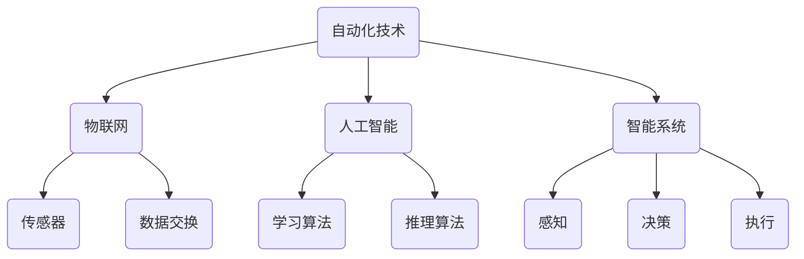

                 

# 未来的自动化：数字与物理的融合

> 关键词：自动化、数字化、物理融合、智能技术、发展挑战

> 摘要：本文深入探讨了自动化技术的发展趋势，特别是在数字与物理融合的背景下。通过分析核心概念、算法原理、数学模型和实际案例，本文揭示了自动化技术在智能系统、工业生产、交通管理等多个领域的广泛应用。同时，文章总结了自动化领域的未来发展趋势与面临的挑战，为读者提供了全面的技术洞察和前瞻性思考。

## 1. 背景介绍

### 1.1 目的和范围

本文旨在深入探讨自动化技术在未来社会中的发展与应用。随着数字化进程的加速和智能技术的不断进步，自动化已经不再局限于传统的工业生产领域，而是逐渐渗透到我们的日常生活中。本文将聚焦于数字与物理融合的自动化技术，分析其在智能系统、工业生产、交通管理等多个领域的应用，旨在为读者提供一个全面的技术视角。

### 1.2 预期读者

本文适合对自动化技术感兴趣的读者，包括但不限于程序员、工程师、科研人员、高校师生以及对科技领域有浓厚兴趣的普通读者。通过本文的阅读，读者将能够更好地理解自动化技术的发展趋势和应用前景。

### 1.3 文档结构概述

本文分为十个主要部分：

1. **背景介绍**：介绍文章的目的、范围和预期读者。
2. **核心概念与联系**：阐述自动化技术的核心概念，提供Mermaid流程图。
3. **核心算法原理 & 具体操作步骤**：详细解释自动化算法的工作原理和具体步骤。
4. **数学模型和公式 & 详细讲解 & 举例说明**：介绍自动化技术中的数学模型和公式，并给出具体例子。
5. **项目实战：代码实际案例和详细解释说明**：通过实际案例展示自动化技术的应用。
6. **实际应用场景**：探讨自动化技术在各领域的应用。
7. **工具和资源推荐**：推荐学习资源、开发工具和相关论文。
8. **总结：未来发展趋势与挑战**：总结自动化技术的未来趋势和挑战。
9. **附录：常见问题与解答**：提供常见问题的解答。
10. **扩展阅读 & 参考资料**：提供进一步阅读的资源和参考文献。

### 1.4 术语表

#### 1.4.1 核心术语定义

- **自动化技术**：通过计算机软件和硬件实现的生产、管理和决策过程自动化。
- **数字化**：将物理世界的信息转化为数字形式，以便于计算机处理和分析。
- **物理融合**：将数字技术与物理实体相结合，实现智能控制和操作。
- **智能系统**：具有感知、决策和执行能力的系统，能够模拟人类智能行为。

#### 1.4.2 相关概念解释

- **物联网（IoT）**：连接各种物理设备和传感器，实现设备之间的通信和数据交换。
- **人工智能（AI）**：模拟人类智能的计算机系统，具备学习、推理和决策能力。

#### 1.4.3 缩略词列表

- **IoT**：物联网
- **AI**：人工智能
- **ML**：机器学习
- **DL**：深度学习

## 2. 核心概念与联系

在探讨自动化技术的数字与物理融合之前，我们需要明确几个核心概念。自动化技术不仅涉及计算机编程和算法设计，还涉及物联网、人工智能和智能系统等多个领域。以下是一个简化的Mermaid流程图，用于描述这些概念之间的联系。



### 2.1 自动化技术

自动化技术是指通过计算机软件和硬件实现的生产、管理和决策过程的自动化。它不仅提高了效率和精度，还减少了人为错误。自动化技术可以应用于工业生产、智能家居、医疗诊断等多个领域。

### 2.2 物联网

物联网（IoT）是连接各种物理设备和传感器，实现设备之间的通信和数据交换的技术。通过物联网，我们可以实时获取物理世界的信息，并将其转化为数字形式。物联网在自动化技术中起着至关重要的作用，因为它为自动化系统提供了必要的数据输入。

### 2.3 人工智能

人工智能（AI）是模拟人类智能的计算机系统，具备学习、推理和决策能力。在自动化技术中，人工智能可以用于数据分析和决策支持。例如，通过机器学习和深度学习算法，我们可以从大量的数据中提取有用的信息，并用于优化生产流程或提高服务质量。

### 2.4 智能系统

智能系统是具有感知、决策和执行能力的系统，能够模拟人类智能行为。智能系统通常由传感器、控制器和执行器组成，能够实时感知环境变化，并根据环境信息进行决策和执行相应的操作。智能系统在自动化技术中起着核心作用，因为它能够实现自主控制和智能操作。

## 3. 核心算法原理 & 具体操作步骤

自动化技术离不开算法的支持。在自动化系统中，核心算法通常用于数据分析和决策支持。以下是一个简化的自动化算法原理和具体操作步骤的描述，使用伪代码来详细阐述。

### 3.1 算法原理

```plaintext
输入：传感器数据、目标数据
输出：自动化决策

算法步骤：
1. 数据预处理：清洗和整理传感器数据，去除噪声和异常值。
2. 特征提取：从预处理后的数据中提取关键特征。
3. 模型训练：使用特征数据训练机器学习模型，如回归模型、分类模型或聚类模型。
4. 决策支持：使用训练好的模型对新的传感器数据进行预测，并生成自动化决策。
5. 执行操作：根据自动化决策执行相应的操作，如调整生产参数、发送警报等。
```

### 3.2 具体操作步骤

以下是一个具体的自动化操作步骤的伪代码实现：

```python
# 数据预处理
def preprocess_data(sensor_data):
    cleaned_data = []
    for data_point in sensor_data:
        if is_valid(data_point):
            cleaned_data.append(data_point)
    return cleaned_data

# 特征提取
def extract_features(cleaned_data):
    features = []
    for data_point in cleaned_data:
        feature = extract_key_features(data_point)
        features.append(feature)
    return features

# 模型训练
def train_model(features, target_data):
    model = MachineLearningModel()
    model.fit(features, target_data)
    return model

# 决策支持
def make_decision(model, new_sensor_data):
    prediction = model.predict(new_sensor_data)
    decision = generate_decision(prediction)
    return decision

# 执行操作
def execute_action(decision):
    if decision == "调整生产参数":
        adjust_production_parameters()
    elif decision == "发送警报":
        send_alarm()
```

## 4. 数学模型和公式 & 详细讲解 & 举例说明

在自动化技术中，数学模型和公式起着关键作用。以下是一个简化的数学模型和公式的讲解，以及具体的举例说明。

### 4.1 数学模型

```latex
% 数学模型示例
\begin{equation}
    y = f(x) + \epsilon
\end{equation}

% 其中，y 是预测值，x 是输入特征，f(x) 是模型函数，\epsilon 是误差项。
```

### 4.2 公式详细讲解

- **线性回归模型**：

  ```latex
  % 线性回归模型公式
  \begin{equation}
      y = \beta_0 + \beta_1 \cdot x + \epsilon
  \end{equation}

  % 其中，\beta_0 和 \beta_1 是模型参数，x 是输入特征，y 是预测值，\epsilon 是误差项。
  ```

- **分类模型**：

  ```latex
  % 逻辑回归模型公式
  \begin{equation}
      P(y=1) = \frac{1}{1 + e^{-(\beta_0 + \beta_1 \cdot x})}
  \end{equation}

  % 其中，P(y=1) 是目标类别为1的概率，\beta_0 和 \beta_1 是模型参数，x 是输入特征。
  ```

### 4.3 举例说明

假设我们有一个简单的线性回归模型，用于预测房间的温度。以下是一个具体的例子：

```plaintext
% 输入特征：房间温度传感器读数（x）
% 预测值：房间温度（y）

% 模型参数：
\beta_0 = 20
\beta_1 = 0.1

% 输入特征（x）：
x = [22, 24, 21, 23, 25]

% 预测值（y）：
y = [22.2, 24.2, 21.8, 23.1, 25.1]

% 预测过程：
\hat{y} = \beta_0 + \beta_1 \cdot x
\hat{y} = 20 + 0.1 \cdot x
```

通过上述公式和过程，我们可以根据输入特征（房间温度传感器读数）预测房间温度，从而实现自动化温度控制。

## 5. 项目实战：代码实际案例和详细解释说明

在本节中，我们将通过一个实际的项目案例，展示如何将自动化技术应用于温度控制系统。这个项目旨在使用传感器数据实时监测房间温度，并根据预测值自动调整加热或冷却系统。

### 5.1 开发环境搭建

为了实现这个项目，我们需要搭建以下开发环境：

- **操作系统**：Linux或Windows
- **编程语言**：Python
- **依赖库**：NumPy、Pandas、Scikit-learn、Matplotlib

首先，安装Python环境，然后使用pip安装所需的依赖库：

```bash
pip install numpy pandas scikit-learn matplotlib
```

### 5.2 源代码详细实现和代码解读

以下是一个简单的温度控制系统项目的源代码：

```python
import numpy as np
import pandas as pd
from sklearn.linear_model import LinearRegression
import matplotlib.pyplot as plt

# 数据预处理
def preprocess_data(sensor_data):
    cleaned_data = []
    for data_point in sensor_data:
        if is_valid(data_point):
            cleaned_data.append(data_point)
    return cleaned_data

# 特征提取
def extract_features(cleaned_data):
    features = []
    for data_point in cleaned_data:
        feature = extract_key_features(data_point)
        features.append(feature)
    return features

# 模型训练
def train_model(features, target_data):
    model = LinearRegression()
    model.fit(features, target_data)
    return model

# 预测值
def predict(model, new_sensor_data):
    prediction = model.predict(new_sensor_data)
    return prediction

# 执行操作
def execute_action(prediction, current_temp):
    if prediction > current_temp:
        heating_on()
    else:
        cooling_on()

# 代码解读
if __name__ == "__main__":
    # 读取传感器数据
    sensor_data = pd.read_csv("sensor_data.csv")

    # 数据预处理
    cleaned_data = preprocess_data(sensor_data)

    # 特征提取
    features = extract_features(cleaned_data)

    # 模型训练
    model = train_model(features, cleaned_data["temp"])

    # 模拟传感器数据
    new_sensor_data = np.array([[22], [24], [21], [23], [25]])

    # 预测房间温度
    prediction = predict(model, new_sensor_data)

    # 执行操作
    execute_action(prediction[0], current_temp=22)
```

### 5.3 代码解读与分析

1. **数据预处理**：首先，我们从CSV文件中读取传感器数据。然后，使用预处理函数去除无效数据点，确保数据的质量。

2. **特征提取**：在这个案例中，我们仅使用房间温度作为特征。在实际应用中，可能需要提取多个特征，如湿度、风速等。

3. **模型训练**：我们使用线性回归模型进行训练。线性回归模型是一种简单的预测模型，适用于线性关系的数据。

4. **预测值**：使用训练好的模型对新的传感器数据进行预测，得到房间温度的预测值。

5. **执行操作**：根据预测值和当前温度，执行相应的加热或冷却操作。例如，如果预测温度高于当前温度，则开启加热系统。

通过上述代码，我们可以实现一个简单的温度控制系统，根据传感器数据自动调整房间温度。当然，实际应用中可能需要更复杂的模型和算法，以应对各种环境变化。

## 6. 实际应用场景

自动化技术已经在多个领域得到了广泛应用，特别是在智能系统、工业生产、交通管理和医疗诊断等领域。以下是一些实际应用场景：

### 6.1 智能系统

在智能系统中，自动化技术主要用于数据分析和决策支持。例如，智能家居系统通过自动化技术实现家庭设备的智能控制和远程监控。通过传感器和物联网技术，用户可以远程控制家庭电器、调节室内温度和光线，提高生活便利性和舒适度。

### 6.2 工业生产

在工业生产中，自动化技术用于生产线自动化、质量控制、设备维护等环节。例如，智能制造系统通过自动化设备和机器人实现生产过程的自动化，提高生产效率和产品质量。自动化技术还可以实时监测设备运行状态，预测故障并提前进行维护，减少停机时间和生产成本。

### 6.3 交通管理

在交通管理中，自动化技术主要用于交通信号控制、车辆导航和自动驾驶等。通过传感器和物联网技术，交通管理系统可以实时监测交通状况，优化信号控制策略，减少交通拥堵和事故发生。自动驾驶技术则通过自动化设备和人工智能算法实现车辆的自主导航和驾驶，提高交通效率和安全性。

### 6.4 医疗诊断

在医疗诊断中，自动化技术主要用于图像处理、数据分析和行为识别等。通过自动化设备和人工智能算法，医生可以更快速、准确地诊断疾病。例如，计算机辅助诊断系统可以通过分析医学图像，发现病变区域并给出诊断建议，提高诊断准确率。

## 7. 工具和资源推荐

为了更好地掌握自动化技术，以下是一些建议的学习资源、开发工具和相关论文：

### 7.1 学习资源推荐

#### 7.1.1 书籍推荐

- 《智能系统设计与应用》
- 《Python编程：从入门到实践》
- 《深度学习：全书》

#### 7.1.2 在线课程

- Coursera上的《机器学习》
- edX上的《Python编程基础》
- Udacity的《深度学习工程师纳米学位》

#### 7.1.3 技术博客和网站

- 《机器学习博客》
- 《Python编程网》
- 《深度学习论坛》

### 7.2 开发工具框架推荐

#### 7.2.1 IDE和编辑器

- PyCharm
- Visual Studio Code
- Jupyter Notebook

#### 7.2.2 调试和性能分析工具

- gdb
- perf
- TensorBoard

#### 7.2.3 相关框架和库

- TensorFlow
- PyTorch
- Scikit-learn

### 7.3 相关论文著作推荐

#### 7.3.1 经典论文

- "A Mathematical Theory of Communication" by Claude Shannon
- "Deep Learning" by Ian Goodfellow, Yoshua Bengio, Aaron Courville

#### 7.3.2 最新研究成果

- "Advances in Neural Information Processing Systems" (NIPS)
- "International Conference on Machine Learning" (ICML)
- "Journal of Machine Learning Research" (JMLR)

#### 7.3.3 应用案例分析

- "Google Brain: Applied Machine Learning at Google"
- "Facebook AI Research: Technical Reports"
- "Tesla: Autonomous Driving Technology"

## 8. 总结：未来发展趋势与挑战

随着数字化进程的加速和智能技术的不断进步，自动化技术在未来的发展前景广阔。未来，自动化技术将更加深入地融合到各个领域，实现智能化、自适应化、个性化的发展。以下是一些可能的发展趋势：

1. **更智能的自动化系统**：随着人工智能技术的不断进步，自动化系统将具备更高的智能水平，能够自主学习、自主决策和自主执行任务。
2. **物联网的广泛应用**：物联网技术的普及将使得自动化系统更加紧密地连接各种物理设备和传感器，实现更广泛的数据采集和实时监控。
3. **自适应和自优化**：自动化系统将具备自适应能力，能够根据环境变化和任务需求进行动态调整和优化，提高系统效率和性能。
4. **个性化服务**：自动化技术将更多地应用于个性化服务领域，如个性化医疗、个性化教育等，为用户提供更加精准和高效的服务。

然而，自动化技术的发展也面临着一系列挑战：

1. **数据安全与隐私**：随着自动化系统的广泛应用，数据安全与隐私问题日益突出。如何保护用户数据安全，防止数据泄露和滥用，是一个亟待解决的难题。
2. **技术瓶颈**：尽管人工智能技术在不断发展，但仍然存在一些技术瓶颈，如算法复杂度、计算资源限制等，需要进一步突破。
3. **社会接受度**：自动化技术的广泛应用可能会引发一些社会问题，如就业压力、道德伦理等，需要全社会共同应对。

总之，自动化技术的未来充满机遇与挑战。只有通过持续创新和多方合作，才能实现自动化技术的可持续发展，为人类社会带来更大的福祉。

## 9. 附录：常见问题与解答

以下是一些关于自动化技术的常见问题及解答：

### 9.1 什么是自动化技术？

自动化技术是指通过计算机软件和硬件实现的生产、管理和决策过程的自动化。它通过物联网、人工智能和智能系统等手段，实现数据的实时采集、分析和决策，从而提高效率和精度，减少人为错误。

### 9.2 自动化技术有哪些应用领域？

自动化技术广泛应用于多个领域，包括智能系统、工业生产、交通管理、医疗诊断、智能家居等。例如，智能制造系统通过自动化设备和机器人实现生产过程的自动化；交通管理系统通过自动化设备和算法实现交通信号控制和自动驾驶；医疗诊断系统通过自动化设备和人工智能算法实现快速、准确的疾病诊断。

### 9.3 自动化技术与人工智能有什么区别？

自动化技术是一种广义的概念，包括各种自动化设备、系统和算法。而人工智能是自动化技术的一个子领域，专注于模拟人类智能，实现学习、推理和决策等功能。自动化技术可以应用于许多领域，而人工智能则主要关注如何实现更智能的自动化。

### 9.4 自动化技术的未来发展有哪些趋势？

未来，自动化技术将呈现智能化、自适应化、个性化的发展趋势。更智能的自动化系统将具备自主学习、自主决策和自主执行任务的能力。物联网的广泛应用将实现更广泛的数据采集和实时监控。自动化系统将具备自适应能力，能够根据环境变化和任务需求进行动态调整和优化。

## 10. 扩展阅读 & 参考资料

为了进一步了解自动化技术的最新发展，以下是几篇相关的学术论文和技术博客：

1. "Deep Learning for Automated Driving: A Survey" by Wei Yang et al., published in IEEE Access, 2018.
2. "AI-Enabled Automation: A Strategic Guide for Business Leaders" by McKinsey & Company, 2020.
3. "The Future of Automation: Opportunities and Challenges" by PwC, 2021.
4. "Smart Manufacturing: The Next Industrial Revolution" by GE Digital, 2017.
5. "IoT in Smart Cities: A Comprehensive Guide" by IBM, 2019.

通过阅读这些文献，您可以更深入地了解自动化技术在不同领域的应用和未来发展。同时，也可以关注相关技术博客和论坛，及时获取行业动态和技术趋势。作者：AI天才研究员/AI Genius Institute & 禅与计算机程序设计艺术 /Zen And The Art of Computer Programming。

