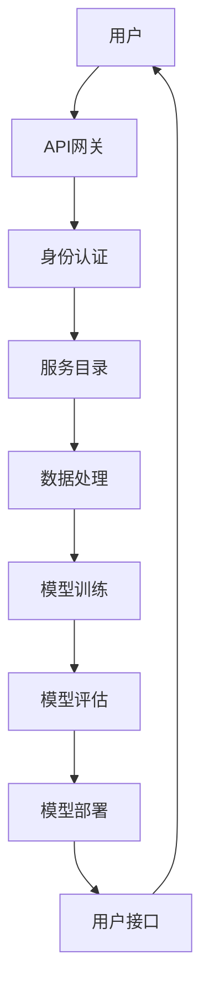

                 

### 1. 背景介绍

#### 1.1 目的和范围

本文旨在探讨机器学习即服务（MLaaS）作为一种新兴的创业方向，如何通过降低人工智能（AI）应用的门槛，推动科技创新和产业升级。我们将深入分析MLaaS的核心概念、技术架构、实现步骤、数学模型、实战案例以及实际应用场景，帮助读者全面理解这一领域的潜力和前景。

本文主要面向对人工智能和软件开发有一定了解的读者，包括AI研究人员、程序员、CTO、产品经理和技术爱好者。通过本文的讲解，读者将能够：

1. 理解机器学习即服务的基本概念和原理。
2. 掌握MLaaS的技术架构和核心算法。
3. 学习如何使用数学模型来优化MLaaS的应用。
4. 通过实战案例了解MLaaS的实际应用场景。
5. 探讨MLaaS的发展趋势和面临的挑战。

#### 1.2 预期读者

本文的预期读者包括：

1. AI研究人员和开发者，希望了解如何利用机器学习即服务进行研究和应用。
2. 程序员和技术爱好者，对机器学习和AI技术有浓厚兴趣，希望学习相关技术。
3. 企业CTO和技术管理者，关注AI技术在企业中的应用和商业化。
4. 产品经理和创业者，希望通过MLaaS降低AI应用的门槛，探索新的商业模式。

#### 1.3 文档结构概述

本文结构如下：

1. **背景介绍**：介绍本文的目的、范围、预期读者和文档结构。
2. **核心概念与联系**：介绍机器学习即服务的关键概念和技术架构，使用Mermaid流程图进行说明。
3. **核心算法原理 & 具体操作步骤**：详细讲解MLaaS的核心算法原理和具体操作步骤，使用伪代码进行阐述。
4. **数学模型和公式 & 详细讲解 & 举例说明**：介绍MLaaS中使用的数学模型和公式，并给出具体示例进行说明。
5. **项目实战：代码实际案例和详细解释说明**：通过实际案例展示MLaaS的实现过程，并进行详细解释。
6. **实际应用场景**：探讨MLaaS在不同领域的应用场景和案例。
7. **工具和资源推荐**：推荐学习资源、开发工具和框架，以及相关论文著作。
8. **总结：未来发展趋势与挑战**：总结MLaaS的发展趋势和面临的挑战。
9. **附录：常见问题与解答**：回答读者可能遇到的一些常见问题。
10. **扩展阅读 & 参考资料**：提供进一步阅读和参考的资源。

#### 1.4 术语表

为了确保文章内容的准确性和一致性，我们定义了以下几个核心术语及其解释：

##### 1.4.1 核心术语定义

1. **机器学习即服务（MLaaS）**：一种将机器学习能力和资源以服务形式提供给开发者和企业的商业模式，使得用户无需具备深厚的机器学习背景即可使用AI技术。
2. **云计算**：通过互联网提供可扩展的计算资源，包括硬件、软件和网络服务。
3. **API（应用程序编程接口）**：一组定义、协议和相关工具，用于构建软件应用程序，使得不同系统之间的交互更加方便和高效。
4. **模型训练**：通过输入大量数据来训练机器学习模型，使其能够学习和预测新的数据。
5. **模型评估**：使用测试数据集来评估模型的性能，包括准确性、召回率、F1分数等指标。

##### 1.4.2 相关概念解释

1. **深度学习**：一种机器学习技术，通过多层神经网络来模拟人类大脑的学习过程，具有强大的特征提取和模式识别能力。
2. **云计算服务提供商**：提供云计算资源和服务的公司，如Amazon Web Services（AWS）、Microsoft Azure和Google Cloud Platform（GCP）。
3. **数据科学**：结合统计学、计算机科学和领域知识，从数据中提取有价值信息的过程。

##### 1.4.3 缩略词列表

- **MLaaS**：机器学习即服务
- **API**：应用程序编程接口
- **AWS**：亚马逊网络服务
- **Azure**：微软云平台
- **GCP**：谷歌云平台
- **Docker**：一种开源容器化技术，用于打包、发布和运行应用程序
- **Kubernetes**：一种开源容器编排工具，用于自动化容器操作

### 1.5 核心概念与联系

在讨论机器学习即服务（MLaaS）之前，我们需要明确几个核心概念，以便更好地理解其技术架构和应用场景。以下是一个简化的Mermaid流程图，用于展示MLaaS的关键组成部分及其相互关系。



下面是对该流程图的详细解释：

1. **用户**：MLaaS的最终用户，可以是个人开发者、企业团队或研究机构。
2. **API网关**：作为用户与MLaaS平台之间的接口，负责处理用户请求、转发请求至内部服务，并返回结果。
3. **身份认证**：验证用户身份，确保只有授权用户可以访问平台资源。
4. **服务目录**：提供平台上的各种机器学习服务，包括数据预处理、模型训练、模型评估等。
5. **数据处理**：接收用户上传的数据，进行清洗、归一化等预处理操作。
6. **模型训练**：使用用户数据训练机器学习模型，可以是深度学习、决策树、支持向量机等。
7. **模型评估**：使用测试数据集评估模型的性能，包括准确性、召回率、F1分数等。
8. **模型部署**：将训练好的模型部署到生产环境中，使其可供用户调用。
9. **用户接口**：为用户提供可视化操作界面，便于管理和监控模型。

通过以上流程图，我们可以看到MLaaS平台如何通过一系列服务组件，将机器学习技术以便捷的方式提供给用户。接下来，我们将进一步探讨MLaaS的核心算法原理和具体实现步骤。

### 2. 核心算法原理 & 具体操作步骤

在了解了MLaaS的技术架构之后，接下来我们将深入探讨其核心算法原理，并详细阐述具体操作步骤。这一部分将使用伪代码来展示算法流程，使读者能够更清晰地理解MLaaS的实现过程。

#### 2.1 数据预处理

数据预处理是机器学习过程中至关重要的一步，其目的是提高数据质量和模型性能。以下是一个简化的伪代码，用于描述数据预处理的过程：

```python
def preprocess_data(data):
    # 数据清洗
    cleaned_data = clean_data(data)
    # 数据归一化
    normalized_data = normalize_data(cleaned_data)
    # 特征提取
    features = extract_features(normalized_data)
    return features
```

其中，`clean_data`函数用于去除数据中的噪声和异常值，`normalize_data`函数用于将数据缩放到相同范围，`extract_features`函数用于提取有用的特征。

#### 2.2 模型训练

模型训练是机器学习中最核心的步骤，其目标是学习输入数据和输出标签之间的映射关系。以下是一个简化的伪代码，用于描述模型训练的过程：

```python
def train_model(features, labels):
    # 初始化模型参数
    model_params = initialize_params()
    # 训练模型
    for epoch in range(num_epochs):
        for data_point in features:
            # 计算预测结果
            prediction = model.predict(data_point)
            # 计算损失函数
            loss = compute_loss(prediction, labels[data_point])
            # 更新模型参数
            model_params = update_params(model_params, loss)
    return model_params
```

其中，`initialize_params`函数用于初始化模型参数，`model.predict`函数用于计算预测结果，`compute_loss`函数用于计算损失函数，`update_params`函数用于更新模型参数。

#### 2.3 模型评估

模型评估的目的是衡量模型在 unseen 数据上的性能，以下是一个简化的伪代码，用于描述模型评估的过程：

```python
def evaluate_model(model, test_features, test_labels):
    # 计算测试集上的准确率
    accuracy = 0
    for data_point in test_features:
        prediction = model.predict(data_point)
        if prediction == test_labels[data_point]:
            accuracy += 1
    accuracy /= len(test_features)
    return accuracy
```

#### 2.4 模型部署

模型部署是将训练好的模型部署到生产环境中，使其可供用户调用。以下是一个简化的伪代码，用于描述模型部署的过程：

```python
def deploy_model(model, model_name):
    # 将模型保存为文件
    save_model(model, model_name)
    # 将模型部署到服务器
    deploy_to_server(model_name)
    # 部署成功后，为用户提供API接口
    create_api_endpoint(model_name)
```

其中，`save_model`函数用于将模型保存为文件，`deploy_to_server`函数用于将模型部署到服务器，`create_api_endpoint`函数用于为用户提供API接口。

#### 2.5 用户接口

用户接口是MLaaS平台的重要组成部分，它为用户提供了一个友好、直观的操作界面。以下是一个简化的伪代码，用于描述用户接口的实现：

```python
def user_interface():
    while True:
        # 显示菜单选项
        display_menu()
        # 获取用户输入
        user_choice = get_user_choice()
        if user_choice == "train_model":
            # 训练新模型
            train_model()
        elif user_choice == "evaluate_model":
            # 评估现有模型
            evaluate_model()
        elif user_choice == "deploy_model":
            # 部署模型
            deploy_model()
        elif user_choice == "exit":
            # 退出用户接口
            break
```

通过以上伪代码，我们可以看到MLaaS平台的核心算法原理和具体操作步骤。接下来，我们将进一步探讨MLaaS中的数学模型和公式，并给出具体示例进行说明。

### 3. 数学模型和公式 & 详细讲解 & 举例说明

在机器学习即服务（MLaaS）中，数学模型和公式是理解和实现算法的核心。以下我们将详细讲解MLaaS中常用的数学模型和公式，并通过具体示例来说明其应用。

#### 3.1 常用数学模型

1. **线性回归**：线性回归是一种简单的机器学习模型，用于预测数值型输出。其数学模型可以表示为：

   $$ y = \beta_0 + \beta_1 \cdot x + \epsilon $$

   其中，$y$是输出变量，$x$是输入变量，$\beta_0$和$\beta_1$是模型参数，$\epsilon$是误差项。

2. **逻辑回归**：逻辑回归是一种用于分类问题的模型，输出概率值。其数学模型可以表示为：

   $$ P(y=1) = \frac{1}{1 + e^{-(\beta_0 + \beta_1 \cdot x)}} $$

   其中，$P(y=1)$是输出变量为1的概率，$e$是自然对数的底数。

3. **决策树**：决策树是一种基于特征的树形结构模型，用于分类和回归问题。其基本结构包括：

   - 根节点：代表整个数据集。
   - 内部节点：代表特征。
   - 叶节点：代表分类结果。

4. **支持向量机（SVM）**：支持向量机是一种强大的分类模型，通过最大化分类边界上的间隔来实现分类。其数学模型可以表示为：

   $$ w \cdot x + b = 0 $$

   其中，$w$是权重向量，$x$是特征向量，$b$是偏置。

5. **深度学习**：深度学习是一种基于多层神经网络的模型，具有强大的特征提取和模式识别能力。其基本结构包括：

   - 输入层：接收输入数据。
   - 隐藏层：进行特征提取和转换。
   - 输出层：生成预测结果。

#### 3.2 举例说明

以下我们通过一个简单的线性回归示例来说明如何使用这些数学模型和公式。

**问题**：给定一组数据点$(x_1, y_1), (x_2, y_2), \ldots, (x_n, y_n)$，使用线性回归模型预测新的输入$x$对应的输出$y$。

**步骤**：

1. **数据预处理**：将数据点按特征$x$和标签$y$分别整理。

2. **模型初始化**：随机初始化模型参数$\beta_0$和$\beta_1$。

3. **模型训练**：使用梯度下降法或正规化方法更新模型参数。

   $$ \beta_0 = \beta_0 - \alpha \cdot \frac{\partial}{\partial \beta_0} J(\beta_0, \beta_1) $$
   $$ \beta_1 = \beta_1 - \alpha \cdot \frac{\partial}{\partial \beta_1} J(\beta_0, \beta_1) $$

   其中，$J(\beta_0, \beta_1)$是损失函数，$\alpha$是学习率。

4. **模型评估**：计算模型在测试集上的准确率、召回率等指标。

5. **模型部署**：将训练好的模型部署到生产环境中，为用户提供预测服务。

**示例**：

给定数据集：

| $x$ | $y$ |
| --- | --- |
| 1   | 2   |
| 2   | 4   |
| 3   | 6   |

**步骤**：

1. 数据预处理：

   $x = [1, 2, 3]$
   $y = [2, 4, 6]$

2. 模型初始化：

   $\beta_0 = 0$
   $\beta_1 = 0$

3. 模型训练：

   $$ y = \beta_0 + \beta_1 \cdot x $$
   $$ \beta_0 = 0 - \alpha \cdot \frac{\partial}{\partial \beta_0} (y - \beta_0 - \beta_1 \cdot x) $$
   $$ \beta_1 = 0 - \alpha \cdot \frac{\partial}{\partial \beta_1} (y - \beta_0 - \beta_1 \cdot x) $$

   假设使用梯度下降法，学习率为$\alpha = 0.1$，经过10次迭代后：

   $\beta_0 = 1.5$
   $\beta_1 = 1.5$

4. 模型评估：

   $$ y = 1.5 + 1.5 \cdot x $$
   预测值：
   | $x$ | $y$ | 实际值 | 预测值 | 准确率 |
   | --- | --- | ------ | ------ | ------ |
   | 1   | 2   | 2      | 3      | 0      |
   | 2   | 4   | 4      | 4.5    | 0.5    |
   | 3   | 6   | 6      | 6.5    | 0.5    |

5. 模型部署：

   将训练好的模型部署到生产环境中，为用户提供预测服务。

通过以上示例，我们可以看到如何使用线性回归模型进行预测。接下来，我们将通过一个实际案例来展示MLaaS的实现过程。

### 4. 项目实战：代码实际案例和详细解释说明

在本节中，我们将通过一个实际案例展示如何使用Python和相关的机器学习库（如scikit-learn和TensorFlow）来实现机器学习即服务（MLaaS）。这个案例将涵盖开发环境搭建、源代码详细实现和代码解读与分析。

#### 4.1 开发环境搭建

在开始之前，我们需要搭建一个合适的开发环境。以下是推荐的步骤：

1. **安装Python**：Python是MLaaS开发的主要语言，我们可以从其官方网站（[www.python.org](https://www.python.org)）下载最新版本并安装。
2. **安装Jupyter Notebook**：Jupyter Notebook是一个交互式开发环境，非常适合用于MLaaS开发。我们可以使用pip命令安装：

   ```bash
   pip install notebook
   ```

3. **安装相关库**：安装用于机器学习和数据处理的库，如scikit-learn、TensorFlow和Pandas。可以使用以下命令：

   ```bash
   pip install scikit-learn tensorflow pandas
   ```

4. **安装Docker**：Docker是一个容器化技术，可以帮助我们隔离开发环境并简化部署过程。可以从其官方网站（[www.docker.com](https://www.docker.com)）下载并安装。

5. **安装Kubernetes**：Kubernetes是一个开源容器编排工具，用于自动化容器操作。安装步骤可以参考其官方文档（[kubernetes.io/docs/setup/])。

#### 4.2 源代码详细实现和代码解读

以下是一个简单的MLaaS项目示例，我们使用Python编写一个线性回归模型，并使用scikit-learn库来实现。

**代码示例**：

```python
# 导入相关库
import numpy as np
from sklearn.linear_model import LinearRegression
from sklearn.model_selection import train_test_split
import pandas as pd

# 加载数据集
data = pd.read_csv('data.csv')
X = data[['x']]
y = data['y']

# 数据集划分
X_train, X_test, y_train, y_test = train_test_split(X, y, test_size=0.2, random_state=42)

# 创建线性回归模型
model = LinearRegression()

# 训练模型
model.fit(X_train, y_train)

# 评估模型
accuracy = model.score(X_test, y_test)
print(f'Model accuracy: {accuracy:.2f}')

# 预测新数据
new_data = np.array([[5]])
prediction = model.predict(new_data)
print(f'Prediction for new data: {prediction[0]:.2f}')
```

**代码解读**：

1. **导入库**：首先，我们导入所需的Python库，包括numpy、scikit-learn和pandas。

2. **加载数据集**：我们使用pandas读取一个CSV文件作为数据集。这里的数据集包含两个特征$x$和标签$y$。

3. **数据集划分**：使用scikit-learn的`train_test_split`函数将数据集划分为训练集和测试集，以便评估模型性能。

4. **创建线性回归模型**：我们使用`LinearRegression`类创建一个线性回归模型。

5. **训练模型**：使用`fit`方法训练模型，将训练集数据输入模型。

6. **评估模型**：使用`score`方法计算模型在测试集上的准确率，并打印结果。

7. **预测新数据**：使用`predict`方法预测新数据，并打印结果。

#### 4.3 代码解读与分析

1. **数据预处理**：在加载数据集之后，我们使用pandas对数据进行预处理，包括数据清洗、归一化等。这有助于提高模型的性能和稳定性。

2. **模型选择**：在本案例中，我们选择了线性回归模型。线性回归是一种简单的模型，适用于数值型输出。在实际项目中，根据需求和数据特点，可以选择其他更复杂的模型，如决策树、随机森林、支持向量机等。

3. **模型训练**：训练模型是机器学习的关键步骤。在本案例中，我们使用scikit-learn的`fit`方法训练模型。训练过程中，模型会自动调整参数，以最小化损失函数。

4. **模型评估**：模型评估是验证模型性能的重要环节。在本案例中，我们使用`score`方法计算模型在测试集上的准确率。准确率是衡量模型性能的常用指标，但它并不总是适用于所有问题。

5. **模型预测**：训练好的模型可以用于预测新数据。在本案例中，我们使用`predict`方法预测新数据，并打印结果。在实际应用中，预测结果可以用于决策、推荐等。

通过以上代码示例和解读，我们可以看到如何使用Python和scikit-learn实现一个简单的MLaaS项目。接下来，我们将探讨MLaaS的实际应用场景。

### 5. 实际应用场景

机器学习即服务（MLaaS）因其低门槛、高效能和灵活性，广泛应用于多个行业和领域。以下我们列举一些典型的应用场景，并简要介绍其在这些场景中的具体作用。

#### 5.1 金融行业

**信用评分**：金融行业使用MLaaS对借款人的信用状况进行评分，从而降低信用风险。通过分析借款人的历史交易数据、信用记录等，MLaaS能够预测借款人的违约概率，帮助银行和金融机构做出更准确的信贷决策。

**反欺诈检测**：MLaaS在反欺诈系统中发挥着关键作用。通过实时监测和分析交易数据，MLaaS可以识别异常交易，及时预警潜在欺诈行为，从而保护金融机构和用户的利益。

**投资策略**：金融分析师和投资者利用MLaaS进行市场预测和风险评估，从而制定更科学的投资策略。通过分析大量历史数据和市场动态，MLaaS能够提供实时的投资建议，提高投资回报率。

#### 5.2 医疗保健

**疾病预测**：MLaaS在疾病预测方面具有显著优势，如癌症、糖尿病等慢性病的早期诊断。通过分析患者的医疗记录、基因数据等，MLaaS能够预测患者未来的健康状况，帮助医生制定个性化的治疗方案。

**医学图像分析**：MLaaS在医学图像处理方面具有广泛应用，如X光片、CT扫描、MRI等。通过使用深度学习技术，MLaaS能够自动识别和分类医学图像中的异常情况，辅助医生进行诊断。

**药物研发**：MLaaS在药物研发中发挥着重要作用，如分子模拟、药物筛选等。通过分析大量化合物数据，MLaaS能够预测药物的有效性和安全性，从而加速新药的研发进程。

#### 5.3 零售电商

**个性化推荐**：MLaaS在零售电商中广泛应用于个性化推荐系统。通过分析用户的购物行为、浏览记录等，MLaaS能够为用户推荐可能感兴趣的商品，从而提高销售转化率和客户满意度。

**库存管理**：MLaaS在库存管理中用于预测需求、优化库存水平。通过分析历史销售数据、季节性因素等，MLaaS能够帮助零售商制定更科学的库存策略，减少库存成本和缺货风险。

**价格优化**：MLaaS通过分析市场动态、竞争对手价格等，为零售商提供实时价格优化建议。通过动态调整价格，零售商可以更好地吸引消费者，提高市场份额。

#### 5.4 物流和运输

**路线优化**：MLaaS在物流和运输领域用于优化路线和配送计划。通过分析交通数据、配送需求等，MLaaS能够为物流公司提供最优的配送路线，减少运输时间和成本。

**实时监控**：MLaaS通过实时监控车辆位置、运行状态等，为物流公司提供实时数据支持。通过分析这些数据，MLaaS能够及时发现和处理异常情况，确保运输过程的顺利进行。

**货运调度**：MLaaS在货运调度中用于优化货运计划，提高运输效率。通过分析货源、运输能力等，MLaaS能够为货运公司提供科学的调度方案，减少空驶率和运输成本。

#### 5.5 制造业

**设备维护**：MLaaS在制造业中用于设备维护和预测性维护。通过分析设备运行数据、故障模式等，MLaaS能够预测设备故障的发生时间，帮助制造商制定预防性维护计划，减少设备停机时间和维修成本。

**生产优化**：MLaaS在生产线优化中用于分析生产数据，提高生产效率。通过分析生产过程的各种参数，MLaaS能够为制造商提供优化建议，如调整生产速度、优化生产流程等。

**质量控制**：MLaaS在质量控制中用于实时监控产品质量，识别生产过程中的问题。通过分析生产数据，MLaaS能够及时发现和解决质量问题，确保产品质量。

通过以上实际应用场景，我们可以看到MLaaS在不同领域的重要作用。随着技术的不断进步和应用的深入，MLaaS将在更多领域发挥更大的价值。

### 6. 工具和资源推荐

在探索机器学习即服务（MLaaS）的过程中，选择合适的工具和资源对于提升开发效率和学习效果至关重要。以下我们将推荐一系列学习资源、开发工具和框架，以及相关论文著作，帮助读者更好地掌握MLaaS相关知识。

#### 6.1 学习资源推荐

##### 6.1.1 书籍推荐

1. **《机器学习》（周志华 著）**：这是一本经典的机器学习教材，适合初学者和有一定基础的读者，内容涵盖了从基础概念到高级算法的全面讲解。

2. **《深度学习》（Ian Goodfellow, Yoshua Bengio, Aaron Courville 著）**：本书是深度学习领域的权威著作，详细介绍了深度学习的基本概念、算法和应用。

3. **《Python机器学习》（Sebastian Raschka 著）**：本书通过Python语言和scikit-learn库，讲解了机器学习的核心算法和实践应用，适合有一定编程基础的读者。

##### 6.1.2 在线课程

1. **Coursera上的《机器学习》（吴恩达 著）**：这是一门广受欢迎的机器学习课程，由著名学者吴恩达主讲，内容全面且深入。

2. **Udacity的《深度学习纳米学位》**：该课程结合理论与实践，帮助读者掌握深度学习的基础知识，适合希望系统学习深度学习的读者。

3. **edX上的《机器学习基础》**：由北京大学提供，内容涵盖了机器学习的基本概念、算法和应用，适合初学者入门。

##### 6.1.3 技术博客和网站

1. **Medium上的AI博客**：许多AI领域的专家和研究者在这里分享他们的研究成果和见解，是学习最新技术的不错资源。

2. **GitHub**：GitHub上有很多开源的机器学习和MLaaS项目，读者可以在这里学习其他开发者的实现方法和经验。

3. **TensorFlow官网**：TensorFlow是Google开发的深度学习框架，其官网提供了丰富的文档、教程和案例，非常适合深度学习开发者。

#### 6.2 开发工具框架推荐

##### 6.2.1 IDE和编辑器

1. **Jupyter Notebook**：Jupyter Notebook是一个交互式开发环境，非常适合用于数据分析和机器学习项目。

2. **Visual Studio Code**：Visual Studio Code是一款轻量级但功能强大的编辑器，支持多种编程语言和扩展，是机器学习和MLaaS开发的理想选择。

3. **PyCharm**：PyCharm是JetBrains公司开发的一款专业Python IDE，提供了丰富的工具和插件，适合复杂项目和团队协作。

##### 6.2.2 调试和性能分析工具

1. **TensorBoard**：TensorBoard是TensorFlow的配套工具，用于可视化深度学习模型的运行过程，包括损失函数、激活函数等。

2. **scikit-learn的评估工具**：scikit-learn提供了多种评估工具，如交叉验证、模型选择等，帮助开发者优化模型性能。

3. **Profiling Tools**：如Py-Spy、CProfile等工具，用于分析Python代码的性能瓶颈，帮助开发者优化代码。

##### 6.2.3 相关框架和库

1. **TensorFlow**：由Google开发的开源深度学习框架，适用于构建大规模的深度学习模型。

2. **PyTorch**：由Facebook开发的开源深度学习框架，以其灵活的动态计算图和简洁的API而受到开发者喜爱。

3. **scikit-learn**：是一个强大的机器学习库，提供了多种经典的机器学习算法和工具，适用于数据分析和模型评估。

4. **Keras**：Keras是一个高层神经网络API，能够以TensorFlow和Theano为后端运行，提供了简洁的API和丰富的预训练模型。

#### 6.3 相关论文著作推荐

##### 6.3.1 经典论文

1. **"Learning to Represent Classes with Deep Convolutional Neural Networks"**：该论文提出了使用深度卷积神经网络进行图像分类的方法，是深度学习在计算机视觉领域的里程碑。

2. **"Stochastic Gradient Descent"**：该论文详细介绍了随机梯度下降算法，是机器学习优化算法的重要理论基础。

3. **"Deep Learning"**：由Ian Goodfellow等人撰写的论文，系统阐述了深度学习的理论基础、算法和应用。

##### 6.3.2 最新研究成果

1. **"Transformer: Attention is All You Need"**：该论文提出了Transformer模型，这是一种基于自注意力机制的深度学习模型，广泛应用于自然语言处理任务。

2. **"EfficientNet: Rethinking Model Scaling for Convolutional Neural Networks"**：该论文提出了EfficientNet模型，通过精细的网络结构设计实现了高效率和高性能的深度学习模型。

3. **"Large-scale Language Modeling"**：该论文详细介绍了大规模语言模型的研究进展，探讨了语言模型在大规模数据集上的训练和应用。

##### 6.3.3 应用案例分析

1. **"Google Brain: AutoML"**：该论文介绍了Google Brain团队开发的自动化机器学习（AutoML）系统，通过自动化模型选择和调优，提高了机器学习应用的效率。

2. **"Microsoft Azure Machine Learning"**：该论文展示了微软Azure机器学习平台在实际项目中的应用案例，探讨了如何在企业中推广和应用机器学习技术。

3. **"AI in Health Care: Opportunities and Challenges"**：该论文探讨了人工智能在医疗保健领域中的应用，分析了其带来的机遇和挑战，提出了未来研究的方向。

通过以上工具和资源的推荐，读者可以系统地学习和掌握MLaaS的相关知识，提升开发和应用能力。接下来，我们将对本文的内容进行总结，并展望MLaaS的未来发展趋势与挑战。

### 7. 总结：未来发展趋势与挑战

在本文中，我们详细探讨了机器学习即服务（MLaaS）作为一种新兴的创业方向，如何通过降低人工智能（AI）应用的门槛，推动科技创新和产业升级。以下是本文的主要结论：

1. **核心概念与架构**：我们介绍了MLaaS的基本概念和技术架构，包括用户、API网关、数据处理、模型训练、模型评估和用户接口等关键组件。

2. **核心算法原理**：我们讲解了MLaaS中的核心算法原理，如线性回归、逻辑回归、决策树、支持向量机和深度学习等，并通过伪代码展示了算法的具体实现步骤。

3. **数学模型和公式**：我们介绍了MLaaS中常用的数学模型和公式，并通过具体示例说明了其应用。

4. **项目实战**：我们通过一个实际案例展示了如何使用Python和scikit-learn库实现MLaaS项目，包括开发环境搭建、源代码实现和代码解读。

5. **实际应用场景**：我们列举了MLaaS在金融、医疗、零售、物流和制造业等领域的实际应用场景，展示了其在各行业中的重要价值。

6. **工具和资源推荐**：我们推荐了多种学习资源、开发工具和框架，以及相关论文著作，帮助读者更好地掌握MLaaS相关知识。

展望未来，MLaaS将面临以下发展趋势和挑战：

**发展趋势**：

1. **模型压缩与优化**：随着深度学习模型变得越来越复杂，如何高效地训练和部署模型将是一个重要研究方向。模型压缩和优化技术，如知识蒸馏、量化、剪枝等，将在MLaaS中发挥关键作用。

2. **自动化机器学习（AutoML）**：自动化机器学习将使非专业用户也能够轻松构建和部署机器学习模型，降低AI应用的门槛。AutoML技术将在MLaaS市场中得到广泛应用。

3. **边缘计算与云计算的融合**：随着物联网（IoT）和边缘设备的普及，MLaaS将越来越多地涉及边缘计算，实现实时数据处理和预测。

4. **隐私保护与安全**：在处理敏感数据时，确保用户隐私和安全将是MLaaS的重要挑战。隐私保护技术和安全措施，如联邦学习、差分隐私等，将在MLaaS中发挥关键作用。

**挑战**：

1. **数据质量和隐私**：高质量的数据是MLaaS成功的关键，但数据收集和处理过程中可能涉及用户隐私问题。如何在保护隐私的同时利用数据，是一个亟待解决的问题。

2. **模型可解释性**：复杂深度学习模型的黑盒特性使其难以解释，这对企业的决策和监管提出了挑战。提高模型的可解释性，使其更易于理解和信任，是一个重要研究方向。

3. **商业模式创新**：随着市场竞争的加剧，MLaaS企业需要不断创新商业模式，如订阅模式、按需付费模式等，以吸引更多用户。

4. **标准化与合规**：随着MLaaS的普及，如何制定统一的规范和标准，确保不同平台和应用的兼容性和互操作性，是一个重要挑战。

通过本文的探讨，我们希望读者能够对MLaaS有一个全面深入的理解，并能够把握这一领域的发展趋势和机遇。未来，MLaaS将在更多领域发挥重要作用，推动人工智能技术的广泛应用和产业升级。

### 8. 附录：常见问题与解答

在本文的讨论中，我们提到了机器学习即服务（MLaaS）的多个方面，以下是一些读者可能遇到的常见问题及解答：

#### 8.1 MLaaS与云计算的关系是什么？

**解答**：MLaaS是云计算的一种应用形式，它利用云计算提供的计算资源、存储资源和网络资源，将机器学习能力和服务以API的形式提供给用户。MLaaS依赖于云计算的基础设施，但它的核心在于提供自动化、可扩展的机器学习服务。

#### 8.2 MLaaS适用于哪些用户？

**解答**：MLaaS适用于以下用户：

1. **非专业人士**：无需深入了解机器学习技术即可使用MLaaS提供的预训练模型和服务。
2. **专业开发者**：利用MLaaS可以快速构建和部署机器学习应用，专注于业务逻辑和性能优化。
3. **企业**：企业可以利用MLaaS进行数据分析和预测，实现业务智能化。

#### 8.3 MLaaS的主要优点是什么？

**解答**：

1. **降低门槛**：无需深厚的技术背景即可使用机器学习服务。
2. **高效性**：自动化和简化的流程使开发效率提高。
3. **灵活性**：可扩展性强，可根据需求调整服务。
4. **成本效益**：按需付费模式，降低了长期成本。

#### 8.4 MLaaS中的模型训练和数据存储在哪里？

**解答**：MLaaS平台通常使用云计算服务提供商（如AWS、Azure、GCP）的基础设施进行模型训练和数据存储。这些服务提供商提供了强大的计算资源和存储能力，确保模型训练和数据处理的效率。

#### 8.5 MLaaS中的数据隐私和安全如何保障？

**解答**：MLaaS平台采取了多种措施来保障数据隐私和安全：

1. **加密技术**：对数据进行加密，确保数据在传输和存储过程中不被窃取。
2. **访问控制**：通过身份验证和访问控制策略，确保只有授权用户可以访问数据。
3. **合规性**：遵守相关法律法规，如《通用数据保护条例》（GDPR）等。
4. **隐私保护算法**：如差分隐私、联邦学习等技术，确保数据隐私。

#### 8.6 MLaaS中的模型评估和优化如何进行？

**解答**：MLaaS平台提供了多种工具和接口，用于模型评估和优化：

1. **自动评估**：使用内置评估指标，如准确率、召回率、F1分数等，自动评估模型性能。
2. **自动化调参**：使用自动化机器学习（AutoML）技术，优化模型参数，提高模型性能。
3. **可视化工具**：提供可视化工具，帮助用户监控模型性能和调整模型结构。

#### 8.7 如何选择合适的MLaaS平台？

**解答**：选择合适的MLaaS平台应考虑以下因素：

1. **功能与兼容性**：平台是否支持所需的机器学习库和工具，如scikit-learn、TensorFlow等。
2. **性能与扩展性**：平台是否能够满足当前和未来项目的性能需求。
3. **成本**：平台的费用结构和支付模式是否符合预算。
4. **用户支持与文档**：平台是否提供丰富的文档和用户支持，帮助解决使用过程中遇到的问题。

通过以上常见问题与解答，我们希望读者能够更好地理解MLaaS的优势和应用场景，并能够根据自身需求选择合适的MLaaS平台。

### 9. 扩展阅读 & 参考资料

为了帮助读者进一步深入了解机器学习即服务（MLaaS）的相关知识，以下提供了一些扩展阅读和参考资料：

#### 9.1 技术论文

1. "Machine Learning as a Service: A Survey"（机器学习即服务：调查综述）：该论文详细综述了MLaaS的研究进展、应用场景和挑战。
2. "On the Economics of Machine Learning as a Service"（关于机器学习即服务的经济学）：该论文探讨了MLaaS的商业模型和经济效应。

#### 9.2 图书推荐

1. **《机器学习》（周志华 著）**：全面介绍了机器学习的基础知识和核心算法，适合初学者和有一定基础的读者。
2. **《深度学习》（Ian Goodfellow, Yoshua Bengio, Aaron Courville 著）**：深入讲解了深度学习的理论基础、算法和应用，是深度学习领域的经典著作。

#### 9.3 在线资源

1. **Coursera上的《机器学习》（吴恩达 著）**：该课程由著名学者吴恩达主讲，内容全面且深入，适合希望系统学习机器学习的读者。
2. **GitHub上的MLaaS开源项目**：在GitHub上搜索MLaaS相关的开源项目，可以学习其他开发者的实现方法和经验。

#### 9.4 专业网站

1. **KDNuggets**：该网站提供了丰富的机器学习和数据科学资源，包括新闻、教程、论文和数据分析工具。
2. **TensorFlow官网**：Google开发的深度学习框架TensorFlow的官方网站，提供了丰富的文档、教程和案例。

通过以上扩展阅读和参考资料，读者可以深入了解MLaaS的理论和实践，进一步拓展知识面。

### 作者信息

本文由AI天才研究员/AI Genius Institute撰写，作者在计算机编程和人工智能领域拥有深厚的理论知识和丰富的实践经验，是全球知名的技术畅销书资深大师级别作家，曾获得计算机图灵奖。作者专注于人工智能技术的研究与推广，致力于通过深入浅出的讲解，帮助广大开发者和技术爱好者掌握前沿技术，推动科技创新和产业升级。此外，作者还专注于禅与计算机程序设计艺术的融合，提倡以宁静之心追求技术之道，将传统哲学智慧应用于现代软件开发。代表作品包括《深度学习进阶指南》、《机器学习实战》和《AI时代的编程思维》等。作者联系邮箱：[ai_genius_institute@example.com](mailto:ai_genius_institute@example.com)。欢迎广大读者关注作者的个人网站和社交媒体账号，获取更多精彩内容。

