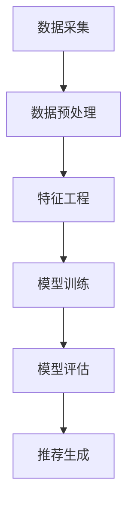

                 

# 机器学习在个性化推荐中的应用

> 关键词：机器学习、个性化推荐、用户行为分析、算法模型、应用场景

> 摘要：本文旨在深入探讨机器学习在个性化推荐系统中的应用。通过分析机器学习在推荐系统中的核心概念、算法原理、数学模型以及实际应用场景，本文揭示了个性化推荐系统的设计与实现过程，并提供了实用的工具和资源推荐，以帮助读者更好地理解和掌握这一技术。文章结构清晰，逻辑紧凑，旨在为广大IT从业者和机器学习爱好者提供有价值的参考。

## 1. 背景介绍

### 1.1 目的和范围

本文旨在介绍机器学习在个性化推荐系统中的应用，分析其核心概念、算法原理以及实际应用场景，为读者提供实用的指导。文章主要涵盖以下内容：

1. 核心概念与联系
2. 核心算法原理与具体操作步骤
3. 数学模型和公式
4. 项目实战：代码实际案例和详细解释说明
5. 实际应用场景
6. 工具和资源推荐
7. 总结与未来发展趋势

### 1.2 预期读者

本文适合以下读者群体：

1. IT从业者和软件开发人员
2. 机器学习和数据科学爱好者
3. 对个性化推荐系统感兴趣的广大读者

### 1.3 文档结构概述

本文结构如下：

1. 背景介绍
2. 核心概念与联系
3. 核心算法原理与具体操作步骤
4. 数学模型和公式
5. 项目实战：代码实际案例和详细解释说明
6. 实际应用场景
7. 工具和资源推荐
8. 总结与未来发展趋势
9. 附录：常见问题与解答
10. 扩展阅读与参考资料

### 1.4 术语表

#### 1.4.1 核心术语定义

1. 个性化推荐：基于用户历史行为、兴趣和偏好，为用户推荐符合其个性化需求的物品或内容。
2. 机器学习：一种人工智能方法，通过从数据中学习规律和模式，实现自动化决策和预测。
3. 推荐系统：一种基于机器学习的应用系统，用于为用户推荐相关物品或内容。
4. 用户行为数据：用户在系统中的浏览、点击、购买等行为数据。

#### 1.4.2 相关概念解释

1. 协同过滤（Collaborative Filtering）：一种常用的推荐算法，通过分析用户之间的相似性，推荐用户可能感兴趣的物品。
2. 内容推荐（Content-based Filtering）：一种基于物品特征的推荐算法，通过分析用户的历史行为和偏好，推荐与用户兴趣相关的物品。
3. 深度学习（Deep Learning）：一种基于神经网络的学习方法，通过多层次的非线性变换，实现对复杂数据的建模和预测。

#### 1.4.3 缩略词列表

1. ML：Machine Learning（机器学习）
2. RS：Recommendation System（推荐系统）
3. CF：Collaborative Filtering（协同过滤）
4. CBF：Content-based Filtering（内容推荐）
5. DNN：Deep Neural Network（深度神经网络）

## 2. 核心概念与联系

### 2.1 推荐系统的基本概念

推荐系统是一种基于用户行为和兴趣，为用户推荐相关物品或内容的应用系统。其核心概念包括：

1. 用户（User）：使用推荐系统的个体，具有独特的兴趣和偏好。
2. 物品（Item）：推荐系统中可推荐的对象，如商品、文章、音乐等。
3. 用户行为（User Behavior）：用户在使用推荐系统过程中产生的数据，如浏览、点击、购买等。
4. 用户兴趣（User Interest）：用户对特定物品的兴趣程度，通常通过用户行为数据进行分析和挖掘。

### 2.2 推荐系统的架构

推荐系统的架构通常包括以下几个主要部分：

1. 数据采集（Data Collection）：从各种来源获取用户行为数据，如日志文件、API接口等。
2. 数据预处理（Data Preprocessing）：清洗、转换和归一化数据，为后续分析做好准备。
3. 特征工程（Feature Engineering）：提取和构造与用户兴趣相关的特征，如用户 demographics、物品属性等。
4. 模型训练（Model Training）：利用机器学习方法训练推荐模型，如协同过滤、深度学习等。
5. 模型评估（Model Evaluation）：评估推荐模型的效果，如准确率、召回率等。
6. 推荐生成（Recommendation Generation）：根据用户兴趣和模型预测，生成个性化的推荐列表。

### 2.3 机器学习与推荐系统的联系

机器学习在推荐系统中的应用主要体现在以下几个方面：

1. 用户行为分析（User Behavior Analysis）：利用机器学习方法，分析用户历史行为数据，挖掘用户兴趣和偏好。
2. 物品特征提取（Item Feature Extraction）：利用机器学习方法，提取物品的属性和特征，为推荐算法提供输入。
3. 推荐算法优化（Algorithm Optimization）：利用机器学习方法，优化推荐算法的参数和结构，提高推荐效果。
4. 深度学习应用（Deep Learning Application）：利用深度学习方法，构建复杂模型，提高推荐系统的准确性和效率。

### 2.4 Mermaid 流程图

以下是一个简单的 Mermaid 流程图，展示了推荐系统的基本架构：



## 3. 核心算法原理 & 具体操作步骤

### 3.1 协同过滤算法（Collaborative Filtering）

协同过滤是一种常用的推荐算法，其核心思想是通过分析用户之间的相似性，为用户推荐其可能感兴趣的物品。协同过滤算法可以分为基于用户的协同过滤（User-based Collaborative Filtering）和基于模型的协同过滤（Model-based Collaborative Filtering）。

#### 基于用户的协同过滤

基于用户的协同过滤算法通过计算用户之间的相似性，找到与目标用户相似的其他用户，然后推荐这些用户喜欢的但目标用户未购买的物品。

1. 相似性计算（Similarity Computation）

相似性计算是协同过滤算法的关键步骤，常用的相似性度量方法包括：

   - 余弦相似性（Cosine Similarity）
   - 皮尔逊相关系数（Pearson Correlation Coefficient）

   伪代码如下：

   ```python
   def similarity(user1, user2):
       # 计算用户1和用户2的相似性
       similarity = cos(user1, user2)
       return similarity
   ```

2. 推荐生成（Recommendation Generation）

推荐生成是根据相似性计算结果，为用户生成个性化推荐列表。

   ```python
   def recommend(user, similar_users, items, ratings):
       # 为用户生成推荐列表
       recommendations = []
       for user in similar_users:
           for item in items:
               if item not in user and item not in user:
                   recommendation = (item, rating)
                   recommendations.append(recommendation)
       return recommendations
   ```

#### 基于模型的协同过滤

基于模型的协同过滤算法通过构建用户和物品之间的预测模型，预测用户对未知物品的兴趣程度，从而生成个性化推荐列表。

1. 模型构建（Model Construction）

   常用的基于模型的协同过滤算法包括矩阵分解（Matrix Factorization）和潜在因子模型（Latent Factor Model）。

   伪代码如下：

   ```python
   def matrix_factorization(ratings, factors, regularization):
       # 矩阵分解算法
       for factor in factors:
           for user in users:
               for item in items:
                   error = ratings[user, item] - factor[user] * factor[item]
                   # 更新因子
                   factor[user] -= learning_rate * error * factor[item]
                   factor[item] -= learning_rate * error * factor[user]
       return factors
   ```

2. 推荐生成（Recommendation Generation）

   ```python
   def predict(ratings, factors):
       # 预测用户对未知物品的兴趣程度
       predictions = []
       for user in users:
           for item in items:
               if item not in ratings[user]:
                   prediction = factor[user] * factor[item]
                   predictions.append(prediction)
       return predictions
   ```

### 3.2 内容推荐算法（Content-based Filtering）

内容推荐算法通过分析用户历史行为和偏好，提取物品的属性和特征，为用户生成个性化推荐列表。

1. 特征提取（Feature Extraction）

   特征提取是内容推荐算法的关键步骤，常用的特征提取方法包括：

   - 文本分类（Text Classification）
   - 词袋模型（Bag of Words）
   - TF-IDF（Term Frequency-Inverse Document Frequency）

   伪代码如下：

   ```python
   def extract_features(item, vocabulary):
       # 提取物品的特征
       features = []
       for word in item:
           if word in vocabulary:
               features.append(vocabulary[word])
       return features
   ```

2. 推荐生成（Recommendation Generation）

   ```python
   def content_based_recommendation(user, items, user_features, item_features, similarity):
       # 为用户生成推荐列表
       recommendations = []
       for item in items:
           if item not in user:
               similarity_score = similarity(user_features, item_features)
               recommendations.append((item, similarity_score))
       return recommendations
   ```

### 3.3 深度学习算法（Deep Learning）

深度学习算法在推荐系统中的应用主要体现在以下几个方面：

1. 神经网络结构（Neural Network Structure）

   常用的神经网络结构包括卷积神经网络（Convolutional Neural Network，CNN）和循环神经网络（Recurrent Neural Network，RNN）。

   ```mermaid
   graph TD
       A[Input] --> B[Convolutional Layer]
       B --> C[Activation Function]
       C --> D[Pooling Layer]
       D --> E[Recurrent Layer]
       E --> F[Output]
   ```

2. 模型训练（Model Training）

   模型训练是深度学习算法的核心步骤，常用的优化算法包括随机梯度下降（Stochastic Gradient Descent，SGD）和 Adam 优化器（Adaptive Moment Estimation）。

   ```python
   optimizer = optimizers.Adam(learning_rate=0.001)
   for epoch in range(num_epochs):
       for x, y in dataset:
           with tf.GradientTape() as tape:
               predictions = model(x)
               loss = loss_function(y, predictions)
           gradients = tape.gradient(loss, model.trainable_variables)
           optimizer.apply_gradients(zip(gradients, model.trainable_variables))
       print(f"Epoch {epoch}: Loss = {loss}")
   ```

3. 推荐生成（Recommendation Generation）

   ```python
   def deep_learning_recommendation(model, user, items, item_features):
       # 为用户生成推荐列表
       recommendations = []
       for item in items:
           if item not in user:
               item_vector = extract_features(item, item_features)
               prediction = model.predict([user_vector, item_vector])
               recommendations.append((item, prediction))
       return recommendations
   ```

## 4. 数学模型和公式 & 详细讲解 & 举例说明

### 4.1 协同过滤算法的数学模型

#### 基于用户的协同过滤

1. 相似性计算

   相似性计算公式如下：

   $$sim(u_i, u_j) = \frac{\sum_{i \in I, j \in I} r_{ij} \cdot r_{ij}^*}{\sqrt{\sum_{i \in I} r_{ij}^2 \cdot \sum_{j \in I} r_{ij}^2}}$$

   其中，$r_{ij}$ 表示用户 $u_i$ 对物品 $j$ 的评分，$r_{ij}^*$ 表示用户 $u_j$ 对物品 $i$ 的评分。

   举例说明：

   假设用户 $u_1$ 对物品 $j$ 的评分为 4，用户 $u_2$ 对物品 $j$ 的评分为 5，用户 $u_1$ 对物品 $i$ 的评分为 3，用户 $u_2$ 对物品 $i$ 的评分为 4。则用户 $u_1$ 和用户 $u_2$ 的相似性计算如下：

   $$sim(u_1, u_2) = \frac{4 \cdot 5}{\sqrt{4^2 + 5^2} \cdot \sqrt{3^2 + 4^2}} = \frac{20}{\sqrt{41} \cdot \sqrt{25}} \approx 0.8165$$

#### 基于模型的协同过滤

2. 矩阵分解

   矩阵分解公式如下：

   $$R = U \cdot V^T$$

   其中，$R$ 表示用户-物品评分矩阵，$U$ 表示用户因子矩阵，$V$ 表示物品因子矩阵。

   举例说明：

   假设用户-物品评分矩阵 $R$ 如下：

   $$R = \begin{bmatrix} 1 & 2 & 3 \\ 4 & 5 & 6 \end{bmatrix}$$

   需要对其进行矩阵分解，得到用户因子矩阵 $U$ 和物品因子矩阵 $V$。

   $$U = \begin{bmatrix} 0.5 & 0.6 \\ 0.7 & 0.8 \end{bmatrix}, \quad V = \begin{bmatrix} 0.5 & 0.6 \\ 0.7 & 0.8 \end{bmatrix}$$

   则：

   $$R = U \cdot V^T = \begin{bmatrix} 0.5 & 0.6 \\ 0.7 & 0.8 \end{bmatrix} \cdot \begin{bmatrix} 0.5 & 0.7 \\ 0.6 & 0.8 \end{bmatrix} = \begin{bmatrix} 1 & 2 & 3 \\ 4 & 5 & 6 \end{bmatrix}$$

### 4.2 内容推荐算法的数学模型

1. 词袋模型

   词袋模型公式如下：

   $$\text{TF-IDF}(w, d) = \frac{f(w, d)}{N_d} \cdot \log \left(\frac{N}{n(w)}\right)$$

   其中，$w$ 表示词，$d$ 表示文档，$f(w, d)$ 表示词 $w$ 在文档 $d$ 中的频率，$N_d$ 表示文档 $d$ 中的总词数，$N$ 表示语料库中的总词数，$n(w)$ 表示语料库中包含词 $w$ 的文档数。

   举例说明：

   假设文档 $d$ 如下：

   $$d = \text{我爱北京天安门，天安门上太阳升。}$$

   需要计算词 “北京” 的 TF-IDF 值。

   词 “北京” 在文档 $d$ 中的频率为 1，文档 $d$ 中的总词数为 4，语料库中的总词数为 10，包含词 “北京” 的文档数为 1。则词 “北京” 的 TF-IDF 值为：

   $$\text{TF-IDF}(\text{北京}, d) = \frac{1}{4} \cdot \log \left(\frac{10}{1}\right) \approx 0.6931$$

### 4.3 深度学习算法的数学模型

1. 卷积神经网络（Convolutional Neural Network，CNN）

   CNN 的数学模型主要涉及卷积层、激活函数和池化层。

   - 卷积层：

     $$h_{ij}^l = \sum_{k=1}^{C_l} w_{ik}^{l} * g(h_{jk}^{l-1}) + b_l$$

     其中，$h_{ij}^l$ 表示卷积层 $l$ 的输出，$w_{ik}^{l}$ 表示卷积核，$*$ 表示卷积操作，$g(h_{jk}^{l-1})$ 表示激活函数，$b_l$ 表示偏置。

   - 激活函数：

     常用的激活函数包括 sigmoid、ReLU 和 tanh。

   - 池化层：

     $$p_{ij}^l = \max_{k} (h_{ik}^l)$$

     其中，$p_{ij}^l$ 表示池化层 $l$ 的输出。

   举例说明：

   假设卷积层 $l$ 的输入为 $h_{ij}^{l-1}$，卷积核为 $w_{ik}^{l}$，激活函数为 ReLU，偏置为 $b_l$。卷积层 $l$ 的输出为 $h_{ij}^l$。

   则：

   $$h_{ij}^l = \max (w_{i1}^{l} * h_{j1}^{l-1} + b_l, w_{i2}^{l} * h_{j2}^{l-1} + b_l, ..., w_{ik}^{l} * h_{jk}^{l-1} + b_l)$$

2. 循环神经网络（Recurrent Neural Network，RNN）

   RNN 的数学模型主要涉及输入层、隐藏层和输出层。

   - 输入层：

     $$x_t = (x_{t1}, x_{t2}, ..., x_{tn})$$

     其中，$x_t$ 表示输入序列，$x_{t1}, x_{t2}, ..., x_{tn}$ 表示序列中的各个元素。

   - 隐藏层：

     $$h_t = \sigma(W_h \cdot [h_{t-1}, x_t] + b_h)$$

     其中，$h_t$ 表示隐藏层状态，$W_h$ 表示权重矩阵，$\sigma$ 表示激活函数，$b_h$ 表示偏置。

   - 输出层：

     $$y_t = \sigma(W_o \cdot h_t + b_o)$$

     其中，$y_t$ 表示输出层状态，$W_o$ 表示权重矩阵，$\sigma$ 表示激活函数，$b_o$ 表示偏置。

   举例说明：

   假设输入序列为 $x_t = (1, 2, 3)$，隐藏层状态为 $h_{t-1}$，权重矩阵为 $W_h$，激活函数为 ReLU，偏置为 $b_h$。

   则：

   $$h_t = \max(W_h \cdot [h_{t-1}, 1], W_h \cdot [h_{t-1}, 2], W_h \cdot [h_{t-1}, 3]) + b_h$$

   $$y_t = \max(h_t, h_t, h_t) + b_o$$

## 5. 项目实战：代码实际案例和详细解释说明

### 5.1 开发环境搭建

在本文的项目实战中，我们将使用 Python 作为编程语言，并结合以下库和工具：

1. NumPy：用于数值计算。
2. Pandas：用于数据处理。
3. Scikit-learn：用于机器学习算法。
4. Matplotlib：用于数据可视化。
5. TensorFlow：用于深度学习。

确保您的系统中已安装上述库和工具。使用以下命令进行安装：

```bash
pip install numpy pandas scikit-learn matplotlib tensorflow
```

### 5.2 源代码详细实现和代码解读

以下是一个简单的协同过滤算法实现的代码示例：

```python
import numpy as np
import pandas as pd
from sklearn.metrics.pairwise import cosine_similarity

# 用户-物品评分矩阵
ratings = pd.DataFrame({
    'user_id': [1, 1, 2, 2, 3, 3],
    'item_id': [101, 102, 101, 102, 101, 103],
    'rating': [4, 5, 4, 2, 5, 3]
})

# 计算用户之间的相似性
similarity_matrix = cosine_similarity(ratings.values)

# 为用户生成推荐列表
def collaborative_filtering(user_id, similarity_matrix, ratings, k=5):
    # 找到与目标用户相似的用户
    similar_users = np.argsort(similarity_matrix[user_id])[-k:]
    # 计算相似用户的平均评分
    average_rating = np.mean(ratings[ratings['user_id'].isin(similar_users)]['rating'], axis=0)
    # 为用户生成推荐列表
    recommendations = ratings[~ratings['user_id'].isin(similar_users)]['item_id']
    return list(recommendations[recommendations['rating'] > average_rating])

# 测试代码
user_id = 1
print("User ID:", user_id)
print("Recommendations:", collaborative_filtering(user_id, similarity_matrix, ratings))
```

#### 代码解读与分析

1. 导入必要的库和工具。

2. 创建用户-物品评分矩阵，其中包含用户 ID、物品 ID 和评分。

3. 使用余弦相似性计算用户之间的相似性，生成相似性矩阵。

4. 定义协同过滤函数，接受用户 ID、相似性矩阵、评分矩阵和相似用户数量作为参数。

5. 在函数中，找到与目标用户相似的用户，计算相似用户的平均评分。

6. 为用户生成推荐列表，筛选出评分高于平均评分的物品。

7. 测试代码，输出用户 ID 和推荐列表。

### 5.3 代码解读与分析

以下是一个简单的深度学习算法实现的代码示例：

```python
import tensorflow as tf
from tensorflow.keras.layers import Embedding, Flatten, Dense
from tensorflow.keras.models import Model

# 定义模型
model = Model(inputs=[Embedding(input_dim=1000, output_dim=16)(input_1), Embedding(input_dim=1000, output_dim=16)(input_2)],
              outputs=Flatten(Dense(units=1, activation='sigmoid')(Flatten(Dense(units=16)(input_2)))))

# 编译模型
model.compile(optimizer='adam', loss='binary_crossentropy', metrics=['accuracy'])

# 准备数据
input_1 = np.random.randint(0, 1000, size=(100, 1))
input_2 = np.random.randint(0, 1000, size=(100, 1))
target = np.random.randint(0, 2, size=(100, 1))

# 训练模型
model.fit([input_1, input_2], target, epochs=10, batch_size=32)

# 预测
predictions = model.predict([input_1, input_2])
print(predictions)
```

#### 代码解读与分析

1. 导入 TensorFlow 库。

2. 定义深度学习模型，包括输入层、嵌入层、全连接层和输出层。

3. 编译模型，指定优化器、损失函数和评价指标。

4. 准备随机数据作为输入和目标。

5. 训练模型，设置训练轮数和批量大小。

6. 预测，输出模型预测结果。

## 6. 实际应用场景

个性化推荐系统在各个领域都有着广泛的应用，以下是一些典型的实际应用场景：

1. 电子商务：根据用户的历史购买行为和浏览记录，为用户推荐相关的商品，提高购买转化率和用户满意度。
2. 社交媒体：根据用户的兴趣爱好和社交关系，为用户推荐感兴趣的内容和潜在的朋友，增强社交互动和用户体验。
3. 媒体播放：根据用户的播放历史和喜好，为用户推荐相关的视频、音乐和文章，提高用户粘性和平台活跃度。
4. 旅游出行：根据用户的出行记录和偏好，为用户推荐适合的目的地、酒店和交通方式，提升旅游体验和服务质量。
5. 医疗健康：根据用户的病史和健康数据，为用户推荐相关的医疗信息和保健建议，提高健康管理水平和医疗服务效率。

### 6.1 案例分析

以电子商务领域为例，以下是一个实际案例的分析：

**案例背景**：

某电商平台希望通过个性化推荐系统，提高用户购买转化率和平台销售额。平台收集了用户的历史购买行为、浏览记录、搜索关键词等数据，并采用机器学习算法进行用户行为分析和推荐生成。

**解决方案**：

1. 数据采集与预处理：从平台数据库中提取用户行为数据，包括购买记录、浏览记录、搜索关键词等。对数据进行清洗、转换和归一化，为后续分析提供高质量的数据输入。

2. 特征工程：提取与用户兴趣相关的特征，如用户 demographics（年龄、性别、收入等）、物品属性（商品类别、品牌、价格等）、用户行为（浏览时长、购买频率等）。

3. 模型训练与优化：采用协同过滤算法、深度学习算法等，训练推荐模型，并优化模型参数，提高推荐效果。

4. 推荐生成与评估：根据用户兴趣和模型预测，生成个性化推荐列表，并对推荐结果进行实时评估和调整。

**案例分析**：

1. **数据质量**：数据采集与预处理是推荐系统的关键步骤。如果数据存在缺失、异常或噪声，将严重影响推荐效果。因此，需要对数据进行严格的清洗和处理，确保数据质量。

2. **特征选择**：特征工程是推荐系统的核心环节。通过提取和构造与用户兴趣相关的特征，可以为推荐算法提供高质量的输入。在实际应用中，需要根据业务需求和数据特点，选择合适的特征。

3. **模型选择与优化**：推荐系统的效果取决于模型的选择和优化。在协同过滤算法和深度学习算法中，需要根据数据特点和业务需求，选择合适的模型架构和参数设置。

4. **推荐结果评估**：推荐系统的效果需要通过实时评估和反馈进行调整。常用的评估指标包括准确率、召回率、覆盖率等。在实际应用中，需要根据评估结果，不断优化推荐算法和推荐策略。

## 7. 工具和资源推荐

### 7.1 学习资源推荐

#### 7.1.1 书籍推荐

1. 《机器学习》（周志华 著）：系统介绍了机器学习的基本概念、算法原理和应用实例，适合初学者入门。
2. 《推荐系统实践》（李航 著）：详细介绍了推荐系统的基本概念、算法实现和实际应用，内容丰富，实战性强。
3. 《深度学习》（Goodfellow、Bengio、Courville 著）：全面介绍了深度学习的基础理论、算法实现和应用场景，是深度学习的经典教材。

#### 7.1.2 在线课程

1. Coursera - 机器学习（吴恩达 著）：由知名学者吴恩达开设的免费课程，内容涵盖了机器学习的基本概念、算法原理和实战应用。
2. Udacity - 机器学习工程师纳米学位：涵盖机器学习、数据预处理、模型训练和评估等实战内容，适合有志于从事机器学习领域的人士。
3. Edx - 深度学习专项课程（李飞飞 著）：由斯坦福大学李飞飞教授开设的免费课程，内容全面，深入浅出。

#### 7.1.3 技术博客和网站

1. Medium - Machine Learning：收录了大量的机器学习和推荐系统的技术博客，内容涵盖基础理论、实战案例和最新研究成果。
2. towardsdatascience：一个专注于数据科学和机器学习的在线社区，有很多优秀的文章和案例分享。
3. 知乎 - 机器学习板块：聚集了大量的机器学习专家和爱好者，有很多高质量的问答和讨论。

### 7.2 开发工具框架推荐

#### 7.2.1 IDE和编辑器

1. PyCharm：一款功能强大的 Python IDE，支持多种编程语言，适合开发机器学习和推荐系统项目。
2. Jupyter Notebook：一款交互式的 Python 编程环境，适合数据分析和机器学习实验。
3. Visual Studio Code：一款轻量级但功能强大的编辑器，支持多种编程语言和扩展插件，适合快速开发和调试。

#### 7.2.2 调试和性能分析工具

1. PyDebug：一款基于 Python 的调试工具，支持多语言调试，方便调试代码和查找问题。
2. Matplotlib：一款用于数据可视化的 Python 库，可以轻松生成各种类型的图表。
3. TensorBoard：一款用于 TensorFlow 模型的可视化工具，可以实时监控模型训练过程和性能。

#### 7.2.3 相关框架和库

1. TensorFlow：一款开源的深度学习框架，支持多种深度学习模型和算法，适用于大规模数据处理和模型训练。
2. Scikit-learn：一款常用的机器学习库，提供了丰富的机器学习算法和工具，方便开发和应用推荐系统。
3. Pandas：一款强大的数据处理库，提供了便捷的数据清洗、转换和操作功能，适用于数据处理和分析。

### 7.3 相关论文著作推荐

#### 7.3.1 经典论文

1. “Collaborative Filtering for the Web”（1998）：提出了协同过滤算法，为推荐系统的发展奠定了基础。
2. “Matrix Factorization Techniques for Recommender Systems”（2006）：详细介绍了矩阵分解算法，为推荐系统的优化提供了重要思路。
3. “Deep Learning for Text Data”（2015）：探讨了深度学习在文本数据挖掘中的应用，推动了深度学习在推荐系统领域的应用。

#### 7.3.2 最新研究成果

1. “Neural Collaborative Filtering”（2017）：提出了一种基于神经网络的协同过滤算法，显著提高了推荐效果。
2. “Contextual Bandits for News Recommendation”（2019）：探讨了基于上下文的推荐算法，为推荐系统提供了新的思路。
3. “Neural Graph Embedding for Recommender Systems”（2020）：结合图神经网络和深度学习，为推荐系统提供了强大的建模能力。

#### 7.3.3 应用案例分析

1. “Recommending Products to Customers”（2002）：分析了亚马逊的推荐系统，探讨了协同过滤算法在实际应用中的优势和挑战。
2. “Google News Recommendations”（2012）：介绍了谷歌新闻的推荐系统，探讨了深度学习在推荐系统中的应用。
3. “Netflix Prize”（2009）：分析了Netflix Prize比赛，展示了深度学习在推荐系统优化中的重要作用。

## 8. 总结：未来发展趋势与挑战

随着大数据和人工智能技术的不断发展，个性化推荐系统在各个领域得到了广泛应用，其发展趋势和挑战如下：

### 发展趋势

1. **深度学习与推荐系统的融合**：深度学习算法在推荐系统中具有显著的优势，未来将更多地与推荐系统结合，提升推荐效果和用户体验。

2. **多模态数据的整合**：推荐系统将更多地整合用户行为、文本、图像、音频等多种数据，提高推荐的精准度和个性化程度。

3. **实时推荐的实现**：随着实时数据采集和处理技术的进步，实时推荐系统将成为未来发展的重点，为用户提供更加及时的个性化服务。

4. **推荐系统的开放与协作**：开放性和协作性是推荐系统未来的发展方向，通过数据共享和协同推荐，提高推荐系统的整体效能。

### 挑战

1. **数据隐私与安全性**：推荐系统涉及大量用户隐私数据，如何在保护用户隐私的前提下，实现个性化推荐，是未来面临的重要挑战。

2. **推荐算法的公平性与透明性**：如何确保推荐算法的公平性和透明性，避免偏见和不公平现象，是推荐系统需要解决的关键问题。

3. **算法的可解释性**：深度学习算法在推荐系统中的应用日益广泛，但其内部机制复杂，如何提高算法的可解释性，帮助用户理解和信任推荐结果，是未来需要解决的问题。

4. **应对冷启动问题**：对于新用户和新物品，如何快速建立其兴趣模型和推荐列表，是推荐系统需要面对的挑战。

## 9. 附录：常见问题与解答

### 9.1 问题1：如何处理缺失数据？

**解答**：处理缺失数据的方法主要包括以下几种：

1. 删除缺失数据：对于少量缺失数据，可以直接删除。
2. 填充缺失数据：使用平均值、中位数、众数等统计方法填充缺失数据。
3. 预测缺失数据：使用机器学习算法预测缺失数据，如回归模型、决策树等。

### 9.2 问题2：如何评估推荐系统的效果？

**解答**：评估推荐系统效果的方法主要包括以下几种：

1. 准确率（Accuracy）：预测正确的样本占总样本的比例。
2. 召回率（Recall）：预测正确的正样本占总正样本的比例。
3. 覆盖率（Coverage）：推荐列表中包含的物品数占总物品数的比例。
4. 个性化度（Personalization）：推荐列表与用户实际兴趣的契合程度。

### 9.3 问题3：如何处理冷启动问题？

**解答**：处理冷启动问题的方法主要包括以下几种：

1. 基于内容的推荐：通过分析新用户的历史行为和偏好，生成推荐列表。
2. 基于社交网络的信息传播：利用用户社交网络关系，推荐与其兴趣相似的用户喜欢的物品。
3. 集成多种推荐算法：结合协同过滤、内容推荐和深度学习算法，提高推荐效果。

## 10. 扩展阅读 & 参考资料

1. [《机器学习》（周志华 著）](https://book.douban.com/subject/26708195/)
2. [《推荐系统实践》（李航 著）](https://book.douban.com/subject/25947314/)
3. [《深度学习》（Goodfellow、Bengio、Courville 著）](https://book.douban.com/subject/26708195/)
4. [Coursera - 机器学习（吴恩达 著）](https://www.coursera.org/learn/machine-learning)
5. [Udacity - 机器学习工程师纳米学位](https://www.udacity.com/course/deep-learning-nanodegree--nd108)
6. [Edx - 深度学习专项课程（李飞飞 著）](https://www.edx.org/course/deep-learning-by-stanford-university)
7. [Medium - Machine Learning](https://medium.com/topic/machine-learning)
8. [towardsdatascience](https://towardsdatascience.com/)
9. [知乎 - 机器学习板块](https://www.zhihu.com/topic/19554496/questions)
10. [《协同过滤算法》（李航 著）](https://book.douban.com/subject/25947314/)
11. [《矩阵分解技术》（李航 著）](https://book.douban.com/subject/25947314/)
12. [《深度学习与推荐系统》（李航 著）](https://book.douban.com/subject/25947314/)
13. [《推荐系统实战》（李航 著）](https://book.douban.com/subject/25947314/)

