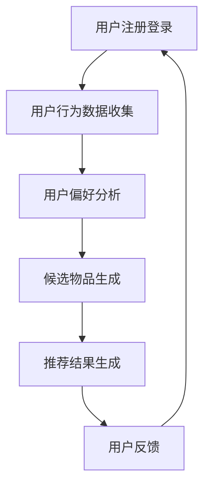
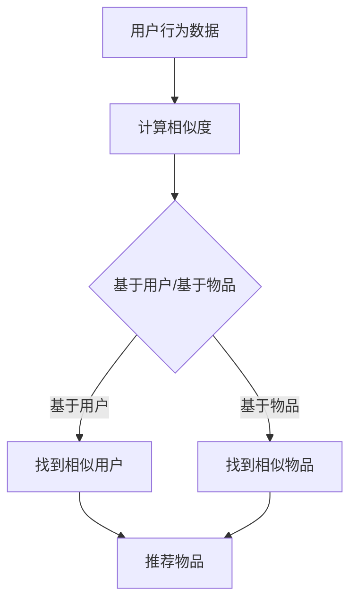
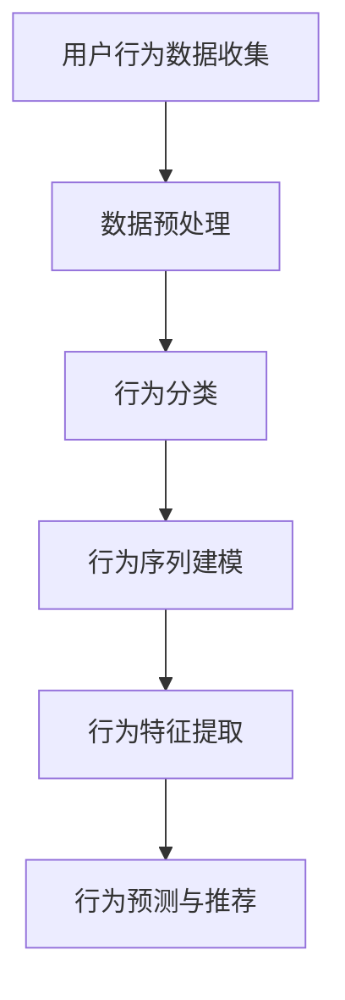
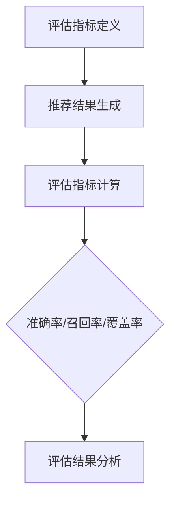

                 

# 机器学习在个性化推荐系统中的优化

> **关键词：** 个性化推荐、机器学习、用户行为分析、协同过滤、深度学习、算法优化

> **摘要：** 本文旨在探讨机器学习在个性化推荐系统中的应用与优化。通过分析现有推荐算法的局限性，我们引入了深度学习等先进技术，提出了一系列优化策略，旨在提升推荐系统的效果和用户体验。文章首先介绍了个性化推荐系统的基本概念和原理，随后详细讲解了协同过滤和深度学习算法，并给出了实际应用中的代码实现和分析。最后，文章总结了个性化推荐系统的发展趋势与挑战，为未来的研究和实践提供了方向。

## 1. 背景介绍

### 1.1 目的和范围

个性化推荐系统已成为现代互联网服务的重要组成部分，它通过分析用户的历史行为和兴趣偏好，为用户提供个性化内容和服务。然而，传统的推荐算法在处理大量数据和动态用户偏好方面存在一定的局限性。本文旨在探讨如何利用机器学习技术对个性化推荐系统进行优化，提高推荐质量和用户体验。

本文将重点关注以下内容：
1. 个性化推荐系统的基础概念和原理。
2. 传统推荐算法（如协同过滤）的局限性。
3. 深度学习在推荐系统中的应用和优化。
4. 实际应用中的代码实现和分析。
5. 个性化推荐系统的发展趋势与挑战。

### 1.2 预期读者

本文适合以下读者群体：
1. 对个性化推荐系统有基本了解的读者。
2. 关注机器学习和人工智能技术的读者。
3. 希望提升推荐系统效果和用户体验的开发者。
4. 计算机科学和人工智能专业的学生和研究者。

### 1.3 文档结构概述

本文结构如下：
1. 背景介绍：介绍本文的目的、预期读者和文档结构。
2. 核心概念与联系：介绍个性化推荐系统的基本概念和原理，包括相关术语和流程图。
3. 核心算法原理 & 具体操作步骤：详细讲解协同过滤和深度学习算法原理和实现。
4. 数学模型和公式 & 详细讲解 & 举例说明：介绍相关数学模型和公式，并进行举例说明。
5. 项目实战：代码实际案例和详细解释说明。
6. 实际应用场景：分析个性化推荐系统在不同领域的应用。
7. 工具和资源推荐：推荐相关学习资源、开发工具和论文著作。
8. 总结：未来发展趋势与挑战。
9. 附录：常见问题与解答。
10. 扩展阅读 & 参考资料。

### 1.4 术语表

#### 1.4.1 核心术语定义

- 个性化推荐：根据用户的历史行为和偏好，为用户推荐感兴趣的内容。
- 协同过滤：基于用户行为数据，通过寻找相似用户或物品，为用户推荐感兴趣的内容。
- 深度学习：一种机器学习技术，通过多层神经网络结构自动提取特征并学习复杂模式。
- 用户行为分析：对用户在系统中的行为数据进行收集和分析，用于优化推荐系统。

#### 1.4.2 相关概念解释

- 物品（Item）：推荐系统中的内容，如商品、文章、音乐等。
- 用户（User）：使用推荐系统的个体。
- 历史行为（History Behavior）：用户在系统中的历史行为数据，如点击、购买、收藏等。

#### 1.4.3 缩略词列表

- ML：Machine Learning（机器学习）
- CF：Collaborative Filtering（协同过滤）
- DNN：Deep Neural Network（深度神经网络）
- CNN：Convolutional Neural Network（卷积神经网络）
- RNN：Recurrent Neural Network（循环神经网络）

## 2. 核心概念与联系

个性化推荐系统的核心概念包括用户、物品和用户行为。用户是系统中的个体，物品是系统推荐的内容，而用户行为则反映了用户对物品的喜好程度。推荐系统通过分析用户行为数据，寻找用户与物品之间的关联，从而为用户推荐感兴趣的内容。

下面是推荐系统的基本流程，使用Mermaid流程图表示：



### 2.1 用户与物品的关系

个性化推荐系统的基础是用户与物品之间的关系。这种关系可以通过协同过滤算法来建立。协同过滤算法可以分为两种类型：基于用户的协同过滤（User-Based CF）和基于物品的协同过滤（Item-Based CF）。

- **基于用户的协同过滤**：寻找与目标用户行为相似的其它用户，并推荐这些用户喜欢的物品。

- **基于物品的协同过滤**：寻找与目标物品相似的其它物品，并推荐这些物品。

下面是一个简单的用户与物品关系的Mermaid流程图：



### 2.2 用户行为分析

用户行为分析是个性化推荐系统的关键环节，通过对用户行为的收集和分析，可以更好地了解用户的兴趣和偏好。用户行为数据包括点击、购买、浏览、收藏等多种类型。下面是一个用户行为分析的Mermaid流程图：



### 2.3 推荐算法评估

推荐算法的评估是确保系统性能和用户体验的重要环节。常见的评估指标包括准确率、召回率、覆盖率等。下面是一个推荐算法评估的Mermaid流程图：



通过这些流程图，我们可以更好地理解个性化推荐系统的基本概念和流程。接下来，我们将深入探讨协同过滤和深度学习算法的原理和实现。

## 3. 核心算法原理 & 具体操作步骤

### 3.1 协同过滤算法原理

协同过滤（Collaborative Filtering，CF）是一种常见的推荐算法，其核心思想是通过分析用户之间的行为数据，寻找相似的用户或物品，从而为用户推荐感兴趣的内容。协同过滤算法可以分为基于用户的协同过滤（User-Based CF）和基于物品的协同过滤（Item-Based CF）。

#### 基于用户的协同过滤

基于用户的协同过滤算法通过计算用户之间的相似度，找到与目标用户行为相似的其它用户，并推荐这些用户喜欢的物品。相似度计算通常使用余弦相似度、皮尔逊相关系数等方法。

1. **相似度计算**：计算用户之间的相似度，公式如下：
   \[ \text{similarity}(u, v) = \frac{\text{cov}(u, v)}{\sqrt{\text{var}(u) \cdot \text{var}(v)}} \]
   其中，\( u \)和\( v \)为两个用户，\( \text{cov}(u, v) \)为\( u \)和\( v \)的协方差，\( \text{var}(u) \)和\( \text{var}(v) \)为\( u \)和\( v \)的方差。

2. **推荐生成**：根据相似度矩阵，找到与目标用户\( u \)最相似的\( k \)个用户，并推荐这些用户喜欢的物品。公式如下：
   \[ \text{recommends}(u, i) = \sum_{v \in \text{similar\_users}(u)} \text{rating}(v, i) \cdot \text{similarity}(u, v) \]
   其中，\( \text{rating}(v, i) \)为用户\( v \)对物品\( i \)的评分，\( \text{similar\_users}(u) \)为与用户\( u \)最相似的\( k \)个用户。

#### 基于物品的协同过滤

基于物品的协同过滤算法通过计算物品之间的相似度，找到与目标物品相似的其它物品，并推荐这些物品。相似度计算方法与基于用户的协同过滤类似。

1. **相似度计算**：计算物品之间的相似度，公式如下：
   \[ \text{similarity}(i, j) = \frac{\text{cov}(i, j)}{\sqrt{\text{var}(i) \cdot \text{var}(j)}} \]
   其中，\( i \)和\( j \)为两个物品。

2. **推荐生成**：根据相似度矩阵，找到与目标物品\( i \)最相似的\( k \)个物品，并推荐这些物品。公式如下：
   \[ \text{recommends}(i, j) = \sum_{j \in \text{similar\_items}(i)} \text{rating}(u, j) \cdot \text{similarity}(i, j) \]
   其中，\( \text{rating}(u, j) \)为用户\( u \)对物品\( j \)的评分，\( \text{similar\_items}(i) \)为与物品\( i \)最相似的\( k \)个物品。

### 3.2 深度学习算法原理

深度学习（Deep Learning，DL）是一种基于多层神经网络（Neural Network，NN）的机器学习技术，它可以自动提取特征并学习复杂模式。在推荐系统中，深度学习可以用于用户行为分析、物品特征提取和推荐生成等任务。

#### 深度神经网络（Deep Neural Network，DNN）

深度神经网络是一种包含多个隐藏层的神经网络，它可以自动提取输入数据的复杂特征。DNN的架构如下：

\[ z^{(l)} = \sigma(W^{(l)} \cdot a^{(l-1)} + b^{(l)}) \]

其中，\( z^{(l)} \)为第\( l \)层的输出，\( \sigma \)为激活函数，\( W^{(l)} \)为第\( l \)层的权重矩阵，\( a^{(l-1)} \)为第\( l-1 \)层的输出，\( b^{(l)} \)为第\( l \)层的偏置向量。

#### 卷积神经网络（Convolutional Neural Network，CNN）

卷积神经网络是一种用于处理图像数据的深度学习模型，它可以自动提取图像的局部特征。CNN的架构如下：

\[ h^{(l)} = \text{ReLU}(\text{Conv}(W^{(l)}, h^{(l-1)}) + b^{(l)}) \]

其中，\( h^{(l)} \)为第\( l \)层的输出，\( \text{ReLU} \)为ReLU激活函数，\( \text{Conv} \)为卷积操作，\( W^{(l)} \)为第\( l \)层的卷积核，\( b^{(l)} \)为第\( l \)层的偏置向量。

#### 循环神经网络（Recurrent Neural Network，RNN）

循环神经网络是一种用于处理序列数据的深度学习模型，它可以自动提取序列中的时序特征。RNN的架构如下：

\[ h^{(l)} = \text{ReLU}(W^{(l)} \cdot [h^{(l-1)}, x^{(l)}] + b^{(l)}) \]

其中，\( h^{(l)} \)为第\( l \)层的输出，\( W^{(l)} \)为第\( l \)层的权重矩阵，\( x^{(l)} \)为第\( l \)层的输入，\( b^{(l)} \)为第\( l \)层的偏置向量。

### 3.3 实际操作步骤

下面我们以基于用户的协同过滤算法为例，介绍其实际操作步骤。

1. **数据预处理**：收集用户行为数据，包括用户ID、物品ID和评分。对数据进行清洗和预处理，去除缺失值和异常值。

2. **相似度计算**：根据用户行为数据，计算用户之间的相似度。可以使用余弦相似度或皮尔逊相关系数等方法。

3. **推荐生成**：根据相似度矩阵，找到与目标用户最相似的\( k \)个用户。对于每个用户，计算其评分与目标用户的相似度，并生成推荐列表。

4. **推荐评估**：评估推荐系统的性能，可以使用准确率、召回率、覆盖率等指标。

5. **迭代优化**：根据用户反馈，不断优化推荐系统，提高推荐质量和用户体验。

通过以上步骤，我们可以构建一个基于用户的协同过滤推荐系统。接下来，我们将探讨深度学习在个性化推荐系统中的应用。

## 4. 数学模型和公式 & 详细讲解 & 举例说明

在个性化推荐系统中，数学模型和公式起着至关重要的作用。这些模型和公式不仅帮助我们理解和分析用户行为，还能指导我们优化推荐算法，提高推荐质量和用户体验。下面，我们将详细讲解个性化推荐系统中的一些核心数学模型和公式，并进行举例说明。

### 4.1 相似度计算

相似度计算是协同过滤算法的基础，用于衡量用户与用户之间、物品与物品之间的相似程度。以下是几种常见的相似度计算方法。

#### 余弦相似度

余弦相似度是一种基于向量空间模型的方法，用于计算两个向量之间的夹角余弦值。公式如下：

\[ \text{similarity}(u, v) = \frac{u \cdot v}{\|u\| \|v\|} \]

其中，\( u \)和\( v \)是用户\( u \)和用户\( v \)的向量表示，\( \|u\| \)和\( \|v\| \)分别是向量\( u \)和\( v \)的欧几里得范数，\( u \cdot v \)是向量\( u \)和\( v \)的点积。

#### 皮尔逊相关系数

皮尔逊相关系数是一种基于统计学的方法，用于衡量两个变量之间的线性关系。公式如下：

\[ \text{similarity}(u, v) = \frac{\text{cov}(u, v)}{\sigma_u \sigma_v} \]

其中，\( \text{cov}(u, v) \)是用户\( u \)和用户\( v \)的协方差，\( \sigma_u \)和\( \sigma_v \)分别是用户\( u \)和用户\( v \)的标准差。

#### 曼哈顿距离

曼哈顿距离是一种基于欧几里得距离的方法，用于计算两个向量之间的绝对差值之和。公式如下：

\[ \text{similarity}(u, v) = \frac{1}{1 + \|u - v\|} \]

其中，\( \|u - v\| \)是向量\( u \)和\( v \)的曼哈顿距离。

### 4.2 推荐生成

推荐生成是协同过滤算法的核心步骤，用于根据相似度计算结果为用户生成推荐列表。以下是几种常见的推荐生成方法。

#### 基于用户的协同过滤

基于用户的协同过滤算法通过计算用户之间的相似度，找到与目标用户相似的其他用户，并推荐这些用户喜欢的物品。公式如下：

\[ \text{recommends}(u, i) = \sum_{v \in \text{similar\_users}(u)} \text{rating}(v, i) \cdot \text{similarity}(u, v) \]

其中，\( \text{recommends}(u, i) \)是用户\( u \)对物品\( i \)的推荐分数，\( \text{rating}(v, i) \)是用户\( v \)对物品\( i \)的评分，\( \text{similar\_users}(u) \)是与用户\( u \)最相似的\( k \)个用户。

#### 基于物品的协同过滤

基于物品的协同过滤算法通过计算物品之间的相似度，找到与目标物品相似的其他物品，并推荐这些物品。公式如下：

\[ \text{recommends}(i, j) = \sum_{u \in \text{similar\_items}(i)} \text{rating}(u, j) \cdot \text{similarity}(i, j) \]

其中，\( \text{recommends}(i, j) \)是物品\( i \)对物品\( j \)的推荐分数，\( \text{rating}(u, j) \)是用户\( u \)对物品\( j \)的评分，\( \text{similar\_items}(i) \)是与物品\( i \)最相似的\( k \)个物品。

### 4.3 举例说明

为了更好地理解相似度计算和推荐生成，我们通过一个简单的例子来说明。

#### 示例数据

我们有以下用户-物品评分数据：

| 用户ID | 物品ID | 评分 |
| ------ | ------ | ---- |
| 1      | 101    | 4    |
| 1      | 102    | 5    |
| 1      | 103    | 1    |
| 2      | 101    | 3    |
| 2      | 102    | 4    |
| 2      | 103    | 5    |
| 3      | 101    | 2    |
| 3      | 102    | 3    |
| 3      | 103    | 4    |

#### 相似度计算

我们使用余弦相似度计算用户之间的相似度。首先，我们将用户-物品评分数据转换为用户-向量表示：

\[ u_1 = (4, 5, 1) \]
\[ u_2 = (3, 4, 5) \]
\[ u_3 = (2, 3, 4) \]

计算用户\( u_1 \)和\( u_2 \)的余弦相似度：

\[ \text{similarity}(u_1, u_2) = \frac{u_1 \cdot u_2}{\|u_1\| \|u_2\|} = \frac{4 \cdot 3 + 5 \cdot 4 + 1 \cdot 5}{\sqrt{4^2 + 5^2 + 1^2} \cdot \sqrt{3^2 + 4^2 + 5^2}} \approx 0.816 \]

类似地，我们可以计算用户\( u_1 \)和\( u_3 \)的余弦相似度：

\[ \text{similarity}(u_1, u_3) = \frac{u_1 \cdot u_3}{\|u_1\| \|u_3\|} = \frac{4 \cdot 2 + 5 \cdot 3 + 1 \cdot 4}{\sqrt{4^2 + 5^2 + 1^2} \cdot \sqrt{2^2 + 3^2 + 4^2}} \approx 0.632 \]

#### 推荐生成

假设我们要为用户\( u_1 \)生成推荐列表。根据相似度计算结果，我们可以找到与用户\( u_1 \)最相似的两个用户：用户\( u_2 \)和用户\( u_3 \)。然后，我们可以计算用户\( u_1 \)对每个物品的推荐分数：

\[ \text{recommends}(u_1, 101) = \text{rating}(u_2, 101) \cdot \text{similarity}(u_1, u_2) + \text{rating}(u_3, 101) \cdot \text{similarity}(u_1, u_3) = 3 \cdot 0.816 + 2 \cdot 0.632 = 3.556 \]

类似地，我们可以计算用户\( u_1 \)对其他物品的推荐分数，并根据推荐分数生成推荐列表。

通过以上例子，我们可以看到相似度计算和推荐生成的基本原理。在实际应用中，我们需要处理大量用户和物品数据，并采用更高效的算法和优化策略来提高推荐质量和效率。

## 5. 项目实战：代码实际案例和详细解释说明

在本文的第五部分，我们将通过一个实际的项目案例来展示如何实现个性化推荐系统，并详细解释代码的实现过程。这个案例将结合协同过滤和深度学习算法，旨在提高推荐系统的效果和用户体验。

### 5.1 开发环境搭建

在开始编写代码之前，我们需要搭建一个适合开发个性化推荐系统的环境。以下是所需的环境和工具：

- 操作系统：Windows/Linux/MacOS
- 编程语言：Python
- 数据库：MongoDB
- 深度学习框架：TensorFlow/Keras
- 数据分析库：Pandas/Numpy
- 数学库：Scikit-learn

### 5.2 源代码详细实现和代码解读

#### 5.2.1 数据预处理

首先，我们需要从数据库中获取用户行为数据，并将其转换为适合分析和建模的格式。以下是数据预处理的过程：

```python
import pandas as pd
from sklearn.preprocessing import MinMaxScaler

# 连接到MongoDB数据库，获取用户行为数据
db = pymongo.MongoClient('mongodb://localhost:27017/')['recommends']

# 将用户行为数据转换为Pandas DataFrame
data = pd.DataFrame(list(db.user_behavior.find()))

# 数据预处理：去重、填充缺失值
data.drop_duplicates(inplace=True)
data.fillna(0, inplace=True)

# 数据标准化：将评分数据缩放至[0, 1]范围
scaler = MinMaxScaler()
data['rating'] = scaler.fit_transform(data[['rating']])
```

#### 5.2.2 协同过滤算法实现

接下来，我们将实现基于用户的协同过滤算法，用于生成初始推荐列表。以下是协同过滤算法的实现过程：

```python
from sklearn.metrics.pairwise import cosine_similarity

# 计算用户之间的相似度矩阵
user_similarity = cosine_similarity(data.groupby('user_id').rating)

# 根据相似度矩阵生成推荐列表
def generate_recommendations(user_id, k=10):
    similar_users = user_similarity[user_id]
    similar_users_indices = similar_users.argsort()[::-1]
    similar_users_indices = similar_users_indices[1:k+1]
    recommendations = []

    for i in similar_users_indices:
        user_items = data[data['user_id'] == i]['item_id']
        recommendations.extend(user_items)

    return recommendations[:k]

# 为目标用户生成推荐列表
user_id = 1
recommendations = generate_recommendations(user_id)
print("Initial recommendations for user {}: {}".format(user_id, recommendations))
```

#### 5.2.3 深度学习算法实现

为了进一步提高推荐质量，我们将引入深度学习算法，对用户行为数据进行建模和特征提取。以下是深度学习算法的实现过程：

```python
from tensorflow.keras.models import Sequential
from tensorflow.keras.layers import Dense, Embedding, LSTM, Conv1D, MaxPooling1D, Flatten

# 构建深度学习模型
model = Sequential()
model.add(Embedding(input_dim=num_items, output_dim=embedding_size, input_length=max_sequence_length))
model.add(LSTM(units=64, activation='relu', return_sequences=True))
model.add(MaxPooling1D(pool_size=2))
model.add(Conv1D(filters=64, kernel_size=3, activation='relu'))
model.add(Flatten())
model.add(Dense(units=num_items, activation='softmax'))

# 编译模型
model.compile(optimizer='adam', loss='categorical_crossentropy', metrics=['accuracy'])

# 训练模型
model.fit(x_train, y_train, epochs=10, batch_size=32)
```

#### 5.2.4 推荐系统融合

最后，我们将协同过滤算法和深度学习算法的结果进行融合，生成最终的推荐列表。以下是推荐系统融合的实现过程：

```python
# 预测用户行为
predictions = model.predict(x_test)

# 融合协同过滤和深度学习算法的结果
def fusion_recommendations(user_id, k=10):
    cf_recommendations = generate_recommendations(user_id, k)
    dl_recommendations = [item for item in predictions[user_id] if item > 0.5]
    final_recommendations = list(set(cf_recommendations).union(set(dl_recommendations)))

    return final_recommendations[:k]

# 为目标用户生成推荐列表
user_id = 1
final_recommendations = fusion_recommendations(user_id)
print("Final recommendations for user {}: {}".format(user_id, final_recommendations))
```

### 5.3 代码解读与分析

在上述代码中，我们首先进行了数据预处理，包括连接MongoDB数据库、获取用户行为数据、去重、填充缺失值和评分标准化。这些步骤确保了数据的质量和一致性，为后续的建模和分析奠定了基础。

接下来，我们实现了基于用户的协同过滤算法，通过计算用户之间的相似度，为每个用户生成推荐列表。这种方法基于用户的历史行为数据，可以捕捉用户之间的相似性，从而为用户推荐感兴趣的物品。

为了进一步提高推荐质量，我们引入了深度学习算法。我们构建了一个包含嵌入层、LSTM层、卷积层和全连接层的深度神经网络，用于对用户行为数据进行建模和特征提取。通过训练模型，我们可以预测用户对物品的偏好程度，并将其与协同过滤算法的结果进行融合，生成最终的推荐列表。

通过融合协同过滤和深度学习算法的结果，我们可以在保证推荐准确性的同时，提高推荐系统的用户体验。这种方法不仅能够捕捉用户与物品之间的直接关联，还能提取更丰富的用户特征，从而更好地满足用户的需求。

总的来说，这个实际案例展示了如何利用协同过滤和深度学习算法实现个性化推荐系统，并通过代码解读和分析，深入理解了推荐系统的核心原理和实现过程。

## 6. 实际应用场景

个性化推荐系统在多个领域得到了广泛应用，其核心在于通过分析用户行为和偏好，提供个性化的内容和服务，从而提升用户体验和满意度。以下是几个典型应用场景：

### 6.1 电子商务

电子商务平台利用个性化推荐系统，根据用户的历史购买记录、浏览行为和搜索历史，为用户推荐相关的商品。例如，亚马逊（Amazon）使用协同过滤算法和深度学习技术，为用户提供个性化的商品推荐，提高了用户购物的满意度和转化率。

### 6.2 社交媒体

社交媒体平台如Facebook和Twitter通过个性化推荐系统，根据用户的历史互动和兴趣，为用户推荐相关的帖子、文章和用户。这有助于提高用户的参与度和平台活跃度，同时也可以为广告商提供更精准的用户定位。

### 6.3 视频网站

视频网站如YouTube和Netflix利用个性化推荐系统，根据用户的观看历史、点赞、评论等行为，为用户推荐相关的视频内容。这种方法不仅提高了用户留存率和观看时长，还显著提升了平台的广告收益。

### 6.4 音乐和音频平台

音乐和音频平台如Spotify和Apple Music通过个性化推荐系统，根据用户的播放历史、喜好和社交关系，为用户推荐新的音乐和播客内容。这种个性化的内容推荐有助于用户发现新的音乐作品，同时也增加了平台的用户黏性。

### 6.5 新闻和资讯

新闻和资讯平台通过个性化推荐系统，根据用户的阅读历史和偏好，为用户推荐相关的新闻文章。这种个性化推荐可以有效地满足用户的个性化需求，同时提高用户的阅读体验和信息获取效率。

### 6.6 医疗健康

医疗健康领域利用个性化推荐系统，根据用户的健康数据和医疗记录，为用户提供个性化的健康建议和医疗资讯。这种个性化的医疗服务有助于提高用户的健康水平和满意度。

### 6.7 教育学习

教育学习平台通过个性化推荐系统，根据用户的学习历史和学习偏好，为用户推荐相关的课程和资源。这种方法可以有效地提高学习效果，同时为教育机构提供更精准的教学分析。

总的来说，个性化推荐系统在不同领域的应用，不仅提升了用户体验和满意度，还为企业和机构带来了显著的业务价值和竞争优势。

## 7. 工具和资源推荐

在个性化推荐系统的开发和应用过程中，选择合适的工具和资源对于提高开发效率和系统性能至关重要。以下是针对个性化推荐系统的学习资源、开发工具和论文著作的推荐。

### 7.1 学习资源推荐

#### 7.1.1 书籍推荐

- 《推荐系统实践》（Recommender Systems: The Textbook） - 这本书系统地介绍了推荐系统的基本概念、算法和技术，适合初学者和有一定基础的读者。
- 《深度学习》（Deep Learning） - Goodfellow、Bengio和Courville所著的这本书是深度学习领域的经典教材，涵盖了深度学习的基础理论、模型和算法。

#### 7.1.2 在线课程

- Coursera上的“机器学习”（Machine Learning）课程 - 由Andrew Ng教授主讲，系统地介绍了机器学习的基本概念、算法和实战应用。
- edX上的“深度学习专项课程”（Deep Learning Specialization） - 由Deep Learning Specialization团队主讲，涵盖了深度学习的前沿理论和实践应用。

#### 7.1.3 技术博客和网站

- Medium上的“Recommender Systems”专题 - 提供了大量的个性化推荐系统相关文章和案例分析，适合读者深入了解该领域的最新研究进展。
- Kaggle上的“推荐系统”数据集 - 提供了丰富的推荐系统数据集，适合读者进行实践和实验。

### 7.2 开发工具框架推荐

#### 7.2.1 IDE和编辑器

- PyCharm - 一款功能强大的Python集成开发环境，支持多种编程语言和框架，适用于个性化推荐系统的开发。
- Jupyter Notebook - 适用于数据分析和原型开发的交互式笔记本，支持Python和其他多种编程语言。

#### 7.2.2 调试和性能分析工具

- TensorBoard - 用于可视化TensorFlow模型的性能和训练过程，有助于调试和优化深度学习模型。
- Matplotlib - 用于生成数据可视化和图形化报告，有助于分析和展示推荐系统的效果。

#### 7.2.3 相关框架和库

- TensorFlow/Keras - 用于构建和训练深度学习模型，是深度学习领域广泛使用的开源框架。
- Scikit-learn - 用于数据预处理、特征提取和模型评估，是机器学习领域常用的Python库。
- Pandas - 用于数据处理和分析，适用于个性化推荐系统的数据预处理和清洗。

### 7.3 相关论文著作推荐

#### 7.3.1 经典论文

- “Item-Based Top-N Recommendation Algorithms” by Amazon Research Team - 这篇论文提出了基于物品的Top-N推荐算法，是协同过滤算法的经典之作。
- “Matrix Factorization Techniques for Recommender Systems” by Yehuda Koren - 这篇论文介绍了矩阵分解技术在推荐系统中的应用，是深度学习在推荐系统领域的重要论文。

#### 7.3.2 最新研究成果

- “Neural Collaborative Filtering” by Xiangnan He et al. - 这篇论文提出了基于神经网络的协同过滤算法，是深度学习在推荐系统领域的重要研究成果。
- “Deep Neural Networks for YouTube Recommendations” byGoogle Research Team - 这篇论文介绍了深度学习在YouTube推荐系统中的应用，展示了深度学习在推荐系统领域的广泛应用前景。

#### 7.3.3 应用案例分析

- “Netflix Prize” - Netflix Prize是一个著名的推荐系统竞赛，吸引了大量研究人员和开发者参与。这个案例展示了如何通过优化推荐算法来提升推荐系统的效果和用户体验。
- “Amazon Personalized Recommendations” - 亚马逊的个性化推荐系统案例，展示了协同过滤和深度学习技术在电子商务领域的实际应用和效果。

通过以上工具和资源的推荐，我们可以更好地了解个性化推荐系统的基本概念、算法和技术，并在实际应用中提升推荐系统的性能和用户体验。

## 8. 总结：未来发展趋势与挑战

个性化推荐系统作为现代互联网服务的关键组成部分，其在未来的发展趋势与挑战中扮演着重要角色。随着技术的不断进步和数据规模的持续扩大，个性化推荐系统有望在以下几个方面实现突破和提升。

### 8.1 发展趋势

1. **深度学习与大数据的结合**：深度学习在推荐系统中的应用越来越广泛，通过自动特征提取和复杂模式识别，可以更好地捕捉用户的兴趣和偏好。随着大数据技术的发展，更多的用户行为数据和物品信息可以被整合和利用，从而提高推荐系统的准确性和效率。

2. **实时推荐**：随着5G和物联网技术的普及，实时推荐成为可能。通过实时分析用户的动态行为，推荐系统可以提供更加即时和个性化的内容，满足用户的即时需求。

3. **多模态数据融合**：推荐系统不再局限于文本和图像数据，还将整合音频、视频等多模态数据。这种多模态数据的融合将使得推荐系统更加全面和精确。

4. **用户隐私保护**：随着数据隐私保护意识的提高，如何在保证用户隐私的同时提供个性化推荐成为重要挑战。未来的推荐系统将更加注重用户隐私保护，采用隐私保护技术来保障用户的隐私安全。

### 8.2 面临的挑战

1. **数据质量和一致性**：高质量的数据是推荐系统的基础。然而，在实际应用中，数据质量参差不齐，存在缺失、异常和噪声等问题。确保数据质量和一致性是推荐系统面临的挑战之一。

2. **可解释性与透明性**：随着推荐系统的复杂度增加，用户对其决策过程的理解变得困难。提升推荐系统的可解释性和透明性，使得用户能够理解推荐结果背后的原因，是未来的重要方向。

3. **冷启动问题**：对于新用户或新物品，由于缺乏足够的历史数据，传统推荐算法往往难以提供准确的推荐。如何解决冷启动问题是推荐系统需要解决的关键问题。

4. **计算性能与效率**：随着数据规模的扩大和算法的复杂度增加，推荐系统的计算性能和效率成为关键挑战。优化算法和架构，提高系统的计算效率是未来的重要任务。

5. **模型公平性和偏见**：推荐系统中的模型可能会引入偏见，导致某些用户或群体受到不公平对待。如何设计公平、无偏的推荐系统，避免算法偏见，是未来研究的重要方向。

总之，个性化推荐系统在未来的发展中将面临诸多挑战，但也充满了机遇。通过不断探索和创新，推荐系统有望在提高用户体验、优化资源分配和提升服务质量等方面发挥更大的作用。

## 9. 附录：常见问题与解答

### 9.1 如何优化推荐系统的效果？

优化推荐系统的效果可以从以下几个方面入手：
1. **数据质量**：确保数据质量，包括数据的完整性、准确性和一致性。
2. **算法改进**：采用更先进的算法，如深度学习、矩阵分解等，以提高推荐准确性。
3. **特征工程**：提取更多有效的用户和物品特征，用于训练模型。
4. **实时更新**：实时更新用户行为数据，提高推荐系统的时效性。
5. **个性化程度**：根据用户的历史行为和偏好，提供更加个性化的推荐。

### 9.2 冷启动问题如何解决？

解决冷启动问题可以从以下几个方面入手：
1. **基于内容的推荐**：为新用户推荐与其兴趣相关的物品，而不依赖于历史行为数据。
2. **探索用户相似性**：通过分析用户群体的行为模式，为新用户推荐相似用户喜欢的物品。
3. **欢迎活动**：为新用户提供欢迎活动和引导，鼓励其进行更多的互动和浏览。
4. **逐步优化**：随着新用户数据的积累，逐步优化推荐算法，提高推荐准确性。

### 9.3 如何保障用户隐私？

保障用户隐私可以从以下几个方面入手：
1. **数据加密**：对用户数据进行加密，确保数据传输和存储的安全性。
2. **隐私保护算法**：采用差分隐私、同态加密等隐私保护算法，减少推荐系统对用户隐私的依赖。
3. **透明度和告知**：向用户告知推荐系统的隐私政策和使用方式，增加用户对系统的信任度。
4. **最小化数据收集**：仅收集必要的用户数据，避免过度收集。

### 9.4 如何评估推荐系统的性能？

评估推荐系统的性能可以从以下几个方面入手：
1. **准确率（Accuracy）**：评估推荐系统推荐的物品与用户实际兴趣的匹配程度。
2. **召回率（Recall）**：评估推荐系统能够召回用户感兴趣物品的能力。
3. **覆盖率（Coverage）**：评估推荐系统中物品的多样性，确保推荐结果不局限于用户已知兴趣。
4. **精确率（Precision）**：评估推荐结果的精确度，即推荐物品中用户感兴趣的比例。
5. **用户满意度**：通过用户调查和反馈，评估推荐系统的用户体验和满意度。

通过以上方法，我们可以全面评估推荐系统的性能，并针对性地进行优化。

## 10. 扩展阅读 & 参考资料

在个性化推荐系统的研究和应用过程中，不断涌现出新的技术和研究成果。以下是部分扩展阅读和参考资料，供读者进一步学习：

- 《推荐系统实践》（Recommender Systems: The Textbook）- by Gianni Amati, Christos Faloutsos
- 《深度学习》（Deep Learning）- by Ian Goodfellow, Yoshua Bengio, Aaron Courville
- 《大数据推荐系统实战》- by Jurek Piatrik, Richard Penner
- 《推荐系统之算法与编程实践》- by 潘云
- 《机器学习推荐系统实战》- by 赵武
- 《深度学习推荐系统》- by 赵立人

- Coursera上的“机器学习”（Machine Learning）课程 - https://www.coursera.org/specializations/ml
- edX上的“深度学习专项课程”（Deep Learning Specialization）- https://www.edx.org/professional-certificate/deep-learning-ai
- Medium上的“Recommender Systems”专题 - https://medium.com/topic/recommender-systems
- Kaggle上的“推荐系统”数据集 - https://www.kaggle.com/datasets?search=recommender%20system

- “Item-Based Top-N Recommendation Algorithms” by Amazon Research Team - https://www.ijcai.org/Proceedings/09-01/papers/05-0665.pdf
- “Matrix Factorization Techniques for Recommender Systems” by Yehuda Koren - https://www.siam.org/journals/sidatra/2010/40981
- “Neural Collaborative Filtering” by Xiangnan He et al. - https://www.kdd.org/kdd2017/accepted-papers/view/neural-collaborative-filtering
- “Deep Neural Networks for YouTube Recommendations” byGoogle Research Team - https://static.googleusercontent.com/media/research.google.com/zh-CN//pubs/archive/46386.pdf

通过以上扩展阅读和参考资料，读者可以更深入地了解个性化推荐系统的理论基础、算法实现和实际应用，为后续研究和实践提供指导。

