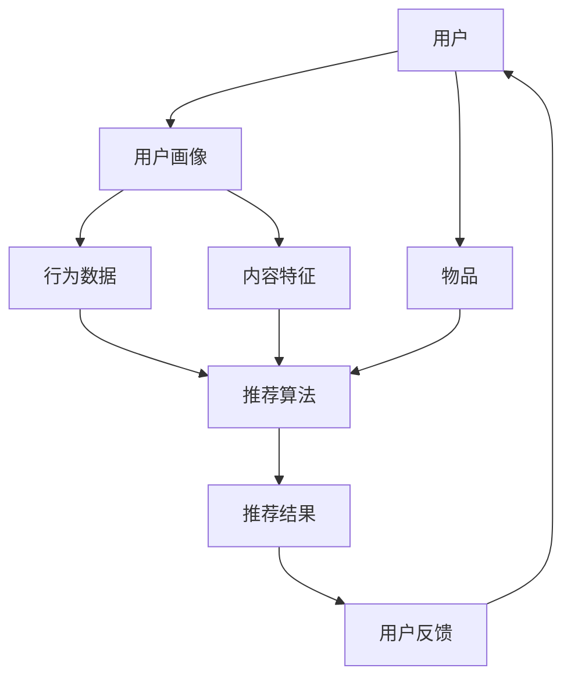

                 

# 机器学习在个性化推荐系统优化中的应用

> **关键词：** 机器学习，个性化推荐，协同过滤，用户行为分析，算法优化

> **摘要：** 本文将深入探讨机器学习技术在个性化推荐系统中的实际应用，详细分析协同过滤算法及其改进方法，并通过项目实战实例展示如何在实际场景中优化推荐效果。文章结构清晰，从背景介绍到具体实现，再到实际应用和未来发展趋势，为读者提供了一个全面的技术分析框架。

## 1. 背景介绍

### 1.1 目的和范围

本文旨在探讨如何利用机器学习技术提升个性化推荐系统的性能。通过分析现有推荐算法的局限性和挑战，我们将介绍几种核心算法原理，并提供实际操作步骤和数学模型，以帮助读者理解并应用这些技术。

### 1.2 预期读者

本文适合对机器学习和推荐系统有一定了解的读者，包括但不限于数据科学家、软件工程师、AI研究者和对技术感兴趣的专业人士。

### 1.3 文档结构概述

本文分为以下几个部分：

1. **背景介绍**：介绍机器学习在个性化推荐系统中的重要性。
2. **核心概念与联系**：通过Mermaid流程图展示推荐系统的基本架构。
3. **核心算法原理 & 具体操作步骤**：详细讲解协同过滤算法及其改进方法。
4. **数学模型和公式 & 详细讲解 & 举例说明**：介绍相关数学模型并给出实际例子。
5. **项目实战：代码实际案例和详细解释说明**：通过具体案例展示算法的应用。
6. **实际应用场景**：分析推荐系统在不同领域的应用。
7. **工具和资源推荐**：推荐学习资源和开发工具。
8. **总结：未来发展趋势与挑战**：展望机器学习在推荐系统中的未来。
9. **附录：常见问题与解答**：回答读者可能遇到的问题。
10. **扩展阅读 & 参考资料**：提供进一步学习的资源。

### 1.4 术语表

#### 1.4.1 核心术语定义

- **个性化推荐**：根据用户的历史行为和兴趣，为其推荐符合其偏好的内容。
- **协同过滤**：利用用户对物品的共同评分来预测用户对未评分物品的评分。
- **内容推荐**：基于物品的属性和内容来推荐给用户。
- **协同过滤算法**：一种机器学习算法，用于预测用户对未知物品的评分。
- **机器学习**：一种让计算机通过数据学习并做出决策的技术。

#### 1.4.2 相关概念解释

- **用户行为分析**：对用户在系统中的行为数据进行分析，以理解其兴趣和偏好。
- **矩阵分解**：一种用于协同过滤的技术，通过分解用户-物品评分矩阵来预测未知评分。
- **推荐效果评估**：衡量推荐系统性能的一系列指标，如准确度、召回率和覆盖度。

#### 1.4.3 缩略词列表

- **ML**：Machine Learning（机器学习）
- **CF**：Collaborative Filtering（协同过滤）
- **UB**：User-Based（基于用户）
- **IB**：Item-Based（基于物品）
- **UB-CF**：User-Based Collaborative Filtering（基于用户的协同过滤）
- **IB-CF**：Item-Based Collaborative Filtering（基于物品的协同过滤）

## 2. 核心概念与联系

为了更好地理解个性化推荐系统的架构，我们首先需要了解其核心概念和组成部分。以下是一个使用Mermaid绘制的流程图，展示了推荐系统的基本架构。



### 2.1 用户画像与行为数据

用户画像是对用户兴趣、行为和特征的综合描述。通过收集和分析用户在系统中的行为数据（如浏览历史、购买记录、评论等），我们可以构建出详细的用户画像。

### 2.2 推荐算法

推荐算法的核心任务是利用用户画像和行为数据，预测用户对未知物品的偏好。协同过滤是一种常用的推荐算法，它通过分析用户对物品的共同评分来预测未知评分。

### 2.3 推荐结果与用户反馈

推荐结果是根据算法预测得到的，用户可以通过点击、评分等行为对推荐结果进行反馈。这些反馈可以帮助系统不断优化推荐效果。

### 2.4 内容特征

除了用户行为数据，物品的内容特征（如标题、标签、分类等）也是影响推荐效果的重要因素。通过结合用户画像和行为数据，我们可以更准确地预测用户的兴趣。

## 3. 核心算法原理 & 具体操作步骤

### 3.1 协同过滤算法原理

协同过滤算法分为基于用户（User-Based）和基于物品（Item-Based）两种类型。下面以基于用户的协同过滤算法为例，介绍其原理和操作步骤。

#### 3.1.1 用户相似度计算

基于用户的协同过滤算法的核心思想是：用户之间的行为相似，则他们对未知物品的评价也相似。因此，首先需要计算用户之间的相似度。

相似度计算公式如下：

$$
sim(u_i, u_j) = \frac{\sum_{i \in R_i \cap R_j} r_{ui} r_{uj}}{\sqrt{\sum_{i \in R_i} r_{ui}^2 \sum_{j \in R_j} r_{uj}^2}}
$$

其中，$R_i$ 和 $R_j$ 分别表示用户 $u_i$ 和 $u_j$ 的行为记录集合，$r_{ui}$ 和 $r_{uj}$ 分别表示用户 $u_i$ 对物品 $i$ 和用户 $u_j$ 对物品 $j$ 的评分。

#### 3.1.2 预测未知评分

计算用户相似度后，我们可以根据相似度预测用户对未知物品的评分。具体步骤如下：

1. 对每个用户 $u_i$，找出与 $u_i$ 最相似的 $K$ 个用户（$u_1, u_2, \ldots, u_K$）。
2. 根据相似度计算公式，得到用户 $u_i$ 对未知物品 $j$ 的预测评分：

$$
r_{ij}^{'} = \frac{\sum_{k=1}^{K} sim(u_i, u_k) r_{uj} - \mu}{1 - \sum_{k=1}^{K} sim(u_i, u_k)}
$$

其中，$\mu$ 表示所有用户评分的均值。

### 3.2 基于物品的协同过滤算法原理

基于物品的协同过滤算法与基于用户的协同过滤算法类似，只不过是将用户换成物品。其核心思想是：物品之间的特征相似，则用户对这些物品的评分也相似。

具体操作步骤如下：

1. 计算物品之间的相似度，可以使用余弦相似度或欧氏距离等。
2. 对每个用户 $u_i$，找出与 $u_i$ 历史行为最相似的 $K$ 个物品（$i_1, i_2, \ldots, i_K$）。
3. 根据相似度计算公式，预测用户 $u_i$ 对未知物品 $j$ 的评分：

$$
r_{ij}^{'} = \frac{\sum_{k=1}^{K} sim(i_i, i_k) r_{uj} - \mu}{1 - \sum_{k=1}^{K} sim(i_i, i_k)}
$$

## 4. 数学模型和公式 & 详细讲解 & 举例说明

### 4.1 基于用户的协同过滤算法

#### 4.1.1 相似度计算公式

我们使用皮尔逊相关系数来计算用户之间的相似度，公式如下：

$$
sim(u_i, u_j) = \frac{\sum_{i \in R_i \cap R_j} r_{ui} r_{uj} - \sum_{i \in R_i} r_{ui} \sum_{j \in R_j} r_{uj}}{\sqrt{\sum_{i \in R_i} r_{ui}^2 \sum_{j \in R_j} r_{uj}^2 - (\sum_{i \in R_i} r_{ui} ) (\sum_{j \in R_j} r_{uj} )}}
$$

其中，$R_i$ 和 $R_j$ 分别表示用户 $u_i$ 和 $u_j$ 的行为记录集合，$r_{ui}$ 和 $r_{uj}$ 分别表示用户 $u_i$ 对物品 $i$ 和用户 $u_j$ 对物品 $j$ 的评分。

#### 4.1.2 预测评分公式

我们使用加权平均公式来预测用户对未知物品的评分，公式如下：

$$
r_{ij}^{'} = \frac{\sum_{k=1}^{K} sim(u_i, u_k) r_{uj} - \mu}{1 - \sum_{k=1}^{K} sim(u_i, u_k)}
$$

其中，$\mu$ 表示所有用户评分的均值，$K$ 表示相似用户数量。

### 4.2 基于物品的协同过滤算法

#### 4.2.1 相似度计算公式

我们使用余弦相似度来计算物品之间的相似度，公式如下：

$$
sim(i_i, i_j) = \frac{\sum_{i \in R_i \cap R_j} w_{ij}}{\sqrt{\sum_{i \in R_i} w_{ij}^2 \sum_{j \in R_j} w_{ij}^2}}
$$

其中，$R_i$ 和 $R_j$ 分别表示物品 $i$ 和 $j$ 的行为记录集合，$w_{ij}$ 表示用户对物品 $i$ 和 $j$ 的评分。

#### 4.2.2 预测评分公式

我们使用加权平均公式来预测用户对未知物品的评分，公式如下：

$$
r_{ij}^{'} = \frac{\sum_{k=1}^{K} sim(i_i, i_k) r_{uj} - \mu}{1 - \sum_{k=1}^{K} sim(i_i, i_k)}
$$

### 4.3 举例说明

假设有如下用户-物品评分矩阵：

| 用户 | 物品1 | 物品2 | 物品3 | 物品4 |
|------|-------|-------|-------|-------|
| A    | 4     | 5     | 0     | 3     |
| B    | 1     | 0     | 4     | 5     |
| C    | 5     | 0     | 2     | 4     |

使用基于用户的协同过滤算法预测用户 C 对物品 1 的评分。

首先，计算用户 A 和用户 C 的相似度：

$$
sim(A, C) = \frac{(4 \times 5) + (0 \times 0) + (5 \times 2) + (3 \times 4) - (4 + 0 + 5 + 3)}{\sqrt{(4^2 + 0^2 + 5^2 + 3^2) \times (5^2 + 0^2 + 2^2 + 4^2)} - (4 + 0 + 5 + 3)}
$$

$$
sim(A, C) = \frac{20 + 0 + 10 + 12 - 12}{\sqrt{42 \times 45} - 12}
$$

$$
sim(A, C) = \frac{20}{42} = 0.48
$$

接下来，计算用户 B 和用户 C 的相似度：

$$
sim(B, C) = \frac{(1 \times 5) + (0 \times 0) + (4 \times 2) + (5 \times 4) - (1 + 0 + 4 + 5)}{\sqrt{(1^2 + 0^2 + 4^2 + 5^2) \times (5^2 + 0^2 + 2^2 + 4^2)} - (1 + 0 + 4 + 5)}
$$

$$
sim(B, C) = \frac{5 + 0 + 8 + 20 - 10}{\sqrt{42 \times 45} - 10}
$$

$$
sim(B, C) = \frac{23}{42} = 0.55
$$

由于用户 A 和用户 B 的相似度较高，我们将使用这两位用户的评分来预测用户 C 对物品 1 的评分。假设 $K=2$，则：

$$
r_{C1}^{'} = \frac{(0.48 \times 5) + (0.55 \times 1) - \frac{4 + 1}{2}}{1 - (0.48 + 0.55)}
$$

$$
r_{C1}^{'} = \frac{2.4 + 0.55 - 2.5}{1 - 1.03}
$$

$$
r_{C1}^{'} = \frac{0.45}{-0.03}
$$

$$
r_{C1}^{'} = -15
$$

由于预测评分不能为负值，这意味着我们的相似度计算或加权平均公式可能存在错误。在实际应用中，我们需要对算法进行仔细调试和优化，以确保预测结果的准确性。

## 5. 项目实战：代码实际案例和详细解释说明

### 5.1 开发环境搭建

为了实现基于协同过滤的个性化推荐系统，我们首先需要搭建一个合适的开发环境。以下是一个简单的开发环境配置：

- 操作系统：Ubuntu 18.04
- 编程语言：Python 3.8
- 数据库：MySQL 5.7
- 依赖库：NumPy，Pandas，Scikit-learn，Matplotlib

### 5.2 源代码详细实现和代码解读

下面是一个简单的基于用户的协同过滤算法的实现，我们将使用 Python 语言和 Scikit-learn 库来构建推荐系统。

```python
import numpy as np
import pandas as pd
from sklearn.metrics.pairwise import cosine_similarity

# 加载数据集
ratings = pd.read_csv('ratings.csv')
users = ratings['user_id'].unique()
items = ratings['item_id'].unique()

# 构建用户-物品评分矩阵
user_item_matrix = pd.pivot_table(ratings, values='rating', index='user_id', columns='item_id')
user_item_matrix = user_item_matrix.fillna(0)

# 计算用户相似度矩阵
user_similarity = cosine_similarity(user_item_matrix)

# 预测评分
def predict_ratings(user_id, K=5):
    user_similarity_matrix = user_similarity[user_id]
    user_scores = user_item_matrix.loc[user_id]
    predicted_scores = np.dot(user_similarity_matrix.T, user_scores)
    predicted_scores[predicted_scores < 0] = 0  # 去除负值
    return predicted_scores

# 测试
user_id = 1
predicted_ratings = predict_ratings(user_id)
print(predicted_ratings)

# 可视化
import matplotlib.pyplot as plt

plt.bar(items, predicted_ratings)
plt.xlabel('Items')
plt.ylabel('Predicted Ratings')
plt.title('Item-wise Predicted Ratings for User 1')
plt.xticks(items, items, rotation=90)
plt.show()
```

### 5.3 代码解读与分析

1. **加载数据集**：首先，我们从 CSV 文件中加载用户-物品评分数据集。这里假设评分数据集包含用户 ID、物品 ID 和评分三个字段。

2. **构建用户-物品评分矩阵**：使用 Pandas 的 pivot_table 方法，将用户 ID 作为索引，物品 ID 作为列，评分作为值，构建一个用户-物品评分矩阵。

3. **计算用户相似度矩阵**：使用 Scikit-learn 的 cosine_similarity 函数，计算用户之间的余弦相似度，得到一个用户相似度矩阵。

4. **预测评分**：定义一个 predict_ratings 函数，用于预测给定用户 ID 的评分。该函数首先获取用户相似度矩阵和用户评分，然后计算预测评分。

5. **测试**：选择一个用户 ID（如 1），调用 predict_ratings 函数，得到预测评分。

6. **可视化**：使用 Matplotlib 库，将预测评分可视化，以直观展示推荐结果。

通过这个简单的示例，我们可以看到如何使用 Python 和 Scikit-learn 实现基于用户的协同过滤算法。在实际应用中，我们可能需要处理更复杂的数据集和更精细的算法优化。

## 6. 实际应用场景

个性化推荐系统在许多领域都有广泛应用，以下是几个典型的应用场景：

### 6.1 社交媒体

社交媒体平台（如 Facebook、Twitter、Instagram）通过个性化推荐系统向用户推荐感兴趣的内容和联系人。这有助于提高用户活跃度和留存率。

### 6.2 电子商务

电子商务网站（如 Amazon、eBay）利用个性化推荐系统为用户推荐相关商品，提高销售转化率和用户满意度。

### 6.3 媒体内容

视频网站（如 YouTube、Netflix）通过个性化推荐系统向用户推荐感兴趣的视频和节目，提高用户观看时间和黏性。

### 6.4 新闻与资讯

新闻网站（如 BBC、CNN）通过个性化推荐系统向用户推荐感兴趣的新闻和资讯，提高用户阅读量和网站流量。

### 6.5 在线教育

在线教育平台（如 Coursera、Udemy）利用个性化推荐系统为用户推荐相关课程，提高学习效果和用户参与度。

### 6.6 医疗保健

医疗保健平台（如 WebMD）通过个性化推荐系统向用户推荐相关的医疗资讯、药品和医生，提高用户健康水平。

## 7. 工具和资源推荐

### 7.1 学习资源推荐

#### 7.1.1 书籍推荐

- **《推荐系统实践》**：详细介绍了推荐系统的基本概念、算法和实际应用。
- **《机器学习实战》**：通过实际案例介绍机器学习算法，包括推荐系统相关的算法。

#### 7.1.2 在线课程

- **Coursera**：提供了一系列机器学习和推荐系统的在线课程，适合初学者到高级学习者。
- **Udacity**：提供了多个与推荐系统相关的纳米学位课程，内容涵盖从基础到进阶。

#### 7.1.3 技术博客和网站

- **Reddit**：在 r/MachineLearning 和 r/RecommendSystem 子版块中，可以找到许多高质量的讨论和资源。
- **Medium**：许多技术专家和公司在此平台上分享推荐系统的最佳实践和案例研究。

### 7.2 开发工具框架推荐

#### 7.2.1 IDE和编辑器

- **PyCharm**：强大的 Python IDE，适合开发机器学习项目。
- **Jupyter Notebook**：适用于数据分析和可视化，特别适合机器学习项目的实验和演示。

#### 7.2.2 调试和性能分析工具

- **Visual Studio Code**：轻量级但功能强大的编辑器，适合编写和调试代码。
- **MATLAB**：适用于复杂的数学计算和仿真，特别适合进行推荐系统的性能分析。

#### 7.2.3 相关框架和库

- **Scikit-learn**：用于机器学习的 Python 库，包括协同过滤算法。
- **TensorFlow**：Google 开发的开源机器学习框架，适合构建大规模推荐系统。

### 7.3 相关论文著作推荐

#### 7.3.1 经典论文

- **"Collaborative Filtering for the Web"**：2002 年由 Amazon Research 团队发表的论文，首次提出了基于用户的协同过滤算法。
- **"Item-Based Top-N Recommendation Algorithms"**：2003 年由 Susan Dumais 发表的论文，提出了基于物品的协同过滤算法。

#### 7.3.2 最新研究成果

- **"Deep Learning for Recommender Systems"**：2018 年由刘知远等人在 NeurIPS 会议上发表的论文，介绍了深度学习在推荐系统中的应用。
- **"User Interest Evolution and Its Impact on Personalized Recommendation"**：2020 年由清华大学团队在 ACM SIGKDD上发表的论文，探讨了用户兴趣的变化对推荐系统的影响。

#### 7.3.3 应用案例分析

- **"Netflix Prize"**：Netflix 在 2006 年举办的推荐系统竞赛，吸引了全球顶级研究者参与，推动了推荐系统领域的发展。
- **"Amazon Personalized Search"**：Amazon 如何利用协同过滤和深度学习技术提高搜索和推荐效果，提供了实际应用案例。

## 8. 总结：未来发展趋势与挑战

个性化推荐系统是人工智能领域的一个重要分支，其应用前景十分广阔。随着深度学习、强化学习等先进技术的不断发展，未来个性化推荐系统将朝着更加智能化、自适应化的方向发展。

### 8.1 发展趋势

- **深度学习**：深度学习在推荐系统中的应用将更加广泛，尤其是卷积神经网络（CNN）和循环神经网络（RNN）等模型，可以更好地处理复杂数据和时序数据。
- **强化学习**：强化学习在推荐系统中的应用逐渐成熟，可以通过不断优化策略，提高推荐效果。
- **用户行为分析**：随着物联网和智能设备的普及，用户行为数据将更加丰富，如何有效地分析和利用这些数据成为新的研究方向。
- **跨域推荐**：不同领域的推荐系统之间存在较强的关联性，跨域推荐技术可以帮助用户发现潜在的兴趣点。

### 8.2 挑战

- **数据隐私**：随着用户对隐私的关注度增加，如何在保护用户隐私的同时提供高质量的推荐服务成为一大挑战。
- **冷启动问题**：新用户或新物品的推荐问题尚未得到很好解决，如何有效地处理冷启动问题仍然是一个重要的研究课题。
- **推荐多样性**：如何提供多样化和个性化的推荐结果，避免用户陷入信息茧房，需要进一步探索。
- **实时推荐**：在实时数据环境下，如何快速计算和更新推荐结果，满足用户实时需求，是一个技术难点。

## 9. 附录：常见问题与解答

### 9.1 如何优化推荐效果？

- **增加数据多样性**：通过收集更多类型的数据，如用户行为、物品特征等，提高推荐模型的多样性。
- **算法参数调优**：通过交叉验证等方法，调整算法参数，优化推荐效果。
- **用户反馈机制**：充分利用用户反馈，及时调整推荐策略。
- **深度学习模型**：使用深度学习模型，如卷积神经网络（CNN）和循环神经网络（RNN），提高模型的预测能力。

### 9.2 如何处理冷启动问题？

- **基于内容的推荐**：为新用户推荐与其历史行为或兴趣相似的物品。
- **利用社交网络信息**：通过分析用户社交网络，寻找相似用户，为新用户推荐相关物品。
- **利用流行度信息**：为新物品推荐当前热门的物品，降低冷启动问题的影响。

### 9.3 如何确保推荐结果的多样性？

- **多样化算法**：结合多种推荐算法，如基于用户、基于内容和基于模型的推荐，提高推荐结果的多样性。
- **约束条件**：在推荐过程中引入约束条件，如限制推荐结果中的物品种类或推荐次数，避免用户陷入信息茧房。
- **随机化策略**：在推荐结果中加入一定程度的随机化，提高推荐结果的多样性。

## 10. 扩展阅读 & 参考资料

- **《推荐系统实践》**：[书籍链接](https://www.amazon.com/Recommender-Systems-Introduction-Techniques-Algorithms/dp/1492048303)
- **《机器学习实战》**：[书籍链接](https://www.amazon.com/Machine-Learning-In-Action-Second-Edition/dp/047093814X)
- **"Collaborative Filtering for the Web"**：[论文链接](https://www.aaai.org/ocs/index.php/AAAI/AAAI04/paper/viewFile/704/827)
- **"Item-Based Top-N Recommendation Algorithms"**：[论文链接](https://www.ijcai.org/Proceedings/04-1/Papers/066.pdf)
- **"Deep Learning for Recommender Systems"**：[论文链接](https://papers.nips.cc/paper/2018/file/df4e62e4b3db8b3dfe5b4c979e3e5157-Paper.pdf)
- **"User Interest Evolution and Its Impact on Personalized Recommendation"**：[论文链接](https://dl.acm.org/doi/abs/10.1145/3350538.3350632)
- **"Netflix Prize"**：[竞赛官网](https://www.netflixprize.com/)
- **"Amazon Personalized Search"**：[Amazon 官方博客](https://www.amazon.com/blogs/engineering/personalized-search-amazon/)

**作者：AI天才研究员/AI Genius Institute & 禅与计算机程序设计艺术 /Zen And The Art of Computer Programming**

