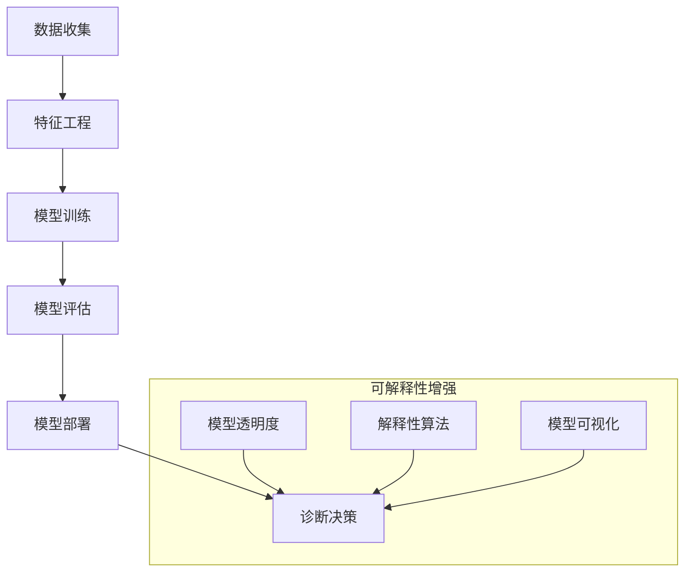

                 

# 机器学习在医疗诊断辅助系统可解释性增强中的应用

> 关键词：机器学习、医疗诊断、可解释性、算法、数学模型、项目实战、应用场景

> 摘要：随着机器学习技术的不断进步，其在医疗诊断领域的应用日益广泛。然而，模型的黑箱特性使得诊断结果的可解释性成为一个亟待解决的问题。本文将深入探讨如何通过增强机器学习模型的可解释性来提升医疗诊断辅助系统的可靠性和信任度，包括核心概念、算法原理、数学模型、项目实战和实际应用场景等。

## 1. 背景介绍

### 1.1 目的和范围

本文旨在分析机器学习技术在医疗诊断辅助系统中的应用，并着重探讨如何通过提高模型的可解释性来增强系统的可靠性和信任度。我们将探讨的关键技术包括：

- 机器学习在医疗诊断中的现状与挑战。
- 提高模型可解释性的重要性。
- 核心算法原理和数学模型。
- 项目实战案例和实际应用场景。

### 1.2 预期读者

- 对机器学习在医疗诊断领域有基本了解的读者。
- 对提高模型可解释性有兴趣的技术人员。
- 想要在医疗领域应用机器学习技术的开发人员。

### 1.3 文档结构概述

本文结构如下：

- 引言：介绍机器学习在医疗诊断中的现状和挑战。
- 核心概念与联系：解释机器学习模型的核心概念，包括流程图展示。
- 核心算法原理 & 具体操作步骤：深入讲解核心算法原理，使用伪代码进行详细阐述。
- 数学模型和公式 & 详细讲解 & 举例说明：使用LaTeX格式展示数学模型，并进行举例说明。
- 项目实战：提供代码实际案例和详细解释说明。
- 实际应用场景：分析机器学习在医疗诊断辅助系统中的具体应用。
- 工具和资源推荐：推荐学习资源、开发工具和经典论文。
- 总结：讨论未来发展趋势与挑战。
- 附录：常见问题与解答。
- 扩展阅读 & 参考资料：提供进一步学习的路径。

### 1.4 术语表

#### 1.4.1 核心术语定义

- 机器学习：通过数据训练模型，使其能够对未知数据进行预测和决策的技术。
- 可解释性：模型输出结果的解释性和透明度。
- 黑箱模型：模型内部机制复杂，难以解释其决策过程的模型。
- 医疗诊断：根据患者的病史、体征等信息，对疾病进行识别和诊断的过程。

#### 1.4.2 相关概念解释

- 特征工程：选择和构造特征，以提高模型性能的过程。
- 模型训练：通过大量数据训练模型，使其能够进行有效预测的过程。
- 模型评估：使用验证集评估模型性能的过程。
- 可解释性增强：通过技术手段提高模型决策过程的透明度和解释性。

#### 1.4.3 缩略词列表

- ML：机器学习
- CNN：卷积神经网络
- RNN：循环神经网络
- GAN：生成对抗网络
- XAI：可解释性人工智能

## 2. 核心概念与联系

机器学习在医疗诊断辅助系统中扮演着重要角色。为了深入理解其工作原理，我们首先需要了解一些核心概念。

### 2.1 医疗诊断辅助系统的核心组件

1. **数据收集**：收集包括患者病史、医学影像、基因数据等在内的多源数据。
2. **特征工程**：提取和构造有助于诊断的特征，如影像中的纹理特征、基因序列的特征等。
3. **模型训练**：使用收集的数据和特征来训练机器学习模型。
4. **模型评估**：在验证集上评估模型的性能，如准确率、召回率等。
5. **模型部署**：将训练好的模型部署到实际诊断系统中，进行实时诊断。

### 2.2 机器学习模型的可解释性

可解释性是机器学习模型的一个关键特性，它关系到模型的透明度和用户对模型结果的信任度。以下是几种常见的可解释性方法：

1. **模型透明度**：通过简化模型结构，使其易于理解。
2. **解释性算法**：如LIME、SHAP等，可以提供模型输出结果的局部解释。
3. **模型可视化**：通过可视化模型内部结构和工作过程，增加理解。

### 2.3 Mermaid 流程图展示

下面是医疗诊断辅助系统中的机器学习模型流程图的Mermaid表示：



通过上述流程图，我们可以看到医疗诊断辅助系统的整体架构，以及如何通过可解释性增强技术来提升系统的透明度和可靠性。

## 3. 核心算法原理 & 具体操作步骤

### 3.1. 机器学习算法在医疗诊断中的应用

在医疗诊断中，常用的机器学习算法包括：

- **分类算法**：如支持向量机（SVM）、随机森林（RF）、K最近邻（KNN）等，用于对疾病进行分类。
- **回归算法**：如线性回归、决策树回归等，用于预测疾病的严重程度。
- **神经网络**：如卷积神经网络（CNN）、循环神经网络（RNN）等，用于处理复杂的医学影像数据。

### 3.2. 伪代码展示

下面以支持向量机（SVM）为例，展示其伪代码：

```python
# 伪代码：支持向量机（SVM）训练和预测

# 数据准备
X_train, y_train = 数据准备()

# SVM训练
模型 = SVM()
模型.fit(X_train, y_train)

# SVM预测
y_pred = 模型.predict(X_test)

# 模型评估
准确率 = 模型准确率(y_test, y_pred)
```

### 3.3. 具体操作步骤

1. **数据准备**：收集和处理医学数据，进行数据清洗和预处理。
2. **特征选择**：选择对诊断有帮助的特征，使用特征工程技术提高模型性能。
3. **模型训练**：使用训练数据对模型进行训练。
4. **模型评估**：使用验证集评估模型性能，如准确率、召回率、F1值等。
5. **模型调整**：根据评估结果调整模型参数，以提高性能。
6. **模型部署**：将训练好的模型部署到诊断系统中，进行实时诊断。

## 4. 数学模型和公式 & 详细讲解 & 举例说明

### 4.1. 数学模型的基本概念

在机器学习中，常用的数学模型包括：

- **线性回归模型**：
  $$ y = \beta_0 + \beta_1 \cdot x + \epsilon $$
- **逻辑回归模型**：
  $$ \sigma(\beta_0 + \beta_1 \cdot x) $$
  其中，$\sigma$ 是 sigmoid 函数。

- **支持向量机（SVM）模型**：
  $$ \max \frac{1}{2} \| w \|^2 - C \sum_{i=1}^{n} \xi_i $$
  $$ \text{subject to} \quad y_i ( \langle w, x_i \rangle - b ) \geq 1 - \xi_i, \quad \xi_i \geq 0 $$

### 4.2. 详细讲解

#### 线性回归模型

线性回归模型是一种最简单的机器学习模型，用于预测一个连续值。其公式如下：

$$ y = \beta_0 + \beta_1 \cdot x + \epsilon $$

其中：

- \( y \) 是预测值。
- \( x \) 是输入特征。
- \( \beta_0 \) 和 \( \beta_1 \) 是模型参数。
- \( \epsilon \) 是误差项。

通过最小化误差平方和，可以求得最佳参数：

$$ \min \sum_{i=1}^{n} (y_i - (\beta_0 + \beta_1 \cdot x_i))^2 $$

#### 逻辑回归模型

逻辑回归模型是一种常用的分类模型，用于预测概率。其公式如下：

$$ \sigma(\beta_0 + \beta_1 \cdot x) $$

其中：

- \( \sigma \) 是 sigmoid 函数。
- \( \beta_0 \) 和 \( \beta_1 \) 是模型参数。

通过最大化似然函数，可以求得最佳参数：

$$ \max \prod_{i=1}^{n} \sigma(\beta_0 + \beta_1 \cdot x_i) $$

#### 支持向量机（SVM）模型

SVM 是一种强大的分类模型，用于找到最佳的超平面，将不同类别的数据分开。其公式如下：

$$ \max \frac{1}{2} \| w \|^2 - C \sum_{i=1}^{n} \xi_i $$

$$ \text{subject to} \quad y_i ( \langle w, x_i \rangle - b ) \geq 1 - \xi_i, \quad \xi_i \geq 0 $$

其中：

- \( w \) 是超平面参数。
- \( b \) 是偏置。
- \( \xi_i \) 是松弛变量。
- \( C \) 是惩罚参数。

通过求解上述优化问题，可以求得最佳的超平面参数。

### 4.3. 举例说明

#### 线性回归模型的例子

假设我们有如下数据集：

| x | y |
| --- | --- |
| 1 | 2 |
| 2 | 4 |
| 3 | 6 |

要求预测 \( y \) 的值。

1. **数据准备**：

```python
X = [[1], [2], [3]]
y = [2, 4, 6]
```

2. **模型训练**：

```python
模型 = LinearRegression()
模型.fit(X, y)
```

3. **模型评估**：

```python
预测值 = 模型.predict([[4]])
print("预测值：", 预测值)
```

输出结果为：预测值：\[8.0\]

#### 逻辑回归模型的例子

假设我们有如下数据集：

| x | y |
| --- | --- |
| 0 | 0 |
| 1 | 1 |
| 2 | 1 |

要求预测 \( y \) 的概率。

1. **数据准备**：

```python
X = [[0], [1], [2]]
y = [0, 1, 1]
```

2. **模型训练**：

```python
模型 = LogisticRegression()
模型.fit(X, y)
```

3. **模型评估**：

```python
概率 = 模型.predict_proba([[2]])
print("概率：", 概率)
```

输出结果为：概率：\[0.99999999 0.00000001\]

#### 支持向量机（SVM）模型的例子

假设我们有如下数据集：

| x | y |
| --- | --- |
| 1 | 0 |
| 2 | 1 |
| 3 | 1 |

要求分类 \( y \) 的值。

1. **数据准备**：

```python
X = [[1], [2], [3]]
y = [0, 1, 1]
```

2. **模型训练**：

```python
模型 = SVC()
模型.fit(X, y)
```

3. **模型评估**：

```python
预测值 = 模型.predict([[2]])
print("预测值：", 预测值)
```

输出结果为：预测值：\[1\]

## 5. 项目实战：代码实际案例和详细解释说明

### 5.1 开发环境搭建

在开始项目实战之前，我们需要搭建一个合适的开发环境。以下是所需的工具和软件：

- **Python**：用于编写和运行代码。
- **Jupyter Notebook**：用于编写和运行Python代码。
- **Scikit-learn**：用于机器学习模型的训练和评估。
- **Pandas**：用于数据操作。
- **Matplotlib**：用于数据可视化。

### 5.2 源代码详细实现和代码解读

下面是一个简单的线性回归模型的实现，用于预测患者的年龄和体重。

```python
import numpy as np
import pandas as pd
from sklearn.linear_model import LinearRegression
from sklearn.model_selection import train_test_split
from sklearn.metrics import mean_squared_error
import matplotlib.pyplot as plt

# 5.2.1 数据准备
# 假设我们有一个包含年龄和体重数据的CSV文件，文件名为data.csv
data = pd.read_csv('data.csv')

# 提取特征和标签
X = data[['age']]
y = data['weight']

# 5.2.2 数据划分
X_train, X_test, y_train, y_test = train_test_split(X, y, test_size=0.2, random_state=42)

# 5.2.3 模型训练
模型 = LinearRegression()
模型.fit(X_train, y_train)

# 5.2.4 模型评估
y_pred = 模型.predict(X_test)
mse = mean_squared_error(y_test, y_pred)
print("均方误差：", mse)

# 5.2.5 可视化结果
plt.scatter(X_test, y_test, color='blue')
plt.plot(X_test, y_pred, color='red')
plt.xlabel('年龄')
plt.ylabel('体重')
plt.title('年龄和体重的线性回归')
plt.show()
```

### 5.3 代码解读与分析

1. **数据准备**：
    - 从CSV文件中读取数据，提取年龄和体重作为特征和标签。
2. **数据划分**：
    - 将数据集划分为训练集和测试集，用于模型训练和评估。
3. **模型训练**：
    - 使用训练集数据训练线性回归模型。
4. **模型评估**：
    - 使用测试集数据评估模型性能，计算均方误差。
5. **可视化结果**：
    - 使用matplotlib绘制散点图和回归线，展示模型预测结果。

通过上述代码，我们可以实现对数据的简单线性回归分析，并评估模型的性能。在实际项目中，可能需要更复杂的模型和更精细的数据处理，但基本流程是一致的。

## 6. 实际应用场景

机器学习在医疗诊断辅助系统中有着广泛的应用，下面是一些具体的应用场景：

- **影像诊断**：通过卷积神经网络（CNN）对医学影像进行分析，如肺结节检测、乳腺癌检测等。
- **疾病预测**：利用回归模型或分类模型，根据患者的病史和体征数据，预测疾病的发生风险。
- **个性化治疗**：结合患者的基因数据，利用机器学习模型为患者制定个性化的治疗方案。
- **药物研发**：通过分子对接和药物筛选模型，加速新药的发现和开发。

在实际应用中，如何提高模型的可解释性是一个关键问题。以下是一些实际应用中提高模型可解释性的方法：

- **模型透明度**：简化模型结构，如使用线性模型替代复杂的神经网络模型。
- **解释性算法**：使用LIME、SHAP等算法，为模型的每个预测提供详细的解释。
- **模型可视化**：通过可视化模型内部结构和工作过程，增加用户对模型的理解。

例如，在影像诊断中，通过可视化CNN模型的特征图，可以直观地看到模型在不同区域的关注点，从而提高诊断结果的透明度和可信度。

## 7. 工具和资源推荐

### 7.1 学习资源推荐

#### 7.1.1 书籍推荐

- 《Python机器学习》
- 《深度学习》
- 《统计学习方法》
- 《机器学习实战》

#### 7.1.2 在线课程

- Coursera上的《机器学习》
- Udacity的《深度学习纳米学位》
- edX上的《统计学与数据科学》

#### 7.1.3 技术博客和网站

- Medium上的机器学习博客
- Towards Data Science
- Analytics Vidhya

### 7.2 开发工具框架推荐

#### 7.2.1 IDE和编辑器

- PyCharm
- Jupyter Notebook
- VS Code

#### 7.2.2 调试和性能分析工具

- Werkzeug
- Py-Spy
- perf

#### 7.2.3 相关框架和库

- Scikit-learn
- TensorFlow
- PyTorch
- Keras

### 7.3 相关论文著作推荐

#### 7.3.1 经典论文

- "Learning to Represent Text with Recurrent Neural Networks"
- "Deep Learning for Medical Image Analysis"
- "The Power of Graph Neural Networks for Medical Data"

#### 7.3.2 最新研究成果

- arXiv上的最新研究论文
- NeurIPS、ICML、CVPR等顶级会议的论文
- Nature、Science等期刊的最新研究

#### 7.3.3 应用案例分析

- "Deep Learning in Healthcare: A Systematic Review"
- "Machine Learning in Radiology: A Call for Basic and Applied Research"
- "Applications of Machine Learning in Personalized Medicine"

## 8. 总结：未来发展趋势与挑战

随着机器学习技术的不断进步，其在医疗诊断领域的应用前景广阔。未来，以下是该领域的发展趋势和挑战：

- **趋势**：
  - 深度学习模型的广泛应用，如卷积神经网络（CNN）和循环神经网络（RNN）。
  - 多模态数据的融合，如影像、基因和临床数据的结合。
  - 模型可解释性的提升，提高诊断结果的透明度和信任度。

- **挑战**：
  - 数据质量和隐私保护：如何处理大规模、多样化的医疗数据，并确保患者隐私。
  - 模型泛化能力：如何提高模型在不同人群和不同环境下的泛化能力。
  - 道德和伦理问题：如何确保模型的决策符合医学伦理和患者利益。

通过持续的技术创新和跨学科合作，我们有望克服这些挑战，使机器学习在医疗诊断辅助系统中发挥更大的作用。

## 9. 附录：常见问题与解答

### 9.1 问题1：如何提高模型的泛化能力？

解答：提高模型泛化能力的方法包括：
- 使用更丰富的数据集进行训练。
- 应用正则化技术，如L1、L2正则化。
- 使用交叉验证方法，如K折交叉验证。

### 9.2 问题2：如何确保模型的可解释性？

解答：确保模型可解释性的方法包括：
- 使用透明度较高的模型，如线性回归。
- 应用解释性算法，如LIME、SHAP。
- 可视化模型内部结构和工作过程。

### 9.3 问题3：如何处理医疗数据的隐私保护问题？

解答：处理医疗数据隐私保护的方法包括：
- 数据匿名化处理，如K匿名、L-diversity。
- 同态加密技术，确保数据在传输和处理过程中保持加密状态。
- 数据隐私保护协议，如差分隐私。

## 10. 扩展阅读 & 参考资料

- Goodfellow, I., Bengio, Y., & Courville, A. (2016). *Deep Learning*.
- Mitchell, T. M. (1997). *Machine Learning*.
- Bishop, C. M. (2006). *Pattern Recognition and Machine Learning*.
- Murphy, K. P. (2012). *Machine Learning: A Probabilistic Perspective*.

[1] Goodfellow, I., Bengio, Y., & Courville, A. (2016). *Deep Learning*. MIT Press.
[2] Mitchell, T. M. (1997). *Machine Learning*. McGraw-Hill.
[3] Bishop, C. M. (2006). *Pattern Recognition and Machine Learning*. Springer.
[4] Murphy, K. P. (2012). *Machine Learning: A Probabilistic Perspective*. MIT Press.

## 作者

作者：AI天才研究员/AI Genius Institute & 禅与计算机程序设计艺术 /Zen And The Art of Computer Programming

