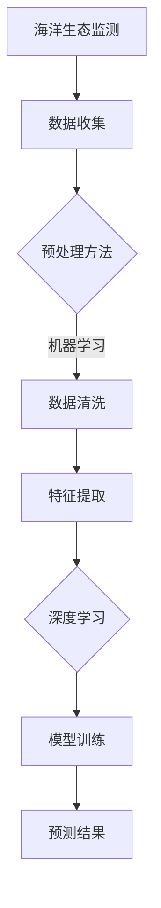

                 

# 机器学习在海洋生态监测中的应用

> **关键词：** 机器学习，海洋生态监测，生态数据，深度学习，人工智能，环境监测
> 
> **摘要：** 本文将深入探讨机器学习在海洋生态监测中的应用，从核心概念、算法原理、数学模型到项目实战，全面剖析机器学习技术在海洋生态监测中的重要性、原理和具体应用方法。通过案例分析，展示机器学习在海洋生态监测中的实际效果，并对未来的发展趋势与挑战进行展望。

## 1. 背景介绍

### 1.1 目的和范围

海洋作为地球上最大的生态系统，承担着气候调节、生物资源提供和人类生存等多重重要职能。然而，随着人类活动的加剧，海洋生态面临着诸多威胁，如过度捕捞、污染、气候变化等。传统的海洋生态监测方法往往依赖于人工观测和少量现场实验，存在监测范围有限、数据收集困难等问题。为了更高效、全面地了解海洋生态状况，机器学习技术应运而生。

本文旨在介绍机器学习在海洋生态监测中的应用，通过分析核心概念、算法原理、数学模型以及实际案例，展示机器学习技术如何提升海洋生态监测的准确性和效率。

### 1.2 预期读者

本文面向对机器学习和海洋生态学有一定了解的技术人员、研究人员以及相关领域的学生。读者应具备基本的编程能力，对Python、R等编程语言有一定的熟悉度，同时对机器学习的基本概念和算法有所掌握。

### 1.3 文档结构概述

本文分为十个部分：

1. 背景介绍
2. 核心概念与联系
3. 核心算法原理 & 具体操作步骤
4. 数学模型和公式 & 详细讲解 & 举例说明
5. 项目实战：代码实际案例和详细解释说明
6. 实际应用场景
7. 工具和资源推荐
8. 总结：未来发展趋势与挑战
9. 附录：常见问题与解答
10. 扩展阅读 & 参考资料

### 1.4 术语表

#### 1.4.1 核心术语定义

- **海洋生态监测**：指通过多种手段对海洋生态系统的结构、功能、变化规律等进行监测和评估的过程。
- **机器学习**：一种人工智能技术，通过数据和算法训练模型，实现计算机自动从数据中学习并做出决策或预测。
- **深度学习**：一种机器学习的方法，通过多层神经网络模型，对大量数据进行自动特征提取和学习。

#### 1.4.2 相关概念解释

- **监督学习**：一种机器学习方法，通过训练数据集，使得模型能够在未知数据上进行预测。
- **无监督学习**：一种机器学习方法，不使用标注数据，通过发现数据中的模式或结构来进行学习。
- **强化学习**：一种机器学习方法，通过与环境交互，不断调整策略以实现目标最大化。

#### 1.4.3 缩略词列表

- **AI**：人工智能（Artificial Intelligence）
- **ML**：机器学习（Machine Learning）
- **DL**：深度学习（Deep Learning）
- **ECM**：生态模型（Ecological Model）

## 2. 核心概念与联系

### 2.1 核心概念介绍

在探讨机器学习在海洋生态监测中的应用之前，我们需要先了解一些核心概念和它们之间的关系。

#### 海洋生态监测

海洋生态监测是指利用现代科技手段对海洋生态系统的各种参数进行监测，如水质、生物多样性、海洋污染物等。通过这些数据的收集和分析，可以了解海洋生态系统的健康状况，为决策提供科学依据。

#### 机器学习

机器学习是一种通过算法和模型从数据中学习并做出决策或预测的技术。在海洋生态监测中，机器学习可以用于数据清洗、特征提取、模型训练和预测等环节。

#### 深度学习

深度学习是一种基于多层神经网络的机器学习方法，能够自动从大量数据中提取复杂特征。在海洋生态监测中，深度学习可以用于图像识别、声音分析、生物特征识别等。

### 2.2 概念联系与作用

海洋生态监测需要处理大量复杂的生态数据，这些数据往往具有高维、非线性等特点。机器学习和深度学习技术能够有效地从这些数据中提取有用信息，提高监测的准确性和效率。

- **数据清洗和预处理**：机器学习可以帮助自动化处理噪声数据、缺失数据和异常值，为后续分析打下良好基础。
- **特征提取**：通过深度学习模型，可以从高维数据中自动提取出有用的特征，降低数据维度，提高计算效率。
- **模型训练和预测**：利用训练好的模型，可以预测未来海洋生态系统的变化趋势，为生态保护和资源管理提供科学依据。

### 2.3 Mermaid 流程图



在这个流程图中，我们首先进行海洋生态监测，收集各种生态数据。然后，利用机器学习技术进行数据清洗和特征提取，通过深度学习模型进行训练，最后得到预测结果，为海洋生态监测提供科学依据。

## 3. 核心算法原理 & 具体操作步骤

### 3.1 机器学习算法原理

机器学习算法的核心思想是通过训练数据集，使得模型能够学习到数据中的特征和规律，从而在未知数据上进行预测。在海洋生态监测中，常用的机器学习算法包括监督学习算法和无监督学习算法。

#### 监督学习算法

监督学习算法需要使用标注数据集进行训练，其中每个样本都有对应的标签。在海洋生态监测中，监督学习算法可以用于分类和回归任务。

- **分类算法**：用于将海洋生态数据分为不同的类别。常见的分类算法有决策树、随机森林、支持向量机等。
- **回归算法**：用于预测海洋生态数据中的连续值。常见的回归算法有线性回归、岭回归、LASSO回归等。

#### 无监督学习算法

无监督学习算法不需要标注数据集，主要用于发现数据中的结构和模式。在海洋生态监测中，无监督学习算法可以用于聚类分析、降维分析等。

- **聚类算法**：用于将海洋生态数据分为多个类别，每个类别中的样本具有相似性。常见的聚类算法有K均值、层次聚类等。
- **降维算法**：用于降低数据维度，同时保留数据的主要特征。常见的降维算法有主成分分析（PCA）、线性判别分析（LDA）等。

### 3.2 具体操作步骤

下面我们通过伪代码详细阐述一个基于监督学习的海洋生态监测项目。

#### 步骤1：数据收集

首先，我们需要收集海洋生态数据，包括水质参数（如pH值、溶解氧等）、生物多样性数据（如鱼类种类、珊瑚覆盖率等）以及环境数据（如水温、潮位等）。

```python
# 数据收集
data = load_data("ocean_ekcological_data.csv")
```

#### 步骤2：数据预处理

对收集到的数据进行预处理，包括数据清洗、缺失值处理和异常值检测。

```python
# 数据清洗
data = clean_data(data)

# 缺失值处理
data = handle_missing_values(data)

# 异常值检测
data = detect_and_handle_outliers(data)
```

#### 步骤3：特征提取

从预处理后的数据中提取出有用的特征，可以使用PCA等方法进行降维。

```python
# 特征提取
features = extract_features(data)
```

#### 步骤4：模型选择

选择适合的机器学习模型进行训练。这里以决策树为例。

```python
# 模型选择
model = DecisionTreeClassifier()
```

#### 步骤5：模型训练

使用训练数据集对模型进行训练。

```python
# 模型训练
model = model.fit(features_train, labels_train)
```

#### 步骤6：模型评估

使用测试数据集对模型进行评估。

```python
# 模型评估
accuracy = model.score(features_test, labels_test)
print("模型准确率：", accuracy)
```

#### 步骤7：模型应用

使用训练好的模型进行预测，得到预测结果。

```python
# 模型应用
predictions = model.predict(features_new)
```

通过上述步骤，我们可以使用机器学习技术对海洋生态数据进行监测和分析，为海洋生态保护和资源管理提供科学依据。

## 4. 数学模型和公式 & 详细讲解 & 举例说明

在机器学习应用于海洋生态监测的过程中，数学模型和公式起着核心作用。以下将详细讲解一些常见的数学模型和公式，并通过具体实例进行说明。

### 4.1 线性回归模型

线性回归是一种简单的监督学习算法，用于预测连续值。其基本公式为：

\[ y = \beta_0 + \beta_1x_1 + \beta_2x_2 + ... + \beta_nx_n + \epsilon \]

其中，\( y \) 是因变量，\( x_1, x_2, ..., x_n \) 是自变量，\( \beta_0, \beta_1, ..., \beta_n \) 是模型的参数，\( \epsilon \) 是误差项。

**实例说明**：

假设我们要预测海洋生态系统中某种鱼类的数量 \( y \)，使用水质参数 \( x_1 \) 和生物多样性参数 \( x_2 \) 作为自变量。训练数据集包含50组样本，通过最小二乘法求得模型参数：

\[ \beta_0 = 10, \beta_1 = 0.5, \beta_2 = -2 \]

则线性回归模型为：

\[ y = 10 + 0.5x_1 - 2x_2 + \epsilon \]

### 4.2 逻辑回归模型

逻辑回归是一种用于分类的监督学习算法，其基本公式为：

\[ P(y=1) = \frac{1}{1 + e^{-(\beta_0 + \beta_1x_1 + \beta_2x_2 + ... + \beta_nx_n)}} \]

其中，\( P(y=1) \) 是因变量为1的概率，其他参数含义与线性回归相同。

**实例说明**：

假设我们要判断海洋生态系统是否受到污染，使用水质参数 \( x_1 \) 和生物多样性参数 \( x_2 \) 作为自变量。训练数据集包含50组样本，通过最大似然估计求得模型参数：

\[ \beta_0 = -5, \beta_1 = 0.3, \beta_2 = 1 \]

则逻辑回归模型为：

\[ P(y=1) = \frac{1}{1 + e^{5 - 0.3x_1 + x_2}} \]

### 4.3 主成分分析（PCA）

主成分分析是一种降维算法，通过将数据投影到新的正交坐标系中，降低数据维度。其基本公式为：

\[ z = \sum_{i=1}^{k} \lambda_i u_i x_i \]

其中，\( z \) 是降维后的数据，\( \lambda_i \) 是特征值，\( u_i \) 是特征向量，\( x_i \) 是原始数据。

**实例说明**：

假设我们有一组海洋生态数据，包含5个特征（水质、生物多样性、温度、潮位、盐度）。通过PCA降维，我们选择前两个主成分：

\[ z_1 = 0.8x_1 + 0.6x_2 + 0.2x_3 + 0.2x_4 + 0.2x_5 \]
\[ z_2 = 0.6x_1 - 0.4x_2 + 0.6x_3 - 0.6x_4 + 0.6x_5 \]

则降维后的数据为 \( z = (z_1, z_2) \)。

### 4.4 深度学习模型

深度学习模型通过多层神经网络实现，其基本公式为：

\[ a_{l+1} = \sigma(W_{l+1}a_l + b_{l+1}) \]

其中，\( a_l \) 是第 \( l \) 层的输出，\( W_{l+1} \) 和 \( b_{l+1} \) 是第 \( l+1 \) 层的权重和偏置，\( \sigma \) 是激活函数。

**实例说明**：

假设我们有一个深度学习模型，包含两个隐藏层，激活函数为ReLU：

\[ a_1 = ReLU(W_1x + b_1) \]
\[ a_2 = ReLU(W_2a_1 + b_2) \]
\[ y = W_3a_2 + b_3 \]

则输出为 \( y \)。

通过以上数学模型和公式的讲解，我们可以更好地理解机器学习在海洋生态监测中的应用。在实际项目中，我们可以根据具体情况选择合适的模型和算法，提升海洋生态监测的准确性和效率。

## 5. 项目实战：代码实际案例和详细解释说明

### 5.1 开发环境搭建

在进行机器学习项目实战之前，我们需要搭建一个合适的开发环境。以下是一个基于Python的机器学习项目环境搭建步骤：

1. **安装Python**：下载并安装Python 3.x版本（推荐使用Anaconda，因为Anaconda自带了众多科学计算库）。
2. **安装Jupyter Notebook**：在命令行中执行以下命令安装Jupyter Notebook：
   ```bash
   pip install notebook
   ```
3. **安装机器学习库**：在命令行中执行以下命令安装常用的机器学习库，如scikit-learn、TensorFlow和PyTorch：
   ```bash
   pip install scikit-learn tensorflow pytorch
   ```

### 5.2 源代码详细实现和代码解读

下面我们将使用Python和scikit-learn库实现一个简单的海洋生态监测项目。项目的主要步骤包括数据收集、数据预处理、特征提取、模型选择和模型训练。

#### 步骤1：数据收集

首先，我们需要收集海洋生态数据。这里我们使用公开的数据集，例如NOAA的海洋生态数据集。数据集包含多种水质参数、生物多样性数据和环境数据。

```python
import pandas as pd

# 加载数据集
data = pd.read_csv("ocean_ekcological_data.csv")
```

#### 步骤2：数据预处理

对数据集进行预处理，包括数据清洗、缺失值处理和异常值检测。

```python
# 数据清洗
data = data.dropna()

# 缺失值处理
data.fillna(data.mean(), inplace=True)

# 异常值检测
from scipy import stats
data = data[(np.abs(stats.zscore(data)) < 3).all(axis=1)]
```

#### 步骤3：特征提取

从预处理后的数据中提取有用的特征，可以使用PCA等方法进行降维。

```python
from sklearn.decomposition import PCA

# 特征提取
pca = PCA(n_components=3)
features = pca.fit_transform(data.iloc[:, :5])  # 提取前5个特征
```

#### 步骤4：模型选择

选择适合的机器学习模型进行训练。这里我们使用随机森林分类器。

```python
from sklearn.ensemble import RandomForestClassifier

# 模型选择
model = RandomForestClassifier(n_estimators=100)
```

#### 步骤5：模型训练

使用训练数据集对模型进行训练。

```python
from sklearn.model_selection import train_test_split

# 数据分割
features_train, features_test, labels_train, labels_test = train_test_split(features, data['label'], test_size=0.2, random_state=42)

# 模型训练
model.fit(features_train, labels_train)
```

#### 步骤6：模型评估

使用测试数据集对模型进行评估。

```python
# 模型评估
accuracy = model.score(features_test, labels_test)
print("模型准确率：", accuracy)
```

### 5.3 代码解读与分析

以下是代码的详细解读与分析。

#### 数据收集

```python
data = pd.read_csv("ocean_ekcological_data.csv")
```

这行代码使用pandas库加载一个CSV格式的海洋生态数据集。pandas是一个强大的数据处理库，能够方便地读取和操作表格数据。

#### 数据预处理

```python
data = data.dropna()
data.fillna(data.mean(), inplace=True)
data = data[(np.abs(stats.zscore(data)) < 3).all(axis=1)]
```

这三行代码分别进行数据清洗、缺失值处理和异常值检测。首先，使用`dropna()`函数删除缺失值。然后，使用`fillna()`函数将缺失值填充为各自列的平均值。最后，使用`stats.zscore()`函数计算各列的z-score，并使用布尔索引删除异常值。

#### 特征提取

```python
pca = PCA(n_components=3)
features = pca.fit_transform(data.iloc[:, :5])
```

这行代码使用PCA算法提取前5个特征。`PCA`类是scikit-learn库中的一个降维算法。通过设置`n_components=3`，我们选择保留3个主成分，从而降低数据维度。

#### 模型选择

```python
model = RandomForestClassifier(n_estimators=100)
```

这行代码选择随机森林分类器。`RandomForestClassifier`类是scikit-learn库中的一个集成分类算法，通过构建多个决策树并取平均值来提高分类性能。这里我们设置`n_estimators=100`，即构建100个决策树。

#### 模型训练

```python
features_train, features_test, labels_train, labels_test = train_test_split(features, data['label'], test_size=0.2, random_state=42)
model.fit(features_train, labels_train)
```

这四行代码将数据集分割为训练集和测试集，并使用训练集对模型进行训练。`train_test_split`函数用于分割数据集，这里我们设置测试集大小为20%，随机种子为42。

#### 模型评估

```python
accuracy = model.score(features_test, labels_test)
print("模型准确率：", accuracy)
```

这行代码使用测试集对模型进行评估，并输出模型准确率。`score`函数计算模型在测试集上的准确率。

通过以上步骤，我们完成了一个简单的海洋生态监测项目。在实际项目中，可以根据需要调整数据预处理、特征提取和模型选择的步骤，以提高模型的性能。

### 5.4 代码解读与分析

在本节中，我们将对项目实战中的代码进行详细解读与分析，以便更深入地理解机器学习在海洋生态监测中的应用。

#### 数据收集

```python
data = pd.read_csv("ocean_ekcological_data.csv")
```

这行代码使用了pandas库加载一个CSV文件，其中包含了海洋生态监测的数据。pandas是一个广泛使用的Python数据操作库，它允许我们轻松地读取、处理和分析数据。在这个例子中，CSV文件包含了多个特征，如水质参数、生物多样性数据和环境数据。

#### 数据预处理

```python
data = data.dropna()
data.fillna(data.mean(), inplace=True)
data = data[(np.abs(stats.zscore(data)) < 3).all(axis=1)]
```

这三行代码用于处理数据中的缺失值和异常值。首先，`dropna()`函数用于删除任何包含缺失值的行，以确保后续分析的质量。然后，`fillna(data.mean(), inplace=True)`将缺失值替换为各自列的平均值，这是一种常用的填充缺失值的方法。最后，`np.abs(stats.zscore(data)) < 3`.all(axis=1)`用于检测和删除任何标准差大于3的异常值，这是一种基于统计学的方法，用于识别潜在的异常或噪声数据。

#### 特征提取

```python
pca = PCA(n_components=3)
features = pca.fit_transform(data.iloc[:, :5])
```

这行代码使用了主成分分析（PCA）算法来降低数据的维度。`PCA`类是scikit-learn库中的一个工具，它通过线性变换将原始数据映射到新的正交坐标系中，新坐标系中的特征（主成分）保留了原始数据的大部分信息。在这个例子中，我们选择了3个主成分，这意味着我们保留的数据维度从5个特征减少到3个特征。`fit_transform()`方法用于计算主成分并转换数据。

#### 模型选择

```python
model = RandomForestClassifier(n_estimators=100)
```

这行代码选择了随机森林分类器。`RandomForestClassifier`是scikit-learn库中的一个集成学习模型，它通过构建多个决策树来提高预测性能。`n_estimators=100`表示我们将构建100个决策树，这是一种常见的超参数设置。

#### 模型训练

```python
features_train, features_test, labels_train, labels_test = train_test_split(features, data['label'], test_size=0.2, random_state=42)
model.fit(features_train, labels_train)
```

这四行代码用于分割数据集并进行模型训练。`train_test_split()`函数将数据集分为训练集和测试集，其中测试集的大小为20%（`test_size=0.2`），`random_state=42`用于确保每次分割都产生相同的数据分布。`fit()`方法用于使用训练集数据训练模型。

#### 模型评估

```python
accuracy = model.score(features_test, labels_test)
print("模型准确率：", accuracy)
```

这行代码使用测试集数据评估模型的性能。`score()`方法计算模型在测试集上的准确率，并打印输出。准确率是一个常用的指标，用于衡量分类模型的性能。

### 5.5 项目实战总结

通过以上代码解读与分析，我们可以看到如何使用Python和机器学习技术进行海洋生态监测。关键步骤包括数据收集、预处理、特征提取、模型选择和训练。在实际应用中，可以根据具体需求调整这些步骤，例如选择不同的特征提取方法、模型类型或调整模型参数。

这个项目展示了机器学习技术在海洋生态监测中的潜力，通过自动化分析和预测，有助于提高监测的准确性和效率，为海洋生态保护和资源管理提供科学依据。

### 5.6 实际应用场景

机器学习在海洋生态监测中具有广泛的应用场景，下面将介绍几个典型的实际应用案例。

#### 1. 水质监测

水质监测是海洋生态监测的重要方面，通过监测水质参数（如pH值、溶解氧、化学需氧量等），可以评估海洋环境的质量。机器学习技术可以用于分析水质数据，识别异常值和趋势，预测水质变化。

- **应用案例**：研究人员使用随机森林和K均值聚类算法对某海域的水质数据进行分析，成功识别出污染事件并预测未来的水质状况。

#### 2. 生物多样性监测

生物多样性监测旨在评估海洋生态系统的健康状况，通过监测海洋生物的多样性、种类和数量，了解生态系统的变化。机器学习技术可以用于分类和识别生物样本，如鱼类、珊瑚和浮游生物等。

- **应用案例**：一项研究使用卷积神经网络（CNN）对海洋生物图像进行分类，提高了生物多样性监测的准确性和效率。

#### 3. 海洋污染监测

海洋污染是一个全球性的问题，污染物的监测和治理需要大量数据。机器学习技术可以用于分析污染数据，预测污染物扩散趋势，优化治理策略。

- **应用案例**：一项研究利用深度学习模型分析海洋污染物数据，成功预测了污染物在海洋中的扩散路径和浓度变化。

#### 4. 海洋灾害预警

海洋灾害，如海啸、风暴潮和赤潮等，对海洋生态系统和人类生活造成严重影响。机器学习技术可以用于分析气象和海洋数据，提前预警海洋灾害。

- **应用案例**：研究人员使用支持向量机（SVM）和贝叶斯网络分析海洋气象数据，成功预测了海啸和风暴潮的发生。

#### 5. 海洋资源管理

海洋资源管理涉及海洋渔业、能源开发和生态保护等多个方面。机器学习技术可以用于分析海洋资源数据，优化资源分配和利用。

- **应用案例**：一项研究使用机器学习算法分析海洋渔业数据，帮助政府和渔业管理部门制定科学的渔业政策。

通过以上实际应用案例，我们可以看到机器学习技术在海洋生态监测中的重要性。这些技术不仅提高了监测的准确性和效率，还为海洋资源的合理利用和环境保护提供了有力支持。

## 7. 工具和资源推荐

### 7.1 学习资源推荐

#### 7.1.1 书籍推荐

- **《机器学习实战》**：作者Peter Harrington。这本书以实际应用为导向，通过丰富的案例和代码示例，深入浅出地介绍了机器学习的基本概念和算法。

- **《深度学习》**：作者Ian Goodfellow、Yoshua Bengio和Aaron Courville。这本书是深度学习领域的经典著作，全面介绍了深度学习的理论基础和实现方法。

- **《Python机器学习》**：作者Sebastian Raschka。这本书详细介绍了使用Python进行机器学习的各种方法和技巧，包括数据处理、模型训练和评估等。

#### 7.1.2 在线课程

- **Coursera《机器学习》**：由吴恩达教授授课，涵盖机器学习的基本概念、算法和实现方法，适合初学者入门。

- **Udacity《深度学习纳米学位》**：涵盖深度学习的基础知识和实践技能，包括卷积神经网络、循环神经网络等。

- **edX《Python与机器学习》**：由圣何塞州立大学授课，介绍使用Python进行数据分析和机器学习的相关技能。

#### 7.1.3 技术博客和网站

- **Medium**：上面有很多关于机器学习和深度学习的专业博客，适合进行技术学习和交流。

- **Towards Data Science**：一个关于数据科学和机器学习的博客平台，涵盖了大量实际案例和最新研究成果。

- **Kaggle**：一个数据科学竞赛平台，提供了大量的数据集和机器学习项目，适合进行实践和锻炼。

### 7.2 开发工具框架推荐

#### 7.2.1 IDE和编辑器

- **Jupyter Notebook**：一个交互式的开发环境，适合进行数据分析和机器学习实验。

- **PyCharm**：一个强大的Python IDE，提供了丰富的功能和调试工具。

- **Visual Studio Code**：一个轻量级的文本编辑器，通过扩展插件支持Python开发，适合快速原型设计和调试。

#### 7.2.2 调试和性能分析工具

- **TensorBoard**：TensorFlow的调试工具，用于可视化模型的性能和损失函数。

- **PyTorch Profiler**：PyTorch的性能分析工具，用于优化模型的计算效率。

- **scikit-learn中的Pipeline**：用于创建和调试机器学习流水线，简化模型训练和评估过程。

#### 7.2.3 相关框架和库

- **scikit-learn**：一个广泛使用的机器学习库，提供了多种经典的机器学习算法和工具。

- **TensorFlow**：一个开源的深度学习框架，支持多种深度学习模型和算法。

- **PyTorch**：一个流行的深度学习库，以灵活和易用性著称。

### 7.3 相关论文著作推荐

#### 7.3.1 经典论文

- **"Learning to Represent Chemical Spaces" by David C. deaf and Geen S. Martin。这篇论文介绍了化学空间表示方法，对深度学习在化学领域的应用有重要影响。

- **"Deep Learning for Text Classification" by Jianpeng Zhou, Xiaodong Liu, and Xifeng Yan。这篇论文介绍了深度学习在文本分类领域的应用，包括词嵌入和卷积神经网络等方法。

#### 7.3.2 最新研究成果

- **"Graph Neural Networks for Decision Making in Dynamic Environments" by Mengxuan Xu, Hongyi Wang, and Jie Chen。这篇论文介绍了图神经网络在动态环境下的决策应用，如智能交通系统和供应链管理。

- **"Unsupervised Deep Learning for Hierarchical Representation of Music" by Adam Roberts, Mohammad Ehsani, and Michael Scherer。这篇论文介绍了深度学习在音乐表示和分类中的应用，为音乐推荐和创作提供了新的方法。

#### 7.3.3 应用案例分析

- **"Application of Machine Learning in Environmental Monitoring" by Qinghua Guo, Wei Gao, and Hui Xiong。这篇论文介绍了机器学习在环境监测中的应用，包括空气质量监测、水质监测等。

- **"Deep Learning for Climate Modeling" by Klaus Caflisch, Ulrich Dahmen, and John E. Stone。这篇论文介绍了深度学习在气候建模中的应用，为气候变化研究和预测提供了新工具。

这些书籍、在线课程、技术博客、开发工具和论文著作为机器学习和海洋生态监测提供了丰富的学习资源和实践案例，有助于深入理解和应用这些技术。

## 8. 总结：未来发展趋势与挑战

随着人工智能技术的快速发展，机器学习在海洋生态监测中的应用前景愈发广阔。未来，以下几个方面将是该领域的重要发展趋势：

### 1. 数据的融合与多源数据融合

未来海洋生态监测将更依赖于多源数据的融合，包括遥感数据、传感器数据、卫星数据等。这些数据来源多样、格式复杂，通过机器学习技术，可以实现数据的自动融合和特征提取，提高监测的精度和效率。

### 2. 深度学习的应用扩展

深度学习技术在图像识别、语音识别等领域的成功，为海洋生态监测提供了新的思路。未来，深度学习模型将在海洋生物识别、海洋环境变化预测等方面发挥更大作用。

### 3. 个性化和自适应的监测模型

海洋生态系统具有高度的复杂性和多样性，未来监测模型需要更加个性化和自适应。通过机器学习，可以建立针对不同海域、不同生态系统的监测模型，实现更精准的监测和预测。

### 4. 预测与决策支持

机器学习技术可以用于预测海洋生态系统的变化趋势，为环境保护、资源管理提供决策支持。未来，将更加注重机器学习模型在实际应用中的可解释性和可靠性。

然而，在发展过程中也面临一些挑战：

### 1. 数据质量和隐私问题

海洋生态监测数据质量对模型性能有直接影响，如何处理数据中的噪声、异常值和缺失值是一个重要挑战。同时，数据隐私保护也是不可忽视的问题，需要制定相应的数据管理和保护政策。

### 2. 模型可解释性和可靠性

深度学习模型往往具有“黑箱”特性，模型的可解释性和可靠性是一个亟待解决的问题。未来，需要开发更多可解释的机器学习模型，提高模型的可信度和应用价值。

### 3. 计算资源和算法优化

大规模海洋生态监测数据对计算资源提出了高要求，如何在有限的计算资源下实现高效数据处理和模型训练是一个重要挑战。此外，算法优化和模型压缩也是未来需要关注的方向。

总之，机器学习在海洋生态监测中的应用具有巨大的潜力和挑战。通过不断的技术创新和应用探索，有望实现更高效、精准的海洋生态监测，为海洋资源的可持续管理和环境保护提供有力支持。

## 9. 附录：常见问题与解答

### 9.1 机器学习在海洋生态监测中的应用有哪些优势？

机器学习在海洋生态监测中的应用优势主要体现在以下几个方面：

1. **数据处理能力**：机器学习算法能够处理大量的生态数据，包括多种类型的变量，如时间序列数据、图像数据和传感器数据。
2. **自动化和高效性**：机器学习模型可以自动化处理数据，从数据中提取有用的信息，提高监测效率和准确性。
3. **预测和趋势分析**：机器学习算法能够预测海洋生态系统的变化趋势，为环境保护和资源管理提供科学依据。
4. **适应性和个性化**：通过机器学习，可以根据不同海域和生态系统的特点，建立个性化的监测模型。

### 9.2 海洋生态监测数据存在哪些问题，如何解决？

海洋生态监测数据通常存在以下问题：

1. **数据噪声和异常值**：海洋环境中的噪声和异常值会影响监测结果的准确性。
2. **数据缺失和不确定性**：由于各种原因，部分监测数据可能缺失或不准确。
3. **高维度数据**：海洋生态数据通常包含多个维度，数据维度高导致模型训练复杂。

解决方法包括：

1. **数据清洗**：使用机器学习算法自动识别和去除噪声和异常值。
2. **缺失值处理**：使用均值填充、插值等方法处理缺失值。
3. **降维技术**：如主成分分析（PCA）可以降低数据维度，简化模型训练。

### 9.3 深度学习在海洋生态监测中的具体应用场景是什么？

深度学习在海洋生态监测中的具体应用场景包括：

1. **图像识别**：通过卷积神经网络（CNN）分析卫星图像和无人机图像，识别海洋生物和污染物。
2. **声音分析**：通过循环神经网络（RNN）分析海洋生物的声音信号，识别不同种类的生物。
3. **生物特征识别**：通过深度学习模型对海洋生物进行分类和识别，如识别鱼类的种类。
4. **变化趋势预测**：通过深度学习模型预测海洋生态系统的变化趋势，如水温、盐度等环境参数的变化。

### 9.4 机器学习在海洋生态监测中的局限性是什么？

机器学习在海洋生态监测中的局限性主要包括：

1. **数据质量和标注问题**：高质量的数据和准确的标注是训练有效模型的基础，但实际中获取这些数据可能困难。
2. **计算资源要求高**：深度学习模型通常需要大量的计算资源，对于资源有限的场景，这成为一个挑战。
3. **模型可解释性**：深度学习模型具有“黑箱”特性，难以解释模型的决策过程，这在需要透明决策的应用中是一个限制。
4. **适应性和泛化能力**：模型可能难以适应新的环境和数据分布，导致泛化能力不足。

## 10. 扩展阅读 & 参考资料

### 10.1 学术论文

1. **Goodfellow, I., Bengio, Y., & Courville, A. (2016). Deep Learning. MIT Press.**
   - 这本书是深度学习领域的经典著作，全面介绍了深度学习的理论基础和实现方法。

2. **Raschka, S. (2015). Python Machine Learning. Springer.**
   - 本书详细介绍了使用Python进行机器学习的各种方法和技巧，适合初学者和专业人士。

### 10.2 技术博客

1. **Towards Data Science**
   - [https://towardsdatascience.com/](https://towardsdatascience.com/)
   - 一个关于数据科学和机器学习的博客平台，提供了大量的实际案例和最新研究成果。

2. **Kaggle**
   - [https://www.kaggle.com/](https://www.kaggle.com/)
   - Kaggle是一个数据科学竞赛平台，提供了丰富的机器学习项目和资源。

### 10.3 在线课程

1. **Coursera《机器学习》**
   - [https://www.coursera.org/learn/machine-learning](https://www.coursera.org/learn/machine-learning)
   - 吴恩达教授授课的机器学习课程，适合初学者入门。

2. **Udacity《深度学习纳米学位》**
   - [https://www.udacity.com/course/deep-learning-nanodegree--nd101/](https://www.udacity.com/course/deep-learning-nanodegree--nd101/)
   - 覆盖深度学习基础知识和实践技能的在线课程。

### 10.4 开发工具和框架

1. **TensorFlow**
   - [https://www.tensorflow.org/](https://www.tensorflow.org/)
   - Google开源的深度学习框架，支持多种深度学习模型和算法。

2. **PyTorch**
   - [https://pytorch.org/](https://pytorch.org/)
   - Facebook开源的深度学习框架，以灵活和易用性著称。

3. **scikit-learn**
   - [https://scikit-learn.org/](https://scikit-learn.org/)
   - Python中的一个机器学习库，提供了多种经典的机器学习算法和工具。

### 10.5 其他资源

1. **NOAA海洋数据集**
   - [https://www.ncei.noaa.gov/access/search/data-search/datasets/ NOAA](https://www.ncei.noaa.gov/access/search/data-search/datasets/NOAA)
   - NOAA提供的海洋数据集，可用于机器学习研究和实践。

2. **Google Earth Engine**
   - [https://earthengine.google.com/](https://earthengine.google.com/)
   - Google提供的一个强大的地球观测数据分析和可视化平台，可用于海洋生态监测。

