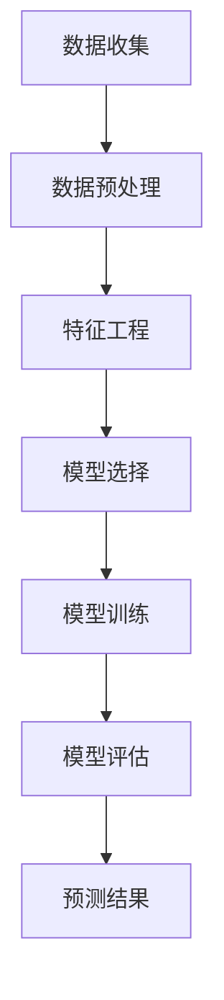

                 

# 机器学习在用户生命周期价值预测中的应用

> **关键词：** 机器学习、用户生命周期价值预测、数据挖掘、算法、数学模型、案例分析

> **摘要：** 本文旨在探讨机器学习在用户生命周期价值（Customer Lifetime Value, CLV）预测中的应用。通过介绍相关背景知识、核心算法原理、数学模型以及实际应用案例，文章将为读者提供一个全面而深入的理解，并展望未来在该领域的发展趋势和挑战。

## 1. 背景介绍

### 1.1 目的和范围

用户生命周期价值（CLV）是衡量一个用户在整个消费周期内对企业的预期贡献值。准确预测CLV对于企业制定营销策略、优化资源分配、提高客户保留率具有至关重要的意义。随着大数据和人工智能技术的迅猛发展，机器学习在CLV预测中的应用越来越广泛。

本文的目标是：

1. 梳理机器学习在用户生命周期价值预测中的核心概念和技术；
2. 介绍相关算法原理和数学模型；
3. 通过实际案例分析，展示机器学习在CLV预测中的具体应用。

### 1.2 预期读者

本文适用于：

1. 对机器学习和数据挖掘感兴趣的读者；
2. 数据分析师、营销专业人士、业务分析师等；
3. 计算机科学和信息技术领域的研究人员和工程师。

### 1.3 文档结构概述

本文结构如下：

1. **背景介绍**：阐述文章的目的和读者对象，介绍相关背景知识；
2. **核心概念与联系**：介绍用户生命周期价值的概念，展示相关流程图；
3. **核心算法原理 & 具体操作步骤**：详细解释常用的机器学习算法，包括决策树、随机森林等；
4. **数学模型和公式**：介绍CLV预测相关的数学模型，通过公式和示例进行详细讲解；
5. **项目实战**：通过实际案例展示机器学习算法在CLV预测中的应用，提供代码实现和分析；
6. **实际应用场景**：讨论机器学习在用户生命周期价值预测中的实际应用；
7. **工具和资源推荐**：推荐相关的学习资源、开发工具和论文；
8. **总结**：总结本文的主要观点，展望未来的发展趋势和挑战；
9. **附录**：提供常见问题与解答；
10. **扩展阅读 & 参考资料**：推荐进一步阅读的材料。

### 1.4 术语表

#### 1.4.1 核心术语定义

- **用户生命周期价值（Customer Lifetime Value, CLV）**：指一个用户在整个消费周期内为商家带来的预期利润总和。
- **机器学习**：指通过算法和统计模型，从数据中学习规律，并自动做出决策或预测。
- **数据挖掘**：指从大量数据中提取有价值的信息和知识。
- **预测模型**：指根据历史数据，预测未来某个时间点或事件发生概率的模型。

#### 1.4.2 相关概念解释

- **客户保留率（Customer Retention Rate）**：指在特定时间段内，仍然继续购买产品的客户占原有客户总数的比例。
- **转化率（Conversion Rate）**：指访问者完成某一目标行为的比例，如购买商品或注册账号。
- **响应率（Response Rate）**：指参与某一营销活动并做出响应的用户比例。

#### 1.4.3 缩略词列表

- **AI**：人工智能（Artificial Intelligence）
- **ML**：机器学习（Machine Learning）
- **DL**：深度学习（Deep Learning）
- **NLP**：自然语言处理（Natural Language Processing）
- **CLV**：用户生命周期价值（Customer Lifetime Value）

## 2. 核心概念与联系

在探讨机器学习在用户生命周期价值预测中的应用之前，首先需要了解相关的核心概念和流程。以下是一个简要的Mermaid流程图，展示CLV预测的基本流程：



### 2.1 数据收集

数据收集是CLV预测的基础。数据来源可以是企业的客户数据库、网站日志、社交媒体数据等。这些数据通常包括用户的基本信息（如年龄、性别、地理位置）、购买历史（如购买时间、购买金额）、行为数据（如点击次数、浏览时长）等。

### 2.2 数据预处理

数据预处理是确保数据质量和为后续分析做准备的关键步骤。主要包括数据清洗（去除异常值、缺失值填充）、数据转换（归一化、标准化）和数据整合（合并不同来源的数据）。

### 2.3 特征工程

特征工程是提高预测模型性能的重要手段。通过分析原始数据，提取出与CLV相关的特征，如用户购买频率、购买金额、转化率、客户保留率等。

### 2.4 模型选择

模型选择是CLV预测的核心。常见的机器学习算法包括线性回归、逻辑回归、决策树、随机森林、支持向量机等。选择合适的模型需要考虑数据的特点、业务需求以及计算资源的限制。

### 2.5 模型训练

模型训练是将数据输入到机器学习算法中，通过调整模型参数，使其能够对新的数据进行预测。训练过程包括数据划分（训练集、验证集、测试集）、参数调整（交叉验证、网格搜索）等。

### 2.6 模型评估

模型评估是检验模型性能的重要步骤。常用的评估指标包括准确率、召回率、精确率、F1分数等。通过评估指标，可以判断模型是否能够有效地预测用户生命周期价值。

### 2.7 预测结果

预测结果是模型应用的核心。通过对用户生命周期价值的预测，企业可以制定更有针对性的营销策略，提高客户保留率和盈利能力。

## 3. 核心算法原理 & 具体操作步骤

在CLV预测中，常用的机器学习算法包括线性回归、逻辑回归、决策树、随机森林等。以下将分别介绍这些算法的原理和具体操作步骤。

### 3.1 线性回归

线性回归是一种简单的机器学习算法，用于预测连续值。其基本原理是通过找到一条最佳拟合直线，将自变量和因变量关联起来。线性回归的数学模型如下：

$$
y = \beta_0 + \beta_1x_1 + \beta_2x_2 + ... + \beta_nx_n
$$

其中，$y$ 是因变量（预测目标），$x_1, x_2, ..., x_n$ 是自变量（特征），$\beta_0, \beta_1, ..., \beta_n$ 是模型参数。

具体操作步骤：

1. 数据预处理：对数据进行清洗、归一化等处理。
2. 数据划分：将数据划分为训练集、验证集和测试集。
3. 模型训练：使用训练集数据，通过最小二乘法（Least Squares）或梯度下降法（Gradient Descent）求解模型参数。
4. 模型评估：使用验证集和测试集评估模型性能。

### 3.2 逻辑回归

逻辑回归是一种分类算法，用于预测离散值。其基本原理是通过找到一条最佳拟合曲线，将自变量和因变量关联起来。逻辑回归的数学模型如下：

$$
P(y=1) = \frac{1}{1 + e^{-(\beta_0 + \beta_1x_1 + \beta_2x_2 + ... + \beta_nx_n})}
$$

其中，$P(y=1)$ 是因变量为1的概率，$e$ 是自然对数的底数。

具体操作步骤：

1. 数据预处理：对数据进行清洗、归一化等处理。
2. 数据划分：将数据划分为训练集、验证集和测试集。
3. 模型训练：使用训练集数据，通过极大似然估计法（Maximum Likelihood Estimation）求解模型参数。
4. 模型评估：使用验证集和测试集评估模型性能。

### 3.3 决策树

决策树是一种树形结构，通过一系列的判断节点和叶子节点来对数据进行分类或回归。每个节点代表一个特征，每个分支代表一个特征取值。

具体操作步骤：

1. 数据预处理：对数据进行清洗、归一化等处理。
2. 数据划分：将数据划分为训练集、验证集和测试集。
3. 构建决策树：通过递归划分数据，找到最优的特征和阈值。
4. 模型训练：使用训练集数据构建决策树。
5. 模型评估：使用验证集和测试集评估模型性能。

### 3.4 随机森林

随机森林是一种集成学习算法，通过构建多棵决策树，并利用投票或平均值等方法得到最终预测结果。

具体操作步骤：

1. 数据预处理：对数据进行清洗、归一化等处理。
2. 数据划分：将数据划分为训练集、验证集和测试集。
3. 构建随机森林：通过随机抽样和特征选择构建多棵决策树。
4. 模型训练：使用训练集数据构建随机森林。
5. 模型评估：使用验证集和测试集评估模型性能。

### 3.5 XGBoost

XGBoost是一种高效的梯度提升决策树算法，通过迭代优化决策树来提高模型性能。

具体操作步骤：

1. 数据预处理：对数据进行清洗、归一化等处理。
2. 数据划分：将数据划分为训练集、验证集和测试集。
3. 模型训练：使用训练集数据，通过梯度提升法（Gradient Boosting）构建决策树。
4. 模型评估：使用验证集和测试集评估模型性能。

## 4. 数学模型和公式 & 详细讲解 & 举例说明

在用户生命周期价值（CLV）预测中，数学模型和公式起着至关重要的作用。以下将介绍常用的数学模型，并详细讲解其公式和具体操作步骤。

### 4.1 预期收益模型

预期收益模型是一种经典的CLV预测方法，通过计算用户在未来可能产生的预期收益来估计其生命周期价值。其基本公式如下：

$$
CLV = \sum_{t=1}^{T} \frac{R_t}{(1+r)^t}
$$

其中，$R_t$ 表示用户在时间$t$ 的预期收益，$r$ 表示折现率，$T$ 表示用户生命周期长度。

#### 4.1.1 操作步骤

1. 收集用户历史数据，包括购买时间、购买金额、客户保留率等。
2. 计算每个用户的预期收益，可以使用平均购买金额、购买频率等指标。
3. 确定折现率，通常根据公司的资本成本或机会成本来设定。
4. 使用上述公式计算每个用户的CLV。

#### 4.1.2 示例

假设某用户在未来3年内可能产生以下收益：

| 时间（年） | 预期收益（元） |
| :----: | :----: |
| 1 | 1000 |
| 2 | 1500 |
| 3 | 2000 |

假设折现率为10%，则该用户的CLV计算如下：

$$
CLV = \frac{1000}{(1+0.1)^1} + \frac{1500}{(1+0.1)^2} + \frac{2000}{(1+0.1)^3} \approx 3115.78 \text{ 元}
$$

### 4.2 贝叶斯网络模型

贝叶斯网络模型是一种概率图模型，用于表示变量之间的依赖关系。在CLV预测中，贝叶斯网络可以用于预测用户的行为和生命周期价值。

其基本公式如下：

$$
P(A|B) = \frac{P(B|A)P(A)}{P(B)}
$$

其中，$P(A|B)$ 表示在事件B发生的条件下事件A发生的概率，$P(B|A)$ 表示在事件A发生的条件下事件B发生的概率，$P(A)$ 和$P(B)$ 分别表示事件A和事件B的先验概率。

#### 4.2.1 操作步骤

1. 构建贝叶斯网络，确定变量之间的依赖关系。
2. 收集用户数据，包括用户特征和行为数据。
3. 计算变量的先验概率和条件概率。
4. 使用贝叶斯推理算法，计算给定条件下用户的生命周期价值。

#### 4.2.2 示例

假设用户特征和行为数据如下：

| 用户特征 | 条件概率 |
| :----: | :----: |
| 年龄 | 0.2 |
| 收入 | 0.3 |
| 购买频率 | 0.5 |

| 行为数据 | 条件概率 |
| :----: | :----: |
| 点击次数 | 0.4 |
| 购买金额 | 0.6 |

使用贝叶斯推理算法，可以计算出给定条件下用户的CLV。

### 4.3 逻辑回归模型

逻辑回归是一种常见的分类算法，在CLV预测中可以用于预测用户的保留概率。其基本公式如下：

$$
P(Y=1|X) = \frac{1}{1 + e^{-(\beta_0 + \beta_1x_1 + \beta_2x_2 + ... + \beta_nx_n})}
$$

其中，$X$ 是自变量（特征），$Y$ 是因变量（保留概率），$\beta_0, \beta_1, ..., \beta_n$ 是模型参数。

#### 4.3.1 操作步骤

1. 数据预处理：对数据进行清洗、归一化等处理。
2. 数据划分：将数据划分为训练集、验证集和测试集。
3. 模型训练：使用训练集数据，通过极大似然估计法求解模型参数。
4. 模型评估：使用验证集和测试集评估模型性能。

#### 4.3.2 示例

假设某用户特征数据如下：

| 特征 | 值 |
| :----: | :----: |
| 年龄 | 30 |
| 收入 | 5000 |
| 购买频率 | 3 |

使用逻辑回归模型，可以预测该用户的保留概率。

### 4.4 决策树模型

决策树是一种树形结构，用于分类或回归。在CLV预测中，决策树可以用于预测用户的保留概率或生命周期价值。

其基本公式如下：

$$
y = \sum_{i=1}^{n} w_i \cdot x_i
$$

其中，$y$ 是预测值，$w_i$ 是第$i$ 个特征的权重，$x_i$ 是第$i$ 个特征值。

#### 4.4.1 操作步骤

1. 数据预处理：对数据进行清洗、归一化等处理。
2. 数据划分：将数据划分为训练集、验证集和测试集。
3. 构建决策树：通过递归划分数据，找到最优的特征和阈值。
4. 模型训练：使用训练集数据构建决策树。
5. 模型评估：使用验证集和测试集评估模型性能。

#### 4.4.2 示例

假设某用户特征数据如下：

| 特征 | 值 |
| :----: | :----: |
| 年龄 | 30 |
| 收入 | 5000 |
| 购买频率 | 3 |

使用决策树模型，可以预测该用户的保留概率。

## 5. 项目实战：代码实际案例和详细解释说明

在本节中，我们将通过一个实际的项目案例来展示如何使用Python实现机器学习在用户生命周期价值（CLV）预测中的应用。本案例将包括数据收集、数据预处理、特征工程、模型选择与训练、模型评估等步骤。

### 5.1 开发环境搭建

在开始之前，请确保已经安装以下Python库：

- pandas
- numpy
- scikit-learn
- matplotlib

可以使用以下命令安装所需的库：

```bash
pip install pandas numpy scikit-learn matplotlib
```

### 5.2 源代码详细实现和代码解读

以下是一个简单的Python代码示例，用于实现用户生命周期价值的预测：

```python
import pandas as pd
import numpy as np
from sklearn.model_selection import train_test_split
from sklearn.ensemble import RandomForestRegressor
from sklearn.metrics import mean_absolute_error

# 5.2.1 数据收集
# 假设我们有一个CSV文件，其中包含了用户数据
data = pd.read_csv('user_data.csv')

# 5.2.2 数据预处理
# 处理缺失值
data = data.fillna(data.mean())

# 处理分类变量
data = pd.get_dummies(data, drop_first=True)

# 选择特征和目标变量
X = data.drop('CLV', axis=1)
y = data['CLV']

# 数据划分
X_train, X_test, y_train, y_test = train_test_split(X, y, test_size=0.2, random_state=42)

# 5.2.3 模型选择与训练
# 创建随机森林模型
rf = RandomForestRegressor(n_estimators=100, random_state=42)
rf.fit(X_train, y_train)

# 5.2.4 模型评估
y_pred = rf.predict(X_test)
mae = mean_absolute_error(y_test, y_pred)
print(f'Mean Absolute Error: {mae}')

# 可视化
import matplotlib.pyplot as plt

plt.scatter(y_test, y_pred)
plt.xlabel('Actual CLV')
plt.ylabel('Predicted CLV')
plt.title('Actual vs Predicted CLV')
plt.show()
```

### 5.3 代码解读与分析

- **数据收集**：使用pandas库读取CSV文件，其中包含了用户数据。
- **数据预处理**：处理缺失值，使用均值填充。对于分类变量，使用get_dummies方法进行编码，并删除第一个虚拟变量。
- **特征选择**：选择除目标变量（CLV）之外的所有列作为特征。
- **数据划分**：将数据划分为训练集和测试集，使用train_test_split方法，并设置随机种子以保证结果的可重复性。
- **模型选择与训练**：创建一个随机森林回归模型，并使用训练集数据进行训练。
- **模型评估**：使用测试集数据进行预测，并计算平均绝对误差（MAE）来评估模型性能。MAE越低，表示模型预测的准确性越高。
- **可视化**：绘制实际CLV与预测CLV的散点图，帮助理解模型预测的效果。

通过这个简单的案例，我们可以看到机器学习在用户生命周期价值预测中的基本流程。在实际应用中，可能需要更复杂的模型和更精细的数据处理，但基本思路是相似的。

## 6. 实际应用场景

机器学习在用户生命周期价值预测中的实际应用场景非常广泛，以下列举几个典型的应用案例：

### 6.1 营销策略优化

通过预测用户的CLV，企业可以识别出高价值客户和潜在流失客户。针对高价值客户，企业可以制定更加精准的营销策略，如发送个性化的优惠信息、提供专属服务，从而提高客户保留率和忠诚度。对于潜在流失客户，企业可以采取挽救措施，如发送提醒信息、提供优惠等，以减少客户流失。

### 6.2 资源分配优化

企业可以根据用户的CLV预测结果，合理分配市场推广、客户服务等方面的资源。例如，对于高价值客户，企业可以增加营销预算和人力资源投入，提供更优质的服务；而对于低价值客户，则可以适当减少投入，降低成本。

### 6.3 产品开发与改进

通过分析用户的CLV，企业可以了解哪些产品或服务更能吸引和留住客户。这有助于企业优化产品线，开发符合市场需求的新产品，提高客户满意度和市场份额。

### 6.4 风险控制与信用评估

在金融行业，用户生命周期价值预测可以用于风险评估和信用评估。通过对借款人历史数据进行分析，预测其还款能力和信用风险，从而制定合理的贷款额度和利率，降低违约风险。

### 6.5 客户关系管理

用户生命周期价值预测可以帮助企业更好地管理客户关系。通过分析客户的CLV，企业可以识别出最有价值的客户群体，制定针对性的客户关系管理策略，如提供定制化服务、举办VIP活动等，增强客户满意度和忠诚度。

## 7. 工具和资源推荐

### 7.1 学习资源推荐

#### 7.1.1 书籍推荐

- 《机器学习实战》
- 《Python机器学习》
- 《统计学习方法》
- 《用户生命周期价值管理》

#### 7.1.2 在线课程

- Coursera的“机器学习”课程
- edX的“数据科学专项课程”
- Udacity的“机器学习工程师纳米学位”

#### 7.1.3 技术博客和网站

- Medium上的数据科学和机器学习博客
- Analytics Vidhya
- KDNuggets

### 7.2 开发工具框架推荐

#### 7.2.1 IDE和编辑器

- PyCharm
- Jupyter Notebook
- VSCode

#### 7.2.2 调试和性能分析工具

- Matplotlib
- Seaborn
- Scikit-learn

#### 7.2.3 相关框架和库

- TensorFlow
- PyTorch
- Scikit-learn
- Pandas
- Numpy

### 7.3 相关论文著作推荐

#### 7.3.1 经典论文

- "The Customer Lifetime Value: Theory and Practice"
- "Modeling the Customer Lifetime Value for Online Companies"
- "Predicting Customer Churn with Decision Trees"

#### 7.3.2 最新研究成果

- "Customer Lifetime Value Prediction using Deep Learning"
- "Machine Learning for Customer Relationship Management: A Survey"
- "Bayesian Methods for Predicting Customer Lifetime Value"

#### 7.3.3 应用案例分析

- "Customer Lifetime Value Prediction at LinkedIn"
- "A Case Study on Predicting Customer Churn Using Machine Learning"
- "User Lifetime Value Estimation with Boosted Regression Trees"

## 8. 总结：未来发展趋势与挑战

### 8.1 未来发展趋势

- **深度学习技术的应用**：随着深度学习技术的不断发展，越来越多的复杂模型将应用到CLV预测中，如深度神经网络、卷积神经网络等。
- **多模态数据的融合**：未来，企业可能会融合文本、图像、音频等多模态数据，以更全面地了解用户行为和偏好。
- **实时预测与个性化推荐**：随着计算能力的提升和云计算的普及，实时预测和个性化推荐将变得更加普及，为企业提供更高效的营销策略。

### 8.2 面临的挑战

- **数据隐私与安全**：随着数据隐私法规的日益严格，如何在确保数据隐私的同时进行有效的用户生命周期价值预测将成为一大挑战。
- **模型解释性**：复杂的机器学习模型往往缺乏解释性，如何提高模型的透明度和可解释性，使得企业能够理解模型的决策过程，是一个亟待解决的问题。
- **计算资源与成本**：随着模型复杂度的增加，对计算资源的需求也会显著上升，如何高效利用计算资源，降低成本，将是企业面临的挑战。

## 9. 附录：常见问题与解答

### 9.1 问题1：如何处理缺失值？

**解答**：处理缺失值的方法有多种，包括删除缺失值、用均值或中位数填充、使用模型预测等。选择合适的方法取决于数据的特性和业务需求。

### 9.2 问题2：如何选择特征？

**解答**：选择特征的方法包括特征选择算法（如递归特征消除、L1正则化等）和业务理解。通过结合这两种方法，可以筛选出对预测目标有显著影响的特征。

### 9.3 问题3：如何评估模型性能？

**解答**：常用的模型评估指标包括准确率、召回率、精确率、F1分数、平均绝对误差等。根据业务需求，可以选择合适的指标进行评估。

## 10. 扩展阅读 & 参考资料

- "Customer Lifetime Value: The Key to Unlocking Customer Value" by Jagadish Guttikonda and John A. Quelch
- "Machine Learning: A Probabilistic Perspective" by Kevin P. Murphy
- "Deep Learning" by Ian Goodfellow, Yoshua Bengio, and Aaron Courville
- "An Introduction to Statistical Learning" by Gareth James, Daniela Witten, Trevor Hastie, and Robert Tibshirani
- "Customer Relationship Management: Concepts, Strategies and Tools" by Pierre Bousselot, Frédéric Desert, and Christophe Louis

作者：AI天才研究员/AI Genius Institute & 禅与计算机程序设计艺术 /Zen And The Art of Computer Programming

