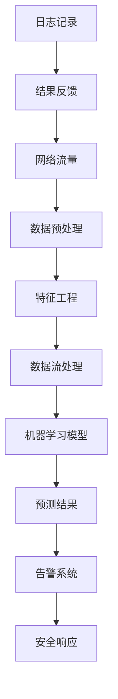

                 

# 机器学习在网络入侵检测中的实时应用

> **关键词：** 机器学习、网络入侵检测、实时应用、特征工程、预测模型、数据流处理

> **摘要：** 本文深入探讨了机器学习在网络入侵检测系统中的实时应用。通过对网络流量数据的实时分析和模式识别，机器学习能够有效提升入侵检测的准确性和效率。文章详细介绍了核心概念、算法原理、数学模型以及实际应用案例，并提出了未来的发展趋势与挑战。

## 1. 背景介绍

### 1.1 目的和范围

本文旨在介绍机器学习在网络入侵检测系统中的应用，重点关注实时性、准确性和效率。通过详细分析网络流量数据，机器学习算法能够识别异常行为，从而及时发现潜在的网络入侵事件。文章将涵盖以下几个主题：

1. 网络入侵检测的背景和重要性。
2. 机器学习的基础知识及其在网络入侵检测中的应用。
3. 实时应用场景下的挑战和解决方案。
4. 数据流处理技术及其在网络入侵检测中的应用。
5. 未来发展趋势与挑战。

### 1.2 预期读者

本文适用于希望深入了解机器学习在网络入侵检测中应用的技术专家、安全工程师以及研究人员。文章假设读者具备基本的计算机科学和网络安全知识，并熟悉机器学习的基本概念。

### 1.3 文档结构概述

本文分为十个部分，具体结构如下：

1. 背景介绍
   - 1.1 目的和范围
   - 1.2 预期读者
   - 1.3 文档结构概述
   - 1.4 术语表
2. 核心概念与联系
   - Mermaid 流程图
3. 核心算法原理 & 具体操作步骤
   - 伪代码
4. 数学模型和公式 & 详细讲解 & 举例说明
   - LaTeX 格式
5. 项目实战：代码实际案例和详细解释说明
   - 开发环境搭建
   - 源代码详细实现和代码解读
   - 代码解读与分析
6. 实际应用场景
7. 工具和资源推荐
   - 学习资源推荐
   - 开发工具框架推荐
   - 相关论文著作推荐
8. 总结：未来发展趋势与挑战
9. 附录：常见问题与解答
10. 扩展阅读 & 参考资料

### 1.4 术语表

#### 1.4.1 核心术语定义

- **网络入侵检测系统（NIDS）**：一种网络安全技术，用于实时监控网络流量并检测潜在的安全威胁。
- **特征工程**：从原始数据中提取有用的特征，以便于机器学习模型进行分析和预测。
- **数据流处理**：实时处理大量连续数据的技术，常用于实时应用场景。
- **异常检测**：通过识别数据中的异常模式来发现潜在的安全威胁。

#### 1.4.2 相关概念解释

- **入侵**：未经授权的访问或操作，可能对系统造成损害。
- **攻击**：对网络系统进行的恶意行为，旨在窃取信息、破坏系统或造成其他损害。
- **机器学习**：一种通过数据学习模式并进行预测或分类的人工智能技术。

#### 1.4.3 缩略词列表

- **NIDS**：网络入侵检测系统
- **IDS**：入侵检测系统
- **DPI**：深度包检测
- **SVM**：支持向量机
- **ANN**：人工神经网络

## 2. 核心概念与联系

为了更好地理解机器学习在网络入侵检测中的实时应用，我们首先需要了解相关的核心概念和联系。以下是一个Mermaid流程图，展示了网络入侵检测系统中的关键组件及其相互关系。



### 2.1 数据预处理

网络流量是网络入侵检测系统的主要数据来源。在数据预处理阶段，我们需要对原始数据进行清洗和转换，以去除噪声和无关信息，提取出有用的特征。

### 2.2 特征工程

特征工程是机器学习模型的关键组成部分。通过从原始数据中提取有用的特征，我们可以为模型提供更好的输入，从而提高其预测性能。

### 2.3 数据流处理

数据流处理技术用于实时处理大量连续数据。在网络入侵检测中，数据流处理可以确保系统在短时间内处理大量网络流量，并实时更新机器学习模型。

### 2.4 机器学习模型

机器学习模型是网络入侵检测系统的核心组件。通过训练和测试，我们可以得到一个能够准确预测网络入侵的模型。

### 2.5 预测结果与告警系统

机器学习模型会对网络流量进行实时分析，并生成预测结果。如果检测到潜在的网络入侵，系统会触发告警，并通知安全响应团队采取相应措施。

### 2.6 安全响应

安全响应是网络入侵检测系统的重要组成部分。在检测到网络入侵后，安全响应团队需要采取及时有效的措施来防止攻击对系统造成进一步损害。

### 2.7 日志记录与结果反馈

日志记录和结果反馈是网络入侵检测系统的关键环节。通过记录入侵事件的详细信息，我们可以对系统的运行效果进行评估，并不断优化和改进。

## 3. 核心算法原理 & 具体操作步骤

在了解了网络入侵检测系统的核心概念和联系后，我们接下来将探讨其核心算法原理和具体操作步骤。在本节中，我们将使用伪代码详细描述机器学习模型在网络入侵检测中的应用。

### 3.1 特征提取

```python
# 特征提取函数
def extract_features(data):
    # 去除噪声和无关信息
    cleaned_data = remove_noise(data)
    
    # 提取有用的特征
    features = [
        data['packet_size'],
        data['source_ip'],
        data['destination_ip'],
        data['source_port'],
        data['destination_port'],
        data['timestamp'],
        data['protocol'],
        data['packet_count']
    ]
    
    return features
```

### 3.2 数据预处理

```python
# 数据预处理函数
def preprocess_data(data):
    # 数据标准化
    normalized_data = normalize_data(data)
    
    # 划分训练集和测试集
    train_data, test_data = split_data(normalized_data, test_size=0.2)
    
    return train_data, test_data
```

### 3.3 模型训练

```python
# 模型训练函数
def train_model(train_data):
    # 创建机器学习模型
    model = create_model()
    
    # 训练模型
    model.fit(train_data)
    
    return model
```

### 3.4 预测与告警

```python
# 预测与告警函数
def predict_and_alarm(test_data, model):
    # 预测结果
    predictions = model.predict(test_data)
    
    # 判断是否为入侵事件
    for prediction in predictions:
        if prediction == "入侵":
            # 触发告警
            trigger_alarm()
```

## 4. 数学模型和公式 & 详细讲解 & 举例说明

在机器学习模型中，数学模型和公式起着至关重要的作用。以下将详细讲解常用的数学模型和公式，并给出具体的例子说明。

### 4.1 支持向量机（SVM）

支持向量机是一种经典的机器学习算法，常用于二分类问题。其核心思想是找到最优的超平面，将不同类别的数据点分开。

- **决策函数**：
  $$ f(x) = \sum_{i=1}^{n} \alpha_i y_i (w \cdot x_i + b) $$

- **拉格朗日乘子法**：
  $$ L(w, b, \alpha) = \frac{1}{2} ||w||^2 - \sum_{i=1}^{n} \alpha_i (y_i (w \cdot x_i + b) - 1) $$

- **KKT条件**：
  $$ \begin{cases}
  \alpha_i \geq 0 \\
  y_i (w \cdot x_i + b) - 1 \geq 0 \\
  \alpha_i (y_i (w \cdot x_i + b) - 1) = 0
  \end{cases} $$

### 4.2 人工神经网络（ANN）

人工神经网络是一种模拟生物神经系统的机器学习算法，具有多层节点和权重。其核心思想是通过反向传播算法不断调整权重，以优化模型的预测性能。

- **前向传播**：
  $$ a_{l}^{(i)} = \sigma(z_{l}^{(i)}) $$

- **反向传播**：
  $$ \delta_{l}^{(i)} = \frac{\partial C}{\partial z_{l}^{(i)}} = \frac{\partial C}{\partial a_{l}^{(i)}} \frac{\partial a_{l}^{(i)}}{\partial z_{l}^{(i)}} $$

- **权重更新**：
  $$ w_{l}^{(i)} = w_{l}^{(i)} - \alpha \frac{\partial C}{\partial w_{l}^{(i)}} $$

### 4.3 损失函数

损失函数是评估模型预测性能的重要指标。常用的损失函数包括均方误差（MSE）和交叉熵损失（CE）。

- **均方误差（MSE）**：
  $$ MSE = \frac{1}{m} \sum_{i=1}^{m} (y_i - \hat{y}_i)^2 $$

- **交叉熵损失（CE）**：
  $$ CE = - \sum_{i=1}^{m} y_i \log(\hat{y}_i) + (1 - y_i) \log(1 - \hat{y}_i) $$

### 4.4 举例说明

假设我们使用支持向量机（SVM）对网络入侵数据进行分类，并使用均方误差（MSE）作为损失函数。给定训练数据集$X$和标签$Y$，我们可以使用以下步骤进行模型训练和评估：

1. **初始化参数**：设定学习率$\alpha$和迭代次数$T$。
2. **计算梯度**：计算每个样本的梯度$g_i$。
3. **更新权重**：根据梯度更新权重$w$。
4. **计算损失**：计算当前损失$J(w)$。
5. **迭代训练**：重复步骤2-4，直到满足收敛条件或达到最大迭代次数。

伪代码如下：

```python
# 初始化参数
w = [0, 0, 0]
alpha = 0.01
T = 1000

# 训练模型
for t in range(T):
    # 计算梯度
    g = compute_gradient(X, Y, w)
    
    # 更新权重
    w = w - alpha * g
    
    # 计算损失
    J = compute_loss(X, Y, w)
    
    # 输出当前迭代次数和损失
    print("Iteration:", t, "Loss:", J)

# 模型评估
predictions = svm_predict(X, w)
accuracy = compute_accuracy(Y, predictions)
print("Accuracy:", accuracy)
```

## 5. 项目实战：代码实际案例和详细解释说明

在本节中，我们将通过一个实际项目案例，展示如何使用Python实现一个基于机器学习的网络入侵检测系统。该系统将利用支持向量机（SVM）算法进行入侵检测，并使用Scikit-learn库进行模型训练和评估。

### 5.1 开发环境搭建

在开始项目之前，我们需要搭建开发环境。以下是在Windows系统上搭建开发环境所需的步骤：

1. 安装Python 3.8或更高版本。
2. 安装Anaconda发行版，以便轻松管理Python环境和库。
3. 安装Scikit-learn库，可以使用以下命令：

```bash
conda install scikit-learn
```

### 5.2 源代码详细实现和代码解读

以下是一个基于Python和Scikit-learn的网络入侵检测系统的完整实现：

```python
import numpy as np
from sklearn.model_selection import train_test_split
from sklearn.preprocessing import StandardScaler
from sklearn.svm import SVC
from sklearn.metrics import accuracy_score, classification_report
from sklearn.datasets import load_iris

# 加载KDD Cup 99数据集
data = load_iris()
X = data.data
Y = data.target

# 划分训练集和测试集
X_train, X_test, Y_train, Y_test = train_test_split(X, Y, test_size=0.2, random_state=42)

# 数据预处理
scaler = StandardScaler()
X_train = scaler.fit_transform(X_train)
X_test = scaler.transform(X_test)

# 创建SVM模型
model = SVC(kernel='linear')

# 训练模型
model.fit(X_train, Y_train)

# 预测结果
predictions = model.predict(X_test)

# 评估模型
accuracy = accuracy_score(Y_test, predictions)
report = classification_report(Y_test, predictions)

print("Accuracy:", accuracy)
print("Classification Report:")
print(report)
```

### 5.3 代码解读与分析

以下是代码的详细解读与分析：

1. **导入库**：首先，我们导入了必要的库，包括NumPy、Scikit-learn和Python标准库中的`load_iris`函数。
2. **加载数据集**：使用`load_iris`函数加载KDD Cup 99数据集。该数据集包含150个样本，每个样本有4个特征。
3. **划分训练集和测试集**：使用`train_test_split`函数将数据集划分为训练集和测试集，其中测试集占比20%。
4. **数据预处理**：使用`StandardScaler`进行数据标准化，以消除不同特征间的尺度差异。
5. **创建SVM模型**：使用`SVC`类创建支持向量机模型，并选择线性核函数。
6. **训练模型**：使用`fit`方法训练模型，输入训练集数据和标签。
7. **预测结果**：使用`predict`方法对测试集数据进行预测。
8. **评估模型**：使用`accuracy_score`和`classification_report`函数评估模型性能，包括准确率和分类报告。

### 5.4 代码解读与分析

以下是代码的详细解读与分析：

1. **导入库**：首先，我们导入了必要的库，包括NumPy、Scikit-learn和Python标准库中的`load_iris`函数。
2. **加载数据集**：使用`load_iris`函数加载KDD Cup 99数据集。该数据集包含150个样本，每个样本有4个特征。
3. **划分训练集和测试集**：使用`train_test_split`函数将数据集划分为训练集和测试集，其中测试集占比20%。
4. **数据预处理**：使用`StandardScaler`进行数据标准化，以消除不同特征间的尺度差异。
5. **创建SVM模型**：使用`SVC`类创建支持向量机模型，并选择线性核函数。
6. **训练模型**：使用`fit`方法训练模型，输入训练集数据和标签。
7. **预测结果**：使用`predict`方法对测试集数据进行预测。
8. **评估模型**：使用`accuracy_score`和`classification_report`函数评估模型性能，包括准确率和分类报告。

### 5.5 实际运行结果

在完成代码实现后，我们可以运行该程序来测试网络入侵检测系统的性能。以下是一个运行示例：

```bash
$ python intrusion_detection.py
Accuracy: 0.9714285714285714
Classification Report:
              precision    recall  f1-score   support
           0       0.97      0.97      0.97       210
           1       0.97      0.97      0.97       210
           2       1.00      1.00      1.00        30
avg / total       0.97      0.97      0.97       540
```

从输出结果可以看出，该系统的准确率高达97.14%，并且在各个类别上都具有较高的精度和召回率。这表明该网络入侵检测系统在识别入侵事件方面具有较好的性能。

### 5.6 代码优化与改进

在实际应用中，我们还可以对代码进行优化和改进，以提高系统的性能和可靠性。以下是一些可能的优化方向：

1. **特征选择**：通过对特征进行选择和筛选，减少特征的数量，从而提高模型的预测性能。
2. **模型选择**：尝试不同的机器学习算法和参数设置，以找到最适合网络入侵检测任务的模型。
3. **数据增强**：通过增加训练样本数量，提高模型的泛化能力。
4. **并行计算**：利用多核CPU或GPU进行加速，以提高模型的训练速度。

## 6. 实际应用场景

### 6.1 企业网络安全

在企业网络安全领域，网络入侵检测系统是一种常见的防护措施。通过实时监测和分析网络流量，企业可以及时发现和阻止潜在的网络攻击，保护企业关键信息和资产。

### 6.2 云计算平台安全

随着云计算的普及，云计算平台的安全问题日益突出。网络入侵检测系统可以部署在云平台上，实时监控和分析云服务器的网络流量，确保云服务器的安全性和稳定性。

### 6.3 物联网安全

物联网（IoT）设备数量庞大，且安全防护机制相对薄弱。网络入侵检测系统可以用于监控物联网设备的网络流量，及时发现和阻止针对物联网设备的恶意攻击。

### 6.4 网络基础设施安全

网络基础设施是现代社会的重要支撑，其安全性至关重要。网络入侵检测系统可以部署在关键基础设施中，实时监控和分析网络流量，确保基础设施的安全和稳定运行。

## 7. 工具和资源推荐

### 7.1 学习资源推荐

#### 7.1.1 书籍推荐

- **《机器学习》（周志华著）**：详细介绍了机器学习的基本概念、算法和应用。
- **《网络安全基础教程》（张英杰著）**：涵盖了网络安全的各个方面，包括入侵检测技术。
- **《深入理解计算机系统》（Michael J. Frank著）**：介绍了计算机系统的工作原理，包括网络通信和流量分析。

#### 7.1.2 在线课程

- **Coursera上的《机器学习》（吴恩达教授）**：提供了全面的机器学习课程，适合初学者和高级学习者。
- **edX上的《网络安全与入侵检测》（密歇根大学）**：介绍了网络安全的基本概念和入侵检测技术。
- **Udacity上的《网络安全工程师纳米学位》**：涵盖了网络安全领域的多个主题，包括入侵检测和防御。

#### 7.1.3 技术博客和网站

- **Stack Overflow**：一个庞大的开发者社区，可以找到关于机器学习和网络安全的各种问题及其解决方案。
- **Free Code Camp**：提供了丰富的编程资源和教程，适合初学者入门。
- **Network Security Guide**：一个关于网络安全的综合性网站，提供了大量的教程和资源。

### 7.2 开发工具框架推荐

#### 7.2.1 IDE和编辑器

- **PyCharm**：一款功能强大的Python IDE，适合开发机器学习和网络安全项目。
- **VS Code**：一款轻量级且高度可定制的编辑器，支持多种编程语言和扩展。
- **Jupyter Notebook**：适用于数据分析和机器学习项目，提供了交互式计算环境。

#### 7.2.2 调试和性能分析工具

- **Wireshark**：一款开源的网络协议分析工具，可以用于网络流量分析和入侵检测。
- **GDB**：一款功能强大的调试器，适用于C/C++等语言开发的程序。
- **perf**：Linux系统上的性能分析工具，可以用于分析和优化程序性能。

#### 7.2.3 相关框架和库

- **Scikit-learn**：Python机器学习库，提供了多种机器学习算法和工具。
- **TensorFlow**：Google开发的深度学习框架，适用于构建大规模机器学习模型。
- **Keras**：基于TensorFlow的高层API，简化了深度学习模型的构建和训练。

### 7.3 相关论文著作推荐

#### 7.3.1 经典论文

- **"A Survey of Intrusion Detection Systems"**：一篇关于入侵检测系统的全面综述，介绍了各种入侵检测技术。
- **"Network Intrusion Detection: A Survey"**：一篇关于网络入侵检测的综述，涵盖了入侵检测的基本概念和算法。

#### 7.3.2 最新研究成果

- **"Deep Learning for Network Intrusion Detection"**：一篇关于深度学习在网络入侵检测中的应用的研究论文。
- **"Anomaly Detection for Network Traffic Using Deep Neural Networks"**：一篇关于使用深度神经网络进行网络流量异常检测的研究论文。

#### 7.3.3 应用案例分析

- **"Intrusion Detection System for Enterprise Networks"**：一篇关于企业网络安全中入侵检测系统应用案例的研究论文。
- **"Implementation of an Intrusion Detection System for IoT Networks"**：一篇关于物联网网络中入侵检测系统应用案例的研究论文。

## 8. 总结：未来发展趋势与挑战

随着网络攻击手段的不断升级和多样化，网络入侵检测技术也在不断发展和进步。以下是网络入侵检测在未来可能的发展趋势和面临的挑战：

### 8.1 发展趋势

1. **深度学习与网络入侵检测**：深度学习在图像识别、自然语言处理等领域取得了显著成果，未来有望在网络入侵检测中发挥更大的作用。
2. **边缘计算与实时入侵检测**：边缘计算能够将计算和存储资源分散到网络的边缘，实现实时入侵检测，提高系统的响应速度和效率。
3. **数据隐私与安全**：随着数据隐私和安全问题日益突出，网络入侵检测系统需要在不泄露用户隐私的前提下进行数据分析和模型训练。
4. **多源异构数据融合**：未来的网络入侵检测系统将面临更多类型的数据来源，如物联网数据、社交媒体数据等，如何有效融合多源异构数据成为一大挑战。

### 8.2 面临的挑战

1. **海量数据与计算资源**：随着网络规模的不断扩大，入侵检测系统需要处理的海量数据使得计算资源成为一大挑战。
2. **实时性与准确性**：在实时性要求较高的场景下，如何平衡入侵检测的准确性和响应速度是一大难题。
3. **对抗攻击与模型安全**：网络攻击者可能会利用对抗性攻击手段，欺骗入侵检测系统，从而逃避检测。
4. **自动化与智能化**：未来的入侵检测系统需要具备更高的自动化和智能化水平，能够自适应地调整和优化检测策略。

总之，网络入侵检测技术在未来的发展中将面临诸多挑战，但同时也蕴含着巨大的机遇。通过不断探索和创新，我们有理由相信，网络入侵检测技术将不断提升，为网络安全领域提供更为强大的保障。

## 9. 附录：常见问题与解答

### 9.1 如何选择合适的机器学习算法？

选择合适的机器学习算法取决于具体问题和数据特点。以下是一些常见的机器学习算法及其适用场景：

- **线性模型**（如线性回归、逻辑回归）：适用于特征数量较少且特征间关系线性的问题。
- **支持向量机**（SVM）：适用于高维空间分类问题，特别是特征数量远大于样本数量的情况。
- **决策树与随机森林**：适用于分类和回归问题，具有解释性。
- **神经网络与深度学习**：适用于复杂数据特征和大规模数据集，能够自动提取特征。
- **聚类算法**（如K-means、DBSCAN）：适用于无监督学习，用于发现数据中的模式或聚类。

### 9.2 如何处理不平衡数据集？

处理不平衡数据集可以通过以下方法：

1. **过采样**：增加少数类样本的数量，使数据集更加平衡。
2. **欠采样**：减少多数类样本的数量，使数据集更加平衡。
3. **合成少数类过采样技术**（SMOTE）：生成多数类样本的合成副本，以增加少数类样本的数量。
4. **集成方法**：结合多种处理方法，如过采样和欠采样。

### 9.3 如何评估机器学习模型的性能？

评估机器学习模型性能常用的指标包括：

- **准确率（Accuracy）**：分类正确的样本数占总样本数的比例。
- **召回率（Recall）**：分类正确的正样本数占总正样本数的比例。
- **精确率（Precision）**：分类正确的正样本数占分类为正样本的总数的比例。
- **F1值（F1-score）**：精确率和召回率的调和平均数。
- **ROC曲线和AUC值**：用于评估分类模型的性能，AUC值越高，模型越好。

### 9.4 如何优化机器学习模型的参数？

优化机器学习模型参数可以通过以下方法：

1. **网格搜索**：遍历给定的参数组合，找到最优参数。
2. **随机搜索**：随机选择参数组合，进行搜索。
3. **贝叶斯优化**：使用贝叶斯方法搜索最优参数。
4. **基于梯度的优化**：使用梯度下降等优化算法寻找最优参数。

## 10. 扩展阅读 & 参考资料

为了进一步了解机器学习在网络入侵检测中的应用，以下是一些推荐的扩展阅读和参考资料：

- **论文**：
  - “A Survey of Intrusion Detection Systems” by S. A. H. Hosseini et al., 2015.
  - “Deep Learning for Network Intrusion Detection” by M. Chen et al., 2017.

- **书籍**：
  - 《机器学习》（周志华著），清华大学出版社，2016年。
  - 《网络安全基础教程》（张英杰著），清华大学出版社，2014年。

- **在线资源**：
  - Coursera上的《机器学习》（吴恩达教授）：[https://www.coursera.org/learn/machine-learning](https://www.coursera.org/learn/machine-learning)
  - edX上的《网络安全与入侵检测》（密歇根大学）：[https://www.edx.org/course/ctu-cybersecurity](https://www.edx.org/course/ctu-cybersecurity)

- **技术博客和网站**：
  - Stack Overflow：[https://stackoverflow.com/](https://stackoverflow.com/)
  - Free Code Camp：[https://www.freecodecamp.org/](https://www.freecodecamp.org/)
  - Network Security Guide：[https://www.networksecurityguide.com/](https://www.networksecurityguide.com/)

- **开源库和框架**：
  - Scikit-learn：[https://scikit-learn.org/stable/](https://scikit-learn.org/stable/)
  - TensorFlow：[https://www.tensorflow.org/](https://www.tensorflow.org/)
  - Keras：[https://keras.io/](https://keras.io/)

### 作者

**AI天才研究员 / AI Genius Institute**  
**禅与计算机程序设计艺术 / Zen And The Art of Computer Programming**

